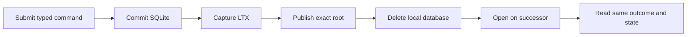
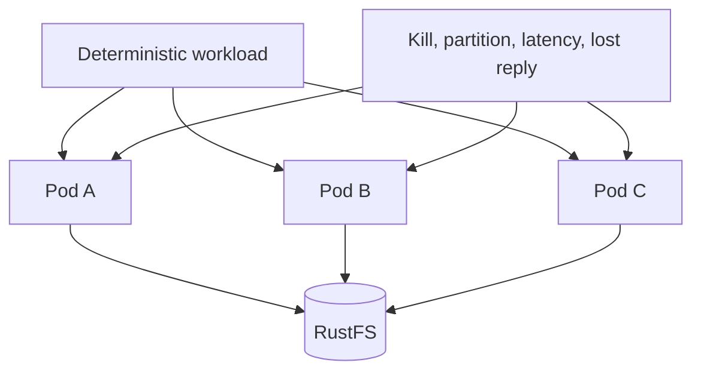

# Verify and qualify the Cell runtime

The runtime implementation covers identity, authority, SQLite execution, LTX publication, primitives, release control, private peers, and repository adapters. Production qualification still requires measured capacity and real multi-Pod network fault evidence.

| Document intent | Value |
| --- | --- |
| Content type | Verification plan |
| Audience | Implementers, reviewers, and release engineers |
| Goal | Map every runtime boundary to executable evidence and remaining release gates |

[Back to the Cell runtime index](README.md)

## Read the implementation map

Each layer has one owner and one primary evidence surface.

| Boundary | Primary source | Evidence |
| --- | --- | --- |
| Identity and Cell derivation | `src/identity.rs` | `tests/catalog.rs`, identity unit tests |
| Control CAS and transitions | `src/authority.rs`, `src/control.rs` | authority and actor tests |
| SQLite command ledger | `src/executor.rs`, `src/schema.rs` | `tests/actor.rs`, `tests/migration.rs` |
| Fixed SQL workers | `src/worker.rs` | `tests/workers.rs` |
| Publication and exact-root recovery | `src/publication.rs`, `crab-ltx` | `tests/publication.rs`, `crab-ltx/tests/cell_roots.rs` |
| Catalog | `src/catalog.rs` | `tests/catalog.rs` |
| Registry and codecs | `src/registry.rs`, `src/codec.rs` | `tests/registry.rs`, `tests/codec.rs` |
| Typed client and peer dispatch | `src/client.rs`, `src/peer.rs` | `tests/client.rs`, peer unit tests |
| SQL, KV, Blob, Queue, Cron, Workflow | `src/sql.rs`, `src/kv.rs`, `src/blob.rs`, `src/queue.rs`, `src/cron.rs`, `src/workflow.rs` | matching integration tests |
| Effects and activities | `src/effects.rs`, `src/activity_pool.rs` | `tests/effects.rs`, workflow tests |
| Scheduler | `src/scheduler.rs`, `src/maintenance.rs` | `tests/scheduler.rs` |
| Release control | `src/release.rs`, `src/release_progress.rs` | release unit tests and server command tests |
| Backup pins | `src/backup.rs`, `crab-ltx::CellReplica::reachable_objects` | runtime pin tests and server create/verify command tests |
| Immutable retention | `src/retention.rs`, `crab-storage::Store::list_stream` | mark/sweep tests and server maintenance-fence tests |
| Follower mechanics | `src/follower.rs`, `src/node_log.rs`, `src/node_log_recovery.rs` | verified-frame, object-covered queued-prefix, lost-ACK suffix, torn-tail, dual-proof, and seal/gather tests |
| State-observing streams | `src/client.rs`; `crab-http-server/src/state_stream.rs` | `tests/client.rs`; `CellStateStream` enforces per-output receipts, cancellation, deadlines, and fencing; `state_observing_body` adapts it to one-at-a-time HTTP chunks without a second queue |
| Product composition | `crab-http-server/src/cells/` | server route, restore, and lifecycle tests |

Celld-style follower durability is connected to product command and schema-
migration response release. A response may be released by either an exact
object-store root or a write-all follower proof. The actor retains the Cell
until the exact root is published, and takeover consumes any fleet-only tail
before serving. The remaining release gate is live multi-node fault and
capacity qualification in
[Follower durability and warm failover](failover-and-followers.md).

Use the map during review. A change to one boundary needs caller, callee, sibling, and source-loss evidence where applicable.

## Run design-contract validation

The documentation keeps executable SQL and Protocol Buffers inputs beside the crate.

```bash
node crates/crab-cell-runtime/docs/validate.mjs
```

The script checks:

- Runtime, KV, Blob, Queue, Cron, and Workflow schemas load in SQLite
- Foreign keys, lease states, token lengths, and unique constraints reject invalid rows
- The peer descriptor compiles and round-trips representative messages
- The peer contract defines messages, not a public service
- Markdown links, anchors, fences, and trailing whitespace remain valid

This script validates contracts. It does not prove runtime behavior.

## Run crate-level proof

Set a worktree-specific external Cargo target directory before every Rust command.

```bash
CARGO_TARGET_DIR=$HOME/Workspace/crabbuild-target/crab-b347 \
  cargo test -p crab-cell-runtime

CARGO_TARGET_DIR=$HOME/Workspace/crabbuild-target/crab-b347 \
  cargo test -p crab-ltx --features replica

CARGO_TARGET_DIR=$HOME/Workspace/crabbuild-target/crab-b347 \
  cargo test -p crab-http-server
```

Run Clippy for all changed crates:

```bash
CARGO_TARGET_DIR=$HOME/Workspace/crabbuild-target/crab-b347-clippy \
  cargo clippy -p crab-ltx -p crab-cell-runtime \
  -p crab-http-server --all-targets -- -D warnings
```

Use the checkout's actual stable target suffix when it differs from `b347`.

Release jobs bind schema-v5 qualification matrices and threshold-profile
digests to the exact tagged source, published image manifest, and raw cluster
evidence. The protected bundle must contain exact matrices for
`local-provider-v1`, `scale-v1`, `compatibility-v1`, each of
`provider-{s3,gcs,azure}-v1`, and each of `fault-{s3,gcs,azure}-v1`.
The crate-owned validator requires a pinned Ed25519 qualification public key,
canonical receipts, passing thresholds, exact source/image identity, and every
matrix row. Protected receipts also retain and verify a `release` execution
profile; debug or otherwise non-release runs cannot satisfy the release gate.
Fixture or self-signed evidence cannot satisfy the release gate.
The release job also compares the supplied protected profile byte-for-byte with
the checked-in profile from the tagged source before invoking the validator.
GitHub's workflow attestation remains the trust anchor for the release job and
source identity.

```bash
CARGO_TARGET_DIR=$HOME/Workspace/crabbuild-target/crab-main \
  cargo run -p crab-cell-runtime --bin qualification_receipt --locked -- \
  verify-matrix qualification-matrix.json "$SOURCE_SHA" "$IMAGE_DIGEST" \
    scale-v1.json "$QUALIFICATION_SIGNER"
```

This command verifies pinned attestation, canonical encoding, passed threshold
metrics, source/image identity, and BLAKE3 digests of every raw artifact. It
does not turn local or in-memory evidence into provider qualification; the
release matrix still needs the real RustFS/Kubernetes and multi-GiB runs below.
When a threshold profile other than `pr-contract-v1` is supplied, the CLI
requires the pinned signer argument and applies the protected freshness and
clock-skew gate. The profile-less form below is retained only for generic
historical receipt inspection and is not a release decision.

Each profile is verified as one bounded matrix instead of a caller-owned row
loop. `QualificationMatrixManifest` requires exactly one entry for each of
these rows: `protocol`, `storage`, `publication`, `warm-path`, `churn`,
`fleet`, `failover`, `primitives`, `accounting`, and `compatibility`. Each entry
binds a relative receipt path and one or more relative raw-artifact paths. The
manifest and every receipt are canonical JSON; absolute paths, parent-directory
components, duplicate rows, missing rows, dirty receipts, source/image drift,
and any artifact digest mismatch fail closed. The release job runs this
verification independently for every required profile, so a valid scale matrix
cannot substitute for provider or Kubernetes fault evidence.

After the release job writes the ten row receipts and their raw artifacts into
each protected matrix directory, verify one profile-bound matrix in a fresh
process:

```bash
CARGO_TARGET_DIR=$HOME/Workspace/crabbuild-target/crab-main \
  cargo run -p crab-cell-runtime --bin qualification_receipt --locked -- \
  verify-matrix \
  protected/qualification-matrix.json "$SOURCE_SHA" "$IMAGE_DIGEST" \
  protected/scale-v1.json "$QUALIFICATION_SIGNER"
```

Repeat that command for every matrix/profile pair listed above; the release
workflow does not accept a scale matrix as a substitute for any other profile.
The matrix verifier recomputes every raw digest, checks the primary artifact
digest for each receipt, and requires all rows to use the supplied source and
image identity. It is a release-evidence check only; it does not promote local
or in-memory runs to RustFS, Kubernetes, matched-latency, or capacity proof.

The local RustFS qualification pass on 2026-09-18 used one isolated bucket and
unique prefixes with explicit credentials (the credentials were not written to
artifacts). It passed the LTX round trip, Cell source-loss takeover and
retention sweep, HTTP collaboration/takeover, native HTTP push, and receive
fault matrix. The same checkout passed the process-level movement probes and
the hydration shutdown-cancellation regression against the in-memory provider.
The provider-backed
`rustfs_mixed_primitive_inventory_churn_preserves_exact_roots` test also
passed Queue/Workflow retained-work protection, exact-root restore, and
capacity reuse against its isolated prefix.
These commands are provider evidence for iteration, not release receipts;
protected release jobs must consume a schema-v5 matrix signed by the pinned
qualification key and bound to the tagged source, immutable image, profile,
and every raw artifact.
Fault profiles additionally require a named injected fault, a non-`none` fault
schedule digest, and a monotonic ownership transition; a signed no-op receipt
cannot stand in for Kubernetes fault evidence.

```bash
AWS_ACCESS_KEY_ID="$AWS_ACCESS_KEY_ID" \
AWS_SECRET_ACCESS_KEY="$AWS_SECRET_ACCESS_KEY" \
CRAB_LTX_TEST_BUCKET="$BUCKET" \
CRAB_LTX_TEST_ENDPOINT="$ENDPOINT" \
CARGO_TARGET_DIR=$HOME/Workspace/crabbuild-target/crab-rustfs \
  cargo test -p crab-ltx --features replica --test cell_roots \
  exact_root_inventory_verifies_every_remote_dependency --locked -- --exact

AWS_ACCESS_KEY_ID="$AWS_ACCESS_KEY_ID" \
AWS_SECRET_ACCESS_KEY="$AWS_SECRET_ACCESS_KEY" \
CRAB_CELL_TEST_BUCKET="$BUCKET" \
CRAB_CELL_TEST_ENDPOINT="$ENDPOINT" \
CRAB_CELL_TEST_PREFIX="$UNIQUE_PREFIX" \
CARGO_TARGET_DIR=$HOME/Workspace/crabbuild-target/crab-rustfs \
  cargo test -p crab-cell-runtime --test actor \
  rustfs_source_loss_takeover_restores_exact_root_and_continues_publication \
  --locked -- --ignored --exact

AWS_ACCESS_KEY_ID="$AWS_ACCESS_KEY_ID" \
AWS_SECRET_ACCESS_KEY="$AWS_SECRET_ACCESS_KEY" \
CRAB_CELL_TEST_BUCKET="$BUCKET" \
CRAB_CELL_TEST_ENDPOINT="$ENDPOINT" \
CRAB_CELL_TEST_PREFIX="$UNIQUE_PREFIX-mixed" \
CARGO_TARGET_DIR=$HOME/Workspace/crabbuild-target/crab-rustfs \
  cargo test -p crab-cell-runtime --test actor \
  rustfs_mixed_primitive_inventory_churn_preserves_exact_roots \
  --locked -- --ignored --exact

AWS_ACCESS_KEY_ID="$AWS_ACCESS_KEY_ID" \
AWS_SECRET_ACCESS_KEY="$AWS_SECRET_ACCESS_KEY" \
CRAB_CELL_TEST_BUCKET="$BUCKET" \
CRAB_CELL_TEST_ENDPOINT="$ENDPOINT" \
CRAB_CELL_TEST_PREFIX="$UNIQUE_PREFIX-retention" \
CARGO_TARGET_DIR=$HOME/Workspace/crabbuild-target/crab-rustfs \
  cargo test -p crab-cell-runtime --lib \
  retention::tests::rustfs_maintenance_collection_preserves_live_and_pinned_graphs \
  --locked -- --ignored --exact

AWS_ACCESS_KEY_ID="$AWS_ACCESS_KEY_ID" \
AWS_SECRET_ACCESS_KEY="$AWS_SECRET_ACCESS_KEY" \
AWS_ENDPOINT_URL_S3="$ENDPOINT" AWS_ALLOW_HTTP=true \
AWS_VIRTUAL_HOSTED_STYLE_REQUEST=false \
QUALIFICATION_BUCKET="$BUCKET" QUALIFICATION_PREFIX="qualification/http-receive-$UNIQUE_PREFIX" \
CARGO_TARGET_DIR=$HOME/Workspace/crabbuild-target/crab-rustfs \
  cargo test -p crab-http-server --lib \
  server::receive_fault_tests::receive_faults_rustfs \
  --locked -- --ignored --exact

AWS_ACCESS_KEY_ID="$AWS_ACCESS_KEY_ID" \
AWS_SECRET_ACCESS_KEY="$AWS_SECRET_ACCESS_KEY" \
CRAB_HTTP_CELL_TEST_BUCKET="$BUCKET" \
CRAB_HTTP_CELL_TEST_ENDPOINT="$ENDPOINT" \
CRAB_HTTP_CELL_TEST_PREFIX="http-$UNIQUE_PREFIX" \
CARGO_TARGET_DIR=$HOME/Workspace/crabbuild-target/crab-rustfs \
  cargo test -p crab-http-server --lib \
  server::peer_e2e_tests::rustfs_public_collaboration_reaches_remote_owner_and_publishes_ltx \
  --locked -- --ignored --exact

AWS_ACCESS_KEY_ID="$AWS_ACCESS_KEY_ID" \
AWS_SECRET_ACCESS_KEY="$AWS_SECRET_ACCESS_KEY" \
AWS_ENDPOINT_URL_S3="$ENDPOINT" AWS_ALLOW_HTTP=true \
AWS_VIRTUAL_HOSTED_STYLE_REQUEST=false \
QUALIFICATION_BUCKET="$BUCKET" QUALIFICATION_PREFIX="qualification/http-push-$UNIQUE_PREFIX" \
CARGO_TARGET_DIR=$HOME/Workspace/crabbuild-target/crab-rustfs \
  cargo test -p crab-http-server --lib \
  server::receive_tests::native_http_push_rustfs \
  --locked -- --ignored --exact
```

The coordination simulator has a deterministic seed replay entry point in the
normal runtime test binary. It never starts I/O or Tokio work:

```bash
CRAB_COORDINATION_SEED=41 CRAB_COORDINATION_STEPS=256 \
  CARGO_TARGET_DIR=$HOME/Workspace/crabbuild-target/crab-main \
  cargo test -p crab-cell-runtime coordination_sim::replay_requested_seed_from_environment \
  --locked -- --exact --nocapture
```

## Prove the mutation contract

Mutation tests must cover the complete durability boundary.



Required cases are:

| Case | Expected proof |
| --- | --- |
| Replay | Same request ID and digest returns stored outcome without rerunning handler |
| Identity conflict | Same request ID with different digest is a durable rejection |
| Caller cancellation | Accepted command still publishes and later resolves |
| Lost CAS response | Exact successor is adopted; a different winner fences |
| Source loss | Successor restores exact database and outcome from object storage |
| Recovery state | Exact-root activation CASes `Recovering` to `Serving` before returning a handle |
| Timeout | Admission closes; tentative local state never publishes |
| Panic | Affected Cell fences; worker thread remains usable |
| Drain | Accepted commands publish before SQLite close and authority release |

Mock-only tests do not satisfy source-loss or publication proof.

`tests/publication.rs` injects the ambiguous publication window at the object
store boundary: the backend accepts the control `Update`, then the decorator
returns a connection-reset error. The publisher must reload the exact root,
clear the retained cut, and return the recorded outcome without invoking the
SQL handler again. This proves local reconciliation; the three-Pod gate must
still inject the same lost response through the deployed network path.

## Prove storage and LTX behavior

`crab-ltx` evidence must cover:

- Managed capture and explicit snapshots stream pages to atomic local files,
  then validate format and BLAKE3 without a database-sized resident buffer
- Pending cuts stay owned until the exact root is confirmed
- Destination capacity is reserved before full restore downloads
- Sparse hydration verifies directory, frame, and page checksums
- Truncate and regrow cannot reuse invalid locators
- Incremental roots load only touched directory paths
- Full restore installs without replacing an existing destination
- Scheduled compaction promotes eligible singleton and multi-segment levels
- Compaction preserves transaction ID, checksum, sequence, and schema
- Injected filesystem and executor failures clean owned scratch state
- Cross-epoch continuation starts from the authoritative root
- Backup pins bind release metadata, catalog revisions, exact controls, and every reachable immutable root dependency
- Offline retention verifies current controls and every pin before deleting,
  rejects owned controls, honors grace and deletion bounds, and preserves
  unknown object layouts
- Backup creation remains advertised from before its final `Ready` check until
  its pin pointer is durable, so maintenance cannot miss an in-flight pin

Repeat remote storage tests against real RustFS. In-memory object storage cannot prove provider ETag and streaming behavior.

The server's real-RustFS backup smoke must create a pin, repeat creation with
the same ID, verify it independently, remove one isolated test dependency and
observe fail-closed verification, then republish that content-addressed
dependency from a second pin. It must then restore the pin twice into a fresh
prefix, observe identical summaries, inspect unowned `Idle` authority, and use
a separate process configured only for the destination prefix to verify the
complete graph with the pinned release.

The ignored qualification tests require one fresh bucket and a unique Cell prefix:

```bash
CRAB_LTX_TEST_BUCKET="$BUCKET" \
CRAB_LTX_TEST_ENDPOINT="$ENDPOINT" \
cargo test -p crab-ltx --features replica --test cell_roots \
  exact_root_inventory_verifies_every_remote_dependency -- --exact

CRAB_CELL_TEST_BUCKET="$BUCKET" \
CRAB_CELL_TEST_ENDPOINT="$ENDPOINT" \
CRAB_CELL_TEST_PREFIX="$UNIQUE_PREFIX" \
cargo test -p crab-cell-runtime --test actor \
  rustfs_source_loss_takeover_restores_exact_root_and_continues_publication \
  -- --ignored --exact

CRAB_CELL_TEST_BUCKET="$BUCKET" \
CRAB_CELL_TEST_ENDPOINT="$ENDPOINT" \
CRAB_CELL_TEST_PREFIX="$UNIQUE_PREFIX" \
cargo test -p crab-cell-runtime --lib \
  retention::tests::rustfs_maintenance_collection_preserves_live_and_pinned_graphs \
  -- --ignored --exact

CRAB_HTTP_CELL_TEST_BUCKET="$BUCKET" \
CRAB_HTTP_CELL_TEST_ENDPOINT="$ENDPOINT" \
CRAB_HTTP_CELL_TEST_PREFIX="$UNIQUE_PREFIX" \
cargo test -p crab-http-server --lib \
  server::peer_e2e_tests::rustfs_public_collaboration_reaches_remote_owner_and_publishes_ltx \
  -- --ignored --exact --nocapture
```

The Cell test publishes a command on one session, removes its local database,
takes over from a second session, resolves the original request from the exact
root, and publishes the next sequence. CI runs both tests against a pinned
RustFS image.

The same CI job also runs `crab-http-server` through public HTTP and private
mTLS forwarding to a heartbeat-renewed remote owner. Native Git creates main
and feature commits; public APIs then publish an issue, comment, label, status,
check run, pull request and comment, release and Git tag, and branch protection
through SQLite/LTX on that RustFS origin. The test stops the owner endpoint,
withdraws its current advertisement, publishes the authoritative fenced
takeover, deletes the old local Cell directory, and restores the exact root on
the ingress runtime. It reads every saved product surface again, publishes the
next sequence, clones the feature branch, resolves the release tag, and asserts
that no retired `app/v1` collaboration object exists. This combines the product
network, source-loss, hard-cut, and storage boundaries; it does not replace the
three-Pod kill and partition matrix below.

The local Compose cluster qualification adds a real three-process owner-loss
case on one host. It writes through node B, verifies private forwarding from A
and C, kills B without draining, waits for B's signed session advertisement to
expire, and requires C to restore the same root at a higher epoch before it can
publish the next sequence. Restarted B has empty local Cell storage and must
route to C. The script emits the exact sessions, epochs, root, sequences, and
live admission envelopes as JSON. Before workload, it also compares every
node's `cells capacity --json --live` disk and active-Cell ceilings with the
corresponding runtime Prometheus gauges, the signed placement block returned by
`cells node --session SESSION --json`, and an independent probe of the mounted
Cell filesystem with df (1 MiB tolerance); a mismatch fails the script and the
receipt records all parity results. Because the processes share one network
namespace, this proves local process, signed-placement, and local-disk loss
behavior but not Pod networking or partition behavior.

The shipped Kubernetes qualification script adds one real three-Pod owner-loss
case. It reads the durable repository Cell control, maps the serving endpoint to
a ready Pod, force-deletes that Pod without grace, then requires a different
session at a higher epoch to restore the exact digest, transaction ID, checksum,
and commit sequence and serve the public status before publishing a strictly
newer root and a second status visible through another replica. Before takeover
traffic, it queries the
old boot session through `cells node --session SESSION --json` until the signed
advertisement is no longer live; Pod deletion alone is not expiry evidence.
That case is not evidence until its
signed provider receipt exists, and it does not replace the remaining partition
and commit-window faults. Browser E2E is intentionally outside this gate.

## Emit and verify qualification receipts

Release evidence uses the signed, version-3 `QualificationReceipt` contract in
`src/qualification.rs`. A receipt is bound to the source revision, artifact
digest, execution profile, topology, workload seed, bucket-call count, peak
resident set, bounded named measurements, start/finish timestamps, a digest of
the exact fault schedule, every retained raw-artifact digest, and sampled
epoch/published-root ownership watermarks (latency/duration measurements are
recorded by the harness as metrics). The schema is versioned and rejects
unknown fields, dirty worktrees, oversized labels, embedded credentials, and
forged signatures. The runner signs the canonical JSON after recording the
artifact digest; verification recomputes that digest and requires it to appear
in the raw-artifact set before accepting the receipt.

Consumers call `receipt.verify_for(expected_source, expected_image, artifact)`
after decoding. This rejects a validly signed receipt issued for another
source revision, image, or raw artifact; signature validity alone is not release
eligibility.

The contract test surface is:

```bash
CARGO_TARGET_DIR=$HOME/Workspace/crabbuild-target/crab-qualification-receipts \
  cargo test -p crab-cell-runtime qualification --lib --locked
```

This proves receipt encoding, signature verification, artifact binding, dirty
source rejection, forged-field rejection, complete matrix membership, and
multi-artifact digest recomputation. It does not claim that a local receipt
proves RustFS, Kubernetes, partition, or capacity behavior. Protected
qualification jobs must attach the emitted receipt to the exact source and
image digest and feed it through a fresh verifier before release consumes it.

## Prove each primitive through recovery

Primitive tests require more than procedure-level SQL assertions.

| Primitive | Recovery evidence |
| --- | --- |
| SQL | Publish a batch, delete local DB, restore, query the same rows |
| KV | Apply checks and writes, restore, preserve versions and TTL behavior |
| Blob | Complete multipart publication, restore, preserve ETag and range bytes |
| Queue | Publish claim, restore, validate lease, reclaim expiry, complete attempt |
| Cron | Publish occurrence effect, restore, preserve next due time and generation |
| Workflow | Pin definition, publish transition, restore, run retained definition |
| Activity | Publish claim, lose owner, take over, reclaim lease, complete next attempt |
| Effect | Publish source intent, deduplicate destination, resolve ambiguity, acknowledge source |

Also prove output, row, payload, attempt, lease, and retention bounds.

## Prove product integration

`crab-http-server` must show a user action, a real durable side effect, and a visible result.

The repository path needs these cases:

1. Start the server with real object storage
2. Create or adopt a repository and verify an empty Cell root
3. Exercise issue, comment, label, status, check, pull, release, and settings routes
4. Delete the owning node's local Cell files
5. Route the next request through another node
6. Verify the public repository API reads the restored state
7. Exercise public Git clone, fetch, and push independently of collaboration SQLite
8. Confirm shutdown drains both HTTP/Git work and Cell publication

The hard cut test must also prove that retired `app/v1` collaboration objects are never read.

## Run multi-Pod fault qualification

Unit and in-process integration tests don't prove network ownership behavior. Run at least three Pods against one RustFS origin.



Inject these faults while commands continue:

- Kill the current owner before and after SQLite commit
- Drop the control-CAS response after the origin accepts it
- Delay immutable uploads
- Partition one management endpoint
- Expire a node advertisement
- Exhaust local disk admission
- Restart with no local SQLite files
- Roll from one compatible image to another
- Enter maintenance with stored incompatible work

After each fault, verify one authoritative owner, monotonic sequence, stable replay, no false success, and no leaked activity or effect lease.

## Capacity qualification

The target workload is 1,000 to 10,000 active databases per node, 100 MB to 5,000 MB per database, and 1,000 aggregate transactions/s per node.

Qualify each node profile separately:

| Profile | Process-visible resources | Required matrix |
| --- | --- | --- |
| Small | 1–2 CPU credits, 2–4 GiB memory, 50–100 GiB SSD | Minimum supported workload, admission behavior, drain under pressure |
| Medium | 4–8 CPU credits, 8–16 GiB memory, 100–200 GiB SSD | Mixed repository sizes, sustained command target, sparse takeover |
| Large | 16 CPU credits, 32–64 GiB memory, 500–1,000 GiB SSD | Maximum active-Cell target, 5,000 MB restore, compaction and renewal load |

Before starting traffic, capture the exact resource-derived envelope from every
node. A profile label or Kubernetes request is not evidence of the resources
visible to the process. The live Kubernetes qualifier rejects a Pod whose
cgroup-aware CPU credits, effective memory limit, or configured and enforced
local-disk capacity falls outside the selected profile. Effective capacity is
the smaller of the backing filesystem and the configured limit. The report
also binds that limit to the Pod's `emptyDir.sizeLimit`; current filesystem
free space remains a separate admission input.

```bash
kubectl --namespace crab exec POD -- \
  crab-http-server --config /etc/crab/http-server/server.toml \
  cells capacity --json --live > capacity-before.json
kubectl --namespace crab exec POD -- \
  crab-http-server --config /etc/crab/http-server/server.toml \
  cells metrics > metrics-before.prom
```

Run the bounded HTTP harness from a dedicated load generator. Each read
`--target` has the form `NAME=CONCURRENCY@/PATH`. A mutation has the form
`NAME=CONCURRENCY@/PATH|BODY_FILE`; all targets run simultaneously.
Redirect stdout to retain its versioned JSON receipt. Put private cookies or
authorization values in a mode-0600 header file, never in command arguments.

Use a disposable repository for mutation qualification because every successful
request creates durable state. The JSON template must contain the exact
top-level marker `"request_id":"{{request_id}}"`; the harness replaces it with
a new UUIDv7 for every request.

The release Kubernetes qualifier builds this harness from the exact tagged
source and drives 1,000 aggregate mutation requests/s through each ready Pod
for 60 seconds. The checked-in profile uses 64 distinct commit-status targets
distributed across eight repository Cells (24 commits per Cell); this is the
node-wide aggregate capacity proof while retaining the same per-commit
submission history. Each Pod receives eight targets per Cell, and the receipt
records a configured 125 target requests/s per Cell. Retain a one-Cell run as a
separately labelled hot-Cell limit test. Every attested receipt retains each Pod
UID, p50/p95/p99 latency, success and admission counts, plus capacity envelopes
before and after load.

```json
{"request_id":"{{request_id}}","title":"load qualification","body":"durable command"}
```

```bash
CARGO_TARGET_DIR=$HOME/Workspace/crabbuild-target/crab-load-generator \
  cargo run -p crab-http-server --release --example qualify_http_load --locked -- \
  --base-url https://git.example.com \
  --target 'refs=4@/api/repos/team/project/refs' \
  --target 'commits=8@/api/repos/team/project/commits?rev=main&limit=20' \
  --target 'readme=4@/api/repos/team/project/file?rev=main&path_hex=524541444d452e6d64' \
  --mutation 'issues=16@/api/repos/team/disposable-load/issues|/secure/new-issue.json' \
  --aggregate-requests-per-second 1000 \
  --duration-seconds 300 \
  --warmup-seconds 15 \
  --header-file /secure/load-headers \
  > http-load.json
```

The harness fully consumes each body and reports the method, 2xx responses, admission
rejections, unexpected responses, transport/body-limit failures, bytes,
throughput, and all-response plus successful-response latency percentiles. It
checks `/livez` before and after traffic. HTTP 429 is an expected overload
signal; any other non-2xx response, transport failure, oversized body, or
unhealthy liveness check makes the command fail after writing the receipt. A
fixed aggregate-rate run also fails when successful responses fall below 95%
of its configured request count, so 429 responses cannot satisfy the 1,000 TPS
capacity target.

The report separates CPU-bounded blocking jobs, dirty-memory-bounded jobs, and
the two-slot full-recovery ceiling. Store the report with the immutable image
digest, profile, workload parameters, and live measurements. Reject a receipt
when its observed active-Cell, resident-byte, retained-byte, or local-disk capacity differs
from the corresponding private metrics sample taken before traffic, or when a
live usage gauge exceeds its advertised capacity.

The Kubernetes qualification receipt records this report for every original
Pod, every Pod after the zero-unavailable rollout, and every Pod after forced
owner loss. Each entry is bound to the Pod UID so a replacement cannot inherit
another process's startup envelope.

Measure:

- Resident set size per active Cell and per workload class
- File descriptors per Cell and under HTTP/Git load
- Local bytes for main DB, WAL, retained LTX, sparse pages, and scratch
- Command p50, p95, and p99 latency
- Object-store requests and bytes per command
- Renewal updates per second
- Scheduler pass duration and due lag
- Takeover time with cold and warm directory caches
- Full restore and sparse first-read time
- Compaction throughput and peak scratch
- Graceful shutdown duration

Reject overload before SQLite or remote download starts. Qualification fails if the process swaps, exceeds its file-descriptor reserve, violates a five-second scheduler pass, or admits work beyond its shared disk budget.

## Apply the production gate

Production readiness requires all of these gates:

- Contract validation passes
- Runtime, LTX, and server tests pass
- Clippy and architecture guardrails pass
- Real RustFS source-loss recovery passes
- Three-Pod fault qualification passes
- Every supported node profile has measured admission envelopes
- Repository API and Git operations pass end to end
- Backup and same-bucket isolated-prefix restore pass
- Hard cutover rehearsal confirms no legacy collaboration reads

Until the last gate passes, describe the implementation as functionally complete but not production-qualified.
