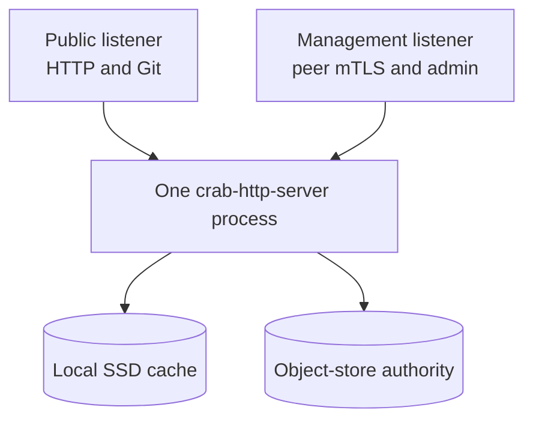
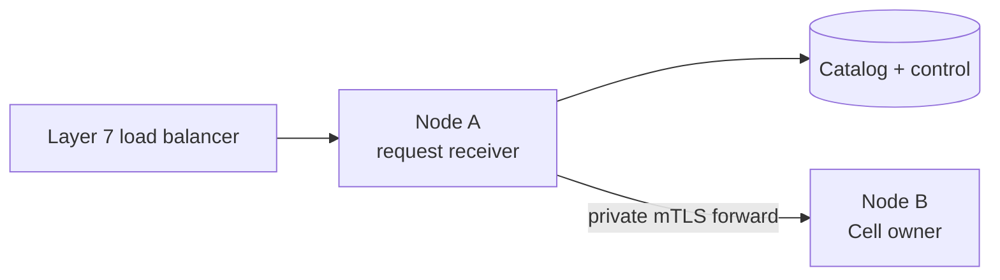
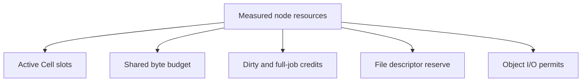
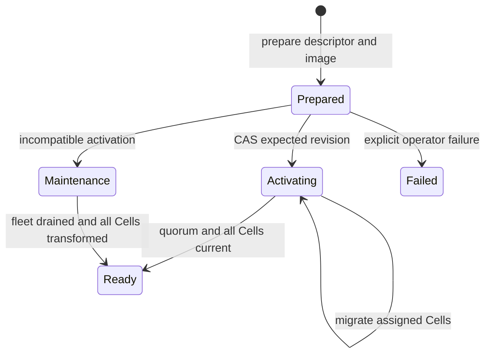

# Deploy and operate a Cell-enabled Crab fleet

Run one `crab-http-server` process per Kubernetes Pod or virtual machine. Nodes share one object-store origin, forward private requests over mutual TLS (mTLS), and advertise release and capacity state in the origin.

| Document intent | Value |
| --- | --- |
| Content type | How-to and operations reference |
| Audience | Crab operators and release engineers |
| Goal | Configure, size, roll out, drain, restore, and observe a Cell fleet |

[Back to the Cell runtime index](README.md)

The current deployment has no follower durability tier. The target node-session
lease, follower placement, recovery-only startup listener, and warm failover
ordering are defined in
[Follower durability and warm failover](failover-and-followers.md).

## Configure one process per node

The existing HTTP server owns Cell runtime construction. Configuration supplies the authoritative object store, local volume, public listener, management listener, and peer identity.



Startup fails before readiness when any required boundary is invalid:

- Object storage cannot prove strict create and conditional update behavior
- Root identity differs from configured tenant or application
- Compiled registry differs from the selected release descriptor
- Local memory, disk, or file-descriptor floor is unavailable
- Peer certificate, fleet, release, or node advertisement is invalid
- The first complete scheduler scan has not finished

The server doesn't open a second public primitive listener.

## Route through any healthy node

The external load balancer doesn't need Cell affinity. Any node can receive a public request.



The receiving node resolves the exact owner from `control.json` and its signed live advertisement. It dispatches locally when it owns the Cell, otherwise it forwards once.

A stale endpoint retry is allowed only when the first attempt definitely did not start. An ambiguous mutation returns evidence for `Resolve`.

## Advertise node health and capacity

Each node publishes a signed advertisement every three seconds. The record binds:

- Fleet and session IDs
- Certificate subject public key info
- Image and release digests
- Compiled registry inventory
- Publicly routable peer endpoint
- Free memory, disk, and job credits
- Scheduler progress

Advertisements expire after 15 seconds. A node with no scheduler progress for 15 seconds or zero advertised capacity leaves rendezvous assignment until it reports progress and capacity again.

Local admission remains authoritative. An advertisement cannot force a node to accept work after its measured budget is exhausted.

## Size node profiles and admission

The runtime derives active-Cell limits from measured resources. Profile names are operator guidance, not fixed performance claims.

| Profile | vCPU | Memory | Local SSD | Intended use |
| --- | ---: | ---: | ---: | --- |
| Small | 1 to 2 | 2 to 4 GiB | 50 to 100 GB | Development and low-traffic fleets |
| Medium | 4 to 8 | 8 to 16 GiB | 100 to 200 GB | General production nodes |
| Large | 16 | 32 to 64 GiB | 500 GB to 1 TB | Dense ownership and high aggregate throughput |

Startup rejects less than 2 GiB memory or 20 GiB usable disk.

Resource admission accounts these consumers:



Each open `ManagedDb` charges:

- Three SQLite connection page caches at 64 KiB each
- Eight file descriptors
- Runtime actor and mailbox bytes
- Sparse-page cache allowance
- Native handler allowance

The shared byte budget covers SQLite files, WAL, retained LTX, sparse pages,
and Git/LFS/Release staging. Full restore and compaction use a separate weighted
scratch budget; after admission, the server remeasures actual free space against
both budgets and the node reserve before any remote body download.

Large jobs reserve two database sizes plus 64 MiB scratch and 64 MiB memory. Concurrent large jobs cap at the smaller of vCPU count and two, then apply byte admission.

The 1,000 to 10,000 open-Cell and 1,000 command/s aggregate targets require [capacity qualification](delivery.md#capacity-qualification). A profile does not guarantee either number before measurement.

## Build one canonical release

The deployable unit is the complete `crab-http-server` image.

```text
Rust modules + migrations + Cargo.lock + React assets
                         |
                         v
              crab-http-server image
                         |
                         v
             canonical registry descriptor
```

The descriptor includes:

| Field | Contract |
| --- | --- |
| `version` | Integer `1` |
| `runtime` | `crab-http-server` |
| `peer_versions` | Sorted unique versions; V1 supports `1` |
| `modules` | At most 128 canonical module entries |
| `namespaces` | At most 128 stable namespace entries |
| `build` | Source revision and `Cargo.lock` digest |

The descriptor has a 256 KiB limit. Its BLAKE3 digest identifies the compiled release. The operator records the OCI image SHA-256 digest in release state.

## Activate compatible releases

The administrative commands operate through the existing server binary:

```text
crab-http-server --config config.toml cells release inspect --json
crab-http-server --config config.toml cells capacity --json --live
crab-http-server --config config.toml cells release bootstrap --image sha256:1234567890
crab-http-server --config config.toml cells release prepare \
  --expected-revision 7 --image sha256:1234567890
crab-http-server --config config.toml cells release activate \
  --expected-revision 8 --strategy compatible \
  --minimum-eligible-nodes 3
crab-http-server --config config.toml cells release status
crab-http-server --config config.toml cells status --owner team --name repository
```

The repository status command reads the durable control object without opening
the Cell or changing ownership. Use its versioned JSON to map a serving endpoint
to a fleet member during takeover qualification.

The capacity command with `--live` reads the startup envelope retained by the
running server: process memory limit, free local disk, file descriptor limit,
CPU-derived job credits, and the resulting admission budgets. Without `--live`,
it calculates a preflight envelope for the short-lived command process instead.
Neither mode claims a throughput result. Capture the live report before every
capacity run and compare it with the node-wide gauges during the workload.

```json
{
  "version": 1,
  "resources": {
    "memory_bytes": 2147483648,
    "free_disk_bytes": 53687091200,
    "available_file_descriptors": 1048570,
    "job_credits": 2
  },
  "admission": {
    "active_cells": 2457,
    "retained_bytes": 80530636,
    "blocking_jobs": 2,
    "dirty_jobs": 2,
    "recovery_jobs": 2,
    "scratch_bytes": 14316208128,
    "local_disk_bytes": 28632416256,
    "disk_reserve_bytes": 10737418240
  },
  "reservations": {
    "active_cell_page_cache_bytes": 196608,
    "active_cell_native_bytes": 65536,
    "active_cell_file_descriptors": 8,
    "dirty_job_memory_bytes": 67108864,
    "maximum_recovery_jobs": 2
  }
}
```

Compatible activation follows this state machine:



Before `Ready`, activation verifies:

1. Candidate descriptor bytes equal the running binary
2. The requested number of eligible nodes advertises the exact release
3. Every catalog shard remains revision-stable during the scan
4. Every non-tombstoned Cell uses current code and maximum schema
5. The eligible-node quorum still holds immediately before the final CAS

Prepare never changes the current release.

## Use maintenance for incompatible changes

Maintenance activation stops normal serving, drains the fleet, and runs one signed zero-capacity maintenance executor.

The executor owns one SQL worker and one active-Cell slot. It walks the catalog sequentially through the same exact-root migration path used by normal nodes.

Before final `Ready`, it checks persisted work that may reference removed behavior:

- `sys_requests`
- `sys_inbox`
- `sys_effects`
- Queue messages and producer dedup rows
- Workflow runs

Any matching row keeps the release in maintenance. The runtime doesn't guess payload compatibility. Operators must drain retention or compile a purpose-built transform.

The same fence can reclaim unreachable immutable Cell objects after migration:

```bash
crab-http-server --config config.toml cells release activate \
  --expected-revision 8 \
  --strategy maintenance \
  --retention-grace-hours 168 \
  --retention-max-deletes 10000
```

Omit both retention flags to run migration only. `--retention-max-deletes`
requires a nonzero grace and accepts 1 through 100,000; omitting the limit while
supplying a grace uses 10,000. The grace is measured from each object's provider
modification time.

Collection runs only after the executor proves it is the sole advertised
session and every current control is unowned. It verifies live controls and all
retained backup pins into a disk-backed mark set before streaming the object
inventory. Unknown layouts are skipped. The structured completion log records
listed, candidate, reachable, grace, eligible, and deleted counts.

If eligible objects exceed the selected deletion bound, the command returns an
incomplete-retention error and deliberately leaves the release in
`Maintenance`. Repeat the identical activation command and expected revision;
the operation re-marks authority before deleting the next bounded batch. Start
the fleet only after the activation returns a `Ready` release.

## Deploy on Kubernetes

Use a `Deployment` for stateless process identity and a per-Pod local volume for cache data. Object storage remains authoritative.

```yaml
apiVersion: apps/v1
kind: Deployment
metadata:
  name: crab-http-server
spec:
  replicas: 3
  template:
    spec:
      terminationGracePeriodSeconds: 180
      containers:
        - name: crab
          image: registry.example/crab@sha256:1234567890
          args:
            - --config
            - /etc/crab/server.toml
            - --peer-advertise-host
            - $(CRAB_POD_IP)
          readinessProbe:
            exec:
              command: [crab-http-server, --config, /etc/crab/server.toml, healthcheck]
          volumeMounts:
            - { name: cell-cache, mountPath: /var/lib/crab }
```

The snippet shows topology, not a complete production manifest. The shipped
chart adds a Downward API Pod IP, a stable peer TLS server name, peer Secret
mounts, exec readiness, TCP liveness, a three-replica floor, PDB `minAvailable:
2`, and same-selector management ingress. Supply object-store identity,
resource requests, edge ingress, and provider-specific placement through the
deployment environment.

Readiness requires:

- Runtime startup completed
- Release permits this compiled registry
- Node advertisement is live
- First scheduler pass completed
- Terminal drain has not started

Liveness should report process health, not temporary capacity exhaustion.

## Drain without split ownership

On SIGTERM or release exclusion, the server:

1. Closes readiness and new HTTP, Git, and Cell admission
2. Advertises zero capacity while draining
3. Finishes accepted HTTP and Git work
4. Stops schedulers and cooperatively cancels activity supervisors
5. Publishes every accepted Cell command
6. Closes SQLite handles
7. Releases exact owned controls to `Idle`
8. Joins SQL and blocking worker pools
9. Withdraws its exact node advertisement

Set the Kubernetes grace period above the server's bounded drain budget. A forced kill remains recoverable through stale-owner takeover, but it increases unavailable time.

## Back up immutable roots and release metadata

A backup records object-store data, not local cache volumes.

Include:

- Root identity
- Release records and immutable descriptors
- Catalog heads and immutable pages
- Cell control records
- Every immutable object reachable from pinned roots
- Node-independent application configuration needed to recreate the fleet

Backup traversal pins its start revisions and strict-creates the pin only after
every referenced object verifies. Restore verifies that pin before copying.

Create a nonzero 16-byte pin ID and verify it independently:

```bash
crab-http-server --config /etc/crab/server.toml cells backup create \
  --pin 11112222333344445555666677778888
crab-http-server --config /etc/crab/server.toml cells backup verify \
  --pin 11112222333344445555666677778888
crab-http-server --config /etc/crab/server.toml cells backup restore \
  --pin 11112222333344445555666677778888 \
  --destination-prefix recovery/restore-2026-09-16
```

Both commands print versioned JSON with the application and pin IDs, creation
time, control count, nonempty catalog-shard count, release-snapshot digest, and
`verified: true`. Creation is idempotent by pin ID. Verification rereads the
release metadata, catalog pages, canonical controls, and every immutable LTX
dependency; it does not trust local SQLite files or caches.

Restore accepts only a canonical prefix different from the configured source
root and only a pin whose selected release was `Ready`. The command verifies
the source graph, uses same-bucket conditional copies, re-verifies every
destination root, removes captured owners from restored controls, and publishes
the destination release and pin pointers last. Run it while the destination is
offline; an exact interrupted attempt is resumable, but a destination used by a
fleet has intentionally diverged and is rejected.

Start the restored fleet with the compiled release named by the pin. Its first
request acquires each `Idle` Cell and rebuilds disposable SQLite files from the
exact root. Repository catalog configuration, Git/Xet/LFS objects, release
assets, and other product data outside `cells/v1` are not Cell backup contents;
restore or reference those through their owning runbooks. Cross-provider
archive export still requires a separate transport step.

## Apply the repository hard cut

There is no legacy application-data importer.


Do not enable dual-read, dual-write, or fallback behavior. Repository adoption creates and verifies new empty collaboration state.

## Monitor the fleet

At minimum, export these metric groups:

| Group | Signals |
| --- | --- |
| Ownership | Active Cells, renewals, self-fences, takeover duration |
| Commands | Accepted, committed, rejected, unknown, resolved, deadline exceeded |
| Publication | Prepare latency, CAS conflicts, ambiguous CAS adoption, compaction |
| Storage | Object requests, verified bytes, sparse faults, cache hits, disk reservations |
| Scheduler | Pass duration, due lag, progress counter, excluded sessions |
| Activities | Claims, lease loss, heartbeat, retry, panic, duration |
| Capacity | Free memory, free disk, job credits, file descriptors, rejected admission |
| Releases | State, eligible nodes, pending migrations, terminal migration failures |

Alert on stalled scheduler progress, repeated owner fencing, publication backlog, control renewal delay, disk reserve breaches, and release-state exclusion.
