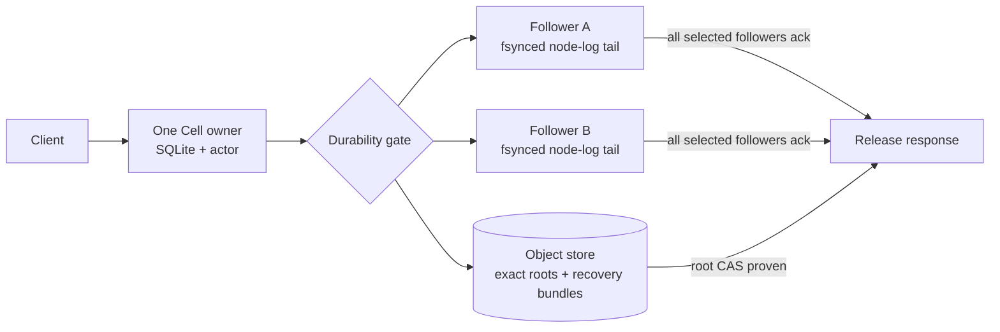
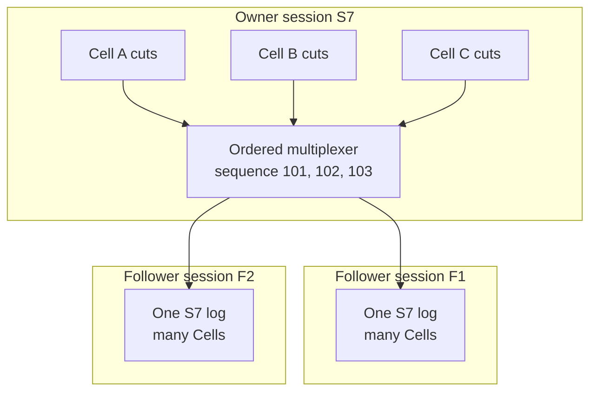
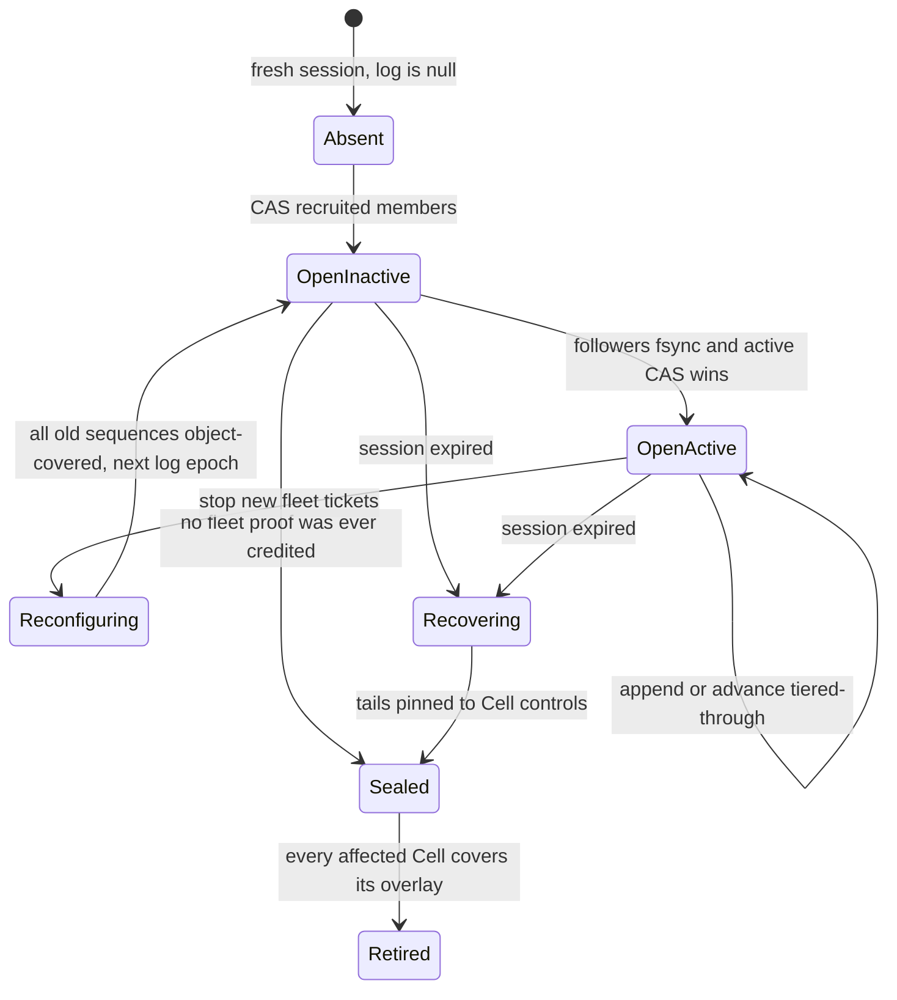
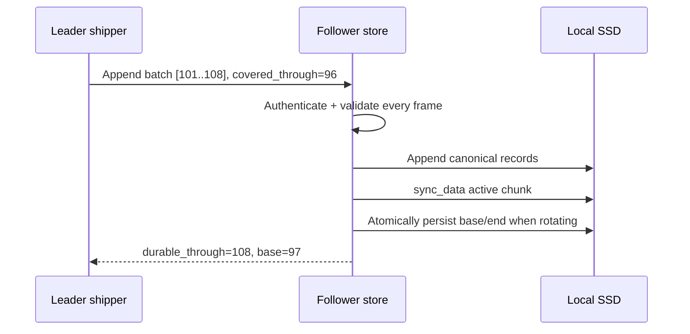
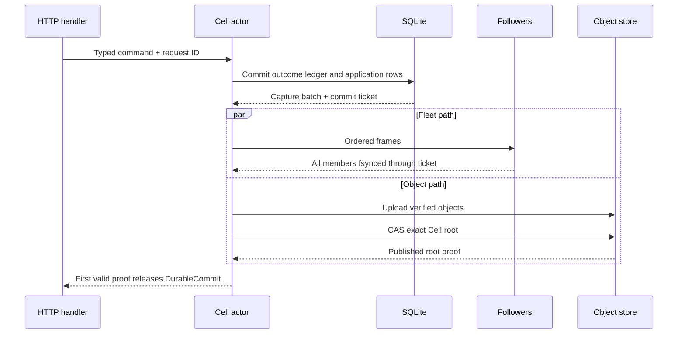
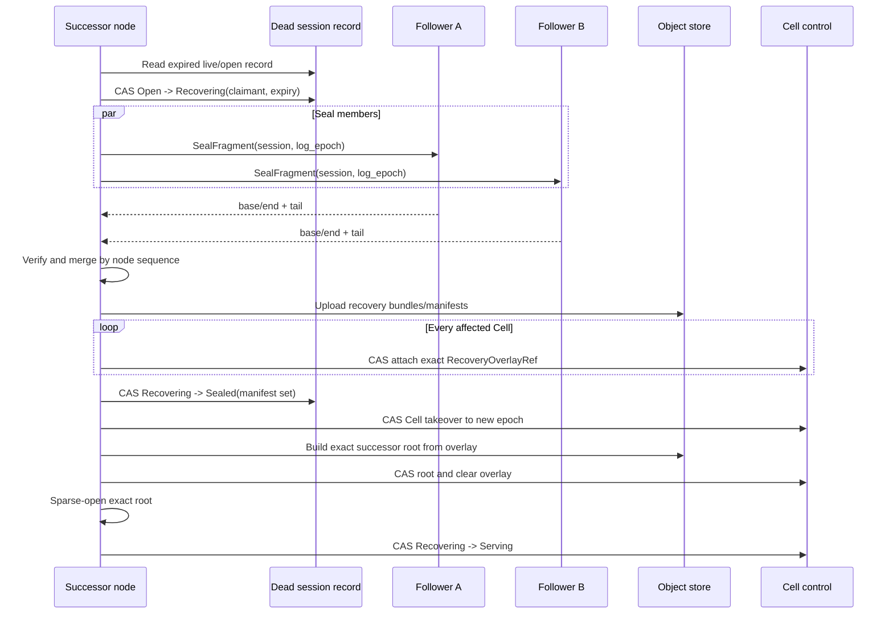

# Add follower durability and warm failover

Crab will add a Celld-style replicated node log around the existing per-Cell
SQLite/LTX runtime. The target keeps exactly one Cell owner, lets one or two
other nodes durably retain the owner's recent LTX cuts, and recovers those cuts
before a successor opens SQLite.

| Document intent | Value |
| --- | --- |
| Content type | Low-level target design |
| Audience | `crab-ltx`, `crab-cell-runtime`, and `crab-http-server` implementers |
| Goal | Define the persistence, wire, gating, recovery, lifecycle, and proof contracts needed for Celld-style follower durability |
| Status | Implementation in progress; product response release remains object-store-only |
| Reference | Celld commit `10cb1303dac710dcb3b557e318e08c855261f68b` |

[Back to the Cell runtime index](README.md)

## Decide what “warm” means

The follower tier is a **durability log**, not a second SQLite owner.

| Kind of warmth | Target behavior | Is a follower an owner? |
| --- | --- | --- |
| Durable tail | One or two peers fsync recent LTX cuts | No |
| Fast activation | Successor opens the exact root with sparse paging | No, until ownership CAS succeeds |
| Page cache | Immutable pages may already exist in a verified local cache | No |
| Hot SQL standby | Another node keeps a writable SQLite connection open | Not supported |

This distinction preserves one writer while removing object-store upload
latency from the common response path. It does not create read replicas, allow
follower reads, or permit a secondary to accept writes.



Crab targets Celld's public behavior: a write can complete after a fleet proof
or an object-store proof; a takeover must recover an earlier fleet proof before
restore. Crab retains its own verified manifests, BLAKE3 identities, exact-root
controls, `crab-storage` adapters, and Rust-native runtime.

## Preserve these guarantees

The implementation is acceptable only when all of these statements remain
true:

1. Exactly one owner session and Cell epoch can serve a Cell.
2. A successful mutation is recoverable after loss of its owner process and
   owner-local disk when at least one complete selected follower survives, or
   when the exact root reached object storage.
3. A response cannot reveal a SQLite state newer than the durability proof that
   released it. This includes successful mutations, durable business errors,
   reads, and streamed response chunks.
4. A successor cannot open SQLite until the predecessor node-log session is
   absent-with-proof or sealed and every recovered tail is pinned by Cell
   control.
5. A stale owner can upload immutable bytes, but it cannot change Cell control,
   complete a new fleet proof after sealing, or release an ungated response.
6. Every recovered segment is checked for framing, BLAKE3, LTX structure,
   transaction continuity, pre/post database checksum, Cell identity,
   incarnation, Cell epoch, and commit sequence.
7. Loss of all durability evidence fails closed. The runtime never advances a
   root, seals a log, or reports success by assuming missing data was empty.
8. Followers persist bounded recent tails. They do not mirror 100 MB to 5 GB
   databases or multiply one SQLite process per Cell.

The availability failure model is one owner-node loss. Simultaneous loss of the
owner and every selected follower can make a Cell unavailable until one copy
returns. No protocol can claim RPO=0 after every acknowledged copy is destroyed.

The proof obligations can be reviewed as four implications. `covers` includes
the command's ledger outcome, not just application pages.

```text
response(commit) => object_root_covers(commit) OR fleet_covers(commit)

fleet_covers(commit) => session.log.active
                      AND every selected member durable_through >= ticket(commit)

session.log.sealed => every fleet-covered frame is object-covered
                   OR pinned by an exact Cell recovery overlay

cell.serving => cell.root consumes every attached recovery overlay
             AND the serving owner/session/epoch CAS is current
```

Tests and model checks should assert these implications directly instead of
inferring them from task completion or log messages.

## Compare current and target behavior

| Boundary | Current implementation | Target extension |
| --- | --- | --- |
| Owner authority | Per-Cell owner, epoch, and root CAS | Same Cell fence, backed by an authoritative node-session lease |
| Success response | Exact immutable root uploaded and CASed into control | First valid proof wins: exact root CAS or all-follower fsync |
| Recent data | Owner-local retained cuts plus object-store graph | Also retained in a multiplexed follower node log |
| Takeover | Wait for unchanged control, increment epoch, restore `control.root` | Prove predecessor session dead, seal/recover its node log, attach recovery overlays, then acquire and restore |
| Activation | Sparse writable root and background hydration | Same; recovered overlay becomes part of the exact root first |
| Clean handoff | Publish, close, release | Publish all outstanding cuts, seal or advance the node log, close, release |
| Local restart | Fresh exact-root restore | Same correctness path; verified page cache may reduce reads |

`crab-ltx` already supplies capture, checksum-bearing segments, bundle extents,
cross-epoch continuation, exact roots, sparse writable activation, and hydration.
The missing capability is the node-level durability protocol around those
mechanics.

## Place responsibilities at the right layer

```text
crab-ltx
  inspect and stream one captured segment
  validate recovered segment metadata and bytes
  build an exact successor root from a verified recovery overlay
  expose immutable bundle extents without cluster policy

crab-cell-runtime
  node-session lease and terminal self-fence
  node-log state machine, follower store, shipper, and recovery coordinator
  durability tickets and response gate
  Cell recovery-overlay attachment and consumption
  bounded admission, shutdown, metrics, and fault injection

crab-http-server
  construct the runtime from existing storage and peer configuration
  expose private mTLS append, seal, and tail routes
  order startup/readiness/drain and map typed errors to public HTTP
  never expose a public follower API
```

`crab-ltx` must not select nodes, own leases, authorize peers, or decide when an
HTTP response is safe. `crab-http-server` must not parse LTX or create a second
recovery path.

### Implementation checkpoint

| Working now | Still gated before fleet durability may serve traffic |
| --- | --- |
| Strict frame codec plus capacity-aware deterministic selection, authoritative enrollment, activation, coverage, recovery claims, and object-covered epoch rotation | Failure-domain-aware automatic recruitment |
| Crash-safe, node-budgeted follower store under a persisted physical `NodeId`, authenticated remote append/seal/tail/retire transport, and a bounded node-wide batched shipper | Recovery-only startup listener ordering |
| Write-all durability gate with contiguous object watermark | Actor submission and response-gate integration |
| Complete-witness grouping, immutable recovery manifests, post-pin session seal CAS, non-forgeable persisted takeover proof, and bounded automatic dead-session recovery with renewable claims | Recovery-only startup listener ordering |
| Cell control attachment and takeover consumption of overlays | Graceful drain, obsolete-marker collection, and live multi-node proof |

The session record now owns one CAS-protected log epoch, its exact sorted member
set, activation bit, contiguous object watermark, and renewable recovery claim.
The private mTLS transport implements enrolled append plus claimant-authorized,
page-bounded seal and tail operations. The follower store admits every append
and seal against the same node-level disk budget used by Cell work, reserves
existing bytes on restart, and NACKs before writing when capacity is exhausted.
Each data directory strict-creates one durable `node-id`; boot sessions remain
ephemeral. Log membership records stable physical node IDs, and each request
resolves that ID to exactly one current live session. Two overlapping live
sessions for one physical node fail closed.
`NodeLogShipper` reserves encoded bytes before assigning a sequence, multiplexes
accepted cuts in submission order, batches for at most one millisecond or 64
frames, sends each batch to every member concurrently, and advances the gate
only after all receipts cover the batch. Encoding, transport, or receipt
failure stops fleet issuance for that epoch while its tickets remain eligible
for object proof and covered rotation.
The directory now filters live peers by protocol, pressure, and the exact
shared-disk capacity advertised by their follower stores, then rendezvous-ranks
the full one- or two-member ensemble before its CAS enrollment. Rotation closes
the old gate only after every issued sequence is object-covered, best-effort
retires old lanes behind durable append fences, and CASes a fresh inactive
epoch. Automatic recruitment with failure-domain metadata, recovery-only
startup listener ordering, actor submission, and obsolete-marker collection remain
gated. The preferred shard-zero scanner now inventories expired active node
logs, claims at most two concurrently, scans at most 10,000 affected Cells,
renews each recovery claim while gathering and pinning, seals the session, and
leaves a takeover proof that another request can reload. Fleet proof is not
activated, so current responses stay on the existing exact-root path until
the remaining gates are complete.
An active predecessor log cannot be converted directly from a session fence
into Cell takeover authority: only the coordinator's successful post-seal
result carries `NodeTakeoverProof`.

## Use one multiplexed log per owner session

A node can own 1,000 to 10,000 active databases. Full per-repository standbys
would multiply SQLite memory, file descriptors, hydration, and checkpoint work.
Instead, every owner session assigns one increasing sequence across captured
cuts from all of its Cells.



Ordering is by submission to the node-log shipper, not task polling order.
Each Cell still has its own contiguous LTX transaction chain and commit
sequence. The node sequence supplies follower replay, truncation, and recovery
coverage across interleaved Cells.

## Evolve the unshipped formats in place

The Cell storage contract is still under active development and has no released
data to preserve. The implementation therefore keeps the existing `cells/v1`
prefix and evolves the current control, session, and reader/writer structures
together. It does not create a `cells/v2` namespace merely because fields or
state transitions change.

There is one canonical format at every commit. Development environments may be
discarded and recreated when that format changes. There is no dual write,
fallback reader, compatibility branch, or data migration until Crab ships a
persistent Cell format that explicitly requires those guarantees.

This applies to both the `cells/v1` path and the `version: 1` fields inside its
documents. During development those values remain stable while the only reader,
writer, validation rules, fixtures, and diagrams change together. They are
format identity guards, not counters to increment for each structural edit.

```text
<root>/cells/v1/
  identity.json
  sessions/<session-id>.json
  node-logs/<leader-session>/<log-epoch>/
    recovery/<manifest-digest>.json
    bundles/<bundle-digest>.bundle
  apps/<application-id>/
    catalog/...
    releases/...
    cells/<cell-id>/
      control.json
      inc/<incarnation-id>/objects/...
```

Content-addressed Cell objects remain under the application and incarnation.
Node-log recovery bundles are cross-Cell and therefore live outside an
application prefix. Every row inside a recovery bundle carries its application
ID so recovery can route it to the correct `CellStorageLayout`.

## Make the node session authoritative

The current signed node advertisement is mainly a routing and capacity record.
Fleet proofs require a node-session lease that a recoverer can atomically move
out of `live`; otherwise a paused owner could continue obtaining follower acks
while takeover reads its Cells.

The evolved session object separates signed immutable identity from
CAS-protected mutable authority:

```json
{
  "version": 1,
  "identity": {
    "fleet": "32-byte-hex",
    "node": "16-byte-hex",
    "session": "16-byte-hex",
    "endpoint": "https://node-a.internal:8081",
    "certificate": "32-byte-hex",
    "public_key": "32-byte-hex",
    "image": "32-byte-hex",
    "release": "32-byte-hex",
    "peer_versions": [1],
    "signature": "64-byte-hex"
  },
  "lease": {
    "state": "live",
    "generation": 41,
    "expires_at_ms": 1789600000000
  },
  "log": {
    "state": "open",
    "epoch": 3,
    "members": ["physical-node-a", "physical-node-b"],
    "active": true,
    "tiered_through": 9001,
    "recovery": null
  },
  "capacity": {
    "sampled_at_ms": 1789599997000,
    "active_cells": 2048,
    "follower_free_bytes": 21474836480,
    "log_protocol": 1
  }
}
```

`node` identifies the durable local data directory; `session` identifies only
one boot generation. The identity signature covers only the canonical
`identity` fields. The whole
object is still protected by its object-store ETag. The owner may renew only a
`live` record with the exact session and generation. A recoverer may change
only recovery-owned fields after expiry. Every transition validates all
unchanged fields before conditional overwrite.

| Session state | May route application work? | May append to its follower log? | May a peer recover it? |
| --- | --- | --- | --- |
| `live` before published expiry | Yes | Yes | No |
| `live` after published expiry | No | No new proof | Yes, by CAS claim |
| `recovering` | No | No | Only the live claimant |
| `sealed` | No | No | Recovery already complete |
| `retired` | No | No | No; overlays are already consumed |

The node renews at three seconds and uses a ten-second published lease by
default. The session watchdog closes all Cell admission and terminates the
process when it cannot prove a valid lease before expiry. A late renewal cannot
revive a fenced process. Kubernetes or another supervisor starts a new session.

Per-Cell `progress` remains a monotonic publication field, but takeover no
longer infers owner death from a quiet Cell. A quiet repository can be healthy
for months. Only the exact owner session's lease, or a graceful release, permits
takeover.

### Open the node log before its first fleet proof

A fresh session is strict-created with `log=null`. That is a durable statement
that the session has never acknowledged beyond object storage. Recruitment then
CASes a complete `open` log with `active=false`, a nonzero log epoch, and its
member set before sending any frame.



For the first candidate fleet proof, followers fsync the batch, then the owner
CASes `active=false` to `active=true`, then it credits the proof. If the active
CAS is ambiguous, it reloads and accepts only that exact successor. If it fails,
the batch waits for object proof. Consequently, `active=true` means recovery
must find a complete witness or fail closed; `active=false` permits sealing
without one because no fleet proof could have escaped.

`tiered_through` is the largest **contiguous node sequence** for which every
earlier frame has an object-store proof. Per-Cell publishers may finish out of
order; the node-log manager holds those completions until the contiguous prefix
advances, then CASes the session record and tells followers what they may
truncate. A single later Cell root cannot create a hole in this watermark.

## Extend Cell control with a recovery overlay

An object-store root can lag a fleet-durable write. The successor therefore
needs a durable pointer to the recovered tail before the node log can be sealed.

```rust,ignore
struct RecoveryOverlayRef {
    leader_session: SessionId,
    log_epoch: u64,
    manifest_digest: Digest,
    first_node_sequence: u64,
    last_node_sequence: u64,
    predecessor: RootRef,
    final_txid: u64,
    final_checksum: u64,
    final_commit_sequence: u64,
}

struct Control {
    // Existing Cell, incarnation, epoch, revision, owner, root, code,
    // schema, state, and next_due fields remain.
    recovery: Option<RecoveryOverlayRef>,
}
```

Only the recovery coordinator can attach an overlay. The transition requires:

- The control still names the dead leader session and captured Cell epoch
- The current root exactly equals the overlay's declared predecessor
- The node-log recovery claim names that leader session and log epoch
- The overlay object exists and passes bounded structural verification
- The successor changes only `revision`, `progress`, and `recovery`

Takeover carries the overlay unchanged into `Recovering`. The new owner asks
`crab-ltx` to verify and materialize a successor root, then CASes that exact
root while clearing `recovery`. A Cell cannot become `Serving` while an overlay
is present.

This extra pointer solves two problems at once: retention can see recovered
bytes before activation, and exact-root restore never depends on listing an
epoch prefix.

The target transition table is explicit:

| Transition | Required predecessor | Protected effect |
| --- | --- | --- |
| `AttachRecovery` | Dead owner session, same Cell epoch/root, no different overlay | Pins one exact recovered tail without changing owner |
| `Takeover` | Predecessor session sealed or `log=null`; overlay unchanged | Advances Cell epoch and installs the successor in `Recovering` |
| `PublishRecovery` | Successor owns `Recovering`; exact overlay predecessor/final position | Advances root and clears the overlay |
| `Activate` | Successor owns `Recovering`; root exists; no overlay | Makes the verified local database externally serving |
| `Publish` | Live owner session; no overlay; exact root successor | Advances the normal published root |
| `Release` | Live owner, drained SQL, logical head equals published head | Removes owner and enters `Idle` |

Normal publication is forbidden while `recovery` is present. A stale owner's
already-issued Cell CAS can win only before the recovery coordinator changes
that Cell control; recovery then reloads the newer root and deterministically
filters or rebases the overlay. Once `AttachRecovery` or `Takeover` wins, every
older Cell ETag is invalid and the stale publisher fences on reconciliation.

## Define the node-log frame

The transport sends a strict binary envelope followed by the unchanged LTX
bytes. Integer fields are little-endian. Variable byte fields are length
prefixed. Decoding rejects unknown versions, duplicate fields, noncanonical
lengths, oversized payloads, and trailing bytes.

```rust,ignore
struct NodeLogFrameV1 {
    leader_session: [u8; 16],
    log_epoch: u64,
    node_sequence: u64,
    application: [u8; 16],
    cell: [u8; 32],
    incarnation: [u8; 16],
    cell_epoch: u64,
    commit_sequence: u64,
    segment: crab_ltx::SegmentInfo,
    body_len: u64,
    body_blake3: [u8; 32],
    body: Bytes,
}
```

One SQLite command may produce multiple cuts at checkpoint boundaries. Its
durability ticket names the last node sequence in that command's consecutive
frame range. A follower acknowledgement covers the whole contiguous range, not
individual Cells.

Before writing, a follower verifies:

1. The mTLS peer and signed session identity match `leader_session`
2. The log epoch and member set match the session record it joined
3. `body_len` fits the 64 MiB captured-segment limit
4. BLAKE3 matches the body
5. `crab-ltx` inspection matches every declared `SegmentInfo` field
6. The sequence is the expected next value or an exact duplicate

Full per-Cell predecessor validation happens when building the recovery
overlay. A follower cannot cheaply hold every Cell root just to validate an
interleaved append.

## Store follower fragments crash-safely

Follower storage is local SSD cache with a durability obligation. It is not an
evictable read cache until the session record proves the bytes are covered.

```text
<cell-data>/node-id
<cell-data>/followers/<leader-session>/<log-epoch>/
  retired
  chunks/
    00000000000000000001-00000000000000004096.log
    open.log
```

Each record in a chunk contains magic, sequence, encoded-frame length, the
canonical frame digest, and frame bytes. Startup scans the active chunk,
re-verifies the frame digest and LTX body, and truncates only an invalid suffix
after the last completely verified record.

Append handling is ordered per leader/log epoch:



The acknowledgement is sent only after `sync_data` succeeds. Directory sync is
also required when creating, rotating, renaming, or removing a chunk. A disk
error, short write, checksum mismatch, gap, or sync error returns a typed NACK
and never advances `durable_through`.

Exact duplicates return the existing durable end after comparing the stored
digest. A duplicate sequence with different bytes is corruption and
quarantines that leader lane. A future sequence returns `expected_sequence`
without filling the gap.

Followers delete only chunks at or below `covered_through`. Whole-epoch
retirement first fsyncs the eight-byte `retired` watermark and its directory,
then removes the chunks. The marker permanently rejects old-epoch appends and
lets recovery prove that the now-empty lane was fully object-covered even if
the leader crashes before its rotation CAS. `covered_through` comes from the
authoritative session record, never from leader memory.

## Use bounded ordered peer streams

The existing private mTLS listener gains four node-log operations:

| Operation | Direction | Purpose |
| --- | --- | --- |
| `OpenAppendStream` | Leader to selected follower | Long-lived ordered batches and ordered acknowledgements |
| `SealFragment` | Recoverer to follower | Stop appends for one leader/log epoch and return retained range |
| `ReadTail` | Recoverer from follower | Stream the sealed retained range with checksums |
| `RetireFragment` | Live leader to follower | Persist an append fence and delete one fully object-covered epoch |

The peer descriptor remains message-only; no public service is generated. The
HTTP server maps messages onto private routes such as
`/internal/cells/v1/node-log/.../append`, `/seal`, `/tail`, and `/retire`.

Initial protocol bounds are compile-time contracts:

| Bound | Value |
| --- | ---: |
| One LTX frame body | 64 MiB |
| One append batch | 64 frames or 64 MiB, whichever comes first |
| Outstanding batches per follower lane | 8 |
| Tail chunk | 1 MiB |
| Append/follower request deadline | Remaining caller deadline, at most 30s |
| Recovery claim heartbeat | 10s |
| Recovery claim expiry | 30s |

The leader applies backpressure before the window fills. It does not spawn one
task or connection per Cell. One lane per selected follower carries all Cells
for that owner session.

## Select and change the follower ensemble

The owner chooses followers from live, release-compatible physical nodes whose
current boot sessions advertise the node-log protocol and available follower
bytes.

Selection rules, in order:

1. Exclude the owner's physical node
2. Exclude draining, pressured, stale, protocol-incompatible, or ambiguously
   advertised nodes
3. Prefer a different zone, host, and local-disk failure domain
4. Rank by rendezvous hash of owner session and candidate physical node ID
5. Select one follower in a two-node fleet and two in a fleet of three or more

Every selected member must fsync a batch for a fleet proof. This is write-all,
ack-all. Quorum acknowledgement is not safe because recovery is designed to use
one complete surviving witness, not merge partially acknowledged quorums.

Changing members uses a barrier:

1. Stop assigning new fleet tickets to the old shipper
2. Wait until every submitted sequence is covered by an exact object-store
   proof
3. While the old authority is still verifiable, ask reachable old followers to
   persist the exact covered watermark and remove that lane
4. CAS the session record to the next log epoch and new member set
5. Open new follower lanes with sequence one

If a member fails, in-flight writes can still complete through object-store
publication. The owner must not silently shrink the current write-all set while
uncovered entries exist. An unreachable old follower does not block rotation:
it retains inert data, rejects future appends after the authority CAS, and is
collected later. A successful retirement response with any other watermark is
a protocol error and blocks the CAS.

## Release responses through one gate

Each SQLite commit produces a monotonic local `CommitTicket`. The ticket binds
the Cell commit sequence, captured cuts, result ledger row, and the last assigned
node-log sequence.

```rust,ignore
enum DurabilityProof {
    ObjectStore {
        root: crab_ltx::RootRef,
        control_revision: u64,
    },
    Fleet {
        leader_session: SessionId,
        log_epoch: u64,
        durable_through: u64,
        members: Vec<NodeId>,
    },
}

struct DurableCommit<T> {
    value: T,
    receipt: Receipt,
    proof: DurabilityProof,
}
```

After capture, the actor submits the same cuts to two concurrent paths:



The slower path continues as owned background work. If the fleet wins, object
tiering must eventually advance `control.root`; dropping that task would turn a
short follower tail into permanent primary storage.

Fleet proof does not perform a per-write object-store owner read. Its safety
comes from the session interlock: the log was made active before the first
proof, takeover changes the expired session to `recovering`, and every follower
serializes append with seal. A local dispatch still checks the process-wide
lease guard before entering an actor, and the output gate checks it before
crediting a newly completed proof. A process pause cannot use an expired cached
deadline to admit more work.

The actor tracks two heads:

- `logical_head`: latest locally committed and durably proven position
- `published_head`: exact root currently named by Cell control

Subsequent local commands continue from `logical_head`. The object publisher
may combine several queued cuts into one exact successor of `published_head`.
It advances control only through the canonical CAS path and then prunes locally
retained and follower-covered data.

Every actor output records the highest commit sequence it observed. The output
gate waits until either proof covers at least that sequence. Therefore:

- A mutation result cannot escape before its ledger row is durable
- A durable business rejection follows the same rule
- A query that observes a just-committed row waits for that row's proof
- An error generated after reading Cell state is gated
- Each streaming chunk carries and waits for its observation watermark

Authentication, routing, and malformed-request errors produced before Cell
execution do not need a Cell durability proof.

## Keep object-store proof as the fallback

Fleet mode does not make the object store optional. It remains the authority,
long-term store, compaction target, and fallback durability path.

| Fleet condition | Response behavior |
| --- | --- |
| All selected followers fsync first | Fleet proof releases response |
| Exact root CAS completes first | Object proof releases response |
| No eligible follower | Wait for object proof |
| One member NACKs or times out | Degrade current batch to object proof |
| Object store is slow but lease remains valid | Fleet proof may continue temporarily |
| Object store outage reaches lease expiry | Terminal self-fence; no further responses |

The default mode is `fleet`, with transparent object-proof fallback. An
explicit `object` mode disables follower recruitment and preserves today's
response path. A one-node fleet stays correct through object proofs; it cannot
claim follower redundancy.

## Recover a failed owner before Cell restore

The first request for any Cell owned by an expired session starts or joins one
node-session recovery. Recovery is single-flight per dead session across the
process and elected across the fleet by session-record CAS.



### Elect recovery

The recoverer rereads the session record and current time immediately before
claiming. It refuses a live lease. `Open -> Recovering` records claimant
session, claim generation, and claim expiry. The claimant refreshes that field
every ten seconds.

A second node waits behind a live claim. After the 30-second claim expiry, it
may CAS takeover of recovery. All later operations are content-addressed,
idempotent, or Cell-control CASes, so repeated work converges.

### Seal and gather followers

Each follower serializes `SealFragment` with append handling. An append wholly
before the seal is included; an append after the seal is rejected. A fleet proof
needs every member's acknowledgement, so any fleet-acknowledged frame exists on
each complete member.

The recoverer accepts a member as a complete witness only when:

- It reports the expected leader session and log epoch
- Its local fragment is sealed
- Its returned tail covers its declared retained `[base, end]` range
- Every record and LTX frame verifies

One complete witness is sufficient under write-all, ack-all. Additional
witnesses are compared by sequence and digest. Equal sequences with unequal
bytes fail recovery as corruption. The union may contain an unacknowledged
suffix; exposing such a suffix is allowed because a missing response never
promises that a transaction was rolled back.

If `log.active` is true and no complete witness is available, recovery remains
unavailable. It does not seal the record or declare the tail empty. An operator
can restore a missing follower disk and retry. Any future data-loss override
must be a separate audited administrative operation that writes a permanent
loss record; it is not an automatic runtime branch.

### Build recovery manifests

The recoverer filters entries at or below the session's object-covered
watermark, then groups the remaining verified frames by application, Cell,
incarnation, and Cell epoch. It writes shared immutable bundles and one small
manifest per affected Cell.

```json
{
  "version": 1,
  "leader_session": "16-byte-hex",
  "log_epoch": 3,
  "application": "16-byte-hex",
  "cell": "32-byte-hex",
  "incarnation": "16-byte-hex",
  "cell_epoch": 12,
  "predecessor": {
    "root": "32-byte-hex",
    "txid": 500,
    "checksum": 9223372036854776000,
    "commit_sequence": 700
  },
  "entries": [
    {
      "node_sequence": 9002,
      "bundle": "32-byte-hex",
      "offset": 4096,
      "length": 8192,
      "ltx": {
        "min_txid": 501,
        "max_txid": 501,
        "post_checksum": 9223372036854777000,
        "commit_sequence": 701,
        "blake3": "32-byte-hex"
      }
    }
  ]
}
```

The final implementation uses canonical strict JSON or the existing canonical
binary manifest codec; it must not use floating-point numbers or permissive
unknown fields. The manifest digest covers its canonical bytes. Every bundle
extent is range-readable and independently BLAKE3-bound.

### Pin every affected Cell

Before sealing the node session, recovery attaches each manifest digest to the
matching dead-owner Cell control. That CAS makes recovered objects reachable to
backup and retention. A lost response is reconciled by exact overlay equality.

If control already names a newer root that covers the manifest's final
position, recovery records the Cell as covered. Any other owner, incarnation,
epoch, or predecessor mismatch stops recovery. It is unsafe to seal while one
acknowledged tail is neither rooted nor attached.

### Consume the overlay

After acquiring the Cell, the new owner calls one `crab-ltx` operation:

```rust,ignore
let prepared = replica
    .prepare_recovered_overlay(
        control.ltx_root(),
        control.recovery(),
        &scratch_directory,
    )
    .await?;
authority.publish_recovery(&control, &prepared).await?;
```

`prepare_recovered_overlay` performs no ownership decision. It verifies the
manifest and bundle extents, checks the predecessor, folds every LTX segment in
order, builds the authenticated directory, and returns a `PreparedRoot`. The
runtime verifies the returned final position and commit sequence against the
overlay before CAS.

Only then does the successor sparse-open the exact new root. First-page faults
use current authenticated range reads; background hydration remains bounded
owner maintenance.

### Retire recovery data only after every Cell covers it

Retention treats all of these as roots:

- Current Cell roots
- Attached `RecoveryOverlayRef` manifests and their bundle extents
- Backup pins captured while an overlay is attached
- Recovery manifests named by an `open`, `recovering`, or `sealed` session

A sealed session keeps a compact affected-Cell index. A maintenance pass may
CAS it to `retired` only after every listed Cell is tombstoned or its current
root covers the overlay's final transaction, checksum, and commit sequence, and
no control or backup pin still names the overlay. The small retired session
record remains as an audit tombstone; recovery bundles become ordinary
grace-period collection candidates.

Followers may discard their sealed local fragments after the sealed record and
all referenced recovery objects can be reread and verified from object storage.
They do not wait for every Cell to activate because the control-pinned overlays
already preserve reachability.

## Handle absence and sealed records precisely

These observations have different meanings:

| Observation | Meaning | Action |
| --- | --- | --- |
| Expired session exists, `log=null` | Session never released a fleet proof | Current Cell root is complete; takeover may proceed |
| Session log is `sealed` | Recovery overlays were durably pinned | Consume matching overlay, if any |
| Session log is `open` | Fleet-only tail may exist | Recover before Cell takeover |
| Session log is `recovering` | One claimant is gathering/pinning | Join or take over an expired claim |
| Session log is `retired` | Every affected Cell root covers the tail | No recovery data remains live through this session |
| Entire owner session record missing | Authority evidence is missing | Fail closed; do not infer bucket completeness |
| Cell is `Idle` with no owner | Clean release already forced object coverage | Acquire normally |

The session record is strict-created before a node can own a Cell. Its absence
is therefore corruption or operator deletion, not proof that no follower
acknowledgement occurred.

## Keep graceful movement cheaper than crash recovery

A clean per-Cell handoff does not seal the whole owner node log.

1. Stop new commands for the Cell
2. Wait for accepted commands to reach either proof
3. Force all Cell cuts through exact object publication
4. Verify `published_head == logical_head`
5. Close SQLite and CAS Cell control to `Idle`
6. Let the successor acquire a new Cell epoch and sparse-open that root

Because `Idle` proves complete object coverage, no node-log recovery is needed.
An optional successor hint may prefetch the authenticated root directory and
hot pages, but it grants no authority.

Clean node shutdown is broader:

1. Withdraw public admission and mark the session draining
2. Drain accepted Cell work
3. Stop issuing fleet proofs
4. Advance every outstanding node-log sequence to object coverage
5. Seal the node log with no recovery overlays
6. Release owned Cells after each SQL worker closes
7. Withdraw the session lease and close follower services

A crash at any step leaves `open` or `recovering` state and returns to the same
dead-session recovery path.

## Start and stop in recovery-safe order

Startup order is:

1. Load or strict-create the durable physical node ID, then validate local
   follower directories and quarantine corrupt lanes
2. Start the private mTLS listener in **recovery-only** mode
3. Serve `SealFragment` and `ReadTail` for surviving peer fragments
4. Probe object-store conditional writes and range reads
5. Strict-create a fresh session record
6. Start the lease watchdog and renewal task
7. Start node-log recovery sweeps, shipper, actors, and schedulers
8. Advertise application readiness

Serving follower recovery before application readiness allows a fleet-wide
restart to recover from surviving disks without circularly waiting for every
node to become fully ready.

Shutdown closes application admission first and follower recovery last. A
follower must not discard the only surviving fragment merely because its own
application runtime is draining.

## Bound resources and backpressure

Follower capacity is accounted separately from Cell residency. It covers
fragment bytes, open leader lanes, recovery readers, and sync work.

| Resource | Required bound |
| --- | --- |
| Selected followers per leader | 1 or 2 |
| Append streams per remote leader | 1 |
| Global follower append bytes | Derived from local SSD budget |
| Per-lane outstanding bytes | 8 batches and 64 MiB maximum |
| Concurrent node-log recoveries | CPU/job-credit bounded, maximum 2 initially |
| Concurrent tail reads | Shared object/network I/O semaphore |
| Recovery scratch | Reserved before reading tail bodies |
| Uncovered owner bytes | Hard bound; reaching it forces object proof/backpressure |

At 1,000 aggregate transactions/s, the design must group fsync work. The
leader batches frames across Cells for up to the smaller of one millisecond, 64
frames, or 64 MiB. Each follower appends that batch and performs one `sync_data`.
The exact interval is a measured runtime constant, not a per-deployment tuning
surface until qualification proves one is needed.

The write-amplification envelope is:

```text
owner local WAL/LTX
+ N follower fragment writes, where N is 1 or 2
+ one eventual object-store upload
+ bounded compaction and recovery rewrites
```

Follower bytes are temporary. Object coverage advances truncation so retained
space tracks upload delay, not total database size. When follower space reaches
its reserve, it NACKs new batches before writing and the owner uses object
proofs. It never evicts uncovered fragments.

## Define failure behavior before implementation

| Fault | Required result |
| --- | --- |
| Owner dies before either proof | No success was promised; recovery may include or omit the cut |
| Owner dies after all-follower fsync | Recovery attaches and consumes the cut before serving |
| Owner dies after object root CAS | Successor restores the exact root; duplicate follower tail is ignored by position/digest |
| One follower fails mid-batch | No fleet proof; object path may win |
| Follower fsync succeeds but ACK is lost | The request may remain unresolved; recovery may expose the cut and request replay resolves it |
| Follower returns a gap | Leader retransmits only exact retained frames or degrades to object proof |
| Follower returns conflicting duplicate | Quarantine lane and fail fleet proof |
| Recoverer dies after uploading bundles | Next claimant reuses content-addressed objects and resumes Cell CASes |
| Recoverer dies after some overlays attach | Next claimant reconciles exact overlays; session remains unsealed |
| Recovery claim stalls | Another live session takes over after claim expiry |
| Owner is partitioned from object store | Lease expires and process self-fences even if followers are reachable |
| Owner is partitioned from followers | Object proofs preserve correctness |
| Stale owner resumes after takeover | Session is non-live, followers are sealed, and Cell CAS rejects it |
| All selected follower disks are unavailable and no object proof exists | Cell remains unavailable; no automatic loss declaration |
| Recovery bundle or LTX is corrupt | Fail closed with the exact digest/sequence category, never partial restore |
| Local successor disk fills | Release reservation, keep control `Recovering`, and retry elsewhere |
| Object CAS result is lost | Reload and accept only the exact proposed session/control successor |

## Expose narrow Rust APIs

The names below define ownership and data flow. Final signatures may change to
fit existing types, but they must not collapse the layer boundaries.

### `crab-ltx`

```rust,ignore
pub struct VerifiedNodeFrame { /* private validated fields */ }

pub fn inspect_node_frame(bytes: Bytes, limits: Limits)
    -> Result<VerifiedNodeFrame>;

impl CellReplica {
    pub async fn prepare_recovered_overlay(
        &self,
        overlay: &RecoveryOverlay,
        schema: u32,
    ) -> Result<PreparedRoot>;
}
```

The verified frame exposes immutable metadata and a bounded body stream. It
does not expose unchecked constructors for server code.

### `crab-cell-runtime`

```rust,ignore
pub trait NodeLogTransport: Send + Sync {
    async fn open_append(&self, member: NodeId) -> Result<AppendLane>;
    async fn seal(&self, member: NodeId, request: SealRequest)
        -> Result<SealReceipt>;
    async fn tail(&self, member: NodeId, request: TailRequest)
        -> Result<TailStream>;
}

pub struct DurabilityGate;
pub struct NodeLogShipper;
pub struct NodeLogSubmission;

impl DurabilityGate {
    pub async fn prove(&self, ticket: CommitTicket)
        -> Result<DurabilityProof>;
    pub async fn wait_until(&self, sequence: u64)
        -> Result<DurabilityProof>;
}

impl NodeLogShipper {
    pub async fn submit(&self, submission: NodeLogSubmission)
        -> Result<CommitTicket>;
    pub async fn shutdown(&self) -> Result<()>;
}

pub struct NodeLogRecovery;

impl NodeLogRecovery {
    pub async fn ensure_sealed(&self, predecessor: SessionId)
        -> Result<SealedSession>;
}

pub struct NodeTakeoverProof { /* private validated fields */ }
```

`CommitTicket` is created only by the actor after capture. `DurabilityProof`
has private fields or validated constructors so application handlers cannot
forge a release token. `FencedNodeSession` converts directly to
`NodeTakeoverProof` only when fleet durability was never active. Otherwise the
proof is emitted only after every recovered overlay is pinned and the session
log is CASed to `sealed`.

### `crab-http-server`

The server installs one transport and follower store into `CellRuntimeBuilder`.
Private route handlers authenticate and decode, then call those objects. They do
not access Cell actors or execute application commands.

## Report actionable status without Cell-label metrics

Prometheus metrics must remain bounded in cardinality:

```text
crab_cell_durability_proofs_total{source="fleet|object"}
crab_cell_durability_wait_seconds{source="fleet|object"}
crab_cell_node_log_append_bytes_total{result="acked|nacked"}
crab_cell_node_log_uncovered_bytes
crab_cell_node_log_lanes{state="open|degraded|sealed"}
crab_cell_node_log_recoveries{state="running|waiting"}
crab_cell_node_log_recovery_seconds
crab_cell_node_log_recovery_failures_total{reason}
crab_cell_follower_retained_bytes
crab_cell_session_lease_seconds
crab_cell_self_fences_total{reason}
```

Cell ID, repository name, request ID, session ID, and object digest belong in
structured logs or bounded administrative queries, never metric labels.

`cells status --owner OWNER --name REPOSITORY --json` adds:

- Current owner session and Cell epoch
- Owner-session lease state and expiry
- Published and logical commit sequences when queried on the owner
- Pending recovery overlay, if any
- Last durability source

`cells node --session SESSION --json` adds log state, epoch, member sessions,
tiered sequence, retained byte estimates, and recovery claimant. It does not
return frame bodies or credentials.

## Qualify the complete contract

Unit tests alone cannot establish the guarantee. Delivery requires all layers
below.

### Deterministic protocol tests

- Model session `Live -> Recovering -> Sealed` CAS transitions
- Explore append/seal ordering at every message boundary
- Prove a fleet proof implies every selected member stored the covered range
- Prove a sealed active log has one complete witness and every affected Cell is
  rooted or carries an exact overlay
- Prove no Cell reaches `Serving` with `recovery != None`
- Prove member reconfiguration waits for object coverage
- Prove lease expiry is terminal for the old process

### Filesystem tests

- Kill between append, `sync_data`, ACK, rotation rename, and directory sync
- Tear every byte of the active record trailer and recover only the valid prefix
- Replay exact duplicates and reject conflicting duplicates
- Fill the follower disk before append and during recovery materialization
- Restart a follower before the application runtime is ready and serve tail
- Verify truncation never removes a sequence above object coverage

### Runtime integration tests

- Return a fleet proof while blocking every object upload, kill the owner, delete
  its disk, take over, and resolve the exact request outcome
- Race object proof and fleet proof in both orders
- Gate reads and business-error outputs behind an earlier unproven commit
- Kill recovery after each overlay attachment and resume from another node
- Recover a multi-cut transaction and interleaved cuts from 1,000 Cells
- Include a valid but unacknowledged suffix and preserve request idempotency
- Corrupt bundle bytes, index bytes, and manifest metadata independently
- Exercise cross-epoch continuation, truncate/regrow, sparse faults, hydration,
  compaction, backup pins, and retention after recovery

### Three-node live qualification

Run three independent processes with separate SSD directories and real RustFS:

1. Force every response through two follower fsyncs while object upload is
   delayed
2. Sustain the declared aggregate 1,000 TPS workload and record fsync grouping,
   network bytes, object lag, p50/p95/p99 latency, RSS, and retained bytes
3. `SIGKILL` the owner and delete its local Cell and log directories
4. Keep one follower, restart the other, and require exact recovery
5. Verify higher Cell epoch, identical request outcomes, and monotonic root
6. Partition the old owner, let its session expire, recover elsewhere, then
   reconnect it and prove terminal fencing
7. Repeat with follower disk full, slow follower, lost ACK, object-store 429,
   recovery crash, and simultaneous fleet restart

Capacity claims must cover small, medium, and large node profiles separately.
The 1,000 TPS target is aggregate per node, not per repository. A result must
state transaction size, changed pages, follower count, database distribution,
object-store latency, and failure injection.

## Deliver in dependency order

Each phase has a usable exit criterion. Do not enable the fleet response path
until the recovery gate is complete.

| Phase | Implementation | Exit proof |
| --- | --- | --- |
| 1 | Session lease, watchdog, terminal self-fence, Cell takeover based on session state | Pause/partition owner; no response or renewal after expiry |
| 2 | `crab-ltx` verified frame and recovered-overlay API | Golden, corruption, cross-epoch, and exact-root tests |
| 3 | Follower disk format and private append/seal/tail protocol | Crash matrix proves fsync and torn-tail behavior |
| 4 | Node-log recovery claim, bundles, Cell overlay attachment, retention roots | Kill recovery at every boundary and converge |
| 5 | Dual object/fleet durability gate and logical/published heads | Fleet-first response survives owner and disk loss |
| 6 | Ensemble rotation, graceful drain, startup recovery-only listener, GC | Member loss and rolling restart matrix |
| 7 | Real RustFS and Kubernetes qualification at target load | Signed receipts with zero lost acknowledged outcomes |

Phases 1 through 4 may ship with object-only responses. Phase 5 is the first
point at which follower fsync may release a public result.

## Use Celld as a behavioral reference, not an inherited proof

The pinned Celld design establishes the pattern used here:

- [Celld guarantees](https://github.com/denoland/celld/blob/10cb1303dac710dcb3b557e318e08c855261f68b/docs/guarantees.md)
  defines one owner, the dual durability proof, node-log recovery, epoch-chain
  restore, and terminal self-fencing.
- [Celld node log](https://github.com/denoland/celld/blob/10cb1303dac710dcb3b557e318e08c855261f68b/crates/celld/node_log.rs)
  implements follower append, write-all/ack-all, sealing, gathering, and
  recovery claims.
- [Celld LTX replication](https://github.com/denoland/celld/blob/10cb1303dac710dcb3b557e318e08c855261f68b/crates/celld/ltx_repl.rs)
  races bucket and fleet proofs and multiplexes Cell cuts.

Crab must prove its own version because its control model differs. Celld can
restore discoverable epoch prefixes. Crab restores one authenticated root, so
it additionally needs the control-pinned recovery overlay described above.
That difference is intentional: it preserves Crab's verified manifests,
checksums, exact-root backup, and existing storage dependencies while matching
Celld's follower durability and takeover behavior.
