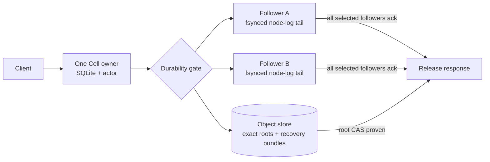
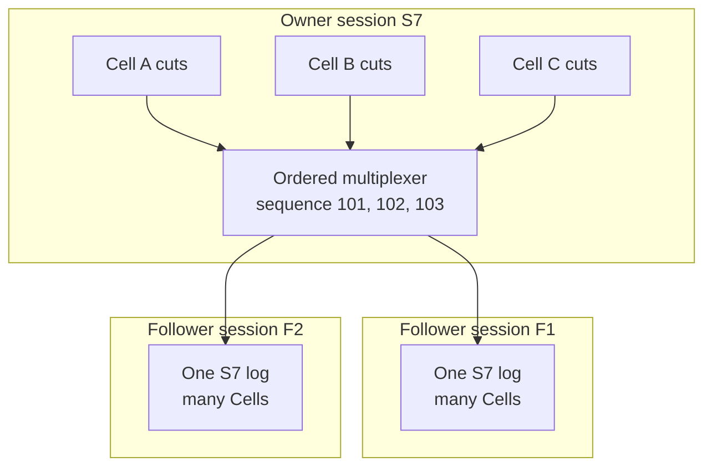
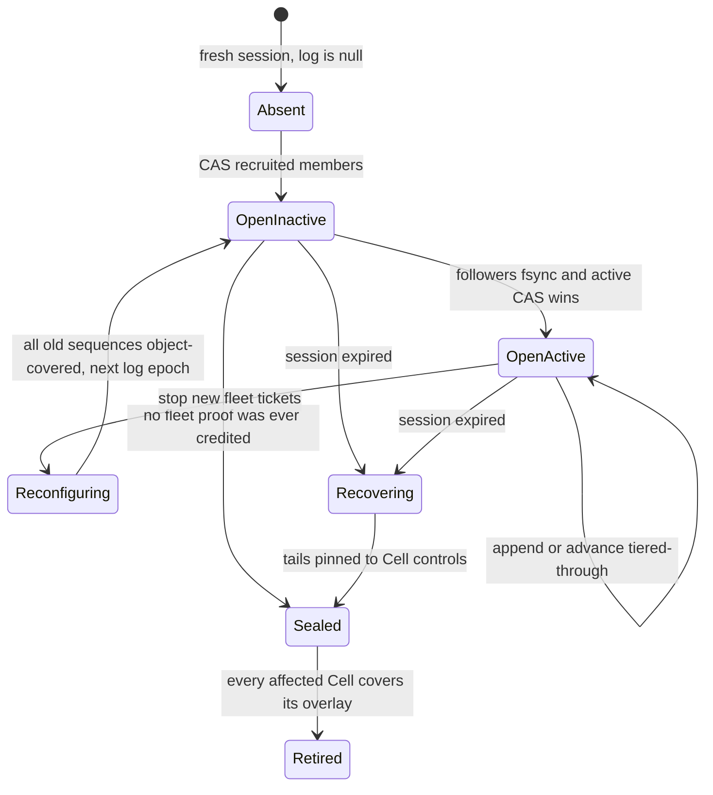
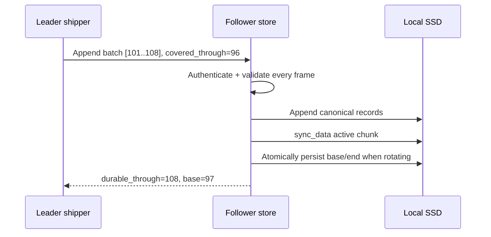
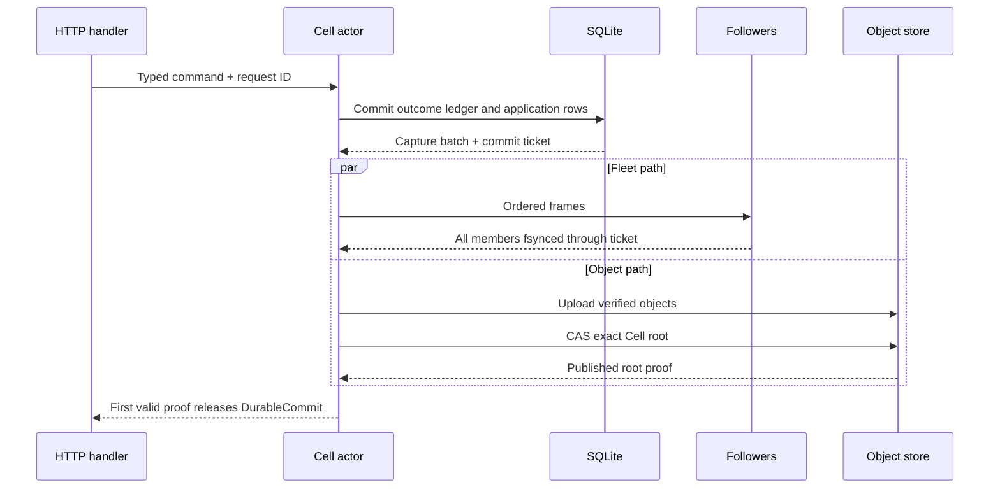
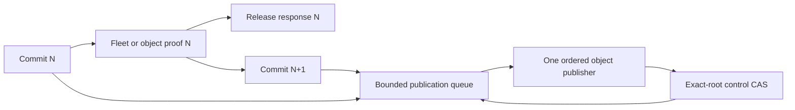
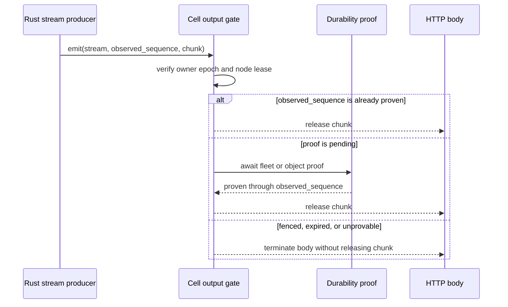
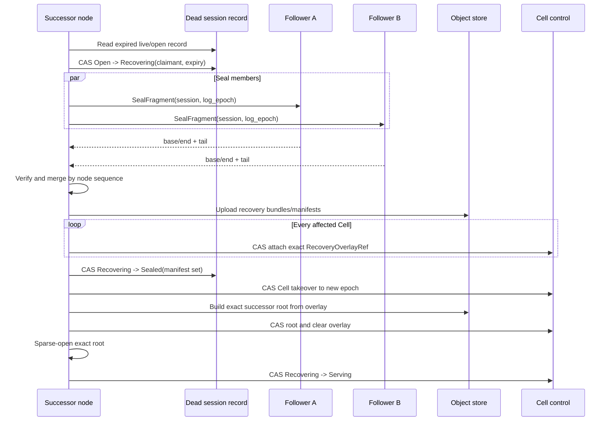

# Follower durability and warm failover

Crab implements a Celld-style replicated node log around the existing per-Cell
SQLite/LTX runtime. The implementation keeps exactly one Cell owner, lets one
or two other nodes durably retain the owner's recent LTX cuts, and recovers
those cuts before a successor opens SQLite.

| Document intent | Value |
| --- | --- |
| Content type | Low-level target design |
| Audience | `crab-ltx`, `crab-cell-runtime`, and `crab-http-server` implementers |
| Goal | Define the persistence, wire, gating, recovery, lifecycle, and proof contracts needed for Celld-style follower durability |
| Status | Follower durability, bounded recovery, follower-affine takeover, local fast paths, and digest-bound qualification implemented; protected scale, provider, and release runs remain |
| Reference | Celld commit `10cb1303dac710dcb3b557e318e08c855261f68b` |

[Back to the Cell runtime index](README.md)

## Decide what “warm” means

The follower tier is a **durability log**, not a second SQLite owner.

| Kind of warmth | Target behavior | Is a follower an owner? |
| --- | --- | --- |
| Durable tail | One or two peers fsync recent LTX cuts | No |
| Fast activation | Successor opens the exact root with sparse paging | No, until ownership CAS succeeds |
| Page cache | Immutable pages may already exist in a verified local cache | No |
| Hot SQL standby | Another node keeps a writable SQLite connection open | Not supported |

This distinction preserves one writer while removing object-store upload
latency from the common response path. It does not create read replicas, allow
follower reads, or permit a secondary to accept writes.
The separate read-only exact-root query capability in
[Plan 036](../../../advisor-plans/036-cell-read-replicas-and-fenced-promotion.md)
has a private peer query path and an explicit public issue-detail route in object
durability mode. Other product reads still use the owner. It is independent of follower durability. A durability-log
follower still cannot answer SQL queries or promote without the Cell control CAS.



Crab targets Celld's public behavior: a write can complete after a fleet proof
or an object-store proof; a takeover must recover an earlier fleet proof before
restore. Crab retains its own verified manifests, BLAKE3 identities, exact-root
controls, `crab-storage` adapters, and Rust-native runtime.

## Preserve these guarantees

The implementation is acceptable only when all of these statements remain
true:

1. Exactly one owner session and Cell epoch can serve a Cell.
2. A successful mutation is recoverable after loss of its owner process and
   owner-local disk when at least one complete selected follower survives, or
   when the exact root reached object storage.
3. A response cannot reveal a SQLite state newer than the durability proof that
   released it. This includes successful mutations, durable business errors,
   reads performed after a mutation in the same serialized actor, and every
   chunk emitted by `CellStateStream`.
4. A successor cannot open SQLite until the predecessor node-log session is
   absent-with-proof or sealed and every recovered tail is pinned by Cell
   control.
5. A stale owner can upload immutable bytes, but it cannot change Cell control,
   complete a new fleet proof after sealing, or release an ungated response.
6. Every recovered segment is checked for framing, BLAKE3, LTX structure,
   transaction continuity, pre/post database checksum, Cell identity,
   incarnation, Cell epoch, and commit sequence.
7. Loss of all durability evidence fails closed. The runtime never advances a
   root, seals a log, or reports success by assuming missing data was empty.
8. Followers persist bounded recent tails. They do not mirror 100 MB to 5 GB
   databases or multiply one SQLite process per Cell.

The availability failure model is one owner-node loss. Simultaneous loss of the
owner and every selected follower can make a Cell unavailable until one copy
returns. No protocol can claim RPO=0 after every acknowledged copy is destroyed.

The proof obligations can be reviewed as four implications. `covers` includes
the command's ledger outcome, not just application pages.

```text
response(commit) => object_root_covers(commit) OR fleet_covers(commit)

fleet_covers(commit) => session.log.active
                      AND every selected member durable_through >= ticket(commit)

session.log.sealed => every fleet-covered frame is object-covered
                   OR pinned by an exact Cell recovery overlay

cell.serving => cell.root consumes every attached recovery overlay
             AND the serving owner/session/epoch CAS is current
```

Tests and model checks should assert these implications directly instead of
inferring them from task completion or log messages.

## Compare current and target behavior

| Boundary | Current implementation | Target extension |
| --- | --- | --- |
| Owner authority | Per-Cell owner, epoch, and root CAS | Same Cell fence, backed by an authoritative node-session lease |
| Success response | Exact immutable root uploaded and CASed into control | First valid proof wins: exact root CAS or all-follower fsync |
| Recent data | Owner-local retained cuts plus object-store graph | Also retained in a multiplexed follower node log |
| Takeover | Wait for unchanged control, increment epoch, restore `control.root` | Prove predecessor session dead, seal/recover its node log, attach recovery overlays, then acquire and restore |
| Activation | Sparse writable root and background hydration | Same; recovered overlay becomes part of the exact root first |
| Clean handoff | Publish, close, release | Publish all outstanding cuts, seal or advance the node log, close, release |
| Local restart | Fresh exact-root restore | Same correctness path; verified page cache may reduce reads |

`crab-ltx` already supplies capture, checksum-bearing segments, bundle extents,
cross-epoch continuation, exact roots, sparse writable activation, and hydration.
The missing capability is the node-level durability protocol around those
mechanics.

## Place responsibilities at the right layer

```text
crab-ltx
  inspect and stream one captured segment
  validate recovered segment metadata and bytes
  build an exact successor root from a verified recovery overlay
  expose immutable bundle extents without cluster policy

crab-cell-runtime
  node-session lease and terminal self-fence
  node-log state machine, follower store, shipper, and recovery coordinator
  durability tickets and response gate
  Cell recovery-overlay attachment and consumption
  bounded admission, shutdown, metrics, and fault injection

crab-http-server
  construct the runtime from existing storage and peer configuration
  expose private mTLS append, seal, and tail routes
  order startup/readiness/drain and map typed errors to public HTTP
  never expose a public follower API
```

`crab-ltx` must not select nodes, own leases, authorize peers, or decide when an
HTTP response is safe. `crab-http-server` must not parse LTX or create a second
recovery path.

### Implementation checkpoint

| Working now | Remaining target gaps |
| --- | --- |
| Strict frame codec plus capacity- and failure-domain-aware deterministic selection, retrying automatic enrollment, activation, coverage, recovery claims, object-covered epoch rotation, and clean log close | Signed small/medium/large live runs and the extended fault/telemetry matrix |
| Crash-safe, node-budgeted follower store under a persisted physical `NodeId`, authenticated remote append/seal/tail/retire transport, a bounded node-wide batched shipper, a recovery-first management-listener lifecycle, startup lane scrub/quarantine, and crash-rebuildable bounded lane indexes | Protected large-tail, large-catalog, and mixed-failure evidence remains; the index is derived acceleration data and every selected record is reread and digest-checked |
| Authoritative create and refresh drive a terminal monotonic node-lease guard; admission, actor dispatch, Cell-control CAS, durability proof, and output acceptance all check it | None for the current non-streaming Cell API |
| Write-all durability gate, first-fsynced-batch activation, bounded dual-watermark command continuation, ordered object publication, object fallback, schema-migration barriers, and contiguous authoritative object watermark | None for this slice |
| Complete-witness grouping, immutable recovery manifests, post-pin session seal CAS, non-forgeable persisted takeover proof, and bounded automatic dead-session recovery with renewable claims | None for this slice |
| Cell control attachment and takeover consumption of overlays; server drain closes a fully object-covered epoch before session withdrawal; grace-aged retired follower lanes are deleted only after authority stops naming their epoch; the Compose qualifier proves a follower-only result survives owner `SIGKILL`, owner-disk deletion, RustFS restoration, takeover, and owner rejoin; the Kubernetes harness exercises each selected node profile and the 1,000 aggregate mutation schedule against every Pod across eight load Cells, and its owner-loss receipt binds the successor stable NodeId to the failed log's original follower set | Signed live runs across small/medium/large profiles plus the extended fault/telemetry matrix |
| Bounded command/query responses and the typed `CellStateStream` bind every emitted chunk to the actor's proven logical head | Extended live fault and profile qualification only |

The session record now owns one CAS-protected log epoch, its exact sorted member
set, activation bit, contiguous object watermark, and renewable recovery claim.
The private mTLS transport implements enrolled append plus claimant-authorized,
page-bounded seal and tail operations. The follower store admits every append
and seal against the same node-level disk budget used by Cell work, reserves
existing bytes on restart, and NACKs before writing when capacity is exhausted.
Each data directory strict-creates one durable `node-id`; boot sessions remain
ephemeral. Log membership records stable physical node IDs, and each request
resolves that ID to exactly one current live session. Two overlapping live
sessions for one physical node fail closed.
`NodeLogShipper` reserves encoded bytes before assigning a sequence, multiplexes
accepted cuts in submission order, batches for at most one millisecond or 64
frames, sends each batch to every member concurrently, and advances the gate
only after all receipts cover the batch. Encoding, transport, or receipt
failure stops fleet issuance for that epoch while its tickets remain eligible
for object proof and covered rotation.
The directory now filters live peers by protocol, pressure, and the exact
shared-disk capacity advertised by their follower stores. It greedily maximizes
proven zone separation, then proven host separation, then applies the owner-
session/physical-node rendezvous rank for the full one- or two-member ensemble
before its CAS enrollment. Unknown topology labels receive no separation credit
instead of being assumed independent. Rotation closes
the old gate only after every issued sequence is object-covered, best-effort
retires old lanes behind durable append fences, and CASes a fresh inactive
epoch. Recruitment retries while the node remains healthy and leaves a
one-node fleet on the object path.
The preferred
shard-zero scanner now inventories expired active node
logs with at most 32 concurrent record reads, shares a verified one-second
directory snapshot across cloned schedulers, selects a bounded rotating window,
claims at most two concurrently, scans at most 10,000 affected Cells, renews
each recovery claim while gathering and pinning, refreshes the claim once more
before the final seal, and bounds that seal's object-store CAS so a stalled
store returns a retryable deadline instead of holding an unbounded recovery
task. The snapshot is advisory: each claim reloads the failed session and
revalidates the claimant's live signed recovery admission immediately before
its fencing CAS. Failed sessions use bounded in-memory exponential retry, capped
below the 30-second claim lifetime, so an unavailable object store cannot keep
all recovery workers hot or starve later sessions; the authoritative claim is
still the only ownership record. It leaves a takeover proof that another
request can reload. For
commands, the
actor keeps complete local cuts readable without making their directory entries
durable, then submits those exact bytes before immutable-root preparation.
Every selected follower must fsync the ticket before the shared node-session
authority performs the exact `active=false -> active=true` CAS. Only then can
fleet proof release the command response. The actor advances a logical head
after that proof and may execute the next command while one separate publisher
advances the exact object-backed root in order. A 64-entry queue and a 64 MiB
retained-byte high water apply backpressure; the existing local-disk budget
remains the hard byte admission boundary. Failure of the fleet path falls back
to object proof, while a terminal publication failure fences the Cell and
leaves any already released outcomes recoverable from the node log.
Schema-migration cuts use the same follower/object race and recovery
coverage. A successful fleet proof may release the successor handle before
object publication; its admission is already installed, so requests queue
behind the publication barrier. Migrations, drain, and shutdown do not cross a
command backlog; object-only migrations continue to wait for exact root
publication.

If immutable-object publication returns a storage error after the fleet proof,
the ordered publisher retains the cut and retries with bounded backoff for a
short grace period. The logical head may serve the fleet-proven result while
the published head catches up. Lease loss, a control conflict, or exhaustion
of that grace period fences the Cell; the unpublished node-log interval stays
owner-pinned so takeover can seal and replay it.
An active predecessor log cannot be converted directly from a session fence
into Cell takeover authority: only the coordinator's successful post-seal
result carries `NodeTakeoverProof`.

The HTTP node publisher now arms a process-wide monotonic lease guard only
after its session create succeeds and advances it only after an authoritative
refresh. Expiry and refresh failure are terminal: both mark the node unhealthy
and cancel the server, and a late refresh cannot revive the process. The
production Cell runtime stays fenced until that guard is installed. It checks
the same guard before admission, immediately before actor dispatch, around
Cell-control mutation, and before returning any state-observing result.
Heartbeat refresh, log activation, object coverage, and clean close share one
mutex-protected authoritative observation, so their ETag CAS operations cannot
race through stale local state.

Retired follower lanes keep their durable append-fence marker for ten minutes.
The server then scans at most 64 lanes per minute, requires the exact
node-session record to exist and no longer name that log epoch, rechecks the
unchanged marker and its filesystem timestamp under the lane lock, and only
then deletes it and releases disk admission. Missing authority fails closed.

Deterministic fault coverage includes the two ambiguous recovery boundaries: a
follower may fsync a frame and lose its ACK without authorizing a fleet proof,
and an expired recovery claim may move to a new live claimant while permanently
fencing the old claimant's renewal. It also closes and reopens every follower
in an ensemble before gathering the witness, and discards a recovery
coordinator after overlay attachment before a new coordinator resumes sealing.

Correctness boundaries exercised by regression tests:

| Race or fault | Required behavior |
| --- | --- |
| Two Cells finish object publication concurrently | Serialize coverage preview, authority CAS, and local confirmation; persisted coverage cannot trail an acknowledged local truncation watermark |
| A queued batch contains an object-covered prefix | Accept an ACK retaining every uncovered suffix frame; reject an empty retained range for an uncovered ticket |
| An append requests truncation ahead of authority | Reject before follower storage changes; stale, lower watermarks remain safe |
| Shipping stops before the frame-count threshold | Trigger the same object-coverage barrier and follower re-enrollment used by normal rotation |
| Close clears the old log before re-enrollment | Allocate the new epoch from the monotonically increasing authoritative node generation; never reset it to one within the same session |
| Another Cell holds back global object coverage | Remove each Cell's already-rooted prefix using its exact commit sequence and LTX position; reject contradictory positions/checksums |
| All retained frames are already rooted | Seal without creating an empty recovery manifest; accept a sealed empty lane when every skipped frame is object-covered |
| Two witnesses return different valid bytes for one sequence | Fail closed, including overlapping evidence from shorter or partially readable witnesses |
| A valid frame names another session or epoch | Reject it before building a recovery overlay |
| A recovered suffix is awaiting immutable pinning | Retain its recovery admission until the result is pinned or discarded |
| Recovery must discover affected Cells | Derive authenticated Cell scopes from the sealed tail, read only affected catalog shards once, and revalidate each current Cell control |
| The claim CAS commits but its response never returns | Bound the storage wait, then resume the same persisted claim idempotently on the next scheduler scan |

## Use one multiplexed log per owner session

A node can own 1,000 to 10,000 active databases. Full per-repository standbys
would multiply SQLite memory, file descriptors, hydration, and checkpoint work.
Instead, every owner session assigns one increasing sequence across captured
cuts from all of its Cells.



Ordering is by submission to the node-log shipper, not task polling order.
Each Cell still has its own contiguous LTX transaction chain and commit
sequence. The node sequence supplies follower replay, truncation, and recovery
coverage across interleaved Cells.

## Evolve the unshipped formats in place

The Cell storage contract is still under active development and has no released
data to preserve. The implementation therefore keeps the existing `cells/v1`
prefix and evolves the current control, session, and reader/writer structures
together. It does not create a `cells/v2` namespace merely because fields or
state transitions change.

There is one canonical format at every commit. Development environments may be
discarded and recreated when that format changes. There is no dual write,
fallback reader, compatibility branch, or data migration until Crab ships a
persistent Cell format that explicitly requires those guarantees.

This applies to both the `cells/v1` path and the `version: 1` fields inside its
documents. During development those values remain stable while the only reader,
writer, validation rules, fixtures, and diagrams change together. They are
format identity guards, not counters to increment for each structural edit.

```text
<root>/cells/v1/
  identity.json
  sessions/<session-id>.json
  node-logs/<leader-session>/<log-epoch>/
    recovery/<manifest-digest>.json
    bundles/<bundle-digest>.bundle
  apps/<application-id>/
    catalog/...
    releases/...
    cells/<cell-id>/
      control.json
      inc/<incarnation-id>/objects/...
```

Content-addressed Cell objects remain under the application and incarnation.
Node-log recovery bundles are cross-Cell and therefore live outside an
application prefix. Every row inside a recovery bundle carries its application
ID so recovery can route it to the correct `CellStorageLayout`.

## Make the node session authoritative

The current signed node advertisement is mainly a routing and capacity record.
Fleet proofs require a node-session lease that a recoverer can atomically move
out of `live`; otherwise a paused owner could continue obtaining follower acks
while takeover reads its Cells.

The evolved session object separates signed immutable identity from
CAS-protected mutable authority:

```json
{
  "version": 1,
  "identity": {
    "fleet": "32-byte-hex",
    "node": "16-byte-hex",
    "session": "16-byte-hex",
    "endpoint": "https://node-a.internal:8081",
    "certificate": "32-byte-hex",
    "public_key": "32-byte-hex",
    "image": "32-byte-hex",
    "release": "32-byte-hex",
    "failure_domain": {
      "zone": "us-west-2a",
      "host": "worker-17"
    },
    "peer_versions": [1],
    "signature": "64-byte-hex"
  },
  "lease": {
    "state": "live",
    "generation": 41,
    "expires_at_ms": 1789600000000
  },
  "log": {
    "state": "open",
    "epoch": 3,
    "members": ["physical-node-a", "physical-node-b"],
    "active": true,
    "tiered_through": 9001,
    "recovery": null
  },
  "capacity": {
    "sampled_at_ms": 1789599997000,
    "active_cells": 2048,
    "follower_free_bytes": 21474836480,
    "log_protocol": 1
  }
}
```

`node` identifies the durable local data directory; `session` identifies only
one boot generation. The identity signature covers the canonical `identity`
fields and the top-level capacity snapshot. Heartbeats re-sign changed
capacity without changing the boot identity; lease and log state remain
CAS-protected mutable authority. The whole object is still protected by its
object-store ETag. The owner may renew only a `live` record with the exact
session and generation. A recoverer may change only recovery-owned fields after
expiry. Every transition validates all unchanged fields before conditional
overwrite.

| Session state | May route application work? | May append to its follower log? | May a peer recover it? |
| --- | --- | --- | --- |
| `live` before published expiry | Yes | Yes | No |
| `live` after published expiry | No | No new proof | Yes, by CAS claim |
| `recovering` | No | No | Only the live claimant |
| `sealed` | No | No | Recovery already complete |
| `retired` | No | No | No; overlays are already consumed |

The node renews at three seconds and uses a ten-second published lease by
default. The session watchdog closes all Cell admission and terminates the
process when it cannot prove a valid lease before expiry. A late renewal cannot
revive a fenced process. Kubernetes or another supervisor starts a new session.

Per-Cell `progress` remains a monotonic publication field, but takeover no
longer infers owner death from a quiet Cell. A quiet repository can be healthy
for months. Only the exact owner session's lease, or a graceful release, permits
takeover.

### Open the node log before its first fleet proof

A fresh session is strict-created with `log=null`. That is a durable statement
that the session has never acknowledged beyond object storage. Recruitment then
CASes a complete `open` log with `active=false`, a nonzero log epoch, and its
member set before sending any frame.



For the first candidate fleet proof, followers fsync the batch, then the owner
CASes `active=false` to `active=true`, then it credits the proof. If the active
CAS is ambiguous, it reloads and accepts only that exact successor. If it fails,
the batch waits for object proof. Consequently, `active=true` means recovery
must find a complete witness or fail closed; `active=false` permits sealing
without one because no fleet proof could have escaped.

`tiered_through` is the largest **contiguous node sequence** for which every
earlier frame has an object-store proof. Per-Cell publishers may finish out of
order; the node-log manager holds those completions until the contiguous prefix
advances, then CASes the session record and tells followers what they may
truncate. A single later Cell root cannot create a hole in this watermark.

## Extend Cell control with a recovery overlay

An object-store root can lag a fleet-durable write. The successor therefore
needs a durable pointer to the recovered tail before the node log can be sealed.

```rust,ignore
struct RecoveryOverlayRef {
    leader_session: SessionId,
    log_epoch: u64,
    manifest_digest: Digest,
    first_node_sequence: u64,
    last_node_sequence: u64,
    predecessor: RootRef,
    final_txid: u64,
    final_checksum: u64,
    final_commit_sequence: u64,
}

struct Control {
    // Existing Cell, incarnation, epoch, revision, owner, root, code,
    // schema, state, and next_due fields remain.
    recovery: Option<RecoveryOverlayRef>,
}
```

Only the recovery coordinator can attach an overlay. The transition requires:

- The control still names the dead leader session and captured Cell epoch
- The current root exactly equals the overlay's declared predecessor
- The node-log recovery claim names that leader session and log epoch
- The overlay object exists and passes bounded structural verification
- The successor changes only `revision`, `progress`, and `recovery`

Takeover carries the overlay unchanged into `Recovering`. The new owner asks
`crab-ltx` to verify and materialize a successor root, then CASes that exact
root while clearing `recovery`. A Cell cannot become `Serving` while an overlay
is present.

This extra pointer solves two problems at once: retention can see recovered
bytes before activation, and exact-root restore never depends on listing an
epoch prefix.

The target transition table is explicit:

| Transition | Required predecessor | Protected effect |
| --- | --- | --- |
| `AttachRecovery` | Dead owner session, same Cell epoch/root, no different overlay | Pins one exact recovered tail without changing owner |
| `Takeover` | Predecessor session sealed or `log=null`; overlay unchanged | Advances Cell epoch and installs the successor in `Recovering` |
| `PublishRecovery` | Successor owns `Recovering`; exact overlay predecessor/final position | Advances root and clears the overlay |
| `Activate` | Successor owns `Recovering`; root exists; no overlay | Makes the verified local database externally serving |
| `Publish` | Live owner session; no overlay; exact root successor | Advances the normal published root |
| `Release` | Live owner, drained SQL, logical head equals published head | Removes owner and enters `Idle` |

Normal publication is forbidden while `recovery` is present. A stale owner's
already-issued Cell CAS can win only before the recovery coordinator changes
that Cell control; recovery then reloads the newer root and deterministically
filters or rebases the overlay. Once `AttachRecovery` or `Takeover` wins, every
older Cell ETag is invalid and the stale publisher fences on reconciliation.

## Define the node-log frame

The transport sends a strict binary envelope followed by the unchanged LTX
bytes. Integer fields are little-endian. Variable byte fields are length
prefixed. Decoding rejects unknown versions, duplicate fields, noncanonical
lengths, oversized payloads, and trailing bytes.

```rust,ignore
struct NodeLogFrameV1 {
    leader_session: [u8; 16],
    log_epoch: u64,
    node_sequence: u64,
    application: [u8; 16],
    cell: [u8; 32],
    incarnation: [u8; 16],
    cell_epoch: u64,
    commit_sequence: u64,
    segment: crab_ltx::SegmentInfo,
    body_len: u64,
    body_blake3: [u8; 32],
    body: Bytes,
}
```

One SQLite command may produce multiple cuts at checkpoint boundaries. Its
durability ticket names the last node sequence in that command's consecutive
frame range. A follower acknowledgement covers the whole contiguous range, not
individual Cells.

Before writing, a follower verifies:

1. The mTLS peer and signed session identity match `leader_session`
2. The log epoch and member set match the session record it joined
3. `body_len` fits the 64 MiB captured-segment limit
4. BLAKE3 matches the body
5. `crab-ltx` inspection matches every declared `SegmentInfo` field
6. The sequence is the expected next value or an exact duplicate

Full per-Cell predecessor validation happens when building the recovery
overlay. A follower cannot cheaply hold every Cell root just to validate an
interleaved append.

## Store follower fragments crash-safely

Follower storage is local SSD cache with a durability obligation. It is not an
evictable read cache until the session record proves the bytes are covered.

```text
<cell-data>/node-id
<cell-data>/followers/<leader-session>/<log-epoch>/
  retired
  chunks/
    00000000000000000001-00000000000000004096.log
    open.log
<cell-data>/followers-quarantine/<monotonic-id>.bad
```

Each record in a chunk contains magic, sequence, encoded-frame length, the
canonical frame digest, and frame bytes. Startup scans the active chunk,
re-verifies the frame digest and LTX body, and truncates only an invalid suffix
after the last completely verified record.

Append handling is ordered per leader/log epoch:



The acknowledgement is sent only after `sync_data` succeeds. Directory sync is
also required when creating, rotating, renaming, or removing a chunk. A disk
error, short write, checksum mismatch, gap, or sync error returns a typed NACK
and never advances `durable_through`.

`FollowerStore::open` walks every retained lane before the management listener
starts. It verifies directory shape, closed-chunk names and records, frame
scope and digest, sequence continuity, and seal/retire watermarks. A torn or
invalid suffix in `open.log` is truncated to its last fully verified record and
synced. Any other invalid lane is atomically renamed into
`followers-quarantine`; the server reports the persisted quarantine count and
keeps those bytes charged to the same disk budget. Quarantine is diagnostic
and has no automatic deletion path. Because the corrupt lane is no longer a
recovery witness, an active leader log with no other complete member remains
unavailable rather than treating the damage as an empty tail.

Exact duplicates return the existing durable end after comparing the stored
digest. A duplicate sequence with different bytes is corruption and
quarantines that leader lane. A future sequence returns `expected_sequence`
without filling the gap.

Followers delete only chunks at or below `covered_through`. Whole-epoch
retirement first fsyncs the eight-byte `retired` watermark and its directory,
then removes the chunks. The marker permanently rejects old-epoch appends and
lets recovery prove that the now-empty lane was fully object-covered even if
the leader crashes before its rotation CAS. `covered_through` comes from the
authoritative session record, never from leader memory.

## Use bounded ordered peer streams

The existing private mTLS listener gains four node-log operations:

| Operation | Direction | Purpose |
| --- | --- | --- |
| `OpenAppendStream` | Leader to selected follower | Long-lived ordered batches and ordered acknowledgements |
| `SealFragment` | Recoverer to follower | Stop appends for one leader/log epoch and return retained range |
| `ReadTail` | Recoverer from follower | Stream the sealed retained range with checksums |
| `RetireFragment` | Live leader to follower | Persist an append fence and delete one fully object-covered epoch |

The peer descriptor remains message-only; no public service is generated. The
HTTP server maps messages onto private routes such as
`/internal/cells/v1/node-log/.../append`, `/seal`, `/tail`, and `/retire`.

Initial protocol bounds are compile-time contracts:

| Bound | Value |
| --- | ---: |
| One LTX frame body | 64 MiB |
| One append batch | 64 frames or 64 MiB, whichever comes first |
| Outstanding batches per follower lane | 8 |
| Tail page | 1 MiB or 4,096 frames; one individually bounded frame may exceed 1 MiB |
| Append/follower request deadline | Remaining caller deadline, at most 30s |
| Recovery claim heartbeat | 10s |
| Recovery claim expiry | 30s |

The leader applies backpressure before the window fills. It does not spawn one
task or connection per Cell. One lane per selected follower carries all Cells
for that owner session.

`tail_page` is the recovery path used by the current implementation. Its
default transport adapter can page a legacy `tail` result in memory. The HTTP
transport and `LocalFollowerTransport` expose bounded pages. The follower disk
reader scans one frame at a time, retaining verified file locations and digests,
then materializes only the requested page. It rechecks the digest after seeking.
Metadata remains proportional to retained frame count, and each page still
performs a full validation scan: payload memory is bounded, not total scan I/O.
A sealed recovery witness is reduced to one authenticated generation per
affected Cell before catalog lookup, so scope-validation memory is bounded by
the affected-Cell admission limit rather than the retained tail length.
A page with
one frame may be larger than the 1 MiB network target, but that frame is still
bounded by the configured capture limit; a multi-frame page may not exceed the
target. Recovery rejects oversized, non-contiguous, or unverifiable pages
before attaching any overlay. The large-single-frame regression is covered by
`node_log_recovery::tests::active_lane_requires_and_returns_a_complete_follower_tail`.

## Select and change the follower ensemble

The owner chooses followers from live, release-compatible physical nodes whose
current boot sessions advertise the node-log protocol and available follower
bytes.

Selection rules, in order:

1. Exclude the owner's physical node
2. Exclude draining, pressured, stale, protocol-incompatible, or ambiguously
   advertised nodes
3. Prefer a different zone, host, and local-disk failure domain
4. Rank by rendezvous hash of owner session and candidate physical node ID
5. Select one follower in a two-node fleet and two in a fleet of three or more

Every selected member must fsync a batch for a fleet proof. This is write-all,
ack-all. Quorum acknowledgement is not safe because recovery is designed to use
one complete surviving witness, not merge partially acknowledged quorums.

Zone and host are optional signed boot-identity labels. A missing label cannot
prove separation and therefore receives no preference over a known unequal
label. The persisted physical `NodeId` identifies the local-disk domain; live
inventory rejects duplicate physical IDs, and the selector never chooses the
owner or the same physical node twice.

Changing members uses a barrier:

1. Stop assigning new fleet tickets to the old shipper
2. Wait until every submitted sequence is covered by an exact object-store
   proof
3. While the old authority is still verifiable, ask reachable old followers to
   persist the exact covered watermark and remove that lane
4. CAS the session record to the next log epoch and new member set
5. Open new follower lanes with sequence one

If a member fails, in-flight writes can still complete through object-store
publication. The owner must not silently shrink the current write-all set while
uncovered entries exist. An unreachable old follower does not block rotation:
it retains inert data, rejects future appends after the authority CAS, and is
collected later. A successful retirement response with any other watermark is
a protocol error and blocks the CAS.

The long-lived HTTP runtime applies the same barrier when shipping stops or the
current epoch reaches `1_000_000` issued node-log frames. A five-second controller observes
the active binding, closes it through the idempotent
`NodeDurability::shutdown`, and retries `PendingPublication` until object
coverage is contiguous. It then recruits the next epoch and atomically
replaces the runtime binding. New Cell submissions read the current binding at
the start of each durability attempt; a replacement therefore cannot create a
second SQLite writer or a second Cell-control CAS owner. If recruitment is
temporarily unavailable, the server keeps serving through the object proof
path and retries while the node lease remains healthy. A shutdown or lease
fence cancels the controller and closes whichever binding is current.

## Release responses through one gate

Each SQLite commit produces a monotonic local `CommitTicket`. The ticket binds
the Cell commit sequence, captured cuts, result ledger row, and the last assigned
node-log sequence.

```rust,ignore
enum DurabilityProof {
    ObjectStore {
        root: crab_ltx::RootRef,
        control_revision: u64,
    },
    Fleet {
        leader_session: SessionId,
        log_epoch: u64,
        durable_through: u64,
        members: Vec<NodeId>,
    },
}

struct DurableCommit<T> {
    value: T,
    receipt: Receipt,
    proof: DurabilityProof,
}
```

After capture, the actor submits the same cuts to two concurrent paths:



The slower path continues as owned background work. If the fleet wins, object
tiering must eventually advance `control.root`; dropping that task would turn a
short follower tail into permanent primary storage.

Fleet proof does not perform a per-write object-store owner read. Its safety
comes from the session interlock: the log was made active before the first
proof, takeover changes the expired session to `recovering`, and every follower
serializes append with seal. A local dispatch still checks the process-wide
lease guard before entering an actor, and the output gate checks it before
crediting a newly completed proof. A process pause cannot use an expired cached
deadline to admit more work.

The actor keeps one SQLite writer and one object publisher. Fleet proof may
release a command and advance the local logical head before object upload
finishes, but the actor retains exclusive ownership and the publisher performs
every root CAS in commit-sequence order. Reaching a backlog high water pauses
new commands until publication catches up; it never creates another writer or
weakens durability.

### Use a bounded dual-watermark pipeline for hot Cells

Fleet durability removes the object-store round trip from response latency, but
the baseline still leaves that round trip between two commands on the same
Cell. That is acceptable for a fleet whose traffic is spread across many
repositories, but it imposes an unnecessary per-repository throughput ceiling.
The target therefore separates two positions without creating a second owner.
The shorter name **dual-head** refers only to these publication watermarks; it
does not mean dual primary, two SQLite writers, or two control authorities.

| Position | Meaning | May accept a new command? |
| --- | --- | --- |
| `logical_head` | Latest local SQLite commit covered by fleet or object proof | Yes |
| `published_head` | Exact immutable root named by Cell control | Yes, while backlog admission remains available |



The implementation is a bounded queue behind one actor and one object
publisher, not two SQLite writers and not parallel control CAS operations:

1. Execute and capture one command on the existing SQL worker.
2. Submit its cuts to the node log and object path.
3. Release its result only after its own durability ticket is proven.
4. After proof, advance `logical_head` and allow the actor to execute the next
   queued command.
5. Append the captured cut to an ordered publication queue. One publisher
   advances one contiguous queued cut at a time onto `published_head`, performs
   the canonical control CAS, advances that ticket's object coverage, and then
   removes the cut.

Queue admission is bounded by both entry count and retained LTX bytes and is
also charged to the existing local-disk budget. A Cell stops starting commands
at 64 pending cuts or once already-retained cuts reach the 64 MiB high water.
Because capture size is known only after SQLite commits, the one command that
crosses the byte high water is retained and published rather than discarded;
the configured capture limit plus the node local-disk budget form the hard
ceiling. Reaching either high water lets the publisher catch up; it does not
drop cuts, shrink the follower ensemble, or acknowledge through a weaker
proof. Schema migrations, graceful handoff, and shutdown remain publication
barriers and must drain the queue completely.

The queue preserves these ordering rules:

- Command `N+1` never executes until command `N` has a durability proof.
- Results are released in actor order; a later proof cannot pass an unresolved
  earlier ticket.
- Root preparation consumes only a contiguous queue prefix whose predecessor
  is the current `published_head`.
- Only the single publisher mutates Cell control. A lost CAS response reloads
  and accepts only the exact proposed successor.
- A terminal lease or publication failure fences new execution. Already
  released fleet-proven outcomes remain recoverable from the node log.
- A fenced executor may release Cell ownership only when every submitted
  node-log cut is covered by the published root. Otherwise it discards local
  SQLite but preserves the owner record, so session-expiry takeover seals and
  replays the log instead of misclassifying the Cell as cleanly `Idle`.

Object coverage may advance while an older frame is still waiting in the
node-wide shipper. Followers therefore verify every received frame and reject
conflicting local duplicates, but treat a locally absent prefix at or below
the authoritative `covered_through` watermark as a no-op. They must fsync every
later frame in the same batch. Without this rule, an object-first proof for
sequence `N` could make a queued `[N, N+1]` append look like a sequence gap and
silently disable fleet durability for the valid `N+1` suffix.

This model is narrower than a general asynchronous publication graph. It adds
one ordered queue and two monotonic positions because they directly remove the
hot-Cell object-store stall. It does not add configurable queue policies,
parallel root writers, speculative branch heads, or compatibility paths.

This is an intentional throughput-versus-complexity decision:

| Design | Benefit | Cost or risk | Decision |
| --- | --- | --- | --- |
| One head; wait for every object CAS before the next command | Smallest lifecycle | One slow object round trip caps each hot Cell even after fleet durability succeeds | Keep only as the natural behavior when no fleet proof wins |
| Bounded `logical_head` plus `published_head` | Removes object latency between consecutive commands while preserving one writer and one ordered CAS owner | Retains proven cuts until publication and needs explicit drain/backpressure rules | Chosen and implemented |
| Multiple publishers, branch heads, or an unbounded publication queue | More speculative concurrency | Reordering, unbounded recovery state, and ambiguous CAS ownership | Rejected |
| Let a stream follow the moving logical head without per-chunk gates | Low-latency live output | Bytes could escape after lease loss or observe state newer than the stream's proof | Rejected |

#### Revisit result: keep the bounded pipeline

The dual-watermark pipeline remains the best Crab trade-off and is implemented,
so it is not a remaining delivery item. It pays for one extra monotonic
watermark and one bounded queue to remove object-store latency from consecutive
commands. It deliberately stops before a general publication graph: one actor,
one SQLite writer, one ordered publisher, and one Cell-control CAS owner remain.

The shorter name **dual-head** refers only to these two publication watermarks;
it does not imply two independent root writers. A true dual-head publication
graph is deliberately deferred: it would add another CAS owner, reordering
state, and recovery surface without improving the one-writer contract. The next
durability work is qualification across signed node profiles and the extended
fault matrix, not a second publication head.

State-observing streaming is delivered separately from publication. The first
Rust API reads mutable Cell state through `CellStateStream`; it adds no stream
scheduler, second writer, or publication head. Any future body adapter must
delegate to this gate rather than bypassing its receipt and lease checks.

The dual-watermark model earns its extra state only because it changes current
command throughput. It is the narrowest design that gives Crab all three of
these properties:

1. The next command does not wait for object-store latency after fleet fsync.
2. SQLite and Cell-control mutation still have one serial owner.
3. Recovery has one ordered interval, `(published_head, logical_head]`, rather
   than speculative branches to reconcile.

It is safe for failover because `logical_head` advances only after a
non-forgeable fleet or object proof, every unpublished cut remains in the
predecessor node log, and takeover seals and replays that log before opening
the successor SQLite database. `published_head` remains the compact,
long-term object-store authority; it is not weakened or replaced.

```text
normal:    published_head == logical_head
fleet win: published_head <  logical_head  # bounded recoverable interval
drained:   published_head == logical_head
fenced:    stop output; preserve the interval for takeover
```

This choice fits Crab because object stores have materially higher and more
variable latency than an in-fleet fsync, while the exact-root CAS must remain
serial. A general multi-publisher graph would add conflict resolution without
improving the one-writer SQLite execution path.

The same owner-retention rule covers migration cuts. If fleet proof releases a
successor handle and object publication then fails, the actor fences both
admissions and leaves the old owner record for recovery. It never writes
`Idle` while the acknowledged migration exists only in the node log.

The actor serializes bounded outputs against the logical-head proof. A command
waits for its own ticket, and a query or resolution starts only after the
preceding command has advanced the logical head. Therefore:

- A mutation result cannot escape before its ledger row is durable
- A durable business rejection follows the same rule
- A query that observes a just-committed row waits for that row's proof
- An error generated after reading Cell state is gated

The current Cell command and query APIs return bounded replies rather than
state-observing streams. Actor ordering proves that a query can observe only a
`logical_head` covered by an earlier durability ticket.

### Deliver state-observing streaming as a separate output gate

Streaming is an output gate, not another publication head and not an extension
of the object-publication queue. The important distinction is what
the producer can observe:

| Stream kind | Required gate |
| --- | --- |
| Immutable blob or object already authorized by digest/root | Pin that immutable identity before the response head; later byte reads cannot reveal newer Cell state |
| Materialized result fixed at stream open | Prove the captured logical watermark before the response head and retain the materialization until close |
| Producer that can read Cell state between chunks | Take a fresh output ticket for the response head and every chunk |

Celld uses the third rule: one response release is insufficient because the
producer continues after the head and a later chunk can reveal a later commit.
`CellStateStream` applies that same rule to Crab's Rust state-observing API.



The first implementation must satisfy this contract:

1. `open_state_stream` allocates a stream ID and binds it to the current Cell,
   incarnation, expected owner description, deadline, and latest observed
   commit sequence. The owner lease/session is rechecked by the local actor or
   authenticated peer on every query.
2. `EmitChunk` carries the highest commit sequence the chunk may reveal. The
   gate releases it only when the same epoch has a fleet or object proof
   covering that sequence.
3. The response head and each chunk use the same gate. Exactly one chunk per
   stream may wait or flush, so held data cannot be overtaken.
4. The terminal node-session lease is checked immediately before every flush.
   Lease loss, ownership change, cancellation, deadline, or an unprovable
   watermark closes the stream and releases all admission permits.
5. Buffered chunk bytes, stream count, and any pinned materialization are
   bounded by runtime admission. The producer cannot build an unbounded queue
   behind a slow client or slow proof.
6. A stream never reads a moving logical head implicitly. A producer that
   performs another state observation must obtain a new observed sequence and
   a new chunk ticket.

```rust,ignore
let mut stream = client.open_state_stream::<LiveQuery>(&target, deadline).await?;
let first = stream.emit(first_input).await?;
send_chunk(first.output).await?;
let next = stream.emit(next_input).await?; // waits for the next proof
send_chunk(next.output).await?;
stream.finish();
```

The stream-gate proof matrix is small and specific:

- A response head and first chunk wait for the commit they reveal.
- A mutation between two chunks makes only the later chunk wait for the newer
  watermark.
- Lease expiry or takeover between chunks releases no further bytes.
- A later proven chunk cannot overtake an earlier held chunk.
- Client cancellation, deadline, proof failure, and producer failure return
  every buffer, snapshot, and admission permit.

The streaming gate is now the first Rust state-observing stream API. `CellClient`
opens a typed `CellStateStream`; its mutable `emit` operation serializes chunks,
passes the previous `Receipt` as the next minimum watermark, and closes on
deadline, cancellation, fencing, or a non-monotonic receipt. The existing actor
query path performs the final node-lease check immediately before returning the
observed value. The stream uses the query's declared output limit as its one-
chunk byte bound and never creates a second publication queue or writer.

The current server stream audit explains that boundary:

| Current or future output | State source after response head | Decision |
| --- | --- | --- |
| Release asset and LFS download | Immutable object selected by digest and size | Pin identity before the head; no per-chunk Cell gate |
| Repository archive and Git pack | One fixed repository snapshot or fetch plan | Keep snapshot/operation lifetime through the body |
| SQL, KV, Queue, and Workflow response | None; runtime returns one bounded value | Existing actor proof gates the complete value |
| Future SSE, live query, or incremental Cell renderer | May read a newer Cell head for each chunk | Use `CellStateStream`; a custom body must preserve the same per-output gate |

This narrow API avoids a second speculative queue or stream scheduler. It does
not weaken the contract: introducing a state-observing body without the phase 8
gate is a correctness regression, not an optional optimization.

The server now exposes `crab_http_server::state_observing_body` as the narrow
HTTP adapter. It consumes one input only after the previous body chunk has
completed, invokes `CellStateStream::emit` before encoding each chunk, maps
stream errors to body I/O errors, cancels on body drop, and owns no queue or
scheduler of its own. Product routes still choose their media type (SSE or a
custom chunk format) and must set the corresponding response headers.

Authentication, routing, and malformed-request errors produced before Cell
execution do not need a Cell durability proof.

## Keep object-store proof as the fallback

Fleet mode does not make the object store optional. It remains the authority,
long-term store, compaction target, and fallback durability path.

| Fleet condition | Response behavior |
| --- | --- |
| All selected followers fsync first | Fleet proof releases response |
| Exact root CAS completes first | Object proof releases response |
| No eligible follower | Wait for object proof |
| One member NACKs or times out | Degrade current batch to object proof |
| Object store is slow but lease remains valid | Fleet proof may continue temporarily |
| Object store outage reaches lease expiry | Terminal self-fence; no further responses |

The default mode is `fleet`, with transparent object-proof fallback. An
explicit `object` mode disables follower recruitment and preserves today's
response path. A one-node fleet stays correct through object proofs; it cannot
claim follower redundancy.

## Recover a failed owner before Cell restore

The first request for any Cell owned by an expired session starts or joins one
node-session recovery. Recovery is single-flight per dead session across the
process and elected across the fleet by session-record CAS.



### Elect recovery

The recoverer rereads the session record and current time immediately before
claiming. It refuses a live lease. `Open -> Recovering` records claimant
session, claim generation, and claim expiry. The claimant refreshes that field
every ten seconds. Each refresh has a five-second deadline; a stalled object
store therefore fails recovery closed instead of allowing a claimant to keep
gathering after its 30-second claim expires. Before sealing, recovery renews
the claim again and gives the final `Recovering -> Sealed` CAS its own
five-second deadline; a timeout leaves the claim resumable by the scheduler.

A second node waits behind a live claim. After the 30-second claim expiry, it
may CAS takeover of recovery. All later operations are content-addressed,
idempotent, or Cell-control CASes, so repeated work converges.

The request path may take over an expired session only when its node log is
already inactive. An active log returns `PendingPublication` without creating
a claim; the follower scheduler remains the sole path that can reserve and
recover that log, so a cold request cannot strand the preferred follower behind
an arbitrary 30-second claim.

### Seal and gather followers

Each follower serializes `SealFragment` with append handling. An append wholly
before the seal is included; an append after the seal is rejected. A fleet proof
needs every member's acknowledgement, so any fleet-acknowledged frame exists on
each complete member.

The recoverer accepts a member as a complete witness only when:

- It reports the expected leader session and log epoch
- Its local fragment is sealed
- Its returned tail covers its declared retained `[base, end]` range
- Every record and LTX frame verifies

One complete witness is sufficient under write-all, ack-all. Additional
witnesses are compared by sequence and digest. Equal sequences with unequal
bytes fail recovery as corruption. The union may contain an unacknowledged
suffix; exposing such a suffix is allowed because a missing response never
promises that a transaction was rolled back.

If `log.active` is true and no complete witness is available, recovery remains
unavailable. It does not seal the record or declare the tail empty. An operator
can restore a missing follower disk and retry. Any future data-loss override
must be a separate audited administrative operation that writes a permanent
loss record; it is not an automatic runtime branch.

### Build recovery manifests

The recoverer filters entries at or below the session's object-covered
watermark, then groups the remaining verified frames by application, Cell,
incarnation, and Cell epoch. Because different Cells publish independently,
the shared watermark may lag a Cell's exact root. Within each group, recovery
also removes frames already covered by that root's commit sequence and LTX
position, checks the checksum at an equal TXID, and requires the uncovered
suffix to begin at the next commit. Fully rooted groups need no overlay.
The recovery reservation stays owned through immutable pinning.
It writes shared immutable bundles and one small
manifest per affected Cell.

```json
{
  "version": 1,
  "leader_session": "16-byte-hex",
  "log_epoch": 3,
  "application": "16-byte-hex",
  "cell": "32-byte-hex",
  "incarnation": "16-byte-hex",
  "cell_epoch": 12,
  "predecessor": {
    "root": "32-byte-hex",
    "txid": 500,
    "checksum": 9223372036854776000,
    "commit_sequence": 700
  },
  "entries": [
    {
      "node_sequence": 9002,
      "bundle": "32-byte-hex",
      "offset": 4096,
      "length": 8192,
      "ltx": {
        "min_txid": 501,
        "max_txid": 501,
        "post_checksum": 9223372036854777000,
        "commit_sequence": 701,
        "blake3": "32-byte-hex"
      }
    }
  ]
}
```

The final implementation uses canonical strict JSON or the existing canonical
binary manifest codec; it must not use floating-point numbers or permissive
unknown fields. The manifest digest covers its canonical bytes. Every bundle
extent is range-readable and independently BLAKE3-bound.

### Pin every affected Cell

Before sealing the node session, recovery attaches each manifest digest to the
matching dead-owner Cell control. That CAS makes recovered objects reachable to
backup and retention. A lost response is reconciled by exact overlay equality.

If control already names a newer root that covers the manifest's final
position, recovery records the Cell as covered. Any other owner, incarnation,
epoch, or predecessor mismatch stops recovery. It is unsafe to seal while one
acknowledged tail is neither rooted nor attached.

### Consume the overlay

After acquiring the Cell, the new owner loads the pinned overlay, prepares its
exact successor, and publishes that successor through the control CAS:

```rust,ignore
let observed = /* latest VersionedControl loaded from authority */;
let control = observed.value();
let recovery_ref = control
    .recovery
    .as_ref()
    .ok_or(Error::Control("recovery overlay is not pinned"))?;
let overlay = manifests
    .load_overlay(control.cell, control.incarnation, recovery_ref)
    .await?;
let prepared = replica
    .prepare_recovered_overlay(&overlay, control.schema)
    .await?;
let successor = control.publish_recovery(&prepared, control.next_due_ms)?;
authority
    .transition(&observed, successor, Transition::PublishRecovery)
    .await?;
```

`prepare_recovered_overlay` performs no ownership decision. It verifies the
manifest and bundle extents, checks the predecessor, folds every LTX segment in
order, builds the authenticated directory, and returns a `PreparedRoot`. The
runtime verifies the returned final position and commit sequence against the
overlay before CAS.

Only then does the successor sparse-open the exact new root. First-page faults
use current authenticated range reads; background hydration remains bounded
owner maintenance.

### Retire recovery data only after every Cell covers it

Retention treats all of these as roots:

- Current Cell roots
- Attached `RecoveryOverlayRef` manifests and their bundle extents
- Backup pins captured while an overlay is attached
- Recovery manifests named by an `open`, `recovering`, or `sealed` session

A sealed session keeps a compact affected-Cell index. A maintenance pass may
CAS it to `retired` only after every listed Cell is tombstoned or its current
root covers the overlay's final transaction, checksum, and commit sequence, and
no control or backup pin still names the overlay. The small retired session
record remains as an audit tombstone; recovery bundles become ordinary
grace-period collection candidates.

Followers may discard their sealed local fragments after the sealed record and
all referenced recovery objects can be reread and verified from object storage.
They do not wait for every Cell to activate because the control-pinned overlays
already preserve reachability.

## Handle absence and sealed records precisely

These observations have different meanings:

| Observation | Meaning | Action |
| --- | --- | --- |
| Expired session exists, `log=null` | Session never released a fleet proof | Current Cell root is complete; takeover may proceed |
| Session log is `sealed` | Recovery overlays were durably pinned | Consume matching overlay, if any |
| Session log is `open` | Fleet-only tail may exist | Recover before Cell takeover |
| Session log is `recovering` | One claimant is gathering/pinning | Join or take over an expired claim |
| Session log is `retired` | Every affected Cell root covers the tail | No recovery data remains live through this session |
| Entire owner session record missing | Authority evidence is missing | Fail closed; do not infer bucket completeness |
| Cell is `Idle` with no owner | Clean release already forced object coverage | Acquire normally |

The session record is strict-created before a node can own a Cell. Its absence
is therefore corruption or operator deletion, not proof that no follower
acknowledgement occurred.

## Keep graceful movement cheaper than crash recovery

A clean per-Cell handoff does not seal the whole owner node log.

1. Stop new commands for the Cell
2. Wait for accepted commands to reach either proof
3. Force all Cell cuts through exact object publication
4. Verify the exact published root covers the final local commit
5. Close SQLite and CAS Cell control to `Idle`
6. Let the successor acquire a new Cell epoch and sparse-open that root

Because `Idle` proves complete object coverage, no node-log recovery is needed.
An optional successor hint may prefetch the authenticated root directory and
hot pages, but it grants no authority.

Clean node shutdown is broader:

1. Withdraw public admission and mark the session draining
2. Drain accepted Cell work
3. Stop issuing fleet proofs
4. Advance every outstanding node-log sequence to object coverage
5. Seal the node log with no recovery overlays
6. Release owned Cells after each SQL worker closes
7. Withdraw the session lease and close follower services

A crash at any step leaves `open` or `recovering` state and returns to the same
dead-session recovery path.

The runtime's shutdown path calls `close_node_log` for steps 3 through 5. It
stops ticket issuance only after every issued sequence is object-covered,
best-effort writes exact retire fences to reachable followers, and CAS-clears
the session log. That clear makes later appends unauthorized and allows exact
session withdrawal.

## Start and stop in recovery-safe order

Startup order is:

1. Load or strict-create the durable physical node ID, then validate local
   follower directories and quarantine corrupt lanes
2. Start the private mTLS listener in **recovery-only** mode
3. Serve `SealFragment` and `ReadTail` for surviving peer fragments
4. Probe object-store conditional writes and range reads
5. Strict-create a fresh session record
6. Start the lease watchdog and renewal task
7. Start node-log recovery sweeps, shipper, actors, and schedulers
8. Advertise application readiness

Serving follower recovery before application readiness allows a fleet-wide
restart to recover from surviving disks without circularly waiting for every
node to become fully ready.

The server now starts the mTLS management listener before the object-store
probe and session publication. Middleware returns `503` from append, retire,
and ordinary peer-forward routes until the session lease, watchdog, recovery
sweep, shipper, actors, and schedulers are installed. Seal and tail remain
available to an authenticated live claimant: the dead leader's recovery claim
authorizes that claimant against this node's persisted physical `NodeId`, so a
fresh local boot-session advertisement is not a recovery prerequisite.

Shutdown closes public and application-peer admission first. It then drains
accepted work, closes the Cell runtime and node-log epoch, withdraws the node
heartbeat, and only then cancels the recovery listener. A follower must not
discard the only surviving fragment merely because its own application runtime
is draining.

## Bound resources and backpressure

Follower capacity is accounted separately from Cell residency. It covers
fragment bytes, open leader lanes, recovery readers, and sync work.

| Resource | Required bound |
| --- | --- |
| Selected followers per leader | 1 or 2 |
| Append streams per remote leader | 1 |
| Global follower append bytes | Derived from local SSD budget |
| Per-lane outstanding bytes | 8 batches and 64 MiB maximum |
| Concurrent node-log recoveries | CPU/job-credit bounded, maximum 2 initially |
| Concurrent tail reads | Shared object/network I/O semaphore |
| Recovery scratch | Reserved before reading tail bodies |
| Uncovered owner bytes | Hard bound; reaching it forces object proof/backpressure |

At 1,000 aggregate transactions/s, the design must group fsync work. The
leader batches frames across Cells for up to the smaller of one millisecond, 64
frames, or 64 MiB. Each follower appends that batch and performs one `sync_data`.
The exact interval is a measured runtime constant, not a per-deployment tuning
surface until qualification proves one is needed.

The write-amplification envelope is:

```text
owner local WAL/LTX
+ N follower fragment writes, where N is 1 or 2
+ one eventual object-store upload
+ bounded compaction and recovery rewrites
```

Follower bytes are temporary. Object coverage advances truncation so retained
space tracks upload delay, not total database size. When follower space reaches
its reserve, it NACKs new batches before writing and the owner uses object
proofs. It never evicts uncovered fragments.

## Define failure behavior before implementation

| Fault | Required result |
| --- | --- |
| Owner dies before either proof | No success was promised; recovery may include or omit the cut |
| Owner dies after all-follower fsync | Recovery attaches and consumes the cut before serving |
| Owner dies after object root CAS | Successor restores the exact root; duplicate follower tail is ignored by position/digest |
| One follower fails mid-batch | No fleet proof; object path may win |
| Follower fsync succeeds but ACK is lost | The request may remain unresolved; recovery may expose the cut and request replay resolves it |
| Follower returns a gap | Leader retransmits only exact retained frames or degrades to object proof |
| Follower returns conflicting duplicate | Quarantine lane and fail fleet proof |
| Recoverer dies after uploading bundles | Next claimant reuses content-addressed objects and resumes Cell CASes |
| Recoverer dies after some overlays attach | Next claimant reconciles exact overlays; session remains unsealed |
| Recovery claim stalls | Another live session takes over after claim expiry |
| Owner is partitioned from object store | Lease expires and process self-fences even if followers are reachable |
| Owner is partitioned from followers | Object proofs preserve correctness |
| Stale owner resumes after takeover | Session is non-live, followers are sealed, and Cell CAS rejects it |
| All selected follower disks are unavailable and no object proof exists | Cell remains unavailable; no automatic loss declaration |
| Recovery bundle or LTX is corrupt | Fail closed with the exact digest/sequence category, never partial restore |
| Local successor disk fills | Release reservation, keep control `Recovering`, and retry elsewhere |
| Object CAS result is lost | Reload and accept only the exact proposed session/control successor |

## Expose narrow Rust APIs

The names below mirror the current public ownership and data-flow boundaries;
private fields and imports are omitted. Changes must not collapse these layers.

### `crab-ltx`

```rust,ignore
pub struct VerifiedNodeFrame { /* private validated fields */ }

pub fn inspect_node_frame(bytes: Bytes, limits: Limits)
    -> Result<VerifiedNodeFrame>;

impl CellReplica {
    pub async fn prepare_recovered_overlay(
        &self,
        overlay: &RecoveryOverlay,
        schema: u32,
    ) -> Result<PreparedRoot>;
}
```

The verified frame exposes immutable metadata and bounded, already-verified body
bytes. It does not expose unchecked constructors for server code.

### `crab-cell-runtime`

```rust,ignore
pub trait NodeLogTransport: Send + Sync {
    fn append(&self, member: NodeId, request: AppendRequest)
        -> BoxFuture<'_, Result<FollowerReceipt>>;
    fn seal(&self, member: NodeId, request: SealRequest)
        -> BoxFuture<'_, Result<FollowerReceipt>>;
    fn retire(&self, member: NodeId, request: RetireRequest)
        -> BoxFuture<'_, Result<FollowerReceipt>>;
    fn tail(&self, member: NodeId, request: TailRequest)
        -> BoxFuture<'_, Result<Vec<Bytes>>>;
    fn tail_page(&self, member: NodeId, request: TailRequest)
        -> BoxFuture<'_, Result<FollowerTailPage>>;
}

pub struct DurabilityGate;
pub struct NodeLogShipper;
pub struct NodeLogSubmission;

impl DurabilityGate {
    pub async fn prove(&self, ticket: CommitTicket)
        -> Result<DurabilityProof>;
}

impl NodeLogShipper {
    pub async fn submit(&self, submission: NodeLogSubmission)
        -> Result<CommitTicket>;
    pub async fn shutdown(&self) -> Result<()>;
}

pub struct NodeLogRecovery;

impl NodeLogRecovery {
    pub async fn ensure_sealed(&self) -> Result<SealedSession>;
}

pub struct NodeTakeoverProof { /* private validated fields */ }
```

`CommitTicket` is created only by the actor after capture. `DurabilityProof`
has private fields or validated constructors so application handlers cannot
forge a release token. `FencedNodeSession` converts directly to
`NodeTakeoverProof` only when fleet durability was never active. Otherwise the
proof is emitted only after every recovered overlay is pinned and the session
log is CASed to `sealed`.

### `crab-http-server`

The server installs one transport and follower store into `CellRuntimeBuilder`.
Private route handlers authenticate and decode, then call those objects. They do
not access Cell actors or execute application commands.

## Report actionable status without Cell-label metrics

Prometheus metrics must remain bounded in cardinality:

```text
crab_cell_durability_proofs_total{source="fleet|object"}
crab_cell_durability_submissions_total{outcome="fleet|unsupported|unavailable|rejected"}
crab_cell_durability_wait_seconds{source="fleet|object"}
crab_cell_node_log_append_bytes_total{result="acked|nacked"}
crab_cell_node_log_uncovered_bytes
crab_cell_node_log_lanes{state="open|degraded|sealed"}
crab_cell_node_log_recoveries{state="running|waiting"}
crab_cell_node_log_recovery_seconds
crab_cell_node_log_recovery_phase_seconds{phase="claim|witness|scope_validation|pin_attach|seal"}
crab_cell_node_log_recovery_failures_total{reason}
crab_cell_node_log_recovery_work_total{kind="candidate_count|affected_cells|catalog_shards|catalog_pages|control_reads|follower_pages|follower_frames|follower_bytes|peer_requests|bundle_bytes|object_reads|object_writes"}
crab_cell_node_log_rotations_total{result="started|pending|failed|completed"}
crab_cell_follower_retained_bytes
crab_cell_session_lease_seconds
crab_cell_self_fences_total{reason}
```

Cell ID, repository name, request ID, session ID, and object digest belong in
structured logs or bounded administrative queries, never metric labels.

The current server wiring emits durability-proof and follower-append events
through `CellTelemetry`; it samples the signed node-log phase and session-lease
remaining time, and records recovery duration and bounded failure class from the
scheduler. Recovery `waiting` counts candidates in the bounded retry delay; it
does not include sessions that have not yet been observed by this scheduler and
must not be inferred from a saturated worker count.

Every captured commit also reports how its node-log submission resolved.
`fleet` means an enrolled lane accepted the commit for shipping, while
`unsupported` (this host installs no provider), `unavailable` (a provider exists
without an enrolled lane), and `rejected` (the enrolled lane fenced or refused
the submission) all describe commits that still succeed through object coverage.
Those three outcomes are the only signal that a node intended fleet durability
and silently fell back, so alert on them instead of inferring durability from
commit success.

`cells status --owner OWNER --name REPOSITORY --json` reports from persistent
control and signed node-session state:

- Current owner session and Cell epoch
- Owner-session lease state and expiry
- Pending recovery overlay, if any

The published commit sequence is the control root. Logical commit sequence and
last durability source are live actor state; they require a future
owner-introspection channel and must not be guessed by an out-of-process CLI or
derived from the node-log sequence.

`cells node --session SESSION --json` reports the signed advertisement's log
state, epoch, stable member node IDs, activation bit, tiered sequence, follower
free/retained byte estimates, recovery claimant, and recovery-manifest digest.
It does not return frame bodies or credentials. Expired sessions return
`live=false` without treating stale advertisement contents as current state.

## Qualify the complete contract

Unit tests alone cannot establish the guarantee. Delivery requires all layers
below.

### Deterministic protocol tests

- Model session `Live -> Recovering -> Sealed` CAS transitions
- Explore append/seal ordering at every message boundary
- Prove a fleet proof implies every selected member stored the covered range
- Prove a sealed active log has one complete witness and every affected Cell is
  rooted or carries an exact overlay
- Prove no Cell reaches `Serving` with `recovery != None`
- Prove member reconfiguration waits for object coverage
- Prove lease expiry is terminal for the old process

### Filesystem tests

- Kill between append, `sync_data`, ACK, rotation rename, and directory sync
- Tear every byte of the active record trailer and recover only the valid prefix
- Replay exact duplicates and reject conflicting duplicates
- Fill the follower disk before append and during recovery materialization
- Restart a follower before the application runtime is ready and serve tail
- Verify truncation never removes a sequence above object coverage

### Runtime integration tests

- Return a fleet proof while blocking every object upload, kill the owner, delete
  its disk, take over, and resolve the exact request outcome
- Race object proof and fleet proof in both orders
- Advance object coverage while its frame remains queued, then retain and
  recover the uncovered suffix
- Gate reads and business-error outputs behind an earlier unproven commit
- Kill recovery after each overlay attachment and resume from another node
- Recover a multi-cut transaction and interleaved cuts from 1,000 Cells
- Include a valid but unacknowledged suffix and preserve request idempotency
- Corrupt bundle bytes, index bytes, and manifest metadata independently
- Exercise cross-epoch continuation, truncate/regrow, sparse faults, hydration,
  compaction, backup pins, and retention after recovery

### Three-node live qualification

Run three independent processes with separate SSD directories and real RustFS:

1. Force every response through two follower fsyncs while object upload is
   delayed
2. Sustain the declared aggregate 1,000 TPS workload and record fsync grouping,
   network bytes, object lag, p50/p95/p99 latency, RSS, and retained bytes
3. `SIGKILL` the owner and delete its local Cell and log directories
4. Keep one follower, restart the other, and require exact recovery
5. Verify higher Cell epoch, identical request outcomes, and monotonic root
6. Partition the old owner, let its session expire, recover elsewhere, then
   reconnect it and prove terminal fencing
7. Repeat with follower disk full, slow follower, lost ACK, object-store 429,
   recovery crash, and simultaneous fleet restart

Capacity claims must cover small, medium, and large node profiles separately.
The 1,000 TPS target is aggregate per node, not per repository. A result must
state transaction size, changed pages, follower count, database distribution,
object-store latency, and failure injection.

The qualification profile is an envelope, not a required machine shape. The
same binary and protocol run on every profile; only admission limits and the
load schedule change:

| Profile | CPU | Memory | Local SSD | Active Cells | Throughput target |
| --- | --- | --- | --- | ---: | ---: |
| Small | 1–2 vCPU | 2–4 GiB | 50–100 GiB | 1,000–10,000 | 1,000 mutations/s per node |
| Medium | 4–8 vCPU | 8–16 GiB | 100–200 GiB | 1,000–10,000 | 1,000 mutations/s per node |
| Large | 16 vCPU | 32–64 GiB | 500–1,000 GiB | 1,000–10,000 | 1,000 mutations/s per node |

The active-Cell range is the node admission envelope, not a promise that every
workload reaches the upper bound. A report must include the actual count,
retained follower bytes, queue depth, and p50/p95/p99 latency. The 1,000
mutations/s figure is always node-aggregate; a hot repository is qualified
separately with the one-Cell schedule described below.

Use `qualify_http_load --aggregate-requests-per-second 1000` for the bounded
request schedule. Its schema-v2 receipt rejects a run whose successful response
count is below 95% of the configured aggregate rate; 429 responses remain
visible admission evidence but do not count toward the target throughput.
The Kubernetes qualifier runs the schedule separately through each Pod, using
64 bounded status-mutation targets backed by distinct commits per run and
distributed across eight repository Cells (24 commits per Cell). Each Pod gets
eight targets per Cell, so every report exercises the complete Cell set. It
binds the three reports to Pod UIDs, captures capacity again after load, and
rejects server, transport, body-limit, latency-over-60-second, or target-rate
failures. The eight-Cell schedule is the node-level aggregate profile (the
receipt records a configured 125 target requests/s per Cell); retain a separate
one-Cell run when measuring the hot-Cell admission limit.
The version-6 typed cluster-receipt validator maps every failed and successor
session to stable NodeIds, requires the first two successors to be present in
their failed log's original follower set, and requires the third successor to
be a live non-member after every original follower is unavailable. It requires
a successful observation for each fixed recovery phase and binds bounded work
counters to all three loss cycles. Prometheus labels remain fixed; the receipt
keeps the raw metric text only as evidence and rejects identifier-bearing
labels.

## Deliver in dependency order

Each phase has a usable exit criterion. Do not enable the fleet response path
until the recovery gate is complete.

| Phase | Implementation | Exit proof |
| --- | --- | --- |
| 1 | Session lease, watchdog, terminal self-fence, Cell takeover based on session state | Pause/partition owner; no response or renewal after expiry |
| 2 | `crab-ltx` verified frame and recovered-overlay API | Golden, corruption, cross-epoch, and exact-root tests |
| 3 | Follower disk format and private append/seal/tail protocol | Crash matrix proves fsync and torn-tail behavior |
| 4 | Node-log recovery claim, bundles, Cell overlay attachment, retention roots | Kill recovery at every boundary and converge |
| 5 | Dual object/fleet durability gate with one in-flight publication per Cell | Fleet-first response survives owner and disk loss |
| 6 | Ensemble rotation, graceful drain, startup recovery-only listener, GC | Member loss and rolling restart matrix |
| 7 | Bounded logical/published-head pipeline for hot Cells | Consecutive commands no longer wait for object publication; queue bounds and crash recovery hold |
| 8 | `CellClient::open_state_stream` and `CellStateStream` per-output watermark gate | Typed stream tests prove monotonic receipts, serial emission, deadline, cancellation, and fencing behavior |
| 9 | Real RustFS and Kubernetes qualification at target load | Signed receipts with zero lost acknowledged outcomes |

Phases 1 through 4 may ship with object-only responses. Phase 5 is the first
point at which follower fsync may release a public result.

## Use Celld as a behavioral reference, not an inherited proof

The pinned Celld design establishes the pattern used here:

- [Celld guarantees](https://github.com/denoland/celld/blob/10cb1303dac710dcb3b557e318e08c855261f68b/docs/guarantees.md)
  defines one owner, the dual durability proof, node-log recovery, epoch-chain
  restore, and terminal self-fencing.
- [Celld node log](https://github.com/denoland/celld/blob/10cb1303dac710dcb3b557e318e08c855261f68b/crates/celld/node_log.rs)
  implements follower append, write-all/ack-all, sealing, gathering, and
  recovery claims.
- [Celld LTX replication](https://github.com/denoland/celld/blob/10cb1303dac710dcb3b557e318e08c855261f68b/crates/celld/ltx_repl.rs)
  races bucket and fleet proofs and multiplexes Cell cuts.
- [Celld output gate](https://github.com/denoland/celld/blob/10cb1303dac710dcb3b557e318e08c855261f68b/crates/logic/output_gate.rs)
  gates the response head and each later state-observing stream chunk.

Crab must prove its own version because its control model differs. Celld can
restore discoverable epoch prefixes. Crab restores one authenticated root, so
it additionally needs the control-pinned recovery overlay described above.
That difference is intentional: it preserves Crab's verified manifests,
checksums, exact-root backup, and existing storage dependencies while matching
Celld's follower durability and takeover behavior.
