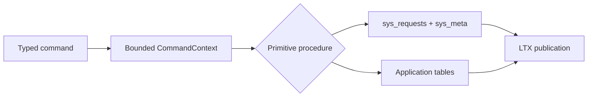
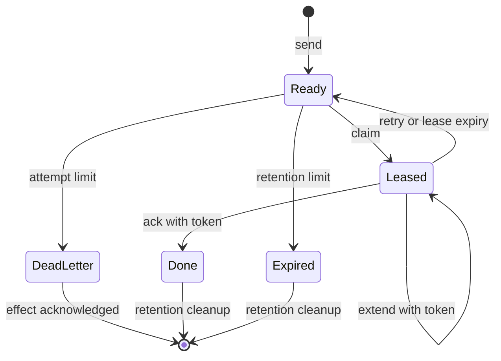
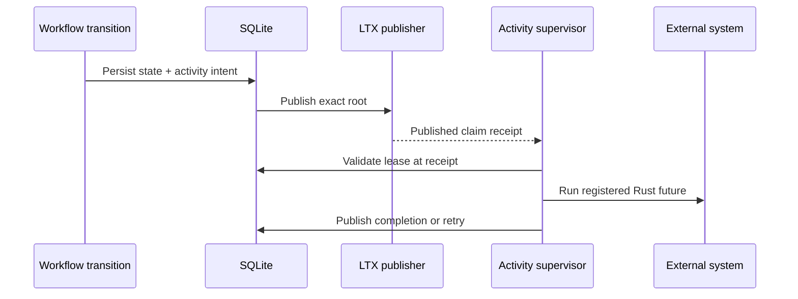
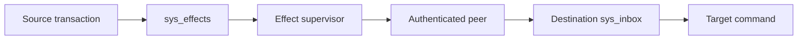

# Implement SQL, KV, Blob, Queue, Cron, and Workflow primitives

All primitives execute through typed Rust bindings and the same Cell actor. They share request deduplication, SQLite transactions, LTX publication, exact-root recovery, admission, and receipts.

| Document intent | Value |
| --- | --- |
| Content type | Reference |
| Audience | Native module authors and runtime contributors |
| Goal | Choose and use a primitive without creating a second durability path |

[Back to the Cell runtime index](README.md)

## Use one common transaction boundary

Commands receive `CommandContext`; queries receive `QueryContext`. Neither exposes a raw connection.



Runtime tables use the `sys_` prefix. The SQLite authorizer denies application SQL access to those tables, transaction control, connection configuration, and schema changes.

## Deduplicate every mutation

Application requests use a 16-byte request ID and a canonical operation digest. The ledger stores the encoded outcome before commit.

| Existing row | New request | Result |
| --- | --- | --- |
| No row | Valid identity and digest | Execute once |
| Same ID and digest | Any retry | Return stored outcome |
| Same ID, different digest | Conflicting reuse | Durable rejection |
| Expired identity | Any payload | Reject before handler |

Destination effects use `sys_inbox` and a 32-byte effect ID. Internal scheduler operations use short-lived identities that public listeners cannot submit.

## Use SQL for repository-local relational state

`SqlCell<M>` runs bounded parameterized batches against an explicit Cell with the SQL role.

```rust,ignore
let batch = SqlBatch {
    statements: vec![SqlStatement {
        sql: "INSERT INTO issues(title, state) VALUES(?, ?)".into(),
        parameters: vec![
            SqlValue::Text(title),
            SqlValue::Text("open".into()),
        ],
    }],
};

let committed = sql.batch(identity, batch).await?;
```

The SQL boundary enforces:

- 128 statements per batch
- 1 MiB encoded input
- 1,000 result rows
- 1 MiB encoded output
- Read-only statements on the query path
- Mutating statements on the command path
- No transaction or schema-control statements

Repository handlers should prefer typed command and query types over exposing arbitrary SQL at the HTTP boundary.

## Use KV for scoped atomic metadata

`KvNamespace<M>` hashes the scope to a fixed shard. Keys and list prefixes never cross that shard.

```rust,ignore
let request = KvAtomicRequest {
    scope: b"repo:123".to_vec(),
    checks: vec![KvCheck {
        key: b"settings/version".to_vec(),
        condition: KvCondition::Version(expected),
    }],
    mutations: vec![KvMutation::Put {
        key: b"settings/default_branch".to_vec(),
        value: b"main".to_vec(),
        expires_at_ms: None,
    }],
};

let outcome = kv.atomic(identity, request).await?;
```

The KV procedure applies all checks before any mutation. A failed check returns a durable `PreconditionFailed` outcome.

| KV contract | Limit or behavior |
| --- | --- |
| Atomic items | 128 checks and mutations combined |
| Value | 64 KiB |
| Version | Incarnation plus sequence, 28 bytes |
| Expiry | Logical timestamp evaluated inside the Cell |
| List order | Binary key order within one scope and prefix |
| Cleanup | Bounded scheduler Tick |

Deleting and recreating a key produces a new version. An old version cannot match the new incarnation and sequence.

## Use Queue for at-least-once work

Queue sends hash the producer ID to a shard. Consumers claim one explicit shard at a time.

```rust,ignore
let sent = queue
    .send(identity, QueueSendRequest {
        producer_id: request_id,
        payload,
        available_at_ms: now_ms,
    })
    .await?;

let claimed = queue
    .claim(
        claim_identity,
        shard,
        QueueClaimRequest { limit: 16, lease_ms: 30_000 },
    )
    .await?;
```

Queue state transitions are:



The claim command publishes its lease before returning payloads. Consumers validate the exact token at the claim receipt before starting external work.

| Queue contract | Limit or behavior |
| --- | --- |
| Payload | 256 KiB |
| Claim batch | Bounded by registered command output and item limit |
| Lease | 5s to 300s |
| Attempts | 20 |
| Retention | 30 days from enqueue |
| Ordering | No FIFO guarantee |
| Delivery | At least once |

A dead-letter transition inserts a typed durable effect in the same transaction. The source row retains its payload until that effect reaches a terminal state.

Queue controls are shard-scoped and use the same request ledger as sends and leases:

- Pause stops new claims and makes published-claim revalidation fail, while live leases may still ack, retry, or extend.
- Resume reopens claims and advances a monotonic control generation.
- Purge deletes only non-leased messages in batches of at most 128.
- Redrive moves dead messages back to ready only after any dead-letter effect is terminal.
- Info returns bounded aggregate counts instead of scanning message payloads.

## Use Blob for transactional object data

`BlobNamespace<M>` hashes the object key to a stable shard. Multipart uploads, parts, the published manifest, request outcomes, and LTX state commit in one SQLite transaction domain. A completed manifest never points at missing part data after restore or failover.

Blob supports:

- Multipart begin, idempotent part upload, atomic complete, and abort
- Create-only and ETag compare-and-swap publication or deletion
- Per-part BLAKE3 integrity verification on write and range read
- Bounded range reads and lexicographic per-shard listing
- Atomic replacement followed by deletion of the unreferenced prior upload
- Scheduler cleanup of expired, unpublished uploads

| Blob contract | Limit or behavior |
| --- | --- |
| Key | 1 to 1,024 bytes |
| Part | 256 KiB |
| Parts | 4,096 |
| Object | 1 GiB |
| Range read | 512 KiB |
| User metadata | 8 KiB |
| Upload lifetime | 1 minute to 7 days from mutation issuance; acceptance rejects an already expired upload |
| List | 128 objects from one explicit shard |

Blob bodies intentionally remain in the Cell database. This makes publication, backup, exact-root recovery, retention, and conditional replacement one failure domain. Moving bodies to a separate object-store path would require a staged-body publication protocol and independent reachability GC before it could preserve the same contract.

## Use Cron for failover-safe recurring triggers

Cron schedules are durable rows advanced only by the serialized Cell Tick. Each due occurrence inserts a typed cross-Cell effect and advances `next_due_ms` in the same transaction.

The destination receives `CronInvocation`, which includes schedule ID, generation, occurrence, scheduled timestamp, and the module payload. Registry construction verifies every compiled target namespace, command ID, codec version, and input limit against the release descriptor.

| Cron contract | Limit or behavior |
| --- | --- |
| Minimum interval | 1 second |
| Maximum interval | 1 year |
| First due time | Up to 5 years ahead |
| Payload | 256 KiB |
| Catch-up | One durable occurrence at a time, bounded by Tick budget |
| Delivery | Durable effect with destination inbox deduplication |
| Controls | Upsert, pause, resume at an explicit time, delete |

Blob upload lifetime and Cron's first-due window are evaluated from the
mutation's issued timestamp. The serialized Cell still rejects a Blob upload
whose expiry has passed before acceptance. A Cron schedule whose due time
passes while the mutation is waiting is accepted and becomes eligible on the
next Tick, preserving the caller's absolute schedule without making request
latency a correctness failure.

An owner crash after commit cannot lose an occurrence: the effect and next occurrence are in the same LTX root. A retry cannot execute the destination command twice because its inbox resolves the stable effect identity.

## Use Workflow for durable state machines

A workflow definition is compiled Rust with a stable digest. New runs pin the current digest; existing runs continue with the retained definition they started with.

```rust,ignore
impl WorkflowDefinition for MergeWorkflowV1 {
    fn digest(&self) -> Digest { MERGE_V1_DIGEST }

    fn transition(
        &self,
        state: &[u8],
        event: &[u8],
        context: WorkflowContext,
    ) -> Result<WorkflowDecision> {
        let event = MergeEvent::decode(event)?;
        decide_merge(state, event, context)
    }
}
```

Workflow transitions run inside SQLite and may produce:

- New durable workflow state
- Timers
- Native activities
- Typed cross-Cell effects
- Terminal completion, failure, or cancellation

The transition callback cannot perform network or object-store I/O. Native activities run after their claim root is published.



Workflow IDs select the shard. Signal IDs make delivery idempotent. Activity completion requires the exact lease token and attempt.

Workflow controls preserve the deterministic history boundary:

- Pause is accepted only when no activity lease is live. Ready activities and timers remain durable but cannot be claimed or fired.
- Resume returns the same run to running state without synthesizing an event.
- Restart is accepted only for a terminal run. It deletes the terminal local history and starts a new run under a new request-derived run ID and the current definition.
- Cancel remains an idempotent workflow event and cancels outstanding local work.

The quiescent-pause rule avoids converting an already-running external side effect into a lost completion and unintended replay.

| Workflow contract | Limit or behavior |
| --- | --- |
| State or event payload | 1 MiB |
| Activity payload | 256 KiB |
| Activity attempts | 20 |
| Activity lifetime | 7 days |
| Definitions | Current plus every digest referenced by stored runs |
| Execution | Deterministic transition; retryable native activity |

## Deliver cross-Cell effects through an inbox

A command may create an `EffectBatch`. Effects carry typed Cell commands only and inherit the source tenant and application.



Registry validation requires every effect target namespace to be declared. Cross-tenant targets fail before writes.

The delivery path preserves these properties:

- Effect bytes and operation digest remain stable across retries
- Destination incarnation is resolved at delivery time
- Destination inbox deduplicates execution
- Destination success means its exact root was published
- Source acknowledgement happens in a later source transaction
- `Resolve` recovers an ambiguous destination result

The design doesn't claim an atomic transaction across source and destination. It provides durable at-least-once delivery with idempotent destination execution.

## Let the scheduler advance time-based state

Each mutating procedure recomputes the earliest due timestamp inside its transaction. The typed Tick advances bounded work from all installed classes.

| Maintenance class | Example |
| --- | --- |
| Request ledger | Delete expired outcomes |
| KV | Remove expired entries |
| Queue | Reclaim leases, expire messages, clean terminal rows |
| Workflow | Fire timers, retry activities, clean terminal runs |
| Blob | Delete expired unpublished uploads |
| Cron | Publish due occurrences and advance schedules |
| Effects | Claim, retry, extend, acknowledge, clean source or inbox rows |

When a Tick reports no local transition, the compiled registry tells the scheduler whether an activity or effect runner can claim work for that namespace.

## Install only compiled primitive modules

Primitive mechanics are reusable, but registration is not automatic. A new module must include:

1. A concrete native Rust module caller
2. A stable namespace and shard count
3. A SQL migration with a checked digest
4. Typed operation IDs and codec fixtures
5. Exact-root restore coverage
6. Capacity and failure tests for its workload

Do not add a public generic SQL, KV, Blob, Queue, Cron, or Workflow endpoint. Product-specific HTTP handlers remain the external API.
