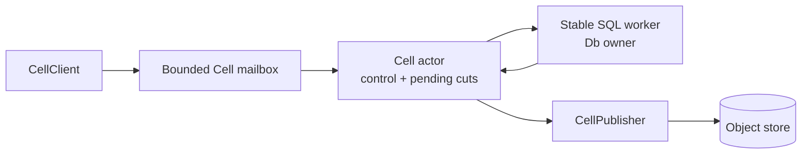
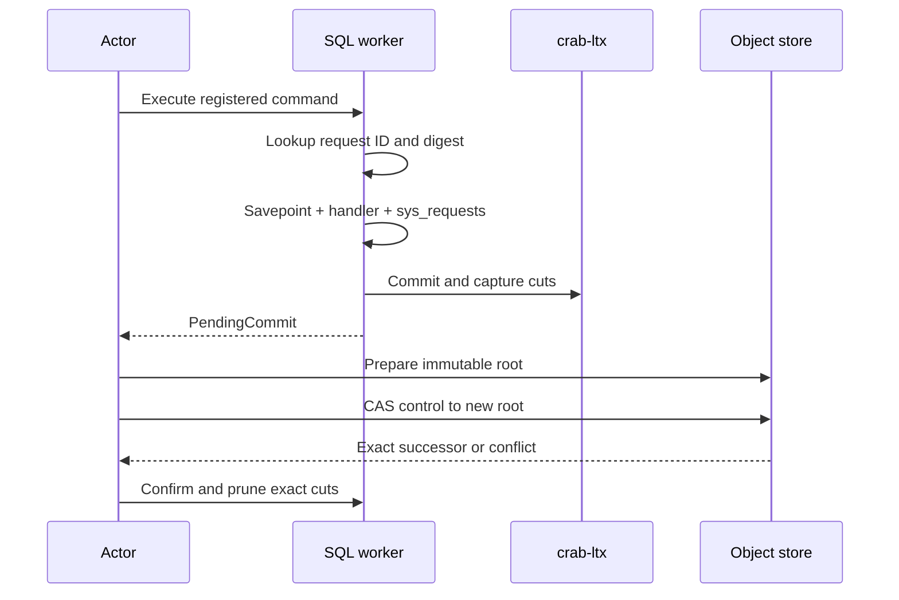
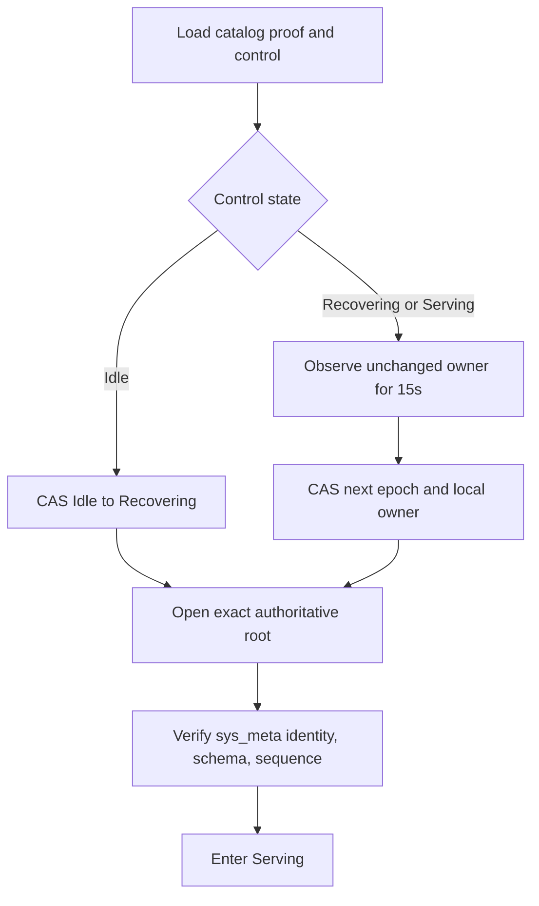
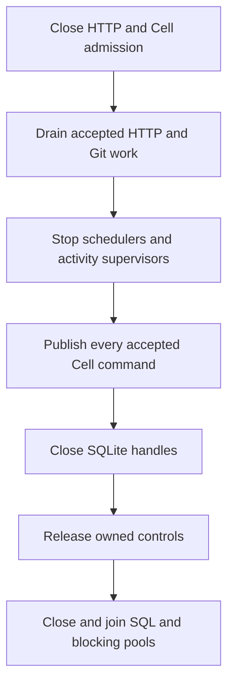

# Trace Cell execution and failure recovery

The Cell runtime serializes accepted commands, binds each SQLite commit to an immutable LTX root, and publishes that root through one authoritative control CAS. This page defines the actor, transaction, timeout, takeover, and shutdown behavior.

The product path races exact object-store publication with a write-all follower
proof. Either proof may release a command result. The actor remains occupied
until object publication finishes, so later work cannot observe an unpublished
head. If the owner dies first, takeover seals the failed node log and pins and
consumes its recovery overlays before serving. See
[Follower durability and warm failover](failover-and-followers.md).

| Document intent | Value |
| --- | --- |
| Content type | Reference |
| Audience | Runtime contributors |
| Goal | Implement or debug one Cell without violating publication and fencing invariants |

[Back to the Cell runtime index](README.md)

## Separate actor ownership from SQL execution

One actor owns the Cell state machine. A fixed worker pool owns SQLite connections.



`CellHandle` is a cloneable mailbox sender. It never exposes a SQLite connection. Stable Cell-ID routing keeps one `Db` on one operating-system thread until close.

The node bounds:

- SQL worker count from 1 through 16
- 256 queued commands per worker shard
- 10,000 active Cells per node before resource-derived reductions
- Per-Cell request and byte admission
- Node-wide memory, disk, and activity admission

Cancellation of a caller doesn't cancel accepted work. The actor still records and publishes the result, so a retry can resolve it.

## Execute commands in six phases

The actor completes these phases in order:



The worker transaction applies this procedure:

1. Validate the request ID, operation digest, expiry, and input bound
2. Return a stored outcome when both identity and digest match
3. Reject identity reuse when the stored digest differs
4. Open an application savepoint
5. Execute the registered synchronous handler
6. Store success or durable rejection in `sys_requests`
7. Advance `sys_meta.sequence` and derive `next_due_ms`
8. Commit SQLite and capture every unpublished cut

Handler errors roll back the application savepoint. Runtime ledger updates still commit when the error is a durable business rejection. Every registered call reports its owning module, kind, outcome, and duration to the installed `CellTelemetry` sink from the thread that executed the handler, so the server can chart one primitive module without knowing its operations.

## Publish before replying

`PendingCommit` owns the request identity, predecessor control, encoded reply, commit sequence, and captured cuts. The actor doesn't accept the next mutation until this commit reaches a terminal publication result.

| Publication result | Actor action | Caller outcome |
| --- | --- | --- |
| CAS accepted | Confirm root, prune exact cuts | Committed result with receipt |
| Response lost, origin equals proposal | Adopt exact successor | Committed result with receipt |
| Transient preparation failure | Retry with bounded backoff and renew ownership | Caller continues waiting |
| CAS winner differs | Fence, discard local handle, reload authority | Outcome unknown |
| Deadline expires after SQL started | Interrupt SQLite, fence admission, wait for callback exit | Outcome unknown |

When a follower proof wins but immutable-object publication returns a storage
error, the actor keeps the ordered publication obligation and retries it with
bounded backoff for a short grace period. The fleet-proven result and logical
head remain readable while the exact object root catches up; if the root still
cannot be published when the grace period expires, the Cell fences and leaves
the node-log tail for takeover recovery. A control conflict, lease loss, or
non-storage publication error fences immediately.

The actor never reruns a handler after SQLite may have started it. `Resolve` reads the durable ledger at an authoritative root.

Runtime capture leaves each complete local LTX file readable but defers its
file and directory flush. The actor then submits those exact bytes to the node
log and object publisher. A follower fsync or authoritative object-root CAS—not
the owner-local file—proves durability before a result can be observed. After
the root publishes, the worker reverifies and deletes the matching local cut
without first flushing either that copy or its deletion. Every activation owns
a fresh local session, so a crash can leave only quarantined residue; it cannot
turn that residue into acknowledged state. Standalone `crab_ltx::Db::capture()`
remains synchronously durable.

Immutable-root preparation pins every selected capture by its open file handle
through verification and upload retries. Later path replacement cannot change
the source. LTX inspection verifies its declared metadata and digest, and the
multipart uploader hashes the complete file again before publishing the
immutable object. The path performs no defensive local copy or scratch flush;
the proposal cannot reach authority until all immutable dependencies upload
successfully. Multi-cut batches open and inspect up to four pinned captures at
once while the immutable predecessor graph is verified independently. The
ordered descriptors are joined only before exact chain validation.

Fresh `Db` captures privately retain the page index already authenticated by
their encoder. Root preparation reuses it instead of decoding the same local
LTX file again, while multipart upload still verifies every source byte against
the captured digest. Caller-constructed local segments do not carry this
private provenance and retain the full inspection path.
Index retention is capped at 1 MiB per pending `CaptureBatch`; larger capture
cohorts fall back to decoding. Descriptor construction, directory updates, and
index upload share the retained bytes rather than copying them at each stage.
The executor retains only one unpublished batch.

Root preparation also overlaps independent content-addressed uploads. The LTX
body and index, changed and initial directory nodes, and root metadata use
bounded concurrency under the runtime's shared I/O permits. Initial directory
construction retains at most eight encoded nodes awaiting upload. The proposal
remains private until every dependency upload completes, so authority cannot
observe a partial root.

## Use receipts for read consistency

A receipt identifies the Cell incarnation and commit sequence. A query with a minimum receipt runs only after the local owner reaches that position.

```rust,ignore
let committed = issues
    .create(identity, create_input)
    .await?;

let observed = issues
    .get(Some(committed.receipt), committed.output.number)
    .await?;
```

Queries run on the owning SQL worker under a read-only application boundary. They don't produce LTX, modify control, or bypass namespace and schema checks.

## Apply one absolute operation deadline

Native commands and queries receive a five-second wall deadline. The same deadline covers:

- Waiting for the SQL worker
- Synchronous Rust handler execution
- SQLite progress interruption
- Sparse page faults
- Object-store range reads triggered by the sparse VFS

Arbitrary Rust cannot be preempted safely. When a callback exceeds the deadline, admission closes immediately, but the runtime retains worker and byte permits until the callback exits.

After exit, recovery closes the SQLite handle and reloads control. It releases only authority that still names the same Cell, incarnation, code, schema, owner, and epoch.

## Recover from panic without losing the worker

The worker catches native callback panic at its fixed thread boundary. SQLite unwinds the transaction, the affected Cell becomes fenced, and the worker continues serving other Cells.

| Panic point | Result |
| --- | --- |
| Before control publication during bootstrap | Release admission; no owner becomes visible |
| Inside an accepted command | Return outcome unknown; quarantine tentative local state |
| Inside a native activity | Record activity failure or retry; keep worker pool alive |

Production code must not use panic as application control flow.

## Acquire and take over a Cell safely

Idle acquisition and stale-owner takeover both reserve local capacity before claiming authority.



Any control change restarts the 15-second observation period. The winner hydrates only after its ownership CAS succeeds. A losing contender doesn't download the database.

Sparse activation starts with no materialized pages. Full recovery reserves destination bytes before download and installs through an exclusive same-directory scratch file.

## Renew and self-fence ownership

One node-level scanner renews owned Cells every three seconds. A mutation publication also advances owner progress.

The runtime closes admission when it cannot prove ownership for ten seconds. It doesn't wait for the 15-second takeover window to expire.

Renewal changes owner liveness fields only. It preserves root, code, schema, and durable `next_due_ms`.

## Schedule durable work from SQLite state

Bootstrap and every command transaction derive the earliest durable deadline from SQLite. The published control binds `next_due_ms` to the same root.

The node scheduler:

1. Ticks resident Cells whose published due time has passed, from memory
2. Consumes due hints: one key per released deadline, listed from the current
   minute bucket and the five behind it, each confirmed against its control
3. Reads revision-pinned catalog pages and assigns 256 catalog shards through
   rendezvous hashing
4. Runs the shard scan as a backstop every thirtieth cycle, visiting at most
   128 due Cells per scan
5. Sends the typed maintenance Tick locally or to the authenticated owner
6. Acquires an idle or stale Cell only when no valid owner can execute the Tick
7. Runs registered activity and effect supervisors outside SQLite

Steps 1 and 2 run every cycle, so a Cell this node owns and a Cell whose owner
released it with a deadline are both ticked without a population scan. Step 4
is what covers a missing hint — a failed write, a hint older than its window,
or a Cell released before hints existed — and bounds that case at one backstop
period instead of a full shard pass.

A hint names one released Cell's deadline in the minute bucket that deadline
falls in, and a listing walks the current bucket and the five behind it. A
release whose deadline is already further behind than that window publishes
nothing: no listing would see the key, so the backstop covers it instead of
leaving behind an object nothing consumes. A key a listing meets but cannot
parse is deleted, so a foreign object under the prefix cannot be re-listed
forever.

A Tick advances at most 128 ledger, expiry, lease, timer, or retention items. Protected shares prevent one maintenance class from starving another, and a Tick that reserves a share for a class it does not run fails instead of silently shrinking its usable work.

## Shed under node pressure

The actor samples its own reservation ledger four times a second: memory is resident plus retained bytes, disk is the replica budget, and jobs are the worker, primitive, and hydration aggregate the placement block advertises. The sample therefore reports what this node admits, not a host guess.

The hysteretic classifier enters shedding at 80 percent on any dimension and returns to normal below 60 percent, and either transition needs evidence sustained for one second. While shedding, the actor starts one bounded eviction per sample through the same movement budget and victim selection a transfer uses, so a hot node releases settled Cells instead of admitting work it cannot hold. A brief spike never triggers a move.

## Drain in ownership order

A clean per-Cell drain closes SQLite before releasing control to `Idle`. Releasing control first would allow a successor to open while the previous writer still owns local mutable state.

Node shutdown follows this order:



Readiness closes as soon as terminal drain starts. Remaining runtime, pool, or handle clones stay permanently closed after shutdown.

## Preserve these invariants

Runtime changes must preserve all of these conditions:

- One actor serializes mutations for one Cell
- Every accepted mutation reaches a published result or an explicit unknown outcome
- The runtime replies with success only after exact root publication
- Lost CAS responses are accepted only when origin equals the exact proposal
- Fenced local SQLite state never becomes a future publication source
- Draining closes SQLite before releasing control
- Internal, application, and effect outcomes use their distinct retention contracts
- Scheduler state comes from the same SQLite transaction as application state

Use [delivery.md](delivery.md) for the tests that prove these paths.
