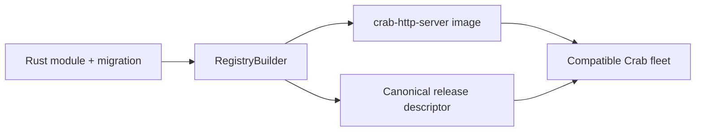
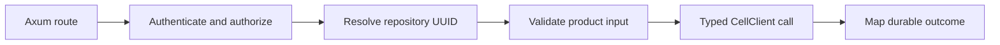
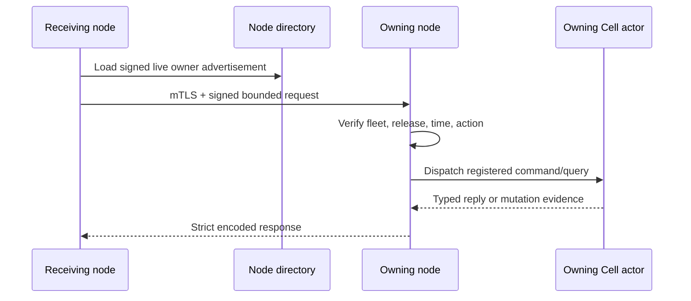

# Add a native Rust service to Crab

Crab services are statically linked Rust modules. A module declares stable schemas, operation IDs, codecs, namespaces, workflow definitions, and activities; `crab-http-server` freezes that inventory before readiness.

| Document intent | Value |
| --- | --- |
| Content type | How-to and API reference |
| Audience | Crab feature contributors |
| Goal | Add one typed product feature and deploy it through the existing server |

[Back to the Cell runtime index](README.md)

## Understand the compile-time boundary

The server is the only composition root. Repository owners cannot upload executable code or choose a module set at runtime.



The runtime intentionally excludes:

- Dynamic libraries
- WebAssembly or JavaScript execution
- Subprocess handlers
- Network registration
- Public primitive SDKs
- Per-repository executable bundles

A separate workspace crate may organize domain code, but `crab-http-server` still owns registration, authentication, routing, and lifecycle.

## Declare a module descriptor

`ModuleDescriptor` is static inventory. `RegistryBuilder::finish` compares it with the functions actually bound by the binary.

```rust,ignore
static REPOSITORY: ModuleDescriptor = ModuleDescriptor {
    name: "repository",
    source_digest: REPOSITORY_SOURCE_DIGEST,
    retained_codes: RETAINED_CODES,
    schema_min: 1,
    schema_max: 2,
    migrations: MIGRATIONS,
    commands: COMMANDS,
    queries: QUERIES,
    workflow_definitions: WORKFLOW_DIGESTS,
    activity_types: ACTIVITY_TYPES,
    namespaces: NAMESPACES,
};
```

The registry rejects:

- Duplicate module, namespace, command, or query IDs
- Missing or extra function bindings
- Noncontiguous schema migration coverage
- Incorrect migration digests
- Narrowed codec ranges or byte limits
- Undeclared effect targets
- Queue dead-letter cycles
- Missing workflow definitions or activity bindings

Registration order does not change canonical release bytes.

## Register typed commands and queries

A command mutates one Cell. A query observes one Cell at an optional minimum receipt.

```rust,ignore
pub struct RenameRepository;

impl Command for RenameRepository {
    const MODULE: &'static str = "repository";
    const ID: u32 = 21;
    const CODEC_VERSION: u32 = 1;

    type Input = RenameInput;
    type Output = RepositorySettings;

    fn execute(
        context: &mut CommandContext<'_, '_>,
        input: RenameInput,
    ) -> Result<CommandResult<Self::Output>> {
        rename_repository(context, input)
    }
}
```

The registry uses monomorphized decode, execute, and encode trampolines. It does not expose a raw byte-handler escape hatch.

```rust,ignore
registry.bind_command::<RenameRepository>()?;
registry.bind_query::<GetRepositorySettings>()?;
```

Command and query IDs are independent. Changing a wire shape requires a new codec version, not a silent reinterpretation.

## Encode bounded wire values

Every command input and output implements `WireValue`. The codec supports fixed-width scalars, bounded bytes and text, counts, and strict option tags.

```rust,ignore
impl WireValue for RenameInput {
    fn encode(&self, out: &mut BoundedEncoder) -> Result<(), CodecError> {
        out.write_text(&self.name)
    }

    fn decode(input: &mut BoundedDecoder<'_>) -> Result<Self, CodecError> {
        Ok(Self {
            name: input.read_text()?.to_owned(),
        })
    }
}
```

Decoding rejects trailing bytes, invalid tags, noncanonical floating-point values, and declared-limit overflow. Add exact byte fixtures for every new input and output version.

## Use transaction-scoped capabilities

`CommandContext` exposes deterministic metadata and bounded procedures.

| Capability | Purpose |
| --- | --- |
| `cell_id()` | Read the verified target Cell ID |
| `target()` | Derive deterministic effect targets |
| `sequence()` | Allocate stable transition-local identities |
| `now_ms()` | Use the runtime-sampled logical timestamp |
| `sql()` | Execute an authorized bounded SQL batch |
| `effect_batch()` | Create typed cross-Cell intentions |

`QueryContext` exposes the Cell ID, commit sequence, logical timestamp, and bounded read-only SQL.

Contexts do not expose database paths, raw object storage, control records, HTTP clients, or transaction commit methods.

## Call a command through CellClient

Product code resolves a `CellTarget`, authenticates the product request, and creates a stable mutation identity before dispatch.

```rust,ignore
let result = client
    .command::<RenameRepository>(
        &target,
        MutationIdentity {
            request_id,
            issued_at_ms: issued_at,
            expires_at_ms: expires_at,
        },
        RenameInput { name },
    )
    .await;

match result {
    Ok(committed) => respond(committed.output, committed.receipt),
    Err(InvocationError::Rejected(committed)) => reject(*committed),
    Err(InvocationError::Pending(evidence)) => resolve_later(*evidence),
    Err(error) => fail(error),
}
```

`CellClient` validates namespace, role, code, schema, and incarnation. It chooses the local actor or authenticated peer path without changing command semantics.

## Stream mutable Cell state safely

Use `CellStateStream` when a response producer must query mutable Cell state
after the response head. Emission is serial, receipt-monotonic, bounded by one
deadline, and fail-closed on cancellation or owner fencing.

```rust,ignore
let mut stream = client
    .open_state_stream::<GetRepositoryEvents>(&target, deadline)
    .await?;

let first = stream.emit(GetEventsInput { after: None }).await?;
send_chunk(first.output).await?;

let next = stream
    .emit(GetEventsInput {
        after: Some(first.receipt.commit_sequence),
    })
    .await?;
send_chunk(next.output).await?;

stream.finish();
```

Each `emit` passes the preceding `Receipt` as the next minimum watermark. An
HTTP/SSE adapter must send a chunk only after `emit` returns; it must not read
the Cell handle or logical head directly. Call `stream.cancellation().cancel()`
from a disconnect handler to wake a pending emission.

## Keep HTTP policy in crab-http-server

A route adapter performs product concerns before invoking the runtime.



The runtime must not know browser sessions, repository names, organization roles, Git ref policy, or HTTP status codes.

## Register a primitive capability

Primitive modules bind fixed operation IDs to their typed handles.

```rust,ignore
impl KvModule for RepositoryCache {
    const MODULE: &'static str = "repository";
    const ATOMIC_COMMAND_ID: u32 = 30;
    const GET_QUERY_ID: u32 = 31;
    const LIST_QUERY_ID: u32 = 32;
}

register_kv::<RepositoryCache>(&mut registry)?;
```

The namespace descriptor must declare the matching role and shard count. Queue and Workflow modules also implement maintenance registration so the scheduler can advance leases, timers, and retention.

Read [primitives.md](primitives.md) before binding a primitive.

## Run external work as a native activity

Command handlers stay synchronous and deterministic. An activity may call Git, object storage, or another service after its claim root is published.

```rust,ignore
impl ActivityHandler for PublishRelease {
    const TYPE: &'static str = "publish-release";

    fn execute(
        context: ActivityContext,
        payload: Vec<u8>,
    ) -> Pin<Box<dyn Future<Output = ActivityExecution> + Send + 'static>> {
        Box::pin(async move {
            publish_release(context, payload).await
        })
    }
}
```

Async activities run under a CPU-derived bound. Blocking activities reserve a slot in a joined fixed operating-system thread pool before claim.

The supervisor validates the exact published lease, heartbeats through durable commands, and records completion or retry. Panic becomes activity failure and does not kill the pool.

## Forward only private registered messages

The peer protocol is private to compatible Crab nodes. [`contracts/peer.proto`](contracts/peer.proto) defines messages but no generated public service.



The protocol permits at most two forwarding hops. Mutation retries happen only when transport proves the first attempt did not start. Ambiguous attempts use `Resolve`.

SQL text never crosses the migration peer boundary. The owner derives a trusted migration from its frozen registry.

## Add a native feature

Implement one vertical slice in this order:

1. Add the application migration and its checked digest
2. Declare stable namespace, operation, codec, and byte-limit descriptors
3. Implement `WireValue` for inputs and outputs
4. Implement typed commands, queries, or activities
5. Bind every declaration in the server's compiled registry
6. Add the authenticated product route adapter
7. Test replay, rejection, source-loss restore, and exact publication
8. Inspect the built binary's canonical release descriptor
9. Roll the complete server image through release activation

Keep the change one canonical path. Do not retain a legacy storage fallback unless a shipped contract requires it.

## Preserve version compatibility during rollout

A rolling-compatible binary must retain every code and schema pair that authoritative Cells may still use. It must also retain referenced command codecs, migrations, workflow definitions, activities, namespaces, and byte limits.

The release gate rejects a candidate that narrows those contracts. An incompatible change requires maintenance activation and a purpose-built transform when stored work cannot drain naturally.

Rollback operates at whole-image granularity. The older image may return only while its compiled registry still supports every authoritative Cell.
