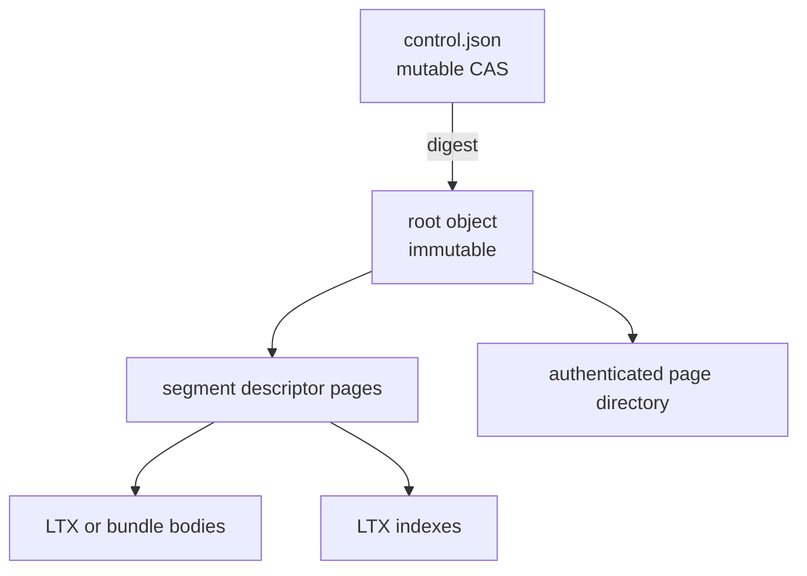
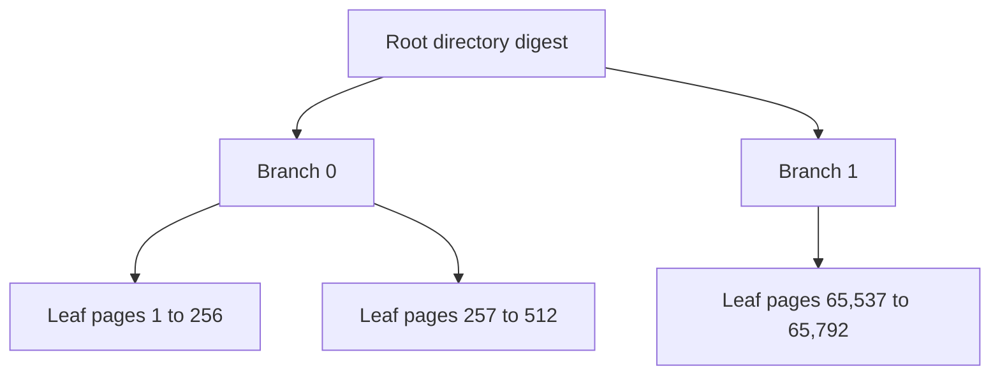
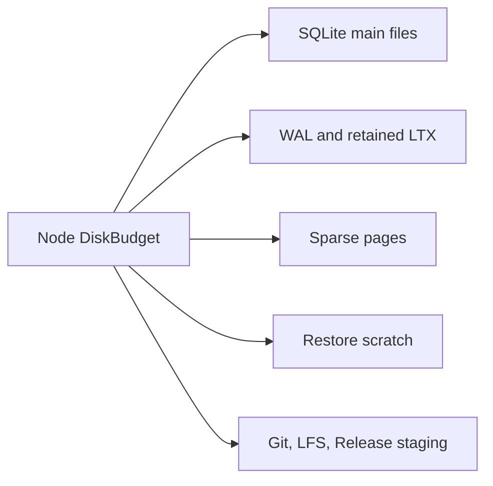
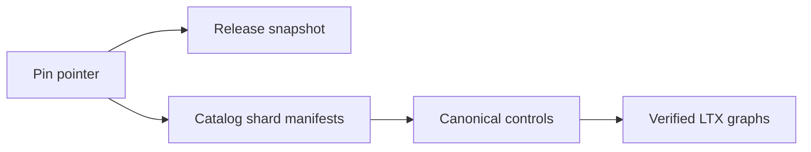

# Inspect Cell storage and exact recovery

Cell storage separates one mutable authority record from immutable SQLite history. Readers verify every immutable object by digest, while writers update authority with an observed object-store ETag.

| Document intent | Value |
| --- | --- |
| Content type | Reference |
| Audience | Storage, LTX, and runtime contributors |
| Goal | Implement identity, control, root, page, and recovery paths without weakening verification |

[Back to the Cell runtime index](README.md)

## Derive stable identities

Tenant, application, namespace, session, incarnation, and request IDs are 16 bytes. Cell IDs and BLAKE3 digests are 32 bytes.

```text
LP(x) = u32_be(length(x)) || x

cell_id = BLAKE3(
  "crab.cell.v1\0" || tenant_id || application_id ||
  namespace_id || LP(partition)
)
```

Partition bytes have a 1,024-byte limit. Routing uses stable namespace rules:

| Primitive | Partition input |
| --- | --- |
| Repository SQL | Repository UUID |
| KV | Hash of scope |
| Queue send | Hash of producer ID |
| Queue claim | Explicit shard number |
| Workflow | Hash of workflow ID |

Shard counts are powers of two from 1 through 4,096. An existing namespace cannot change its shard count.

## Keep object paths typed

`crab-storage::CellStorageLayout` constructs every path. Callers never concatenate untrusted path fragments.

```text
cells/v1/identity.json
cells/v1/apps/<app>/release.json
cells/v1/apps/<app>/releases/<digest>.json
cells/v1/apps/<app>/catalog/<00..ff>/head.json
cells/v1/apps/<app>/catalog/objects/<digest>.json
cells/v1/apps/<app>/cells/<cell>/control.json
cells/v1/apps/<app>/cells/<cell>/inc/<inc>/objects/<digest>.<kind>
cells/v1/apps/<app>/pins/<pin-id>.json
cells/v1/apps/<app>/pins/objects/<digest>.json
cells/v1/nodes/<session>.json
```

Path IDs use fixed-width lowercase hexadecimal. Immutable kinds are `ltx`, `index`, `dir`, `root`, and `bundle`.

`identity.json` strict-creates the tenant and application identity for one configured storage root. Concurrent initializers may adopt only the exact same winner.

## Treat control as the only mutable Cell authority

`control.json` identifies the owner and exact durable root. Its body is strict canonical JSON with an 8 KiB limit.

| Field | Contract |
| --- | --- |
| `version` | Integer `1` |
| `cell` | 64 lowercase hexadecimal characters; matches the path |
| `incarnation` | 32 lowercase hexadecimal characters |
| `epoch` | Canonical decimal `u64`, at least `1` |
| `revision` | Canonical decimal `u64`, at least `1` |
| `progress` | Canonical decimal `u64` |
| `state` | `recovering`, `serving`, `idle`, or `tombstoned` |
| `owner` | `null` or session plus endpoint, bounded to 512 bytes |
| `root` | `null` or exact `RootRef` |
| `code` | Compiled module digest |
| `schema` | Positive `u32` |
| `next_due_ms` | `null` or nonnegative decimal `i64` |

`RootRef` contains `digest`, `txid`, `checksum`, and `commit_sequence`. Native APIs add Cell and incarnation IDs so a reference cannot cross scopes.

ETags are mutation tokens, not content hashes. Authority reads bypass caches. Every replacement validates the runtime transition table before calling conditional update.

## Store roots as bounded immutable graphs

One root identifies the complete SQLite state at one transaction ID.



The root has a 32 KiB limit and names at most 64 segment-page digests. Each segment page has a 64 KiB limit and at most 96 descriptors. The full graph allows at most 4,096 segment descriptors.

The graph obeys these checks:

- The first segment is a full snapshot
- Later transaction ranges are contiguous through the root transaction ID
- Pre and post checksums connect every segment
- Every body and index digest matches downloaded bytes
- Offset and length arithmetic uses checked operations
- Bundle descriptors identify one exact extent with no fallback location
- The root's sequence and schema match SQLite `sys_meta`

At 3,072 descriptors, the owner schedules compaction aggressively. At 4,096, it rejects new writes until compaction frees capacity.

## Locate pages with an authenticated radix tree

The page directory avoids a resident locator map for large databases. Leaves cover 256 SQLite page numbers; branches have fanout 256.



Each node starts with a 32-byte `CRBDIR01` header. A leaf record stores:

| Value | Size |
| --- | ---: |
| Page number | 4 bytes |
| Physical object digest | 32 bytes |
| Absolute frame offset | 8 bytes |
| Frame length | 4 bytes |
| Frame BLAKE3 | 32 bytes |
| Decoded page checksum | 8 bytes |

Branch records store page range, child digest, live-page count, and XOR checksum. Parent aggregates must equal their children.

Initial construction k-way merges ordered indexes and uploads leaves as they become complete. Incremental publication rewrites only paths touched by changed or truncated pages.

## Read sparse pages without blocking the SQL pool

Sparse SQLite opens the exact root and materializes pages on demand. A dedicated page-I/O worker performs object-store reads, so SQL workers may wait without consuming the same executor needed to satisfy their fault.

The read path:

1. Resolve the leaf through digest-pinned directory nodes
2. Coalesce adjacent frames up to 1 MiB
3. Read the exact object range
4. Verify the frame BLAKE3 and page checksum
5. Materialize the page through the injected filesystem
6. Charge the page once to the shared disk budget

Missing allocated pages are corruption. The runtime never converts them to zero-filled application data.

## Share one local disk budget

`DiskBudget` and `DiskReservation` account every local byte on the configured volume.



Managed writes reserve twice the maximum capture size before SQLite starts. After capture or checkpoint, the runtime reconciles that reservation to measured main, WAL, and retained-LTX bytes.

Pre-transaction capacity rejection is retryable and does not fence the Cell. A failure after SQLite starts retains conservative admission until the handle closes.

## Restore an exact root atomically

Full restore reserves the destination database bytes before remote reads. Sparse takeover begins with zero materialized pages and charges each fault.

Full restore follows this procedure:

1. Reject an existing destination or SQLite sidecar before download
2. Create an exclusive private scratch file in the destination directory
3. Stream verified adjacent frame runs capped at 1 MiB
4. Reduce page checksums independently to the root checksum
5. Verify final length and synchronize the scratch file
6. Link the scratch file into the absent destination
7. Synchronize the parent directory
8. Remove the private scratch name

Cancellation and verification failure remove only the scratch file owned by that attempt. The restore path never replaces an existing destination.

## Compact without changing logical state

Compaction is a representation-only publication. It preserves transaction ID, checksum, commit sequence, schema, due summary, and database endpoint.

The implementation externally merges authenticated index streams by page number. It reads bounded frame ranges and uploads scratch-backed output without retaining a whole database or LTX body in memory.

Scheduled compaction promotes eight or more contiguous inputs from one level. Admission pressure may force a full level-nine replacement before the next append.

## Catalog Cells before creating control

The catalog has 256 shards selected by the first Cell-ID byte. Each shard head names at most 256 immutable pages, and each page contains at most 256 sorted entries.

An entry stores:

- Cell ID
- Namespace ID
- Partition bytes
- Role
- Initial code digest
- Initial schema version

The per-shard ceiling is 65,536 entries. Provisioning uploads the immutable catalog page and CASes its head before creating `control.json`. A crash may leave an unused catalog entry, but never an unproven mutable Cell.

`CellAuthority::create_initial` requires a verified `CatalogProof`. Readers recompute every Cell ID and enforce ordering across page boundaries.

## Pin one exact application backup boundary

A backup pin is an immutable application-wide recovery root. Creation observes
all 256 catalog heads before traversing their pages, then binds the exact set of
cataloged Cells to one canonical control per Cell.



The pin stores the application identity, creation time, all catalog revisions,
the release-snapshot digest, control count, and nonempty shard manifests. The
release snapshot contains the canonical release record and the exact descriptor
digests selected by it. Control pages and manifests are content addressed under
`pins/objects/`; the pin pointer is strict-created last.

Creation and verification fail closed when:

- a catalog page, release descriptor, control page, root object, LTX body,
  index, bundle, or directory node is absent or has the wrong digest;
- catalog membership and captured controls differ;
- a control crosses its catalog shard or controls are not globally ordered;
- the pin ID already identifies a different canonical body.

Repeating creation with an existing pin ID reopens and verifies the existing
boundary. Restore first verifies the full source pin, then copies immutable
objects to another prefix in the same bucket with create-if-absent semantics.
It independently verifies the destination graph before publishing unowned
`Idle` controls, exact catalog heads, the ready release record, and finally the
pin pointer.


This ordering makes an interrupted offline restore resumable and keeps stale
source node sessions out of the new authority root. A destination that has
divergent identity, controls, catalog heads, release selection, or immutable
bytes fails closed. Cross-provider archive export remains a separate service
operation.

## Collect unreachable immutable objects behind maintenance

Collection is an explicit maintenance activation, never a background request
handler. The release first enters `Maintenance`, normal nodes drain, and one
signed zero-capacity executor becomes the only NodeDirectory member. Backup
creation also holds a zero-capacity advertisement for its complete operation,
so maintenance either waits for an in-flight pin or fences a later creator at
its second `Ready` check.


The mark phase fails before deletion unless it can authenticate:

- current and desired release descriptors;
- every current catalog page and non-tombstoned control root;
- every retained pin's release, catalog, control pages, and LTX graph; and
- the absence of an owner on every current control.

Reachable paths live in a temporary SQLite `WITHOUT ROWID` table on bounded
local scratch storage. Remote inventory is consumed as a stream, and candidate
lookups use batches of 256 paths. The collector deletes only recognized V1
content-addressed release, catalog, pin, and Cell-incarnation object paths.
Mutable authority and unknown future layouts are never candidates.

Deletion also requires the provider object's modification time to be older than
the configured grace. One pass deletes at most 100,000 objects; the server
defaults to 10,000 when collection is requested. Reaching the selected bound
leaves the release in `Maintenance`. Repeating the same activation resumes from
a new verified mark scan, so writes never reopen between partial passes.

## Preserve storage verification invariants

Storage changes must preserve these conditions:

- Control is the only mutable owner and root authority
- Immutable bytes are verified before decoding or execution
- A root is scoped to one Cell and incarnation
- Full and sparse restore produce the same verified SQLite state
- Destination admission runs before downloading restore data
- Compaction changes representation, never logical position
- Local files are caches and cannot override object-store authority
- Provider construction, credentials, and HTTP policy remain outside `crab-ltx`
