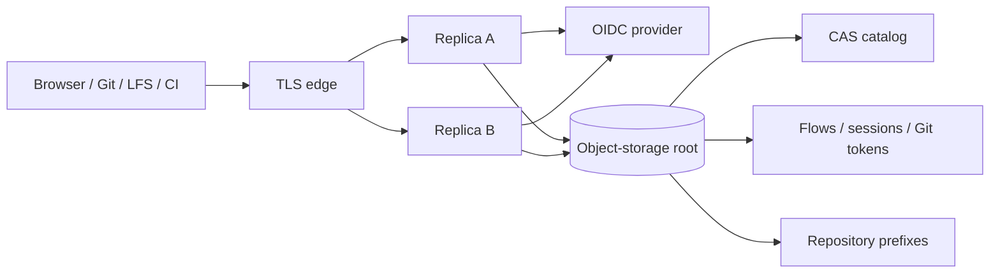
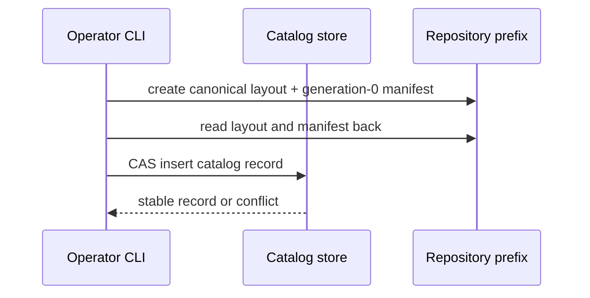
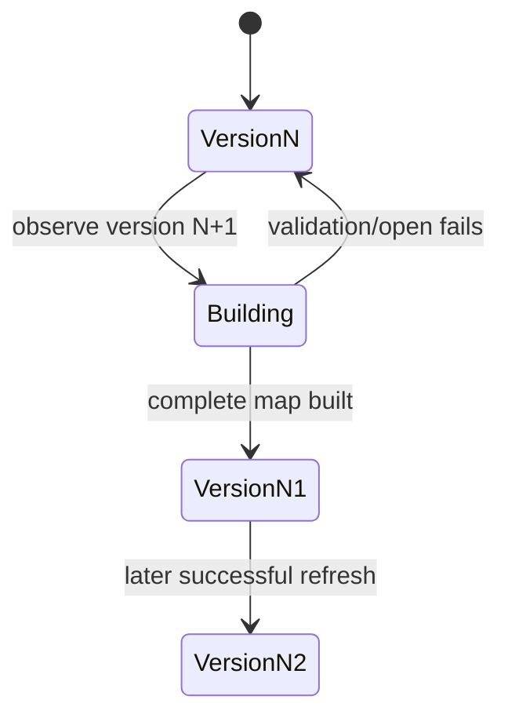
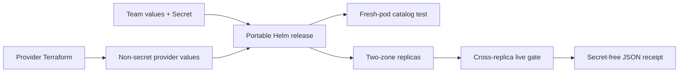
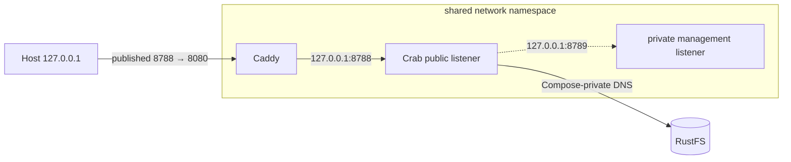
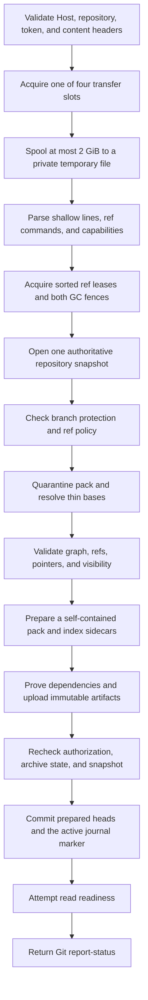
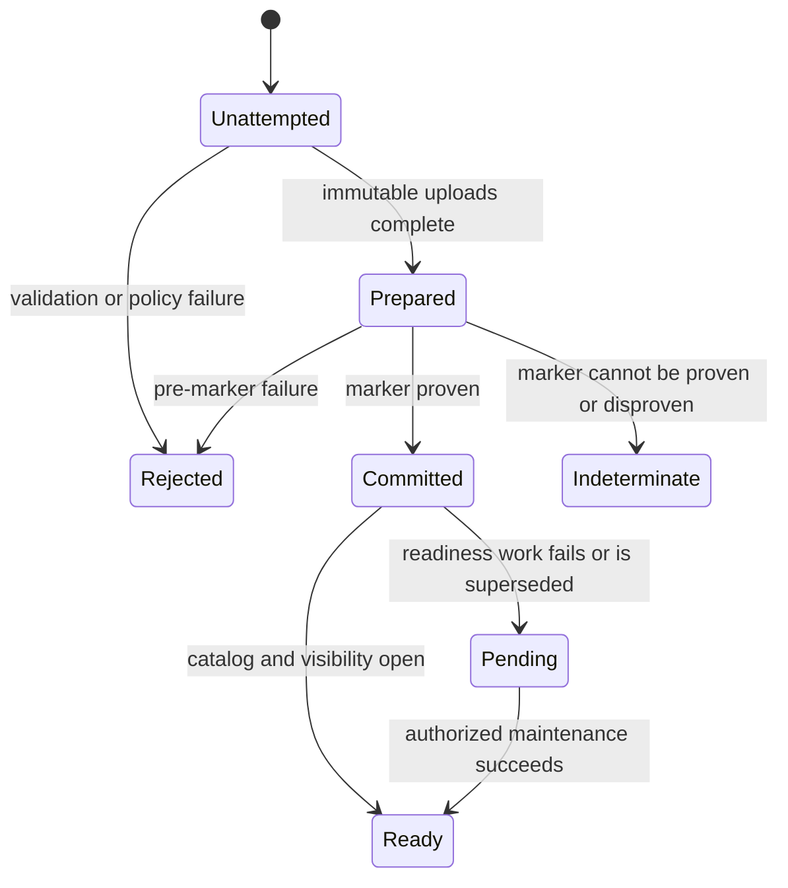
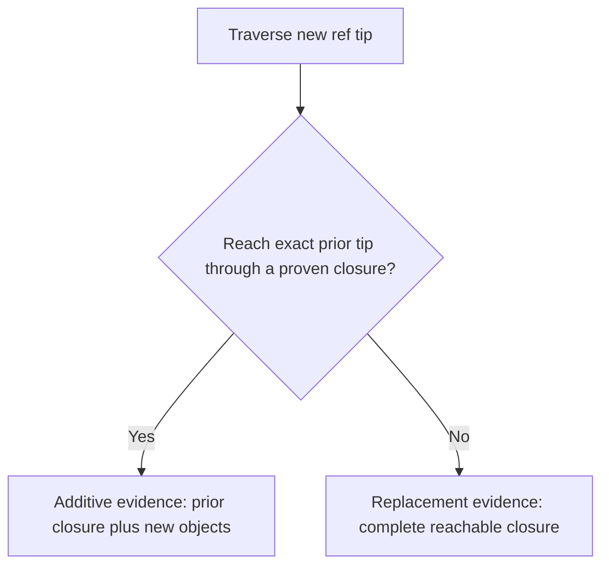
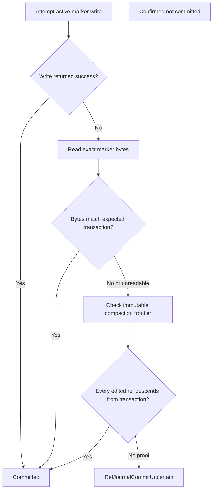
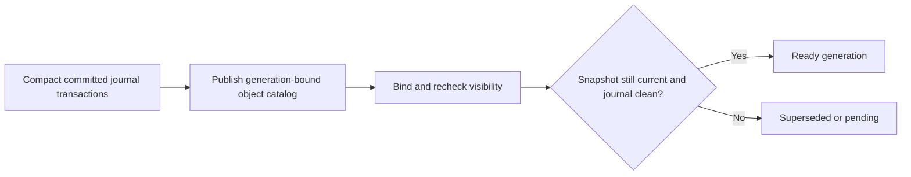

# `crab-http-server` system and write design

This design explains how `crab-http-server` discovers repositories, runs as a
replica-safe multi-cloud service, authenticates users, accepts exact native Git
pushes, and makes committed objects readable without a checkout. It defines the
storage, deployment, ownership, cancellation, and recovery boundaries.

> **Current status:** The runtime has a provider-neutral storage root, durable
> CAS repository catalog, shared identity state, dynamic replica refresh,
> private probes and bounded Prometheus metrics, a local Compose profile, and
> hardened Helm profiles for EKS/GKE/AKS. The chart includes a fresh-workload
> catalog test, and one portable live gate can exercise two replicas and a rolling
> replacement. Container CI also exercises one
> abrupt native receive and an isolated complete-root cold restore. The ECS
> Fargate profile cannot preserve the full shutdown budget. Static artifacts
> and local RustFS do not constitute live cloud qualification. Additional
> write-process crash boundaries and index-receipt reconstruction remain
> incomplete.

Use [the HTTP server reference](REFERENCE.md#native-git-push) for operator commands and route limits. Use this document when changing receive, publication, coordination, or recovery code.

## Read the design by responsibility

Use this map to jump from a write concern to its owning contract.

| Question | Section |
| --- | --- |
| What must never change? | [Preserve the write invariants](#preserve-the-write-invariants) |
| What happens during a push? | [Follow the end-to-end write](#follow-the-end-to-end-write) |
| How does pack quarantine work? | [Quarantine untrusted pack bytes](#quarantine-untrusted-pack-bytes) |
| How are refs and Git objects validated? | [Validate the graph and exact ref plan](#validate-the-graph-and-exact-ref-plan) |
| How are Crab and LFS pointers proved? | [Prove pointer content before upload](#prove-pointer-content-before-upload) |
| Why does visibility belong to each ref? | [Plan per-ref visibility](#plan-per-ref-visibility) |
| Which leases protect publication? | [Hold publication authority](#hold-publication-authority) |
| Where is the atomic commit boundary? | [Commit the ref journal](#commit-the-ref-journal) |
| How does a committed push become readable? | [Make committed refs readable](#make-committed-refs-readable) |
| What happens after cancellation or response loss? | [Classify failures by commit boundary](#classify-failures-by-commit-boundary) |
| Why not reuse protected-view receive? | [Keep protected-view translation separate](#keep-protected-view-translation-separate) |
| What evidence exists? | [Read the evidence map](#read-the-evidence-map) |
| How are repositories discovered? | [Use one durable repository catalog](#use-one-durable-repository-catalog) |
| How do replicas share identity? | [Keep identity state outside the pod](#keep-identity-state-outside-the-pod) |
| How does one build run on three clouds? | [Keep deployment provider-neutral](#keep-deployment-provider-neutral) |

## Set the system boundary

The server is a composition boundary, not a new Crab data service. One
deployment points at one storage root and serves a cataloged set of repositories
inside it.



The following are deliberate non-goals:

- No bucket scan for repository discovery
- No reuse of the garbage-collection ref registry as an application catalog
- No per-repository cloud client or credential block
- No durable state on pod or Fargate scratch disks
- No Lambda deployment pretending to support the streaming data plane
- No automatic creation or deletion of the operator's bucket/container

The last rule applies to production roots. The local Compose profile owns a
dedicated RustFS volume and can safely bootstrap its bucket and demo repository
inside that explicit development boundary.

## Use one durable repository catalog

The deployment configuration contains only a provider URL. The catalog path is
derived and versioned:

```text
{storage root}/.crab/http-server/v1/catalog.json
```

The document is bounded to 8 MiB and 10,000 records. A record carries a stable
UUIDv7 identity, public owner/name, relative repository prefix, placement
generation, presentation metadata, membership, and initial branch-protection
rules.

```json
{
  "schema_version": 1,
  "version": 42,
  "repositories": [
    {
      "id": "01991c9d-77c0-7d67-bf60-aef10eb9f081",
      "owner": "team",
      "name": "service",
      "prefix": "team/service",
      "placement_generation": 1,
      "description": "Production service",
      "members": [],
      "protected_branches": []
    }
  ]
}
```

Every mutation reads the document with its provider CAS token, validates the
whole next document, sorts it deterministically, increments `version`, and uses
conditional create or update. A state conflict restarts the bounded loop. Names
are unique ignoring case; prefixes and IDs are exactly unique.

### Create and adopt without scanning



`repository create` is idempotent for the same case-insensitive name and exact
prefix. A catalog conflict can leave initialized but undiscoverable objects;
this is safe and recoverable with `repository adopt`. It never leaves a catalog
record pointing at an unvalidated repository. Adopt performs only the two
canonical metadata reads before the same CAS insertion.

The server does not infer public names from object paths. That would make
listing permissions, rename behavior, partial uploads, and unrelated bucket
contents ambiguous.

### Refresh replicas without invalidating requests

At startup the server reads and validates the catalog, materializes each
repository, and refuses readiness if the catalog is unavailable or any
cataloged repository cannot open its current Git view. This keeps a fresh pod
out of endpoint routing while shared read-index maintenance is still pending.
Every replica polls the small catalog every five seconds. On a new version it
constructs a complete next routing map and swaps it under a short synchronous
write lock.

Handlers clone an `Arc<Repository>` at route admission. A catalog refresh can
therefore remove or replace a route without invalidating a request already
using the old handle. New requests see the complete old or complete new map;
they never observe a partially rebuilt catalog.



## Keep identity state outside the pod

OIDC authorization-code flows, browser sessions, and repository-scoped Git
tokens live below the same storage root. Only hashes of random bearer values
appear in object keys. Raw browser and Git tokens stay in cookies or the one
creation response.

| State | Lifetime | Cross-replica rule |
| --- | ---: | --- |
| Login flow | 10 minutes | Callback consumes the record with CAS exactly once |
| Browser session | Earlier of ID-token expiry or 8 hours | Any replica resolves the hashed cookie key |
| Git token | Never beyond its browser session | Any replica resolves token then durable parent session |
| Cursor signature key | Operator rotated | Every replica reads the same mounted 32-byte-or-longer secret |

Logout deletes the durable parent session. Subsequent browser and Git-token
requests therefore fail on every replica even when token objects remain for
bounded lifecycle collection. A per-session CAS index makes token issuance and
revocation constant-sized without scanning the auth namespace. The process
does not interrupt a request that already passed authorization; every later
request resolves the durable parent again and observes revocation. A 24-hour
object lifecycle on the auth prefix safely collects all state because its
maximum active lifetime is eight hours.

Shared state is not an excuse to broaden credentials. The workload identity
may access the configured root and nothing else. The OIDC client secret and
cursor key remain separate mounted secrets; neither enters the catalog.

## Keep deployment provider-neutral

`StorageRoot` parses one raw URL and delegates provider construction to
`crab-storage`. Repository identities include normalized provider, account or
host, container/bucket, relative prefix, and placement generation. That keeps
cache and coordination identities from colliding across clouds.

| Runtime | Provider-native identity | URL |
| --- | --- | --- |
| Local Compose | Synthetic stack-local credentials | `s3://crab-http-server/repositories` |
| EKS | EKS Pod Identity | `s3://bucket/root` |
| GKE | Workload Identity Federation for GKE | `gs://bucket/root` |
| AKS | Microsoft Entra Workload ID | `az://account/container/root` |
| ECS/Fargate | ECS task role | `s3://bucket/root` |

Provider Terraform roots create dedicated versioned storage and workload
identity for an existing cluster. They emit a non-secret overlay containing the
storage URL, identity wiring, and required environment. A provider-neutral team
overlay supplies the image, OIDC, ingress, and monitoring policy.

One Helm chart owns the runtime contract:

- Deployment, ServiceAccount, private ClusterIP Service, and disruption budget
- Security context, topology spread, bounded scratch, and graceful termination
- Storage-aware probes and a fresh-workload catalog test
- TLS ingress plus mandatory source-restricted NetworkPolicy
- Optional autoscaling, private `PodMonitor`, and bounded baseline alerts
- An immutable image digest and typed generated configuration

The chart owns ingress isolation but leaves provider-specific egress to the
cluster. Every replica must reach DNS, its workload-identity endpoint, object
storage, and the configured OIDC issuer. Port 8789 remains private for probes
and metrics; the public route reaches only port 8788 through TLS ingress.
GKE Standard overlays also select metadata-server-enabled nodes; Autopilot
overlays omit the Standard-only selector.
Empty or match-all ingress peers and unrestricted IPv4 or IPv6 CIDRs fail
rendering, so an enabled public or metrics path always names a bounded source.



S3 and GCS retain noncurrent root versions for a configurable 90-day recovery
window and abort multipart uploads left incomplete for one day. Azure versions
remain unexpired because Azure's available lifecycle condition measures age
from version creation, not from the transition to noncurrent state.

On termination, Kubernetes removes the endpoint, waits 15 seconds for routing
to converge, then gives Crab its complete ten-minute drain budget. The live
gate checks provider identity and placement, every pod's readiness, public OIDC
initiation, direct token use against two replicas, cross-replica Git and LFS,
lock-owner publication, uninterrupted reads during rollout, and byte-identical
state after replacement. Its JSON receipt binds the evidence to the provider,
immutable image, repository, commit, payload digest, and completion time.

Server releases use their own annotated `crab-http-server-vX.Y.Z` tag and do
not inherit the CLI's version tag. The tag must match the server crate, resolve
to `main`, and pass the exact-source container and Compose qualification before
publishing. The registry receives one AMD64/ARM64 image index under immutable
version and source-commit tags, the same-version OCI Helm chart, BuildKit SBOM
and provenance attestations, and GitHub-signed registry attestations.
Deployment profiles consume the image manifest and chart digests. The
exact-source qualification also scans the final runtime image and rejects
fixable HIGH or CRITICAL vulnerabilities before publication. Existing image
tags and chart versions fail closed instead of being replaced.

ECS cannot mount Secrets Manager values as files, so its task entrypoint writes
three protected files to disposable scratch, unsets the injected environment
variables, and execs the same binary. Repository, catalog, and session state
never depend on that scratch volume.

Fargate limits container shutdown to 120 seconds. That limit is shorter than Crab's five-minute Git and LFS budgets and ten-minute archive budget. Treat the task definition as evaluation evidence until abrupt-crash qualification proves safe replacement outcomes.

### Preserve local trust through a container proxy

Unauthenticated operation accepts loopback listeners only. Publishing Crab's
listener directly from an ordinary bridge-network container would require it
to bind to an unspecified address and would erase that invariant. The Compose
profile instead shares one network namespace between Crab and a small Caddy
proxy:



Caddy disables automatic HTTPS, preserves streaming by flushing upstream
responses immediately, and normalizes the upstream `Host` to Crab's loopback
origin. Docker publishes only Caddy's port and restricts it to host loopback.
No server flag, trusted-proxy escape hatch, or alternate authentication path is
needed. Production profiles terminate HTTPS at their provider load balancer
and require OIDC instead.

### Exclude Lambda from the data plane

Receive-pack, upload-pack, LFS, archives, and maintenance have streaming bodies,
multi-minute cooperative budgets, and potentially tens of GiB of bounded
scratch. Lambda and common HTTP front doors impose buffering, request/response
payload, duration, and ephemeral-lifecycle behavior that changes this contract.
The implementation therefore makes no full-server Lambda claim. A future
bounded catalog-control function would be a separate executable and API.

## Preserve the write invariants

Every implementation change must preserve these properties:

1. **Exact object identity:** An accepted ref points to the OID submitted by Git. The server never synthesizes a replacement commit for native receive.
2. **Atomic ref batch:** Every command commits, or no command commits. A protected, stale, malformed, or conflicting ref rejects the complete batch.
3. **Authorization before effects:** Repository membership and token write scope are checked before intake and again before commitment.
4. **Pinned base:** Graph validation, dependency proof, visibility planning, and journal commitment bind to the same admitted repository snapshot.
5. **Objects before refs:** Packs, sidecars, pointer content, and visibility evidence become durable before the active journal marker exposes refs.
6. **Ref serialization:** Every edited ref retains its lease through the marker outcome. Creates and deletes also serialize the complete ref namespace.
7. **GC exclusion:** Global and repository writer fences stay alive until publication and cleanup finish.
8. **Known outcome honesty:** The server distinguishes rejection, commitment, pending readability, and an indeterminate marker result.
9. **Cancellation safety:** Cancellation before the marker leaves refs unchanged. Cancellation after a marker attempt cannot trigger rollback or false rejection.
10. **Byte-identical reads:** A successful readiness path lets an independent reader reconstruct the exact commit, tree, and blob bytes.
11. **Bounded untrusted work:** Wire bytes, decompression, delta depth, object size, graph traversal, dependency reads, temporary disk, and worker admission have explicit bounds.
12. **No local repository:** Production receive uses temporary files but no clone, checkout, Git executable, or local Git object database.

## Follow the end-to-end write

The HTTP worker owns the request after admission. A disconnected handler cannot drop stateful publication or lease cleanup.



The implementation spreads this sequence across four owners:

| Stage | Owner | Entry point |
| --- | --- | --- |
| HTTP body and worker lifetime | `crab-http-server` | `receive::receive` |
| Receive framing and report status | `crab-git` | `receive_wire` |
| Quarantine, graph, visibility, and pack preparation | `crab-remote` over `crab-git` | `prepare::prepare` |
| Leases, fences, journal outcome, and readiness classification | `crab-remote` | `publication` |
| Durable ref journal and generation maintenance | `crab-write` | `journal` and `generation` |

### Separate the four outcomes

Ref durability and read readiness are different results:



Only `Rejected` proves that the attempted ref transaction did not commit. `Pending` describes committed refs whose derived read state still needs repair. `Indeterminate` preserves the transaction identity because current ref values cannot prove which historical attempt committed.

## Validate receive framing and authorization

`crab-git::receive_wire` parses the bounded command section without consuming pack bytes. It advertises supported capabilities and encodes unpack and per-ref status for an atomic result.

The HTTP boundary performs these checks before publication:

- Repository path has the canonical `.git` suffix
- Principal can read the configured repository, otherwise HTTP 404
- Principal and scoped token can write, otherwise HTTP 403
- Content type is `application/x-git-receive-pack-request`
- Content encoding is absent or `identity`
- One shared Git transfer permit is available, otherwise HTTP 429
- Body remains within 2 GiB and the five-minute cooperative budget

The request can contain bounded `shallow <oid>` declarations before its first ref command. They describe the client but do not prove server connectivity. Every omitted parent must still resolve from committed remote visibility.

Git sends old OID, new OID, and ref name. It sends no separate force flag. Non-fast-forward policy therefore compares the submitted graph and tips.

Read tokens never inherit write permission from a repository grant. Effective access is the intersection of session membership and token scope. Revocation is rechecked before publication.

## Quarantine untrusted pack bytes

`crab-git::incoming_pack::quarantine` turns the untrusted receive stream into a private, bounded object source. Dropping the quarantine removes only its temporary directory.

### Validate the pack envelope

Quarantine verifies:

- Git pack signature and supported version
- Declared entry count
- SHA-1 trailer
- Zlib stream termination
- Canonical object headers and declared sizes
- Offset-delta boundaries
- Object identities after reconstruction

The server rejects corrupt, truncated, overlong, or trailing data before any ref can become visible.

### Bound reconstruction work

| Input | Limit |
| --- | ---: |
| Pack bytes | 2 GiB |
| Incoming objects | 1,000,000 |
| One inflated object | 64 MiB |
| Aggregate inflation | 8 GiB |
| Delta depth | 128 |

Decoded objects and delta programs use disk spools instead of retaining the complete pack in memory. Cancellation checks run between chunks and delta instructions.

Forward reference deltas resolve inside the pack. Unresolved thin-pack bases come from an injected reader bound to the admitted remote snapshot. The reader must return bytes whose computed OID matches the requested base.

The shared `crab-git::delta` implementation validates overflow-sensitive size headers and bounded copies for both incoming packs and remote reads.

## Validate the graph and exact ref plan

`crab-git::receive_plan::validate` checks every quarantined object and constructs one exact atomic ref candidate.

### Validate refs as one namespace

The planner rejects:

- Duplicate commands
- Stale old OIDs
- Invalid push ref names
- Final namespace collisions such as `refs/heads/feature` and `refs/heads/feature/child`
- Non-commit branch tips
- Deleted refs that policy retains
- Non-fast-forward updates when policy forbids them

Tag objects retain their submitted OIDs. The plan records peeled tag targets without rewriting refs.

HTTP policy forbids deletion of the symbolic HEAD. Exact protected branch names reject native creation, update, or deletion after the repository has any branch. The first branch may initialize an empty or tag-only repository.

### Validate every object

Validation parses all quarantined objects, including objects unreachable from the requested refs. Typed links must exist and match Git object kinds:

| Object | Required links |
| --- | --- |
| Commit | Tree and parent commits |
| Tree | Blobs, trees, or gitlinks with valid modes and raw names |
| Annotated tag | Declared target of the declared kind |
| Blob | No Git graph links; valid Crab and LFS syntax becomes a dependency |

Tree validation rejects malformed modes, duplicate or unsorted entries, traversal components, and protected `.git` aliases. Gitlinks remain references to another repository and are not traversed.

### Trust only closure proof

A committed locator hit proves that bytes exist. It does not prove that a ref authorizes those bytes.

The injected `GraphSource` can stop traversal only when the generation-bound catalog proves that the object belongs to a complete committed ref closure. Unknown objects are read and traversed within graph limits.

| Graph resource | Limit |
| --- | ---: |
| Ref updates | 1,024 |
| Traversal steps | 1,000,000 |
| One object | 64 MiB |
| Aggregate remote object reads | 512 MiB |

The publisher must recheck the same base while holding writer authority. A graph result from an earlier snapshot is not publication proof.

## Prepare a self-contained pack

`IncomingPack::prepare` rewrites every unique reconstructed object, including required thin bases, into full zlib entries sorted by OID. The prepared pack favors independent readability over delta compression.

Preparation then creates:

- Git pack bytes with a verified SHA-1 trailer
- Git index version 2
- Reverse index
- Crab object-kind sidecar
- Git pack identity, Blake3 body identity, size, and object count

The indexed OID set must equal the quarantined OID set. Gitoxide writes the version 2 index with one worker after normalized validation.

An empty deletion-only request needs no pack. Partial output and sidecars remain private and disappear with their temporary owner.

Peak temporary disk can contain the incoming spool, quarantine objects, normalized pack, and index sidecars at the same time. The server's 2 GiB wire limit is not a disk-capacity estimate.

## Plan per-ref visibility

`receive_plan::plan_visibility` creates a `GitVisibilityEdit` for each updated ref. Visibility is an authorization proof, not only an object inventory.



The visibility source pins one prior ref tip and its complete closure to the admitted generation. Membership in the union of unrelated refs cannot substitute for that proof.

The planner first prunes objects already covered by the prior closure. It emits additive evidence only when traversal reaches the exact prior tip. Otherwise it expands every pruned edge and emits a complete replacement closure.

This distinction matters for rewrites even though HTTP currently rejects non-fast-forward pushes. A future policy-controlled rewrite must not leave old unreachable objects authorized through stale additive evidence.

Commits, trees, and tags require their outgoing edges when a closure expands. Proven blobs are leaves. Gitlinks remain external. Unreachable incoming objects never enter a ref's visibility evidence.

## Prove pointer content before upload

Graph validation returns valid Crab and LFS pointer dependencies. `crab-read::dependency_proof::verify_dependencies_except_crab` proves the referenced payloads against the admitted repository snapshot before immutable Git artifacts upload.

### Normalize the dependency batch

Before storage input/output, the verifier rejects:

- More than 1,024 dependencies
- Any dependency larger than 512 MiB
- More than 2 GiB of aggregate file content
- Unrecognized pointer shapes
- Conflicting sizes for one content identity

Repeated content is verified once. Crab Blake3 identities and LFS SHA-256 identities remain distinct.

One 120-second deadline covers selection, admission wait, and content verification for the complete batch.

### Verify Crab pointers

`verify_crab_pointer` uses an origin-only store and an explicit shard selected from the captured snapshot. It validates:

1. Shard identity and bounded record structure
2. The exact ordered reconstruction recipe
3. Xorb identity and serialized payload digest
4. Each selected chunk after decompression
5. Reconstructed byte length
6. Whole-file Blake3 identity

Repeated chunk occurrences retain order. Empty files need no xorb. The proof writes no ref, receipt, cache entry, or local Git object.

Snapshot-bound lookup cannot read a newer manifest, journal transaction, or acceleration row. Each scan reserves its complete shard-visit budget before dispatch. Failure and cancellation do not refund visits or cache incomplete absence results.

### Verify LFS pointers

`LfsObjectStore::verify_origin` reads the exact primary object from origin. It rejects a mismatched response size before streaming, then checks actual length and SHA-256.

Publication proof bypasses receipts and replica fallback. Existing ordinary LFS reads retain their receipt and fallback behavior.

The primary LFS OID and size identify stored bytes after extension processing. Extension hashes describe client transform inputs, not extra server objects. See the [Git LFS extension specification](https://github.com/git-lfs/git-lfs/blob/main/docs/extensions.md).

### Make LFS locks authoritative at publication

LFS file locks are repository-path policy inputs at the Git publication
boundary. The HTTP adapter authenticates the repository request, stores the
stable provider subject through `crab-lfs::LfsLockManager`, and resolves display
names only while forming a response.

```mermaid
flowchart LR
    Client[git-lfs lock / verify / unlock]
    HTTP[HTTP auth and limits]
    Manager[CAS lock manager]
    Record[(lfs/locks/blake3(path))]
    Plan[Validated changed-path hashes]
    Guard[Renewing lfs-locks lease]
    Push[receive-pack]
    Journal[Atomic ref journal]

    Client --> HTTP --> Manager --> Record
    Client -. early pre-push verification .-> Push
    Push --> Plan --> Guard
    HTTP --> Guard
    Guard --> Record
    Guard --> Journal
```

A conditional create makes one path exclusive across replicas. Release writes
an owner- and ID-checked CAS tombstone, so a stale request cannot release a
newer holder. Same-owner create and exact unlock retry recover lost HTTP
responses without creating a second state transition. Bounded list scans return
ID-sorted pages; verification divides that page using the authenticated
subject.

The receive plan retains fixed-size Blake3 identities of exact raw Git paths
changed by every newly introduced commit. It walks to the already visible
repository frontier, compares merge commits with every parent, expands
tree/leaf replacements, and treats a rename as deletion plus addition. This
history-wide proof prevents a change-and-revert pair in one push from hiding a
locked edit. Hashing preserves non-UTF-8 Git path identity without adding
attacker-controlled strings to the long-lived plan; a collision can only cause
a conservative rejection because lock paths are compared by the same identity.

Lock creation, unlock, and the final receive check share the renewing
`lfs-locks` repository lease. Receive already holds ref leases and GC fences,
then acquires this guard, reads at most 10,001 active records, rejects an
over-limit set, verifies that no changed hash belongs to another subject, and
commits the journal before releasing the guard. Therefore either the lock
mutation linearizes first and the push observes it, or the push commits first
and the later lock applies to subsequent changes. Storage or coordination
failure is fail-closed.

The standard Git LFS pre-push hook remains useful for earlier feedback, but it
is not trusted. Native pushes, browser content publication, and pull merges all
reach the same receive publication boundary. The supported deployment gives
object-store write authority only to server workloads; a direct storage writer
is an operator outside this authorization model and could mutate any Crab
state, not only locks.

### Retain CPU admission after caller cancellation

Shard scans, hashing, recipe extraction, and pointer reconstruction use blocking workers. A timed-out caller can return while its bounded worker continues cleanup, but the worker retains its semaphore permit until exit.

Four shard scans, four Crab pointer proofs, and four LFS bodies can overlap per process at their respective stages. These stage limits supplement the four receive and transfer slots; they do not replace the whole-request deadline.

## Hold publication authority

`crab_remote::publication::with_leases` acquires the writer authority that spans validation, upload, marker commitment, readiness, and cleanup.

### Acquire resources in one order

The order is fixed:

1. Sort and deduplicate edited ref names
2. Acquire each per-ref lease
3. Acquire the global GC writer fence
4. Acquire the repository GC writer fence
5. Run the publication callback
6. Stop heartbeats and release fences in reverse order
7. Stop ref renewal and release ref leases in reverse order

An empty ref set uses the shared batch resource. Partial admission always releases earlier resources before returning or retrying.

The five-minute leases renew at one third of their lifetime. Renewal failure cancels the owned operation, which still drains its stateful work and cleanup before release.

### Serialize ref namespaces

Per-ref locks do not prevent this race:

```text
writer A creates refs/heads/feature
writer B creates refs/heads/feature/child
```

Both names have different locks, but Git forbids their coexistence. `crab-write::journal::commit_edits` therefore acquires `git-ref-namespace` after edited-ref and GC admission when a batch creates or deletes refs.

Under that namespace lease, the journal rereads one coherent snapshot and validates the complete candidate namespace. An atomic delete of the parent and creation of its child remains valid.

Existing-ref updates need only their per-ref leases because they cannot introduce a new namespace collision.

### Recover durable lock holders

Ref leases carry holder identities into prepared journal edits. A successor can release an abandoned holder only when a visible transaction proves that exact ref and holder committed.

Matching by holder prevents cleanup from deleting a successor's lease. The server retains leases through commitment and explicitly awaits release on every outcome.

## Upload immutable artifacts

`Prepared::upload` runs while ref leases and both GC fences remain held. It changes no refs.

The upload sequence is:

1. Confirm that the prepared reader matches the supplied repository snapshot
2. Prove every external Crab and LFS dependency
3. Upload any Crab-native xorb and shard artifacts attached by a composing caller
4. Upload the self-contained Git pack
5. Upload kind, index, and reverse-index sidecars when the store permits direct evidence
6. Upload each per-ref visibility edit
7. Build journal edits that bind ref names, old and new OIDs, peeled tags, holders, and evidence hashes

Failure can leave unreferenced immutable objects. It cannot expose refs because the active journal marker has not been attempted.

Immutable objects may be safely deduplicated by their content identity. Cleanup must never remove committed objects or content inside the GC grace period.

## Commit the ref journal

`Artifacts::commit` first checks that the prepared repository remains current. It then calls `crab-write::journal::commit_edits` with the admitted snapshot, ref edits, optional symbolic HEAD change, pack entries, shard entries, and original cancellation token.

### Build the transaction

The journal commit:

- Compares every expected old OID with the snapshot captured under retained leases
- Reads causal parents for each ref
- Writes immutable transaction data
- Writes prepared per-ref heads
- Attempts one active marker that makes the complete batch visible
- Promotes or cleans prepared heads only after classifying the marker outcome

The active marker is the atomic visibility boundary. Pack uploads alone do not change refs. Prepared heads alone do not form an accepted ref state.

### Handle marker write errors

A failed marker request does not prove that storage rejected the write. The metadata journal attempts bounded readback:



An absent marker counts as rejection only when every edited ref's immutable compaction frontier proves that the attempted transaction did not become authoritative. A different, oversized, or unreadable marker remains uncertain.

`RefJournalCommitUncertain` preserves the transaction ID, original write error, and readback error. `crab_remote::publication::journal_outcome` maps it to `CommitOutcome::Indeterminate` instead of ordinary rejection.

The HTTP protocol has no durable Crab recovery token. It therefore fails the transport without emitting a per-ref rejection for an indeterminate marker. Operators inspect remote refs and server logs before retrying, but matching ref values alone cannot attribute a historical transaction.

### Never roll back after the marker attempt

Cancellation before the active marker removes prepared heads and leaves refs unchanged. After the marker attempt, the operation must finish reconciliation and promotion.

A late namespace-lease, renewal, cleanup, or readiness failure cannot replace a known successful commitment with rejection. Prepared heads are never rolled back after marker attempt.

## Make committed refs readable

Journal commitment makes refs durable before the derived object catalog necessarily covers their objects. `crab-remote-git` returns `RepositoryIndexing` while active transactions still need compaction.

`crab-write::generation::make_readable` composes three operations:



### Compact the journal

`journal::compact_for_owner` folds committed transactions into the manifest under the renewable generation-owner lease. It waits for handoff, drains bounded waves, publishes the manifest conditionally, and cleans active markers and prepared heads.

Ref locks are released only when their holder matches the committed transaction. Cancellation is checked between complete waves; an active wave finishes its conditional write and cleanup first.

### Publish the object catalog

`generation::maintain_catalog` owns the catalog lease, planning reader, locator writer, checkpoint, and close lifecycle. It validates pack and sidecar evidence, writes current rows before sweeping stale slots, and rechecks the manifest before advancing coverage.

The catalog path reads bounded index sidecars and pack trailers. It does not download complete packs or create a local repository.

Removed tips still require lookup even when surviving refs and new evidence do not mention them. This prevents a deletion from leaving stale locator coverage.

### Bind verified visibility

Readiness binds existing visibility proof to the exact catalog generation. Missing verified evidence returns `VisibilityUnavailable`. The server does not reconstruct proof from unverified object presence.

A newer manifest or active journal after publication returns a superseded result. Another pass captures fresh state.

### Keep readiness separate from acceptance

The HTTP server invalidates its repository cache and attempts an authoritative reopen after a known commit. `finish_committed` logs readiness failure and returns `Pending`; it does not reject or undo accepted refs.

Later API refresh or Git fetch starts an on-demand readiness job under generation-owner election and both GC fences. Requests for one repository share a retained job, and at most two repositories run maintenance concurrently.

A disconnected reader does not own the job. The server drains it during shutdown before closing the remote-read runtime.

## Classify failures by commit boundary

The correct response depends on the last durable action, not the last Rust function that returned an error.

| Failure point | Ref outcome | Cleanup and response |
| --- | --- | --- |
| Header, authorization, or transfer admission | Unchanged | No publication resources acquired; return HTTP error |
| Body spool or receive framing | Unchanged | Remove private temporary directory |
| Lease or GC fence admission | Unchanged | Release partial admission in reverse order |
| Quarantine, graph, policy, or dependency proof | Unchanged | Report unpack or per-ref rejection when Git requested report status |
| Immutable artifact upload | Unchanged | Leave safe unreferenced immutable data for GC; release leases |
| Authorization, archive, or snapshot recheck | Unchanged | Do not attempt marker |
| Marker confirmed absent | Unchanged | Roll back prepared heads and return rejection or failure |
| Marker proven committed | Committed | Finish promotion; readiness may remain pending |
| Marker cannot be classified | Unknown | Preserve transaction evidence; fail transport without false ref rejection |
| Catalog or commit-graph maintenance | Committed | Log pending readiness and retry through authorized maintenance |
| Client disconnect | Depends on boundary | Cancel worker, then drain it while it retains admission and fences |

HTTP error mapping intentionally exposes few details. Pack and graph errors become an invalid receive response. Storage and publication failures return HTTP 503 with instructions to inspect remote refs and server logs.

Git's [report-status contract](https://git-scm.com/docs/pack-protocol#_report_status) describes the actual result for every requested ref. It cannot honestly represent an unresolved historical marker as a known rejection.

## Keep protected-view translation separate

`crab-auth-server` protects a translated repository view. Its receive workflow consumes a `ProtectedPushPlan` with staged objects, a candidate manifest, and a base-bound dependency receipt.

Native Git receive has different inputs and semantics:

| Native HTTP receive | Protected-view receive |
| --- | --- |
| Ref commands plus a Git pack | Prepared push plan and staged objects |
| Must preserve exact submitted OIDs | Can materialize a translated source commit |
| Handles arbitrary branch, tag, and delete commands | Applies protected-view policy and translation |
| Uses native report-status | Uses protected-service response contracts |

`materialize_source_push_in` can synthesize a source commit when a protected view's old tip differs or an update is not a fast-forward. That behavior is valid for view translation and invalid for native push identity.

The HTTP server must not fabricate a protected plan or call another server crate as its publisher. Reusable mechanics belong in `crab-git`, `crab-read`, `crab-remote`, `crab-write`, `crab-metadata`, `crab-storage`, and `crab-coordination`.

Protected receive still publishes a complete manifest through its own finalizer. Active-active writers use a versioned coordinator and projection. Neither currently enters the native journal namespace gate, so coexistence needs separate authority and integration proof.

## Keep ownership at the correct layer

| Layer | Owns | Does not own |
| --- | --- | --- |
| HTTP composition | Authentication, token scope, content headers, request body, transfer slots, branch protection, archive state, report status | Git graph rules or storage layout |
| `crab-git` | Wire framing, pack parsing, delta reconstruction, object validation, ref policy inputs, visibility algorithms | Storage, Tokio, membership, or publication |
| `crab-read` and `crab-lfs` | Snapshot-bound pointer proof and origin content integrity | Ref authorization or commitment |
| `crab-remote` | Shared preparation, lease composition, immutable uploads, and outcome classification | Product authentication or protected-branch policy |
| `crab-write` | Ref journal, namespace gate, compaction, catalog lifecycle, and readiness | Receive wire or repository membership |
| `crab-metadata` | Durable formats, conditional markers, visibility, locators, and receipts | HTTP status mapping |
| `crab-storage` | Object paths, provider semantics, exact writes, multipart transfer, and error classification | Git ref policy |
| `crab-coordination` | Ref leases, internal leases, renewal, and GC fences | Object graph validity |

Callers must await stateful journal and catalog operations. A timeout cancels their token but must not abort their task or drop their future.

## Apply the resource model

The receive path layers independent bounds so one generous resource does not bypass another.

| Resource | Current bound |
| --- | ---: |
| Concurrent Git fetch, push, and LFS work | 4 per process |
| HTTP receive body | 2 GiB |
| Whole receive budget | 5 minutes |
| Ref commands | 1,024 |
| Incoming objects | 1,000,000 |
| Individual Git object | 64 MiB |
| Pack inflation | 8 GiB |
| Delta depth | 128 |
| Graph steps | 1,000,000 |
| Remote graph bytes | 512 MiB |
| Pointer dependencies | 1,024 |
| One dependency | 512 MiB |
| Aggregate dependency bytes | 2 GiB |
| Dependency batch | 120s |
| Shard visits | 4,096 |
| Shard or xorb body | 128 MiB |
| Recipe entries or reconstructed chunks | 1,000,000 |
| Publication lease time to live | 5 minutes with renewal |

Transport retries have their own storage-client bounds. They do not increase logical graph, pointer, or body limits.

## Read the evidence map

The design is backed by component, composition, provider, and independent-client evidence. Each layer proves a different claim.

| Contract | Source | Tests or qualification |
| --- | --- | --- |
| Receive framing and report status | `crab-git::receive_wire` | Native command, deletion, empty-pack, unpack-failure, and atomic-report tests |
| Full and thin-pack quarantine | `crab-git::incoming_pack` | Native fixtures and remote-base reconstruction tests |
| Ref, graph, and changed-path validity | `crab-git::receive_plan` | Graph-kind, namespace, stale-tip, malformed-tree, rename, intermediate-commit, and policy tests |
| Self-contained pack and sidecars | `IncomingPack::prepare` | Independent Git index and byte reconstruction tests |
| Per-ref visibility | `receive_plan::plan_visibility` | Additive, replacement, tag, shared-subtree, malformed, and limit tests |
| Crab pointer proof | `crab-read::pointer_proof` | Repeated chunk, empty file, corruption, deletion, limit, and cancellation tests |
| Snapshot-bound lookup | `FileIndexLookupSession::for_snapshot` | Later-generation isolation, scan budget, and retained-admission tests |
| Combined Crab and LFS proof | `dependency_proof` and `LfsObjectStore` | Mixed pointer, deduplication, corruption, receipt bypass, and origin-only tests |
| Authoritative LFS path locking | `receive_plan::changed_paths`, `crab-lfs::LfsLockManager`, and `receive::publish` | Raw-path unit cases, shared-guard HTTP test, and native change-and-revert rejection |
| Leases and uncertain outcome | `crab-remote::publication` | Contention, durable-holder recovery, marker readback, and cancellation tests |
| Journal and namespace gate | `crab-write::journal` | Conflicting sibling refs, atomic batches, compaction, and holder-safe cleanup tests |
| Read readiness | `crab-write::generation` | Superseded state, missing proof, cancellation, catalog close, and repeated pass tests |
| HTTP composition | `crab-http-server::receive` | `receive_tests.rs`, `receive_fault_tests.rs`, authentication tests, and RustFS ignored tests |
| Multi-cloud runtime | Helm chart and `deploy/helm/crab-http-server/qualification/qualify-kubernetes.sh` | Fresh-pod catalog read plus recorded EKS, GKE, or AKS cross-replica rollout receipt |

### Interpret the live fixtures

The existing live fixtures establish these end-to-end facts:

- A native client can push a root commit, updates, branches, lightweight tags, annotated tags, and deletions
- A depth-one client can push when omitted ancestry resolves from committed visibility
- Atomic rewrite rejection leaves every ref unchanged
- An independent client can fetch exact commit, tree, and blob bytes after source client removal
- Tag-only publication preserves the unborn default branch across restart
- A fresh server can classify injected lost replies and rejected marker writes
- Cancellation before and after the commit boundary preserves the expected ref outcome
- A cancelled writer keeps renewing GC fences until cleanup completes
- Browser content writes, branch management, releases, and pull merges use the same publication path

Component timing observations and localhost RustFS timings are diagnostic only. Shared caches, small fixtures, and one machine cannot establish production throughput or latency.

### Repeat focused proof

Build the embedded frontend before compiling this crate. Use a target directory unique to this checkout:

```sh
npm ci --prefix packages/repository
npm run build --prefix packages/repository
CARGO_TARGET_DIR="$HOME/Workspace/crabbuild-target/crab-http-server-dev" \
  cargo test -p crab-http-server --locked --lib server::receive_tests
CARGO_TARGET_DIR="$HOME/Workspace/crabbuild-target/crab-http-server-dev" \
  cargo test -p crab-http-server --locked --lib server::receive_fault_tests
```

The ignored RustFS commands and fresh-prefix requirements live in [Native Git push](REFERENCE.md#native-git-push).

## Track remaining recovery and coexistence work

The current implementation does not satisfy these production claims:

- **Abrupt process crash:** Existing tests use cooperative cancellation, graceful shutdown, and fresh server instances. They do not kill the process at every marker and cleanup boundary.
- **Durable client receipt:** Native Git receives no Crab transaction token. An indeterminate marker still requires operator inspection.
- **Index receipt reconstruction:** Missing sidecar or visibility evidence cannot yet be rebuilt from a durable verified receipt after restart.
- **Active-active coexistence:** Versioned coordinator writers do not share the native journal namespace gate or commitment authority.
- **Protected-view coexistence:** Protected receive publishes a complete manifest through another finalizer and needs explicit namespace and authority proof.
- **Multi-instance admission:** Transfer semaphores and maintenance admission are process-local.
- **Production scale:** The portable live gate qualifies one cross-replica
  rollout when an operator runs it, but no EKS/GKE/AKS receipt is checked in.
  It does not establish Kubernetes-size push throughput, temporary-disk sizing,
  provider latency, version-selected provider restore, or regional failure
  behavior. The ECS stop limit is shorter than the maximum operation budget.

Do not solve these gaps with a raw manifest upload, journal-only endpoint, fabricated protected plan, fallback reader, or OID rewrite. Each shortcut violates an ownership or outcome invariant above.

## Trace the implementation

Read these sources in order before changing the design:

1. `crates/crab-http-server/src/receive.rs`: HTTP admission, body spool, worker ownership, and public error mapping
2. `crates/crab-http-server/src/receive/publish.rs`: policy, leases, snapshot recheck, upload, commit, and readiness
3. `crates/crab-http-server/src/receive/validate.rs`: server-selected graph and pack limits
4. `crates/crab-remote/src/prepare.rs`: quarantine, graph validation, visibility, immutable upload, and artifact commitment
5. `crates/crab-remote/src/publication.rs`: sorted leases, GC fences, renewal, uncertain outcomes, and readiness classification
6. `crates/crab-write/src/journal.rs`: ref batch validation, namespace gate, prepared heads, marker commitment, and compaction
7. `crates/crab-write/src/generation.rs`: catalog maintenance and read readiness
8. `crates/crab-read/src/dependency_proof.rs`: captured-snapshot Crab and LFS content proof
9. `crates/crab-git/src/incoming_pack.rs`: untrusted pack and delta mechanics
10. `crates/crab-git/src/receive_plan.rs`: exact ref and graph validation

Also inspect sibling protected-receive tests before moving shared code. A one-sided native fix needs proof that protected-view translation remains correct or an explicit follow-up boundary.
