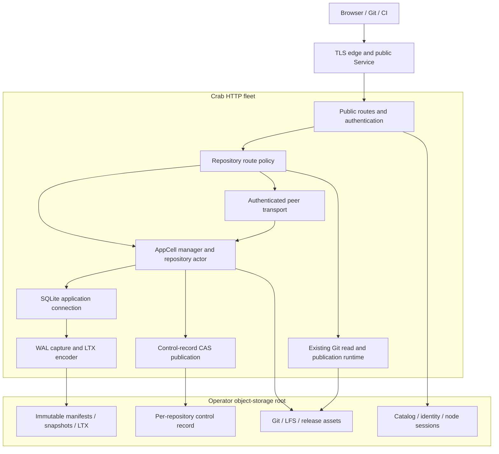
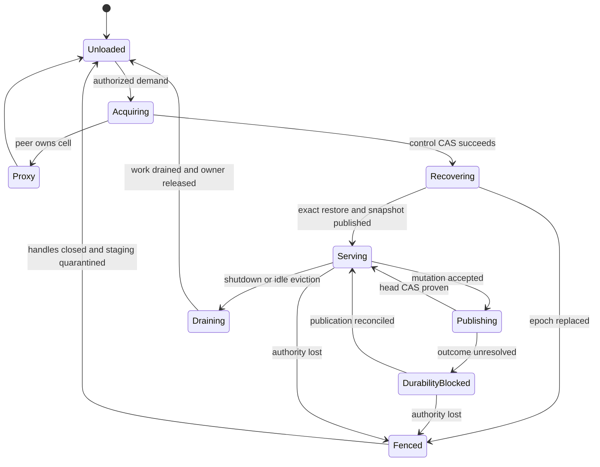
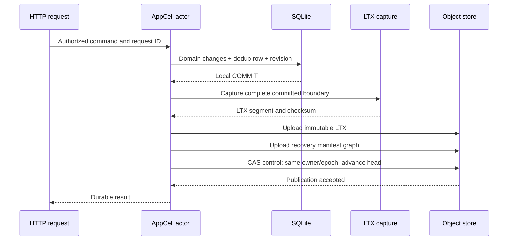
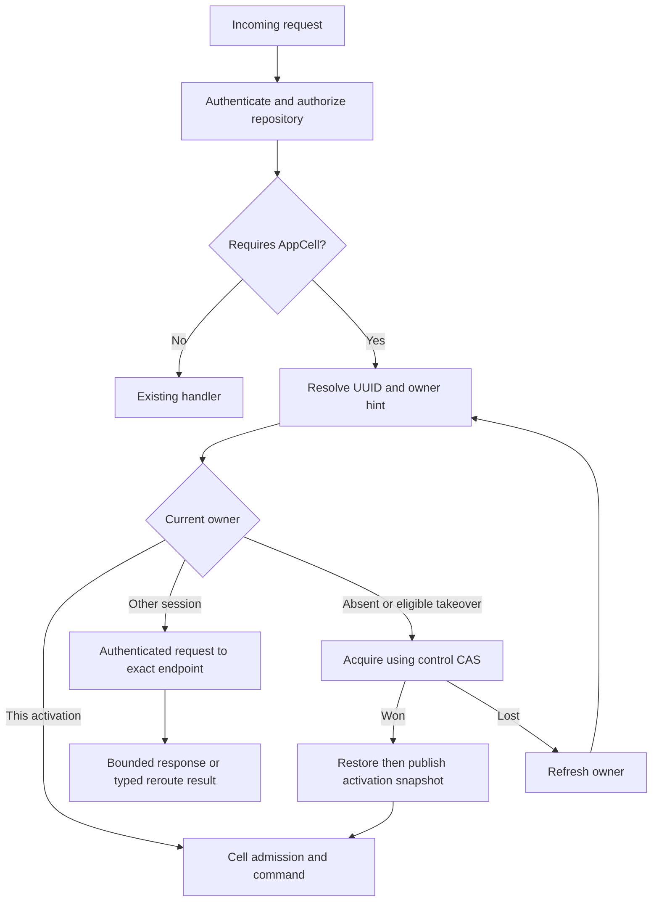
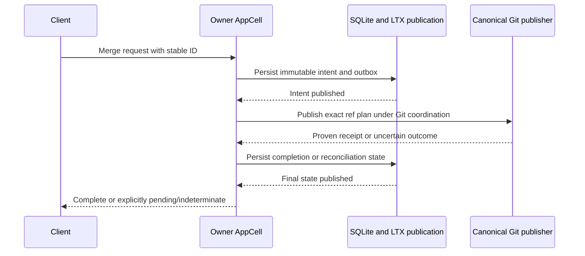
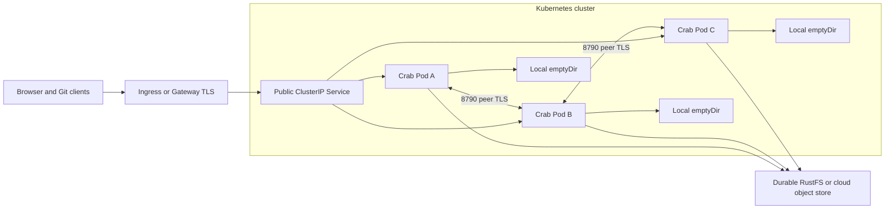
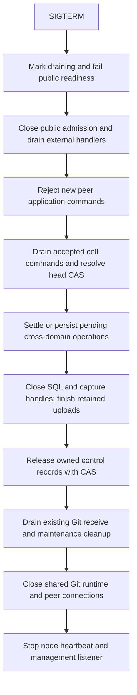
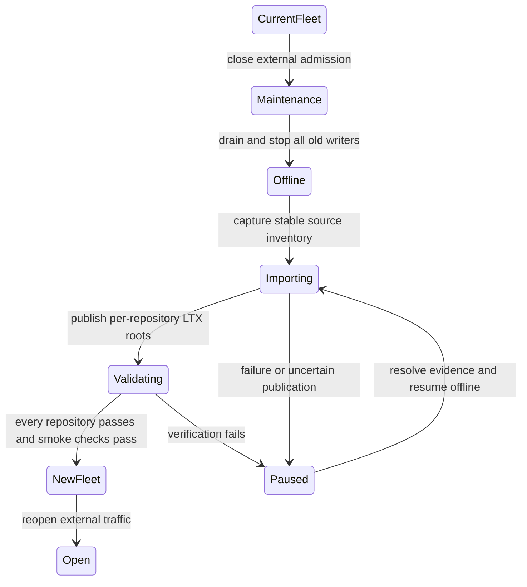

# Next-generation crab-http-server: repository SQLite cells and LTX durability

Status: proposed technical design; no SQLite/LTX runtime is implemented by this
document. Prepared 2026-09-13 against Crab commit
`f67181e0dcdc69a766b14a8b441e9119d3684f33`; deployment and integration notes were
updated when rebasing onto `2cb79f1cdb56eb824c607195635615a6f9c4a23f`.

Audience: implementers of the HTTP application, storage and publication owners,
operators, and reviewers of correctness and migration evidence.

This design replaces collaboration JSON documents with one SQLite database per
cataloged repository. A Rust subsystem captures SQLite WAL changes into LTX
files. Object storage holds the authoritative recovery graph. Multiple HTTP
servers route collaboration requests to the repository's current owner, while
the existing Git data plane continues to use its shared publication contracts.

Accepted deployment decision: hard cutover from the current architecture. A
maintenance window stops the old fleet, imports and verifies existing application
data, and starts the new fleet. The new runtime supports only SQLite/LTX
application storage; no old/new mixed fleet or legacy backend is required.

The existing [system and write design](DESIGN.md) describes current behavior.
The [reference](REFERENCE.md) remains the authority for implemented APIs and
qualification status. This proposal defines intended behavior, implementation
boundaries, and acceptance gates; examples of new configuration, commands, SQL,
and Rust interfaces are design examples, not currently available APIs.

## Contents

1. [Decisions and scope](#1-decisions-and-scope)
2. [Current implementation and evidence](#2-current-implementation-and-evidence)
3. [Terminology and guarantees](#3-terminology-and-guarantees)
4. [Architecture and data ownership](#4-architecture-and-data-ownership)
5. [Rust integration and dependency strategy](#5-rust-integration-and-dependency-strategy)
6. [Object-store layout and control protocol](#6-object-store-layout-and-control-protocol)
7. [Ownership, leases, and placement](#7-ownership-leases-and-placement)
8. [SQLite runtime and WAL capture](#8-sqlite-runtime-and-wal-capture)
9. [Commit publication and response gating](#9-commit-publication-and-response-gating)
10. [Read consistency and pagination](#10-read-consistency-and-pagination)
11. [Relational application model](#11-relational-application-model)
12. [HTTP routing and internal proxy](#12-http-routing-and-internal-proxy)
13. [Git and application workflows](#13-git-and-application-workflows)
14. [Recovery and failure behavior](#14-recovery-and-failure-behavior)
15. [Compaction, retention, and backups](#15-compaction-retention-and-backups)
16. [Kubernetes and other deployment environments](#16-kubernetes-and-other-deployment-environments)
17. [Lifecycle, admission, and resource limits](#17-lifecycle-admission-and-resource-limits)
18. [Security and authorization](#18-security-and-authorization)
19. [Hard cutover and future upgrades](#19-hard-cutover-and-future-upgrades)
20. [Performance and capacity](#20-performance-and-capacity)
21. [Observability and operations](#21-observability-and-operations)
22. [Validation and real-repository qualification](#22-validation-and-real-repository-qualification)
23. [Delivery sequence](#23-delivery-sequence)
24. [Alternatives and remaining decisions](#24-alternatives-and-remaining-decisions)
25. [Worked examples](#25-worked-examples)
26. [Source references](#26-source-references)

## 1. Decisions and scope

### 1.1 Selected architecture

| Concern | Decision | Consequence |
| --- | --- | --- |
| Application database | One SQLite database per catalog UUID | Transactions and indexes stay within a repository |
| Local disk | Disposable database, WAL, replication staging, and Git scratch | Recovery must work after losing every Crab Pod disk |
| Durable application data | Immutable LTX objects plus a published recovery manifest | Uploaded objects become authoritative only through publication |
| Replication integration | Embedded Rust subsystem inspired by Celld | One Crab process; no Go runtime or Litestream sidecar |
| First durability mode | Object-store durability before success | No peer-fsync acknowledgement or replica quorum in the first version |
| Write authority | One CAS control record containing owner and published head | Commit publication and takeover compete on the same key |
| Placement unit | Repository AppCell | One server can own many repositories |
| Read policy | Owner-served application reads with a publication barrier | No stale follower SQLite reads in the first version |
| Git storage | Existing Crab Git objects, manifests, journal, leases, and fences | Native Git and remote-helper coexistence remain separate qualification concerns |
| Deployment | Existing Kubernetes Deployment extended for peer routing | StatefulSet and persistent database volumes are optional optimizations |
| Migration | Fleet-wide hard cutover with offline per-repository imports | Maintenance downtime accepted; new runtime contains only the SQLite/LTX application backend |

### 1.2 Goals

- Make issue creation, numbering, request deduplication, and related updates one
  database transaction.
- Replace repeated object reads and sparse counter scans with indexed SQL.
- Preserve existing identity, authorization, optimistic versions, and retry
  behavior.
- Survive process death, Pod replacement, and loss of local scratch without
  losing acknowledged application transactions, within the object store's
  durability guarantees.
- Route requests correctly across two or more replicas without sticky sessions.
- Make failover, migration, upgrades, and error behavior testable at explicit
  boundaries.
- Keep cloud credential resolution and conditional-write behavior in Crab's
  existing storage boundary.
- Support a small RustFS installation and the same core protocol on qualified
  S3, GCS, or Azure storage.

### 1.3 Non-goals for the first implementation

- A SQL database for Git object bodies, packs, refs, or LFS bytes.
- Simultaneous writers to one repository database on different servers.
- Distributed SQL transactions across repositories, Git, and object storage.
- Arbitrary user SQL, SQLite extensions, or a general-purpose database service.
- A complete GitHub REST or GraphQL compatibility layer.
- Immediate implementation of every missing UI product feature. Activity feeds,
  notifications, moderation, and discussion deletion need their own product work.
- Peer-fsync durability, lazy page faulting, cross-cell node bundles, or
  synchronous multi-region operation.
- An assumption that Kubernetes deployment artifacts constitute production
  qualification.
- A migration-aware intermediate release, old/new rolling coexistence, dual
  writes, legacy application readers, or automatic rollback to JSON storage.

### 1.4 Refinements to the earlier architecture discussion

The durable head and owner belong in the same control object. A separate
`owner.json` check after an LTX upload does not, on its own, specify which late
uploads a successor must restore. This design introduces an explicit
linearization point: the conditional update that publishes the head while
holding the expected owner session and epoch.

The peer API uses a dedicated listener. Reusing management port 8789 would
couple authenticated application traffic to unauthenticated probes and their
shutdown lifecycle. A dedicated peer listener gives those responsibilities
independent admission and network policy.

Headless Kubernetes Services are optional discovery aids for Deployment-based
Pods. The initial routing mechanism uses the endpoint in the authoritative
owner record, so it does not require a Kubernetes watcher or Headless Service.

## 2. Current implementation and evidence

### 2.1 Source map

Paths in this table are relative to `crates/crab-http-server/` unless stated.

| Current surface | Entry and owner | Existing behavior | Next design impact |
| --- | --- | --- | --- |
| Process CLI | [main.rs](src/main.rs) | Serve, healthcheck, storage-probe, repository create/adopt/set-members/list | Extend existing storage diagnosis and add scoped migration commands |
| Server lifecycle | [server.rs](src/server.rs) | Two listeners, catalog refresh, Git runtime and retained workers | Own node session, cells, peer client and staged shutdown |
| Repository identity | [catalog.rs](src/catalog.rs), `materialize_catalog` in [server.rs](src/server.rs) | Catalog has stable UUID; runtime repository does not retain that field | Carry UUID independently of owner/name and Git placement identity |
| Application boundary | [app.rs](src/app.rs) | Repository/principal checks, eight production application slots, 30-second handler deadline | Preserve external contracts; move accepted durable work into tracked cells |
| Collaboration persistence | [app_storage.rs](src/app_storage.rs) | Bounded JSON, strict create, ETag update, CAS number allocation | Replace domain document storage with SQL repositories |
| Issue creation | [issues/storage.rs](src/issues/storage.rs) | Immutable request reservation, allocated number, visible issue | Import both reservations and visible records; keep retry semantics |
| PR workflow | [pulls/storage.rs](src/pulls/storage.rs), [pulls/merge.rs](src/pulls/merge.rs) | Durable pending merge and reconciliation against Git refs | Express as SQL outbox plus canonical Git publication |
| Git receive | [receive.rs](src/receive.rs), [receive/publish.rs](src/receive/publish.rs) | Bounded native receive, validation, ref and GC coordination | Preserve shared publication authority and worker drain |
| Repository policy | [repository_settings.rs](src/repository_settings.rs) | Branch protection and archive state read by browsing and publication | Keep direct object-store CAS in the initial design |
| Authentication | [auth.rs](src/auth.rs) | Durable sessions, identity, membership, CSRF, scoped Git tokens | Add authenticated delegation without weakening permission checks |
| Storage client | [storage_root.rs](src/storage_root.rs), [Store](../crab-storage/src/store.rs) | Provider-neutral root and conditional primitives | Reuse origin access; exclude cached or staged authority reads |
| UI | [packages/repository](../../packages/repository) | Embedded React application and typed API consumers | Preserve visible contracts and add truthful retry/recovery states |
| Deployment | [Helm chart](deploy/helm/crab-http-server/README.md) | Two replicas, Service/Ingress, probes, PDB, NetworkPolicy, metrics/HPA options, ephemeral scratch | Extend for peer port, identity injection and cell-aware drain |

Current persistence is described in
[pagination and storage](REFERENCE.md#understand-pagination-and-storage).
The `app/v1` namespace includes visible objects, sequences, claims, reservations,
and tombstones. The migration cannot infer the complete state from UI list APIs.

### 2.2 Existing tests to preserve or evolve

- [Issue authorization tests](src/auth_tests/issues.rs) cover author checks,
  CSRF, durable replay, sparse pagination, and interrupted reservations.
- [PR tests](src/pulls_tests.rs) exercise live branch relationships and canonical
  merge publication.
- [Receive fault tests](src/receive_fault_tests.rs) exercise uncertain write
  outcomes and include a RustFS path; they are not a substitute for process-kill
  testing of the new cell protocol.
- [Release authorization tests](src/auth_tests/releases.rs), label, assignee,
  and Git-token siblings protect adjacent permission and retry contracts.
- Browser tests under
  [packages/repository/tests/browser](../../packages/repository/tests/browser)
  cover the UI side of workflows.
- The [container workflow](../../.github/workflows/http-server-container.yml)
  includes packaging, an abrupt native receive and isolated cold-restore checks.
  Existing [Kubernetes qualification tooling](deploy/helm/crab-http-server/qualification/qualify-kubernetes.sh)
  exercises replica rollout when run in a dedicated environment. These checks
  do not establish the proposed SQLite/LTX owner takeover contract.

The rebased runtime also has startup `storage-probe`, private Prometheus metrics,
deployment-wide transfer admission and additional LFS locking/range support.
Reuse [metrics.rs](src/metrics.rs),
[transfer_admission.rs](src/transfer_admission.rs), and the existing deployment
runbooks. Application admission remains process-local; the new cell budgets must
preserve the shared Git/LFS/archive/release transfer admission contract.

### 2.3 Why retain the current Git boundary

Git publication already owns exact old/new ref plans, pack preparation,
dependency proof, journals, visibility, and garbage-collection coupling. Moving
those responsibilities into SQLite would create a second Git authority and
require a larger compatibility and recovery project. This proposal improves
application storage while keeping those invariants with their current owners.

The current repository catalog path also loads repository policy while
materializing/listing repositories. Placing that policy exclusively inside cold
SQLite cells would turn a catalog operation into thousands of potential database
restores. The first version keeps policy independently readable.

## 3. Terminology and guarantees

### 3.1 Terms

| Term | Meaning |
| --- | --- |
| Repository UUID | Stable `CatalogRecord.id`; names and storage placements are separate attributes |
| AppCell | Runtime ownership unit for one repository's application database |
| Node session | Fresh process incarnation identity; changes on every process restart |
| Epoch | Monotonically increasing activation number in a repository control record |
| LTX position | Epoch-local TXID and database checksum, bound to a database generation |
| Application revision | Monotonic SQL mutation sequence; independent of WAL frames and LTX grouping |
| Captured | Committed WAL state encoded into a verified local LTX segment |
| Uploaded | Immutable bytes accepted by object storage; not necessarily published |
| Published | Referenced by a successful authoritative control-record CAS |
| Acknowledged | Client received a success response derived from published state |
| Recovery manifest | Immutable description of an exact snapshot and contiguous LTX coverage |
| Fenced | Runtime may no longer publish or serve new application operations for that activation |
| Indeterminate | Request might have published, but the observer cannot currently establish the outcome |

Do not compare bare TXIDs across epochs. Do not assume one SQL statement, one
SQLite transaction, one application revision, and one LTX file are interchangeable.

### 3.2 Required safety properties

1. Every successful application mutation is recoverable from the published graph.
2. An ownership change cannot drop a previously published head.
3. A superseded owner cannot publish a new head with its old control token.
4. Reads and errors cannot reveal locally committed but unpublished state.
5. A repeated durable request ID cannot allocate a second logical result.
6. A failed or absent HTTP response does not prove the mutation was absent.
7. Git publication retains its existing ref locks, GC fences, and exact plans.
8. No recovery process selects an unreferenced LTX object merely because its
   filename or timestamp is newer.
9. No normal garbage collection removes a referenced recovery dependency.
10. Cancellation of a client wait does not abandon an already accepted commit
    publication or Git cleanup task.

### 3.3 Availability and durability claims

The intended application mutation RPO is zero for acknowledged writes if the
qualified object store preserves acknowledged objects and its conditional/read
contracts. Losing all HTTP server disks is within this failure model. Losing the
only RustFS storage disk, operator deletion of authoritative objects, corruption
outside the checksummed graph, or incomplete cross-region replication is not
covered by that claim.

Application operations stop when they cannot prove publication or ownership.
The design chooses that behavior during a partition rather than promising
availability and linearizable state simultaneously.

Recovery time is measured, not guaranteed by a lease constant:

```text
RTO = detection + contention/backoff + exact restore + validation
      + new-epoch snapshot upload/publication + retry scheduling
```

Git and application state have separate commit boundaries. A PR response can
describe a pending or indeterminate workflow; it must not claim atomicity across
SQLite and Git.

## 4. Architecture and data ownership



### 4.1 Storage allocation

| Data | Authority | Reason |
| --- | --- | --- |
| Issues, comments, PRs, reviews | Repository SQLite state published as LTX | Transactional collaboration model |
| Labels and discussion assignments | Same SQLite database | Indexed relationships and atomic edits |
| Commit statuses and check runs | Same SQLite database | Queries by exact commit, context and ordering |
| Release metadata and asset references | Same SQLite database | Small records and consistent lifecycle |
| Sequences, deduplication, outbox, migrations | Same SQLite database | Must survive in the same transaction as domain effects |
| Git objects, refs, manifest and journal | Existing Crab storage layout | Shared Git publication authority |
| LFS and release asset bodies | Immutable object storage | Large streaming data outside SQL |
| Catalog, membership, sessions and Git tokens | Existing global object-store records | Independently available authentication and discovery |
| Archive and branch-protection settings | Existing repository CAS records initially | Used by any-node Git paths and catalog operations |
| Owner, epoch and published LTX head | New repository control record | Must be readable before opening SQLite |
| Node discovery and session heartbeat | Global node records | Routing hints and liveness information |

"LTX-only replication" means all SQLite persistence and restoration use the
embedded LTX subsystem. LTX is a database page format; routing, owner identity,
and authoritative pointers still require small control records. Encoding those
records inside the database would create a bootstrap dependency cycle.

### 4.2 Repository distribution

```text
Pod A: cells for repository UUIDs R1, R4, R7
Pod B: cells for repository UUIDs R2, R5
Pod C: cells for repository UUIDs R3, R6, R8

One AppCell is not one Pod.
One repository is not three concurrently writable SQLite copies.
```

An owner is acquired on demand. An inactive catalog record consumes no SQLite
connection. A repository rename preserves the cell UUID. A physical storage-root
move is a separate quiesced migration and cannot be inferred from a name change.

## 5. Rust integration and dependency strategy

### 5.1 What to adopt from Celld

Celld separates its in-process LTX machinery from the surrounding ownership and
response durability protocol. Its replication library captures committed WAL,
provides restore and compaction machinery, and supports additional paging and
bundle paths. The distinction is explicit in the
[pinned LTX README](https://github.com/denoland/celld/blob/10cb1303dac710dcb3b557e318e08c855261f68b/crates/ltx/README.md).

Crab adopts that separation. It defines its own bucket-published control graph
and excludes fleet durability and node-log recovery from the first version.
Celld's [guarantees](https://celld.dev/docs/guarantees/) are design input, not proof
that a partial port inherits Celld's guarantees.

The inspected Celld revision is
`10cb1303dac710dcb3b557e318e08c855261f68b`. Implementation must record the exact
approved imported revision, licenses, local changes, and enabled format features.
Do not depend on a floating `main` branch.

### 5.2 Dependency constraints

| Dependency | Crab workspace at baseline | Inspected Celld workspace | Required action |
| --- | --- | --- | --- |
| `rusqlite` | 0.34 with bundled SQLite | 0.31 | Align the port with Crab and verify SQLite linkage |
| `object_store` | 0.14.1 | 0.12 | Integrate through the existing Crab store contract |
| `celld-ltx` package | Absent | 0.0.0, `publish = false` | Treat as source integration, not a stable published dependency |
| SQLite hooks | Not enabled for this server | Used by the replication implementation | Review feature impact across the workspace |

Sources: [Crab workspace manifest](../../Cargo.toml),
[pinned Celld manifest](https://github.com/denoland/celld/blob/10cb1303dac710dcb3b557e318e08c855261f68b/Cargo.toml),
and [LTX manifest](https://github.com/denoland/celld/blob/10cb1303dac710dcb3b557e318e08c855261f68b/crates/ltx/Cargo.toml).

Source vendoring, overrides, or dependency patches require the repository's
explicit approval process at implementation time. This document imports no
dependency and changes no lockfile.

The official Litestream Go embedding API is described as unstable and has
SQLite driver integration constraints. It does not supply a Rust-native
implementation by linking a Go library into this process.
[Litestream Go library documentation](https://litestream.io/guides/go-library/)

`ltx-rs` is a candidate file-format building block; its advertised scope is the
LTX format. A codec alone does not supply WAL lifecycle, durable acknowledgement,
or ownership transfer. [ltx-rs repository](https://github.com/superfly/ltx-rs)

### 5.3 Code ownership

Introduce `crates/crab-ltx` only as a bounded owner of actual replication
mechanics. Keep HTTP routing, repository policy and AppCell placement inside
`crab-http-server`.

```text
crates/crab-ltx/
  WAL capture and checkpoint coordination
  LTX encode/decode and checksums
  exact-position restore
  snapshot and compaction mechanics
  narrow replication storage boundary

crates/crab-http-server/src/
  cells.rs             activation and runtime ownership
  cells/control.rs     control-record transitions and publication proof
  cells/database.rs    SQL executor, schema and domain transaction boundary
  cells/replication.rs commit-to-LTX publication coordination
  peer.rs              authenticated internal transport and route dispatch
  existing domains     issue/PR/release behavior and SQL queries

crates/crab-storage/
  provider clients, paths, conditional writes, error contracts

crates/crab-remote/ + crates/crab-write/
  canonical Git publication and recovery mechanics
```

This is an ownership map, not a requirement to create empty files or forwarding
wrappers. A module is extracted when the implemented boundary pays for itself.
Wire types remain crate-private unless another actual consumer needs them.

### 5.4 Interface shape

Conceptual Rust signatures, not upstream Celld APIs or compiling implementation:

```rust
struct RepositoryCellId(Uuid);

struct PublishedPosition {
    generation: Uuid,
    epoch: u64,
    txid: u64,
    database_checksum: u64,
    app_revision: u64,
    manifest_digest: [u8; 32],
}

impl AppCellManager {
    async fn execute(
        &self,
        repository: RepositoryCellId,
        principal: AuthorizedPrincipal,
        command: AppCommand,
        deadline: Instant,
    ) -> Result<AppResponse>;
}

impl ReplicatedDatabase {
    fn transact(&mut self, command: AppCommand) -> Result<LocalCommit>;
    fn capture(&mut self, commit: &LocalCommit) -> Result<CapturedBatch>;
}
```

Handlers cannot obtain raw writable SQL connections. They cannot construct a
`PublishedPosition` as proof. Only the publication coordinator produces durable
results. Local transaction results are internal values that cannot accidentally
implement the public response conversion.

## 6. Object-store layout and control protocol

### 6.1 Layout

The following paths are relative to the existing configured storage root:

```text
.crab/http-server/v1/catalog.json                existing catalog
.crab/http-server/v1/auth/...                    existing identity state
.crab/http-server/v1/nodes/<session>.json         discovery heartbeat
.crab/http-server/v1/cells/<repository-uuid>/
  control.json                                  authoritative CAS record
  generations/<generation-uuid>/
    epochs/<epoch>/
      ltx/<min-txid>-<max-txid>-<digest>.ltx      immutable captured data
      snapshots/<txid>-<digest>.ltx              full database LTX snapshot
    manifests/<digest>.json                    immutable recovery manifests
  backups/<backup-id>.json                      retained recovery roots
  migration/<migration-id>/...                  inventory and import evidence

<existing-repository-prefix>/...                existing Git and app/v1 data
```

Cells live under UUID-based global paths so renames and Git placement changes do
not silently change their identity. This replaces the earlier conversational
example of placing cell data under the public repository prefix. Configuration
still uses one physical storage root and one credential resolution path.

Epoch numbers are never reused. Generation changes denote explicit restore or
database replacement boundaries; they do not allow the control record's epoch
counter to move backward. The control record is not deleted during idle release.
Deletion requires a durable tombstone so a stale process cannot recreate an
epoch-one cell.

### 6.2 Authoritative control record

Illustrative serialized value; provider ETag/version is returned separately:

```json
{
  "schema_version": 1,
  "repository_id": "01991c9d-77c0-7d67-bf60-aef10eb9f081",
  "generation": "01991c9d-77c0-7d67-bf60-aef10eb9f082",
  "revision": 84,
  "epoch": 19,
  "state": "serving",
  "owner": {
    "session_id": "01991c9d-77c0-7d67-bf60-aef10eb9f083",
    "peer_endpoint": "https://10.42.3.17:8790",
    "lease_sequence": 12
  },
  "published": {
    "epoch": 19,
    "txid": "000000000000002a",
    "database_checksum": "f000000000000123",
    "app_revision": 142,
    "manifest": "generations/01991c9d-77c0-7d67-bf60-aef10eb9f082/manifests/manifest-digest.json"
  },
  "format": {
    "manifest_version": 1,
    "ltx_encoding": "qualified-frame-v1",
    "sql_schema_version": 1,
    "minimum_reader_generation": 1
  }
}
```

The example checksum and manifest name are placeholders. Encodings such as
`qualified-frame-v1` are Crab capability identifiers to define during format
qualification, not official LTX version names.

`state` describes activation (`recovering`, `serving`, `draining`, `idle`,
`tombstoned`). There is no storage-backend mode: every cell uses SQLite/LTX.
Offline import progress belongs in migration evidence, outside runtime routing.

`revision` increases on every CAS, including renewal, to avoid repeating identical
control bytes. A pure heartbeat preserves the head. A publication preserves
ownership. A takeover increments epoch and preserves the exact published head.
All three operations serialize through this one object.

### 6.3 Recovery manifests

A manifest contains repository UUID, generation, source epoch, exact end
position, SQL schema/capabilities, a snapshot reference, and bounded ordered LTX
references needed after that snapshot. Every reference includes key, length,
content digest, TXID range and expected checksum continuity. Object-store ETags
are CAS tokens, not content hashes.

To keep both publication and restore bounded, use immutable manifest pages when
a manifest exceeds its reference limit. The root names these pages by digest.
Do not grow one JSON object indefinitely or require one predecessor fetch per
transaction over the repository's entire history. Snapshot/compaction rebuilds
the recovery description into a bounded graph.

A recovery manifest is immutable. A new commit uploads its changed segment and
new manifest graph before updating `control.json`. Existing immutable manifest
pages can be reused. The authoritative pointer update is last.

The exact manifest page size, limits and encoding are format decisions to freeze
with fixtures in the first implementation. They must be defined before data is
written, not silently inferred by readers.

### 6.4 Store contract

Require linearizable conditional updates and strongly consistent origin reads
for each control key, plus durable successful writes and correct immutable/range
reads. Use the raw authoritative store; caching, asynchronous replicas, staging
overlays and CDNs cannot mediate control reads.

Crab's existing `Store::update` deliberately does not retry an ambiguous update.
The caller must reread and reconcile; a network error may follow a successful
remote change. `create_strict` rejects an existing object. Its retry behavior
also means an eventual conflict can follow a lost successful create response;
the caller must inspect identity and state before classifying the attempt.
See [storage primitives](../crab-storage/src/store.rs).

Every provider adapter must preserve conditional semantics. Startup diagnosis
must reject a backend that ignores a failed precondition. A temporary inability
to prove the contract keeps the new application subsystem unready; it is not a
reason to silently choose an unsafe storage path.

LIST is not part of commit or restore authority. Listing is useful for inventory
and collection; missing entries delay collection instead of losing correctness.
Restore fetches only the explicit graph rooted at the control record.

## 7. Ownership, leases, and placement

### 7.1 Activation state machine



Fenced is terminal for that activation. Reopening requires a fresh acquisition
and higher epoch, even on the same process and even when local files remain.

### 7.2 Lease mechanics

The repository control record is the write fence. Node heartbeats advertise
session identity, endpoint and capabilities but do not independently grant
repository authority. Failure of a node heartbeat is a hint to check its cells,
not permission to bypass their control CAS.

Use lease sequence progress and monotonic elapsed time rather than trusting a
different host's wall clock. A contender observes the same owner/lease sequence
without progress for a full takeover interval, then conditionally replaces the
latest observed control revision. Any successful intervening renewal or commit
invalidates that CAS and restarts the decision.

Every successful owner publication also advances the lease sequence and renews
its local deadline under the same timing rule as a heartbeat. A contender never
refreshes its CAS token while retaining an expired observation of an older
sequence; it must restart observation when it sees progress.

The owner maintains a conservative local renewal deadline measured from the
start of its last successful renewal attempt. A delayed renewal response that
arrives after that deadline cannot revive a fenced activation. Lease expiry
stops local admission. Actual publication safety still follows the control CAS,
including during pauses or excessive clock drift.

Candidate initial tuning: renew every 3 seconds, local self-fence deadline 10
seconds, contender no-progress observation 15 seconds. These are evaluation
values, not implemented settings or availability guarantees. Epoch fencing
protects safety even if a contender falsely suspects an owner; false suspicion
can still cause disruptive churn and must be measured.

One per-cell control coordinator serializes renewal, publication and handoff
updates. A background heartbeat must never replay a stale head over a newer
commit. When a CAS fails, reread and revalidate generation, epoch, owner session,
state and expected head before deciding which transition remains legal.

### 7.3 Acquisition and restore

1. Resolve repository UUID and authorize the caller before activating storage.
2. If the control record is absent for a new repository, strict-create a
   recovering record with a new generation and epoch one.
3. If another owner is live, return its routing information.
4. For an idle record or a qualified takeover, CAS to a fresh session/epoch in
   recovering state; carry forward the predecessor's published pointer exactly.
5. Restore only that published pointer into a new local directory.
6. Verify checksums, SQL integrity, schema compatibility and repository identity.
7. Create a full LTX snapshot for this epoch, with an explicit mapping from its
   local LTX position to the inherited application revision.
8. Upload the snapshot and manifest, then CAS from recovering to serving.
9. Admit reads and mutations only after that CAS is proven.

Renew ownership during a long restore. If ownership changes while restoring,
discard the partial activation. Never serve a partially restored database.

Full snapshots on activation simplify epoch transitions but can be expensive.
The first release accepts that tradeoff; lazy page restore requires a later
design with equivalent checksum, cut, and fencing proofs.

### 7.4 Placement and balancing

Use on-demand acquisition initially. Capacity admission can refuse a new cell
with retryable overload, allowing another capable node to try. Do not greedily
activate every repository at startup.

Rendezvous hashing over eligible node sessions can later select a preferred
acquirer and reduce contention. Its output is a placement preference, never an
ownership proof. Adding a Pod does not require moving every existing cell.

Idle eviction and controlled handoff move cells gradually. A draining owner
stops new commands, finishes publication, closes database handles, then releases
ownership using the expected control revision. A successor still restores from
the published graph.

## 8. SQLite runtime and WAL capture

### 8.1 Connection and executor model

Each loaded cell owns one application writer connection and the replication
connections required to protect WAL capture. A bounded set of dedicated blocking
executor threads owns synchronous SQLite work; cells are assigned to executors.
Do not create a permanent Tokio blocking task per catalog record or perform SQL
and WAL parsing on the async I/O worker pool.

The logical actor accepts typed domain commands through a bounded mailbox.
Async object-store operations run outside SQL transactions. While a publication
is pending, the actor can handle control messages and renewal, but it does not
start another application mutation in the first version. Other cells continue.

Use one canonical connection factory for application, replication and restore
connections. No untracked database opener may change checkpoint behavior.

### 8.2 Initial database settings

```sql
PRAGMA journal_mode = WAL;
PRAGMA synchronous = FULL;
PRAGMA foreign_keys = ON;
PRAGMA wal_autocheckpoint = 0;
PRAGMA busy_timeout = 5000;
```

These are proposed baseline settings. Assert their effective values during
database initialization. Restrict read connections to query-only use. Pin and
test the compiled SQLite version, enabled features, page size and restore codec.

SQLite WAL permits concurrent readers but only one writer. WAL shared-memory
coordination assumes a local machine; do not place a shared writable database
on NFS or mount the same database into several Pods.
[SQLite WAL documentation](https://www.sqlite.org/wal.html)

`FULL` protects the local commit against relevant local failures; it does not
make a remote copy durable. Object-store publication remains necessary.

### 8.3 WAL capture protocol

Disabling auto-checkpoint alone is insufficient. The replication subsystem
must own WAL-generation tracking, read locks, capture through complete commit
boundaries, checksum validation, checkpoint barriers and safe WAL restart.

The inspected Celld implementation explicitly holds a read-lock connection and
coordinates checkpoint takeover. It includes handling for WAL salt changes,
restart and passive-checkpoint races. Port that responsibility as a tested
unit; do not replace it with periodic copies of the `-wal` file.
[Pinned capture implementation](https://github.com/denoland/celld/blob/10cb1303dac710dcb3b557e318e08c855261f68b/crates/ltx/src/db.rs)

The application transaction returns a local revision and commit boundary. The
capture layer emits complete LTX coverage and a post-apply checksum covering that
revision. Partial WAL tails and uncommitted transactions are excluded. WAL salt
changes require an explicit validated transition, not concatenation of offsets
from different WAL generations.

If a WAL hook is used, it only signals work and records lightweight state. It
must not await object storage or treat a hook error as a rollback: SQLite calls
the hook after commit, and an error returned by the hook can surface to the
statement even though the transaction committed. There is only one hook per
connection, and auto-checkpoint registration can replace it.
[SQLite WAL hook contract](https://www.sqlite.org/c3ref/wal_hook.html)

### 8.4 Checkpoint and snapshot discipline

Checkpoint only through the managed replication layer after required WAL bytes
have been safely captured. Captured local segments remain retained until their
remote publication outcome is resolved. Bound both retained segments and WAL
growth; stop new commands before exhausting disk.

A snapshot must describe an exact database revision. Use a supported consistent
SQLite backup/checkpoint mechanism with application mutation admission paused
where needed. Never copy only `app.sqlite` while committed pages remain in WAL.
The SQLite online backup API provides a database snapshot mechanism, but the
replication coordinator must still bind that snapshot to its exact published
position. [SQLite backup documentation](https://www.sqlite.org/backup.html)

Restore to a fresh temporary directory, fsync required files and directory
metadata, validate, and atomically install the local working copy. Leftover
scratch from another session is evidence or cache input, not authority.

## 9. Commit publication and response gating

### 9.1 Publication sequence



For the first version, one cell publishes one logical mutation batch at a time.
Every batch contains the domain changes, request result, and application revision
needed for replay. An HTTP handler's return value stays private until the
publication coordinator confirms that the exact local commit is covered.

The CAS checks the version obtained from a record validated as owned by the
current session/epoch. Its replacement preserves all control invariants and
advances only from the expected predecessor head to a verified successor.
Strict schema validation rejects head regression and invalid generation changes.

### 9.2 Why takeover cannot lose a published commit

Let `C` be the mutation publication CAS and `T` be the takeover CAS. Both update
the same authoritative object.

| Store order | Consequence |
| --- | --- |
| `C` wins before `T` | The old takeover token fails; its retry reads and preserves the head containing the commit |
| `T` wins before `C` | The old owner's publication token fails; its uploaded segment is unreferenced and cannot enter the new lineage |
| `C` succeeds but its response is lost | A fresh read or successor recovery establishes whether the request's durable result is present |
| Old process resumes after `T` | It can upload orphan bytes, but it cannot advance the current head with its old epoch |

This is the linearization argument for application mutation publication. It
depends on conditional-update semantics, immutable dependency integrity, and
takeover preserving the head. It does not depend on Kubernetes terminating the
old process promptly.

A process can receive a successful `C` response after takeover has already
happened. That commit is still durable because `T` inherited it. The process may
return the already proven result, but it cannot initiate new operations under
the old activation. There is no requirement to retract a proven success because
ownership changed after its linearization point.

### 9.3 Ambiguous outcomes

On an upload timeout, retry the same immutable content identity and verify
existing bytes if necessary. On a control-update timeout, stop application
admission for that cell and reread origin state.

- If the same owner/epoch remains and the published graph covers the exact batch,
  mark it published.
- If the record remains at the expected predecessor, retry the same transition
  with its fresh token after validating authority.
- If a successor owns the cell, ask that owner to resolve the durable request
  record; do not replay a local SQL transaction into its database.
- If the result cannot be established, return a generic retryable indeterminate
  error. Continue tracked reconciliation within bounded runtime budgets.

A greater TXID alone is not proof: generation, epoch lineage, checksums and
request identity must match. Failed publication never licenses skipping a
missing segment and publishing a later local state.

### 9.4 Response and cancellation rules

The publication barrier covers successful responses, application reads, and
errors whose content depends on tentative state. A generic timeout response may
be returned before resolution if it discloses no tentative result and clearly
states that the outcome is unknown.

Serialize or otherwise validate the bounded domain result before publication
where practical. Keep its stable replay representation in the same transaction.
Do not return success early because an optimistic UI already shows the change.

When a client disconnects before a command is accepted, cancel it normally.
After local commit, the tracked actor resolves publication or fencing even if
the response waiter disappears. The current middleware's 30-second timeout
remains a waiting budget, not permission to abandon a committed transaction.

Streaming application responses are excluded initially: materialize bounded
metadata responses behind the barrier. Git, LFS and asset byte streams retain
their existing stream ownership. An asset stream can use a published immutable
asset reference without keeping a SQLite read transaction open for the download.

## 10. Read consistency and pagination

### 10.1 Owner reads

Application reads go through the owner. The simplest first implementation
serializes them between mutation publication cycles, so the connection's visible
state equals a published revision.

To provide a linearizable repository read despite a paused stale owner:

1. Start an owner read only when no unpublished local mutation is visible.
2. Materialize the bounded result at local published position `P` while keeping
   subsequent application writes out of this actor's execution interval.
3. Perform an uncached control read after materialization.
4. Return the result only if the owner session/epoch still matches and the
   authoritative application position matches `P`.
5. Otherwise discard the result and reroute or return a retryable error.

For this comparison, logical position means generation, application revision and
verified database state. Compaction may change the manifest digest without
changing that logical position; a new activation always changes the epoch and
requires rerouting.

A takeover after step 3 overlaps the read and can be ordered after it. A takeover
before step 3 is detected. This makes the extra object-store read an intentional
cost. A future lease-based read optimization needs a separate proof and fault
tests before removing it.

No follower database reads or undocumented stale-read fallback are enabled.
Pure Git reads continue to follow their existing repository snapshot contracts.

### 10.2 Mixed views

A PR page combines published SQL discussion state with a Git ref snapshot.
Those are separate observation times. Return or internally retain enough
position information to bind approvals and check evaluation to the exact head
OID. A page view does not authorize a later merge without publication-time
revalidation.

Membership, archive state and branch protection remain separate control-plane
state. Their consistency is not upgraded to a cross-store transaction by this
design. Preserve current authorization refresh rules and explicitly qualify
revocation and policy races across long operations.

### 10.3 Pagination

Use indexed keyset pagination with deterministic tie-breakers, preserving
existing externally visible ordering, filters, page limits and response shapes.
Do not change issue and PR numbering namespaces to imitate GitHub during a
storage migration.

An opaque cursor binds repository UUID, resource kind, sort/filter definition,
cursor version and last key. Sign it with the existing cursor-key mechanism.
Do not promise a snapshot spanning multiple requests unless implementing a
bounded snapshot token; concurrent edits may change list membership.

At the hard cutover, reject incompatible old cursors with a clear reload
response and deploy the matching embedded UI with the new server. No legacy
cursor decoder is required for this transition.
Index-backed pagination need not reproduce the old implementation's empty pages
caused by sparse object scans, but clients must still follow `next` correctly.

Repository-wide search can use indexed SQL and a later explicitly enabled FTS
schema. Cross-repository issue search would require a separate derived index or
bounded fan-out design. Catalog listing must not awaken every AppCell.

## 11. Relational application model

### 11.1 Schema conventions

Each database belongs to exactly one repository UUID. A singleton identity table
records that UUID and the database schema generation. Domain tables therefore
do not need a redundant repository column on every row.

Use stable issuer/subject pairs for persisted authors. Display names are
presentation snapshots, not identity keys. Membership remains in the catalog;
an old author record does not grant current access. Validate case-insensitive
label uniqueness using the same normalization contract as the application,
rather than silently substituting SQLite's ASCII-oriented collation behavior.

Keep JavaScript-visible IDs and versions in the existing supported integer
range. All mutations use parameterized SQL and explicit transactions. Persist
UTC timestamps using the current millisecond convention; use monotonic clocks
for local deadlines. Timestamps do not establish transaction ordering.

### 11.2 Core schema example

This executable SQL illustrates the core transaction model. It is not a complete
production migration: the domain inventory below defines additional tables and
the implementation must supply their constraints and fixtures.

```sql
CREATE TABLE schema_migrations (
    version INTEGER PRIMARY KEY,
    checksum TEXT NOT NULL,
    applied_at_ms INTEGER NOT NULL
) STRICT;

CREATE TABLE repository_identity (
    singleton INTEGER PRIMARY KEY CHECK (singleton = 1),
    repository_uuid TEXT NOT NULL UNIQUE,
    app_revision INTEGER NOT NULL DEFAULT 0
        CHECK (app_revision BETWEEN 0 AND 9007199254740991)
) STRICT;

CREATE TABLE sequences (
    scope TEXT PRIMARY KEY,
    last_value INTEGER NOT NULL
        CHECK (last_value BETWEEN 0 AND 9007199254740991)
) STRICT;

CREATE TABLE requests (
    scope TEXT NOT NULL,
    request_id TEXT NOT NULL,
    actor_issuer TEXT NOT NULL,
    actor_subject TEXT NOT NULL,
    request_hash BLOB NOT NULL CHECK (length(request_hash) = 32),
    state TEXT NOT NULL CHECK (state IN ('pending', 'complete', 'conflict')),
    response_status INTEGER,
    response_json TEXT,
    app_revision INTEGER NOT NULL,
    created_at_ms INTEGER NOT NULL,
    PRIMARY KEY (scope, request_id),
    CHECK (
        (state = 'pending' AND response_status IS NULL AND response_json IS NULL)
        OR
        (state IN ('complete', 'conflict')
         AND response_status IS NOT NULL AND response_json IS NOT NULL)
    )
) STRICT;

CREATE TABLE issues (
    number INTEGER PRIMARY KEY
        CHECK (number BETWEEN 1 AND 9007199254740990),
    request_id TEXT NOT NULL UNIQUE,
    author_issuer TEXT NOT NULL,
    author_subject TEXT NOT NULL,
    author_name TEXT NOT NULL,
    title TEXT NOT NULL,
    body TEXT NOT NULL,
    state TEXT NOT NULL CHECK (state IN ('open', 'closed')),
    version INTEGER NOT NULL CHECK (version > 0),
    created_at_ms INTEGER NOT NULL,
    updated_at_ms INTEGER NOT NULL
) STRICT;

CREATE TABLE issue_comments (
    issue_number INTEGER NOT NULL REFERENCES issues(number),
    number INTEGER NOT NULL CHECK (number > 0),
    request_id TEXT NOT NULL,
    author_issuer TEXT NOT NULL,
    author_subject TEXT NOT NULL,
    author_name TEXT NOT NULL,
    body TEXT NOT NULL,
    version INTEGER NOT NULL CHECK (version > 0),
    created_at_ms INTEGER NOT NULL,
    updated_at_ms INTEGER NOT NULL,
    PRIMARY KEY (issue_number, number),
    UNIQUE (issue_number, request_id)
) STRICT;

CREATE TABLE labels (
    id INTEGER PRIMARY KEY CHECK (id > 0),
    name TEXT NOT NULL,
    normalized_name TEXT NOT NULL,
    color TEXT NOT NULL,
    description TEXT NOT NULL,
    version INTEGER NOT NULL CHECK (version > 0),
    deleted_at_ms INTEGER
) STRICT;

CREATE UNIQUE INDEX labels_live_name
    ON labels(normalized_name) WHERE deleted_at_ms IS NULL;

CREATE TABLE issue_labels (
    issue_number INTEGER NOT NULL REFERENCES issues(number),
    label_id INTEGER NOT NULL REFERENCES labels(id),
    PRIMARY KEY (issue_number, label_id)
) STRICT;

CREATE TABLE publication_outbox (
    operation_id TEXT PRIMARY KEY,
    kind TEXT NOT NULL CHECK (kind IN ('pull_merge', 'release_tag')),
    request_scope TEXT NOT NULL,
    request_id TEXT NOT NULL,
    state TEXT NOT NULL CHECK (
        state IN ('prepared', 'publishing', 'reconciling', 'complete', 'conflict')
    ),
    ref_name TEXT NOT NULL,
    expected_old_oid TEXT,
    intended_new_oid TEXT NOT NULL,
    intent_json TEXT NOT NULL,
    receipt_json TEXT,
    version INTEGER NOT NULL CHECK (version > 0),
    created_at_ms INTEGER NOT NULL,
    updated_at_ms INTEGER NOT NULL,
    UNIQUE (request_scope, request_id),
    FOREIGN KEY (request_scope, request_id)
        REFERENCES requests(scope, request_id)
) STRICT;

CREATE INDEX issues_state_number ON issues(state, number);
CREATE INDEX issue_labels_label ON issue_labels(label_id, issue_number);
CREATE INDEX outbox_work ON publication_outbox(state, created_at_ms, operation_id);
```

### 11.3 Remaining domain tables

| Domain | Required relational content | Important invariants |
| --- | --- | --- |
| PRs | `pulls`, `pull_comments`, `pull_reviews`, review comments if supported | Base/head refs, recorded OIDs, method, state, version, immutable merge intent |
| Assignments | `issue_assignees`, `pull_assignees` | Distinct stable subjects; resolve against current membership |
| Labels | `pull_labels`, allocation history and reservation records | Preserve existing lifetime allocation and tombstone rules |
| Statuses | `commit_statuses` | Immutable status events, exact commit OID and context, deterministic latest selection |
| Checks | `check_runs`, `check_outputs`, supported annotation rows | Existing state transitions, revision checks, bounded output and request replay |
| Releases | `releases`, `release_assets`, tag/name claims and upload reservations | Tag identity, asset integrity, metadata tombstones, uniqueness rules |
| Retry state | Imported reservation/claim representation plus `requests` | Preserve actor/content conflicts and allocated IDs even for incomplete operations |
| Replication metadata | Managed capture control tables | Reserved names; never mistaken for user/domain tables |

Separate issue and PR comment tables keep foreign keys concrete. Do not add
polymorphic foreign keys that SQLite cannot enforce just to reduce table count.
JSON is appropriate for bounded structured output or immutable intent payloads;
it should not become a generic `documents(path, json)` replacement for the
relational domain model.

### 11.4 Issue creation transaction

Within `BEGIN IMMEDIATE`:

1. Look up `(scope = 'issues.create', request_id)`.
2. If found, compare the actor and canonical request hash. Return the established
   result or conflict; do not allocate again.
3. Increment the issue sequence with a checked upper bound.
4. Insert the issue, labels/assignments if accepted by that endpoint, and version.
5. Increment `repository_identity.app_revision` once for the logical mutation.
6. Insert the stable request result at that revision.
7. Commit locally, capture, upload and publish through the barrier.

The canonical hash covers command kind, normalized validated payload, expected
version where applicable and relevant domain identifiers. The row separately
stores actor identity so another author reusing the same scope/ID gets a conflict.
Do not include transient timestamps generated during a retry.

### 11.5 Versioned edits and durable retries

Optimistic edits use a predicate such as:

```sql
UPDATE issues
SET title = :title, body = :body, version = version + 1,
    updated_at_ms = :updated_at_ms
WHERE number = :number AND version = :expected_version;
```

Zero affected rows require a not-found/permission/version decision consistent
with the current API. A durable retry lookup happens before rejecting a stale
version, so replay of a successful edit returns its existing result.

Not every existing mutation accepts `request_id`. For those routes, first
preserve the current expected-version and refetch behavior. Adding a request ID
to provide durable edit replay is an explicit API/UI change, with consumer tests;
an internally generated ID cannot deduplicate a later user retry that never saw
that ID.

Durable replay establishes the same logical outcome, not necessarily identical
HTTP bytes. Existing issue creation replay can resolve the current version of
the originally created issue. Preserve that behavior by storing a stable outcome
descriptor and reconstructing the response from published state where the
endpoint requires it. `response_json` may hold this versioned descriptor. Do not
return an old serialized permission flag or user display value as current truth.

Do not silently expire old creation request IDs and permit them to allocate
again. Keep compact durable deduplication records for the supported lifetime.
If response payload retention is later bounded, retain identity, content hash,
resource result and a documented replay policy. Imported reservations may need
their original validation fields to preserve exact conflict behavior.

## 12. HTTP routing and internal proxy

### 12.1 Route classification

Attach route policy at route registration, with tests that enumerate affected
routes. Avoid scattered string-prefix heuristics in handlers.

| Surface | Execution policy in the proposed first version |
| --- | --- |
| Static assets, login/session, catalog | Any node, existing control-plane path |
| Git advertise/upload-pack, file/tree/history/diff/blame/archive | Any node, existing remote Git runtime |
| Native receive-pack, branch and content writes | Any node through existing Git publication |
| LFS upload/download | Any node through existing LFS path |
| Issues, PR metadata/reviews, labels, assignments, statuses/checks | Repository AppCell owner |
| PR merge or release tag creation | Owner orchestrates a durable outbox workflow |
| Release metadata | Owner |
| Release asset bytes | Stream on an admitted node using published owner authorization/reference |
| Archive/branch-protection configuration | Existing direct CAS policy path initially |

Ordinary Git push does not need an AppCell just to move a ref. It still evaluates
archive/protection and uses shared publication coordination. Any feature that
later requires SQL state during ordinary push must define that additional
dependency explicitly.

### 12.2 Request resolution



Owner caches improve routing latency. They cannot authorize SQL publication or
permit stale reads. Refresh on typed `NotOwner`, owner session mismatch, and
connection failure. A failed TCP connection alone does not establish ownership
expiry. It can indicate a network-policy problem while the owner is healthy.

The peer endpoint is trusted control-plane data but still validated: approved
scheme, port, destination network/identity, no URL userinfo, no redirect following,
and no arbitrary client-supplied target. This prevents proxying into metadata
services or unrelated internal applications.

### 12.3 Internal protocol

Use a versioned, bounded HTTP protocol on peer port 8790. Begin with typed domain
commands and metadata queries; do not accept arbitrary internal URLs or SQL.
Reuse the same domain executor as local dispatch after principal reconstruction.

An envelope carries:

```text
protocol version and fleet identity
repository UUID and expected owner session/epoch
command kind and canonical payload
durable request ID when the public command has one
caller session and authenticated subject/issuer
credential scope ceiling and revocation-verification reference
issued time, expiration, nonce and trace ID
remaining request budget
```

Use mutually authenticated TLS with an operator-provided fleet trust root.
Authorize peer certificates for this fleet, then sign or bind the delegation
envelope to the authenticated connection. If a service mesh terminates TLS, the
application must still have a verified peer identity boundary; ordinary forwarded
headers do not establish one.

The recipient verifies freshness, peer identity, repository binding, credential
status and current permission. Public Host/origin/CSRF checks run at the external
entry. Internal execution does not spoof those headers to bypass the public
middleware. A dedicated authenticated internal boundary replaces them for the
delegated call.

### 12.4 Retry and loop prevention

The owner never forwards an internal execution request to another owner. It
returns a typed `NotOwner` with no tentative data. The original entry can refresh
and attempt one new destination within the original budget; repeated movement
returns retryable failure. This bounds amplification and prevents loops.

Reads may be retried within their budget. Mutations may be retried only with a
durable request identity or equivalent proven replay semantics. A proxy timeout
does not mean the owner failed to commit. Preserve `request_id`, canonical body,
and expected version on every replay.

Do not automatically replay native Git receive bodies or large asset upload
streams using the metadata retry path. They have separate streaming, integrity,
admission and outcome contracts.

### 12.5 Public error behavior

| Condition | Public behavior |
| --- | --- |
| Current API validation/authorization error | Preserve existing status/code and visibility policy |
| Expected version or request-content conflict | 409 with existing conflict semantics |
| Cell queue or node capacity exhausted | 429 and bounded retry guidance |
| Owner recovering/moving, storage unavailable | 503 with `Retry-After` where meaningful |
| Current handler wait deadline | Preserve 504 where already used; explain possible completion |
| Corrupt or incompatible published data | Service unavailable for affected repository; operator diagnosis required |
| Internal `NotOwner` | Consumed by entry routing, not exposed as a public redirect |

New detailed error codes are proposed additions and require frontend handling.
Do not change all existing codes while replacing the backend. The UI keeps
drafts, distinguishes rejected versus indeterminate actions, and retries the
same creation request ID after response loss.

## 13. Git and application workflows

### 13.1 Two commit domains



Never hold a SQLite transaction across Git I/O or an object-store await. The
outbox is a durable state machine, not a background task identifier in memory.

### 13.2 PR merge intent

Persist the PR version, author identity, requested method, base/head refs, exact
base/head OIDs, intended commit OID, deterministic commit inputs, request hash,
and operation ID. Record the permission/policy/check context needed for
revalidation without treating its old values as permanent authorization.

Persist and publish the intent before Git effects. Reconstructible commit
objects may be regenerated from the pinned inputs; otherwise immutable prepared
artifacts must be retained and integrity-checked through completion. Referenced
Git inputs remain subject to existing Git retention and fence rules.

### 13.3 Publication and recovery rules

Canonical Git ref locks and GC fences remain mandatory. Recheck current policy,
PR state, relevant approvals/checks, and exact ref plan at the supported
publication boundary. Reuse the existing implementations rather than adding a
SQLite-specific ref writer.

The outbox worker records any durable Git transaction identifier/receipt that
the shared publisher can expose. Inspect existing journal/marker evidence before
adding a new receipt. A new cross-crate receipt contract needs caller and sibling
proof, including native push, browser edits, branch operations and the remote
helper.

| Observed evidence | Recovery decision |
| --- | --- |
| Canonical receipt proves this exact plan committed | Complete SQL state even if a later valid push moved the ref again |
| Current ref equals intended new OID and required evidence validates it | Reconcile intended result; do not infer exclusive authorship from OID equality alone |
| Ref equals expected old OID and no uncertain prior publication remains | Retry the canonical plan under coordination and current authorization |
| Ref differs and evidence is inconclusive | Keep explicit reconciliation/conflict state; never overwrite the new ref |
| Publication call timed out | Resolve canonical commit evidence before deciding absent or retrying |

Checking only `ref == intended_new` is insufficient for historical attribution;
checking only `ref == expected_old` is insufficient after an ABA sequence. The
design must not label a completed merge as failed merely because a later push
advanced the branch. Qualification must include both scenarios.

### 13.4 Owner loss during Git publication

An AppCell epoch fences SQL publication; it is not automatically a fence on the
existing Git journal. A worker that passed a policy check can pause and resume
after an AppCell takeover. Checking the epoch once before entering Git is not
enough to make the two systems atomic.

The initial contract makes a published merge intent durable pending work. The
new owner treats a `publishing`/uncertain operation as unresolved and reconciles
the same operation ID under existing Git coordination. It cannot terminally
cancel or replace that intent while an older publisher may still commit it.
Changes that invalidate the PR's active merge intent stay blocked until the
publication outcome is resolved.

Before enabling background failover execution, the Git implementation must prove
that canonical markers/leases can identify and settle that same operation. If
the current shared boundary cannot provide this evidence, keep the workflow
pending for operator recovery and treat automated saga failover as blocked.
Do not invent exactly-once Git effects from a SQL row alone.

Recovering an already proven Git result can finish bookkeeping without granting
new user authority. Initiating a previously unperformed Git effect must still
meet the current authorization policy; an expired or revoked originating
credential is not made valid by the outbox row. Keep such work explicitly blocked
until an authorized retry or operator decision resolves it.

Review/check timing continues to use the documented admission snapshot policy.
A stronger requirement that a later review revocation prevents an already
admitted publication would require an additional cross-path policy protocol.

### 13.5 Release tags and assets

Release tag creation uses the same durable intent and ref-publication process.
Keep tag claims and release uniqueness in SQL, with exact Git tag identity and
canonical publication evidence in the outbox.

For asset uploads:

1. Obtain owner authorization and a bounded upload reservation tied to request
   identity, release version, asset name and permitted size.
2. Stream bytes using existing transfer admission, hashing and multipart cleanup.
3. Upload to an immutable object key with verified digest and size.
4. Ask the owner to atomically attach that verified reference to release metadata.
5. Publish the SQL change before reporting completed attachment.

If step 3 succeeds and attachment fails, the bytes are an orphan candidate, not
a visible asset. Retry the same upload identity. If attachment succeeds and its
response is lost, the published reservation/result resolves the duplicate.
Asset collection must honor active reservations and retained metadata backups.

## 14. Recovery and failure behavior

### 14.1 Exact restore

Read the control record from origin and acquire a recovering activation before
opening a writable database. Fetch the named recovery root and every dependency
by explicit key. Validate path scope, digest, length, encoding, page size,
transaction continuity and checksum chain. Apply through the exact advertised
end position; reject gaps, overlaps that do not form an allowed compaction
cover, and unexpected database identity.

Run `PRAGMA integrity_check` and `PRAGMA foreign_key_check` before initial
serving activation. Verify the repository UUID and supported migration ledger.
An expensive integrity check contributes to RTO and must be measured; skipping
it is not a hidden fast path.

A failed restore never triggers creation of an empty database. Distinguish
brand-new catalog entries from repositories whose published graph is missing
or corrupt. A later operator restore can deliberately choose a retained backup
as a new generation under a quiesced transition.

### 14.2 Failure matrix

| Failure point | Durable state | Required behavior |
| --- | --- | --- |
| Before SQLite transaction | Prior head | Reject/retry without effects |
| During local transaction | Prior head | Roll back or discard local file on restart |
| After local commit, before capture | Prior head | No success; recover prior head if disk lost |
| After capture, before upload | Prior head | Retain staging while resolving; no success |
| After LTX upload, before manifest | Prior head plus orphan bytes | Ignore orphan during restore |
| After manifest upload, before head CAS | Prior head plus orphan graph | Ignore unpublished graph |
| Head CAS accepted, response lost | New published head | Reconcile request identity; never allocate duplicate |
| Head CAS loses to takeover | Successor-owned prior published head | Fence old actor; its tail stays unreferenced |
| Process killed after HTTP success | Published graph includes result | Recreated Pod restores result |
| All Crab Pods lose local disks | Object-store graph only | Restore all demanded cells from storage |
| Object store unavailable | No new publication proof | Block cells and return bounded retryable errors |
| Peer unreachable but control renews | Owner still authoritative | Diagnose network; do not steal on TCP failure alone |
| Owner pauses past lease interval | Possible local tentative state | Successor CAS fences publication; old actor stops on resume |
| Disk full/WAL capture error | Prior or indeterminate head | Stop admission, resolve publication, preserve evidence |
| Bad LTX checksum or missing published segment | Unusable recovery graph | Fail closed for cell; report exact dependency |
| Git commits before SQL completion | Durable outbox plus Git effect | Reconcile and publish final SQL state |
| Shutdown grace expires | Last published head survives | New owner resolves all requests and outbox states |

### 14.3 Worked takeover race

```text
Initial: owner A, epoch 19, control revision 84, head H42.

A locally commits issue 51 and uploads segment S43 and manifest H43.
B qualifies takeover and CASes revision 84:
    owner B, epoch 20, recovering, published head H42.
A attempts to publish H43 using revision 84: rejected.
B restores H42, publishes an epoch-20 snapshot, then serves.

S43 exists in object storage but is not part of authoritative state.
A must not return issue 51 as committed.
The original request ID can be retried on B and committed once there.
```

Reverse the two CAS operations and B must inherit H43 instead. Both orders are
covered by the same single-key ordering; no scan of old epoch tails is needed.

## 15. Compaction, retention, and backups

### 15.1 Compaction authority

Compaction creates a different physical representation of the same published
application revision and end checksum. It does not create a new user mutation.

1. Pin a published input manifest.
2. Read and verify its selected complete LTX ranges.
3. Write immutable compacted objects and a candidate recovery graph.
4. Reconstruct or validate the candidate's exact endpoint against the original.
5. Publish the replacement graph with a control CAS that preserves logical state.
6. Retain old inputs until no current restore or retained backup depends on them.

The first scheduler permits bounded compaction per node and per cell. It can
build outside the application actor, but final publication goes through the same
control coordinator. If head advancement invalidates the plan, rebase only with
verified unchanged coverage or retry later.

LTX file compatibility needs an explicit capability gate. The inspected Celld
README describes both frame and block layouts, including a reader-first rollout
requirement even where the nominal file version alone does not distinguish
support. Crab must advertise actual decoding capability and qualify golden files
before allowing a new writer/compactor format.
[Pinned compatibility notes](https://github.com/denoland/celld/blob/10cb1303dac710dcb3b557e318e08c855261f68b/crates/ltx/README.md#file-compatibility)

### 15.2 Retention and collection

First delivery keeps remote LTX and manifests; automatic destructive collection
remains disabled until retention and concurrent restore tests pass. Bound growth
operationally and measure it; this is a delivery stage, not a permanent policy.

Before enabling collection, implement explicit recovery roots for active control
state, retained backups, migration evidence and active restore/compaction pins.
A collector marks reachable immutable objects, waits a configured grace period,
then revalidates roots before deleting exact scoped candidates. A minimum age
alone is insufficient if a restore can outlive that age; use renewable pins or a
documented bounded operation lifetime.

Never reuse a deleted content key as a new dependency without racing collectors
being excluded. Never apply a broad bucket lifecycle expiration to authoritative
LTX or manifest prefixes. Stale-owner uploads are collected only when unreferenced
and outside protected in-flight windows.

Application collection is separate from Git xorb GC. It may not delete Git
dependencies or bypass the repository's existing GC rules. Material deletions
must remain scoped, observable and recoverable where the provider permits it.

### 15.3 Backups and point-in-time restore

A backup record pins a verified published manifest and its application revision,
timestamp, generation, schema and required decoder capabilities. Retaining an
object-store version of `control.json` alone is not sufficient unless all named
immutable dependencies also remain retained.

Ordinary LTX compaction can discard intermediate transaction states. Initial
restore supports retained checkpoint positions, not an arbitrary timestamp
inside a merged segment. Fine-grained PITR requires retaining the appropriate
uncompacted coverage and a verified time-to-position index. Wall-clock timestamps
alone do not order concurrent system events.

A complete repository backup needs an independently defined Git checkpoint and
asset retention set in addition to SQL. Quiesce cross-domain workflows and record
both sides if the backup promises a consistent PR/Git view. Independent backups
at different times are not a transactionally consistent repository snapshot.

Restore into a new generation, preserve the old graph as evidence, fence prior
writers through the current control record, and validate cross-domain references
before reopening writes. Returning to an old SQL snapshot can intentionally lose
later operations; that is an explicit operator recovery action, not ordinary
failover.

## 16. Kubernetes and other deployment environments

### 16.1 Topology



| Environment | HTTP Pods | Purpose |
| --- | --- | --- |
| Local UI qualification | 1 | Full workflows and cold restore against real RustFS |
| HA integration | 2 | Wrong-node proxy, takeover, connection loss, response replay |
| Production starting topology | 3 across failure domains | Redundancy, capacity during rollout and node loss |

Three HTTP Pods are not a database quorum. Object-store publication establishes
durability. RustFS storage-node count, replication/erasure coding, disks and
failure domains are a separate deployment design. Three HTTP Pods using one
disposable RustFS disk do not provide durable HA.

### 16.2 Deployment versus StatefulSet

Continue using the current Deployment. Each process has a fresh session UUID;
Pod UID and name are diagnostic identity, and the advertised Pod endpoint is
where peers connect. A container restart inside the same Pod still requires a
new session UUID. It must not reuse the old process's authority.

A StatefulSet is optional when stable DNS or warm-cache persistent volumes have
measured value. Neither stable naming nor a retained PVC grants ownership.
All reused data is validated against the published position before serving.
[Kubernetes StatefulSet contract](https://kubernetes.io/docs/concepts/workloads/controllers/statefulset/)

Ordinary Services distribute traffic among eligible endpoints. A Headless
Service exposes endpoints without selecting a repository owner. With Deployment
and advertised Pod IPs, Crab can use direct peer connections and avoid a Headless
Service entirely. With StatefulSet, per-Pod DNS can supply stable endpoint names.
[Kubernetes Service documentation](https://kubernetes.io/docs/concepts/services-networking/service/)

Do not proxy an owner-specific request back through the public ClusterIP Service.
Do not use client-IP affinity as the correctness mechanism.

### 16.3 Listener and configuration proposal

| Listener | Scope | Handler responsibility |
| --- | --- | --- |
| 8788 public | Public Service through configured edge | External auth/origin checks, UI/API/Git |
| 8789 management | Kubelet and selected monitoring sources | Health/readiness and authenticated diagnostics where added |
| 8790 peer | Authorized fleet identities only | Cell dispatch and authenticated internal control |

Proposed new configuration, not accepted by the current binary:

```toml
[cells]
directory = "/var/lib/crab/tmp/cells"

[peer]
listen = "0.0.0.0:8790"
advertise_url = "https://10.42.3.17:8790"
certificate_file = "/run/secrets/crab-peer/tls.crt"
private_key_file = "/run/secrets/crab-peer/tls.key"
trust_bundle_file = "/run/secrets/crab-peer/ca.crt"
```

Prefer deriving the cell directory from existing scratch policy. Peer binding,
advertised address and trust material are necessary distributed-process inputs;
per-repository cloud credentials and a second storage-root configuration are not.
Keep algorithm tuning as documented internal constants until operational
evidence warrants public configuration.

Pod IP advertisement and TLS verification must agree. For IP endpoints, issue
appropriate IP SAN certificates or use a reviewed verifier that authenticates a
fleet workload identity independently of the dial address. Never disable
certificate verification to make Pod IPs work. A mesh may supply this transport
identity if the application trust boundary is explicitly configured and tested.

### 16.4 Helm changes

Extend the existing chart with peer container port, runtime identity injection,
TLS Secret mounts and peer rules in its existing NetworkPolicy. Populate Pod
UID/IP using the Downward API;
the binary consumes those explicit process inputs through one documented path.
Kubernetes API watching and additional RBAC are unnecessary for initial routing.
Keep `automountServiceAccountToken: false` unless an independent workload identity
integration requires a scoped projected token.

For three production Pods, start with `replicaCount: 3`, PDB `minAvailable: 2`,
the existing `maxUnavailable: 0`/`maxSurge: 1`, and topology spreading across
available zones/nodes. Capacity must accommodate the surge and one unavailable
node. PDB protects supported voluntary disruption flows, not involuntary crashes
or every direct deletion.

Current defaults require at least two topology domains via `minDomains: 2` and
`DoNotSchedule`. A single-node local cluster needs an explicit local values
profile; simply reducing replicas can leave Pods Pending.

NetworkPolicy permits public traffic from the edge, peer traffic from Crab Pods
in the expected namespace, and probes from the supported cluster sources.
Egress permits DNS, identity provider and object storage, including required
credential endpoints. NetworkPolicy needs an enforcing CNI; it does not replace
TLS peer authentication.
[Kubernetes NetworkPolicy documentation](https://kubernetes.io/docs/concepts/services-networking/network-policies/)

### 16.5 Readiness and termination

`/healthz` checks process health without requiring object storage. `/readyz`
checks bootstrap/catalog readiness, peer transport readiness, storage capability
qualification and global draining/fencing state. A Pod can be ready with zero
active cells. One corrupt or cold cell does not automatically remove the whole
node's Git and routing capacity.

Direct peer traffic can reach a Pod after public readiness is false. Peer
admission must therefore check draining and activation state itself; EndpointSlice
removal is not a drain protocol. Kubernetes removes unready endpoints from
ordinary Service traffic, but it does not revoke a cell's storage authority.
[Kubernetes probes](https://kubernetes.io/docs/concepts/workloads/pods/probes/)

Retain the chart's 630-second termination grace as an initial budget for Git/LFS
and durable workers. SIGTERM initiates application drain immediately. Avoid a
blind `preStop` sleep that consumes the budget without starting drain; any hook
must have a concrete lifecycle purpose. Kubernetes eventually sends SIGKILL
after its termination budget, so correctness must also survive abrupt exit.
[Kubernetes Pod termination](https://kubernetes.io/docs/concepts/workloads/pods/pod-lifecycle/#pod-termination)

### 16.6 Outside Kubernetes

The protocol also works under systemd, Compose and ECS with reachable peer
endpoints, workload identity/credentials, local writable scratch and a process
supervisor. Kubernetes Lease objects are not an additional owner authority.
Multi-cluster peers need explicit routing, trust and latency qualification;
replicas sharing an asynchronously copied bucket are not one linearizable fleet.

The existing [ECS Fargate evaluation profile](deploy/ecs/README.md) has a shorter
stop timeout than the full server operation/drain budget. Preserve its documented
qualification limitation; the new cell protocol does not make an interrupted Git
or asset transfer complete successfully.

## 17. Lifecycle, admission, and resource limits

### 17.1 Startup

1. Parse and validate configuration and peer identity.
2. Build the existing provider-neutral store and load the catalog.
3. Run scoped storage capability probes before admitting cell operations.
4. Bind management/peer/public listeners with startup admission closed.
5. Publish the fresh node session and start its heartbeat.
6. Start the bounded cell manager, background scheduler and catalog refresh.
7. Make the node ready. Restore individual repositories on demand.

No startup path opens all 10,000 possible cataloged databases. Clean up only
scratch directories positively identified as owned by this subsystem and no
longer in use; do not recursively delete arbitrary configured paths.

Provisioning a new SQL-backed repository must distinguish it from an existing
catalog entry whose control object was lost. The create workflow allocates the
stable repository UUID, establishes an initial schema/snapshot/control record,
and only then publishes the catalog entry after the Git repository is ready.
If the final catalog CAS fails, the unlisted provisional cell can be reconciled
by that creation identity and collected later under scoped retention rules.
Adopting an existing repository inventories its application data and follows
migration rules. Absence of `control.json` for an already served SQL repository
is an error, never an instruction to create an empty replacement.

### 17.2 Resource budgets

Budget each resource independently: public requests, peer requests, per-cell
mailbox, active SQL executors, restoring cells, open databases, outbound storage
requests, WAL bytes, captured-but-unpublished bytes, snapshot scratch, Git
transfers and compaction CPU.

Keep renewal and publication reconciliation schedulable even when normal
application queues are full. Separate network budgets prevent slow asset streams
from starving cell leases. A single hot repository must not use every SQL
executor or all restore slots.

Use weighted admission based on estimated disk requirement for restores and
snapshots. `emptyDir.sizeLimit` alone does not reserve node disk. Account for
Kubernetes ephemeral-storage requests/limits and eviction pressure.

### 17.3 Shutdown ordering



Keep lease renewal alive until a cell's accepted work is settled and its owner
release is attempted. Release only the expected session/epoch; a late cleanup
must not remove a successor. If storage is unavailable, close/fence locally and
let ownership become eligible for takeover without claiming a successful release.

The exact interleaving must avoid deadlock: accepted cross-domain workers may
need to submit final SQL completion commands during drain. Close external cell
admission first, retain a private completion channel for already registered
workers, then close it only after those workers are settled. Closing every
mailbox before Git workers finish would strand outbox completion.

Existing `server.rs` cancels public and management listeners together. The new
runtime needs separate drain phases and tracked tasks; a single shared
cancellation token is insufficient to express the above order safely.

## 18. Security and authorization

Public request identity and repository visibility are checked before cell
activation or peer dispatch. The owner rechecks the permission needed for the
command. A peer certificate establishes a fleet member, not an end user's right
to modify a repository.

Delegated identity includes the original credential scope ceiling. A Git token
cannot become a browser administrator during forwarding. Session and parent
token revocation checks must preserve the current auth contract; a signed
long-lived envelope cannot substitute for them. Use a short-lived internal
proof and an opaque reference enabling owner-side status verification.

Store hashes, request IDs and diagnostic identities without logging Cookie,
Authorization headers, cloud credentials, OIDC tokens or raw internal secrets.
The development RustFS credentials discussed during setup remain local secret
inputs and do not belong in checked-in examples or fixtures.

Default production peer transport requires mutual TLS. Development local trust
remains loopback-only as in current configuration validation. Deploying several
unauthenticated Pods must not silently extend `Principal::Local` across a network.

Object-store keys are constructed from validated UUIDs and scoped roots, never
raw user path fragments. Validate all manifest references remain within the cell
generation and allowed immutable dependencies. Limit decompression output,
page counts, file sizes, manifest depth and total restore bytes before allocating.

LTX checksums detect encoding or storage corruption; they are not access control.
Application peers with write credentials are within the trusted fleet boundary.
This protocol does not protect against a malicious process that can deliberately
replace arbitrary control records and data using unrestricted bucket credentials.

Use workload credentials restricted to the configured Crab root. Separate
operator backup/restore authority where practical. SQLite files and replication
scratch inherit restrictive filesystem permissions and the platform's disk
encryption policy. Secret and certificate rotation must preserve fleet
connectivity through an explicit trust-overlap window.

## 19. Hard cutover and future upgrades

### 19.1 Accepted transition contract

Use one maintenance-window stop/import/verify/start transition for the deployment.
Downtime is acceptable. There is no requirement for an intermediate release,
legacy storage fallback, dual writing, mixed old/new HTTP servers, or transparent
rollback to the current architecture.

The new serving binary has one application storage implementation. The offline
importer is the only component that reads retired collaboration JSON for this
transition. Existing direct-CAS catalog, authentication and repository policy
records remain intentional authorities as defined in section 4; they are not
legacy fallback readers.

Hard cutover changes the deployment and compatibility requirements. It does not
authorize deleting existing repositories or application data. Import the existing
state and retain source evidence. Domain authorization, data identity and retry
guarantees still matter even though old runtime coexistence is unnecessary.

### 19.2 Fleet cutover procedure



1. Close external admission and pause scheduled jobs or other writers that could
   affect the migration dataset. Drain HTTP mutations, asset attachments and
   retained Git publication/cleanup workers, then stop every old server process.
   Verify termination and prevent automatic rescheduling of the old deployment.
   A marker or ingress removal alone does not stop a paused writer.
2. Keep the new serving fleet stopped while importing. Establish a stable source
   inventory and backup, including catalog/policy and Git state needed to
   reconcile pending cross-domain operations. Pause other Git writers while
   establishing and verifying those cross-domain boundaries.
3. Inventory every repository's relevant `app/v1` trees, including request
   reservations, label/tag claims, counters, pending merges, output versions and
   tombstones. Record key, version/digest and semantic type in import evidence.
4. Validate schemas, identities, references and uniqueness. Preserve number gaps
   and incomplete but recoverable submissions. Import each repository in one SQL
   transaction, including outstanding requests and verified allocation counters.
   Retained direct-CAS settings do not become a second SQL policy authority.
5. Run integrity and foreign-key checks; compare domain counts, sorted semantic
   digests, allocated counters, replay behavior and representative views.
6. Under the importer's exclusive cell activation, capture and upload the initial
   full LTX snapshot and recovery manifest. Publish its exact head through control
   CAS, then release the activation into `idle`. Persist the source inventory
   identity and published position so an interrupted import can resume safely.
7. Restore each imported repository independently from its published graph and
   verify it. Complete the full catalog's import checklist before enabling the
   new serving fleet. Per-repository imports are resumable units, not permission
   to run old and new storage backends side by side.
8. Start only the new binary and its matching embedded UI behind closed external
   admission. Run readiness, owner routing, permission and workflow smoke checks
   against the new architecture. No repository may initialize empty merely
   because its import or control record is missing.
9. Reopen external traffic after the entire deployment passes acceptance. Disable
   old deployment automation and retire its application storage runtime paths.
   Keep source JSON immutable for a documented evidence/backup retention period.

The per-repository control CAS establishes that repository's imported durable
head. Reopening traffic is the fleet's operational cutover point; there is no
claim of a multi-repository atomic object-store transaction. Partial completion
keeps the deployment in maintenance until imports are resolved and verified.

An uncertain head publication requires rereading authority and matching import
evidence before retry. Do not start either server version as an automatic
response to an import error, or overwrite an already published import blindly.

### 19.3 Requests and partially completed work

Existing request reservations sometimes contain a complete proposed domain
object even when its visible object was never created. Import the established
number and original validation inputs. The next retry must complete the same
logical operation, not allocate a new number or present an invisible reservation
as already visible content.

Pending PR merges and tag publications must be settled using canonical Git
evidence or imported as explicit reconciliation work. Do not drop them because
the corresponding UI list happens to look complete. Release assets need their
byte references, hashes, reservations and tombstone state preserved.

### 19.4 Failure recovery

The planned transition is forward-only. An import failure keeps the deployment
offline while the importer is repaired or resumed from its evidence. An offline
abort back to the old deployment is an operator decision outside the automatic
workflow and requires invalidating all staged imports before any old writes
resume; a later attempt must inventory and import that changed source again.

After any new-architecture mutation, including a pre-opening smoke test, the old
JSON is stale. Recover through the new architecture's published LTX state,
verified backups or a corrected new binary. An export back to old JSON is not a
required deliverable, and retained source data is not a live secondary backend.

### 19.5 Future schema and format upgrades

Record SQL schema version, migration checksum, manifest version, decoder
capabilities and minimum writer/reader generation. An incompatible node must
reject ownership before migrating or serving a cell.

For a new LTX encoding, deploy readers first, verify every takeover candidate,
then enable writers through durable capability policy. For SQL migrations,
use transactions, replicate the migration itself, and publish the new schema
only after its recovery graph is complete. Incompatible future SQL upgrades can
also use maintenance-window hard cutovers; no expand/contract compatibility layer
is required by this design. Reader-first rolling upgrades apply only when that
future version explicitly supports coexistence within the new architecture.

An unsupported decoder is an availability problem to diagnose, not a reason to
skip a segment, restore an older head or reinterpret unknown fields.

## 20. Performance and capacity

### 20.1 Latency model

For a warm owner mutation without batching:

```text
T_write ≈ queue + optional peer RTT + SQL/fsync + WAL capture
          + LTX upload + manifest publication objects + control CAS
          + bounded response work
```

For a warm SQL metadata read under the initial strong-read rule:

```text
T_read ≈ queue + optional peer RTT + indexed SQL + origin control read
```

SQLite removes many small JSON document requests, but a single isolated mutation
can become slower because it waits for remote durability and publication. The
design should be accepted for transactional correctness and measured end-to-end
performance, not an assumption that local SQL eliminates object-store latency.

### 20.2 Throughput and batching

A single repository's mutation throughput is initially bounded by its sequential
publication cycle. Different repositories proceed concurrently. Adding Pods
helps many repositories; it does not parallelize one repository's writer.

Later group commit can capture several local transactions in one published
range. Every response waits for coverage, and reads/errors remain behind the
tentative-state barrier. Grouping changes request cancellation and failure
accounting, so introduce it only after the serial baseline is qualified.

Per-cell lease renewals cost approximately `active_cells / renewal_interval`
conditional updates per second, before mutation publications. With 1,000 active
cells and a 3-second renewal interval, that is about 333 renewal writes/second.
This is arithmetic, not a benchmark. Idle eviction and publication-as-renewal
reduce overhead; node-level liveness indirection may be a later optimization
only if it preserves the single-record publication fence.

### 20.3 Disk and memory budgeting

```text
scratch_required ≈ working_SQLite + WAL + unpublished_LTX
                   + restore/snapshot_workspace + Git/LFS_transfer_scratch
                   + operational_headroom
```

Full restore followed by snapshot generation may temporarily need several times
the database size. Admission must reserve the whole operation's estimate, not
only its final SQLite file. Large Git repositories do not necessarily have large
collaboration databases, so track both sizes independently.

Bound SQLite page cache per loaded cell and total loaded cells per node. Account
for at least the application and replication connections and their file
descriptors. Persistent warm caches can reduce RTO but cannot replace the
published recovery graph.

### 20.4 Evaluation targets

Measure p50/p95/p99 for warm reads, mutations, wrong-node requests and cold
activation. Report database size, changed pages, concurrency, object-store
latency, disk/fsync behavior, CPU limits and bandwidth with every result.

Start qualification at 10 populated repositories and extend to hundreds of idle
catalog entries with a small active working set. Evaluate a single hot repository,
many moderately active repositories, large check output, and bursty cold starts.
Choose SLOs from these measurements before enabling automatic scaling policies.

Do not scale only on CPU: SQL publication may be storage-latency-bound. Useful
signals include mailbox wait, admitted cell count, restore backlog, peer failures,
and disk pressure. Scale-down must allow cell drain and avoid mass cold restores.

## 21. Observability and operations

### 21.1 Metrics and traces

| Area | Signals |
| --- | --- |
| Routing | Local/peer dispatch counts, reroutes, stale hints, internal latency |
| Ownership | Active/recovering/fenced cells, takeover attempts, renewal age, CAS conflicts |
| SQLite | Transaction latency, busy events, query duration, page-cache budget |
| Replication | Captured/uploaded/published revisions, unpublished bytes, WAL size, capture errors |
| Storage | Upload/manifest/CAS latency and failures, ambiguous outcomes, origin-read failures |
| Recovery | Download/apply/check/snapshot durations, bytes, failed dependency identity |
| Outbox | Pending age, reconciliation attempts, terminal conflicts, unresolved Git evidence |
| Resources | Queue depth, rejection count, open databases, executor saturation, scratch usage |
| Maintenance | Compaction bytes/coverage, pinned backups, collection candidates/deletions |

Use repository UUID in structured logs/traces when needed. Avoid putting all
repository UUIDs, user subjects or request IDs into unbounded metric labels.
Trace one request across entry, owner, SQL revision, LTX range, manifest digest,
control revision and Git operation ID where applicable.

Track three positions separately: local committed, captured/uploaded, and
published. Calling all of them "replication lag" hides the point at which a
request is blocked. Emit a clear fenced transition with the reason and expected
versus observed epoch/session, without secrets.

### 21.2 Proposed operational commands

Extend the existing `storage-probe` command and startup preflight with the cell
contract checks; do not add a competing `storage diagnose` command. The following
repository storage commands are proposed interfaces, not currently available:

```text
crab-http-server --config ... repository storage inspect --owner team --name repo
crab-http-server --config ... repository storage migrate --owner team --name repo
crab-http-server --config ... repository storage verify --owner team --name repo
crab-http-server --config ... repository storage backup --owner team --name repo
crab-http-server --config ... repository storage restore --owner team --name repo --backup ID
```

`inspect` reports authority and bounded operational metadata, not raw session
credentials. `verify` downloads a pinned recovery graph to isolated scratch and
checks it without taking live write ownership. Mutation-oriented commands use
explicit repository scope and the same control protocol as the server.

### 21.3 Runbook decisions

| Symptom | First checks | Correct response |
| --- | --- | --- |
| Repository stuck recovering | Control owner, dependency error, restore progress, disk capacity | Repair access/capacity or restore a verified backup; never initialize empty |
| Frequent owner movement | Renewal latency, CPU pauses, network policy, queue starvation | Correct resource/network causes before changing lease timing |
| Create timed out | Durable request identity and current owner | Retry original request and payload |
| Merge pending | Outbox state and canonical Git marker/receipt | Reconcile exact operation; do not force the ref |
| Pod Ready but cell fails | Per-cell corruption/version/owner status | Diagnose cell; Pod readiness is not per-repository health |
| Disk growing | WAL capture, unpublished segments, pin age, snapshot work | Stop admissions as needed; do not delete live WAL files |
| Old encoding blocks takeover | Fleet capabilities and writer policy | Deploy compatible reader or perform controlled format transition |

## 22. Validation and real-repository qualification

### 22.1 Proof obligations before claiming working support

| Obligation | Required evidence |
| --- | --- |
| Single published lineage | Deterministic competing CAS tests and model of legal transitions |
| Acknowledged-write durability | Abrupt process death after each commit boundary with local disk loss |
| No tentative reads | Reads/errors issued during blocked publication never reveal new values |
| Lost-response replay | Same request on another node produces the same resource/result |
| Exact restore | Snapshot plus deltas matches SQL semantics and expected database checksum |
| Capture correctness | WAL reset, checkpoint race, partial transaction and page-size cases |
| Proxy authorization | Spoofed envelope, revoked credential, wrong repository and scope escalation rejected |
| Git coexistence | Native push, browser edits, PR merges and remote helper share correct publication rules |
| Migration correctness | Old fleet stopped, complete semantic inventory imported, all repositories restored and verified before reopening; incomplete requests and tombstones preserved |
| Rollout correctness | Drain, Pod kill, disk loss, incompatible reader, owner rebalance |
| UI completeness | User action causes real storage change visible after reload and cold restart |

### 22.2 Storage provider qualification

Use a unique dedicated probe prefix below the configured test root:

1. Create absent coordination object and verify origin read.
2. Attempt conditional create again; require rejection.
3. Read token and conditionally update; require success.
4. Update using stale token; require rejection and unchanged current value.
5. Race independent clients on the same token; require one accepted transition.
6. Simulate response loss after an accepted write; require reconciliation.
7. Verify requested byte ranges, offsets, lengths and content.
8. Verify large immutable-object integrity and interrupted upload behavior.

Record the RustFS image digest/version, storage topology and volume persistence
alongside test results. An S3-compatible label is not evidence that preconditions
work. Apply the same contract suite to every advertised cloud provider.

### 22.3 Deterministic state-machine testing

Model control operations as acquire, renew, publish, release, migrate, compact
and restore-generation transitions. Generate reordered completions, stale tokens,
lost responses and process pauses. Assert that no acknowledged request disappears
from a legal successor graph and no stale owner advances it.

Use property tests for segment coverage, checksum linkage, manifest bounds,
request deduplication and counter migration. Golden fixtures protect actual LTX
encodings and decoder capability changes. Do not test only a mocked happy-path
`replicate()` function that bypasses WAL lifecycle.

### 22.4 Dedicated fault environment

Run two or three real Crab processes against real RustFS. Kill the process,
not just an HTTP future. Inject pauses longer than a lease interval, isolate peer
traffic independently of storage traffic, fail uploads, lose CAS responses,
fill the cell scratch allocation and replace Pods with empty local disks.

Required ordering cases include:

- Old owner upload before takeover, late publication after takeover.
- Publication before takeover with both responses delayed.
- Delayed renewal response after local self-fence.
- Takeover crashes before snapshot publication, followed by another takeover.
- Read materializes old state while a successor publishes new state.
- Compaction completes while head advances and a backup pins old inputs.
- Git commits, a later push advances/reverts the ref, then SQL completion retries.
- Asset upload completes while metadata owner is replaced.

### 22.5 Real repositories and UI acceptance

Use 5–10 real repositories from the mounted qualification checkout collection.
Treat them as read-only source inputs. Import into dedicated Crab test prefixes;
perform branch/content/PR mutations only in those imported test copies. A
suggested ten-slot coverage matrix is:

| Slot | Input characteristic | UI/storage purpose |
| --- | --- | --- |
| 1 | Small text repository | Fast complete collaboration workflow |
| 2 | Rust workspace | Tree, history, blame and source navigation |
| 3 | TypeScript frontend | Nested files, text edits and diffs |
| 4 | Repository with many branches/tags | Ref browsing and release selection |
| 5 | Longer commit history | Pagination and bounded history reads |
| 6 | Binary-heavy repository | Binary diffs and downloads |
| 7 | LFS-enabled repository where available | Real LFS side effects |
| 8 | Repository with non-ASCII paths | Byte/path handling and rendering |
| 9 | Larger tree or monorepo | Resource limits and loading/error states |
| 10 | Additional representative team repository | Concurrent users and permission boundaries |

Names are selected from available real inputs, not hardcoded into production.
Use separate synthetic fixtures for empty repositories and adversarial corruption;
do not describe those as real-repository qualification.

For each relevant repository, populate issues/comments/labels/assignments,
PRs/reviews/checks/statuses and releases/assets using supported APIs. Record
expected resource identities in test evidence. Confirm results through both the
browser and an independent client, then repeat after stopping all Crab servers
and discarding their local cell directories in the dedicated environment.

Exercise clone, fetch and push with a native Git client separately from metadata
tests. Select a request entering a non-owner Pod and prove the internal proxy
path. Trigger a real owner failure during creation and merge and verify truthful
UI recovery. Preserve drafts and request IDs on network errors.

Level 3 acceptance means user action → real RustFS side effect → visible result.
Level 4 adds visible error paths. Level 5 requires the broader performance,
accessibility, retention, upgrade and operational evidence. A compiled schema or
an in-memory HTTP test alone does not satisfy these levels.

### 22.6 Verification scope for this document

This change is documentation only. Validate local links and section anchors,
parse the Mermaid diagrams, execute the core SQL example in an isolated database,
and inspect the diff for accidental runtime/configuration changes. Runtime
compilation, live RustFS/Kubernetes tests and implementation correctness remain
future delivery gates; they must not be reported as passed by this design review.

## 23. Delivery sequence

Each phase ends with an observable vertical slice and an evidence artifact.
Do not introduce placeholder backends or partially wired production routes.

| Phase | Work | Exit evidence |
| --- | --- | --- |
| 1. Protocol foundation | Control schema/transitions, immutable manifest graph, provider capability diagnosis | Model/property tests and independent RustFS CAS race |
| 2. Replication mechanics | Approved Rust LTX integration, managed SQLite capture/checkpoint, exact restore | Real WAL lifecycle, golden fixtures, cold restore |
| 3. Single-node issue slice | SQL issue/comment model, dedup, response barrier, tracked cancellation | Browser create/edit/retry, kill process, restore from RustFS |
| 4. Multi-node ownership | Session identity, leases, peer TLS, route policy, strong owner reads | Wrong-node routing, stale owner and lost-response tests |
| 5. Domain parity | PR/reviews, labels/assignees, statuses/checks, release metadata/assets | Existing domain/API suites plus real UI workflows |
| 6. Cross-domain recovery | Durable outbox, canonical Git evidence and pending-work rules | Merge/tag crash and ABA/later-push qualification |
| 7. Hard cutover | Stop old fleet, offline full inventory import, verify every repository, start SQL/LTX-only fleet | Real copied dataset comparison, interrupted import/resume and full-fleet acceptance before reopening |
| 8. Operational completeness | Kubernetes lifecycle, backups, schema/format rollout, resource limits | Three-Pod rolling update, disk loss and backup restore |
| 9. Measured optimization | Batching, compaction and then safe collection as justified | Before/after benchmarks with unchanged fault invariants |

Stages use isolated test instances until the new architecture is complete enough
for the hard cutover. The new runtime contains one SQLite/LTX application path
from the outset. Do not implement a legacy-serving adapter, backend toggle or
migration-aware intermediate release. The offline importer preserves the source
data contract without making the old store reachable from request handlers.

The first two phases must resolve dependency approval, capture API and control
serialization. The cross-domain phase must resolve canonical Git evidence before
automated outbox failover is enabled. Garbage collection is delivered only after
pinning and backup retention are proven.

Expected changes by owner:

- `server.rs`: stable UUID propagation, lifecycle and route composition.
- `app.rs`: accepted command ownership, error mapping and response barrier.
- Application domain modules: SQL queries and transactions replacing JSON calls.
- `crab-ltx`: capture, encoding, restore and compaction mechanics.
- `crab-storage`: only necessary reusable provider/path/conditional contracts.
- Shared Git crates: only evidence-backed publication recovery APIs, if needed.
- `packages/repository`: explicitly required retry/error/cursor contract changes.
- Helm/deployment docs: peer identity, security and phased drain.
- `REFERENCE.md`: implemented state and qualification evidence updated as phases land.

Replace and delete retired domain JSON runtime paths as their SQL equivalents
land in the new architecture; remove tests that assert only removed internals.
The hard-cutover release contains no retired collaboration backend. Retain
offline import fixtures that protect real stored-data contracts. Review net code
growth by responsibility rather than accepting an adapter stack around the old
store.

## 24. Alternatives and remaining decisions

### 24.1 Alternatives

| Alternative | Benefit | Reason not selected for this version |
| --- | --- | --- |
| Keep JSON/CAS collaboration documents | Minimal infrastructure and current implementation | Multi-object workflows and list queries remain expensive/complex |
| One shared SQLite database for all repositories | Simple joins and one replication stream | One writer/failure unit; difficult repository isolation and movement |
| PostgreSQL service | Mature concurrent SQL and operational ecosystem | Adds the database service the selected embedded design aims to avoid |
| Litestream sidecar | Separate process and existing operational tooling | Does not itself implement Crab's owner routing and publication gate |
| Go Litestream embedded through FFI | Reuse Go implementation | Adds Go/SQLite integration complexity to the Rust process |
| LTX codec only | Small dependency | Leaves the hard WAL/checkpoint/restore lifecycle to implement |
| Full Celld runtime | Broader existing cell platform | Imports runtime, routing and deployment responsibilities beyond Crab's boundary |
| Kubernetes Lease as repository authority | Familiar Kubernetes coordination | Splits authority from object storage and couples runtime to a cluster API |
| Shared writable PVC across Pods | Superficially avoids replication | Violates the selected single-owner/local-WAL execution model |
| Peer-fsync first | Lower acknowledgement latency | Requires durable follower logs, sealing, takeover recovery and disk guarantees |

### 24.2 Decisions to close before implementing the relevant phase

| Decision | Proposed direction | Evidence required |
| --- | --- | --- |
| Exact imported LTX surface | Minimal approved Celld-derived capture/codec/restore | License review, source pin and feature/dependency audit |
| Manifest representation | Bounded immutable pages and explicit end positions | Restore/cost benchmarks and frozen fixtures |
| Initial LTX encoding | One explicitly qualified reader/writer capability | Round-trip and golden decoder tests |
| Peer TLS provisioning | Operator or platform workload PKI | Pod IP/DNS verification and certificate rotation test |
| Git operation receipt | Reuse canonical journal evidence where possible | Full publication caller/callee and crash/ABA proof |
| Retry policy for existing edits | Preserve version/refetch; add IDs only with API change | UI and non-UI consumer contract tests |
| Lease/admission tuning | Conservative constants then measured limits | Pause, storage latency and capacity experiments |
| Retention duration | Operator-defined backup/recovery objectives | Cost model and restore/collector concurrency proof |
| Hard-cutover window sizing | Maintenance-window transition already selected | Measure complete inventory/import/restore time and full-fleet acceptance against deployed data |

These are bounded implementation decisions. They do not weaken the publication,
fencing or migration invariants. If an implementation cannot prove those
invariants with its chosen library, revise the library boundary or the protocol
before exposing writes.

## 25. Worked examples

### 25.1 Successful issue creation through the wrong Pod

Repository `team/service` resolves to UUID R1. Pod B owns epoch 19 and published
application revision 142. The public Service sends the request to Pod A.

```text
Client: POST issue, request_id Q, title "Document setup"
Pod A: authenticate, check membership, resolve R1 → Pod B
Pod B: verify delegation and owner activation
SQLite: allocate issue 51, insert issue, save Q result, revision 143
Capture: produce complete LTX coverage for revision 143
Storage: upload segment and manifest H43
Control: CAS epoch 19/head H42 → epoch 19/head H43
Client: receives issue 51 only after the CAS is proven
```

If Pod B dies immediately after success, Pod C takes over, inherits H43,
restores issue 51 and Q's result, and publishes its new-epoch snapshot. The UI
reload still displays issue 51. If the success response was lost, retrying Q with
the original actor/body resolves to the same issue.

### 25.2 Local commit while object storage is unavailable

Pod B commits issue 52 locally but its upload fails. Revision 144 is tentative.
The cell stops new application commands and tries to resolve publication. It
does not show issue 52 in list responses or disclose its number in an error.

The client can receive a generic timeout explaining an unknown outcome. If
connectivity returns while ownership is valid, B can publish and complete Q2.
If B loses ownership first, its unpublished local tail is abandoned. A retry of
Q2 on the successor is evaluated against the restored deduplication state and
may execute there. The client was never told an unrecoverable write succeeded.

### 25.3 Merge published before SQL completion

Pod B publishes SQL intent M7, including expected base X and intended merge Y.
Canonical Git publication commits X → Y, then B crashes before recording SQL
completion. Another developer subsequently pushes Y → Z.

Pod C restores the pending intent and checks canonical operation evidence. A
receipt proving M7 committed lets it mark the PR merged at Y while the current
branch remains Z. A simple test for `current_ref == Y` would misclassify this
case. If no adequate evidence exists, C leaves an explicit reconciliation state
and does not move Z or invent a completed/failed result.

### 25.4 Three-Pod rolling upgrade

Pods A/B/C use decoder capability F1. A new release first adds F2 decoding while
continuing to write F1. Roll all Pods, verify eligible peer capabilities, then
publish a capability policy allowing F2 writers. Takeovers now accept either
encoding. An older F1-only binary is not an eligible rollback target after F2
publication.

Each terminating Pod drains its owned cells while renewing authority, resolves
accepted publication, releases control records, and leaves immutable recovery
graphs. Requests entering another Pod activate or proxy to the new owner. A
forced kill can increase recovery time but does not change the published-head
durability rule.

## 26. Source references

Local implementation references are linked at their owning sections. External
contracts were consulted on 2026-09-13; moving documentation URLs should be
rechecked when freezing an implementation.

| Source | Used for |
| --- | --- |
| [Celld guarantees](https://celld.dev/docs/guarantees/) | Separation of ownership, durability proof and takeover recovery |
| [Pinned Celld LTX README](https://github.com/denoland/celld/blob/10cb1303dac710dcb3b557e318e08c855261f68b/crates/ltx/README.md) | Library scope, source provenance, format capability boundary |
| [Pinned Celld WAL capture](https://github.com/denoland/celld/blob/10cb1303dac710dcb3b557e318e08c855261f68b/crates/ltx/src/db.rs) | Managed capture, read locks and checkpoint ownership |
| [Litestream Go library](https://litestream.io/guides/go-library/) | Embedding API and SQLite driver constraints |
| [ltx-rs](https://github.com/superfly/ltx-rs) | File-format library scope |
| [SQLite WAL](https://www.sqlite.org/wal.html) | Writer/read/checkpoint model and local filesystem requirement |
| [SQLite WAL hook](https://www.sqlite.org/c3ref/wal_hook.html) | Post-commit callback and hook replacement semantics |
| [SQLite backup](https://www.sqlite.org/backup.html) | Consistent database snapshot mechanism |
| [Kubernetes Service](https://kubernetes.io/docs/concepts/services-networking/service/) | Public balancing and direct endpoint discovery |
| [Kubernetes StatefulSet](https://kubernetes.io/docs/concepts/workloads/controllers/statefulset/) | Stable network/storage identity |
| [Kubernetes probes](https://kubernetes.io/docs/concepts/workloads/pods/probes/) | Readiness/liveness semantics |
| [Kubernetes Pod lifecycle](https://kubernetes.io/docs/concepts/workloads/pods/pod-lifecycle/) | Termination and process replacement |
| [Kubernetes NetworkPolicy](https://kubernetes.io/docs/concepts/services-networking/network-policies/) | Network isolation and enforcement prerequisites |

The combined owner/head CAS protocol, strict published-manifest restore rule,
Crab schema, routing decisions, and delivery plan are this proposal's design.
They are not claims that Celld or current Crab already implements these exact
mechanisms.
