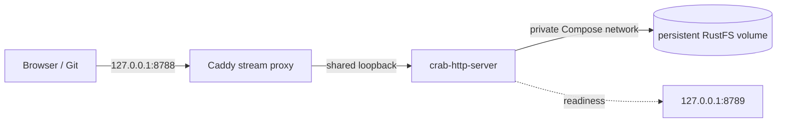

# Deployment profiles

`crab-http-server` has one provider-neutral runtime contract, a one-command
local stack, and checked-in production deployment profiles:


| Target | Deployment asset | Workload identity | Storage URLs |
|---|---|---|---|
| Local Docker | `compose.yaml` | Synthetic local credentials | Private RustFS volume |
| EKS | `helm/crab-http-server` | EKS Pod Identity association | `s3://bucket/root` |
| GKE | `helm/crab-http-server` | GKE Workload Identity Federation | `gs://bucket/root` |
| AKS | `helm/crab-http-server` | AKS Workload ID | `az://account/container/root` |
| ECS/Fargate | `ecs/task-definition.example.json` | ECS task role | `s3://bucket/root` |

These assets are portable implementation evidence. A provider is only
release-qualified after its live test matrix passes; the chart or task
definition alone is not that claim.

## Start locally with Docker Compose

Docker Engine with Compose v2 is the only prerequisite. From the repository
root, run:

```sh
docker compose --file crates/crab-http-server/deploy/compose.yaml \
  up --detach --build --wait
```

Open <http://127.0.0.1:8788/demo/hello>. The first start builds the locked
server image, starts a private RustFS object store, creates its bucket, creates
the `demo/hello` Crab repository, and waits until the complete stack is ready.
Later starts are idempotent.



The proxy shares the server's network namespace. It is the only process bound
to Docker's published port; Crab still binds to loopback and keeps its
unauthenticated local-trust invariant. The management listener and RustFS are
not published to the host. This profile is for local development and
evaluation, not remote or multi-user service.

### Operate the local stack

Use the one-shot repository service to manage the durable catalog:

```sh
docker compose --file crates/crab-http-server/deploy/compose.yaml run --rm \
  repository-init --config /etc/crab/server.toml repository create \
  --owner my-team --name my-project --prefix my-team/my-project

docker compose --file crates/crab-http-server/deploy/compose.yaml run --rm \
  repository-init --config /etc/crab/server.toml repository list
```

Inspect or stop the stack without deleting repositories:

```sh
docker compose --file crates/crab-http-server/deploy/compose.yaml logs --follow server proxy
docker compose --file crates/crab-http-server/deploy/compose.yaml down
```

`docker compose ... down --volumes` permanently removes the local RustFS
volume, including the catalog and every repository. The defaults need no
`.env` file. These optional environment variables customize local operation:

| Variable | Default | Purpose |
|---|---|---|
| `CRAB_HTTP_SERVER_PORT` | `8788` | Localhost port published by Docker |
| `CRAB_TMP_SIZE` | `2g` | Bounded receive-pack and index scratch space |
| `CRAB_HTTP_SERVER_IMAGE` | `crab-http-server:local` | Server image name or prebuilt image reference |

The dependency images are version- and digest-pinned. `RUSTFS_IMAGE`,
`AWS_CLI_IMAGE`, and `CADDY_IMAGE` exist for controlled mirrors; keep them
pinned when overriding. To use a prebuilt server image, set
`CRAB_HTTP_SERVER_IMAGE` and add `--no-build` to `up`.

## Repository lifecycle

The server discovers repositories from a bounded, versioned catalog below the
configured storage root. It never scans a bucket and never treats GC metadata
as an application registry.

```sh
crab-http-server --config server.toml repository create \
  --owner my-team --name my-project --prefix my-team/my-project \
  --members-file members.toml

crab-http-server --config server.toml repository adopt \
  --owner my-team --name existing --prefix imports/existing \
  --members-file members.toml

crab-http-server --config server.toml repository list
```

`create` initializes canonical Crab layout and manifest objects before its CAS
catalog publish. `adopt` requires those objects to exist already. Every running
replica refreshes the catalog and begins routing a successful change within
five seconds; in-flight requests retain the previous repository handle.

## Why Lambda is excluded

Lambda is not a supported full data-plane target. Native receive, upload-pack,
LFS, archive downloads, and maintenance can stream for minutes and use large
bounded scratch space. API Gateway and Lambda buffering, payload, duration,
and ephemeral-runtime constraints change those semantics. A future Lambda
adapter may host bounded control-plane operations, but it must not be described
as the same server deployment.
