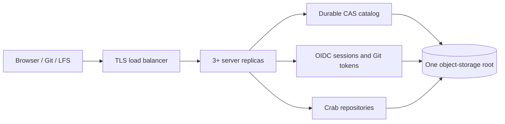
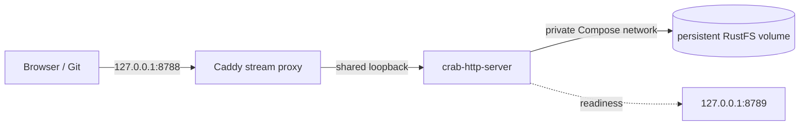
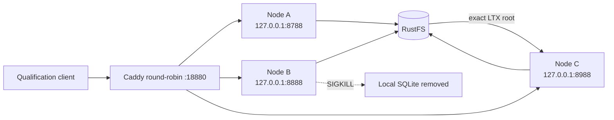
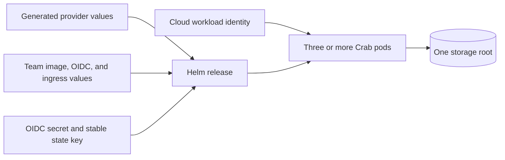

# Deployment profiles

`crab-http-server` has one provider-neutral runtime contract, a one-command local stack, and checked-in deployment profiles for three cloud storage providers:



| Target | Deployment asset | Workload identity | Status |
| --- | --- | --- | --- |
| Local Docker | `compose.yaml` | Synthetic local credentials | Qualified in container CI |
| EKS | `helm/crab-http-server` | EKS Pod Identity association | Recommended team profile; live qualification required |
| GKE | `helm/crab-http-server` | GKE Workload Identity Federation | Recommended team profile; live qualification required |
| AKS | `helm/crab-http-server` | AKS Workload ID | Recommended team profile; live qualification required |
| ECS/Fargate | `ecs/task-definition.example.json` | ECS task role | Evaluation profile; replacement grace is too short |

The Kubernetes chart generates configuration from typed values, runs three or more replicas,
private probes and Prometheus metrics, an optional Prometheus Operator
`PodMonitor` and alert rules, a disruption budget, ingress isolation, optional
Transport Layer Security (TLS) ingress, and optional autoscaling. A provider is
release-qualified only after its live test matrix passes.

The disruption budget protects ready replicas while allowing an unhealthy pod
to be evicted during a node drain, so a broken process cannot indefinitely
block cluster maintenance.

S3 and GCS Terraform roots bound noncurrent repository versions to a configurable
90-day recovery window and remove abandoned multipart uploads after one day.
Azure versions remain unexpired because its available lifecycle condition cannot
measure age since becoming noncurrent safely. Provider cost alerts and the
restore runbook remain operator responsibilities.

Container CI stops the local writers, copies the complete storage root to an
isolated object prefix, compares every key and object body, then verifies the
restored catalog through native Git, issue, and LFS clients. This proves the
portable recovery shape, but provider version selection and regional recovery
still require a live drill.

The same container path uploads a 1 MiB LFS object, interrupts its logical
download after an initial byte range, resumes the remaining range through
Caddy, and requires the reconstructed file to match byte-for-byte.
It also drives the stock Git LFS client through lock creation, listing,
verify-on-push, and unlock against durable RustFS lock records.

Server release tags have their own contract, independent of the Crab CLI. An
annotated `crab-http-server-vX.Y.Z` tag matching the server crate publishes a
qualified AMD64/ARM64 image to GHCR with immutable version and source-commit
tags, an OCI Helm chart, an SBOM, and provenance attestations. Exact-source
qualification rejects fixable HIGH or CRITICAL image vulnerabilities before
publication. Kubernetes deployments still pin the resulting image manifest
digest. A GitHub Release retains the packaged chart and a signed JSON deployment
record that binds the tag and source commit to both registry digests and the
chart package checksum. The publisher never overwrites an existing image tag
or chart version.

## Start locally with Docker Compose

Docker Engine with Compose v2 is the only prerequisite. From the repository
root, run:

```sh
docker compose --file crates/crab-http-server/deploy/compose.yaml \
  up --detach --build --wait
```

Open <http://127.0.0.1:8788/demo/hello>. The first start builds the locked
server image, starts a private RustFS object store, creates its bucket, creates
the `demo/hello` Crab repository, and waits until the complete stack is ready.
Later starts are idempotent.



The proxy shares the server's network namespace. It is the only process bound
to Docker's published port; Crab still binds to loopback and keeps its
unauthenticated local-trust invariant. The management listener and RustFS are
not published to the host. Compose creates the peer CA and leaf once in a
persistent identity volume, so ordinary container recreation remains in the
same Cell fleet. A partial identity volume fails closed instead of silently
creating a different fleet. A one-shot `release-init` service converges concurrent
first-install callers on the exact Cell descriptor and image before repository
initialization or server startup. It resumes only its own bootstrap operation,
admits an operator-prepared candidate without activating it, and never replaces
a different desired release.
Compose then waits until the catalog is valid and every repository can open its
current Git view. This profile is for local development and evaluation, not
remote or multi-user service. Caddy preserves the validated external loopback
authority, so Git LFS action URLs also follow a custom `CRAB_HTTP_SERVER_PORT`.

### Operate the local stack

Use the one-shot repository service to manage the durable catalog:

```sh
docker compose --file crates/crab-http-server/deploy/compose.yaml run --rm \
  repository-init --config /etc/crab/server.toml repository create \
  --owner my-team --name my-project --prefix my-team/my-project

docker compose --file crates/crab-http-server/deploy/compose.yaml run --rm \
  repository-init --config /etc/crab/server.toml repository list
```

Create returns only after the initial repository SQLite/LTX root has been
published, restored, identity-checked and marked `cell_ready`. Adopted
repositories follow the same empty-Cell initialization and readiness transition;
old collaboration application data is not imported.

Inspect or stop the stack without deleting repositories:

```sh
docker compose --file crates/crab-http-server/deploy/compose.yaml exec server \
  crab-http-server --config /etc/crab/server.toml cells capacity --json --live
docker compose --file crates/crab-http-server/deploy/compose.yaml logs --follow server proxy
docker compose --file crates/crab-http-server/deploy/compose.yaml down
```

The capacity report is the server's resource-derived admission envelope, not a
benchmark result. Record it beside live RSS, file-descriptor, latency, local
disk and RustFS measurements when qualifying a node profile.

`docker compose down --volumes` permanently removes the local RustFS and peer
identity volumes, including the catalog and every repository. The next start
therefore creates a new, empty Cell fleet. The defaults need no
`.env` file. These optional environment variables customize local operation:

| Variable | Default | Purpose |
|---|---|---|
| `CRAB_HTTP_SERVER_PORT` | `8788` | Localhost port published by Docker |
| `CRAB_HTTP_SERVER_RELEASE_IMAGE` | `sha256:` plus 64 `1` digits | Synthetic nonzero image identity recorded by local release bootstrap |
| `CRAB_TMP_SIZE` | `2g` | Bounded receive-pack and index scratch space |
| `CRAB_HTTP_SERVER_IMAGE` | `crab-http-server:local` | Server image name or prebuilt image reference |

The dependency images are version- and digest-pinned. `RUSTFS_IMAGE`,
`AWS_CLI_IMAGE`, and `CADDY_IMAGE` exist for controlled mirrors; keep them
pinned when overriding. To use a prebuilt server image, set
`CRAB_HTTP_SERVER_IMAGE` to its manifest digest and add `--no-build` to `up`:

```sh
CRAB_HTTP_SERVER_IMAGE=ghcr.io/crabbuild/crab-http-server@sha256:qualified_digest_here \
  docker compose --file crates/crab-http-server/deploy/compose.yaml \
    up --detach --no-build --wait
```

### Qualify three local Cell processes

The cluster overlay runs three independent server containers and one real
RustFS origin. Each server has its own Cell tmpfs. They share a Docker network
namespace so every unauthenticated listener can remain on loopback; this keeps
the same local-trust boundary as the one-node profile.



Run the repeatable owner-loss qualification from the repository root:

```sh
crates/crab-http-server/tests/qualify_compose_cluster.sh
```

The script builds the current source by default, creates a uniquely named
Compose project, and then:

1. Records the live admission envelope from all three processes.
2. Sends a durable issue mutation directly to node B and proves A, C, and the
   round-robin endpoint route to B over the private mTLS peer protocol.
3. Sends `SIGKILL` to B, destroying its local SQLite files.
4. Waits until B's exact signed boot-session advertisement is expired.
5. Reads through C and requires a higher epoch, a different session, and the
   same LTX root digest.
6. Writes a second issue through C and requires a higher commit sequence.
7. Restarts B with empty local Cell storage and proves it routes to C.

Success prints a JSON receipt containing the before/after sessions, epochs,
root digest, commit sequences, and each process's admission envelope. The trap
removes only the uniquely named qualification project and its volumes. Set
`CRAB_HTTP_CLUSTER_BUILD=false` to reuse an already-built
`CRAB_HTTP_SERVER_IMAGE`.

This is real process-loss, source-loss, peer-routing, and recovery evidence. It
is not the production three-Pod gate because the processes share one network
namespace and it does not inject a network partition, delayed immutable upload,
or lost control-CAS response.

## Deploy for a team

Use the Helm chart on Amazon Elastic Kubernetes Service (EKS), Google Kubernetes Engine (GKE), or Azure Kubernetes Service (AKS). One chart preserves the server runtime contract across providers.

The shortest supported team path is:

| Owner | One-time setup | Per release |
| --- | --- | --- |
| Platform team | Apply one provider Terraform root; configure DNS, TLS, ingress, and workload identity | Review infrastructure drift |
| Identity team | Register the OIDC callback and store the client secret | Rotate under the runbook |
| Crab service owner | Create the namespace, stable state-key Secret, and team values | Verify the signed release record, change one image digest, and run `helm upgrade` plus `helm test` |

No repository list belongs in the server configuration. Create or adopt a
repository once through the management CLI; every replica discovers the shared
catalog update from object storage.



Complete the setup in this order:

1. Create versioned storage and provider workload identity with `terraform/aws`, `terraform/gcp`, or `terraform/azure`.
2. Grant the workload identity access only to the dedicated storage boundary.
3. Register the OpenID Connect (OIDC) callback `https://git.example.com/auth/callback`.
4. Export Terraform's generated provider values and edit the provider-neutral team values file.
5. Create a dedicated namespace with the Restricted Pod Security policy, create
   the Kubernetes Secret, and install the chart.
6. Run `helm test` to prove a fresh workload can read, list, write, conditionally update, and delete through its cloud workload identity.
7. Create the first repository through a running pod.
8. Run the portable multi-replica qualification locally or through the protected GitHub Actions workflow before admitting critical repositories.

Do not grant team members direct write credentials for the storage root. Git,
LFS, browser, and administration traffic must pass through the server so its
authorization, locking, and atomic publication rules remain authoritative.
The production chart also rejects static cloud credentials, credential-source
overrides, unsigned or cleartext storage modes, and custom provider endpoints
in `extraEnv`; the provider ServiceAccount is the only supported credential
path.

[The infrastructure bootstrap guide](terraform/README.md) creates storage and
identity. [The Kubernetes deployment guide](helm/crab-http-server/README.md)
contains install commands. [The operations runbook](operations.md) covers
rollout, rollback, rotation, incidents, and restore qualification.

## Repository lifecycle

The server discovers repositories from a bounded, versioned catalog below the
configured storage root. It never scans a bucket and never treats GC metadata
as an application registry.

```sh
crab-http-server --config server.toml repository create \
  --owner my-team --name my-project --prefix my-team/my-project \
  --members-file members.toml

crab-http-server --config server.toml repository adopt \
  --owner my-team --name existing --prefix imports/existing \
  --members-file members.toml

crab-http-server --config server.toml repository set-members \
  --owner my-team --name my-project --members-file members.toml

crab-http-server --config server.toml repository list
```

Pass `--members-file -` to read the TOML membership document from standard
input, which is useful with `kubectl exec --stdin`. Authenticated deployments
require at least one `admin` member when creating or adopting a repository;
unauthenticated loopback deployments may omit membership.

`create` initializes canonical Crab layout and manifest objects, CAS-publishes
`empty_cell_pending`, provisions and verifies the initial SQLite/LTX root, then
CASes `cell_ready`. Exact retries retain the catalog UUID and restore the
published root before completing. `adopt` requires canonical Git objects,
publishes `empty_cell_pending`, initializes a new empty application Cell and
then publishes `cell_ready`. `set-members` uses one conditional catalog update and reports a
conflict instead of replaying a stale decision over a concurrent change. Every
running replica checks the catalog every five seconds and swaps routing only
after all records pass Cell readiness validation; in-flight requests retain the
previous repository handle.

## Why Lambda is excluded

Lambda is not a supported full data-plane target. Native receive, upload-pack,
LFS, archive downloads, and maintenance can stream for minutes and use large
bounded scratch space. API Gateway and Lambda buffering, payload, duration,
and ephemeral-runtime constraints change those semantics. A future Lambda
adapter may host bounded control-plane operations, but it must not be described
as the same server deployment.
