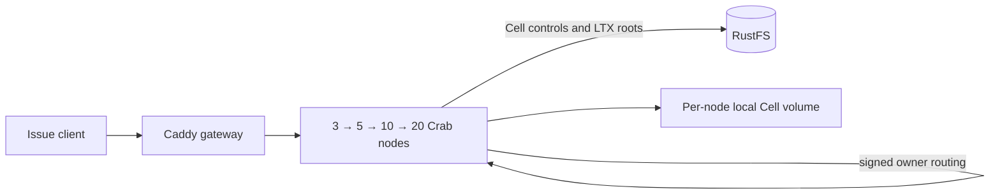

# Cell issue fleet example

This disposable Docker Compose stack runs Crab's existing issue and label
service as a Cell application. Each repository owns a durable SQLite Cell.
Requests enter any node, route to the current owner over the signed peer
protocol, and publish the Cell root to RustFS. New node containers join the
same fleet at 3, 5, 10, and 20 processes.



The reference workload creates one repository Cell per node, then writes an
issue and label through that node. After each scale step it checks the issue
through the gateway, verifies every Cell has a live owner and durable root,
and reads the original Cell through every newly added node. It also kills the
owner of the last Cell, verifies a new owner serves the acknowledged issue
without regressing the published root, and restarts the lost node. The resulting
`report.json` records ownership spread and each node's live admission
envelope. This is a functional scale-up and routing check, not a throughput
or capacity claim.

Each node container has a Docker limit of **1 vCPU and 1 GiB memory**, no swap,
and its own persistent local Cell volume. The runtime applies a 30 GiB logical
local disk admission limit per node and still checks actual free space. Docker
named volumes do not reserve 30 GiB apiece, so the host needs enough shared
disk for the workload. A network-namespace keeper lets all Crab listeners stay
on loopback, as required by this unauthenticated local example. Containers have
separate processes, cgroups, and local volumes; this does not simulate separate
pod network namespaces or a multi-host failure domain.

RustFS is private to the Compose network. Its **disposable local** access key
and secret key are both `crab`; do not expose this stack to other machines.
The RustFS volume and the peer identity volume persist across the four stages.
The script never removes them automatically.

## Run

From the repository root, choose a fresh project name and a state directory
outside the checkout. Docker must be able to bind-mount that directory. The
small rendered configs can live under the home directory; Docker Desktop and
Colima mount it by default:

```sh
state="$HOME/.codex/cell-issue-fleet/run-1"
python3 crates/crab-http-server/deploy/cell-issue-fleet/qualify.py \
  --state "$state" --project crab-cell-issue-run-1
```

The script builds the existing `crab-http-server` image, renders a Compose
file and node configs, starts three nodes, and adds 2, 5, and 10 nodes in
successive stages. It fails if a node is unhealthy, its effective Cell memory
is not 1 GiB, a resource limit is missing, a Cell has no live owner, an issue
is not visible through the gateway, or no Cell object reached RustFS. A fresh
project name avoids touching another Compose stack. The default host ports are
`18080` for the gateway and `18101`–`18120` for direct node access; choose
other ports with `--gateway-port` and `--node-port-base` if needed.

To inspect the generated Compose definition without starting Docker:

```sh
python3 crates/crab-http-server/deploy/cell-issue-fleet/render.py \
  --state "$state" --project crab-cell-issue-run-1
docker compose --file "$state/compose.yaml" \
  --profile five --profile ten --profile twenty config --quiet
```

To operate the rendered stack by hand, run these Compose commands in order.
The profiles only add nodes; existing node volumes and RustFS data persist:

```sh
docker compose --file "$state/compose.yaml" build release-init
docker compose --file "$state/compose.yaml" up --detach --no-build --wait
docker compose --file "$state/compose.yaml" --profile five \
  up --detach --no-build --wait
docker compose --file "$state/compose.yaml" --profile five --profile ten \
  up --detach --no-build --wait
docker compose --file "$state/compose.yaml" \
  --profile five --profile ten --profile twenty \
  up --detach --no-build --wait
```

The checked-in RustFS, AWS CLI, Caddy, Node, Rust, and Debian images are pinned
by the underlying Compose generator or Dockerfile. The gateway serves
<http://127.0.0.1:18080/api/repos/demo/work-01/issues?state=all> after stage
three. To inspect the current containers:

```sh
docker compose --file "$state/compose.yaml" \
  --profile five --profile ten --profile twenty ps
cat "$state/report.json"
```

To stop this **disposable** project while preserving its data, use `down`
without `--volumes`. Removing its volumes deletes the RustFS data, peer
identity, and every node's local Cell volume.

The RustFS service has an explicit 65,536 descriptor limit; the qualification
runner verifies it and records provider descriptor counts. The earlier 1,024
soft limit exhausted during post-churn membership scans and produced S3 500
errors. This fixture limit is independent of Crab node resource admission.

The 1 GiB profile is an evaluation profile. This single-machine Compose run
cannot establish a supported production Cell count, recovery SLO, cloud-store
durability, independent network failure behavior, or multi-host throughput.

## S3-rooted read replicas

Use a fresh project and state directory for the object durability profile:

```sh
python3 crates/crab-http-server/deploy/cell-issue-fleet/qualify_read_replicas.py \
  --state "$HOME/.codex/cell-issue-fleet/read-replicas-1" \
  --project crab-cell-issue-read-replicas-1
```

This run applies read-replica targets of 2, 4, 9, and 19 as the fleet grows
from 3 to 20 nodes. It queries the original issue through an explicit replica
route and records each serving node from `x-crab-cell-reader` in
`read-replica-report.json`. Every Cell mutation uses the object durability
profile. Each stage compares 200 owner and 200 replica reads at concurrency
eight, reports p50/p99 latency and actual reader distribution, and samples
process memory, descriptors, local disk, and runtime metrics. Before/after
per-node counter snapshots record control-record loads, LTX fetches and bytes,
and logical page reads for both workloads. Raw series and collection windows
are retained; amortized costs include background work and collection skew.
They exclude membership/policy reads and retries hidden inside the provider,
so they are not total S3 billing-request counts.

Each stage then acknowledges an issue-body update and polls every selected
reader until its receipt covers the inspected authority root and its body is
correct. The report records sequence lag, unavailable attempts, each reader's
first observed fresh response, and per-node LTX bytes during that window.
Freshness times are polling upper bounds, including authority inspection;
refresh bytes include background and query-fault traffic on reader nodes.
Missing metrics, counter resets, changed nodes, or a stale value at a covering
receipt fail qualification. Parser/evidence checks run with:

```sh
PYTHONDONTWRITEBYTECODE=1 python3 -m unittest discover \
  -s crates/crab-http-server/deploy/cell-issue-fleet -p 'test_*.py'
```

These samples are not peak-resource or production-capacity measurements. A reader-only
failure must recruit a replacement without changing the writer or its epoch.
A separate primary-only failure must select one of the two verified warm readers and
successfully publish a new comment afterward.
The target-count phase exercises 0→1→2→4→1, verifies zero-target rejection,
and kills a selected reader before shrinking from four to one. Each step
checks actual selected/ready counts and unchanged writer authority.

At 20 nodes the runner also kills a Cell's owner and two observed
readers, removes those three disposable local Cell volumes, and requires a
survivor to recover the acknowledged issue and recruit two new readers from
RustFS. The recovered writer must then acknowledge a new issue-body update,
serve it, and advance the S3 root under the same owner and epoch.
Finally it pauses RustFS, requires explicit replica reads to return
`replica_unavailable` without data, resumes the provider, and verifies recovery
without a receipt regression. Each fault phase first establishes a serving
Cell because an earlier killed reader can own other Cells. Node inspection
selects the unique live advertised boot session, including after restarts.
The report proves local RustFS side effects and observed reader distribution
on one host; it does not replace protected-provider evidence.

An additional fault runner uses the existing twenty-node project's image:

```sh
python3 crates/crab-http-server/deploy/cell-issue-fleet/qualify_reader_partition.py \
  --state "$HOME/.codex/cell-issue-fleet/read-replicas-1"
```

It routes one non-owner node's S3 endpoint through a disposable Caddy proxy,
proves that node serves a replica, then pauses only that proxy. HTTP and peer
networking remain available. It requires the isolated ingress to fail closed,
kills the owner, and requires a healthy successor to advance the epoch and
acknowledge a new S3-rooted mutation. The isolated session cannot be that
successor. After its lease expires the server closes its listener; an empty
gateway 502 is accepted only with a fresh expired-session record and no OOM kill.
Cleanup resumes the proxy, restores both nodes and the original
endpoint, and leaves the proxy stopped. The separate receipt records runtime,
image, runner, source-report hash, and control states. This is an S3-path
partition on one host, not independent-network or multi-host qualification.
The proxy preserves signed request headers and uses explicit HTTP with
compression disabled ([Caddy contract](https://caddyserver.com/docs/caddyfile/directives/reverse_proxy#defaults)).

The completed [local qualification receipt](qualification/2026-09-25-read-replicas.md)
records exact runtime/runner/image identities, distribution, latency, resources,
and fault results.

## Fleet-to-object rollout qualification

Use a fresh disposable project for the three-node mode transition:

```sh
python3 crates/crab-http-server/deploy/cell-issue-fleet/qualify_mode_rollout.py \
  --state "$HOME/.codex/cell-issue-fleet/mode-rollout-1" \
  --project crab-cell-issue-mode-rollout-1
```

The runner first drives bounded concurrent writes and requires enrolled logs
and observed fleet durability proofs, then writes a comment and stops all
three servers. Fleet mode may also complete writes through object proof;
individual idle logs need not have won a follower-proof race. It changes their
configs only after every server exits successfully without an OOM kill.
Successful shutdown includes the existing node-log coverage barrier: every
issued frame must be object-covered before the durable log close CAS.
A failed or forced drain leaves the fleet configuration intact and fails the
run. The provider and all local volumes remain available for investigation.

After restarting in object mode, the runner verifies old values, publishes a
new comment, checks object proof counters with no new fleet proofs, and
activates two readers. It then kills all three servers, deletes only their
project-labeled Cell volumes, restarts fresh nodes, and requires both the
pre-rollout and post-rollout comments, including every acknowledgement from
the fleet-proof workload, plus the original issues and labels to survive. The result is saved in `mode-rollout-report.json`.
This is an offline rollout for the local fixture; platform rollout and
protected-provider release procedures remain separate.

## Reader drain and offline retention

An existing disposable twenty-node reader fixture can qualify retention after
its unreachable objects have aged beyond the CLI's one-hour minimum grace.
Stop all its application nodes first. Build the image from a clean commit and
record that commit separately from the runner revision:

```sh
python3 crates/crab-http-server/deploy/cell-issue-fleet/qualify_reader_retention.py \
  --state "$HOME/.codex/cell-issue-fleet/read-replicas-1" \
  --image crab-cell-issue-read-replicas-1:local \
  --runtime-source <image-source-commit>
```

The runner resumes three nodes, verifies twenty issues and two serving readers,
creates a backup pin, and enters maintenance through the public CLI. A one-object
deletion budget must leave the release in Maintenance and every serving process
cleanly drained. Retrying the same prepared revision completes the sweep. Raw
provider inventories must match the deletion counters and the grace cutoff;
the retained pin must still verify. Restarted nodes must recover the same issue
and comment data, recruit two readers, and acknowledge a new write. The runner
retains logs and its incremental `reader-retention-report.json` on failure.
If interrupted after the incomplete one-object pass, repeat the command with
`--resume`; it verifies the fixture and exact maintenance authority, records
the resumed runner and image source, and retries the same prepared revision.
An updated executor image must still match the prepared application descriptor.
It never lowers the grace period or rewrites object timestamps. Use only the
disposable fixture: this command actually deletes eligible immutable objects.

After stopping that fixture, qualify loss of every reader before the writer:

```sh
python3 crates/crab-http-server/deploy/cell-issue-fleet/qualify_reader_first_loss.py \
  --state "$HOME/.codex/cell-issue-fleet/read-replicas-1"
```

This resumes three nodes using the successful retention receipt's image. It
proves two readers, kills them and deletes their project-owned Cell volumes,
then requires a new object-backed acknowledgement from the unchanged writer.
Only afterward does it kill the writer and delete its Cell volume. Fresh
nodes must recover the acknowledged value at a new epoch and recruit two
readers at or above that mutation's durable sequence. The provider and its
volumes remain intact; `reader-first-loss-report.json` records both ownership
cuts, the deleted local volumes, source/image identities, and recovery timing.
