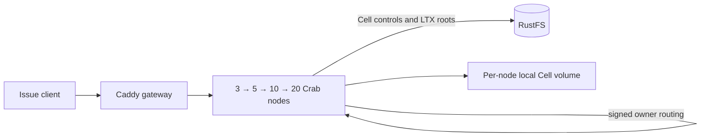

# Cell issue fleet example

This disposable Docker Compose stack runs Crab's existing issue and label
service as a Cell application. Each repository owns a durable SQLite Cell.
Requests enter any node, route to the current owner over the signed peer
protocol, and publish the Cell root to RustFS. New node containers join the
same fleet at 3, 5, 10, and 20 processes.



The reference workload creates a fixed 20 repository Cells at the three-node
stage, distributing initialization across those nodes. The same Cells remain
in place as the fleet grows; `--cells` chooses another fixed count. After each scale step it checks the issue
through the gateway, verifies every Cell has a live owner and durable root,
and reads the original Cell through every newly added node. It also kills the
owner of the last Cell, verifies a new owner serves the acknowledged issue
without regressing the published root, and restarts the lost node. The resulting
`report.json` records ownership spread and each node's live admission
envelope. This is a functional scale-up and routing check, not a throughput
or capacity claim.

The gateway uses round-robin routing across healthy nodes. The separate load
qualification below sends equal issue writes and reads to every Cell through
that gateway and records the entry node on each response.

Each node container has a Docker limit of **1 vCPU and 1 GiB memory**, no swap,
and its own persistent local Cell volume. The runtime applies a 30 GiB logical
local disk admission limit per node and still checks actual free space. Docker
named volumes do not reserve 30 GiB apiece, so the host needs enough shared
disk for the workload. A network-namespace keeper lets all Crab listeners stay
on loopback, as required by this unauthenticated local example. Containers have
separate processes, cgroups, and local volumes; this does not simulate separate
pod network namespaces or a multi-host failure domain.

RustFS is reachable from the Compose network and from host loopback only. Its
**disposable local** access key and secret key are both `crab`; do not expose
this stack to other machines.
The RustFS volume and the peer identity volume persist across the four stages.
The script never removes them automatically.

## Run

From the repository root, choose a fresh project name and a state directory
outside the checkout. Docker must be able to bind-mount that directory. The
small rendered configs can live under the home directory; Docker Desktop and
Colima mount it by default:

```sh
state="$HOME/.codex/cell-issue-fleet/run-1"
python3 crates/crab-http-server/deploy/cell-issue-fleet/qualify.py \
  --state "$state" --project crab-cell-issue-run-1
```

The script requires a clean committed checkout. It streams that revision's
Git archive into the existing server Dockerfile and labels the image with its
source revision. It renders a Compose file and node configs, starts three
nodes, and adds 2, 5, and 10 nodes in
successive stages. It fails if a node is unhealthy, its effective Cell memory
is not 1 GiB, a resource limit is missing, a Cell has no live owner, an issue
is not visible through the gateway, or no Cell object reached RustFS. A fresh
project name avoids touching another Compose stack. The default host ports are
`18080` for the gateway, `18101`–`18120` for direct node access, and `19010`
for RustFS on localhost. Choose other ports with `--gateway-port`,
`--node-port-base`, and `--rustfs-port` if needed.

Before startup it checks the image's `org.opencontainers.image.revision` label
against the checkout, including with `--skip-build`. Missing or different
revisions fail. Every server service and the release bootstrap use the inspected
image ID; each node's actual image must match. A project-local
`qualified-<image-id>` tag retains the image when its `local` build tag moves.
Keep that tag while reusing the stack. The load report records the server's
source, platform, and image separately from the load generator's checkout.
Image labels are build metadata; imported images still require the CI artifact's
source and checksum evidence.

To run the gateway workload while each stage has exactly 3, 5, 10, or 20
active nodes, add `--load-stages`. The functional checks remain the default
when this option is omitted. Each loaded stage writes
`load-<nodes>-stage.json` beside `report.json`; the latter links all four
reports. The default offered rate is five create/read pairs per second for 60 seconds,
with at most 64 pairs in flight. Use `--load-rate`, `--load-duration`, and
`--load-max-in-flight` to choose the workload; keep them and `--cells` fixed
when comparing node counts.

```sh
python3 crates/crab-http-server/deploy/cell-issue-fleet/qualify.py \
  --state "$state" --project crab-cell-issue-run-1 --load-stages
```

### Run a CI-qualified Linux image

The HTTP server container workflow uploads `cell-runtime-image-<run-id>` only
after its image and cluster checks pass. It contains the image archive, SHA-256,
image ID, platform, and exact source revision. On an ARM64 Docker host, dispatch
the workflow on the desired branch with `-f arm64=true`; it uses GitHub's
[native ARM64 runner](https://docs.github.com/en/actions/reference/runners/github-hosted-runners).
Omit the flag for AMD64. Compare performance only on the same native platform.
Use a run that includes the revision-label check; earlier unlabeled artifacts
are rejected by the current qualifier.

```sh
gh workflow run http-server-container.yml --ref YOUR_BRANCH -f arm64=true
```

After that run succeeds, set its run ID below. The exact-source worktree goes
on the mounted workspace volume; the rendered state stays in a directory
Docker can bind-mount. The renderer copies its initialization script into that
state directory, so `--skip-build` does not need a source-tree bind mount.

```sh
run_id=YOUR_SUCCESSFUL_RUN_ID
state="$HOME/.codex/cell-issue-fleet/ci-$run_id"
project="crab-cell-issue-ci-$run_id"
artifact="$HOME/Workspace/crabbuild-target/cell-image-ci-$run_id"
gh run download "$run_id" --name "cell-runtime-image-$run_id" --dir "$artifact"
python3 crates/crab-http-server/deploy/cell-issue-fleet/import_image.py \
  --artifact "$artifact" --project "$project"
image_source="$(cat "$artifact/source-revision")"
git fetch origin "$image_source"
checkout="$HOME/Workspace/Github/crabbuild/crab-cell-ci-$run_id"
git worktree add --detach "$checkout" "$image_source"
python3 "$checkout/crates/crab-http-server/deploy/cell-issue-fleet/qualify.py" \
  --state "$state" --project "$project" --skip-build --load-stages
```

The importer checks the archive SHA-256, hashes its OCI manifest and config,
and matches source/platform receipts before loading. Docker's two archive
entry points must select the same config and layers. The installed image ID
must equal that verified manifest or config digest; a mutable tag is never
identity proof. This handles the observed CI config-ID → Colima manifest-ID
change without accepting unrelated images. Docker's
[classic and containerd stores](https://docs.docker.com/engine/storage/containerd/)
have different image representations, and the
[OCI manifest](https://github.com/opencontainers/image-spec/blob/v1.1.1/manifest.md)
explicitly references its config by digest.

`import-receipt.json` records the archive checksum, both content digests, CI
image ID, installed ID, source, platform, and project tag. Preserve it beside
the downloaded CI artifact. The current importer accepts the workflow's
single-platform OCI export; other archive shapes fail explicitly. It refuses
to overwrite a receipt; use a fresh `--output` for a repeat import.
[Docker load](https://docs.docker.com/reference/cli/docker/image/load/) also
restores the archive's original tags. The importer then creates the selected
project's `local` tag; `qualify.py` pins that image before starting nodes.
The artifact and receipt belong on the mounted workspace volume. Only the
small generated Compose state needs the home-directory bind mount.

To inspect the generated Compose definition without starting Docker:

```sh
python3 crates/crab-http-server/deploy/cell-issue-fleet/render.py \
  --state "$state" --project crab-cell-issue-run-1
docker compose --file "$state/compose.yaml" \
  --profile five --profile ten --profile twenty config --quiet
```

To operate the rendered stack by hand, run these Compose commands in order.
The profiles only add nodes; existing node volumes and RustFS data persist.
These manual builds are exploratory. Use `qualify.py` to produce a pinned stack
for qualification reports:

```sh
docker compose --file "$state/compose.yaml" build release-init
docker compose --file "$state/compose.yaml" up --detach --no-build --wait
docker compose --file "$state/compose.yaml" --profile five \
  up --detach --no-build --wait
docker compose --file "$state/compose.yaml" --profile five --profile ten \
  up --detach --no-build --wait
docker compose --file "$state/compose.yaml" \
  --profile five --profile ten --profile twenty \
  up --detach --no-build --wait
```

The checked-in RustFS, AWS CLI, Caddy, Node, Rust, and Debian images are pinned
by the underlying Compose generator or Dockerfile. The gateway serves
<http://127.0.0.1:18080/api/repos/demo/work-01/issues?state=all> after stage
three. To inspect the current containers:

```sh
docker compose --file "$state/compose.yaml" \
  --profile five --profile ten --profile twenty ps
cat "$state/report.json"
```

## Qualify gateway distribution and Cell actions

Run this after `qualify.py` has pinned the image and the desired scale stage is
healthy. Pass the number of active
nodes (`3`, `5`, `10`, or `20`) and the number of provisioned Cells. The load
uses one fixed schedule independent of completion time:

```sh
python3 crates/crab-http-server/deploy/cell-issue-fleet/load.py \
  --state "$state" --nodes 20 --cells 20 --rate 5 --duration 60 \
  --max-in-flight 64
```

`--rate` is **create/read pairs per second**, not HTTP requests/s. Each arrival
creates one issue with a stable request ID, then reads that exact issue. Uniform
arrivals rotate through all Cells. `--hot-share 0.8` directs 80% to Cell 1 and
spreads the rest across the remaining Cells; `--hot-share 1` measures a single
hot Cell. Node and Cell counts vary independently. Repeat increasing rates at
a fixed duration and resource envelope; use longer runs to observe repeated
compaction and publication drain.

The scheduler admits at most `--max-in-flight` pairs. It records arrivals it
cannot admit as `client_capacity`; arrivals delayed by a full scheduling
interval are `scheduler_late` and are never issued as a catch-up burst. Both
remain in the offered count. The executor has no unbounded submission queue.
The workload is capped at 100,000 planned pairs and 256 in-flight pairs.
Scheduled pair latency includes dispatch delay and bounded retries. Successful
write/read latency is also reported separately, with sample counts. Failed
requests retain their status/retry reasons; exhausted writes may have an
ambiguous result and keep their original request ID in the raw evidence.

Before load, every Cell must be reachable through every active entry node.
After load, the script waits for every node's uncovered publication bytes to
reach zero, verifies every acknowledged issue and newer RustFS roots, and kills
one owner. After takeover it checks the selected root has not regressed, then
rechecks every acknowledged issue across all Cells before restarting the lost
node. Verification uses at most eight concurrent reads and checks both issue
number and title against each original request's recorded result. Summary
fields `acknowledgements_before_recovery` and `owner_loss.acknowledgements`
retain verified counts by Cell and verification duration. This checks
published-root recovery; failure during outstanding follower-only tails is a
separate fault gate. Successful ingress counts must be within 70–130% of
an even split. The owner map used for forwarded counts is the pre-load snapshot;
these counts do not attribute owner movement during the load.

Each run writes a summary and sibling `.samples.jsonl` and `.nodes.jsonl`
files. Every admitted,
rejected, late, or failed pair is retained with its arrival index, Cell,
operation timing, and write receipt ID where applicable. A readback mismatch
stops new arrivals after it is observed; already dispatched work is drained.
The summary remains available when post-load verification fails. A missed or
failed arrival, unbalanced ingress, undrained publication, or failed recovery
exits nonzero. Inspect the report to distinguish generator capacity from
service capacity; `passed` is a functional workload result, never a supported
production limit. Schema 3's `source` identifies the load generator; `server`
contains the inspected server image ID, revision label, and platform. Every
running node must match the pinned image before load begins. Retain the CI
image artifact's source proof alongside imported-image reports.

The node file records Docker CPU, memory, network/block I/O, and the complete
runtime Prometheus output during load. Collection runs on a separate thread,
with at most four metrics commands at once, 15-second command deadlines, and
a five-second pause between snapshots. Each snapshot records its own time and
collection duration; it is not an atomic fleet view. Observer failures fail the
run. Monitoring itself consumes resources, so keep it enabled for comparisons.
After load, the summary retains per-node uncovered-byte samples until drain or
the 120-second failure deadline.

Verify the scheduler locally with its controllable HTTP service:

```sh
python3 -B -W error::ResourceWarning -m unittest discover \
  -s crates/crab-http-server/deploy/cell-issue-fleet -p test_load.py -v
```

The [gateway load qualification](qualification/2026-09-25-gateway-load.md) and
[stage-load qualification](qualification/2026-09-25-stage-load.md) are historical
closed-loop runs where Cell count equaled node count. Their rates and latency
samples are not directly comparable with this scheduled, fixed-Cell workload.
Sustained offered-rate sweeps, complete action-phase attribution, and multi-host
faults remain necessary for capacity qualification.

### Scheduled harness smoke (2026-09-26)

Local Colima ARM64, real RustFS, 20 Cells, 1-vCPU/1-GiB node limits:

| Check | Result |
| --- | --- |
| Three nodes, 5 pairs/s for 12 s, at most 8 in flight | All 60 pairs passed; 120 successful operations; one 503 retry; publication drained; acknowledged issue survived owner loss |
| Scale the same Cells to five nodes | All nodes healthy; 20 issues and labels retained; owner counts 6/5/5/1/3 |
| Five nodes, 100 pairs/s for 3 s, at most 1 in flight | Expected nonzero exit; all 300 arrival records retained: 14 successful pairs, 283 client-capacity rejections, 3 scheduler misses; publication drained and recovery passed |

The overload case proves generator accounting, not a service throughput limit.
The runner used the working tree based on `c61a3b1d550`; the server image was
`sha256:4ecf6e3e6e83263dbc521fc759c4a877c7f6f5e75fd9c555d25a89ebc7e2555e`,
an earlier local image without source-revision proof. These are harness
functional results, not current-source performance results. The VM supplied
8 CPUs and approximately 16 GiB total. Raw summaries, pair samples, node
snapshots, and owner maps are retained under
`$HOME/.codex/cell-vfs-ltx-scale/arrivals-c61/` as `uniform.*`,
`overload.*`, `startup.json`, and `five-startup.json`.

Healthy ingress does not imply even owner execution. See the
[LTX audit](../../../crab-cell-runtime/docs/ltx-performance-audit.md) for the
execution-distribution and shared-resource gates before scale comparisons.

## Measure public-host actions against RustFS

With the stack running, this ignored release-profile test runs 100 serial
verified local actions and 100 serial forwarded actions through the reference
application's public host API. Its Cell roots, LTX objects, and recovery reads
use the Compose RustFS bucket. The result reports action throughput, latency,
object durability wait, and one owner-loss recovery observation. Set the
endpoint port to the value passed to `--rustfs-port`. Use a Cargo target
directory unique to the checkout; the example path below is for the main
checkout:

```sh
CRAB_CELL_TEST_BUCKET=crab-cell-issue-fleet \
CRAB_CELL_TEST_ENDPOINT=http://127.0.0.1:19010 \
CRAB_CELL_TEST_PREFIX=reference-performance \
AWS_ACCESS_KEY_ID=crab AWS_SECRET_ACCESS_KEY=crab \
CRAB_CELL_PERF_ITERATIONS=100 \
CARGO_TARGET_DIR="$HOME/Workspace/crabbuild-target/crab-main" \
  cargo test -p crab-cell-app --test reference_application \
  public_host::reference_public_host_rustfs_action_performance \
  --release --locked -- --ignored --nocapture
```

Each run gets a distinct object prefix. The application hosts in this test are
still three processes on one machine; they use the Compose RustFS service but
do not use the 20 Compose node processes. Keep the raw test output to compare
RustFS measurements with the in-memory baseline. Serial actions do not
establish saturation throughput or a production SLO. See the
[RustFS action measurements](../../../crab-cell-app/performance/2026-09-25-public-host-rustfs.md).

To stop this **disposable** project while preserving its data, use `down`
without `--volumes`. Removing its volumes deletes the RustFS data, peer
identity, and every node's local Cell volume.

The 1 GiB profile is an evaluation profile. This single-machine Compose run
cannot establish a supported production Cell count, recovery SLO, cloud-store
durability, independent network failure behavior, or multi-host throughput.
