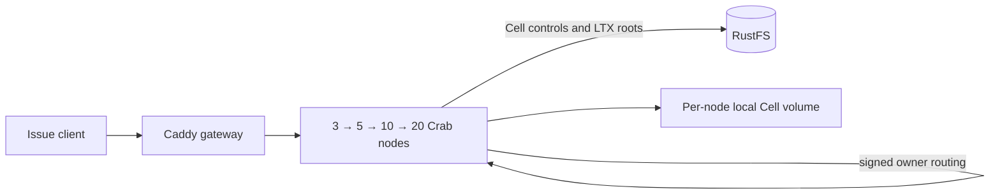

# Cell issue fleet example

This disposable Docker Compose stack runs Crab's existing issue and label
service as a Cell application. Each repository owns a durable SQLite Cell.
Requests enter any node, route to the current owner over the signed peer
protocol, and publish the Cell root to RustFS. New node containers join the
same fleet at 3, 5, 10, and 20 processes.



The reference workload creates one repository Cell per node, then writes an
issue and label through that node. After each scale step it checks the issue
through the gateway, verifies every Cell has a live owner and durable root,
and reads the original Cell through every newly added node. It also kills the
owner of the last Cell, verifies a new owner serves the acknowledged issue
without regressing the published root, and restarts the lost node. The resulting
`report.json` records ownership spread and each node's live admission
envelope. This is a functional scale-up and routing check, not a throughput
or capacity claim.

The gateway uses round-robin routing across healthy nodes. The separate load
qualification below sends equal issue writes and reads to every Cell through
that gateway and records the entry node on each response.

Each node container has a Docker limit of **1 vCPU and 1 GiB memory**, no swap,
and its own persistent local Cell volume. The runtime applies a 30 GiB logical
local disk admission limit per node and still checks actual free space. Docker
named volumes do not reserve 30 GiB apiece, so the host needs enough shared
disk for the workload. A network-namespace keeper lets all Crab listeners stay
on loopback, as required by this unauthenticated local example. Containers have
separate processes, cgroups, and local volumes; this does not simulate separate
pod network namespaces or a multi-host failure domain.

RustFS is reachable from the Compose network and from host loopback only. Its
**disposable local** access key and secret key are both `crab`; do not expose
this stack to other machines.
The RustFS volume and the peer identity volume persist across the four stages.
The script never removes them automatically.

## Run

From the repository root, choose a fresh project name and a state directory
outside the checkout. Docker must be able to bind-mount that directory. The
small rendered configs can live under the home directory; Docker Desktop and
Colima mount it by default:

```sh
state="$HOME/.codex/cell-issue-fleet/run-1"
python3 crates/crab-http-server/deploy/cell-issue-fleet/qualify.py \
  --state "$state" --project crab-cell-issue-run-1
```

The script builds the existing `crab-http-server` image, renders a Compose
file and node configs, starts three nodes, and adds 2, 5, and 10 nodes in
successive stages. It fails if a node is unhealthy, its effective Cell memory
is not 1 GiB, a resource limit is missing, a Cell has no live owner, an issue
is not visible through the gateway, or no Cell object reached RustFS. A fresh
project name avoids touching another Compose stack. The default host ports are
`18080` for the gateway, `18101`–`18120` for direct node access, and `19010`
for RustFS on localhost. Choose other ports with `--gateway-port`,
`--node-port-base`, and `--rustfs-port` if needed.

To run the gateway workload while each stage has exactly 3, 5, 10, or 20
active nodes, add `--load-stages`. The functional checks remain the default
when this option is omitted. Each loaded stage writes
`load-<nodes>-stage.json` beside `report.json`; the latter links all four
reports. Use `--load-pairs-per-cell` to change the default 10 create/read
pairs per Cell.

```sh
python3 crates/crab-http-server/deploy/cell-issue-fleet/qualify.py \
  --state "$state" --project crab-cell-issue-run-1 --load-stages
```

To inspect the generated Compose definition without starting Docker:

```sh
python3 crates/crab-http-server/deploy/cell-issue-fleet/render.py \
  --state "$state" --project crab-cell-issue-run-1
docker compose --file "$state/compose.yaml" \
  --profile five --profile ten --profile twenty config --quiet
```

To operate the rendered stack by hand, run these Compose commands in order.
The profiles only add nodes; existing node volumes and RustFS data persist:

```sh
docker compose --file "$state/compose.yaml" build release-init
docker compose --file "$state/compose.yaml" up --detach --no-build --wait
docker compose --file "$state/compose.yaml" --profile five \
  up --detach --no-build --wait
docker compose --file "$state/compose.yaml" --profile five --profile ten \
  up --detach --no-build --wait
docker compose --file "$state/compose.yaml" \
  --profile five --profile ten --profile twenty \
  up --detach --no-build --wait
```

The checked-in RustFS, AWS CLI, Caddy, Node, Rust, and Debian images are pinned
by the underlying Compose generator or Dockerfile. The gateway serves
<http://127.0.0.1:18080/api/repos/demo/work-01/issues?state=all> after stage
three. To inspect the current containers:

```sh
docker compose --file "$state/compose.yaml" \
  --profile five --profile ten --profile twenty ps
cat "$state/report.json"
```

## Qualify gateway distribution and Cell actions

Run this after the desired scale stage is healthy. Pass the number of active
nodes: `3`, `5`, `10`, or `20`. The example below exercises the full 20-node
fleet with one concurrent client lane per Cell and 10 create/read pairs per
lane:

```sh
python3 crates/crab-http-server/deploy/cell-issue-fleet/load.py \
  --state "$state" --nodes 20 --pairs-per-cell 10
```

The script first reads every Cell through every active entry node. It then
sends the same number of writes and reads to each Cell, verifies each write's
readback, checks that successful entry traffic is within 70–130% of an even
split, and waits for a newer RustFS root for every Cell. Finally it kills one
owner, reads its last acknowledged issue through the gateway after takeover,
checks that the root did not regress, and restarts the killed node. Temporary
busy or unavailable responses are retried a bounded number of times; writes
reuse their original request ID. The JSON report includes retry counts and
end-to-end latency, including retry waits. It records the active Compose
profiles, source revision, server and RustFS images, node limits, workload
size, and p50/p95/p99/max latency. It rejects a stage name that does not
match the project's running node containers. A failed run exits nonzero.

Each run writes `load-<nodes>-<run-id>.json` under the state directory. The
measurement is the throughput of this fixed client workload on one machine,
not maximum fleet throughput or a production SLO. See the
[gateway load qualification](qualification/2026-09-25-gateway-load.md) for
one local run and its limits. The [stage-load qualification](qualification/2026-09-25-stage-load.md)
records load while 3, 5, 10, and 20 nodes were each active.

## Measure public-host actions against RustFS

With the stack running, this ignored release-profile test runs 100 serial
verified local actions and 100 serial forwarded actions through the reference
application's public host API. Its Cell roots, LTX objects, and recovery reads
use the Compose RustFS bucket. The result reports action throughput, latency,
object durability wait, and one owner-loss recovery observation. Set the
endpoint port to the value passed to `--rustfs-port`. Use a Cargo target
directory unique to the checkout; the example path below is for the main
checkout:

```sh
CRAB_CELL_TEST_BUCKET=crab-cell-issue-fleet \
CRAB_CELL_TEST_ENDPOINT=http://127.0.0.1:19010 \
CRAB_CELL_TEST_PREFIX=reference-performance \
AWS_ACCESS_KEY_ID=crab AWS_SECRET_ACCESS_KEY=crab \
CRAB_CELL_PERF_ITERATIONS=100 \
CARGO_TARGET_DIR="$HOME/Workspace/crabbuild-target/crab-main" \
  cargo test -p crab-cell-app --test reference_application \
  public_host::reference_public_host_rustfs_action_performance \
  --release --locked -- --ignored --nocapture
```

Each run gets a distinct object prefix. The application hosts in this test are
still three processes on one machine; they use the Compose RustFS service but
do not use the 20 Compose node processes. Keep the raw test output to compare
RustFS measurements with the in-memory baseline. Serial actions do not
establish saturation throughput or a production SLO. See the
[RustFS action measurements](../../../crab-cell-app/performance/2026-09-25-public-host-rustfs.md).

To stop this **disposable** project while preserving its data, use `down`
without `--volumes`. Removing its volumes deletes the RustFS data, peer
identity, and every node's local Cell volume.

The 1 GiB profile is an evaluation profile. This single-machine Compose run
cannot establish a supported production Cell count, recovery SLO, cloud-store
durability, independent network failure behavior, or multi-host throughput.
