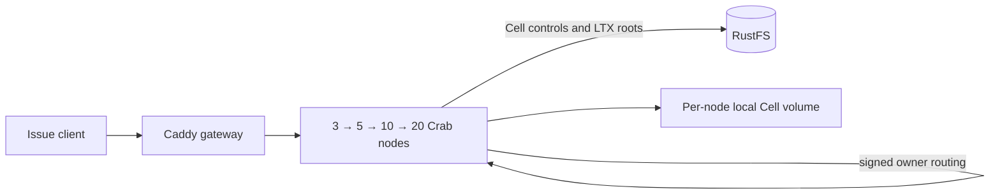

# Cell issue fleet example

This disposable Docker Compose stack runs Crab's existing issue and label
service as a Cell application. Each repository owns a durable SQLite Cell.
Requests enter any node, route to the current owner over the signed peer
protocol, and publish the Cell root to RustFS. New node containers join the
same fleet at 3, 5, 10, and 20 processes.



The reference workload creates one repository Cell per node, then writes an
issue and label through that node. After each scale step it checks the issue
through the gateway, verifies every Cell has a live owner and durable root,
and reads the original Cell through every newly added node. It also kills the
owner of the last Cell, verifies a new owner serves the acknowledged issue
without regressing the published root, and restarts the lost node. The resulting
`report.json` records ownership spread and each node's live admission
envelope. This is a functional scale-up and routing check, not a throughput
or capacity claim.

Each node container has a Docker limit of **1 vCPU and 1 GiB memory**, no swap,
and its own persistent local Cell volume. The runtime applies a 30 GiB logical
local disk admission limit per node and still checks actual free space. Docker
named volumes do not reserve 30 GiB apiece, so the host needs enough shared
disk for the workload. A network-namespace keeper lets all Crab listeners stay
on loopback, as required by this unauthenticated local example. Containers have
separate processes, cgroups, and local volumes; this does not simulate separate
pod network namespaces or a multi-host failure domain.

RustFS is private to the Compose network. Its **disposable local** access key
and secret key are both `crab`; do not expose this stack to other machines.
The RustFS volume and the peer identity volume persist across the four stages.
The script never removes them automatically.

## Run

From the repository root, choose a fresh project name and a state directory
outside the checkout. Docker must be able to bind-mount that directory. The
small rendered configs can live under the home directory; Docker Desktop and
Colima mount it by default:

```sh
state="$HOME/.codex/cell-issue-fleet/run-1"
python3 crates/crab-http-server/deploy/cell-issue-fleet/qualify.py \
  --state "$state" --project crab-cell-issue-run-1
```

The script builds the existing `crab-http-server` image, renders a Compose
file and node configs, starts three nodes, and adds 2, 5, and 10 nodes in
successive stages. It fails if a node is unhealthy, its effective Cell memory
is not 1 GiB, a resource limit is missing, a Cell has no live owner, an issue
is not visible through the gateway, or no Cell object reached RustFS. A fresh
project name avoids touching another Compose stack. The default host ports are
`18080` for the gateway and `18101`–`18120` for direct node access; choose
other ports with `--gateway-port` and `--node-port-base` if needed.

To inspect the generated Compose definition without starting Docker:

```sh
python3 crates/crab-http-server/deploy/cell-issue-fleet/render.py \
  --state "$state" --project crab-cell-issue-run-1
docker compose --file "$state/compose.yaml" \
  --profile five --profile ten --profile twenty config --quiet
```

To operate the rendered stack by hand, run these Compose commands in order.
The profiles only add nodes; existing node volumes and RustFS data persist:

```sh
docker compose --file "$state/compose.yaml" build release-init
docker compose --file "$state/compose.yaml" up --detach --no-build --wait
docker compose --file "$state/compose.yaml" --profile five \
  up --detach --no-build --wait
docker compose --file "$state/compose.yaml" --profile five --profile ten \
  up --detach --no-build --wait
docker compose --file "$state/compose.yaml" \
  --profile five --profile ten --profile twenty \
  up --detach --no-build --wait
```

The checked-in RustFS, AWS CLI, Caddy, Node, Rust, and Debian images are pinned
by the underlying Compose generator or Dockerfile. The gateway serves
<http://127.0.0.1:18080/api/repos/demo/work-01/issues?state=all> after stage
three. To inspect the current containers:

```sh
docker compose --file "$state/compose.yaml" \
  --profile five --profile ten --profile twenty ps
cat "$state/report.json"
```

To stop this **disposable** project while preserving its data, use `down`
without `--volumes`. Removing its volumes deletes the RustFS data, peer
identity, and every node's local Cell volume.

The 1 GiB profile is an evaluation profile. This single-machine Compose run
cannot establish a supported production Cell count, recovery SLO, cloud-store
durability, independent network failure behavior, or multi-host throughput.
