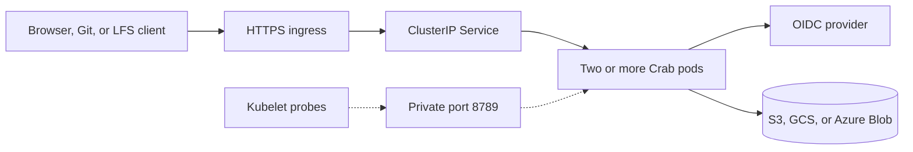

# Deploy Crab for a team on Kubernetes

This chart runs `crab-http-server` on Amazon Elastic Kubernetes Service (EKS), Google Kubernetes Engine (GKE), or Azure Kubernetes Service (AKS). Start with the provider values file, create one Kubernetes Secret, and install one chart. The chart manages the application configuration, replicas, probes, disruption budget, network policy, optional ingress, and optional autoscaling.

> Production qualification is still incomplete. Read [Production boundaries](#production-boundaries) before serving critical repositories.

## Understand the deployment

Every pod reads one durable catalog and its repositories from the same object-storage root. Pods keep no authoritative state on their scratch volumes.



The private ClusterIP Service exposes port 8788 inside the cluster. The TLS
ingress is the only supported public path. The chart never exposes management
port 8789 through a Service or ingress. The default NetworkPolicy admits public
traffic only on the named `http` port. Metrics scraping requires an explicit
management-port source.

## Prepare the platform

Create these resources before installing Crab:

- A Kubernetes 1.29 or newer cluster across at least two zones
- Helm 3
- A NetworkPolicy-capable Container Network Interface (CNI)
- A versioned S3 bucket, Google Cloud Storage (GCS) bucket, or Azure Blob container
- A workload identity with list, read, create, conditional-update, and delete access below one storage prefix
- An OpenID Connect (OIDC) client with `https://git.example.com/auth/callback` as its redirect URI
- An HTTPS ingress controller and TLS Secret when `ingress.enabled` is `true`
- The Kubernetes metrics API when `autoscaling.enabled` is `true`

Use one workload identity mechanism:

| Platform | Identity mechanism | Storage URL |
| --- | --- | --- |
| EKS | [EKS Pod Identity](https://docs.aws.amazon.com/eks/latest/userguide/pod-identities.html) | `s3://bucket/root` |
| GKE | [Workload Identity Federation for GKE](https://docs.cloud.google.com/kubernetes-engine/docs/how-to/workload-identity) | `gs://bucket/root` |
| AKS | [Microsoft Entra Workload ID](https://learn.microsoft.com/en-us/azure/aks/workload-identity-deploy-cluster) | `az://account/container/root` |

Grant access only below the configured root. Don’t put static cloud keys in the Kubernetes Secret.

Use [the Terraform provider roots](../../terraform/README.md) to create dedicated versioned storage and workload identity for an existing cluster. Skip them when your platform team already manages those resources.

## Select an immutable image

Maintainer releases publish `linux/amd64` and `linux/arm64` images to
`ghcr.io/crabbuild/crab-http-server`. The release workflow accepts only an
annotated `crab-http-server-vX.Y.Z` tag that matches this crate's version and is
reachable from `main`. It qualifies that exact source, generates SBOM and
provenance attestations, and publishes both the version and source-commit tags.
The same release publishes this chart to
`oci://ghcr.io/crabbuild/charts/crab-http-server` with the matching version and
a registry-backed provenance attestation.

Inspect a published version and record its manifest digest:

```sh
docker buildx imagetools inspect ghcr.io/crabbuild/crab-http-server:0.1.0
gh attestation verify \
  oci://ghcr.io/crabbuild/crab-http-server@sha256:qualified_digest_here \
  --repo crabbuild/crab \
  --signer-workflow crabbuild/crab/.github/workflows/http-server-release.yml
```

Authenticate to GHCR first when the package is private. Put
`ghcr.io/crabbuild/crab-http-server` in `image.repository` and the recorded
`sha256:` value in `image.digest`; the chart never deploys a mutable tag.

Until a server release is published, or when maintaining a custom downstream
image, build from the repository root and push the architectures used by your
cluster:

```sh
docker buildx build --platform linux/amd64,linux/arm64 --push \
  --file crates/crab-http-server/deploy/Dockerfile \
  --tag registry.example.com/crab-http-server:release_name_here .
docker buildx imagetools inspect \
  registry.example.com/crab-http-server:release_name_here
```

Copy the reported manifest digest into `image.digest`. Keep the repository in
`image.repository`; don’t put a tag in that value.

## Configure one provider profile

With a source checkout, copy the matching values file to a private working
directory:

```sh
cp crates/crab-http-server/deploy/helm/crab-http-server/eks-values.example.yaml \
  /secure/crab-http-server-values.yaml
```

Without a source checkout, pull and unpack the released OCI chart first, then
copy the provider example from that directory:

```sh
helm pull oci://ghcr.io/crabbuild/charts/crab-http-server \
  --version 0.1.0 --untar --untardir /secure
cp /secure/crab-http-server/eks-values.example.yaml \
  /secure/crab-http-server-values.yaml
```

Authenticate with `helm registry login ghcr.io` first when the package is
private. Choose `gke-values.example.yaml` or `aks-values.example.yaml` for
those platforms. Replace every example value in the copy:

| Value | Required change |
| --- | --- |
| `image.repository` | Your private image repository |
| `image.digest` | The qualified immutable image digest |
| `config.content.storage.url` | Your dedicated object-storage root |
| `config.content.auth.*` | Your OIDC issuer, client ID, and public HTTPS URL |
| `serviceAccount.*` | Your provider workload identity |
| `ingress` and `networkPolicy.publicIngressFrom` | Your HTTPS host, ingress class, TLS Secret, and allowed controller source |
| `metrics` and `networkPolicy.metricsIngressFrom` | Your private Prometheus discovery and allowed scraper source |

The chart rejects image tags, missing digests, unknown top-level values,
automatic Kubernetes API credentials, disabled network isolation, unrestricted
ingress, direct load balancers, overrides of chart-owned pod metadata, fewer
than two replicas, and a shutdown budget shorter than 630 seconds.

## Create the application Secret

Write the OIDC client secret and a stable random state key to private files. Keep the state key unchanged across replicas and rollouts.

```sh
mkdir -p /secure/crab-http-server
openssl rand -out /secure/crab-http-server/state-key 32
chmod 0700 /secure/crab-http-server
chmod 0600 /secure/crab-http-server/state-key \
  /secure/crab-http-server/oidc-client-secret
```

Create the namespace and Secret from those files:

```sh
kubectl create namespace crab --dry-run=client -o yaml | kubectl apply -f -
kubectl --namespace crab create secret generic crab-http-server \
  --from-file=oidc-client-secret=/secure/crab-http-server/oidc-client-secret \
  --from-file=state-key=/secure/crab-http-server/state-key \
  --dry-run=client -o yaml | kubectl apply -f -
```

When the identity provider registers Crab as a public Proof Key for Code Exchange (PKCE) client, omit `client_secret_file` from `config.content` and set `secrets.oidcClientSecretKey` to an empty string. The Secret then needs only `state-key`.

## Install the server

Install or upgrade Crab with the provider profile:

```sh
helm upgrade --install crab-http-server \
  crates/crab-http-server/deploy/helm/crab-http-server \
  --namespace crab --create-namespace \
  --values /secure/crab-http-server-values.yaml \
  --wait --timeout 15m
```

When installing without a source checkout, replace the local chart path with
`oci://ghcr.io/crabbuild/charts/crab-http-server` and add `--version 0.1.0`.

The Deployment becomes ready only after a pod can read and validate the durable
catalog and open the current Git view of every discovered repository. Confirm
the rollout and inspect the catalog:

```sh
kubectl --namespace crab rollout status deployment/crab-http-server --timeout=15m
kubectl --namespace crab exec deployment/crab-http-server -- \
  crab-http-server --config /etc/crab/http-server/server.toml healthcheck
kubectl --namespace crab exec deployment/crab-http-server -- \
  crab-http-server --config /etc/crab/http-server/server.toml repository list
```

## Create the first repository

Run repository administration through a pod that already has configuration and workload identity. The command initializes the canonical storage layout before publishing the catalog record.

```sh
kubectl --namespace crab exec deployment/crab-http-server -- \
  crab-http-server --config /etc/crab/http-server/server.toml repository create \
  --owner your_team --name your_project \
  --prefix your_team/your_project --default-branch main
```

Every healthy replica discovers the new record within five seconds. Use `repository adopt` instead when the target prefix already contains a canonical Crab repository.

During termination, Kubernetes marks the pod endpoint non-ready before running
the chart's 15-second pre-stop delay. Crab keeps serving during that interval so
Service and ingress routes can converge before `SIGTERM` starts the application
drain. The 630-second pod grace period preserves more than ten minutes after the
pre-stop delay.

## Enable HTTPS ingress

Enable ingress only after installing an ingress controller and creating the TLS Secret. The ingress host must match `auth.public_url` in the server configuration.

```yaml
ingress:
  enabled: true
  className: nginx
  host: git.example.com
  tlsSecretName: crab-http-server-tls

networkPolicy:
  publicIngressFrom:
    - namespaceSelector:
        matchLabels:
          kubernetes.io/metadata.name: ingress-nginx
```

Configure the ingress controller for streaming request and response bodies. Its request-body limit, upstream timeout, idle timeout, and connection-drain settings must accommodate five-minute Git and Large File Storage (LFS) transfers plus ten-minute archive downloads.

## Enable autoscaling

Enable the Horizontal Pod Autoscaler (HPA) after the cluster reports pod CPU metrics:

```yaml
autoscaling:
  enabled: true
  minReplicas: 2
  maxReplicas: 10
  targetCPUUtilizationPercentage: 70
```

CPU scaling protects general request capacity. It does not create a cluster-wide Git admission limit: transfer and maintenance admission remain process-local.

## Scrape Prometheus metrics

The private management listener serves `GET /metrics`. On a cluster with the
Prometheus Operator, let the chart create a `PodMonitor` and allow only the
namespace or pods that run your scraper. Its labels must match the Prometheus
`podMonitorSelector`:

```yaml
metrics:
  podMonitor:
    enabled: true
    labels:
      prometheus: platform
    interval: 30s
    scrapeTimeout: 10s

networkPolicy:
  metricsIngressFrom:
    - namespaceSelector:
        matchLabels:
          kubernetes.io/metadata.name: monitoring
```

The application Service and ingress never expose port 8789. Metrics have
bounded labels and retain request duration through streaming response
completion. The `PodMonitor` selects Crab pods directly, so no public or
management Service is created.

### Install baseline alert rules

Clusters with the Prometheus Operator can install Crab's optional
`PrometheusRule`. Its metadata labels must match the Prometheus
`ruleSelector`. The scrape configuration must retain the standard `namespace`
and `pod` target labels used to isolate one Helm release:

```yaml
metrics:
  podMonitor:
    enabled: true
    labels:
      prometheus: platform
  prometheusRule:
    enabled: true
    labels:
      prometheus: platform
      role: alert-rules
    runbookUrl: https://operations.example.com/runbooks/crab-http-server

networkPolicy:
  metricsIngressFrom:
    - namespaceSelector:
        matchLabels:
          kubernetes.io/metadata.name: monitoring
```

The `PodMonitor` labels must match the Prometheus `podMonitorSelector`; the rule
labels must independently match its `ruleSelector`. The rules alert on missing
metrics, sustained catalog failure, repeated catalog refresh failures,
sustained Git admission exhaustion, and a five-percent 5xx rate after a minimum
traffic floor. They are disabled by default because the `PrometheusRule` custom
resource must already exist. The chart rejects rules without metrics discovery
or an explicit private scraper source. Route the included `critical` and
`warning` severities through Alertmanager, then tune thresholds only from
recorded workload evidence.

## Restrict network sources

The NetworkPolicy blocks every source until you select the pods, namespaces, or
IP ranges allowed to reach port 8788. Ingress rejects an empty
`publicIngressFrom`; the `PodMonitor` rejects an empty
`metricsIngressFrom`. Select an ingress controller with a standard
`namespaceSelector`, `podSelector`, or `ipBlock` entry:

```yaml
networkPolicy:
  publicIngressFrom:
    - namespaceSelector:
        matchLabels:
          kubernetes.io/metadata.name: ingress-nginx
```

The chart does not allow the policy to be disabled. Verify that your CNI
enforces it and that kubelet readiness probes still succeed before exposing the
ingress. The Service is always private `ClusterIP`; public traffic has one
supported path through the TLS ingress.

## Roll out configuration and secret changes

The chart hashes inline `config.content`, so a configuration change starts a rolling replacement. Externally managed ConfigMaps and Secrets don’t change the pod template automatically.

Set a new rollout token after rotating an external input:

```sh
helm upgrade crab-http-server \
  crates/crab-http-server/deploy/helm/crab-http-server \
  --namespace crab --values /secure/crab-http-server-values.yaml \
  --set-string rolloutToken="$(date -u +%Y%m%dT%H%M%SZ)" \
  --wait --timeout 15m
```

Rotate the OIDC client secret without changing the state key. Changing the state key invalidates browser sessions and in-flight OIDC transactions.

## Production boundaries

The chart is portable deployment evidence, not provider qualification. Before production use, run a dedicated live test for push, fetch, LFS upload/download, OIDC callback routing across replicas, rolling replacement, and object-store restore.

The current server still lacks complete abrupt-process-crash qualification,
cluster-wide admission, provider-scale throughput evidence, and a
version-selected provider restore drill. Local container CI proves the portable
complete-root copy and independent restored reads, not a cloud recovery point.
Prefer Kubernetes over AWS Fargate for long streams: Fargate limits container
stop timeout to 120 seconds, while Crab permits operations lasting up to ten
minutes.

Use [the operations runbook](../../operations.md) for rollout, rollback, rotation, incident response, and restore qualification.
