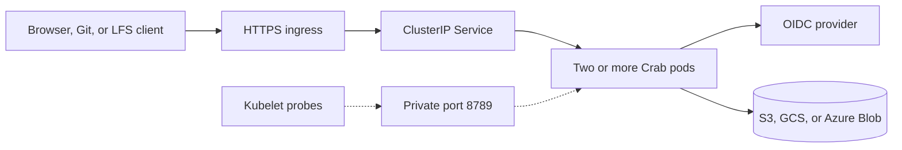

# Deploy Crab for a team on Kubernetes

This chart runs `crab-http-server` on Amazon Elastic Kubernetes Service (EKS), Google Kubernetes Engine (GKE), or Azure Kubernetes Service (AKS). Combine one generated provider overlay with one provider-neutral team overlay, create the application Secret, and install one chart. The chart renders the server configuration and manages replicas, probes, disruption budget, network policy, optional ingress, and optional autoscaling. HTTPS ingress also needs a TLS Secret, usually managed by the platform or cert-manager.

> Production qualification is still incomplete. Read [Production boundaries](#production-boundaries) before serving critical repositories.

## Understand the deployment

Every pod reads one durable catalog and its repositories from the same object-storage root. Pods keep no authoritative state on their scratch volumes.



The private ClusterIP Service exposes port 8788 inside the cluster. The TLS
ingress is the only supported public path. The chart never exposes management
port 8789 through a Service or ingress. The default NetworkPolicy admits public
traffic only on the named `http` port. Metrics scraping requires an explicit
management-port source.

## Prepare the platform

Create these resources before installing Crab:

- A Kubernetes 1.29 or newer cluster with at least two schedulable nodes across
  at least two zones, plus capacity for one rollout surge pod
- Helm 3
- A NetworkPolicy-capable Container Network Interface (CNI)
- A versioned S3 bucket, Google Cloud Storage (GCS) bucket, or Azure Blob container
- A workload identity with list, read, create, conditional-update, and delete access below one storage prefix
- An OpenID Connect (OIDC) client with `https://git.example.com/auth/callback` as its redirect URI
- An HTTPS ingress controller and TLS Secret when `ingress.enabled` is `true`
- The Kubernetes metrics API when `autoscaling.enabled` is `true`

Use one workload identity mechanism:

| Platform | Identity mechanism | Storage URL |
| --- | --- | --- |
| EKS | [EKS Pod Identity](https://docs.aws.amazon.com/eks/latest/userguide/pod-identities.html) | `s3://bucket/root` |
| GKE | [Workload Identity Federation for GKE](https://docs.cloud.google.com/kubernetes-engine/docs/how-to/workload-identity); metadata-server node selector on Standard only | `gs://bucket/root` |
| AKS | [Microsoft Entra Workload ID](https://learn.microsoft.com/en-us/azure/aks/workload-identity-deploy-cluster) | `az://account/container/root` |

Grant access only below the configured root. Don’t put static cloud keys in the Kubernetes Secret.

Use [the Terraform provider roots](../../terraform/README.md) to create dedicated versioned storage and workload identity for an existing cluster. Skip them when your platform team already manages those resources.

### Preserve workload-identity egress

The chart's NetworkPolicy controls ingress only. If the namespace or cluster has
a separate default-deny egress policy, allow DNS plus the exact identity,
storage, and OIDC destinations used by the deployment:

| Platform | Identity egress required from Crab pods |
| --- | --- |
| EKS | EKS Pod Identity Agent at `169.254.170.23:80` or `[fd00:ec2::23]:80` |
| GKE | GKE metadata server at `169.254.169.254:80`, or `169.254.169.252:988` on clusters that use that endpoint |
| AKS | `login.microsoftonline.com:443`, or the matching sovereign-cloud authority |

Every platform also needs HTTPS access to its object-storage endpoint and the
configured OIDC issuer's discovery, JSON Web Key Set, authorization, and token
endpoints. Prefer provider private endpoints and approved egress gateways when
available. Kubernetes NetworkPolicy has no portable fully qualified domain name
selector, so the chart cannot safely manufacture these provider- and
network-specific rules.

When EKS pods use an outbound proxy, add the Pod Identity link-local addresses
to `NO_PROXY`; otherwise the SDK can send credential requests to the proxy.
See the provider contracts for [EKS Pod Identity](https://docs.aws.amazon.com/eks/latest/userguide/pod-identities.html),
[GKE Workload Identity Federation](https://docs.cloud.google.com/kubernetes-engine/docs/concepts/workload-identity),
and [AKS outbound workload-identity rules](https://learn.microsoft.com/en-us/azure/aks/outbound-rules-control-egress).

## Select an immutable image

Maintainer releases publish `linux/amd64` and `linux/arm64` images to
`ghcr.io/crabbuild/crab-http-server`. The release workflow accepts only an
annotated `crab-http-server-vX.Y.Z` tag that matches this crate's version and is
reachable from `main`. It qualifies that exact source, generates SBOM and
provenance attestations, and publishes both the version and source-commit tags.
The same release publishes this chart to
`oci://ghcr.io/crabbuild/charts/crab-http-server` with the matching version and
a registry-backed provenance attestation.

Inspect a published version and record its manifest digest:

```sh
docker buildx imagetools inspect ghcr.io/crabbuild/crab-http-server:0.1.0
gh attestation verify \
  oci://ghcr.io/crabbuild/crab-http-server@sha256:qualified_digest_here \
  --repo crabbuild/crab \
  --signer-workflow crabbuild/crab/.github/workflows/http-server-release.yml
```

Authenticate to GHCR first when the package is private. Put
`ghcr.io/crabbuild/crab-http-server` in `image.repository` and the recorded
`sha256:` value in `image.digest`; the chart never deploys a mutable tag.

Until a server release is published, or when maintaining a custom downstream
image, build from the repository root and push the architectures used by your
cluster:

```sh
docker buildx build --platform linux/amd64,linux/arm64 --push \
  --file crates/crab-http-server/deploy/Dockerfile \
  --tag registry.example.com/crab-http-server:release_name_here .
docker buildx imagetools inspect \
  registry.example.com/crab-http-server:release_name_here
```

Copy the reported manifest digest into `image.digest`. Keep the repository in
`image.repository`; don’t put a tag in that value.

## Configure the provider and team overlays

After applying a checked-in Terraform root, export its non-secret provider
values directly:

```sh
terraform -chdir=crates/crab-http-server/deploy/terraform/aws \
  output -raw helm_values > /secure/crab-provider-values.yaml
cp crates/crab-http-server/deploy/helm/crab-http-server/team-values.example.yaml \
  /secure/crab-team-values.yaml
```

Replace `aws` with `gcp` or `azure`. When a platform team manages storage and
identity outside these Terraform roots, copy the matching `eks`, `gke`, or
`aks` provider example to `/secure/crab-provider-values.yaml` and replace its
values.

Without a source checkout, pull and unpack the released OCI chart first, then
copy the team and provider examples from that directory:

```sh
helm pull oci://ghcr.io/crabbuild/charts/crab-http-server \
  --version 0.1.0 --untar --untardir /secure
cp /secure/crab-http-server/eks-values.example.yaml \
  /secure/crab-provider-values.yaml
cp /secure/crab-http-server/team-values.example.yaml \
  /secure/crab-team-values.yaml
```

Authenticate with `helm registry login ghcr.io` first when the package is
private. Choose `gke-values.example.yaml` or `aks-values.example.yaml` for
those platforms.

The GKE example targets Standard clusters and selects metadata-server-enabled
nodes. Remove its `nodeSelector` on Autopilot. Terraform's required
`gke_cluster_mode` input generates the correct form automatically.

| Overlay | Usually owned by | Contains |
| --- | --- | --- |
| Provider | Platform team / Terraform | Storage root and workload-identity wiring |
| Team | Crab service owner | Image digest, OIDC client, public host, Secret name, ingress and monitoring policy |

Replace or verify every example value across the two overlays:

| Value | Required change |
| --- | --- |
| `image.repository` | Your private image repository |
| `image.digest` | The qualified immutable image digest |
| `config.storageUrl` | Generated by Terraform, or your dedicated object-storage root |
| `config.auth.*` | Your OIDC issuer, client ID, and public HTTPS URL |
| `serviceAccount.*` | Your provider workload identity |
| `ingress` and `networkPolicy.publicIngressFrom` | Your HTTPS host, ingress class, TLS Secret, and allowed controller source |
| `metrics` and `networkPolicy.metricsIngressFrom` | Your private Prometheus discovery and allowed scraper source |

The chart rejects image tags, missing digests, unknown top-level values,
automatic Kubernetes API credentials, disabled network isolation, unrestricted
ingress, direct load balancers, overrides of chart-owned pod metadata, fewer
than two replicas, an impossible disruption budget, soft or single-domain
placement, and a shutdown budget shorter than 630 seconds.

`config.existingConfigMap` is an advanced escape hatch for teams that own the
complete `server.toml`. Do not combine it with the generated provider overlay,
because that overlay intentionally sets `config.storageUrl`; instead, carry
only its `serviceAccount`, `podLabels`, and `extraEnv` identity values into a
separate overlay. The chart accepts exactly one configuration source.

## Create the application Secret

Write the OIDC client secret and a stable random state key to private files. Keep the state key unchanged across replicas and rollouts.

```sh
mkdir -p /secure/crab-http-server
openssl rand -out /secure/crab-http-server/state-key 32
chmod 0700 /secure/crab-http-server
chmod 0600 /secure/crab-http-server/state-key \
  /secure/crab-http-server/oidc-client-secret
```

Create the namespace and Secret from those files:

```sh
kubectl create namespace crab --dry-run=client -o yaml | kubectl apply -f -
kubectl --namespace crab create secret generic crab-http-server \
  --from-file=oidc-client-secret=/secure/crab-http-server/oidc-client-secret \
  --from-file=state-key=/secure/crab-http-server/state-key \
  --dry-run=client -o yaml | kubectl apply -f -
```

When the identity provider registers Crab as a public Proof Key for Code Exchange (PKCE) client, set `secrets.oidcClientSecretKey` to an empty string. The chart omits `client_secret_file`, and the Secret needs only `state-key`.

## Install the server

Install or upgrade Crab with both overlays:

```sh
helm upgrade --install crab-http-server \
  crates/crab-http-server/deploy/helm/crab-http-server \
  --namespace crab --create-namespace \
  --values /secure/crab-provider-values.yaml \
  --values /secure/crab-team-values.yaml \
  --atomic --history-max 10 --timeout 15m
```

When installing without a source checkout, replace the local chart path with
`oci://ghcr.io/crabbuild/charts/crab-http-server` and add `--version 0.1.0`.

The Deployment becomes ready only after a pod can read and validate the durable
catalog and open the current Git view of every discovered repository. Confirm
the rollout and inspect the catalog:

```sh
kubectl --namespace crab rollout status deployment/crab-http-server --timeout=15m
kubectl --namespace crab exec deployment/crab-http-server -- \
  crab-http-server --config /etc/crab/http-server/server.toml healthcheck
kubectl --namespace crab exec deployment/crab-http-server -- \
  crab-http-server --config /etc/crab/http-server/server.toml repository list
helm test crab-http-server --namespace crab --logs --timeout 3m
```

The Helm test starts a fresh hardened pod with the release ServiceAccount,
configuration, Secret, cloud environment, and immutable image. Its
`storage-probe` command reads the durable catalog, performs a bounded list,
claims and releases a dedicated coordination slot with conditional writes,
writes and deletes a unique probe object, and confirms that deletion is
visible. It does not send traffic through ingress; use the live qualification
below for that boundary.

## Create the first repository

Run repository administration through a pod that already has configuration
and workload identity. First create a private local membership file using the
OIDC provider's stable `sub` claim for the initial administrator. After the
administrator signs in, Crab displays that subject on the empty repository
page and returns it from `/api/session`:

```toml
members = [
  { subject = "provider-subject-for-alice", name = "Alice", access = "admin" },
]
```

Pipe that file over standard input so it is neither baked into the image nor
persisted in a Kubernetes object:

```sh
kubectl --namespace crab exec --stdin deployment/crab-http-server -- \
  crab-http-server --config /etc/crab/http-server/server.toml repository create \
  --owner your_team --name your_project \
  --prefix your_team/your_project --default-branch main \
  --members-file - < /secure/crab-members.toml
```

Authenticated repository creation and adoption fail unless the supplied
membership contains at least one administrator; this prevents creating a
repository that nobody can manage or open. Every healthy replica discovers the
new record on its next five-second catalog poll and routes it after
materialization succeeds. Use `repository adopt` instead when the target prefix
already contains a canonical Crab repository.

Use the same private-file pattern to replace membership later:

```sh
kubectl --namespace crab exec --stdin deployment/crab-http-server -- \
  crab-http-server --config /etc/crab/http-server/server.toml \
  repository set-members --owner your_team --name your_project \
  --members-file - < /secure/crab-members.toml
```

The command uses one conditional catalog update and fails on a concurrent
catalog change. Review `repository list` before retrying so a stale operator
decision cannot overwrite newer membership.

## Qualify the live deployment

Create a dedicated qualification repository, sign in through OIDC, and issue a
write-scoped Git token for it. Then run the provider-neutral qualification
script from a trusted operator workstation with `kubectl`, Git LFS, `curl`, and
`jq` installed:

```sh
export CRAB_HTTP_SERVER_GIT_TOKEN=secret_from_git_access
export CRAB_HTTP_SERVER_EXPECTED_IMAGE=registry.example.com/crab-http-server@sha256:qualified_digest_here
export CRAB_HTTP_SERVER_APPROVE_ROLLOUT=true

bash crates/crab-http-server/deploy/helm/crab-http-server/qualification/qualify-kubernetes.sh \
  eks crab crab-http-server https://git.example.com \
  your_team qualification /secure/crab-eks-qualification.json
```

Replace `eks` with `gke` or `aks`. The explicit rollout approval is required
because this test creates and retains a uniquely named branch in the dedicated
repository and performs a rolling restart of the Deployment. Never run it
against a repository where qualification branches are forbidden by policy.
The expected image is required for release evidence; the script rejects a
deployment whose manifest reference differs.

The test fails unless it can prove all of these boundaries:

- At least two ready replicas run on separate nodes and zones whose provider
  identities match the declared EKS, GKE, or AKS target
- The Deployment uses an immutable digest, a private ClusterIP Service, the
  chart NetworkPolicy, TLS ingress, hardened containers, and no automatic
  Kubernetes API token
- Every existing and replacement pod passes storage-backed readiness
- OIDC login begins through the public HTTPS ingress with a secure flow cookie
  and request ID
- A write-scoped Git token works directly against two different replicas
- A Git LFS object written through one replica is byte-identical through
  another replica
- An owner-held LFS lock permits its write and survives shared storage access
- Public Git reads remain continuously available during a zero-unavailable
  rolling replacement
- Every pod is replaced and the committed branch remains byte-identical

The script writes a secret-free JSON evidence receipt containing the provider,
image digest, repository, qualification branch and commit, payload digest,
rollout probes, and completion time. Retain it with the release record. The
Git token remains only in process memory and must still be rotated or revoked
after qualification according to team policy.

### Retain evidence with GitHub Actions

`.github/workflows/http-server-kubernetes-live.yml` runs the same gate from a
protected GitHub environment. Dispatch it from the release tag, select the
provider, provide the dedicated repository and HTTPS origin, paste the exact
deployed `repository@sha256:...` image, and explicitly approve the write and
rolling restart. The job rejects a different deployed image and retains the
verified receipt for 90 days.

Use `ubuntu-latest` only when the cluster API and public Crab origin are
reachable from a hosted runner. Select a dedicated self-hosted runner label for
private EKS or AKS endpoints. For GKE, also select `internal` when that runner
reaches the private control-plane address, or `connect-gateway` when the runner
identity is authorized for the fleet gateway. A self-hosted runner needs Bash,
`kubectl`, Git LFS, `curl`, and `jq`.

The environment needs one secret:

| Secret | Purpose |
| --- | --- |
| `CRAB_HTTP_SERVER_QUALIFICATION_GIT_TOKEN` | Write-scoped Crab token for only the dedicated qualification repository |

Configure only the variables for the selected platform:

| Platform | Protected-environment variables |
| --- | --- |
| EKS | `CRAB_HTTP_SERVER_EKS_GITHUB_ROLE_ARN`, `CRAB_HTTP_SERVER_EKS_REGION`, `CRAB_HTTP_SERVER_EKS_CLUSTER` |
| GKE | `CRAB_HTTP_SERVER_GKE_GITHUB_IDENTITY_PROVIDER`, `CRAB_HTTP_SERVER_GKE_GITHUB_SERVICE_ACCOUNT`, `CRAB_HTTP_SERVER_GKE_PROJECT`, `CRAB_HTTP_SERVER_GKE_CLUSTER`, `CRAB_HTTP_SERVER_GKE_LOCATION` |
| AKS | `CRAB_HTTP_SERVER_AKS_GITHUB_CLIENT_ID`, `CRAB_HTTP_SERVER_AKS_TENANT_ID`, `CRAB_HTTP_SERVER_AKS_SUBSCRIPTION_ID`, `CRAB_HTTP_SERVER_AKS_RESOURCE_GROUP`, `CRAB_HTTP_SERVER_AKS_CLUSTER` |

These identify a GitHub OIDC federation dedicated to qualification; they are
not the pod's storage workload identity. Give the runner identity only enough
cloud permission to obtain user credentials for the named cluster. Bind it in
Kubernetes to read the Deployment, Service, Ingress, NetworkPolicy,
PodDisruptionBudget, HorizontalPodAutoscaler, pods, and hosting nodes; execute
and port-forward to Crab pods; and patch only the Crab Deployment for the
approved restart. Do not grant the runner object-storage credentials or
cluster-admin. Protect the environment with required reviewers and restrict
which release tags may deploy to it.

Start from `qualification/rbac.example.yaml`. Replace its provider-mapped
group, namespace, and Deployment resource name before applying it. Keep Crab in
a dedicated namespace: pod exec and port-forward permissions cannot be limited
to a label selector by Kubernetes RBAC. The example grants no access to
Secrets and permits only `get`—not `list`—for the dynamically discovered
hosting nodes.

Use the provider's GitHub federation guidance for the runner identity:
[AWS IAM OIDC](https://github.com/aws-actions/configure-aws-credentials#oidc),
[Google Cloud Workload Identity Federation](https://github.com/google-github-actions/auth#workload-identity-federation),
or [Azure Login with OIDC](https://github.com/Azure/login#login-with-openid-connect-oidc).

An unpacked OCI chart contains the same script at
`crab-http-server/qualification/qualify-kubernetes.sh`, so this gate does not
require a source checkout. Invoke it with `bash`; Helm packages regular files
without preserving their executable mode.

During termination, Kubernetes marks the pod endpoint non-ready before running
the chart's 15-second pre-stop delay. Crab keeps serving during that interval so
Service and ingress routes can converge before `SIGTERM` starts the application
drain. The 630-second pod grace period preserves more than ten minutes after the
pre-stop delay.

## Enable HTTPS ingress

Enable ingress only after installing an ingress controller and creating the TLS Secret. The ingress host must match `config.auth.publicUrl`; the chart rejects a mismatch.

```yaml
ingress:
  enabled: true
  className: nginx
  host: git.example.com
  tlsSecretName: crab-http-server-tls

networkPolicy:
  publicIngressFrom:
    - namespaceSelector:
        matchLabels:
          kubernetes.io/metadata.name: ingress-nginx
```

Configure the ingress controller for streaming request and response bodies. Its request-body limit, upstream timeout, idle timeout, and connection-drain settings must accommodate five-minute Git and Large File Storage (LFS) transfers plus ten-minute archive downloads.

## Enable autoscaling

Enable the Horizontal Pod Autoscaler (HPA) after the cluster reports pod CPU metrics:

```yaml
autoscaling:
  enabled: true
  minReplicas: 2
  maxReplicas: 10
  targetCPUUtilizationPercentage: 70
```

CPU scaling protects general request capacity. It does not raise long-running
transfer capacity: every replica shares four renewable object-store CAS slots
for Git, LFS, archive, and release-asset transfers. Application, interactive
read, and maintenance admission remain process-local. Scale only after the
shared-admission rejection counter and storage latency show that more general
request capacity will help.

## Scrape Prometheus metrics

The private management listener serves `GET /metrics`. On a cluster with the
Prometheus Operator, let the chart create a `PodMonitor` and allow only the
namespace or pods that run your scraper. Its labels must match the Prometheus
`podMonitorSelector`:

```yaml
metrics:
  podMonitor:
    enabled: true
    labels:
      prometheus: platform
    interval: 30s
    scrapeTimeout: 10s

networkPolicy:
  metricsIngressFrom:
    - namespaceSelector:
        matchLabels:
          kubernetes.io/metadata.name: monitoring
```

The application Service and ingress never expose port 8789. Metrics have
bounded labels and retain request duration through streaming response
completion. The `PodMonitor` selects Crab pods directly, so no public or
management Service is created.

### Install baseline alert rules

Clusters with the Prometheus Operator can install Crab's optional
`PrometheusRule`. Its metadata labels must match the Prometheus
`ruleSelector`. The scrape configuration must retain the standard `namespace`
and `pod` target labels used to isolate one Helm release:

```yaml
metrics:
  podMonitor:
    enabled: true
    labels:
      prometheus: platform
  prometheusRule:
    enabled: true
    labels:
      prometheus: platform
      role: alert-rules
    runbookUrl: https://operations.example.com/runbooks/crab-http-server

networkPolicy:
  metricsIngressFrom:
    - namespaceSelector:
        matchLabels:
          kubernetes.io/metadata.name: monitoring
```

The `PodMonitor` labels must match the Prometheus `podMonitorSelector`; the rule
labels must independently match its `ruleSelector`. The rules alert on missing
metrics, sustained catalog failure, repeated catalog refresh failures,
sustained local Git admission exhaustion, repeated deployment-wide transfer
rejections, and a five-percent 5xx rate after a minimum traffic floor. They are
disabled by default because the `PrometheusRule` custom
resource must already exist. The chart rejects rules without metrics discovery
or an explicit private scraper source. Route the included `critical` and
`warning` severities through Alertmanager, then tune thresholds only from
recorded workload evidence.

## Restrict network sources

The NetworkPolicy blocks every source until you select the pods, namespaces, or
IP ranges allowed to reach port 8788. Ingress rejects an empty
`publicIngressFrom`; the `PodMonitor` rejects an empty
`metricsIngressFrom`. Select an ingress controller with a standard
`namespaceSelector`, `podSelector`, or `ipBlock` entry:

```yaml
networkPolicy:
  publicIngressFrom:
    - namespaceSelector:
        matchLabels:
          kubernetes.io/metadata.name: ingress-nginx
```

The chart does not allow the policy to be disabled. Verify that your CNI
enforces it and that kubelet readiness probes still succeed before exposing the
ingress. This chart-owned policy intentionally has no `Egress` policy type; any
cluster-owned egress policy must preserve the destinations above. The Service
is always private `ClusterIP`; public traffic has one supported path through
the TLS ingress.

Every public or metrics peer must contain a nonempty label or expression
selector, or a bounded CIDR. Empty peers, selectors that match everything by
themselves, and the unrestricted `0.0.0.0/0` and `::/0` CIDRs fail rendering.
A namespace selector may remain empty only when a pod selector narrows the
source across namespaces.

## Roll out configuration and secret changes

The chart hashes its generated server configuration, so a typed configuration change starts a rolling replacement. Externally managed ConfigMaps and Secrets don’t change the pod template automatically.

Set a new rollout token after rotating an external input:

```sh
helm upgrade crab-http-server \
  crates/crab-http-server/deploy/helm/crab-http-server \
  --namespace crab \
  --values /secure/crab-provider-values.yaml \
  --values /secure/crab-team-values.yaml \
  --set-string rolloutToken="$(date -u +%Y%m%dT%H%M%SZ)" \
  --atomic --history-max 10 --timeout 15m
```

Rotate the OIDC client secret without changing the state key. Changing the state key invalidates browser sessions and in-flight OIDC transactions.

## Production boundaries

The chart is portable deployment evidence, not provider qualification. Before production use, run a dedicated live test for push, fetch, LFS upload/download, OIDC callback routing across replicas, rolling replacement, and object-store restore.

The current server still lacks complete abrupt-process-crash qualification,
provider-scale admission and throughput evidence, and a
version-selected provider restore drill. Local container CI proves the portable
complete-root copy and independent restored reads, not a cloud recovery point.
Prefer Kubernetes over AWS Fargate for long streams: Fargate limits container
stop timeout to 120 seconds, while Crab permits operations lasting up to ten
minutes.

Use [the operations runbook](../../operations.md) for rollout, rollback, rotation, incident response, and restore qualification.
