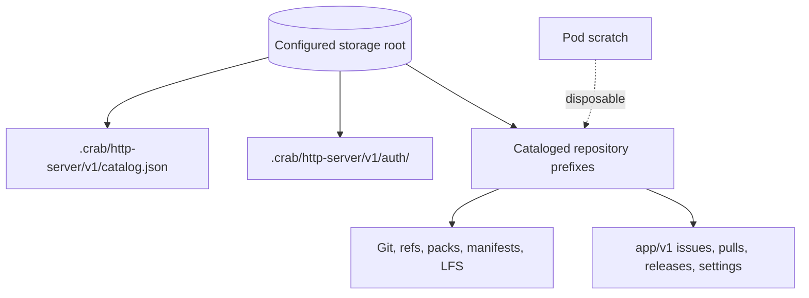

# Operate a Crab team deployment

This runbook covers preflight checks, rollouts, rollback, secret rotation, incident triage, and restore qualification for `crab-http-server`. Use it with the Kubernetes chart. Provider infrastructure and identity remain owned by your platform team.

> The deployment assets don’t complete production qualification. Record live evidence for every gate in [Qualify a release](#qualify-a-release).

## Know the state boundaries

Object storage is authoritative. Pods and their scratch volumes are disposable.



Protect the entire configured root as one recovery unit. Don’t restore only the catalog, only Git objects, or only the `app/v1` namespace.

## Run the preflight checks

Complete these checks before the first install and every infrastructure change:

1. Confirm bucket or container versioning and retention policies.
2. Confirm the workload identity grants access only below the configured root.
3. Confirm all replicas use the same provider, container, root prefix, OIDC client, public URL, and state key.
4. Confirm the OIDC provider accepts the exact `/auth/callback` redirect URI.
5. Confirm the ingress preserves the canonical `Host` header and streams bodies without buffering.
6. Confirm port 8789 has no Service, ingress, or public load-balancer listener.
7. Confirm the NetworkPolicy-capable CNI enforces the explicit public and monitoring source selectors.
8. Confirm the monitoring source can scrape port 8789 and ordinary peer pods cannot.
9. Confirm the cluster can schedule two replicas in separate zones.
10. Confirm scratch capacity covers the largest qualified pack, LFS object, and concurrent transfers.

Render and validate the release before applying it:

```sh
helm lint crates/crab-http-server/deploy/helm/crab-http-server \
  --strict --values /secure/crab-http-server-values.yaml
helm template crab-http-server \
  crates/crab-http-server/deploy/helm/crab-http-server \
  --namespace crab --values /secure/crab-http-server-values.yaml \
  > /secure/crab-http-server-rendered.yaml
```

Review the rendered image digest, Service ports, ServiceAccount, NetworkPolicy, Secret name, storage URL, and ingress host. Keep the rendered file private because inline server configuration appears in it.

For an official image, verify GitHub provenance against the pinned digest and
the dedicated server release workflow:

```sh
gh attestation verify \
  oci://ghcr.io/crabbuild/crab-http-server@sha256:qualified_digest_here \
  --repo crabbuild/crab \
  --signer-workflow crabbuild/crab/.github/workflows/http-server-release.yml
```

Authenticate to GHCR first when the package is private. Also inspect the image
index and confirm that every architecture scheduled by the cluster is present.
Verify the OCI chart by its separately reported digest before installation:

```sh
gh attestation verify \
  oci://ghcr.io/crabbuild/charts/crab-http-server@sha256:qualified_chart_digest_here \
  --repo crabbuild/crab \
  --signer-workflow crabbuild/crab/.github/workflows/http-server-release.yml
```

## Deploy or upgrade

Use a rolling upgrade with the chart’s zero-unavailable strategy:

```sh
helm upgrade --install crab-http-server \
  crates/crab-http-server/deploy/helm/crab-http-server \
  --namespace crab --create-namespace \
  --values /secure/crab-http-server-values.yaml \
  --wait --timeout 15m
kubectl --namespace crab rollout status deployment/crab-http-server \
  --timeout=15m
```

The startup and readiness probes read the durable catalog. The liveness probe checks only whether the management process answers HTTP.

Verify each pod rather than relying on Deployment availability alone:

```sh
kubectl --namespace crab get pods \
  -l app.kubernetes.io/name=crab-http-server -o wide
kubectl --namespace crab logs deployment/crab-http-server \
  --all-pods=true --since=10m
kubectl --namespace crab exec deployment/crab-http-server -- \
  crab-http-server --config /etc/crab/http-server/server.toml repository list
```

## Observe requests and capacity

Each public response includes `x-request-id`. Its completion log records the same `request_id`, HTTP method, path, status, and elapsed milliseconds. Set `RUST_LOG` through `extraEnv` when you need a different tracing filter.

Monitor these platform and application signals:

| Signal | Investigate when |
| --- | --- |
| Ready replicas | Fewer than two pods remain ready |
| Restarts and termination reason | A pod restarts or exits without a planned rollout |
| CPU throttling | Sustained throttling precedes request latency or HPA growth |
| Scratch usage and eviction | Free scratch approaches the largest qualified concurrent workload |
| `crab_http_server_requests_total` and request duration | Error rate or tail duration changes from the recorded baseline |
| Response-body errors and aborts | A stream fails after headers or a client/proxy disconnects early |
| Admission available permits | A class remains saturated instead of returning to capacity |
| `crab_http_server_catalog_healthy` | Any pod reports `0` |
| `crab_http_server_catalog_refresh_failures_total` | The counter increases |
| `crab_http_server_receive_workers` | Workers remain after request traffic settles |
| `crab_http_server_draining` | A pod reports `1` outside a planned rollout |
| `repository catalog refresh failed` | Running pods stop discovering catalog changes |
| Publication or LFS transfer failures | A write may need client retry or operator outcome inspection |

Scrape `GET /metrics` on each pod's private management port. The chart can add
Prometheus pod annotations and a management-port NetworkPolicy rule for an
explicit monitoring source. Keep port 8789 absent from public Services and
ingress. Alert thresholds need a workload baseline; start with catalog health,
new catalog-refresh failures, sustained zero admission permits, response-body
errors, and unexpected drain state.

## Roll back a failed release

Stop a rollout when readiness fails, restarts grow, or live verification fails:

```sh
kubectl --namespace crab rollout pause deployment/crab-http-server
helm --namespace crab history crab-http-server
helm --namespace crab rollback crab-http-server previous_revision_here \
  --wait --timeout 15m
```

Replace `previous_revision_here` with a known-good Helm revision. Don’t roll back the storage root or catalog automatically: a newer process may have committed durable writes before rollback.

After rollback, verify repository listing, fetch, and one dedicated test-repository push. Inspect an uncertain push before repeating a destructive ref update.

## Rotate secrets

Rotate the OIDC client secret without changing the state key:

```sh
kubectl --namespace crab create secret generic crab-http-server \
  --from-file=oidc-client-secret=/secure/crab-http-server/oidc-client-secret \
  --from-file=state-key=/secure/crab-http-server/state-key \
  --dry-run=client -o yaml | kubectl apply -f -
helm upgrade crab-http-server \
  crates/crab-http-server/deploy/helm/crab-http-server \
  --namespace crab --values /secure/crab-http-server-values.yaml \
  --set-string rolloutToken="$(date -u +%Y%m%dT%H%M%SZ)" \
  --wait --timeout 15m
```

Verify a new sign-in after the rollout. Existing sessions remain valid because they use the durable state key and shared object-storage records.

Rotate the state key only for compromise recovery. That rotation invalidates browser sessions and in-flight sign-in transactions. Record the incident, replace the Secret, roll every pod, and require every member to sign in again.

## Respond to incidents

Start with the request ID, pod state, and readiness result:

```sh
kubectl --namespace crab get deployment,pods,events
kubectl --namespace crab logs deployment/crab-http-server \
  --all-pods=true --since=30m | grep 'request_id_from_response_here'
kubectl --namespace crab exec deployment/crab-http-server -- \
  crab-http-server --config /etc/crab/http-server/server.toml healthcheck
```

Use this triage map:

| Symptom | Likely boundary | First action |
| --- | --- | --- |
| Readiness returns 503 | Catalog access, provider credentials, or invalid catalog | Inspect readiness warnings and workload identity events |
| Public requests return 403 | Canonical host mismatch | Compare ingress host with `auth.public_url` and preserved `Host` |
| Browser requests return 401 | OIDC session or membership | Verify issuer, clock, shared state key, and stable provider subject |
| Git push disconnects | Ingress timeout, pod termination, or publication failure | Find the request ID, inspect logs, then compare the remote ref before retrying |
| Pod is evicted | Scratch or node pressure | Preserve object storage, increase scratch or node capacity, and requalify concurrency |
| New repository stays absent | Catalog refresh failure | Run `repository list`, inspect refresh warnings, and restart only after storage access works |
| Rollout never becomes available | Configuration, identity, or catalog failure | Read the failing pod termination message and `/readyz` warnings |

Don’t repair object storage by editing catalog JSON, ref markers, manifests, or coordination records directly. Use the repository administration commands or a reviewed recovery tool.

## Drain a deployment

Keep the chart's 630-second termination grace period. Kubernetes marks a
terminating endpoint non-ready, then the pre-stop hook keeps Crab serving for
15 seconds while Service and ingress routes converge. `SIGTERM` starts the
application drain after that delay, leaving more than the complete ten-minute
operation budget for Axum handlers, tracked publications, maintenance, and
repository runtime shutdown.

Before planned cluster or node maintenance:

1. Confirm at least two ready replicas.
2. Confirm the PodDisruptionBudget reports one allowed disruption.
3. Confirm endpoint and ingress deregistration complete during the pre-stop delay and connection-drain timeouts preserve active streams.
4. Replace one pod and complete a test fetch and push.
5. Continue one pod at a time.

AWS Fargate limits a container stop timeout to 120 seconds. The checked-in ECS profile cannot preserve Crab’s full ten-minute operation budget during task replacement. Treat Fargate as an evaluation profile until abrupt-crash and replacement qualification closes that gap.

## Qualify backup and restore

Enable provider-native versioning before writing repositories. Configure cross-region or cross-project copies according to your recovery point objective (RPO) and recovery time objective (RTO). Don’t apply the 24-hour authentication lifecycle rule outside `.crab/http-server/v1/auth/`.

Test restore without overwriting the active root:

1. Select one consistent provider backup or version timestamp.
2. Restore the complete configured root to a new isolated root prefix.
3. Create a separate configuration that points only to the restored root.
4. Start one isolated server with no public ingress.
5. Run `repository list` and compare every cataloged owner, name, and prefix.
6. Fetch every ref from representative repositories with an independent Git client.
7. Download and verify representative LFS objects, release assets, issues, pulls, and settings.
8. Record restored object counts, selected version, RPO, RTO, and failures.
9. Delete the isolated test only after retaining the evidence.

Crab has no point-in-time restore coordinator. Provider tooling must produce a consistent full-prefix view, and a live restore drill must prove it for your workload.

## Qualify a release

A team release needs Level 3 or higher evidence: a user action, a real durable side effect, and an independently visible result.

Record these gates against a dedicated storage root:

- Install two or more replicas across zones
- Complete OIDC login when callbacks can reach either replica
- Create a repository and observe it from every replica within five seconds
- Push and fetch branches and tags with an independent Git client
- Upload and download an LFS object larger than ingress buffering thresholds
- Replace one pod during fetch, push, and archive scenarios
- Upgrade and roll back one release without losing committed state
- Restore the complete root to an isolated prefix and repeat read verification
- Confirm the management listener is unreachable through Service, ingress, and peer pods
- Scrape every pod and exercise request, body-error, admission, catalog-health, and drain signals
- Confirm no static provider credential exists in Secret, ConfigMap, pod environment, or rendered manifests
- Verify the deployed image and chart digests, signer workflow, source commit, AMD64/ARM64 index, SBOM, and provenance

Static rendering, unit tests, and localhost RustFS tests don’t replace these gates. Keep the recorded evidence with the release decision.
