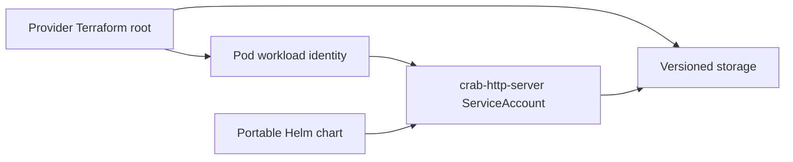

# Provision Crab storage and workload identity

These Terraform roots create dedicated versioned object storage and one workload identity for an existing EKS, GKE, or AKS cluster. They output the values needed by the portable Helm chart. They don’t create a Kubernetes cluster, ingress controller, DNS record, TLS certificate, container registry, or OIDC client.

## Choose one root

Each provider root owns the same boundary:



| Platform | Root | Creates |
| --- | --- | --- |
| EKS | `aws` | S3 bucket, lifecycle policy, IAM role, EKS Pod Identity association |
| GKE | `gcp` | GCS bucket, lifecycle policy, Google service account, workload identity binding |
| AKS | `azure` | Storage account, Blob container, lifecycle policy, managed identity, federated credential |

The modules create dedicated storage because GCS and Azure role assignments can’t enforce Crab’s full list contract at an arbitrary object prefix. The application still uses a nonempty `repositories` root inside that dedicated bucket or container.

## Prepare the existing cluster

Authenticate Terraform with an administrator identity that can create storage and workload identities. Meet the provider prerequisite before applying its root:

| Platform | Existing cluster requirement | Terraform input |
| --- | --- | --- |
| EKS | Install the EKS Pod Identity Agent | `cluster_name` |
| GKE | Enable Workload Identity Federation for GKE | `project_id` |
| AKS | Enable the OIDC issuer and workload identity | `aks_oidc_issuer_url` |

The Azure provider uses Microsoft Entra authentication for Storage operations and disables shared storage-account keys. The provisioning identity therefore needs both resource-management and Blob data-plane permissions.

## Apply the provider root

Copy the provider’s `terraform.tfvars.example` to a private `terraform.tfvars`, then replace every example value. Initialize and review the plan before applying it:

```sh
terraform -chdir=crates/crab-http-server/deploy/terraform/aws init
terraform -chdir=crates/crab-http-server/deploy/terraform/aws plan
terraform -chdir=crates/crab-http-server/deploy/terraform/aws apply
```

Replace `aws` with `gcp` or `azure`. Store Terraform state in your organization’s encrypted remote backend with state locking and restricted access. The checked-in roots intentionally omit a backend block so each team can use its existing state platform.

## Transfer outputs to Helm

Read the provider outputs after apply:

```sh
terraform -chdir=crates/crab-http-server/deploy/terraform/aws output
```

Copy `storage_url` into `config.content.storage.url` in the matching Helm values file. Copy the identity outputs into these chart values:

| Platform | Terraform output | Helm value |
| --- | --- | --- |
| EKS | `service_account_name` | `serviceAccount.name` |
| GKE | `gcp_service_account_email` | `serviceAccount.annotations.iam.gke.io/gcp-service-account` |
| AKS | `managed_identity_client_id` | `serviceAccount.annotations.azure.workload.identity/client-id` |

The EKS association uses the namespace and ServiceAccount name directly, so EKS needs no annotation. AKS also requires the provider example’s `azure.workload.identity/use: "true"` pod label.

## Preserve the storage boundary

The roots disable force deletion and enable object versioning. Don’t remove versioning, public-access protection, encryption, or provider-native identity to shorten setup.

The 24-hour lifecycle rule applies only to `repositories/.crab/http-server/v1/auth/`. It removes expired login flows, sessions, and Git-token records. It never covers the catalog or repository prefixes.

Terraform state doesn’t contain the OIDC client secret or Crab state key. Create those inputs through your secret-management system and follow [the Kubernetes deployment guide](../helm/crab-http-server/README.md).
