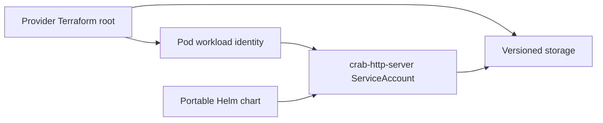

# Provision Crab storage and workload identity

These Terraform roots create dedicated versioned object storage and one workload identity for an existing EKS, GKE, or AKS cluster. They output the values needed by the portable Helm chart. They don’t create a Kubernetes cluster, ingress controller, DNS record, TLS certificate, container registry, or OIDC client.

## Choose one root

Each provider root owns the same boundary:



| Platform | Root | Creates |
| --- | --- | --- |
| EKS | `aws` | S3 bucket, lifecycle policy, IAM role, EKS Pod Identity association |
| GKE | `gcp` | GCS bucket, lifecycle policy, Google service account, workload identity binding |
| AKS | `azure` | Storage account, Blob container, lifecycle policy, managed identity, federated credential |

The modules create dedicated storage because GCS and Azure role assignments can’t enforce Crab’s full list contract at an arbitrary object prefix. The application still uses a nonempty `repositories` root inside that dedicated bucket or container.

The runtime identities contain data-plane permissions only:

| Platform | Runtime grant | Boundary |
| --- | --- | --- |
| EKS | `ListBucket` plus object read, write, delete, and multipart abort | Listing is restricted to the configured application prefix; object actions are restricted to its objects |
| GKE | `roles/storage.objectUser` | Dedicated bucket |
| AKS | `Storage Blob Data Contributor` | Dedicated container |

The S3 bucket policy rejects non-AWS-service requests made without TLS. Azure
Storage likewise requires HTTPS. Storage data remains private to authorized
provider identities even when a public provider endpoint is reachable.

Crab's S3 client keeps multipart part identifiers in memory and sends them when
completing or aborting an upload. The EKS role therefore does not grant
bucket-wide multipart-upload listing or part listing. Abandoned uploads are
bounded by the provider lifecycle rule instead of a broader runtime
permission.

## Prepare the existing cluster

Authenticate Terraform with an administrator identity that can create storage and workload identities. Meet the provider prerequisite before applying its root:

| Platform | Existing cluster requirement | Terraform input |
| --- | --- | --- |
| EKS | Install the EKS Pod Identity Agent | `cluster_name` |
| GKE | Enable Workload Identity Federation for GKE; enable the metadata server on Standard node pools | `project_id`, `gke_cluster_mode` |
| AKS | Enable the OIDC issuer and workload identity | `aks_oidc_issuer_url` |

The Azure provider uses Microsoft Entra authentication for Storage operations and disables shared storage-account keys. The provisioning identity therefore needs both resource-management and Blob data-plane permissions.

## Apply the provider root

Copy the provider’s `terraform.tfvars.example` to a private `terraform.tfvars`, then replace every example value. Initialize and review the plan before applying it:

```sh
terraform -chdir=crates/crab-http-server/deploy/terraform/aws init
terraform -chdir=crates/crab-http-server/deploy/terraform/aws test
terraform -chdir=crates/crab-http-server/deploy/terraform/aws plan
terraform -chdir=crates/crab-http-server/deploy/terraform/aws apply
```

Replace `aws` with `gcp` or `azure`. Store Terraform state in your organization’s encrypted remote backend with state locking and restricted access. The checked-in roots intentionally omit a backend block so each team can use its existing state platform.

Set `gke_cluster_mode` to `standard` or `autopilot`. The generated Standard
overlay selects nodes labeled `iam.gke.io/gke-metadata-server-enabled=true`, as
required for GKE Standard workloads using the metadata server. The Autopilot
overlay omits that selector because Autopilot enables the metadata server on
every node and rejects the Standard-only selector.

The AWS and GCP tests use mocked providers to prove the recovery-version and
incomplete-multipart lifecycle values without contacting a cloud account.

## Transfer outputs to Helm

Write the generated, non-secret provider overlay after apply:

```sh
terraform -chdir=crates/crab-http-server/deploy/terraform/aws \
  output -raw helm_values > /secure/crab-provider-values.yaml
```

Replace `aws` with `gcp` or `azure`. The overlay already contains
`config.storageUrl`, the Kubernetes ServiceAccount name, and the provider's
required identity annotation, label, or region environment. It contains no
credential or application secret. Combine it with the provider-neutral team
overlay from the Kubernetes guide.

Individual outputs remain available for existing infrastructure pipelines:

| Platform | Terraform output | Helm value |
| --- | --- | --- |
| EKS, GKE, AKS | `storage_url` | `config.storageUrl` |
| EKS | `service_account_name` | `serviceAccount.name` |
| GKE | `gcp_service_account_email` | `serviceAccount.annotations.iam.gke.io/gcp-service-account` |
| GKE | `gke_node_selector` | `nodeSelector` |
| AKS | `managed_identity_client_id` | `serviceAccount.annotations.azure.workload.identity/client-id` |

The EKS association uses the namespace and ServiceAccount name directly, so EKS needs no annotation. AKS also requires the provider example’s `azure.workload.identity/use: "true"` pod label.
The GKE output also includes the mode-correct `nodeSelector`; keep it with the
provider overlay so the Deployment and Helm catalog test use the same identity
path.

## Preserve the storage boundary

The roots disable force deletion and enable object versioning. Don’t remove versioning, public-access protection, encryption, or provider-native identity to shorten setup.

The 24-hour lifecycle rule applies only to
`repositories/.crab/http-server/v1/auth/`. It removes expired login flows,
sessions, Git-token records, and any unique storage-preflight object left when
a process dies between its write and delete. The maximum active identity
lifetime is eight hours, so this rule never expires a valid session.

S3 and GCS also retain noncurrent versions below the complete Crab root for 90
days by default. Set `recovery_version_retention_days` from 30 through 3650 to
match the organization’s recovery and compliance window. Their lifecycle
contracts measure from the time a version becomes noncurrent. They also abort
incomplete multipart uploads after one day, well beyond Crab’s maximum
operation duration.

Azure Blob lifecycle exposes version age from creation, not age since a version
became noncurrent. The Azure root therefore does not automatically expire
repository versions: applying the same numeric policy could remove an old
object’s previous value immediately after its first update. Use storage cost
alerts and a separately tested, version-aware backup policy until Azure can
express the same safe boundary.

Lifecycle expiration is not a backup. Before reducing retention, prove a
version-selected restore into an isolated root and retain longer-term backups
outside the application account when policy requires them.

Terraform state doesn’t contain the OIDC client secret or Crab state key. Create those inputs through your secret-management system and follow [the Kubernetes deployment guide](../helm/crab-http-server/README.md).
