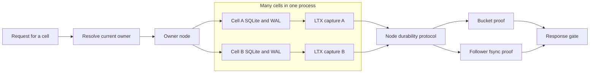

# Celld architecture and Rust integration

[Design index](README.md) · Proposed architecture; not implemented.

## Per-cell SQLite in Celld

The reference is Celld commit
`10cb1303dac710dcb3b557e318e08c855261f68b`. A node hosts many cells. Each cell has
its own SQLite state and activation epoch; the node provides routing, lifecycle,
replication scheduling, and durability gating around those databases. Crab maps
that cell boundary to the stable repository UUID.



`celld-ltx` manages WAL capture, segment encoding, restore and compaction. Its
caller supplies the broader acknowledgement and ownership protocol. An LTX file
describes database pages and transaction coverage; it does not grant authority
to execute a cell. See the [library boundary and provenance](https://github.com/denoland/celld/blob/10cb1303dac710dcb3b557e318e08c855261f68b/crates/ltx/README.md).

Celld can acknowledge through bucket durability or through a node-log ensemble
whose followers fsync the write. In its default fleet mode, object-store upload
can follow acknowledgement. Takeover therefore seals/reconciles the predecessor
node log before restore. Epoch prefixes isolate stale writes, while the response
gate and recovery protocol establish which results survive. See the
[pinned durability and takeover contract](https://github.com/denoland/celld/blob/10cb1303dac710dcb3b557e318e08c855261f68b/docs/guarantees.md).

### Mapping Celld to repository AppCells

| Boundary | Celld reference | Proposed Crab design |
| --- | --- | --- |
| Isolation unit | Application cell | Catalog repository UUID |
| Process | Many cell runtimes and databases | Many AppCell actors and databases alongside existing Git runtime |
| SQLite replication | Embedded `celld-ltx` with managed WAL lifecycle | Approved Rust capture/codec/restore integration in `crab-ltx` |
| Ownership | Conditional owner record and activation epoch | Single `control.json` containing owner, epoch and exact published head |
| Acknowledgement | Bucket or follower durability proof and response gate | Immutable graph upload followed by head CAS before success |
| Restore | Epoch-chain recovery, including predecessor node-log recovery where needed | Only the exact graph named by control; full restore and activation snapshot |
| Advanced I/O | Paging, compaction and node bundles | Full local working database; paging and bundles deferred |
| Placement | Owner routing, capacity checks, hibernated-cell balancing | On-demand acquisition first; bounded idle handoff and later rebalance |

Crab's combined owner/head CAS is a new protocol decision. Borrowing Celld's WAL
mechanics does not make Celld's acknowledgement or restore rules interchangeable
with it. The [publication ordering proof](storage-protocol.md#why-takeover-cannot-lose-a-published-commit)
must hold independently. Follower selection is outside Crab's first release;
adding it would change the promise that every acknowledged mutation survives
loss of all HTTP-node disks.

Celld's pinned peer transport uses fleet HMAC authentication over private HTTP;
network encryption is supplied externally. Crab proposes mutual TLS on its
dedicated peer listener. These are different transport contracts, described in
[Celld's limitations](https://github.com/denoland/celld/blob/10cb1303dac710dcb3b557e318e08c855261f68b/docs/limitations.md)
and [Crab's internal protocol](routing-and-security.md#internal-protocol).

## Rust integration and dependency strategy

### What to adopt from Celld

Celld separates its in-process LTX machinery from the surrounding ownership and
response durability protocol. Its replication library captures committed WAL,
provides restore and compaction machinery, and supports additional paging and
bundle paths. The distinction is explicit in the
[pinned LTX README](https://github.com/denoland/celld/blob/10cb1303dac710dcb3b557e318e08c855261f68b/crates/ltx/README.md).

Crab adopts that separation. It defines its own bucket-published control graph
and excludes fleet durability and node-log recovery from the first version.
Celld's [guarantees](https://github.com/denoland/celld/blob/10cb1303dac710dcb3b557e318e08c855261f68b/docs/guarantees.md) are design input, not proof
that a partial port inherits Celld's guarantees.

The inspected Celld revision is
`10cb1303dac710dcb3b557e318e08c855261f68b`. Implementation must record the exact
approved imported revision, licenses, local changes, and enabled format features.
Do not depend on a floating `main` branch.

### Dependency constraints

| Dependency | Crab workspace at baseline | Inspected Celld workspace | Required action |
| --- | --- | --- | --- |
| `rusqlite` | 0.34 with bundled SQLite | 0.31 | Align the port with Crab and verify SQLite linkage |
| `object_store` | 0.14.1 | 0.12 | Integrate through the existing Crab store contract |
| `celld-ltx` package | Absent | 0.0.0, `publish = false` | Treat as source integration, not a stable published dependency |
| SQLite hooks | Not enabled for this server | Used by the replication implementation | Review feature impact across the workspace |

Sources: [Crab workspace manifest](../../../Cargo.toml),
[pinned Celld manifest](https://github.com/denoland/celld/blob/10cb1303dac710dcb3b557e318e08c855261f68b/Cargo.toml),
and [LTX manifest](https://github.com/denoland/celld/blob/10cb1303dac710dcb3b557e318e08c855261f68b/crates/ltx/Cargo.toml).

Source vendoring, overrides, or dependency patches require the repository's
explicit approval process at implementation time. This document imports no
dependency and changes no lockfile.

The official Litestream Go embedding API is described as unstable and has
SQLite driver integration constraints. It does not supply a Rust-native
implementation by linking a Go library into this process.
[Litestream Go library documentation](https://litestream.io/guides/go-library/)

`ltx-rs` is a candidate file-format building block; its advertised scope is the
LTX format. A codec alone does not supply WAL lifecycle, durable acknowledgement,
or ownership transfer. [ltx-rs repository](https://github.com/superfly/ltx-rs)

### Code ownership

Introduce `crates/crab-ltx` only as a bounded owner of actual replication
mechanics. Keep HTTP routing, repository policy and AppCell placement inside
`crab-http-server`.

```text
crates/crab-ltx/
  WAL capture and checkpoint coordination
  LTX encode/decode and checksums
  exact-position restore
  snapshot and compaction mechanics
  narrow replication storage boundary

crates/crab-http-server/src/
  cells.rs             activation and runtime ownership
  cells/control.rs     control-record transitions and publication proof
  cells/database.rs    SQL executor, schema and domain transaction boundary
  cells/replication.rs commit-to-LTX publication coordination
  peer.rs              authenticated internal transport and route dispatch
  existing domains     issue/PR/release behavior and SQL queries

crates/crab-storage/
  provider clients, paths, conditional writes, error contracts

crates/crab-remote/ + crates/crab-write/
  canonical Git publication and recovery mechanics
```

This is an ownership map, not a requirement to create empty files or forwarding
wrappers. A module is extracted when the implemented boundary pays for itself.
Wire types remain crate-private unless another actual consumer needs them.

### Interface shape

Conceptual Rust signatures, not upstream Celld APIs or compiling implementation:

```rust
struct RepositoryCellId(Uuid);

struct PublishedPosition {
    generation: Uuid,
    epoch: u64,
    txid: u64,
    database_checksum: u64,
    app_revision: u64,
    manifest_digest: [u8; 32],
}

impl AppCellManager {
    async fn execute(
        &self,
        repository: RepositoryCellId,
        principal: AuthorizedPrincipal,
        command: AppCommand,
        deadline: Instant,
    ) -> Result<AppResponse>;
}

impl ReplicatedDatabase {
    fn transact(&mut self, command: AppCommand) -> Result<LocalCommit>;
    fn capture(&mut self, commit: &LocalCommit) -> Result<CapturedBatch>;
}
```

Handlers cannot obtain raw writable SQL connections. They cannot construct a
`PublishedPosition` as proof. Only the publication coordinator produces durable
results. Local transaction results are internal values that cannot accidentally
implement the public response conversion.
