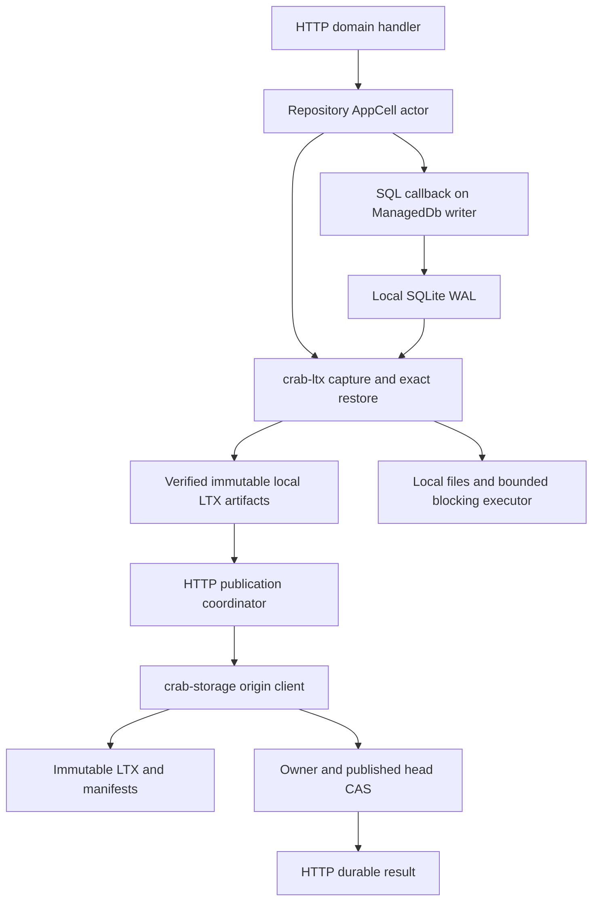
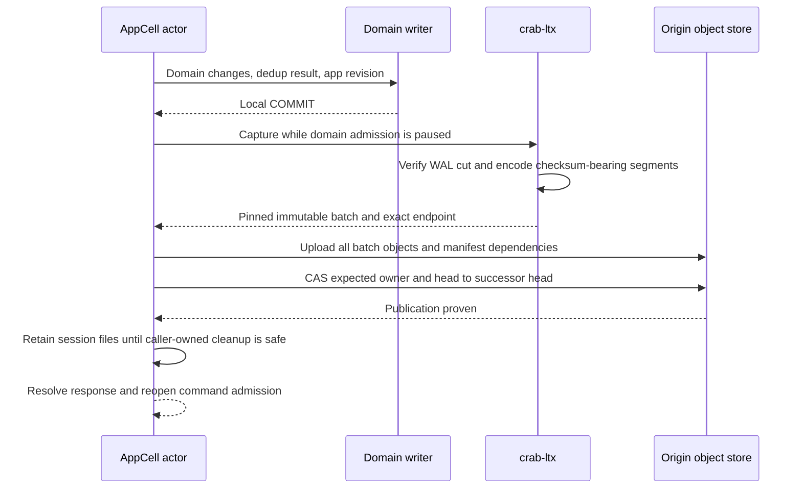

# crab-ltx: reuse of Celld's SQLite replication engine

[Design index](README.md) · Local/remote library and issue/comment/label/status/check/settings HTTP integration implemented.

[crab-ltx](../../crab-ltx/README.md) now implements the embedded local SQLite
WAL-to-LTX mechanics and optional `replica` transport/paged reads. The Cargo member contains a pinned, modified source
integration of `celld-ltx`, not a Git dependency or separate daemon.
The HTTP server consumes it through `crab-cell-runtime`: repository issue,
comment, label, commit-status, check-run, repository-policy, Pull and Release
commands publish LTX before success, cold activation restores the exact
published root, and public routes use the owner-aware typed client. Fleet-scale
performance and process/network fault qualification remain delivery work.

## Implemented state

| Boundary | Current state |
| --- | --- |
| SQLite lifecycle | `ManagedDb` owns three connections and a serialized transaction callback; WAL read-lock and managed checkpoints retained |
| Capture | Checksum-bearing sized-block LTX, all cuts returned; SQLite WAL-hook frame boundary checked before checkpointing |
| Snapshot | Full local snapshot plus ownership of every newly generated capture cut |
| Restore | Explicit snapshot-plus-deltas plan; exact ranges/digests/checksums; owned verified bytes; new-file installation |
| Compaction | Full snapshots and selected-body delta ranges; exact reduced bytes and replacement indexed state verified; bounded eight-input Cell level scheduling plus pressure-triggered full replacement |
| Remote replication (`replica` feature) | Existing `crab-storage` transport; immutable LTX/index/manifest objects; conditional epoch-head publication |
| Remote recovery/compaction | Pinned cross-epoch inheritance, exact restore/resume, bundle locations and compaction guarded by head CAS |
| Paged SQL | Authenticated immutable views and writable sparse activation; incremental hydration, bounded range read-ahead |
| Failure/retention | Capture failure fences the handle; fresh-directory reactivation; exact batch/head pruning reverifies local bytes before deleting and releasing admission accounting |
| Host facilities | Injectable filesystem/base VFS/clock/executor; shared page-fault worker/cache and I/O/job/recovery/dirty concurrency budgets; one-MiB full-job scratch permits; temporary reservations follow cancelled jobs but are removed from returned long-lived handles |
| Server wiring | All repository collaboration metadata, owner/control publication, scheduled owner-bound compaction, exact local-cut pruning, local/remote/idle/stale-owner routing, public HTTP response gating and source-loss restore are wired; immutable Release asset bodies remain object data by design |

Source and usage: [crate README](../../crab-ltx/README.md),
[public API](../../crab-ltx/src/lib.rs),
[import inventory/notices](../../crab-ltx/UPSTREAM.md).
Local proof includes real SQLite, process kill followed by source-directory loss,
independent CRC/format vectors and exact snapshot/compaction comparison. It does
not qualify the multi-node server. A separate real RustFS library round trip
exercises upload/head publication, source loss, paged SQL and remote compaction.

### Remote library versus HTTP authority

The optional `Replica` is an exact-plan orchestration layer, not a repository
actor or lease service. It verifies new cuts against an authenticated predecessor
page map (reused by live receipts, rebuilt from indexes after restart), uploads
content-addressed LTX and authenticated page indexes, persists an immutable
manifest, then conditionally changes a per-epoch head. `ReplicaHead::manifest_digest()`
is the frozen recovery root; `open_exact()` reopens it without reading an
unfenced mutable head. Errors and cancellation require exact-head reconciliation.

This does **not** replace the combined owner/head CAS in
[storage-protocol.md](storage-protocol.md). The HTTP coordinator must pin/bind
the immutable manifest digest to its own authoritative control record before
releasing a response. Recovery uses that pinned root, never a former owner's
mutable epoch head. There is no independent lease acquisition or remote GC.

The library now supports both immutable views and writable sparse activation.
`PagedDatabase::open_writable` seeds the checksum index from authenticated page
metadata and continues the inherited TXID without downloading the full database.
`inherit` admits destination limits before I/O, verifies destination indexes and
referenced object sizes, and publishes the pinned parent without reading bodies.
Body corruption fails on authenticated page demand; full restore still verifies
the complete chain. This requires trusted publication metadata and object retention.
Foreground faults and owner-driven hydration share write/truncate bookkeeping;
capture/snapshot reads also use the VFS. Each frame is BLAKE3/CRC verified.
The existing full-restore server activation protocol remains a valid initial
policy; selecting sparse activation still requires HTTP admission/output-gate wiring.
See the [remote API, layout and limits](../../crab-ltx/README.md#object-store-replication-and-paged-sqlite).
The [functional parity matrix](../../crab-ltx/PARITY.md) records the latest
capabilities and intentional deviations from the pinned Celld implementation.

The server can now supply one `Host` throughout local resume, replica recovery,
and sparse activation. Its filesystem and SQLite base VFS must share a namespace;
the VFS registration must remain process-lifetime. The executor separates finite
blocking jobs from independently progressing, joined page-fault workers. Do not
queue those workers behind the SQL threads synchronously waiting for them.
Default hosts share bounded I/O/job/recovery concurrency; custom shared semaphores
set service-specific ceilings. Dispatched jobs retain admission after caller
cancellation. Views share a bounded page cache and I/O worker, not one thread each.
These hooks do not implement SQL admission, resident-database eviction, owner
timers, distributed fencing or a deterministic cluster simulator.

The requested capacity is 1K–10K active databases per node, 100–5,000 MB each,
with 1,000 TPS (aggregate per node assumed pending confirmation). This is a target,
not current qualification. The [scalability assessment](../../crab-ltx/SCALABILITY.md)
records measured regressions, current resource bounds and the required metadata,
streaming and node-level qualification work. Raising `Limits` alone is insufficient.

The [Celld comparison](celld-and-rust.md) explains the system-level differences.
This document owns the reusable crate boundary and the changes needed to meet
Crab's [publication protocol](storage-protocol.md),
[SQLite execution model](sqlite-and-data-model.md), and
[exact recovery contract](recovery-and-retention.md).

## Source integration decision

Use `denoland/celld`, commit
`10cb1303dac710dcb3b557e318e08c855261f68b`, subtree `crates/ltx`, as the initial
source baseline. Keep a manifest recording original paths, content hashes,
licenses and intentional changes. Follow-up upstream changes are reviewed
imports against that baseline, never automatic updates from a floating branch.

The upstream package is named `celld-ltx`, version `0.0.0`, with
`publish = false`. It is usable as source, but it is not a promised stable
crates.io dependency. A pinned Git dependency alone would not solve the SQLite
linkage and behavioral differences below. The chosen integration makes the
necessary changes in one owned crate; it does not keep an unmodified engine and
a second independent implementation of the same capture logic.

Retain the upstream module organization where it serves a used responsibility.
Import the transitive source closure for capture, encoding, restore and
compaction together, with available fixtures and provenance. Inventory omitted
modules explicitly so later maintainers can distinguish an intentional exclusion
from a missing file. No empty crate scaffolding lands before a working slice.

### Licensing and attribution

Crab and `celld-ltx` declare Apache-2.0. The Celld subtree also contains a
BSD-3-Clause notice for the ported `pierrec/lz4` block compressor. Source reuse
retains these notices and Celld's attribution to rustyriver, Litestream and LTX.
See the [upstream manifest](https://github.com/denoland/celld/blob/10cb1303dac710dcb3b557e318e08c855261f68b/crates/ltx/Cargo.toml),
[provenance](https://github.com/denoland/celld/blob/10cb1303dac710dcb3b557e318e08c855261f68b/crates/ltx/README.md),
[Apache license](https://github.com/denoland/celld/blob/10cb1303dac710dcb3b557e318e08c855261f68b/crates/ltx/LICENSE),
and [compressor notice](https://github.com/denoland/celld/blob/10cb1303dac710dcb3b557e318e08c855261f68b/crates/ltx/LICENSE.pierrec-lz4).

The import commit must:

- Include the applicable license texts and upstream attribution notices.
- Mark modified imported files as changed, preserving their original notices.
- Carry any applicable upstream NOTICE content into source and binary
  distributions; audit the actual imported subtree and dependencies.
- Include third-party notices with released binaries/container distributions,
  including the BSD notice when its code is included.
- Record the source revision and local changes in a crate-local provenance file.

The import and release packaging must satisfy the
[Apache redistribution conditions](https://www.apache.org/licenses/LICENSE-2.0)
and the applicable third-party notices.
Approval to reuse `celld-ltx` does not silently authorize unrelated dependency
patches or a change to Crab's storage guarantees.

## Ownership and dependency direction



| Responsibility | Owner |
| --- | --- |
| WAL parsing, read-lock connection, checkpoint barriers | `crab-ltx` |
| LTX codec, file checksums, rolling database checksum | `crab-ltx` |
| Apply an explicit verified segment plan to local scratch | `crab-ltx` |
| Snapshot and compact a fixed database position | `crab-ltx` |
| Exact epoch replica heads, immutable manifest roots, paged SQL | Optional `crab-ltx::Replica`; not HTTP ownership authority |
| Issue/PR SQL, request deduplication, application revision | HTTP domain/database layer |
| Generation, session, epoch, activation and route authority | HTTP AppCell/control layer |
| Choose and publish recovery manifests; release response barrier | HTTP publication coordinator |
| Provider credentials, conditional writes, immutable object transport | `crab-storage` through server composition |
| Remote retention roots, collection authorization and scheduling | HTTP maintenance layer |

The crate operates on local files and explicit recovery roots. It needs no HTTP server,
Git runtime, cloud credentials or repository catalog. It cannot return an HTTP
success, change a lease, select an owner, or pick the latest remote generation.
The server decides which recovery graph to fetch; `crab-ltx` verifies and applies
the given graph's artifacts. The optional replica handles its named remote graph
through `crab-storage`. Upload completion is a transport result,
separate from the server's control-CAS publication proof.

## Reuse map and required adaptations

The names in the upstream column are inspected symbols. The Crab column describes
the adaptation boundary; the implemented-state table above separates current
local mechanics from server work. These capabilities do not exist unchanged upstream.
All paths are relative to the pinned Celld repository.

| Upstream surface | Reuse and adaptation |
| --- | --- |
| `crates/ltx/src/db.rs`: `Db`, `open_with_host`, `sync`, `checkpoint`, `close` | Preserve managed connection/read-lock/checkpoint logic; expose exact captured artifacts and integrate checksum tracking |
| `crates/ltx/src/wal.rs`: WAL reader | Reuse frame parsing, commit cuts, salts and continuity checks |
| `crates/ltx/src/ltx.rs`, `codec.rs`, `lz4_block.rs` | Reuse format validation, CRC, frame/block codecs and page checksums; qualify checksum-bearing capture |
| `Db::snapshot_to_writer` | Reuse full-snapshot encoding; enforce frozen input and memory admission |
| `crates/ltx/src/compactor.rs`: `Compactor` | Reuse page merge and encoding against an explicit validated input set |
| `replica.rs`: `restore_from_plan_with_download_slots` and local apply helpers | Reference only; Crab implements local apply/install in `recovery.rs`, without copying discovery or transport |
| `host.rs`: `LtxHost`, `FileSystem` | Preserve useful filesystem/fault seams; connect blocking work to Crab's bounded executor |
| `replica.rs`: `Replica::sync`, `Replica::pos` | Ordered upload adapted to verified chains, immutable roots and conditional epoch heads; not HTTP publication authority |
| `client/mod.rs`: `ReplicaClient` | Existing `crab-storage` facade implements exact named transport; no listing or deletion in the recovery API |
| `client/object_store.rs`, `replica_url.rs` | Omit provider construction; Crab already owns storage and credentials |
| `replica_compactor.rs`, `compaction_level.rs` | Verified range/full compaction with head CAS and bounded monotonic scheduling; inputs retained |
| `paged.rs`, `paged_vfs.rs` | Authenticated immutable and writable sparse VFS, hydration and bounded verified read-ahead |
| `client/epochs.rs` | Explicit pinned parent and flattened origin locations; no listing-based authority |
| `bundle.rs`, `client/bundle.rs` | Checked CRB1 envelope and manifest-selected bundle ranges; no fallback after arbitrary transport errors |
| Celld node-log integration | Outside the LTX library and Crab's bucket-published durability contract |

Source entry points: [Db](https://github.com/denoland/celld/blob/10cb1303dac710dcb3b557e318e08c855261f68b/crates/ltx/src/db.rs),
[Replica and restore](https://github.com/denoland/celld/blob/10cb1303dac710dcb3b557e318e08c855261f68b/crates/ltx/src/replica.rs),
[ReplicaClient](https://github.com/denoland/celld/blob/10cb1303dac710dcb3b557e318e08c855261f68b/crates/ltx/src/client/mod.rs),
[codec entry points](https://github.com/denoland/celld/blob/10cb1303dac710dcb3b557e318e08c855261f68b/crates/ltx/src/ltx.rs),
and [compactor](https://github.com/denoland/celld/blob/10cb1303dac710dcb3b557e318e08c855261f68b/crates/ltx/src/compactor.rs).

### Dependency integration

| Contract | Integration requirement |
| --- | --- |
| SQLite | Use Crab's workspace `rusqlite` 0.34 and one `libsqlite3-sys`; upstream uses 0.31 |
| SQLite features | Existing workspace `bundled` only; no new `hooks` feature. A narrow SQLite FFI WAL callback carries per-writer commit observation |
| Object store | Existing Crab transport uses 0.14.1; upstream uses 0.12. Do not pass incompatible store trait objects or add a second credential stack |
| Async runtime | Use the existing Tokio runtime; synchronous SQLite and codec work stays off I/O workers |
| Codecs | Pin reused LZ4/CRC dependencies and qualify byte compatibility before changing versions |
| Default features | No cloud provider feature enabled by default in `crab-ltx` |
| Edition and errors | Integrate with Rust 2024, preserve source errors, replace reachable panics with typed failures |

The source baseline may require local changes beyond dependency version edits.
For example, restore semaphore acquisition and page-count conversions contain
`expect`, and some replica errors are formatted into strings. The imported
production path must meet Crab's cancellation and source-error rules without
discarding the WAL lifecycle invariants that motivated reuse.

Before the import is accepted, inspect `cargo tree` for SQLite linkage, duplicate
provider stacks and feature unification. Build affected existing SQLite consumers
such as staging, metadata local-index, cache, VFS and workflow in dedicated CI.
The implementation adds the workspace member/dependency and one `Cargo.lock` package
entry. Existing dependency versions are unchanged. Optional `replica` adds the
existing Tokio, serde, object-store and `crab-storage` dependencies; the default
local library remains runtime/provider-free. `cargo tree` resolves one `rusqlite` 0.34 and one
`libsqlite3-sys` 0.32. Broader consumers/platforms remain a CI qualification gate.

## Managed connection and capture lifecycle

Upstream `Db` owns a checkpoint/control connection and a separate connection
holding a long-running read transaction. The application's writer is another
connection. A loaded Crab cell therefore starts with at least three connections;
resource admission must budget all of them.

1. Acquire a recovering activation and restore its published predecessor, or
   initialize an explicitly new repository through provisioning.
2. Open managed replication connections before admitting application writes.
3. Apply and verify the connection factory's WAL, synchronous, timeout and
   foreign-key policy on each connection where applicable.
4. Execute domain SQL through `ManagedDb::transaction` on the bounded executor;
   do not open a second independent application-writer connection.
5. Establish the initial captured full snapshot and publish the activation.
6. Execute one domain mutation, then capture and publish it before another
   application command can observe tentative state.
7. On drain, settle accepted publication, close the application connection and
   managed capture handles, then release the owner through the server coordinator.

`Db::sync()` is synchronous capture and checkpoint work. `Replica::sync()` is
asynchronous upload work. Neither means that Crab's manifest head has published.
Celld's host calls into this machinery from its own replication runtime; see
[the host integration](https://github.com/denoland/celld/blob/10cb1303dac710dcb3b557e318e08c855261f68b/crates/celld/ltx_repl.rs).

Keep the managed read-lock and checkpoint sequence together during the import.
Disabling auto-checkpoint alone does not protect WAL reset windows. Preserve
salt changes, passive-checkpoint barriers, growth pages and truncate handling.
Every database opener must participate in the connection policy; an unmanaged
connection cannot issue a restart/truncate checkpoint independently.

Upstream reserves `_litestream_seq` and `_litestream_lock`, and uses them to
force WAL/control writes. Retain these names and their semantics in the imported
mechanics. Domain migrations may not delete or reinterpret them. Their writes
can advance LTX position without a new application revision; position accounting
must allow this rather than equating every LTX file with one user request.

The initial executor serializes application writes, capture and checkpointing
for one cell. Network upload runs asynchronously after capture. Lease renewal
and ownership reconciliation continue during that wait. A failed or cancelled
HTTP waiter does not close a database whose committed mutation still needs an
outcome. An activation that loses ownership stops new work and closes locally;
the replication library has no independent reacquisition loop.

## Capture results and checksum contract

There are three different checksums/identities:

| Value | Proves |
| --- | --- |
| BLAKE3 object digest | Identity of the immutable encoded bytes named by a manifest |
| LTX file CRC | Internal file integrity according to the format |
| Rolling page checksum | Database page state before/after applying a captured cut |

Upstream normal L0 capture sets `HEADER_FLAG_NO_CHECKSUM` and emits a zero
post-apply checksum. `Replica::sync()` can also advance its position with a zero
checksum. Those positions are unsuitable as Crab's `database_checksum` proof.
This is visible in [capture encoding](https://github.com/denoland/celld/blob/10cb1303dac710dcb3b557e318e08c855261f68b/crates/ltx/src/db.rs#L1447-L1531)
and [upload position handling](https://github.com/denoland/celld/blob/10cb1303dac710dcb3b557e318e08c855261f68b/crates/ltx/src/replica.rs#L211-L252).

The selected adaptation adds rolling checksum tracking at the existing capture
cut, while preserving the upstream file format and page checksum algorithm:

- Seed a per-page checksum index from the verified full snapshot.
- For each complete capture cut, replace the checksum contributions of changed
  pages, include database growth, and remove pages beyond a truncation boundary.
- Exclude SQLite's lock page according to the format. Preserve the checksum flag
  convention and page-number contribution used by upstream `checksum_page`.
- Write checksum-bearing LTX with the prior state's checksum and the new state
  checksum. A snapshot uses the format's snapshot rules for its initial value.
- Advance capture metadata only after the complete artifact has been written
  and verified. Index changes are staged until that cut succeeds.

Checkpoint housekeeping can produce additional cuts. The capture result includes
every segment needed to reach its endpoint, not merely the first file produced
by `Db::sync()`. The executor freezes that endpoint before producing the result.
The implemented WAL observer checks SQLite\'s committed frame count and WAL salts
before checkpoint/control writes. A damaged final commit cannot be credited as
an earlier valid prefix. Expected application revision is associated with the
frozen domain state; it is
not inferred from the count of frames or files.

A checksum index is disposable local state. Rebuild it from verified pages after
restore; do not trust a stale index from another activation. At 4 KiB pages, a
packed eight-byte checksum entry per page costs about 2 MiB per GiB of database,
on local SSD. Cell writable preparation now streams that file from authenticated
directory leaves in 64 KiB chunks. Capture keeps only changed entries resident,
updates the aggregate incrementally, then persists positional entries after its
LTX cut is durable. Any write/sync error fences the activation. Budget and
measure disk use and the changed-page overlay separately.

Qualification must compare incremental checksums with a full page checksum at
each generated cut, including repeated writes to one page, truncation, growth,
rollback and checkpoint-only writes. The existing `Db::crc64()` hashes database
bytes and performs a checkpoint; it is not a drop-in replacement for the rolling
page checksum. Capture cannot be enabled for application writes until this
adaptation passes. Source reuse does not justify publishing an unknown checksum.

### Implemented library API

The following signatures summarize callable crate APIs. Full types and a
compilable example live in the [crate README](../../crab-ltx/README.md).

```rust
impl ManagedDb {
    fn open(path: &Path, limits: Limits) -> Result<Self>;
    fn transaction<T>(
        &mut self,
        operation: impl FnOnce(&rusqlite::Transaction<'_>) -> rusqlite::Result<T>,
    ) -> Result<T>;
    fn capture(&mut self) -> Result<CaptureBatch>;
    fn snapshot(&mut self, destination: &Path) -> Result<(LocalSegment, CaptureBatch)>;
    fn close(self) -> Result<()>;
}

impl VerifiedLocalPlan {
    fn new(files: &[LocalSegment], target: Position, limits: Limits) -> Result<Self>;
}

fn restore_exact(plan: &VerifiedLocalPlan, destination: &Path) -> Result<Position>;
fn compact_exact(plan: &VerifiedLocalPlan, destination: &Path) -> Result<LocalSegment>;
```

`CaptureBatch` contains ordered segments and the final `Position`.
Each `SegmentInfo` carries its range, page size/count, before/after checksums,
encoded length and BLAKE3 digest. Files are caller-retained paths, not RAII pins:
dropping a descriptor never deletes an artifact. The server must protect the
session directory until publication and cleanup are resolved.

`LocalSegment::new` constructs an unverified selection from a local path and
manifest expectations. `VerifiedLocalPlan::new` verifies those inputs, exact
endpoint and each intermediate database checksum, then owns the input bytes.
It has no bucket URL, epoch inference, local-database fallback or latest option.
Only a full snapshot followed by contiguous, non-overlapping ranges is accepted.

`ManagedDb::open` atomically claims `.<filename>-crab-ltx` and refuses reuse.
After failure or owner replacement, restore into a fresh directory and start a
new epoch. SQL callbacks are trusted main-database application code; they cannot
change transaction control, pager policy, hooks, or the reserved control tables.

The server wraps these local facts with repository UUID, generation, owner
epoch and application revision. Only its publication coordinator constructs a
durable result after the control CAS. `ManagedDb` never accepts `AppCommand` or
returns `PublishedPosition`; those belong to the server composition layer.

## One mutation through the library



Example: published application revision 142 maps to epoch 19, LTX position 42.
An issue transaction records revision 143 and a durable request result. Capture
may emit positions 43 and 44 because managed checkpoint work also advances the
stream. The manifest covers both, with the final checksum for position 44 and
application revision 143. HTTP success waits for that entire graph's head CAS.

If ownership changes after upload but before CAS, the old coordinator fences
the actor; the unreferenced batch cannot enter the successor's recovery plan.
If CAS succeeds but the reply is lost, the server reconciles the control record
and durable request identity. `crab-ltx` retains the local artifacts until the
coordinator decides the outcome; it cannot label that error a rollback.

## Exact restore and snapshot reuse

The upstream convenience `restore(client, path, TXID(0))` selects the latest
available state through listings. Even a nonzero target does not supply Crab's
manifest identity, object digests, or epoch binding. Do not call it over an
unrestricted bucket prefix for production recovery.

The upstream explicit-plan restore informed the local contract. Crab now owns
its explicit apply/install implementation in `recovery.rs`, using the imported
codec with the following server/library division:

1. Server acquires a recovering activation and reads the inherited manifest.
2. Server validates repository/generation scope, pins that root and fetches only
   the named objects through the origin store, under shared request/byte budgets.
3. Library validates the explicit local plan, including object digests, format,
   page size/count, exact endpoint and allowed contiguous coverage.
4. Library applies snapshot/deltas to isolated scratch, verifies each cut's
   checksum, truncates to the committed page count and installs atomically with
   required file/directory synchronization. Existing destinations are rejected.
5. Server verifies SQL integrity, foreign keys, schema and repository identity.
6. Server opens managed capture, creates and uploads a new-epoch full snapshot,
   and CASes the activation to serving before admitting application traffic.

Fresh managed control writes may change physical page checksums without changing
application revision. Verify the inherited endpoint before initialization, then
publish the new snapshot's actual endpoint explicitly. Never substitute the old
checksum merely because domain rows appear unchanged.

The published snapshot/segment range is exact. A compacted file extending beyond
the desired endpoint cannot be cut at an arbitrary TXID unless it preserves
enough history to reconstruct that cut. The manifest must name a reconstructible
endpoint, as required by [retention and backups](recovery-and-retention.md#backups-and-point-in-time-restore).

Upstream snapshots and full restore buffer substantial data; writing to a
`Write` parameter does not imply streaming memory usage. Its restore collects
downloaded files and reconstructs a database image in memory. Initially impose
admission limits for compressed inputs, decoded pages, image buffers and scratch,
plus a node-wide concurrency budget. The implemented `Limits` defaults are
256 MiB per database, 512 MiB per local file including WAL, 1 GiB aggregate
plan/retained artifacts and 1,024 segments. These are not RSS or disk quotas;
standalone plan verification/compaction retains input buffers, while Cell
compaction uses bounded memory plus local scratch. Aggregate capture accounting
can fail after local files have been installed. Reserve headroom.
The Cell checksum index is disk-backed and its ordinary capture path is
O(changed pages); truncation must additionally read the removed checksum suffix.
Standalone local capture still uses an in-memory dense base. Oversized cells
receive a clear capacity failure. Cell restore and compaction streaming are
implemented; measured 5 GB/low-disk qualification remains follow-up evidence,
not an assumed property.

## Compaction and cleanup

The standalone API uses the upstream-derived compactor on a verified snapshot
chain or exact contiguous delta span. `CellReplica::prepare_compaction` instead
acquires recovery admission, range-fetches and verifies every authenticated
index into caller-owned scratch, then externally merges one cursor per segment.
It streams every selected LTX range through its manifest BLAKE3, fetches selected
immutable frames in adjacent runs capped at 1 MiB, verifies frame and page
checksums, streams the replacement LTX and sidecar, and uploads them in 8 MiB
multipart ranges through the injected filesystem. It
rebuilds the final radix directory from original and replacement sidecars and
returns a representation-only `PreparedRoot`. The server publishes that root
with the unchanged application revision through the normal authority CAS; a
failed CAS leaves orphan immutable objects, not permission to delete inputs.
The optional standalone `Replica::compact` still implements its own upload and
epoch-head CAS. Neither API turns the standalone epoch head into HTTP authority.

Keep remote deletion out of the first crate API. Upstream `ReplicaClient`
includes listing, `delete_ltx_files` and `delete_all`; importing that entire
trait into production would expose capabilities the restore/capture caller does
not need. Server-side retention owns remote pins and deletion scope.

`ManagedDb::prune_published` removes only exact local artifacts named in a
published `ReplicaHead`, restoring local retention admission. Prune before
remote compaction removes those exact descriptors. In-flight cuts remain retained;
the managed cursor owns its WAL continuity proof independently of removed files.
Release of one publication pin does not mean
every segment can be deleted. Close all handles before removing a retired
activation's scratch, and scope removal to that activation's validated directory.

## Errors, cancellation, and observability

Expose typed failures for SQL, I/O, invalid WAL continuity, unsupported encoding,
checksum mismatch, missing input and resource exhaustion. Preserve underlying
errors and the bounded artifact/position context needed for diagnosis. HTTP
status mapping and transient retry decisions stay with the server boundary.

Local corruption does not authorize remote rollback. Helpers such as upstream
`reset_local_state` and `check_database_behind_replica` must not silently choose
a different recovery head. Fence the activation and restore the authoritative
graph through the normal server protocol. Corrupt published inputs fail closed.

Public metrics export is still server-integration work. Record capture/checkpoint
duration, captured segment bytes, pending local pins,
checksum-index size, snapshot peak memory, restore download/apply durations and
compaction input/output bytes. Keep uploaded and published positions in server
metrics distinct from the library's captured position.

## Implementation and qualification

| Slice | Required proof |
| --- | --- |
| Pinned import and notices | Source inventory, license texts, modified-file markers, dependency and production-path audit |
| Codec compatibility | Golden frame/block files, upstream/Crab decode agreement, corrupt/truncated/oversized file rejection |
| Managed capture | Real SQLite commits, rollback, WAL restart/salt change, passive-checkpoint races, growth and truncation |
| Rolling checksum adaptation | Full-page oracle matches every captured cut; altered predecessor/state rejected |
| Explicit restore | Named graph only; orphan/newer files ignored; missing segment or wrong endpoint rejected |
| Snapshot and compaction | Same logical state and checksum; exact endpoint; bounded memory and failed-install cleanup |
| HTTP publication integration | Kill after each boundary; response loss, takeover and disk loss preserve acknowledged outcomes |

The pinned Cargo manifest disables its library test target with `[lib] test =
false`. Do not interpret a green `cargo test -p celld-ltx` as executing a complete
replication suite. Inventory whatever tests/fixtures are available from the source
distribution and establish normal `crab-ltx` unit/integration targets with explicit
executed test counts. Celld's published fleet results are context, not evidence
that Crab's modified code passes.

The local real-SQLite round trip is implemented and tested, including kill of a
live writer process followed by deletion of its source directory and exact restore
from retained LTX. The optional library replica also exercises origin-store
publication, cold restore, paged SQL and remote compaction against real RustFS.
The next server slice binds that root to owner/control authority and proves
owner replacement with empty local disks through an HTTP mutation and reload. These remain
[delivery gates](validation-and-delivery.md), not outcomes of the local crate tests.

Run `cargo test -p crab-ltx --locked` with the worktree\'s external
`CARGO_TARGET_DIR`. See the [crate verification scope](../../crab-ltx/README.md#verification)
for the remaining interoperability, fuzz, fault, memory and platform gates.

Freeze the encoding capability, capture result shape and local retention rules
before writing production data. Upstream frame and block variants can share the
nominal LTX version, so format version alone is insufficient capability evidence.
Future upstream imports repeat codec, WAL lifecycle, checksum and crash tests,
with all intentional local patches checked for conflicts. Ownership and durability
changes require a separate protocol review even when an upstream update compiles.
