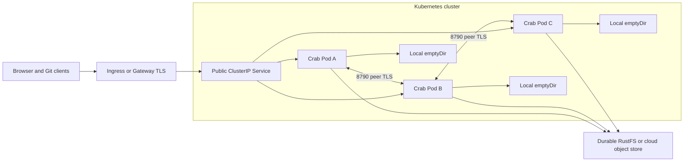
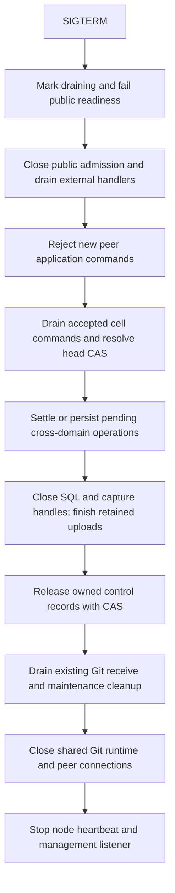

# Deployment, lifecycle, and operations

[Design index](README.md) · Target contract; implemented subset tracked in current implementation.

The fleet runs identical `crab-http-server` processes with embedded replication.
No separate Celld servers, scheduler service, or SQLite database servers are
required. Storage topology is provisioned independently. See
[load balancing](ownership-and-load-balancing.md) for placement policy and
[hard cutover](hard-cutover.md) for the initial transition from JSON storage.

## Kubernetes and other deployment environments

### Topology



| Environment | HTTP Pods | Purpose |
| --- | --- | --- |
| Local UI qualification | 1 | Full workflows and cold restore against real RustFS |
| HA integration | 2 | Wrong-node proxy, takeover, connection loss, response replay |
| Production starting topology | 3 across failure domains | Redundancy, capacity during rollout and node loss |

Three HTTP Pods are not a database quorum. Object-store publication establishes
durability. RustFS storage-node count, replication/erasure coding, disks and
failure domains are a separate deployment design. Three HTTP Pods using one
disposable RustFS disk do not provide durable HA.

### Deployment versus StatefulSet

Continue using the current Deployment. Each process has a fresh session UUID;
Pod UID and name are diagnostic identity, and the advertised Pod endpoint is
where peers connect. A container restart inside the same Pod still requires a
new session UUID. It must not reuse the old process's authority.

A StatefulSet is optional when stable DNS or warm-cache persistent volumes have
measured value. Neither stable naming nor a retained PVC grants ownership.
All reused data is validated against the published position before serving.
[Kubernetes StatefulSet contract](https://kubernetes.io/docs/concepts/workloads/controllers/statefulset/)

Ordinary Services distribute traffic among eligible endpoints. A Headless
Service exposes endpoints without selecting a repository owner. With Deployment
and advertised Pod IPs, Crab can use direct peer connections and avoid a Headless
Service entirely. With StatefulSet, per-Pod DNS can supply stable endpoint names.
[Kubernetes Service documentation](https://kubernetes.io/docs/concepts/services-networking/service/)

Do not proxy an owner-specific request back through the public ClusterIP Service.
Do not use client-IP affinity as the correctness mechanism.

### Public balancing, scale-out, and scale-in

The public Service may send any request to any ready Pod. It adds transport
capacity as soon as a new Pod is ready. Collaboration requests are then routed
to their AppCell owner over the direct peer endpoint. Git reads and ordinary
Git publication retain their existing any-node execution paths.

| Event | Immediate effect | AppCell effect |
| --- | --- | --- |
| Scale from three to five Pods | Two more public/peer entry nodes after readiness | New and released cells can acquire there; active owners stay put |
| One Pod enters drain | Public readiness fails; no new cell acquisitions | Accepted work settles; owned cells release in bounded groups |
| Owner crashes | Requests may briefly hit a stale route | Qualified takeover and exact restore; no move based only on TCP failure |
| One repository becomes write-hot | Its queue may fill despite low fleet CPU | Per-cell overload; more replicas do not add a second SQLite writer |
| Peer network is partitioned | Wrong-node requests may fail while owners renew | Diagnose peer access; public LB health cannot override ownership |

HPA changes process count, not cell assignment. It has no direct authority over
`control.json`. Establish a stable on-demand placement baseline before enabling
proactive rebalance. Then qualify scale-out convergence and scale-in recovery
load with [the balancing acceptance cases](validation-and-delivery.md#routing-and-balancing-qualification).
Use stabilization and bounded drain so a short workload trough does not evict a
large warm working set and trigger a restore burst on the next request.

Capacity planning includes losing the largest relevant failure domain, not just
one nominal replica. Three Pods do not by themselves prove that the remaining
Pods have sufficient SQLite, restore, Git-transfer or storage-request capacity.

### Listener and configuration

| Listener | Scope | Handler responsibility |
| --- | --- | --- |
| 8788 public | Public Service through configured edge | External auth/origin checks, UI/API/Git |
| 8789 management and peer, current | Authorized fleet identities and credentialed probes | Health/readiness, metrics and Cell dispatch on mandatory mTLS |
| 8790 peer, target split | Authorized fleet identities only | Cell dispatch and authenticated internal control |

The current binary accepts this exact shape. `peer_advertise` must be a root
HTTPS URL on `management_listen`; all filesystem paths must be absolute. The
certificate must be CA-trusted, valid for client and server authentication,
match the Ed25519 private key and cover the advertised host.

```toml
management_listen = "0.0.0.0:8789"

[cells]
data_dir = "/var/lib/crab/cells"
peer_advertise = "https://10.42.3.17:8789"
peer_certificate = "/run/secrets/crab-peer/tls.crt"
peer_private_key = "/run/secrets/crab-peer/tls.key"
peer_ca = "/run/secrets/crab-peer/ca.crt"
```

The target may split peer traffic onto 8790 after the Helm, probe and certificate
contracts are changed together. That is an operational isolation change, not a
second Cell protocol. Advertised address and trust material are necessary
distributed-process inputs; per-repository cloud credentials and a second
storage-root configuration are not. Keep algorithm tuning as documented internal
constants until operational evidence warrants public configuration.

Pod IP advertisement and TLS verification must agree. For IP endpoints, issue
appropriate IP SAN certificates or use a reviewed verifier that authenticates a
fleet workload identity independently of the dial address. Never disable
certificate verification to make Pod IPs work. A mesh may supply this transport
identity if the application trust boundary is explicitly configured and tested.

### Helm changes

Extend the existing chart with peer container port, runtime identity injection,
TLS Secret mounts and peer rules in its existing NetworkPolicy. Populate Pod
UID/IP using the Downward API;
the binary consumes those explicit process inputs through one documented path.
Kubernetes API watching and additional RBAC are unnecessary for initial routing.
Keep `automountServiceAccountToken: false` unless an independent workload identity
integration requires a scoped projected token.

For three production Pods, start with `replicaCount: 3`, PDB `minAvailable: 2`,
the existing `maxUnavailable: 0`/`maxSurge: 1`, and topology spreading across
available zones/nodes. Capacity must accommodate the surge and one unavailable
node. PDB protects supported voluntary disruption flows, not involuntary crashes
or every direct deletion.

Current defaults require at least two topology domains via `minDomains: 2` and
`DoNotSchedule`. A single-node local cluster needs an explicit local values
profile; simply reducing replicas can leave Pods Pending.

NetworkPolicy permits public traffic from the edge, peer traffic from Crab Pods
in the expected namespace, and probes from the supported cluster sources.
Egress permits DNS, identity provider and object storage, including required
credential endpoints. NetworkPolicy needs an enforcing CNI; it does not replace
TLS peer authentication.
[Kubernetes NetworkPolicy documentation](https://kubernetes.io/docs/concepts/services-networking/network-policies/)

### Readiness and termination

`/healthz` checks process health without requiring object storage. `/readyz`
checks bootstrap/catalog readiness, peer transport readiness, storage capability
qualification and global draining/fencing state. A Pod can be ready with zero
active cells. One corrupt or cold cell does not automatically remove the whole
node's Git and routing capacity.

Direct peer traffic can reach a Pod after public readiness is false. Peer
admission must therefore check draining and activation state itself; EndpointSlice
removal is not a drain protocol. Kubernetes removes unready endpoints from
ordinary Service traffic, but it does not revoke a cell's storage authority.
[Kubernetes probes](https://kubernetes.io/docs/concepts/workloads/pods/probes/)

Retain the chart's 630-second termination grace as an initial budget for Git/LFS
and durable workers. SIGTERM initiates application drain immediately. Avoid a
blind `preStop` sleep that consumes the budget without starting drain; any hook
must have a concrete lifecycle purpose. Kubernetes eventually sends SIGKILL
after its termination budget, so correctness must also survive abrupt exit.
[Kubernetes Pod termination](https://kubernetes.io/docs/concepts/workloads/pods/pod-lifecycle/#pod-termination)

The current chart has a 15-second sleep-only `preStop` hook and its qualification
script asserts that shape. During implementation, replace that hook with an
explicit drain trigger or remove it in favor of immediate SIGTERM handling;
update the corresponding lifecycle proof. A new hook may only invoke a real
authenticated management operation once implemented. Public EndpointSlice
removal and readiness changes cannot replace direct peer admission checks.

### Outside Kubernetes

The protocol also works under systemd, Compose and ECS with reachable peer
endpoints, workload identity/credentials, local writable scratch and a process
supervisor. Kubernetes Lease objects are not an additional owner authority.
Multi-cluster peers need explicit routing, trust and latency qualification;
replicas sharing an asynchronously copied bucket are not one linearizable fleet.

The existing [ECS Fargate evaluation profile](../deploy/ecs/README.md) has a shorter
stop timeout than the full server operation/drain budget. Preserve its documented
qualification limitation; the new cell protocol does not make an interrupted Git
or asset transfer complete successfully.

## Lifecycle, admission, and resource limits

### Startup

1. Parse and validate configuration and peer identity.
2. Build the existing provider-neutral store and load the catalog.
3. Run scoped storage capability probes before admitting cell operations.
4. Bind management/peer/public listeners with startup admission closed.
5. Publish the fresh node session and start its heartbeat.
6. Start the bounded cell manager, background scheduler and catalog refresh.
7. Make the node ready. Restore individual repositories on demand.

No startup path opens all 10,000 possible cataloged databases. Clean up only
scratch directories positively identified as owned by this subsystem and no
longer in use; do not recursively delete arbitrary configured paths.

Provisioning a new SQL-backed repository must distinguish it from an existing
catalog entry whose control object was lost. The create workflow allocates the
stable repository UUID, establishes an initial schema/snapshot/control record,
and only then publishes the catalog entry after the Git repository is ready.
If the final catalog CAS fails, the unlisted provisional cell can be reconciled
by that creation identity and collected later under scoped retention rules.
Adopting an existing repository inventories its application data and follows
migration rules. Absence of `control.json` for an already served SQL repository
is an error, never an instruction to create an empty replacement.

### Resource budgets

Budget each resource independently: public requests, peer requests, per-cell
mailbox, active SQL executors, restoring cells, open databases, outbound storage
requests, WAL bytes, captured-but-unpublished bytes, snapshot scratch, Git
transfers and compaction CPU.

Keep renewal and publication reconciliation schedulable even when normal
application queues are full. Separate network budgets prevent slow asset streams
from starving cell leases. A single hot repository must not use every SQL
executor or all restore slots.

Use weighted admission based on estimated disk requirement for restores and
snapshots. `emptyDir.sizeLimit` alone does not reserve node disk. Account for
Kubernetes ephemeral-storage requests/limits and eviction pressure.

### Shutdown ordering



Keep lease renewal alive until a cell's accepted work is settled and its owner
release is attempted. Release only the expected session/epoch; a late cleanup
must not remove a successor. If storage is unavailable, close/fence locally and
let ownership become eligible for takeover without claiming a successful release.

The exact interleaving must avoid deadlock: accepted cross-domain workers may
need to submit final SQL completion commands during drain. Close external cell
admission first, retain a private completion channel for already registered
workers, then close it only after those workers are settled. Closing every
mailbox before Git workers finish would strand outbox completion.

Existing `server.rs` cancels public and management listeners together. The new
runtime needs separate drain phases and tracked tasks; a single shared
cancellation token is insufficient to express the above order safely.

## Performance and capacity

### Latency model

For a warm owner mutation without batching:

```text
T_write ≈ queue + optional peer RTT + SQL/fsync + WAL capture
          + LTX upload + manifest publication objects + control CAS
          + bounded response work
```

For a warm SQL metadata read under the initial strong-read rule:

```text
T_read ≈ queue + optional peer RTT + indexed SQL + origin control read
```

SQLite removes many small JSON document requests, but a single isolated mutation
can become slower because it waits for remote durability and publication. The
design should be accepted for transactional correctness and measured end-to-end
performance, not an assumption that local SQL eliminates object-store latency.

### Throughput and batching

A single repository's mutation throughput is initially bounded by its sequential
publication cycle. Different repositories proceed concurrently. Adding Pods
helps many repositories; it does not parallelize one repository's writer.

Later group commit can capture several local transactions in one published
range. Every response waits for coverage, and reads/errors remain behind the
tentative-state barrier. Grouping changes request cancellation and failure
accounting, so introduce it only after the serial baseline is qualified.

Per-cell lease renewals cost approximately `active_cells / renewal_interval`
conditional updates per second, before mutation publications. With 1,000 active
cells and a 3-second renewal interval, that is about 333 renewal writes/second.
This is arithmetic, not a benchmark. Idle eviction and publication-as-renewal
reduce overhead; node-level liveness indirection may be a later optimization
only if it preserves the single-record publication fence.

### Disk and memory budgeting

```text
scratch_required ≈ working_SQLite + WAL + unpublished_LTX
                   + restore/snapshot_workspace + Git/LFS_transfer_scratch
                   + operational_headroom
```

Full restore followed by snapshot generation may temporarily need several times
the database size. Admission must reserve the whole operation's estimate, not
only its final SQLite file. Large Git repositories do not necessarily have large
collaboration databases, so track both sizes independently.

Bound SQLite page cache per loaded cell and total loaded cells per node. Account
for at least the application and replication connections and their file
descriptors. Persistent warm caches can reduce RTO but cannot replace the
published recovery graph.

### Evaluation targets

Measure p50/p95/p99 for warm reads, mutations, wrong-node requests and cold
activation. Report database size, changed pages, concurrency, object-store
latency, disk/fsync behavior, CPU limits and bandwidth with every result.

Start qualification at 10 populated repositories and extend to hundreds of idle
catalog entries with a small active working set. Evaluate a single hot repository,
many moderately active repositories, large check output, and bursty cold starts.
Choose SLOs from these measurements before enabling automatic scaling policies.

Do not scale only on CPU: SQL publication may be storage-latency-bound. Useful
signals include mailbox wait, admitted cell count, restore backlog, peer failures,
and disk pressure. Scale-down must allow cell drain and avoid mass cold restores.

## Observability and operations

### Metrics and traces

| Area | Signals |
| --- | --- |
| Routing | Local/peer dispatch counts, reroutes, stale hints, internal latency |
| Ownership | Active/recovering/fenced cells, takeover attempts, renewal age, CAS conflicts |
| Placement | Eligible candidates, resident versus owned counts, cold admissions/refusals, sample age, voluntary moves and restore cost |
| SQLite | Transaction latency, busy events, query duration, page-cache budget |
| Replication | Captured/uploaded/published revisions, unpublished bytes, WAL size, capture errors |
| Storage | Upload/manifest/CAS latency and failures, ambiguous outcomes, origin-read failures |
| Recovery | Download/apply/check/snapshot durations, bytes, failed dependency identity |
| Outbox | Pending age, reconciliation attempts, terminal conflicts, unresolved Git evidence |
| Resources | Queue depth, rejection count, open databases, executor saturation, scratch usage |
| Maintenance | Compaction bytes/coverage, pinned backups, collection candidates/deletions |

Use repository UUID in structured logs/traces when needed. Avoid putting all
repository UUIDs, user subjects or request IDs into unbounded metric labels.
Trace one request across entry, owner, SQL revision, LTX range, manifest digest,
control revision and Git operation ID where applicable.

Track three positions separately: local committed, captured/uploaded, and
published. Calling all of them "replication lag" hides the point at which a
request is blocked. Emit a clear fenced transition with the reason and expected
versus observed epoch/session, without secrets.

### Proposed operational commands

Extend the existing `storage-probe` command and startup preflight with the cell
contract checks; do not add a competing `storage diagnose` command. The following
repository storage commands are proposed interfaces, not currently available:

```text
crab-http-server --config ... repository storage inspect --owner team --name repo
crab-http-server --config ... repository storage migrate --owner team --name repo
crab-http-server --config ... repository storage verify --owner team --name repo
crab-http-server --config ... repository storage backup --owner team --name repo
crab-http-server --config ... repository storage restore --owner team --name repo --backup ID
```

`inspect` reports authority and bounded operational metadata, not raw session
credentials. `verify` downloads a pinned recovery graph to isolated scratch and
checks it without taking live write ownership. Mutation-oriented commands use
explicit repository scope and the same control protocol as the server.

### Runbook decisions

| Symptom | First checks | Correct response |
| --- | --- | --- |
| Repository stuck recovering | Control owner, dependency error, restore progress, disk capacity | Repair access/capacity or restore a verified backup; never initialize empty |
| Frequent owner movement | Renewal latency, CPU pauses, network policy, queue starvation | Correct resource/network causes before changing lease timing |
| Create timed out | Durable request identity and current owner | Retry original request and payload |
| Merge pending | Outbox state and canonical Git marker/receipt | Reconcile exact operation; do not force the ref |
| Pod Ready but cell fails | Per-cell corruption/version/owner status | Diagnose cell; Pod readiness is not per-repository health |
| Disk growing | WAL capture, unpublished segments, pin age, snapshot work | Stop admissions as needed; do not delete live WAL files |
| Old encoding blocks takeover | Fleet capabilities and writer policy | Deploy compatible reader or perform controlled format transition |
| New Pods serve requests but own few cells | Current active owners, idle eligibility, cold-acquisition counts | Allow demand/idle handoff; do not clear live owner records |
| Movement repeatedly reverses | Sample age, admission refusals, move cooldown, recovery load | Pause proactive movement and correct sampling/capacity; keep normal routing |
