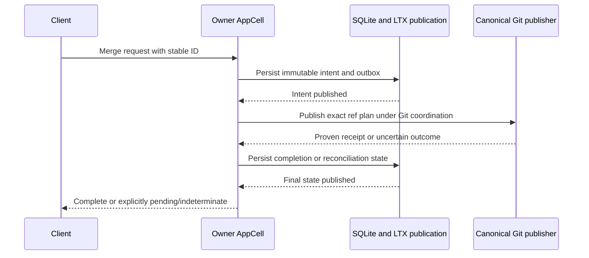

# Git and application workflows

[Design index](../NEXT_ARCHITECTURE.md) · Proposed architecture; not implemented.

These workflows combine [published SQL state](storage-protocol.md) with the
existing Git publication boundary. Their pending state lives in the
[relational outbox](sqlite-and-data-model.md#core-schema-example).
[Owner handoff](ownership-and-load-balancing.md#safe-idle-handoff) and shutdown
must preserve unresolved work until canonical Git evidence settles it.

## Git and application workflows

### Two commit domains

Never hold a SQLite transaction across Git I/O or an object-store await. The
outbox is a durable state machine, not a background task identifier in memory.

### PR merge intent

Persist the PR version, author identity, requested method, base/head refs, exact
base/head OIDs, intended commit OID, deterministic commit inputs, request hash,
and operation ID. Record the permission/policy/check context needed for
revalidation without treating its old values as permanent authorization.

Persist and publish the intent before Git effects. Reconstructible commit
objects may be regenerated from the pinned inputs; otherwise immutable prepared
artifacts must be retained and integrity-checked through completion. Referenced
Git inputs remain subject to existing Git retention and fence rules.

### Publication and recovery rules

Canonical Git ref locks and GC fences remain mandatory. Recheck current policy,
PR state, relevant approvals/checks, and exact ref plan at the supported
publication boundary. Reuse the existing implementations rather than adding a
SQLite-specific ref writer.

The outbox worker records any durable Git transaction identifier/receipt that
the shared publisher can expose. Inspect existing journal/marker evidence before
adding a new receipt. A new cross-crate receipt contract needs caller and sibling
proof, including native push, browser edits, branch operations and the remote
helper.

| Observed evidence | Recovery decision |
| --- | --- |
| Canonical receipt proves this exact plan committed | Complete SQL state even if a later valid push moved the ref again |
| Current ref equals intended new OID and required evidence validates it | Reconcile intended result; do not infer exclusive authorship from OID equality alone |
| Ref equals expected old OID and no uncertain prior publication remains | Retry the canonical plan under coordination and current authorization |
| Ref differs and evidence is inconclusive | Keep explicit reconciliation/conflict state; never overwrite the new ref |
| Publication call timed out | Resolve canonical commit evidence before deciding absent or retrying |

Checking only `ref == intended_new` is insufficient for historical attribution;
checking only `ref == expected_old` is insufficient after an ABA sequence. The
design must not label a completed merge as failed merely because a later push
advanced the branch. Qualification must include both scenarios.

### Owner loss during Git publication

An AppCell epoch fences SQL publication; it is not automatically a fence on the
existing Git journal. A worker that passed a policy check can pause and resume
after an AppCell takeover. Checking the epoch once before entering Git is not
enough to make the two systems atomic.

The initial contract makes a published merge intent durable pending work. The
new owner treats a `publishing`/uncertain operation as unresolved and reconciles
the same operation ID under existing Git coordination. It cannot terminally
cancel or replace that intent while an older publisher may still commit it.
Changes that invalidate the PR's active merge intent stay blocked until the
publication outcome is resolved.

Before enabling background failover execution, the Git implementation must prove
that canonical markers/leases can identify and settle that same operation. If
the current shared boundary cannot provide this evidence, keep the workflow
pending for operator recovery and treat automated saga failover as blocked.
Do not invent exactly-once Git effects from a SQL row alone.

Recovering an already proven Git result can finish bookkeeping without granting
new user authority. Initiating a previously unperformed Git effect must still
meet the current authorization policy; an expired or revoked originating
credential is not made valid by the outbox row. Keep such work explicitly blocked
until an authorized retry or operator decision resolves it.

Review/check timing continues to use the documented admission snapshot policy.
A stronger requirement that a later review revocation prevents an already
admitted publication would require an additional cross-path policy protocol.

### Release tags and assets

Release tag creation uses the same durable intent and ref-publication process.
Keep tag claims and release uniqueness in SQL, with exact Git tag identity and
canonical publication evidence in the outbox.

For asset uploads:

1. Obtain owner authorization and a bounded upload reservation tied to request
   identity, release version, asset name and permitted size.
2. Stream bytes using existing transfer admission, hashing and multipart cleanup.
3. Upload to an immutable object key with verified digest and size.
4. Ask the owner to atomically attach that verified reference to release metadata.
5. Publish the SQL change before reporting completed attachment.

If step 3 succeeds and attachment fails, the bytes are an orphan candidate, not
a visible asset. Retry the same upload identity. If attachment succeeds and its
response is lost, the published reservation/result resolves the duplicate.
Asset collection must honor active reservations and retained metadata backups.
