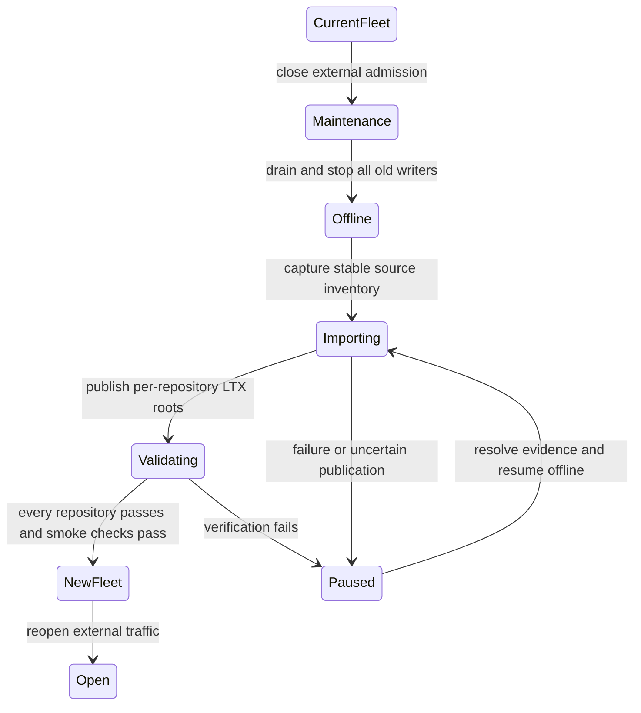

# Hard cutover and future upgrades

[Design index](README.md) · Target architecture; issue/comment/Label import slice implemented.

The transition imports the [current collaboration storage](current-implementation.md)
into the [repository SQL model](sqlite-and-data-model.md), then publishes each
database using the [LTX control protocol](storage-protocol.md).
[Acceptance gates](validation-and-delivery.md) must pass before reopening traffic.

## Hard cutover and future upgrades

### Accepted transition contract

Use one maintenance-window stop/import/verify/start transition for the deployment.
Downtime is acceptable. There is no requirement for an intermediate release,
legacy storage fallback, dual writing, mixed old/new HTTP servers, or transparent
rollback to the current architecture.

The new serving binary has one application storage implementation. The offline
importer is the only component that reads retired collaboration JSON for this
transition. Existing direct-CAS catalog, authentication and repository policy
records remain intentional authorities as defined in [data ownership](overview.md#storage-allocation); they are not
legacy fallback readers.

Hard cutover changes the deployment and compatibility requirements. It does not
authorize deleting existing repositories or application data. Import the existing
state and retain source evidence. Domain authorization, data identity and retry
guarantees still matter even though old runtime coexistence is unnecessary.

### Fleet cutover procedure

1. Close external admission and pause scheduled jobs or other writers that could
   affect the migration dataset. Drain HTTP mutations, asset attachments and
   retained Git publication/cleanup workers, then stop every old server process.
   Verify termination and prevent automatic rescheduling of the old deployment.
   A marker or ingress removal alone does not stop a paused writer.
2. Keep the new serving fleet stopped while importing. Establish a stable source
   inventory and backup, including catalog/policy and Git state needed to
   reconcile pending cross-domain operations. Pause other Git writers while
   establishing and verifying those cross-domain boundaries.
3. Inventory every repository's relevant `app/v1` trees, including request
   reservations, label/tag claims, counters, pending merges, output versions and
   tombstones. Record key, version/digest and semantic type in import evidence.
4. Validate schemas, identities, references and uniqueness. Preserve number gaps
   and incomplete but recoverable submissions. Import each repository in one SQL
   transaction, including outstanding product submission rows and verified
   allocation counters. Do not synthesize retained runtime `sys_requests` rows:
   those identify bounded execution attempts, not permanent browser submissions.
   Retained direct-CAS settings do not become a second SQL policy authority.
5. Run integrity and foreign-key checks; compare domain counts, sorted semantic
   digests, allocated counters, replay behavior and representative views.
6. Under the importer's exclusive cell activation, capture and upload the initial
   full LTX snapshot and recovery manifest. Publish its exact head through control
   CAS, then release the activation into `idle`. Persist the source inventory
   identity and published position so an interrupted import can resume safely.
7. Restore each imported repository independently from its published graph and
   verify it. Complete the full catalog's import checklist before enabling the
   new serving fleet. Per-repository imports are resumable units, not permission
   to run old and new storage backends side by side.
8. Start only the new binary and its matching embedded UI behind closed external
   admission. Run readiness, owner routing, permission and workflow smoke checks
   against the new architecture. No repository may initialize empty merely
   because its import or control record is missing.
9. Reopen external traffic after the entire deployment passes acceptance. Disable
   old deployment automation and retire its application storage runtime paths.
   Keep source JSON immutable for a documented evidence/backup retention period.

The per-repository control CAS establishes that repository's imported durable
head. Reopening traffic is the fleet's operational cutover point; there is no
claim of a multi-repository atomic object-store transaction. Partial completion
keeps the deployment in maintenance until imports are resolved and verified.

The release command `cells release activate --strategy maintenance` now performs
the new-fleet drain and the registry-supported Cell migration portion of this
transition. An operation-bound release CAS stops admission, every observing
server drains, zero-capacity heartbeats remain visible through runtime shutdown,
and the command waits for live or expired unfenced sessions to disappear. It
then claims an operation-keyed signed zero-capacity executor advertisement and
runs a local-only single-worker maintenance runtime. The singleton executor
sequentially restores and migrates every non-tombstoned catalog Cell, shuts that
runtime down, requires its lease to be the directory's only session, checks the
current inventory, publishes the exact Ready successor, and withdraws its ETag.
Lease loss aborts publication. It cannot prove termination of a legacy fleet that never
advertised into this directory. Persisted-work inventory and multi-domain or
unsupported-source transforms remain required for release changes that need
them; such a command fails and leaves the release in `maintenance`.

The current repository import command implements steps 3 through 7 for the
legacy `app/v1/issues` and `app/v1/labels` trees. It retains issue/comment/Label
sequences, all visible versions, Label deletion tombstones and incomplete
request reservations; records exact source object identity and body hashes;
verifies a second inventory; performs one SQLite bootstrap transaction;
publishes/restores the initial LTX root; and writes operation-bound completion
evidence. It refuses a live signed new Cell fleet.
That check does not observe legacy processes, so step 1's independent proof that
old processes and schedulers are stopped and lack write authority remains
mandatory. On exact completion it moves the repository catalog from
`import_required` to `cell_ready`; a different operation is rejected after that
transition. Public issue/comment/label routes are now native typed Cell consumers
and ignore legacy issue and label objects. Startup and catalog refresh reject any repository
that is not ready or lacks a published root, while request routing has no
bootstrap path. Other collaboration domains and the fleet-wide completion
checklist are not implemented.

An uncertain head publication requires rereading authority and matching import
evidence before retry. Do not start either server version as an automatic
response to an import error, or overwrite an already published import blindly.

### Requests and partially completed work

Existing request reservations sometimes contain a complete proposed domain
object even when its visible object was never created. Import the established
number, canonical payload digest, original display name and creation time into
the appropriate permanent repository submission table. If the visible object is
present, import both records and verify they agree. If it is absent, keep only
the reservation; the next matching retry inserts the reserved visible row in one
transaction. A mismatched retry returns a durable request conflict. It must not
allocate a new number or present an invisible reservation as already visible
content.

Pending PR merges and tag publications must be settled using canonical Git
evidence or imported as explicit reconciliation work. Do not drop them because
the corresponding UI list happens to look complete. Release assets need their
byte references, hashes, reservations and tombstone state preserved.

### Failure recovery

The planned transition is forward-only. An import failure keeps the deployment
offline while the importer is repaired or resumed from its evidence. An offline
abort back to the old deployment is an operator decision outside the automatic
workflow and requires invalidating all staged imports before any old writes
resume; a later attempt must inventory and import that changed source again.

After any new-architecture mutation, including a pre-opening smoke test, the old
JSON is stale. Recover through the new architecture's published LTX state,
verified backups or a corrected new binary. An export back to old JSON is not a
required deliverable, and retained source data is not a live secondary backend.

### Future schema and format upgrades

Record SQL schema version, migration checksum, manifest version, decoder
capabilities and minimum writer/reader generation. An incompatible node must
reject ownership before migrating or serving a cell.

For a new LTX encoding, deploy readers first, verify every takeover candidate,
then enable writers through durable capability policy. For SQL migrations,
use transactions, replicate the migration itself, and publish the new schema
only after its recovery graph is complete. Incompatible future SQL upgrades can
also use maintenance-window hard cutovers; no expand/contract compatibility layer
is required by this design. Reader-first rolling upgrades apply only when that
future version explicitly supports coexistence within the new architecture.

An unsupported decoder is an availability problem to diagnose, not a reason to
skip a segment, restore an older head or reinterpret unknown fields.
