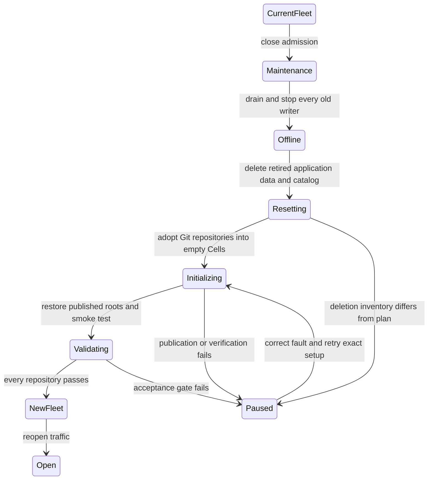

# Hard cutover and future upgrades

[Design index](README.md) · Forward-only empty-state cutover.

The transition intentionally discards existing collaboration application data,
creates a new [repository SQL model](sqlite-and-data-model.md) for every Git
repository, and publishes each empty database through the
[LTX control protocol](storage-protocol.md). The
[acceptance gates](validation-and-delivery.md) must pass before traffic reopens.

## Accepted transition contract

Use one maintenance-window stop/delete/initialize/verify/start transition for
the deployment. Downtime is acceptable. There is no intermediate compatibility
release, JSON importer, dual write, fallback reader, mixed old/new fleet or
automatic rollback.

The new binary has one application persistence path. Operators manually delete
the retired `app/v1` collaboration trees and old HTTP catalog while every old
writer is stopped. Git objects, refs, manifests, LFS objects, repository content,
authentication authorities and explicitly retained direct-CAS policy are not
part of that deletion. No old issue, pull, release, check, status, label,
comment, request ID, counter or tombstone is preserved.

This is a runtime contract:

- catalog schema v1 is rejected instead of silently upgraded;
- `repository create` and `repository adopt` both install a new empty repository
  Cell and publish its first LTX root;
- the catalog moves `empty_cell_pending → cell_ready` only after the published
  root restores and contains the exact repository UUID;
- startup and catalog refresh reject pending entries and missing roots;
- request routing never bootstraps a missing Cell; and
- no serving or maintenance path reads retired application JSON.

## Fleet cutover procedure

1. Remove external admission, pause scheduled work, drain accepted HTTP/Git
   mutations and stop every old process. Revoke its write credentials or prevent
   rescheduling. An ingress marker alone does not stop a paused writer.
2. Keep the new fleet stopped. Produce an explicit backup and deletion inventory.
   If rollback before deletion is required, verify the backup now.
3. Manually delete retired collaboration `app/v1` keys and
   `.crab/http-server/v1/catalog.json`. This removes release metadata and release
   asset bytes together with the other retired application data. The allowlist
   must exclude Git objects, refs, manifests and LFS objects. Verify the intended
   prefixes are absent before continuing.
4. Bootstrap and activate the new compiled Cell release while public admission
   remains closed.
5. Run `repository adopt` once for every retained Git repository prefix. Adoption
   writes a new UUID in `empty_cell_pending`, installs the empty SQLite schema,
   publishes its initial full LTX/root/control state, restores and verifies the
   UUID, drains ownership to `idle`, then CASes the catalog to `cell_ready`.
6. Use `repository create` for brand-new repositories. It initializes Git storage
   first and then follows the identical Cell readiness transition.
7. Verify every catalog entry is `cell_ready`, every control contains a published
   root, every Cell restores after deleting only its disposable local copy, and
   all collaboration lists are intentionally empty.
8. Start the new binary and embedded UI behind closed admission. Run readiness,
   routing, authorization, Git clone/fetch/push and collaboration smoke checks.
9. Reopen traffic only after the whole deployment passes. Permanently disable
   the old deployment automation. Operator backups are offline disaster-recovery
   artifacts, never a second serving backend.

The per-repository control CAS establishes that repository's initial durable
head. Reopening traffic is the fleet cutover point; there is no multi-repository
atomic object-store transaction. Partial completion therefore keeps the fleet in
maintenance until every repository has been initialized and verified.

## Failure recovery

An initialization failure leaves the deployment offline. Correct the fault and
retry the same repository setup; catalog insertion, Cell provision, root
publication and `cell_ready` are each idempotent at their explicit boundary.
Never mark a repository ready manually or initialize a replacement UUID over an
uncertain published Cell.

Before step 3, operators may abandon the cutover and restart the unchanged old
fleet. After retired application keys or the catalog are deleted, automatic
rollback is unsupported. After any new-architecture mutation, recovery uses the
published LTX graph, verified backups or a corrected new binary. Export back to
old JSON is not a deliverable.

The removed `cells import-repository` command and legacy importer modules must
not be reintroduced without a new architecture decision. Later SQL migrations
operate only on already-native Cells through the release maintenance protocol;
they are not a path for reading deleted object documents.

## Future schema and format upgrades

Record SQL schema version, migration checksum, module code, manifest format,
decoder capability and minimum writer/reader generation. An incompatible node
must reject ownership before migrating or serving a Cell.

For a new LTX encoding, deploy readers first, prove every takeover candidate can
restore it, then enable writers through durable capability policy. For SQL
migrations, run compiled migration SQL inside the managed SQLite transaction,
publish the resulting LTX cut and advance control only after the recovery graph
is complete. Breaking upgrades may use the existing fleet maintenance state and
single executor; they do not regain authority to import legacy JSON.

An unsupported decoder or retained-work conflict is an availability problem to
diagnose. It is never permission to skip a segment, restore an older head,
reinterpret unknown bytes or start a fallback backend.
