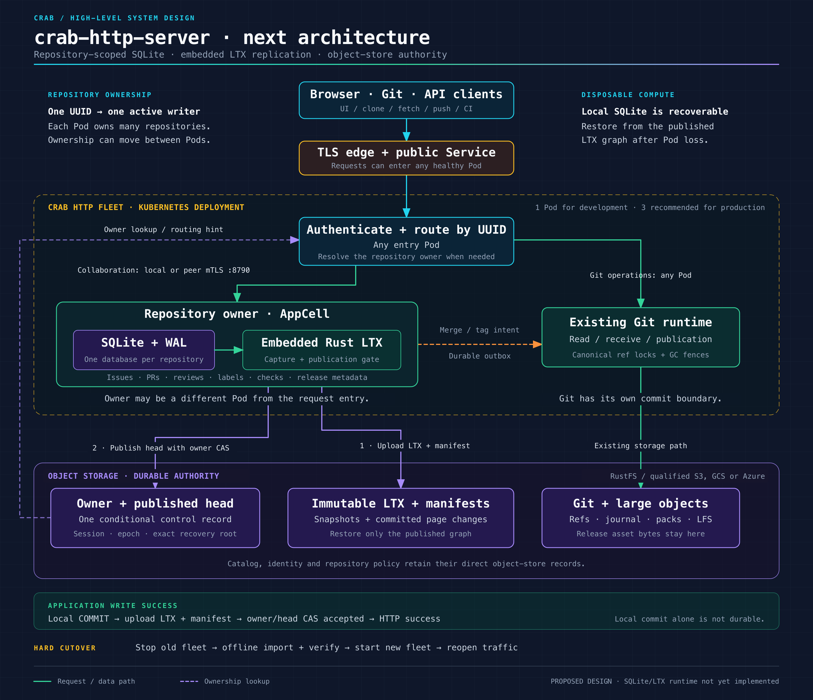
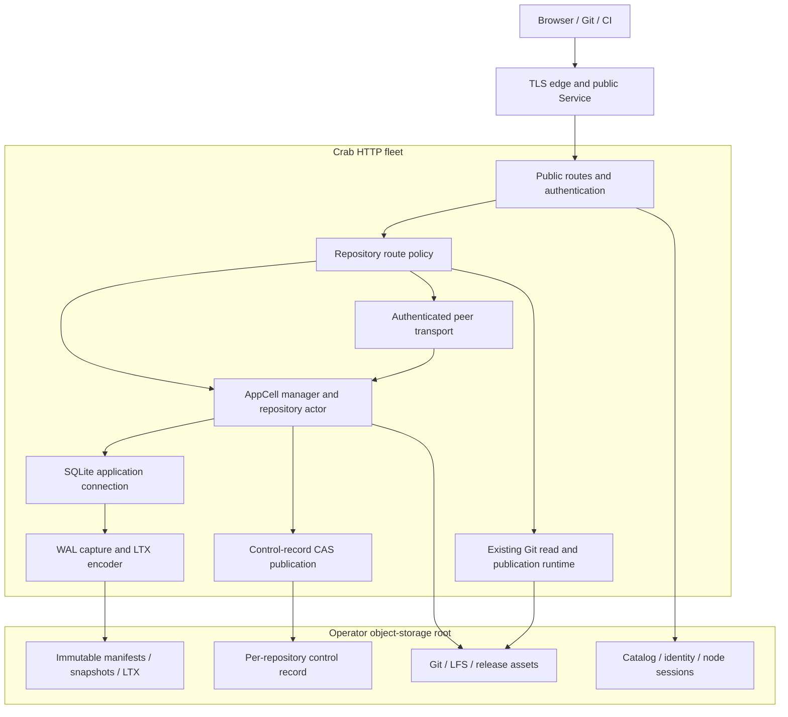

# Architecture, scope, and guarantees

[Design index](README.md) · Proposed architecture; not implemented.

The system boundaries below lead to the detailed
[storage protocol](storage-protocol.md),
[ownership and load balancing](ownership-and-load-balancing.md), and
[deployment model](deployment-and-operations.md).

## Decisions and scope

### Selected architecture

| Concern | Decision | Consequence |
| --- | --- | --- |
| Application database | One SQLite database per catalog UUID | Transactions and indexes stay within a repository |
| Local disk | Disposable database, WAL, replication staging, and Git scratch | Recovery must work after losing every Crab Pod disk |
| Durable application data | Immutable LTX objects plus a published recovery manifest | Uploaded objects become authoritative only through publication |
| Replication integration | Pinned `celld-ltx` source adapted into `crab-ltx` | Reuse managed WAL/codec mechanics in one Crab process with the specified correctness adaptations |
| First durability mode | Object-store durability before success | No peer-fsync acknowledgement or replica quorum in the first version |
| Write authority | One CAS control record containing owner and published head | Commit publication and takeover compete on the same key |
| Placement unit | Repository AppCell | One server can own many repositories |
| Placement policy | On-demand capacity admission, then idle handoff | Proactive fleet rebalance follows measured qualification |
| Read policy | Owner-served application reads with a publication barrier | No stale follower SQLite reads in the first version |
| Git storage | Existing Crab Git objects, manifests, journal, leases, and fences | Native Git and remote-helper coexistence remain separate qualification concerns |
| Deployment | Existing Kubernetes Deployment extended for peer routing | StatefulSet and persistent database volumes are optional optimizations |
| Migration | Fleet-wide hard cutover with offline per-repository imports | Maintenance downtime accepted; new runtime contains only the SQLite/LTX application backend |

### Goals

- Make issue creation, numbering, request deduplication, and related updates one
  database transaction.
- Replace repeated object reads and sparse counter scans with indexed SQL.
- Preserve existing identity, authorization, optimistic versions, and retry
  behavior.
- Survive process death, Pod replacement, and loss of local scratch without
  losing acknowledged application transactions, within the object store's
  durability guarantees.
- Route requests correctly across two or more replicas without sticky sessions.
- Make failover, migration, upgrades, and error behavior testable at explicit
  boundaries.
- Keep cloud credential resolution and conditional-write behavior in Crab's
  existing storage boundary.
- Support a small RustFS installation and the same core protocol on qualified
  S3, GCS, or Azure storage.

### Non-goals for the first implementation

- A SQL database for Git object bodies, packs, refs, or LFS bytes.
- Simultaneous writers to one repository database on different servers.
- Distributed SQL transactions across repositories, Git, and object storage.
- Arbitrary user SQL, SQLite extensions, or a general-purpose database service.
- A complete GitHub REST or GraphQL compatibility layer.
- Immediate implementation of every missing UI product feature. Activity feeds,
  notifications, moderation, and discussion deletion need their own product work.
- Peer-fsync durability, lazy page faulting, cross-cell node bundles, or
  synchronous multi-region operation.
- An assumption that Kubernetes deployment artifacts constitute production
  qualification.
- A migration-aware intermediate release, old/new rolling coexistence, dual
  writes, legacy application readers, or automatic rollback to JSON storage.

### Authority and transport boundaries

The durable head and owner belong in the same control object. A separate
`owner.json` check after an LTX upload does not, on its own, specify which late
uploads a successor must restore. This design introduces an explicit
linearization point: the conditional update that publishes the head while
holding the expected owner session and epoch.

The peer API uses a dedicated listener. Reusing management port 8789 would
couple authenticated application traffic to unauthenticated probes and their
shutdown lifecycle. A dedicated peer listener gives those responsibilities
independent admission and network policy.

Headless Kubernetes Services are optional discovery aids for Deployment-based
Pods. The initial routing mechanism uses the endpoint in the authoritative
owner record, so it does not require a Kubernetes watcher or Headless Service.

## Terminology and guarantees

### Terms

| Term | Meaning |
| --- | --- |
| Repository UUID | Stable `CatalogRecord.id`; names and storage placements are separate attributes |
| AppCell | Runtime ownership unit for one repository's application database |
| Node session | Fresh process incarnation identity; changes on every process restart |
| Epoch | Monotonically increasing activation number in a repository control record |
| LTX position | Epoch-local TXID and database checksum, bound to a database generation |
| Application revision | Monotonic SQL mutation sequence; independent of WAL frames and LTX grouping |
| Captured | Committed WAL state encoded into a verified local LTX segment |
| Uploaded | Immutable bytes accepted by object storage; not necessarily published |
| Published | Referenced by a successful authoritative control-record CAS |
| Acknowledged | Client received a success response derived from published state |
| Recovery manifest | Immutable description of an exact snapshot and contiguous LTX coverage |
| Fenced | Runtime may no longer publish or serve new application operations for that activation |
| Indeterminate | Request might have published, but the observer cannot currently establish the outcome |

Do not compare bare TXIDs across epochs. Do not assume one SQL statement, one
SQLite transaction, one application revision, and one LTX file are interchangeable.

### Required safety properties

1. Every successful application mutation is recoverable from the published graph.
2. An ownership change cannot drop a previously published head.
3. A superseded owner cannot publish a new head with its old control token.
4. Reads and errors cannot reveal locally committed but unpublished state.
5. A repeated durable request ID cannot allocate a second logical result.
6. A failed or absent HTTP response does not prove the mutation was absent.
7. Git publication retains its existing ref locks, GC fences, and exact plans.
8. No recovery process selects an unreferenced LTX object merely because its
   filename or timestamp is newer.
9. No normal garbage collection removes a referenced recovery dependency.
10. Cancellation of a client wait does not abandon an already accepted commit
    publication or Git cleanup task.

### Availability and durability claims

The intended application mutation RPO is zero for acknowledged writes if the
qualified object store preserves acknowledged objects and its conditional/read
contracts. Losing all HTTP server disks is within this failure model. Losing the
only RustFS storage disk, operator deletion of authoritative objects, corruption
outside the checksummed graph, or incomplete cross-region replication is not
covered by that claim.

Application operations stop when they cannot prove publication or ownership.
The design chooses that behavior during a partition rather than promising
availability and linearizable state simultaneously.

Recovery time is measured, not guaranteed by a lease constant:

```text
RTO = detection + contention/backoff + exact restore + validation
      + new-epoch snapshot upload/publication + retry scheduling
```

Git and application state have separate commit boundaries. A PR response can
describe a pending or indeterminate workflow; it must not claim atomicity across
SQLite and Git.

## Architecture and data ownership



[Editable SVG](../../../diagram/crab-http-next-architecture/high-level.svg).
The overview separates owner-routed collaboration, LTX publication, and the
existing Git data path. The Mermaid diagram below expands the component wiring.



### Storage allocation

| Data | Authority | Reason |
| --- | --- | --- |
| Issues, comments, PRs, reviews | Repository SQLite state published as LTX | Transactional collaboration model |
| Labels and discussion assignments | Same SQLite database | Indexed relationships and atomic edits |
| Commit statuses and check runs | Same SQLite database | Queries by exact commit, context and ordering |
| Release metadata and asset references | Same SQLite database | Small records and consistent lifecycle |
| Sequences, deduplication, outbox, migrations | Same SQLite database | Must survive in the same transaction as domain effects |
| Git objects, refs, manifest and journal | Existing Crab storage layout | Shared Git publication authority |
| LFS and release asset bodies | Immutable object storage | Large streaming data outside SQL |
| Catalog, membership, sessions and Git tokens | Existing global object-store records | Independently available authentication and discovery |
| Archive and branch-protection settings | Existing repository CAS records initially | Used by any-node Git paths and catalog operations |
| Owner, epoch and published LTX head | New repository control record | Must be readable before opening SQLite |
| Node discovery and session heartbeat | Global node records | Routing hints and liveness information |

"LTX-only replication" means all SQLite persistence and restoration use the
embedded LTX subsystem. LTX is a database page format; routing, owner identity,
and authoritative pointers still require small control records. Encoding those
records inside the database would create a bootstrap dependency cycle.

### Repository distribution

```text
Pod A: cells for repository UUIDs R1, R4, R7
Pod B: cells for repository UUIDs R2, R5
Pod C: cells for repository UUIDs R3, R6, R8

One AppCell is not one Pod.
One repository is not three concurrently writable SQLite copies.
```

An owner is acquired on demand. An inactive catalog record consumes no SQLite
connection. A repository rename preserves the cell UUID. A physical storage-root
move is a separate quiesced migration and cannot be inferred from a name change.

## Alternatives and remaining decisions

### Alternatives

| Alternative | Benefit | Reason not selected for this version |
| --- | --- | --- |
| Keep JSON/CAS collaboration documents | Minimal infrastructure and current implementation | Multi-object workflows and list queries remain expensive/complex |
| One shared SQLite database for all repositories | Simple joins and one replication stream | One writer/failure unit; difficult repository isolation and movement |
| PostgreSQL service | Mature concurrent SQL and operational ecosystem | Adds the database service the selected embedded design aims to avoid |
| Litestream sidecar | Separate process and existing operational tooling | Does not itself implement Crab's owner routing and publication gate |
| Go Litestream embedded through FFI | Reuse Go implementation | Adds Go/SQLite integration complexity to the Rust process |
| LTX codec only | Small dependency | Leaves the hard WAL/checkpoint/restore lifecycle to implement |
| Full Celld runtime | Broader existing cell platform | Imports runtime, routing and deployment responsibilities beyond Crab's boundary |
| Kubernetes Lease as repository authority | Familiar Kubernetes coordination | Splits authority from object storage and couples runtime to a cluster API |
| Shared writable PVC across Pods | Superficially avoids replication | Violates the selected single-owner/local-WAL execution model |
| Peer-fsync first | Lower acknowledgement latency | Requires durable follower logs, sealing, takeover recovery and disk guarantees |

### Decisions to close before implementing the relevant phase

| Decision | Proposed direction | Evidence required |
| --- | --- | --- |
| Exact imported LTX surface | Celld source reuse approved; [capture/codec/restore integration](crab-ltx.md) selected | Source inventory/notices, dependency alignment, rolling-checksum and exact-restore qualification |
| Manifest representation | Bounded immutable pages and explicit end positions | Restore/cost benchmarks and frozen fixtures |
| Initial LTX encoding | One explicitly qualified reader/writer capability | Round-trip and golden decoder tests |
| Peer TLS provisioning | Operator or platform workload PKI | Pod IP/DNS verification and certificate rotation test |
| Git operation receipt | Reuse canonical journal evidence where possible | Full publication caller/callee and crash/ABA proof |
| Retry policy for existing edits | Preserve version/refetch; add IDs only with API change | UI and non-UI consumer contract tests |
| Lease/admission tuning | Conservative constants then measured limits | Pause, storage latency and capacity experiments |
| Retention duration | Operator-defined backup/recovery objectives | Cost model and restore/collector concurrency proof |
| Hard-cutover window sizing | Maintenance-window transition already selected | Measure complete inventory/import/restore time and full-fleet acceptance against deployed data |

These are bounded implementation decisions. They do not weaken the publication,
fencing or migration invariants. If an implementation cannot prove those
invariants with its chosen library, revise the library boundary or the protocol
before exposing writes.
