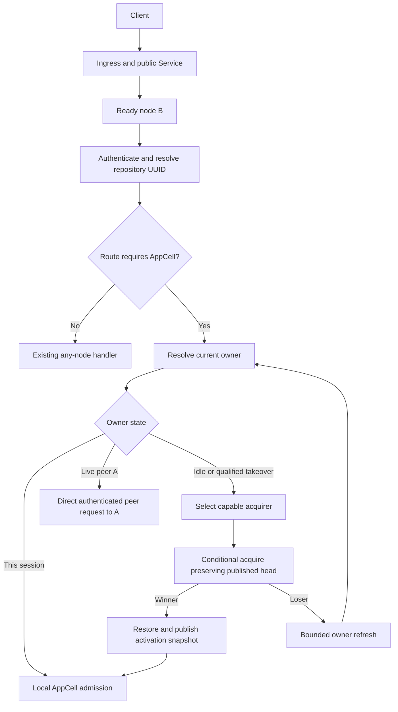
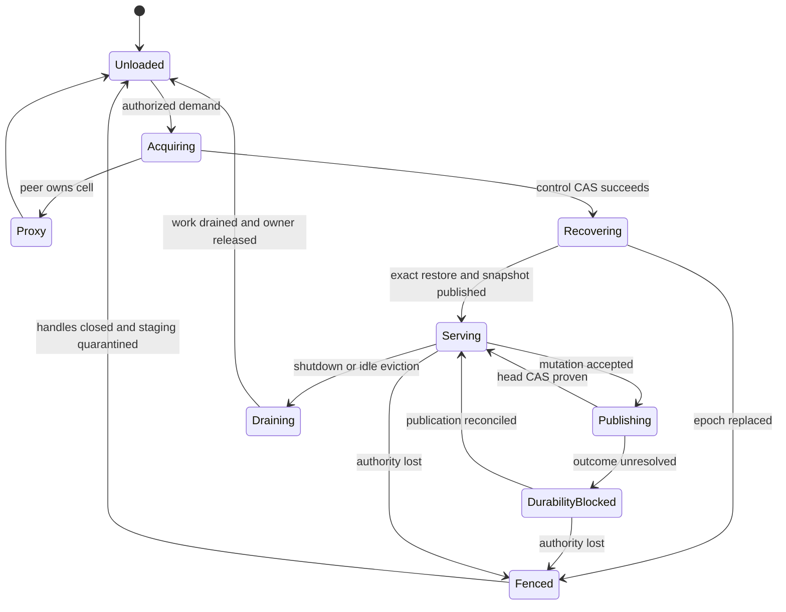
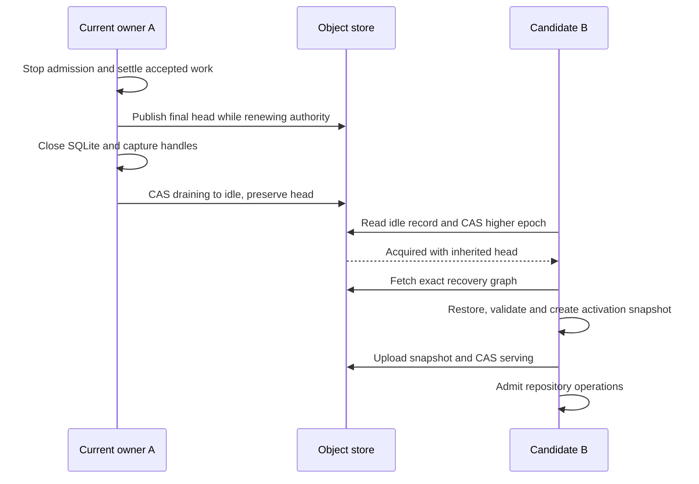

# Ownership, placement, and load balancing

[Design index](../NEXT_ARCHITECTURE.md) · Proposed architecture; not implemented.

## Balancing responsibilities

Public traffic distribution, owner routing, and cell placement make separate
decisions. They share observations, but only the per-repository
[control record](storage-protocol.md#authoritative-control-record) grants an
activation authority to publish application state.

| Layer | Decision | Authority and limit |
| --- | --- | --- |
| Ingress / public Service | Which ready node receives a request | Health and transport policy; no repository ownership |
| Repository routing | Execute locally or send to the current owner | UUID and origin control state; caches are hints |
| Placement / rebalance | Which eligible node should attempt acquisition | Capacity preference; acquisition still needs control CAS |
| LTX publication | Which committed database state is durable | Verified immutable graph plus head CAS; no request balancing |



Public Service affinity is unnecessary. An owner-specific peer call uses the
advertised node endpoint, never the public Service address. HTTP connections,
Pod names, hash assignments, and node counts cannot establish repository
authority. See [routing and retry limits](routing-and-security.md#request-resolution)
for authorization and non-replayable request handling.

## Ownership, leases, and placement

### Activation state machine



Fenced is terminal for that activation. Reopening requires a fresh acquisition
and higher epoch, even on the same process and even when local files remain.

### Lease mechanics

The repository control record is the write fence. Node heartbeats advertise
session identity, endpoint and capabilities but do not independently grant
repository authority. Failure of a node heartbeat is a hint to check its cells,
not permission to bypass their control CAS.

Use lease sequence progress and monotonic elapsed time rather than trusting a
different host's wall clock. A contender observes the same owner/lease sequence
without progress for a full takeover interval, then conditionally replaces the
latest observed control revision. Any successful intervening renewal or commit
invalidates that CAS and restarts the decision.

Every successful owner publication also advances the lease sequence and renews
its local deadline under the same timing rule as a heartbeat. A contender never
refreshes its CAS token while retaining an expired observation of an older
sequence; it must restart observation when it sees progress.

The owner maintains a conservative local renewal deadline measured from the
start of its last successful renewal attempt. A delayed renewal response that
arrives after that deadline cannot revive a fenced activation. Lease expiry
stops local admission. Actual publication safety still follows the control CAS,
including during pauses or excessive clock drift.

Candidate initial tuning: renew every 3 seconds, local self-fence deadline 10
seconds, contender no-progress observation 15 seconds. These are evaluation
values, not implemented settings or availability guarantees. Epoch fencing
protects safety even if a contender falsely suspects an owner; false suspicion
can still cause disruptive churn and must be measured.

One per-cell control coordinator serializes renewal, publication and handoff
updates. A background heartbeat must never replay a stale head over a newer
commit. When a CAS fails, reread and revalidate generation, epoch, owner session,
state and expected head before deciding which transition remains legal.

### Acquisition and restore

1. Resolve repository UUID and authorize the caller before activating storage.
2. If the control record is absent for a new repository, strict-create a
   recovering record with a new generation and epoch one.
3. If another owner is live, return its routing information.
4. For an idle record or a qualified takeover, CAS to a fresh session/epoch in
   recovering state; carry forward the predecessor's published pointer exactly.
5. Restore only that published pointer into a new local directory.
6. Verify checksums, SQL integrity, schema compatibility and repository identity.
7. Create a full LTX snapshot for this epoch, with an explicit mapping from its
   local LTX position to the inherited application revision.
8. Upload the snapshot and manifest, then CAS from recovering to serving.
9. Admit reads and mutations only after that CAS is proven.

Renew ownership during a long restore. If ownership changes while restoring,
discard the partial activation. Never serve a partially restored database.

Full snapshots on activation simplify epoch transitions but can be expensive.
The first release accepts that tradeoff; lazy page restore requires a later
design with equivalent checksum, cut, and fencing proofs.

### Placement and balancing

Use on-demand acquisition initially. Do not activate the catalog at startup.
Separate owned, resident, recovering, and idle counts: a catalog entry does not
consume an active database or renew a lease when no node owns it. Crab's initial
idle eviction releases ownership; Celld can retain ownership of hibernated cells.
That difference affects which count a future balancing algorithm should use.

On a cold request, the entry node first resolves control state. A live owner's
load cannot justify stealing its cell. For an idle record, or after satisfying
takeover qualification, a node with capacity reserves local restore and scratch
budgets before attempting acquisition. CAS losers release those reservations.
Concurrent requests for the same UUID share one activation attempt per node.

If the entry has insufficient capacity, it may ask one eligible peer to perform
an authenticated acquire-and-execute operation within the original request
budget. This cold-acquisition operation is distinct from execution addressed to
an expected existing owner: the candidate must read origin state, authorize the
caller, and run the normal control protocol before any SQL command. It cannot
forward recursively. A failed pre-admission attempt is retryable; after a command
has been accepted, mutation retries require durable replay semantics.

Node-session advertisements supply bounded capacity hints: protocol/decoder
capabilities, draining/pressure state, resident cells, restoring cells, and
remaining admission capacity. Candidates must have a live compatible session,
valid authenticated endpoint, supported schema/format, and local capacity. The
receiver performs its own admission check because sampled capacity may already
be consumed. Reserve room for snapshot creation as well as download and replay.

Missing or stale peer capacity data does not permit stealing an owned cell or
unbounded discovery. A capable local node may still acquire under the normal
rules; otherwise return bounded overload/recovery guidance. Request hot spots
on a live owner remain subject to its queue and per-repository limits.

Rendezvous hashing over eligible node sessions is a later placement preference
to reduce contention. Recompute preferences when membership changes, but leave
valid ownership intact. A restarted process advertises a new session and cannot
inherit authority merely because its Pod IP or preferred placement is unchanged.

## What Celld balances

At the pinned revision, Celld samples fleet leases at five-second intervals.
Its rebalancer compares owned cells per unit of node weight, selects the densest
donor, and moves at most 32 hibernated cells per sample toward nodes below their
weighted share. A two-percent receiver deadband and sample freshness rules
reduce oscillation. Draining peers and peers currently restoring do not receive
donations. Each move still uses release CAS and signed successor acquisition.
See the [balancer source](https://github.com/denoland/celld/blob/10cb1303dac710dcb3b557e318e08c855261f68b/crates/logic/rebalance.rs)
and [operating description](https://github.com/denoland/celld/blob/10cb1303dac710dcb3b557e318e08c855261f68b/README.md#L301-L311).

Its cold-capacity path has a separate selection rule, comparing projected
resident cells, WebSocket counts, and memory among eligible peers. That rule
does not make the periodic ownership balancer sensitive to per-cell QPS. See
[capacity selection](https://github.com/denoland/celld/blob/10cb1303dac710dcb3b557e318e08c855261f68b/crates/logic/lib.rs#L3860-L3965).

Crab adopts the separation of planning from authority. Celld's interval, batch
limit, weights and WebSocket metrics are reference behavior, not new Crab
configuration defaults. See [Celld integration](celld-and-rust.md) for the
different durability and peer-security choices.

## Safe idle handoff

An idle candidate has no accepted command, active SQL transaction, unpublished
batch, or worker requiring local completion. An unresolved Git outbox workflow
must satisfy the [cross-domain recovery rules](git-workflows.md#owner-loss-during-git-publication)
before voluntary movement; idle UI traffic alone is insufficient evidence.

1. Close new application admission for the cell and mark it draining through
   the control coordinator. Continue renewing while accepted work settles.
2. Resolve every accepted publication and retain durable pending-work evidence.
   During node shutdown, keep the private completion channel open until registered
   workers have settled, as required by [shutdown ordering](deployment-and-operations.md#shutdown-ordering).
3. Close SQLite/capture handles and release with a CAS preserving the exact head
   and epoch counter. If release is ambiguous, reconcile; do not advertise a
   successful handoff without proof.
4. A successor, chosen by demand or a later balancing hint, independently CASes
   the idle record to a higher epoch and restores the published graph.
5. Serve only after the successor's activation snapshot has been published.



The candidate is a preference until its CAS wins. A third node can acquire
between release and candidate acquisition; the loser refreshes and routes to
the winner. Candidate failure leaves the repository idle for normal demand.
No live SQLite copy transfer is required. A local warm cache can later accelerate
restore only after validation against the published state.

## Later fleet rebalance

Automatic proactive redistribution follows qualification of on-demand ownership
and idle handoff. Start with weighted owned-cell counts plus receiver resource
admission, then measure whether database size and activity require a richer
cost model. Do not add unlike units such as bytes and request counts without
defined normalization and measurements.

For live eligible nodes, a planning target is:

```text
target_i = ceil(total_owned_cells * weight_i / sum(weights))
density_i = owned_cells_i / weight_i
```

| Node | Weight | Current owned cells | Target |
| --- | ---: | ---: | ---: |
| A | 4 | 60 | 40 |
| B | 2 | 10 | 20 |
| C | 2 | 10 | 20 |

A can release eligible idle cells toward B/C. The target is approximate: integer
rounding, receiver headroom and active cells may prevent an exact distribution.
Use fresh fleet samples, a deterministic donor choice, bounded batches, a
cooldown/deadband, and independent receiver admission. Failure or stale samples
pause movement without changing authority. Avoid each node listing every lease
per request; any shared sampling coordinator is an optimization and does not
grant cell ownership.

Adding Pods immediately adds entry/Git capacity. AppCell capacity shifts when new
or released cells activate; existing busy owners remain in place. Scale-down
drains gradually to avoid simultaneous full restores and activation snapshots.
Under pressure, refuse new activations and release least-recently-used idle
cells. Do not evict unresolved publication state merely to meet a balancing target.

One hot repository still has one SQLite writer and one sequential publication
cycle. More Pods distribute different repositories. Git reads retain their
any-node path; follower SQL reads and splitting a repository database require a
separate consistency design. Measure queue wait and recovery pressure alongside
CPU before enabling autoscaling; see [capacity and operations](deployment-and-operations.md#performance-and-capacity).
