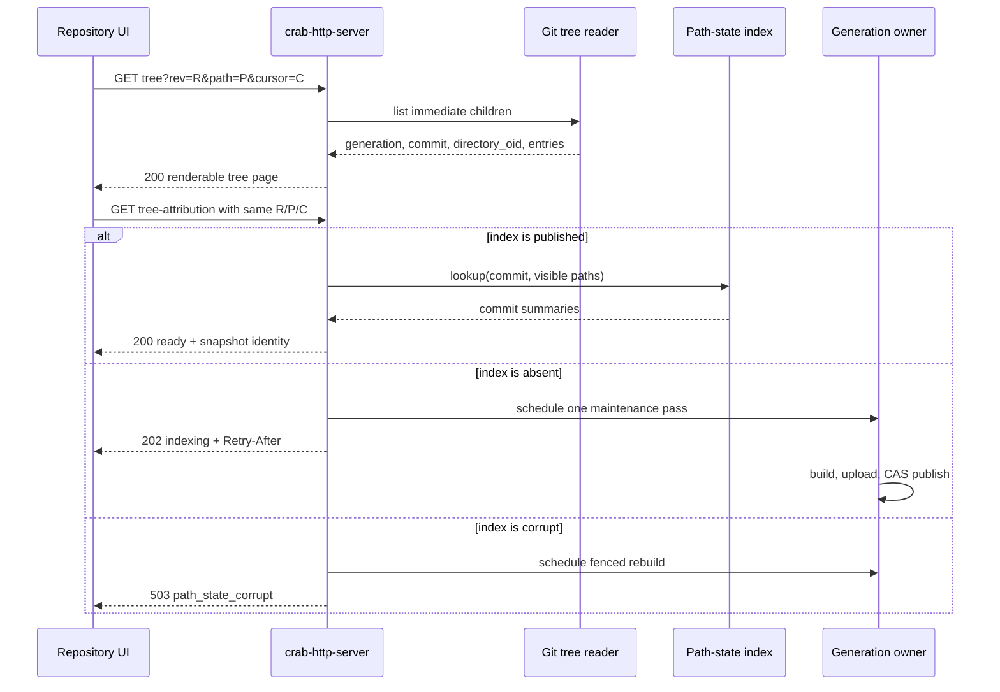
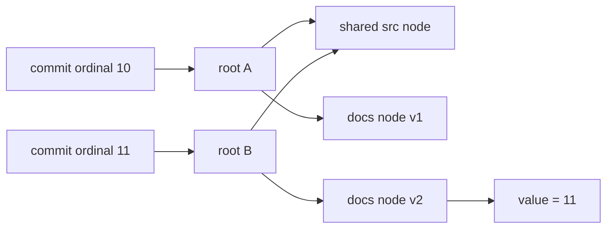
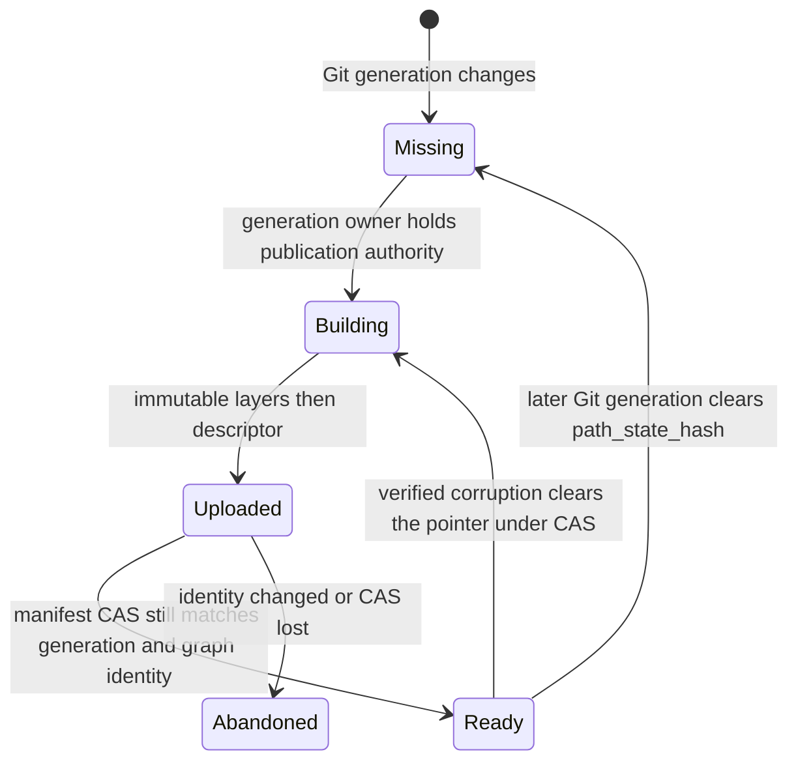
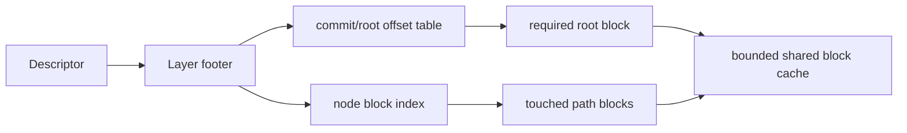

# Repository browse performance

[Design index](README.md) · Low-level design for tree navigation and last-change attribution.

## Decision

Repository navigation has two independent products:

| Product | User-visible requirement | Data owner | Complexity target |
| --- | --- | --- | --- |
| Tree page | Names, modes, object IDs and kinds appear first | Git tree objects | `O(page entries)` |
| Attribution | Each visible entry gains its last-change commit | Generation-bound derived index | `O(page entries × path depth)` |

The HTTP server must never scan commit history while serving a tree page. It
must also never hide an index miss by falling back to the old history walker.
That fallback made a cold request proportional to the repository's first-parent
history and multiplied object-store reads for tree comparisons.

A larger response cache is not the architectural fix. It improves repeated
requests for one process but preserves cold-start latency, creates invalidation
work and does not help another node. The durable fix is to compute path state
once per immutable Git generation and publish it beside the commit graph.

## Request flow



The UI merges attribution only when all of these values still match the tree
page:

```text
generation + commit + directory_oid + entry.path_hex + entry.oid
```

Navigation and revision changes abort the obsolete attribution request. A 202
response keeps the tree usable and schedules a bounded retry. Attribution
failure is displayed on the commit column; it does not replace the tree with an
error page.

## HTTP contract

The existing repository action endpoint owns both calls:

```http
GET /api/repos/{owner}/{repo}/tree?rev={rev}&path_hex={hex}&limit={n}&cursor={cursor}
GET /api/repos/{owner}/{repo}/tree-attribution?rev={rev}&path_hex={hex}&limit={n}&cursor={cursor}
```

The tree response contains the snapshot identity and entries but no commit
history:

```json
{
  "generation": 41,
  "commit": "<40-hex-object-id>",
  "directory_oid": "<40-hex-object-id>",
  "items": [{ "path_hex": "524541444d452e6d64", "oid": "<oid>", "kind": "blob" }],
  "next": null
}
```

The attribution response repeats the same identity and adds summaries:

```json
{
  "state": "ready",
  "generation": 41,
  "commit": "<40-hex-object-id>",
  "directory_oid": "<40-hex-object-id>",
  "items": [{
    "path_hex": "524541444d452e6d64",
    "oid": "<oid>",
    "last_commit": { "oid": "<oid>", "author": "A", "message": "Change README" }
  }],
  "next": null
}
```

An unpublished index returns HTTP 202, `Retry-After: 2` and
`{"state":"indexing","retry_after_ms":2000}`. A corrupt published index is a
503. These states are intentionally different: absence is expected asynchronous
work; corruption is an availability fault and triggers repair.

## Persistent path-state trie

`crab-metadata::path_state` stores one immutable trie root for every commit
ordinal in the split commit graph. Trie edges are raw Git path components, so
non-UTF-8 names do not collide. A node value is the stable ordinal of the commit
that last changed that path.



For one commit, the builder:

1. starts from the first parent's immutable root;
2. applies tree-diff mutations to a mutable overlay;
3. copies only touched ancestor nodes;
4. freezes children before parents; and
5. records the new root with the commit summary.

Directory type replacement resets the old subtree before inserting the new
visible descendants. Deletion removes the visible value. Ancestor directory
values are updated so browsing any changed directory reports the correct
commit. Historical roots remain readable after every mutation.

Lookup starts at the requested commit's root and follows each path component.
It performs no pack read, tree comparison or commit walk. For `p` page entries
of average depth `d`, CPU work is `O(p × d)`.

## Object layout and publication

```text
metadata/path-state/<descriptor-hash>.json
metadata/path-state/layers/<layer-hash>.bin
metadata/path-state/work/<git-validation-digest>.json
manifest.path_state_hash = <descriptor-hash>
```

The descriptor binds:

- repository generation;
- pack-index content hash;
- Git validation digest;
- stable commit-ordinal digest and count; and
- ordered layer hashes, lengths, ordinal ranges and node counts.

Layer and descriptor hashes are verified before decode. References are checked
for bounds, ordering and cycles. The aggregate decoded input is capped by the
repository path-state byte budget.

Publication order is strict:



Only the generation owner builds the index. Concurrent readers can observe the
old immutable generation or the new immutable generation, never a partially
published index. More than 32 incremental layers are compacted into one layer
while retaining structural sharing, which bounds cold layer object requests.

Initial construction checkpoints every 32 commits. Each immutable prefix is
uploaded before a small mutable work record advances by CAS. The record binds
the generation, pack, Git validation and full commit-ordinal digest, so a later
maintenance pass can resume only the exact same graph. A stale owner cannot
move the checkpoint backward. Normal maintenance-budget cancellation is an
indexing state rather than a failed index; the next 202 retry starts the next
pass. GC retains the current work record, descriptor and layers until the final
manifest pointer is published.

The path-state hash is derived Git metadata, not repository application state.
It remains in the Git manifest and object store as the portable, verified
rebuild source. Git push, import, repack and every other generation advance
clear it. GC and history recovery traverse the descriptor and every referenced
layer. The target application plane may additionally import this descriptor
into a discardable SQLite query projection; that projection never becomes Git
authority. Its direct-push reconciliation and schema are specified in
[Serverless Git and Cell projections](serverless-git-projections.md).

## Ownership and failure rules

| Condition | Server behavior | Safety rule |
| --- | --- | --- |
| Published valid index | Lazily load on attribution and cache with repository snapshot | Validate all graph bindings before use |
| Missing index | Return 202 and coalesce maintenance | Never block the base tree response |
| Build loses manifest CAS | Discard unpublished result | Never attach an index to a different generation |
| Corrupt descriptor/layer | Return 503, clear and rebuild under CAS | Never return guessed attribution |
| Request cancelled | Stop request work; publication owner retains its own lifecycle | Request cancellation cannot publish partial state |
| Process restarts | Reopen the manifest and immutable objects | No process-local cache is authoritative |

A completed maintenance handle invalidates the pinned repository snapshot. The
next retry reopens the newly published manifest; it does not start a duplicate
build.

## Long-term scale work

The persistent trie removes the history-dependent request algorithm. The next
optimization stage changes physical access, not attribution semantics:



1. Encode independently checksummed node blocks and a footer containing commit,
   root and node offsets.
2. Fetch the footer and required blocks with object-store ranges instead of
   loading complete layers on the first attribution request.
3. Cache blocks by `(layer hash, block number)`, with a byte-bounded admission
   policy shared by repository snapshots.
4. Add adaptive checkpoint sizing using observed tree-read latency while
   retaining the existing 32-commit upper bound for cancellation loss.

Range paging is justified when qualification shows complete verified layer
loads exceed the attribution latency or memory budget. It does not change the
HTTP contract, trie semantics or manifest pointer, which keeps the current
implementation a direct foundation rather than a temporary cache.

## Qualification gates

Before treating repository browsing as capacity-qualified, measure cold and
warm cases separately:

| Gate | Evidence |
| --- | --- |
| Base tree independence | Tree latency and object reads do not grow with commit count |
| Attribution complexity | Fixed page/depth lookup does not read Git pack/tree objects |
| Snapshot safety | Delayed response from an older generation is rejected by the UI |
| Async recovery | Missing index produces 202, background publication, then exact 200 |
| Corruption | Bit-flipped descriptor/layer produces 503 and fenced rebuild |
| Lifecycle | GC and history recovery retain and verify every referenced object |
| Scale | Representative small/medium/large repositories meet node memory and latency budgets |

The current proof covers trie history semantics, raw-path handling, graph
binding, checkpoint round-trip, real HTTP push/publication/lookup,
missing/corrupt-index recovery, UI merge identity, GC reachability and workspace
compilation. A real RustFS repository also crossed one maintenance-budget
boundary, resumed its checkpoint and reached ready attribution. Fleet capacity
remains deployment qualification, not a unit-test claim.
