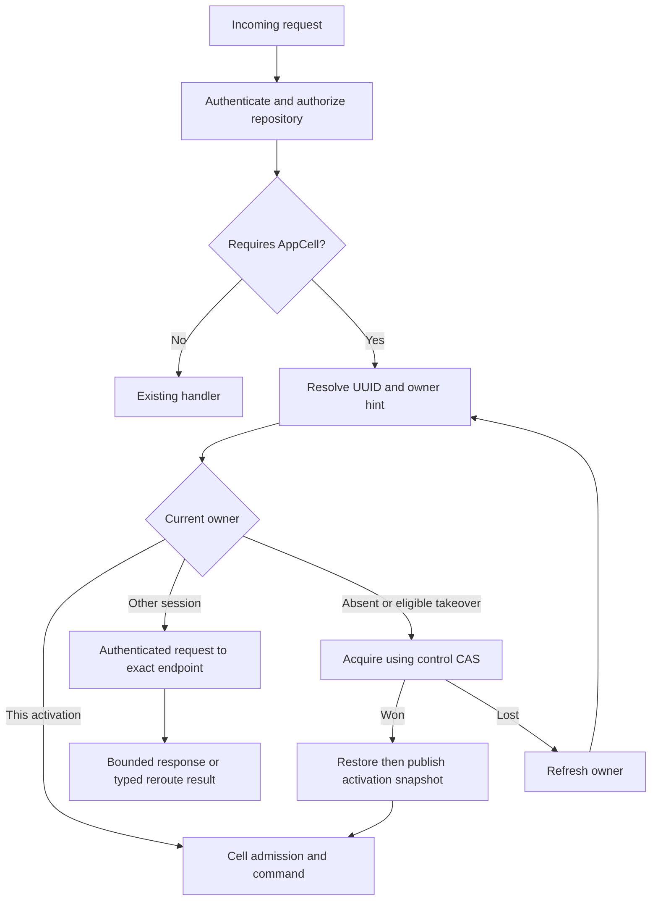

# HTTP routing, peer protocol, and security

[Design index](README.md) · Private authenticated transport implemented; public route cutover remains.

Read [ownership and load balancing](ownership-and-load-balancing.md) for acquisition
and movement, and [commit publication](storage-protocol.md#commit-publication-and-response-gating)
for the result barrier used by local and remote execution.

## HTTP routing and internal proxy

### Route classification

Attach route policy at route registration, with tests that enumerate affected
routes. Avoid scattered string-prefix heuristics in handlers.

| Surface | Execution policy in the proposed first version |
| --- | --- |
| Static assets, login/session, catalog | Any node, existing control-plane path |
| Git advertise/upload-pack, file/tree/history/diff/blame/archive | Any node, existing remote Git runtime |
| Native receive-pack, branch and content writes | Any node through existing Git publication |
| LFS upload/download | Any node through existing LFS path |
| Issues, PR metadata/reviews, labels, assignments, statuses/checks | Repository AppCell owner |
| PR merge or release tag creation | Owner orchestrates a durable outbox workflow |
| Release metadata | Owner |
| Release asset bytes | Stream on an admitted node using published owner authorization/reference |
| Archive/branch-protection configuration | Existing direct CAS policy path initially |

Ordinary Git push does not need an AppCell just to move a ref. It still evaluates
archive/protection and uses shared publication coordination. Any feature that
later requires SQL state during ordinary push must define that additional
dependency explicitly.

### Request resolution

Owner caches improve routing latency. They cannot authorize SQL publication or
permit stale reads. Refresh on typed `NotOwner`, owner session mismatch, and
connection failure. A failed TCP connection alone does not establish ownership
expiry. It can indicate a network-policy problem while the owner is healthy.

The peer endpoint is trusted control-plane data but still validated: approved
scheme, port, destination network/identity, no URL userinfo, no redirect following,
and no arbitrary client-supplied target. This prevents proxying into metadata
services or unrelated internal applications.

### Internal protocol

Use `POST /internal/cells/v1/forward` on the configured management listener with
exact media type `application/x-protobuf` and `Cache-Control: no-store`. The path
is absent from the public router. The body and response are each bounded by the
one-MiB operation limit plus 16 KiB envelope allowance. The client never follows
redirects and constructs no URL from public request data.

The checked-in `crab.cell.peer.v1` descriptor is the complete wire contract; it
defines messages, not a public gRPC service. `PeerRequest` contains version 1,
hop count 1 or 2, remaining milliseconds, one `PeerAuthorization`, and exactly
one nested operation: mutate, read, Resolve, DeliverEffect or ResolveEffect.
V1 dispatch currently accepts mutate, read and Resolve. A `Target` carries fixed
tenant/application/namespace IDs and a bounded partition; no peer supplies a
handler name, module name, SQL string, arbitrary URL, owner identity or
acquire-and-execute flag.

`PeerAuthorization` carries the 16-byte origin boot session, principal
issuer/subject, sorted unique action IDs, release digest, issued/expiry time,
BLAKE3 of the exact nested operation bytes, and an Ed25519 signature. The
signature covers those fields and the selected operation tag. Hop count and
remaining time are reauthenticated by mTLS at each hop and may only increase and
decrease respectively. The receiver's strict pre-decoder rejects unknown fields,
duplicates, invalid oneofs and oversize data before Prost decoding.

Use mutually authenticated TLS with an operator-provided fleet trust root. Each
node publishes a 15-second signed advertisement binding its boot session, direct
HTTPS endpoint, CA fleet digest, leaf SHA-256, Ed25519 SPKI, compatible image and
release, module inventory, progress and capacity hints. The sender reloads Cell
control, then requires exact owner-session/endpoint equality with a live verified
advertisement before sending credentials. TLS validates CA, hostname, client and
server EKU and the advertised leaf/SPKI pins. A service mesh cannot terminate
this identity boundary and replace it with forwarded headers.

The recipient first extracts only the structurally valid but untrusted session
claim, loads that exact live advertisement, compares the TLS client leaf and SPKI,
then verifies the signed envelope. It reconstructs no browser session. Instead,
the repository authorizer reloads current repository membership and intersects it
with the delegated actions before resolving the active local `CellHandle`.
Public Host/origin/CSRF checks remain at external ingress; the private route does
not spoof those headers or bypass product authorization.

Cold acquisition is a sender-side runtime operation, not a peer-protocol mode.
Before it is added to product routing, it must follow the
[capacity admission path](ownership-and-load-balancing.md#placement-and-balancing),
win control CAS, restore the exact root and expose a local handle before any
command is dispatched. A missing owner never authorizes execution without those
steps.

### Retry and loop prevention

An ingress sends hop 1 to the owner it observed. A receiver that is no longer the
active owner may reauthorize the unchanged signed operation bytes, subtract its
elapsed time, increment the hop and send hop 2 to the newly authoritative owner.
A receiver never sends hop 3: it returns typed `UNAVAILABLE/NOT_STARTED`. The
sender reloads authority at most once within the original budget. This bounds
amplification and prevents loops while tolerating one ownership movement.

Use the same dispatch budget for cold-capacity selection and owner rerouting.
There is no separate chain of retries for each layer. A cold candidate that
discovers another live owner returns routing information to the original entry;
it does not recursively forward or steal the cell. Transport failure after
acceptance remains an uncertain command outcome.

Reads may be retried within their budget. A mutation is retried only when the
failure proves execution did not start: connect establishment failed, HTTP
429/503 was returned, or the peer returned `UNAVAILABLE/NOT_STARTED`. Timeout,
response stream loss, malformed success, or an HTTP 5xx after connection is
`OutcomeUnknown`, even though the request identity makes a later explicit replay
safe to resolve. A proxy timeout does not mean the owner failed to commit.
Preserve `request_id`, canonical body, and expected version on every replay.

Do not automatically replay native Git receive bodies or large asset upload
streams using the metadata retry path. They have separate streaming, integrity,
admission and outcome contracts.

### Public error behavior

| Condition | Public behavior |
| --- | --- |
| Current API validation/authorization error | Preserve existing status/code and visibility policy |
| Expected version or request-content conflict | 409 with existing conflict semantics |
| Cell queue or node capacity exhausted | 429 and bounded retry guidance |
| Owner recovering/moving, storage unavailable | 503 with `Retry-After` where meaningful |
| Current handler wait deadline | Preserve 504 where already used; explain possible completion |
| Corrupt or incompatible published data | Service unavailable for affected repository; operator diagnosis required |
| Internal `NotOwner` | Consumed by entry routing, not exposed as a public redirect |

New detailed error codes are proposed additions and require frontend handling.
Do not change all existing codes while replacing the backend. The UI keeps
drafts, distinguishes rejected versus indeterminate actions, and retries the
same creation request ID after response loss.

## Security and authorization

Public request identity and repository visibility are checked before cell
activation or peer dispatch. The owner rechecks the permission needed for the
command. A peer certificate establishes a fleet member, not an end user's right
to modify a repository.

Delegated identity includes the original credential scope ceiling. A Git token
cannot become a browser administrator during forwarding. Session and parent
token revocation checks must preserve the current auth contract; a signed
long-lived envelope cannot substitute for them. Use a short-lived internal
proof and an opaque reference enabling owner-side status verification.

Store hashes, request IDs and diagnostic identities without logging Cookie,
Authorization headers, cloud credentials, OIDC tokens or raw internal secrets.
The development RustFS credentials discussed during setup remain local secret
inputs and do not belong in checked-in examples or fixtures.

Default production peer transport requires mutual TLS. Development local trust
remains loopback-only as in current configuration validation. Deploying several
unauthenticated Pods must not silently extend `Principal::Local` across a network.

Object-store keys are constructed from validated UUIDs and scoped roots, never
raw user path fragments. Validate all manifest references remain within the cell
generation and allowed immutable dependencies. Limit decompression output,
page counts, file sizes, manifest depth and total restore bytes before allocating.

LTX checksums detect encoding or storage corruption; they are not access control.
Application peers with write credentials are within the trusted fleet boundary.
This protocol does not protect against a malicious process that can deliberately
replace arbitrary control records and data using unrestricted bucket credentials.

Use workload credentials restricted to the configured Crab root. Separate
operator backup/restore authority where practical. SQLite files and replication
scratch inherit restrictive filesystem permissions and the platform's disk
encryption policy. Secret and certificate rotation must preserve fleet
connectivity through an explicit trust-overlap window.
