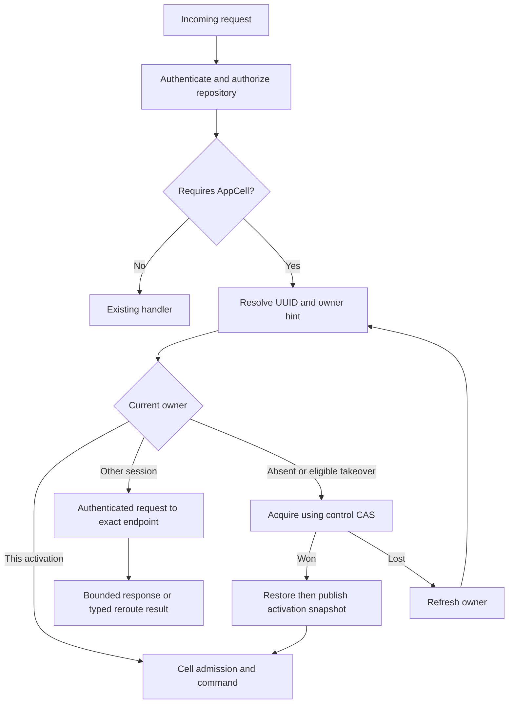

# HTTP routing, peer protocol, and security

[Design index](README.md) · Proposed architecture; not implemented.

Read [ownership and load balancing](ownership-and-load-balancing.md) for acquisition
and movement, and [commit publication](storage-protocol.md#commit-publication-and-response-gating)
for the result barrier used by local and remote execution.

## HTTP routing and internal proxy

### Route classification

Attach route policy at route registration, with tests that enumerate affected
routes. Avoid scattered string-prefix heuristics in handlers.

| Surface | Execution policy in the proposed first version |
| --- | --- |
| Static assets, login/session, catalog | Any node, existing control-plane path |
| Git advertise/upload-pack, file/tree/history/diff/blame/archive | Any node, existing remote Git runtime |
| Native receive-pack, branch and content writes | Any node through existing Git publication |
| LFS upload/download | Any node through existing LFS path |
| Issues, PR metadata/reviews, labels, assignments, statuses/checks | Repository AppCell owner |
| PR merge or release tag creation | Owner orchestrates a durable outbox workflow |
| Release metadata | Owner |
| Release asset bytes | Stream on an admitted node using published owner authorization/reference |
| Archive/branch-protection configuration | Existing direct CAS policy path initially |

Ordinary Git push does not need an AppCell just to move a ref. It still evaluates
archive/protection and uses shared publication coordination. Any feature that
later requires SQL state during ordinary push must define that additional
dependency explicitly.

### Request resolution



Owner caches improve routing latency. They cannot authorize SQL publication or
permit stale reads. Refresh on typed `NotOwner`, owner session mismatch, and
connection failure. A failed TCP connection alone does not establish ownership
expiry. It can indicate a network-policy problem while the owner is healthy.

The peer endpoint is trusted control-plane data but still validated: approved
scheme, port, destination network/identity, no URL userinfo, no redirect following,
and no arbitrary client-supplied target. This prevents proxying into metadata
services or unrelated internal applications.

### Internal protocol

Use a versioned, bounded HTTP protocol on peer port 8790. Begin with typed domain
commands and metadata queries; do not accept arbitrary internal URLs or SQL.
Reuse the same domain executor as local dispatch after principal reconstruction.

Distinguish execution against an expected owner session/epoch from a cold
acquisition request. The latter is allowed only through the
[capacity admission path](ownership-and-load-balancing.md#placement-and-balancing):
the recipient resolves origin control state and obtains authority before
executing. It cannot interpret a missing expected epoch as permission to bypass
fencing. Both operations share identity validation, payload limits, admission,
deadline accounting, and durable retry rules.

An envelope carries:

```text
protocol version and fleet identity
repository UUID and expected owner session/epoch
command kind and canonical payload
operation kind: execute-owned or acquire-and-execute
durable request ID when the public command has one
caller session and authenticated subject/issuer
credential scope ceiling and revocation-verification reference
issued time, expiration, nonce and trace ID
remaining request budget
```

Use mutually authenticated TLS with an operator-provided fleet trust root.
Authorize peer certificates for this fleet, then sign or bind the delegation
envelope to the authenticated connection. If a service mesh terminates TLS, the
application must still have a verified peer identity boundary; ordinary forwarded
headers do not establish one.

The recipient verifies freshness, peer identity, repository binding, credential
status and current permission. Public Host/origin/CSRF checks run at the external
entry. Internal execution does not spoof those headers to bypass the public
middleware. A dedicated authenticated internal boundary replaces them for the
delegated call.

### Retry and loop prevention

The owner never forwards an internal execution request to another owner. It
returns a typed `NotOwner` with no tentative data. The original entry can refresh
and attempt one new destination within the original budget; repeated movement
returns retryable failure. This bounds amplification and prevents loops.

Use the same dispatch budget for cold-capacity selection and owner rerouting.
There is no separate chain of retries for each layer. A cold candidate that
discovers another live owner returns routing information to the original entry;
it does not recursively forward or steal the cell. Transport failure after
acceptance remains an uncertain command outcome.

Reads may be retried within their budget. Mutations may be retried only with a
durable request identity or equivalent proven replay semantics. A proxy timeout
does not mean the owner failed to commit. Preserve `request_id`, canonical body,
and expected version on every replay.

Do not automatically replay native Git receive bodies or large asset upload
streams using the metadata retry path. They have separate streaming, integrity,
admission and outcome contracts.

### Public error behavior

| Condition | Public behavior |
| --- | --- |
| Current API validation/authorization error | Preserve existing status/code and visibility policy |
| Expected version or request-content conflict | 409 with existing conflict semantics |
| Cell queue or node capacity exhausted | 429 and bounded retry guidance |
| Owner recovering/moving, storage unavailable | 503 with `Retry-After` where meaningful |
| Current handler wait deadline | Preserve 504 where already used; explain possible completion |
| Corrupt or incompatible published data | Service unavailable for affected repository; operator diagnosis required |
| Internal `NotOwner` | Consumed by entry routing, not exposed as a public redirect |

New detailed error codes are proposed additions and require frontend handling.
Do not change all existing codes while replacing the backend. The UI keeps
drafts, distinguishes rejected versus indeterminate actions, and retries the
same creation request ID after response loss.

## Security and authorization

Public request identity and repository visibility are checked before cell
activation or peer dispatch. The owner rechecks the permission needed for the
command. A peer certificate establishes a fleet member, not an end user's right
to modify a repository.

Delegated identity includes the original credential scope ceiling. A Git token
cannot become a browser administrator during forwarding. Session and parent
token revocation checks must preserve the current auth contract; a signed
long-lived envelope cannot substitute for them. Use a short-lived internal
proof and an opaque reference enabling owner-side status verification.

Store hashes, request IDs and diagnostic identities without logging Cookie,
Authorization headers, cloud credentials, OIDC tokens or raw internal secrets.
The development RustFS credentials discussed during setup remain local secret
inputs and do not belong in checked-in examples or fixtures.

Default production peer transport requires mutual TLS. Development local trust
remains loopback-only as in current configuration validation. Deploying several
unauthenticated Pods must not silently extend `Principal::Local` across a network.

Object-store keys are constructed from validated UUIDs and scoped roots, never
raw user path fragments. Validate all manifest references remain within the cell
generation and allowed immutable dependencies. Limit decompression output,
page counts, file sizes, manifest depth and total restore bytes before allocating.

LTX checksums detect encoding or storage corruption; they are not access control.
Application peers with write credentials are within the trusted fleet boundary.
This protocol does not protect against a malicious process that can deliberately
replace arbitrary control records and data using unrestricted bucket credentials.

Use workload credentials restricted to the configured Crab root. Separate
operator backup/restore authority where practical. SQLite files and replication
scratch inherit restrictive filesystem permissions and the platform's disk
encryption policy. Secret and certificate rotation must preserve fleet
connectivity through an explicit trust-overlap window.
