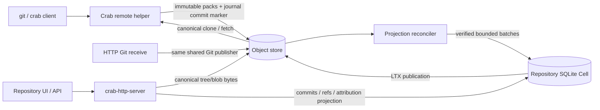
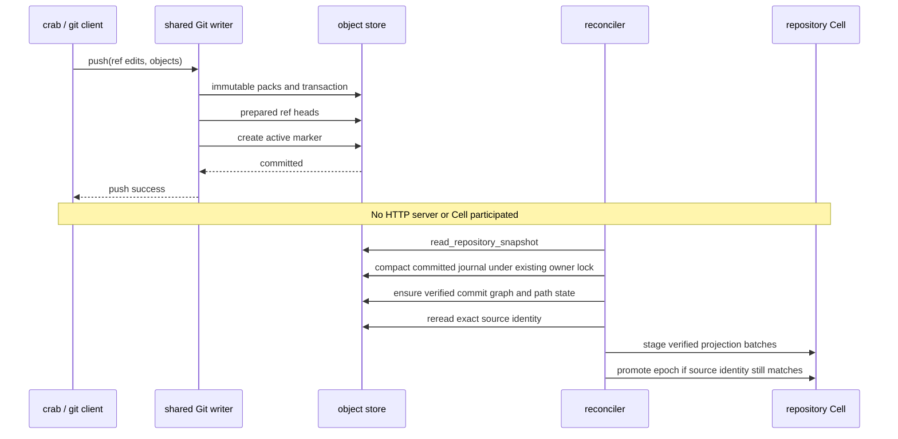
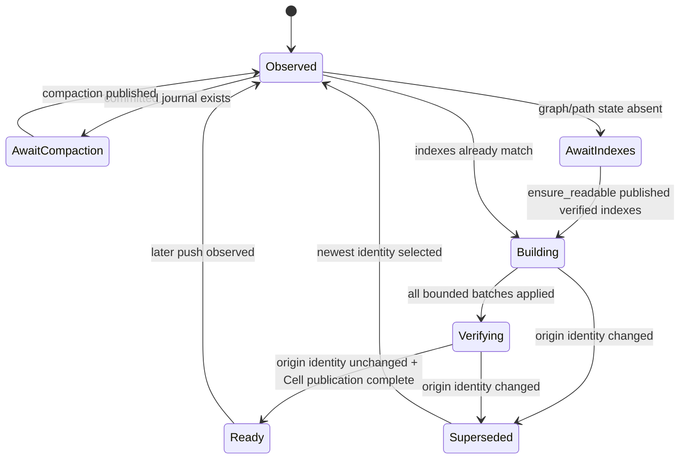
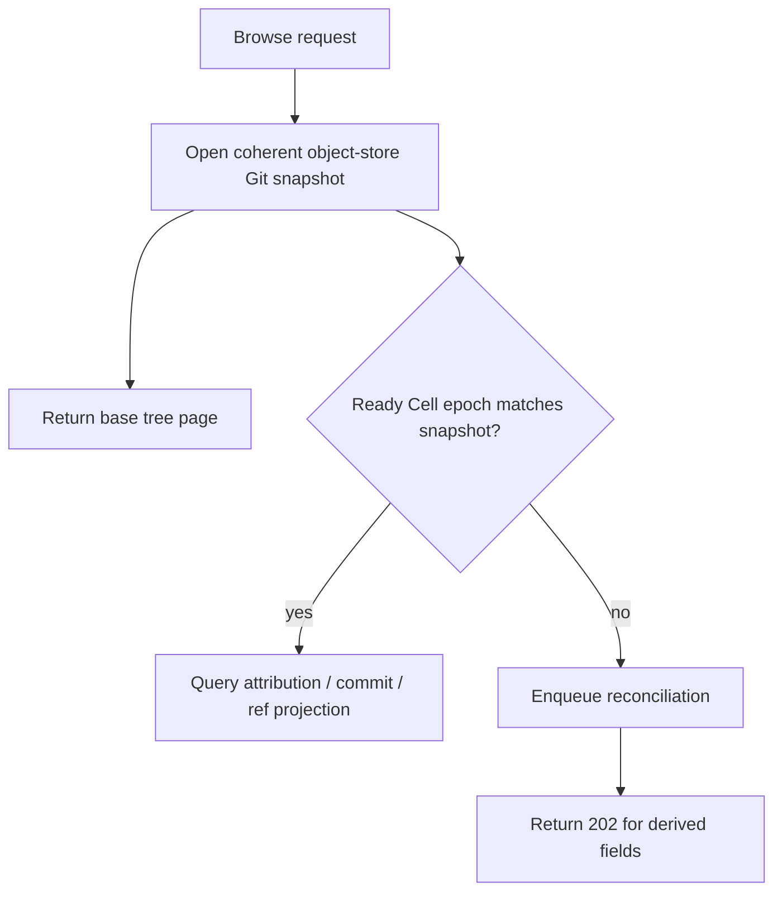

# Serverless Git and repository Cell projections

[Design index](README.md) · Target low-level design for rebuilding Git browse data after direct object-store writes.

## Decision

Crab keeps two deliberately separate systems:

1. **Serverless Git data plane.** `crab`, `git-remote-crab`, native Git receive,
   clone, fetch, and push read and publish directly through the object store.
2. **GitHub-like application plane.** `crab-http-server` owns the repository UI,
   collaboration APIs, search, and low-latency query projections in a repository
   SQLite Cell.

The first system must remain fully usable when every HTTP server and every Cell
is unavailable. The second system follows the first asynchronously.



The object-store repository snapshot is the Git authority. SQLite contains a
discardable, generation-bound read model. Deleting a Cell projection may make
the UI temporarily return `202 indexing`; it must not lose a ref, commit, tree,
or blob and must not affect clone, fetch, or push.

“Direct to object store” means using Crab's validated immutable-upload,
per-ref lease, journal, and conditional-publication protocol. Arbitrary PUTs of
Git or JSON files into a bucket are not a supported writer and cannot be made
safe by the projection reconciler.

## Authority and placement

| Data | Durable authority | SQLite Cell | Process-local cache |
| --- | --- | --- | --- |
| Ref transaction commit | Object-store ref-journal active marker | Never authoritative | No |
| Compacted refs and HEAD | Object-store manifest | Query projection | Short snapshot cache |
| Pack bytes and pack indexes | Object store | Do not copy | Verified range/block cache |
| Blob contents, LFS, Xet data | Object store | Do not copy | Bounded byte cache |
| Parsed commits and parents | Object-store Git objects / commit graph | Rebuildable rows | Optional decoded cache |
| Tree entry metadata | Object-store tree objects | Rebuildable rows | Optional decoded cache |
| Last-change attribution | Verified object-store path-state descriptor | Rebuildable trie projection | Bounded node cache |
| Issues, Pulls, reviews, settings | Repository Cell | Authoritative application rows | No independent authority |
| Cell recovery state | Object-store LTX graph | Working SQLite database | Local restored files |

Two consequences are non-negotiable:

- Git upload-pack, receive-pack, remote-helper, GC, repack, and history recovery
  never consult the repository Cell.
- Branch protection and merge publication may read application policy from the
  Cell, but their resulting Git update becomes real only through the existing
  object-store Git publication protocol.

### Why raw Git objects do not belong in the Cell

Putting packs or arbitrary blob bodies into SQLite would duplicate the largest
repository bytes into every LTX stream, amplify repack writes, consume the
5 GiB repository database limit, and make Git availability depend on Cell
recovery. It also discards the existing pack range-read and object locator work.

The Cell stores **decoded query keys and small values**. Blob payloads and pack
payloads remain in object storage. A node may keep a verified local object-byte
cache outside SQLite; that cache is evictable and is not LTX replicated.

### Boundary with the Celld-inspired storage stack

This design does not put every Celld capability into one crate. The ownership
map is:

| Capability | Crab owner | Role here |
| --- | --- | --- |
| Object-store client, conditional reads/writes, checksums | `crab-storage` | Reads Git manifests, packs, descriptors, and LTX objects directly |
| Git ref journal and remote compaction | `crab-write` + `crab-metadata` | Folds direct pushes into a coherent manifest before projection |
| SQLite WAL capture, LTX frames, recovery, follower publication | `crab-ltx` + `crab-cell-runtime` | Durably replicates the repository Cell, including projection epochs |
| Git object decoding and range reads | `crab-remote-git` | Rebuilds commit summaries and tree entries without a checkout |
| Paged/lazy filesystem views | `crab-vfs` and the projection tree hydrator | Not a second Git authority; only an optional local/read optimization |

Thus the earlier Celld gaps are closed at the correct layer: object-store
transport and remote Git compaction stay in the existing Crab data plane,
while LTX provides Cell durability and takeover. The projection builder only
joins those contracts. It does not reimplement an object-store client inside
the Cell and it does not require a paged VFS for correctness.

## Existing object-store commit protocol

A direct push does not necessarily update the compacted manifest immediately.
The existing shared writer publishes:

1. immutable pack, shard, transaction, and visibility evidence;
2. prepared per-ref heads;
3. one immutable active marker that atomically exposes the ref transaction; and
4. later, a generation owner folds committed transactions into the manifest by
   compare-and-swap.

`read_repository_snapshot` already materializes the compacted manifest plus the
committed ref journal into one coherent view. The projection design builds on
that contract; it must not incorrectly treat `manifest.generation` alone as the
current repository identity.

Current implementation anchors:

| Contract | Owner |
| --- | --- |
| Manifest Git identity and derived-index pointers | [manifest schema](../../crab-metadata/src/manifests.rs) |
| Coherent manifest + journal capture | [manifest store](../../crab-metadata/src/manifest_store.rs) |
| Direct-push journal commit and compaction | [shared journal writer](../../crab-write/src/journal.rs) |
| Generation-bound graph/path-state publication | [generation maintenance](../../crab-write/src/generation.rs) |
| Object-store Git object reads | [remote Git crate](../../crab-remote-git/src/lib.rs) |
| Cell migration and typed runtime binding | [repository Cells](../src/cells.rs) |



Push acknowledgement remains gated only by the Git commit marker and its
existing outcome recovery. Projection events, projection builds, and LTX
publication are not on the push critical path.

### Direct Crab push: end-to-end rebuild

The following is the supported path when the HTTP server is completely down:

```text
git push crab://bucket/team/repo
        │
        ▼
git-remote-crab / crab
        │  validates pack, ref lease, old OID, and object closure
        ▼
object store
  ├─ immutable pack/index and visibility evidence
  ├─ prepared ref heads
  └─ committed ref-journal active marker
        │
        ├─ clone/fetch/read: materialize manifest + journal directly
        └─ later maintenance: compact journal and publish graph/path-state
                                  │
                                  ▼
                          projection reconciler
                                  │
                                  ├─ commits + parents from split graph/Git objects
                                  ├─ refs from the compacted manifest
                                  ├─ tree entries from verified Git tree reads
                                  └─ attribution nodes/edges from path-state
                                  │
                                  ▼
                         hidden SQLite epoch → ready_epoch
```

`crab-http-server` is therefore a consumer of the repository, not a required
write endpoint. An HTTP Git receive request uses the same shared writer and
produces the same object-store evidence; it does not get a special projection
or a second Git database. A raw, unvalidated `PUT` of a pack, manifest, or JSON
ref file is not a supported Git writer: without the ref lease, immutable
visibility proof, and journal marker the reconciler must ignore it as an
authority and report the repository metadata as invalid.

For every successful direct push, the rebuild work is:

| Projection | Rebuild source | SQLite result |
| --- | --- | --- |
| refs | journal-free `RepositorySnapshot.manifest` | one epoch-scoped ref row per ref |
| commits/parents | generation-bound split commit graph, with verified commit reads for summaries | OID-deduplicated commit rows plus epoch ordinals |
| trees | verified Git tree objects reached from graph tree OIDs | complete directory-entry rows keyed by tree OID |
| attribution | generation-bound persistent path-state trie | shared nodes/edges plus one root per epoch/commit ordinal |

The reconciler never copies pack or blob bodies into SQLite. It records the
hashes and metadata needed to answer browse queries; full bytes continue to be
read from the object store by the canonical Git path.

## Source identity

The reconciler captures one source identity from `RepositorySnapshot` and keeps
the journal transaction list as a separate readiness gate:

```rust
struct SourceIdentity {
    source_token: String,
    manifest_generation: u64,
    manifest_etag: String,
    journal_state_digest: String,
    pack_index_hash: String,
    git_validation_digest: String,
    commit_graph_hash: Option<String>,
    path_state_hash: Option<String>,
    head_ref: Vec<u8>,
}
```

This is an internal server-owned type, not a public cross-crate API.

| Field | Purpose |
| --- | --- |
| `manifest_etag` + `journal_state_digest` | Detect any representational or journal change during a build |
| `journal.transactions` (outside the token) | Refuse readiness while direct pushes are waiting above the manifest |
| `generation` + `pack_index_hash` + `git_validation_digest` | Bind the projection to the compacted, validated Git snapshot |
| `commit_graph_hash` | Bind parsed commit order and parent data |
| `path_state_hash` | Bind attribution roots and trie nodes |

The implementation computes `source_token` as the Blake3 digest of the
canonical `SourceIdentity` with `source_token` empty, then stores that token
with the epoch. Only a journal-free, fully indexed compacted generation can become `ready`.
An empty repository is ready without graph or path-state descriptors; a
non-empty repository requires both.
When `journal.transactions` is non-empty, the reconciler first makes one bounded
attempt through the existing generation-owner compactor. Another owner holding
the lease is normal: the job yields and retries instead of creating a second
publication path.

The final promotion re-reads the repository snapshot from origin. It succeeds
only when all source fields still match. If a push commits during import, the
staged epoch is marked `superseded`; the previously ready epoch remains intact.

Object storage and SQLite do not share an atomic transaction. A push can commit
after that final read but before the Cell promotion. The promotion is still a
valid immutable projection of its captured source, but it may already be old.
Safety therefore comes from the API's mandatory source-identity comparison,
not from pretending the final read is a cross-store lock: an old epoch is never
served as the projection of a newer snapshot. The next hint, probe, or request
records the newer desired identity.

## Reconciliation without mandatory events

Events improve latency but cannot provide correctness. A CLI may push while the
HTTP fleet is down, a bucket notification can be dropped, and a node can crash
after observing a notification.

Reconciliation therefore has four wake-up paths:

| Trigger | Role | Correctness dependency |
| --- | --- | --- |
| Browse/API request | Compare the request's current Git snapshot with the ready projection and enqueue on mismatch | Yes for requested data |
| Adaptive catalog sweep | Probe due repositories assigned to the node's scheduler shard | Yes for eventual background convergence |
| Server startup | Resume durable `building`/`superseded` work; do not activate all Cells | Yes for interrupted work |
| Object-store or in-process hint | Move one repository's next probe to now | No; best effort only |

The anti-entropy sweep operates on catalog records, not bucket LIST results.
LIST is inventory assistance, not authority. Probe intervals are adaptive:

- repositories with recent reads or writes: seconds;
- warm repositories: minutes;
- cold repositories: hours or first request;
- building repositories: bounded exponential backoff in the node
  sweep; the Cell also records the last/next probe when it is active.

At 1K–10K active databases per node, the scheduler must bound concurrent origin
probes, Cell activations, and builders separately. A probe reads only the
repository snapshot identity. It does not activate SQLite unless work is due.

### Optional hint shape

An HTTP receive can enqueue a local hint after Git commit outcome is known.
Deployments with bucket notifications may translate writes to manifest and
ref-journal marker keys into the same hint:

```rust
struct GitProjectionHint {
    repository_id: RepositoryId,
    observed_at_ms: u64,
}
```

The hint intentionally carries no claimed generation or ref value. The
reconciler always reads origin state and validates it. The remote helper does
not need to know an HTTP endpoint, Cell owner, or SQLite schema.

## Repository Cell schema

The schema evolves the current development schema in place. It does not create
a `cells/v2` storage tree and does not add a legacy reader.

### Projection state and epochs

```sql
CREATE TABLE git_projection_epochs (
    epoch_id                  INTEGER PRIMARY KEY,
    state                     TEXT NOT NULL CHECK (
        state IN ('building', 'verifying', 'ready', 'superseded', 'failed')
    ),
    manifest_generation       INTEGER NOT NULL,
    manifest_etag             TEXT NOT NULL,
    journal_state_digest      TEXT NOT NULL,
    pack_index_hash           TEXT NOT NULL,
    git_validation_digest     TEXT NOT NULL,
    commit_graph_hash         TEXT,
    path_state_hash           TEXT,
    head_ref                  BLOB NOT NULL,
    next_commit_ordinal       INTEGER NOT NULL DEFAULT 0,
    next_attribution_layer    INTEGER NOT NULL DEFAULT 0,
    started_at_ms             INTEGER NOT NULL,
    verified_at_ms            INTEGER,
    source_token               TEXT NOT NULL UNIQUE
);

CREATE TABLE git_projection_state (
    singleton                   INTEGER PRIMARY KEY CHECK (singleton = 1),
    ready_epoch                 INTEGER,
    desired_source_token        TEXT,
    desired_manifest_generation INTEGER,
    desired_manifest_etag       TEXT,
    desired_journal_digest      TEXT,
    last_probe_at_ms            INTEGER NOT NULL DEFAULT 0,
    next_probe_at_ms            INTEGER NOT NULL DEFAULT 0,
    last_error_code             TEXT,
    FOREIGN KEY (ready_epoch) REFERENCES git_projection_epochs(epoch_id)
);
```

`git_projection_state.ready_epoch` is the single visibility pointer. Import
batches commit beneath a `building` epoch and are invisible to API queries.
Promotion changes the pointer in one SQLite transaction. A partially imported
or LTX-unpublished epoch can never become query-visible.

### Refs and commits

Git OIDs and paths are binary values. The schema must not assume UTF-8 path
names; the current repository format uses SHA-1 OIDs, while the column shape
does not prevent a future hash algorithm.

```sql
CREATE TABLE git_projection_refs (
    epoch_id                  INTEGER NOT NULL,
    name                      BLOB NOT NULL,
    target_oid                BLOB NOT NULL,
    peeled_oid                BLOB,
    PRIMARY KEY (epoch_id, name),
    FOREIGN KEY (epoch_id) REFERENCES git_projection_epochs(epoch_id)
);

CREATE TABLE git_commits (
    oid                       BLOB PRIMARY KEY,
    tree_oid                  BLOB NOT NULL,
    author_name               BLOB NOT NULL,
    author_email              BLOB NOT NULL,
    author_time               INTEGER NOT NULL,
    author_tz_offset_seconds  INTEGER NOT NULL,
    committer_name            BLOB NOT NULL,
    committer_email           BLOB NOT NULL,
    committer_time             INTEGER NOT NULL,
    committer_tz_offset_seconds INTEGER NOT NULL,
    message_preview           BLOB NOT NULL,
    message_truncated         INTEGER NOT NULL CHECK (message_truncated IN (0, 1)),
    encoded_bytes             INTEGER NOT NULL
);

CREATE TABLE git_commit_parents (
    commit_oid                BLOB NOT NULL,
    parent_index              INTEGER NOT NULL,
    parent_oid                BLOB NOT NULL,
    PRIMARY KEY (commit_oid, parent_index),
    FOREIGN KEY (commit_oid) REFERENCES git_commits(oid)
);

CREATE TABLE git_epoch_commits (
    epoch_id                  INTEGER NOT NULL,
    ordinal                   INTEGER NOT NULL,
    commit_oid                BLOB NOT NULL,
    PRIMARY KEY (epoch_id, ordinal),
    UNIQUE (epoch_id, commit_oid),
    FOREIGN KEY (epoch_id) REFERENCES git_projection_epochs(epoch_id),
    FOREIGN KEY (commit_oid) REFERENCES git_commits(oid)
);
```

Commit bodies are deduplicated by immutable OID. Epoch membership and stable
ordinals remain separate because attribution descriptors bind ordinals to one
commit-graph identity. `message_preview` has a fixed byte cap; an oversized or
full commit message is read and verified by OID from object storage on the
commit-detail route. Arbitrary commit payload size therefore cannot dominate
the Cell or an LTX batch.

### Trees

```sql
CREATE TABLE git_trees (
    tree_oid                  BLOB PRIMARY KEY,
    state                     TEXT NOT NULL CHECK (state IN ('building', 'ready')),
    entry_count               INTEGER NOT NULL,
    encoded_bytes             INTEGER NOT NULL,
    last_used_at_ms           INTEGER NOT NULL
);

CREATE TABLE git_tree_entries (
    tree_oid                  BLOB NOT NULL,
    name                      BLOB NOT NULL,
    mode                      INTEGER NOT NULL,
    object_oid                BLOB NOT NULL,
    object_kind               INTEGER NOT NULL,
    PRIMARY KEY (tree_oid, name),
    FOREIGN KEY (tree_oid) REFERENCES git_trees(tree_oid)
) WITHOUT ROWID;

```

Rows contain directory metadata, not blob contents. Tree OIDs are immutable, so
unchanged subtrees are shared across projection epochs. The builder verifies
the decoded tree bytes against `tree_oid` before inserting rows. A tree becomes
query-visible only after all pages are present, `entry_count` matches, and the
parent row changes to `ready` in a durable command.

The target policy is **selective**, not a second complete copy of repository
history: build current ref roots and a bounded recent-history window first;
serve a miss directly from object storage and optionally enqueue that immutable
tree OID for insertion; evict cold trees in bounded batches. The implementation
uses that bounded selection today. Selective tree hydration is a cache
optimization, not an epoch-readiness requirement: a missing or over-budget tree
always remains available through the verified object-store read path.

### Attribution

The Cell representation mirrors the persistent path-state trie rather than
creating one `(commit, full_path)` row for every historical file. Copy-on-write
nodes share unchanged subtrees.

```sql
CREATE TABLE git_attribution_nodes (
    node_hash                 BLOB PRIMARY KEY,
    last_change_ordinal       INTEGER,
    encoded_bytes             INTEGER NOT NULL
);

CREATE TABLE git_attribution_edges (
    parent_hash               BLOB NOT NULL,
    component                 BLOB NOT NULL,
    child_hash                BLOB NOT NULL,
    PRIMARY KEY (parent_hash, component),
    FOREIGN KEY (parent_hash) REFERENCES git_attribution_nodes(node_hash),
    FOREIGN KEY (child_hash) REFERENCES git_attribution_nodes(node_hash)
) WITHOUT ROWID;

CREATE TABLE git_attribution_roots (
    epoch_id                  INTEGER NOT NULL,
    commit_ordinal            INTEGER NOT NULL,
    root_hash                 BLOB NOT NULL,
    PRIMARY KEY (epoch_id, commit_ordinal),
    FOREIGN KEY (epoch_id) REFERENCES git_projection_epochs(epoch_id),
    FOREIGN KEY (root_hash) REFERENCES git_attribution_nodes(node_hash)
);
```

Node hashes are recomputed and checked during import. A last-change lookup is a
root lookup plus one indexed edge lookup per path component. It performs no Git
history walk and no object-store request after the Cell is warm.

## Builder pipeline



The implementation uses the existing verified object-store metadata before
inventing another Git walker:

1. Read `RepositorySnapshot` from the raw authoritative store.
2. If journal transactions exist, request one bounded compaction pass and yield.
3. Re-read and require a journal-free snapshot.
4. Run the existing `ensure_readable` generation-owner path when commit graph
   or path state is absent.
5. Re-read; capture all source identity fields.
6. Stream and verify commit-graph records and path-state layers.
7. Select current ref tips and a bounded recent commit window for tree
   hydration. Read those Git trees through `crab-remote-git`, verify each OID,
   decode raw names, and emit complete-tree batches. Older or evicted trees
   remain on the direct object-store read path and may be hydrated later by
   their immutable OID.
8. Apply idempotent batches through typed Cell commands.
9. Re-read origin and compare the full captured identity.
10. Verify row counts, ordinal continuity, root reachability, and foreign keys.
11. Promote `ready_epoch` through one durable Cell command.

The actor never waits for object-store I/O while holding a SQLite transaction.
The builder gathers and validates one bounded batch outside the actor, then
sends a command containing only the rows and expected epoch cursor.

The current implementation exposes one bounded Cell command rather than a
public command enum:

```rust
struct ProjectionBatch {
    operation: u8, // begin, refs, commits, trees, attribution, promote, supersede, collect
    epoch_id: u64,
    source: Vec<u8>,  // canonical SourceIdentity JSON
    payload: Vec<u8>, // one bounded operation payload
}
```

`Begin` is idempotent by `source_token`: an existing ready epoch is reused and
an interrupted building epoch is resumed. Every later operation checks both
the epoch and source token. Rows are inserted by OID/hash with epoch membership
and cursor state kept separately; replay therefore cannot expose a half-built
epoch. `Promote` is the only operation that changes `ready_epoch`, and
`Supersede` leaves the previous ready epoch untouched. Each Cell command is
covered by the runtime's SQLite capture and LTX publication barrier. A
recovered owner resumes from the durable epoch state rather than guessing from
partially imported tables.

### Batch limits

The repository Cell admits a 64 MiB capture and a 5 GiB database. The current
projection command is registered with a 768 KiB input bound; its wire payload
uses a 32 KiB source identity and a 700 KiB JSON batch, at most 256 logical
rows, and at most 128 SQL statements per runtime SQL call. Commit batches are
64 graph records, attribution batches are 64 nodes/roots and 512 edges, and a
tree payload is capped at 640 KiB. The attribution query is split below the
64 KiB query descriptor bound (48 KiB JSON chunks) before it reaches the Cell.

These bounds are intentionally lower than the runtime maximum. The lower row,
wire, SQL, or remaining-database budget wins. A future binary codec may raise
throughput only after the operation descriptor, capture admission, WAL growth,
transaction latency, and LTX publication costs are re-qualified together.
Reaching the repository database limit leaves the prior ready epoch available
and reports `projection_capacity_exceeded`.

Each tree command is atomic for a complete tree row. A tree that cannot fit the
current row bound causes the new epoch to fail and the old ready epoch to stay
visible; the direct object-store tree route remains available. The next
capacity phase may split one tree across durable pages, keeping
`git_trees.state = 'building'` until the final count and object identity check
is durable. A reader must never paginate a partial import.

## Incremental updates

| Git change | Reuse | Work |
| --- | --- | --- |
| Fast-forward branch push | Existing commit/tree/node rows | Import new commits, changed trees, new attribution layer, replace projected refs |
| New tag or branch to known commit | All immutable rows | Replace projected refs and epoch membership |
| Ref deletion | All immutable rows | Replace projected refs |
| Force push | OID-addressed commit/tree rows that remain reachable | Build a new epoch and new attribution roots; never mutate ready roots in place |
| Repack with identical Git graph | Parsed commit/tree/node rows after exact semantic verification | Rebind source storage identity; Git object locator remains object-store-owned |
| History recovery | Nothing assumed until recovered manifest is validated | Build a new epoch from the recovered source identity |

The first deliverable may always create a new epoch while still deduplicating
immutable rows by OID/hash. Prefix detection and layer-only attribution import
are optimizations, not correctness requirements. There is no dual reader for an
old Cell schema because the Cell data is new and rebuildable.

## API read rules

The base tree route keeps its direct object-store path. A stale or missing Cell
must never turn repository navigation into a blank page.



| Endpoint class | On missing/stale projection |
| --- | --- |
| Tree entries and blob bytes | Serve from `crab-remote-git` |
| Attribution | `202 indexing` with `Retry-After`; once a Cell is configured, never hide a projection miss with a history walk |
| Commit detail for a known OID | Direct verified object read is allowed |
| Commit history/search | Use the existing bounded `crab-remote-git` graph/tree operation; the projection currently accelerates attribution and commit summaries, not every history/search route |
| Branch/tag list | Object-store snapshot is authoritative; projection may accelerate only after identity match |
| Git protocol | Ignore Cell completely |
| Merge/protected push decision | Revalidate current object-store ref and authoritative Cell policy; never trust projected refs alone |

Before using a ready attribution epoch, the HTTP path verifies that the
generation-bound path-state descriptor named by the current manifest still
exists and passes its content-addressed descriptor validation. A missing or
invalid descriptor returns `503 path_state_corrupt`, schedules generation
maintenance, and does not let a stale SQLite row hide origin corruption.
Maintenance clears the invalid manifest pointer through CAS, rebuilds the
descriptor and layers from verified Git objects, then the projection
reconciler publishes a new source token. This check is limited to the small
descriptor; it does not copy path-state layers into every request.

Every projection response repeats a snapshot token:

```json
{
  "manifest_generation": 42,
  "git_validation_digest": "<64 hex>",
  "commit": "<40 hex>",
  "directory_oid": "<40 hex>"
}
```

The UI merges delayed attribution only when the token, path, and entry OID still
match the visible tree. An explicit historical commit remains immutable, but the
initial implementation still requires the projection epoch used by the tree
response; cross-generation reuse can be added only with an OID reachability
proof.

The existing short repository-handle cache may produce bounded freshness rather
than a linearizable “latest” view. APIs that claim current-ref freshness perform
an origin snapshot check; immutable commit/tree routes can use the request's
pinned snapshot token.

## Crash and race behavior

| Failure | Result | Recovery |
| --- | --- | --- |
| HTTP fleet is down during direct pushes | Git pushes remain committed | First request or sweep observes journal/manifest drift |
| Hint is lost or duplicated | No correctness effect | Anti-entropy probe; jobs coalesce by repository and desired identity |
| Builder crashes between batches | `ready_epoch` unchanged | New owner restores Cell and resumes durable cursor |
| Push commits before final source check | Staged epoch does not promote | Mark superseded and build the newest identity |
| Push commits after final check | Old epoch may promote but cannot match the new request snapshot | Record drift and build the newest identity |
| Manifest compaction changes representation | Exact final identity check fails safely | Re-open; reuse verified immutable rows where eligible |
| LTX publication fails after local SQLite commit | No success or cursor is exposed | Cell publication recovery resolves the command before more writes |
| Path-state descriptor is corrupt | No projection is promoted | Fence the source, return 503 for attribution, run existing verified rebuild |
| Cell is deleted | Git is unaffected | Recreate empty Cell and import from object storage |
| Database capacity is exhausted | Old ready epoch remains readable | Surface operator metric; retain direct tree/blob service |

## Scheduling and ownership

One repository Cell owner serializes projection commands with collaboration
commands. The separate generation-owner lease serializes object-store commit
graph/path-state publication. These are different authorities:

```text
generation owner: object-store Git derived-index publication
Cell owner:        SQLite projection mutation and LTX publication
```

The reconciler may run on any node, but it routes typed batches to the current
Cell owner. It must not hold the generation-owner lease while waiting for a Cell
publication: complete and release object-store publication first, then import.
This avoids a distributed lock cycle.

Per node, use separate bounded admissions for:

- cheap source probes;
- object-store index construction;
- tree decoding/import CPU;
- Cell batch commands; and
- LTX upload/publication.

Fair scheduling is by repository ID with one active builder per repository.
Large repositories yield after every batch so 100 small repositories are not
blocked behind one multi-gigabyte repository.

## Retention and collection

Keep the ready epoch, every in-progress epoch, and one bounded previous-ready
epoch for diagnosis. Collection proceeds in small Cell commands:

1. delete expired epoch-scoped refs, commit membership, and attribution roots;
2. mark commit OIDs and node hashes reachable from retained epochs;
3. delete unreferenced commit, parent, node, and edge rows in bounded pages; and
4. evict cold selective tree rows until the configured byte budget is met.

The ready pointer is read in the same transaction that selects collection
roots. Collection never follows object-store LIST and never deletes canonical
Git objects. Object-store Git GC continues to use its existing manifest,
journal, lease, and grace-period contracts independently.

## Observability

Required metrics:

```text
crab_git_projection_probe_seconds{result}
crab_git_projection_lag_generations
crab_git_projection_lag_seconds
crab_git_projection_build_seconds{phase,result}
crab_git_projection_batch_rows{kind}
crab_git_projection_batch_bytes{kind}
crab_git_projection_superseded_total
crab_git_projection_ready
crab_git_projection_sqlite_bytes
crab_git_projection_origin_reads_total{kind}
```

Logs carry repository UUID, source generation, source digest prefix, epoch ID,
phase, cursor, and error code. They never include credentials, blob contents,
commit messages, or raw non-UTF-8 paths.

Operator status distinguishes:

- Git repository healthy, projection ready;
- Git repository healthy, projection catching up;
- Git repository healthy, projection over capacity; and
- canonical Git metadata corrupt or unavailable.

Only the last state affects direct Git health.

## Alternatives rejected

| Alternative | Why it is not the target |
| --- | --- |
| Make SQLite the Git authority | Breaks serverless clone/push and couples Git durability to Cell ownership and recovery |
| Dual-write every push to object store and Cell | Introduces an impossible cross-store atomic commit or makes push wait for the HTTP fleet |
| Rebuild only from notifications | Lost events and fleet downtime leave permanent drift |
| Store complete packs/blobs in SQLite | Duplicates repository bytes into WAL/LTX and invalidates the existing range-read architecture |
| Eagerly copy every historical tree | Tree count grows with history and can exceed the Cell budget even when current browsing is small |
| Keep attribution only in a process cache | Cold starts and failover repeat the history cost and do not share completed work |
| Build directly over a non-empty ref journal | Requires a second overlay-aware graph/path-state format and complicates final fencing; bounded compaction already supplies one canonical generation |

The selected design pays one asynchronous rebuild cost per committed Git
generation, keeps the Git commit protocol unchanged, and uses SQLite only where
indexed relational queries materially reduce UI latency.

## Delivery sequence

1. Add projection tables to the current repository Cell migration and typed
   command/query contracts.
2. Implement source identity capture from `RepositorySnapshot`, including
   committed-journal detection.
3. Import the existing verified commit graph and path-state descriptor into a
   hidden epoch; add selective complete-tree import through `crab-remote-git`.
4. Add final origin revalidation and atomic ready-epoch promotion.
5. Route attribution and commit summaries to the matching ready epoch; retain
   bounded direct object-store commit-history, tree, and blob reads until their
   Cell cursors are qualified.
6. Add request-driven enqueue, adaptive catalog probing, and optional hints.
7. Run adaptive catalog-driven anti-entropy, resume interrupted epochs, and
   collect immutable rows while retaining the ready and previous-ready epochs.
8. Add incremental prefix reuse and request-driven lazy tree hydration after
   correctness and capacity qualification.

This is a hard cut for new Cell projection data. No existing Cell Git projection
is migrated, no `cells/v2` prefix is introduced, and native bucket Git data is
not rewritten. Existing object-store Git formats continue to be the rebuild
source.

## Acceptance tests

| Test | Required proof |
| --- | --- |
| Serverless independence | Stop HTTP/Cell fleet; clone, push, and fetch through `crab`; restart and reach ready projection |
| Native receive parity | Push through HTTP Git receive and through remote helper; both converge to identical rows |
| Missed event | Disable all hints, push directly, and converge by request and by sweep |
| Concurrent push | Pause each build phase, push, resume, and prove an old epoch is never served for the new snapshot, including the final-check race |
| Journal handoff | Observe committed active marker before manifest compaction; base Git is visible and projection waits safely |
| Fast-forward/tag/delete/force-push | Projected refs, commits, and attribution equal `git`; tree responses equal `git` through the canonical direct path, with selective tree-cache rows checked separately |
| Non-UTF-8 paths | Tree pagination and attribution preserve exact path bytes |
| Crash recovery | Kill after every durable cursor; restore from LTX and resume without duplicate visibility |
| Cell loss | Delete local and remote Cell state only; rebuild from Git object-store data |
| Corruption | Bit-flip graph, path-state, tree, and LTX inputs; no corrupt epoch becomes ready |
| Capacity | Qualify small, medium, and large repositories under the 5 GiB DB and node resource tiers |
| Load | Sustain aggregate 1,000 TPS while background builders obey latency and admission budgets |

The release gate compares projected refs, parent order, tree entries, and
last-change commits against native Git for the real-repository corpus. A passing
unit test or successful SQLite import is not sufficient; the serverless push to
visible browser result must reach the repository's Level 3 end-to-end gate.
