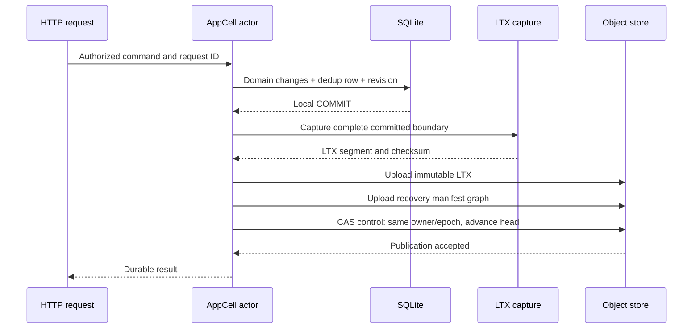

# Object storage and commit publication

[Design index](README.md) · Target contract; implemented subset tracked in current implementation.

This document owns the durable control and publication contract.
[Ownership](ownership-and-load-balancing.md) defines who may propose a transition;
[SQLite execution](sqlite-and-data-model.md) produces the candidate state;
[recovery](recovery-and-retention.md) consumes only the published graph.

## Object-store layout and control protocol

### Layout

The following paths are relative to the existing configured storage root:

```text
.crab/http-server/v1/catalog.json                existing catalog
.crab/http-server/v1/auth/...                    existing identity state
.crab/http-server/v1/nodes/<session>.json         discovery heartbeat
.crab/http-server/v1/cells/<repository-uuid>/
  control.json                                  authoritative CAS record
  generations/<generation-uuid>/
    epochs/<epoch>/
      ltx/<min-txid>-<max-txid>-<digest>.ltx      immutable captured data
      snapshots/<txid>-<digest>.ltx              full database LTX snapshot
    manifests/<digest>.json                    immutable recovery manifests
  backups/<backup-id>.json                      retained recovery roots
  migration/<migration-id>/...                  native schema/code migration evidence

<existing-repository-prefix>/...                existing Git and app/v1 data
```

Cells live under UUID-based global paths so renames and Git placement changes do
not silently change their identity. This replaces the earlier conversational
example of placing cell data under the public repository prefix. Configuration
still uses one physical storage root and one credential resolution path.

Epoch numbers are never reused. Generation changes denote explicit restore or
database replacement boundaries; they do not allow the control record's epoch
counter to move backward. The control record is not deleted during idle release.
Deletion requires a durable tombstone so a stale process cannot recreate an
epoch-one cell.

### Authoritative control record

Illustrative serialized value; provider ETag/version is returned separately:

```json
{
  "schema_version": 1,
  "repository_id": "01991c9d-77c0-7d67-bf60-aef10eb9f081",
  "generation": "01991c9d-77c0-7d67-bf60-aef10eb9f082",
  "revision": 84,
  "epoch": 19,
  "state": "serving",
  "owner": {
    "session_id": "01991c9d-77c0-7d67-bf60-aef10eb9f083",
    "peer_endpoint": "https://10.42.3.17:8790",
    "lease_sequence": 12
  },
  "published": {
    "epoch": 19,
    "txid": "000000000000002a",
    "database_checksum": "f000000000000123",
    "app_revision": 142,
    "manifest": "generations/01991c9d-77c0-7d67-bf60-aef10eb9f082/manifests/manifest-digest.json"
  },
  "format": {
    "manifest_version": 1,
    "ltx_encoding": "qualified-frame-v1",
    "sql_schema_version": 1,
    "minimum_reader_generation": 1
  }
}
```

The example checksum and manifest name are placeholders. Encodings such as
`qualified-frame-v1` are Crab capability identifiers to define during format
qualification, not official LTX version names.

`state` describes activation (`recovering`, `serving`, `draining`, `idle`,
`tombstoned`). There is no storage-backend mode: every cell uses SQLite/LTX.
Native release-migration progress belongs in migration evidence, outside runtime routing.

`revision` increases on every CAS, including renewal, to avoid repeating identical
control bytes. A pure heartbeat preserves the head. A publication preserves
ownership. A takeover increments epoch and preserves the exact published head.
All three operations serialize through this one object.

### Recovery manifests

A manifest contains repository UUID, generation, source epoch, exact end
position, SQL schema/capabilities, a snapshot reference, and bounded ordered LTX
references needed after that snapshot. Every reference includes key, length,
content digest, TXID range and expected checksum continuity. Object-store ETags
are CAS tokens, not content hashes.

To keep both publication and restore bounded, use immutable manifest pages when
a manifest exceeds its reference limit. The root names these pages by digest.
Do not grow one JSON object indefinitely or require one predecessor fetch per
transaction over the repository's entire history. Snapshot/compaction rebuilds
the recovery description into a bounded graph.

A recovery manifest is immutable. A new commit uploads its changed segment and
new manifest graph before updating `control.json`. Existing immutable manifest
pages can be reused. The authoritative pointer update is last.

The exact manifest page size, limits and encoding are format decisions to freeze
with fixtures in the first implementation. They must be defined before data is
written, not silently inferred by readers.

### Store contract

Require linearizable conditional updates and strongly consistent origin reads
for each control key, plus durable successful writes and correct immutable/range
reads. Use the raw authoritative store; caching, asynchronous replicas, staging
overlays and CDNs cannot mediate control reads.

Crab's existing `Store::update` deliberately does not retry an ambiguous update.
The caller must reread and reconcile; a network error may follow a successful
remote change. `create_strict` rejects an existing object. Its retry behavior
also means an eventual conflict can follow a lost successful create response;
the caller must inspect identity and state before classifying the attempt.
See [storage primitives](../../crab-storage/src/store.rs).

Every provider adapter must preserve conditional semantics. Startup diagnosis
must reject a backend that ignores a failed precondition. A temporary inability
to prove the contract keeps the new application subsystem unready; it is not a
reason to silently choose an unsafe storage path.

LIST is not part of commit or restore authority. Listing is useful for inventory
and collection; missing entries delay collection instead of losing correctness.
Restore fetches only the explicit graph rooted at the control record.

## Commit publication and response gating

### Publication sequence



For the first version, one cell publishes one logical mutation batch at a time.
Every batch contains the domain changes, request result, and application revision
needed for replay. An HTTP handler's return value stays private until the
publication coordinator confirms that the exact local commit is covered.

The CAS checks the version obtained from a record validated as owned by the
current session/epoch. Its replacement preserves all control invariants and
advances only from the expected predecessor head to a verified successor.
Strict schema validation rejects head regression and invalid generation changes.

### Why takeover cannot lose a published commit

Let `C` be the mutation publication CAS and `T` be the takeover CAS. Both update
the same authoritative object.

| Store order | Consequence |
| --- | --- |
| `C` wins before `T` | The old takeover token fails; its retry reads and preserves the head containing the commit |
| `T` wins before `C` | The old owner's publication token fails; its uploaded segment is unreferenced and cannot enter the new lineage |
| `C` succeeds but its response is lost | A fresh read or successor recovery establishes whether the request's durable result is present |
| Old process resumes after `T` | It can upload orphan bytes, but it cannot advance the current head with its old epoch |

This is the linearization argument for application mutation publication. It
depends on conditional-update semantics, immutable dependency integrity, and
takeover preserving the head. It does not depend on Kubernetes terminating the
old process promptly.

A process can receive a successful `C` response after takeover has already
happened. That commit is still durable because `T` inherited it. The process may
return the already proven result, but it cannot initiate new operations under
the old activation. There is no requirement to retract a proven success because
ownership changed after its linearization point.

### Ambiguous outcomes

On an upload timeout, retry the same immutable content identity and verify
existing bytes if necessary. On a control-update timeout, stop application
admission for that cell and reread origin state.

- If the same owner/epoch remains and the published graph covers the exact batch,
  mark it published.
- If the record remains at the expected predecessor, retry the same transition
  with its fresh token after validating authority.
- If a successor owns the cell, ask that owner to resolve the durable request
  record; do not replay a local SQL transaction into its database.
- If the result cannot be established, return a generic retryable indeterminate
  error. Continue tracked reconciliation within bounded runtime budgets.

A greater TXID alone is not proof: generation, epoch lineage, checksums and
request identity must match. Failed publication never licenses skipping a
missing segment and publishing a later local state.

### Response and cancellation rules

The publication barrier covers successful responses, application reads, and
errors whose content depends on tentative state. A generic timeout response may
be returned before resolution if it discloses no tentative result and clearly
states that the outcome is unknown.

Serialize or otherwise validate the bounded domain result before publication
where practical. Keep its stable replay representation in the same transaction.
Do not return success early because an optimistic UI already shows the change.

When a client disconnects before a command is accepted, cancel it normally.
After local commit, the tracked actor resolves publication or fencing even if
the response waiter disappears. The current middleware's 30-second timeout
remains a waiting budget, not permission to abandon a committed transaction.

Streaming application responses are excluded initially: materialize bounded
metadata responses behind the barrier. Git, LFS and asset byte streams retain
their existing stream ownership. An asset stream can use a published immutable
asset reference without keeping a SQLite read transaction open for the download.
