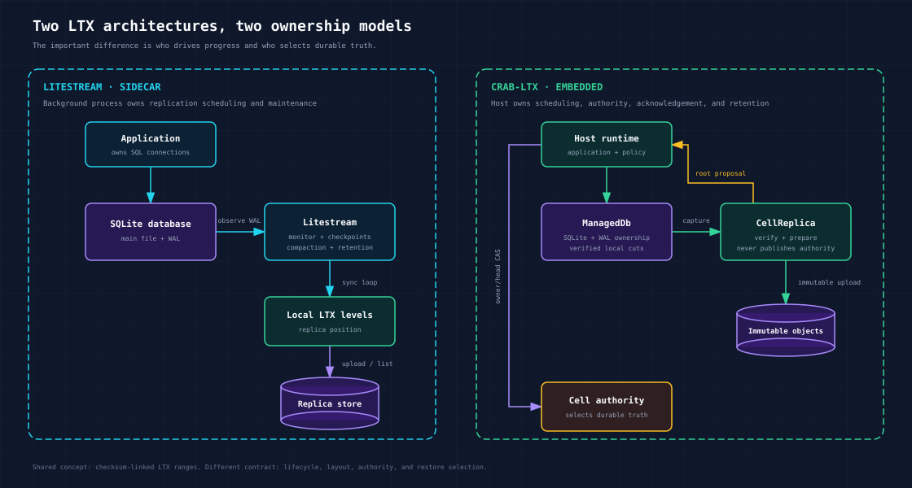
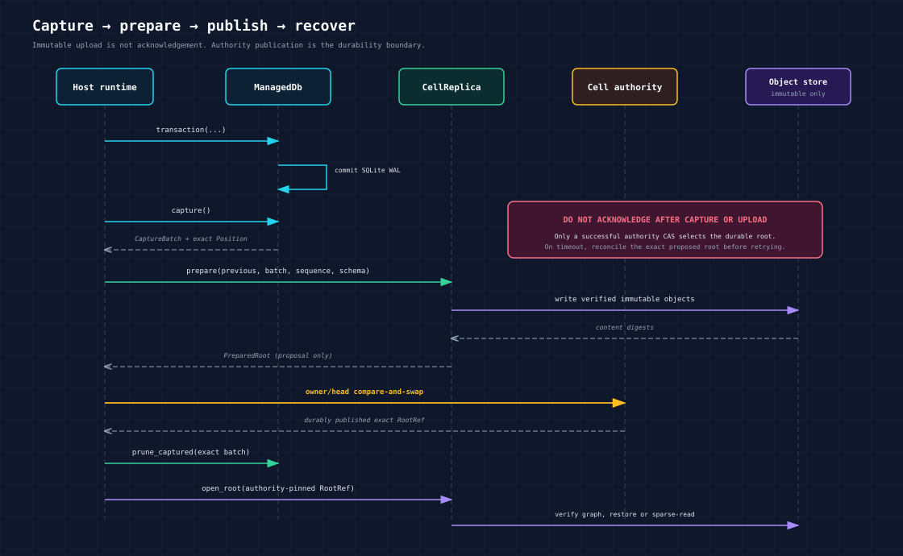

# `crab-ltx`

`crab-ltx` is an embeddable Rust library for capturing SQLite WAL commits as
checksum-bearing LTX files and recovering an exact, verified database state.
With the optional `replica` feature, it can prepare immutable Crab Cell roots
in object storage and open them for exact restore or sparse SQL.

It is **not Litestream packaged as a Rust crate**. Litestream is a standalone
sidecar that monitors a database and operates its replication lifecycle.
`crab-ltx` runs inside the application and leaves scheduling, storage
configuration, authority, retention, and request acknowledgement to its host.



## Choose the right tool

Use Litestream when you want an operational SQLite backup tool with a CLI,
configuration file, background synchronization, provider integrations,
compaction, snapshots, and retention.

Use `crab-ltx` when a Rust service must:

- execute SQLite writes and capture their exact WAL commit boundary in one
  owned session;
- validate every LTX segment before selecting it for recovery;
- publish immutable objects behind an application-specific authority CAS;
- restore a caller-selected state without listing a bucket for “latest”; or
- lazily open an authenticated Cell root and hydrate it through SQLite.

Do not use `crab-ltx` as a drop-in Litestream client or point the two systems at
the same replica prefix. They share LTX concepts, not a publication protocol.

## Litestream comparison

This comparison was checked against the official
[Litestream v0.5.17 release](https://github.com/benbjohnson/litestream/releases/tag/v0.5.17),
its [`DB`](https://github.com/benbjohnson/litestream/blob/v0.5.17/db.go),
[`Replica`](https://github.com/benbjohnson/litestream/blob/v0.5.17/replica.go),
and [`Store`](https://github.com/benbjohnson/litestream/blob/v0.5.17/store.go)
implementations, and the official
[How it works](https://litestream.io/how-it-works/) guide.

| Concern | Litestream v0.5.17 | `crab-ltx` |
| --- | --- | --- |
| Deployment | Standalone process next to the application | Library linked into a Rust process |
| Write ownership | Observes an application-owned SQLite database through SQLite and WAL files | All supported SQL writes pass through an exclusive `Db` session |
| Progress | Background monitor loops sync WAL, upload LTX, compact levels, create snapshots, and enforce retention | The host explicitly calls `capture`, `checkpoint`, `prepare`, compaction, and pruning |
| Remote state | `ReplicaClient` lists LTX levels and selects ranges for restore | `CellReplica` opens an exact `RootRef`; it never discovers truth by listing objects |
| Durability boundary | A successful replica sync advances Litestream's replica position | Uploaded immutable objects are only a proposal; the host must publish the root with Cell authority before acknowledging |
| Storage providers | Litestream owns its CLI/config provider integrations | The host supplies a `crab-storage` `Store`; `crab-ltx` binds it to Cell paths with `CellStorageLayout` |
| Restore selection | Latest, TXID, or timestamp is resolved from replica LTX files | The caller supplies a verified plan or an authority-pinned Cell root |
| Retention | Built-in snapshot and LTX retention monitors | Remote pinning, retention, and garbage collection are host policy |
| Format | Uses `superfly/ltx` v0.5.2 | Writes checksum-bearing LTX v3 files using the v0.5.2 sized-block layout and reads that layout plus older checksummed LZ4-frame files |

The matching LTX dependency means current Litestream can parse the sized-block
encoding used here. It does **not** prove end-to-end interoperability: Crab adds
its own BLAKE3-bound segment metadata, authenticated Cell directory, immutable
root schema, and authority protocol. External Litestream/Celld golden-vector
qualification remains a release gate. See [UPSTREAM.md](UPSTREAM.md) for source
lineage and the exact compatibility boundary.

For reproducible local capture, compaction, and restore measurements against
the pinned Celld implementation, see the
[performance harness](perf/README.md).

## Lifecycle

The embedding runtime owns the steps around the library calls. In particular,
`prepare` does not publish a mutable head and `capture` does not mean remote
durability.



The safe write path is:

1. Run a transaction through `Db`.
2. Call `capture()` to produce one or more ordered local LTX segments.
3. Upload and verify them with `CellReplica::prepare()`.
4. Publish the returned root through the embedding runtime's owner/head CAS.
5. Only after that CAS is durable, acknowledge the mutation and prune the exact
   captured batch.

Recovery reverses the boundary: load the authority-pinned `RootRef`, verify its
complete immutable object graph, then restore it or activate sparse SQL.

`VerifiedRoot::open_read_only` opens a fresh immutable SQLite view over the
exact root's authenticated pages. Call this synchronous opener on a SQLite
worker, separately from the LTX blocking-I/O pool used by page fetches.
The private local file is an empty placeholder; page bodies use the existing
8 MiB shared bounded cache and the managed 64 KiB SQLite cache. No capture
session, WAL, checksum sidecar, or writable database handle is created.
SQLite's immutable VFS flag and read-only handle enforce the boundary even
if a caller disables `query_only`. The owned view closes SQLite before
removing its placeholder. A dispatched opener whose waiter is cancelled must
retain ownership until completion, then drop the unclaimed view.
Use `with_paged_io_deadline` around blocking SQL and `take_io_error` to retain
the provider/checksum cause behind SQLite's I/O error. Cell authority and
freshness checks remain the embedding runtime's responsibility.

### What Cell authority does

Cell authority is the publication boundary implemented by `crab-cell-runtime`,
not by `crab-ltx`. It stores one strict, versioned control record for a Cell:
the current incarnation, owner, lifecycle state, revision, and published
`RootRef`.

For each update, the runtime reads that exact record with its object-store ETag,
builds a named and fully validated transition, and conditionally writes the
complete successor using the observed ETag. There is no blind overwrite or
“latest root” discovery by listing objects. If another owner wins first, the
conditional write conflicts; the runtime reloads the record and rejects or
fences the stale writer.

This separates two guarantees:

- `CellReplica` verifies and uploads immutable objects, then returns a root
  proposal.
- Cell authority atomically chooses which proposal is the published root for
  the current owner and incarnation.

Only a successful authority CAS makes the root durable truth. The host may then
acknowledge the mutation and prune the exact captured batch. An uploaded root
whose CAS did not succeed remains an unreferenced proposal, never an
acknowledged database state.

## Features

| Feature | Default | Adds |
| --- | --- | --- |
| none | yes | Local capture, checkpointing, snapshots, exact verification, restore, and compaction |
| `replica` | no | `crab-storage` transport, Cell roots, bundles, remote compaction, exact-root restore, sparse SQL, and hydration |

The crate is currently an unpublished workspace library.

## Local capture and exact restore

The following example is compiled as a Rust doc test. Both destination
directories exist, and the restored database path does not.

```rust,no_run
use crab_ltx::{Limits, Db, VerifiedPlan, restore_exact};

fn main() -> crab_ltx::Result<()> {
    let source = tempfile::tempdir()?;
    let restored = tempfile::tempdir()?;
    let limits = Limits::default();
    let database_path = source.path().join("repository.sqlite");

    let mut database = Db::open(&database_path, limits)?;
    database.transaction(|transaction| {
        transaction.execute(
            "CREATE TABLE issues (number INTEGER PRIMARY KEY, title TEXT NOT NULL)",
            [],
        )?;
        transaction.execute(
            "INSERT INTO issues VALUES (1, 'Recover this issue from LTX')",
            [],
        )?;
        Ok(())
    })?;

    let captured = database.capture()?;
    let plan = VerifiedPlan::new(
        &captured.segments,
        captured.position,
        limits,
    )?;
    let restored_path = restored.path().join("repository.sqlite");
    let restored_position = restore_exact(&plan, &restored_path)?;

    assert_eq!(restored_position, captured.position);
    database.close()?;
    Ok(())
}
```

`LocalSegment::new` only describes a selected file and its expected metadata.
It is not trusted until `VerifiedPlan::new` has read the bytes, checked the
BLAKE3 digest and LTX structure, verified the complete checksum-linked chain,
and reconstructed the requested endpoint. The plan owns that verified database
image, so source files may be removed or replaced afterward without changing
what restore, resume, or compaction consumes.

Run the complete local demonstration from the repository root:

```sh
export CARGO_TARGET_DIR="$HOME/Workspace/crabbuild-target/crab-your-worktree"
cargo run -p crab-ltx --example local_roundtrip --locked
```

It writes to real SQLite, copies the resulting LTX artifacts across the
transport boundary, deletes the source directory, restores the database, and
queries the recovered row.

## Preserve application errors

Use `transaction_with` when the callback can reject a mutation for an
application reason. `TransactionError::Operation` means the callback failed and
the SQLite transaction was rolled back; commit ambiguity or capture failures
use different variants and may fence the session.

```rust,no_run
use std::io;

use crab_ltx::{Db, TransactionError};

fn rename_issue(
    database: &mut Db,
    number: i64,
    title: &str,
) -> Result<(), TransactionError<io::Error>> {
    database.transaction_with(|transaction| {
        if title.trim().is_empty() {
            return Err(io::Error::new(
                io::ErrorKind::InvalidInput,
                "an issue title cannot be empty",
            ));
        }

        transaction
            .execute(
                "UPDATE issues SET title = ?1 WHERE number = ?2",
                (title, number),
            )
            .map_err(io::Error::other)?;
        Ok(())
    })
}
```

A successful transaction is still only a local SQLite commit. Capture and
publication remain separate durability steps.

### Grouping capture durability barriers

`capture()` is the synchronous convenience path: it syncs the LTX file and
its published name before returning. A host that already has a higher-level
acknowledgement barrier can capture several batches with
`capture_deferred()`, then make all of their LTX files durable with one
`durability_barrier()` call:

```rust,no_run
use crab_ltx::Db;

fn capture_group(database: &mut Db) -> crab_ltx::Result<()> {
    let first = database.capture_deferred()?;
    let second = database.capture_deferred()?;

    // Do not acknowledge local durability or close the session until this
    // flushes every completed file and seals their directory entries.
    database.durability_barrier()?;

    assert!(second.position.txid >= first.position.txid);
    Ok(())
}
```

The default `capture()` contract is unchanged. A failed barrier fences the
session, so the host must not acknowledge either batch. Checkpoint and snapshot
operations flush pending deferred files before changing the WAL lifecycle.

An embedding protocol with a stronger external proof can instead publish the
exact deferred bytes to that boundary and call `prune_captured()` only after
publication succeeds. This is how `crab-cell-runtime` avoids duplicating a
follower fsync or authoritative object-root CAS with a soon-to-be-deleted local
file barrier. Failure before the external proof remains an unknown outcome;
the runtime never acknowledges the local cut alone. Published-cut cleanup
reverifies and unlinks the local file without making that deletion an
acknowledgement barrier. A session always uses a fresh metadata directory, so
crash-resurrected cleanup residue remains quarantined.

## Checkpoint without losing capture boundaries

Call `checkpoint` instead of issuing SQLite checkpoint pragmas directly. The
returned batch includes the pending write cut and any additional cut created by
checkpoint maintenance; publish the whole batch before acknowledging it.

```rust,no_run
use crab_ltx::{CaptureBatch, CheckpointMode, Db};

fn capture_and_truncate_wal(database: &mut Db) -> crab_ltx::Result<CaptureBatch> {
    database.checkpoint(CheckpointMode::Truncate)
}
```

`CheckpointMode::Passive` avoids waiting for other readers. `Truncate` is the
stronger maintenance operation and should run only when the host has budgeted
for it.

## Resume a verified lineage

`Db::resume` installs a verified plan into a fresh path and seeds the
next capture with the plan's exact TXID and rolling checksum. It never infers
acknowledged state from an abandoned database directory.

```rust,no_run
use crab_ltx::{Limits, Db, VerifiedPlan};

fn main() -> crab_ltx::Result<()> {
    let source = tempfile::tempdir()?;
    let destination = tempfile::tempdir()?;
    let limits = Limits::default();

    let mut original = Db::open(&source.path().join("state.sqlite"), limits)?;
    original.transaction(|transaction| {
        transaction.execute("CREATE TABLE events (value TEXT NOT NULL)", [])?;
        transaction.execute("INSERT INTO events VALUES ('first')", [])?;
        Ok(())
    })?;
    let captured = original.capture()?;
    let plan = VerifiedPlan::new(&captured.segments, captured.position, limits)?;
    original.close()?;

    let mut resumed = Db::resume(
        &plan,
        &destination.path().join("state.sqlite"),
        limits,
    )?;
    resumed.transaction(|transaction| {
        transaction.execute("INSERT INTO events VALUES ('second')", [])?;
        Ok(())
    })?;
    let continuation = resumed.capture()?;

    assert!(continuation.position.txid > plan.position().txid);
    resumed.close()?;
    Ok(())
}
```

## Resume a local image without an origin read

When a caller owns a local database it already proved against one published
position, `Db::persist_continuation` records what a later session needs to
continue it: the position, page size, page count, and the dense page checksums,
written as two sidecars next to the database. `CellReplica::open_resumed` moves
those files onto a fresh path and seeds the new capture session from them, so no
origin object is read.

The record is structural, never authoritative. It refuses a database whose WAL
is not checkpointed (the file may sit behind the continuation) and a sparse
activation that is not fully materialized (an unfaulted page is a hole, not
data), and the writing side proves the dense copy still folds to the aggregate
it seeds. The resumed open also checks every checksum-bearing database page
against the recorded dense checksums before SQLite can reuse the image.
Ownership and root identity stay with the caller: only open a resumed database
that a resume record has already matched against the authoritative
control, and discard it (`CellReplica::discard_resumed`) on any mismatch.

## Local durability boundaries

| Operation | Local barrier | What it proves | May release a Cell response? |
| --- | --- | --- | --- |
| SQLite commit | SQLite WAL sync under `synchronous=FULL` | The local commit reached SQLite's WAL boundary | No |
| `capture()` | LTX file sync, rename, parent sync, then first-cut directory-chain sync | The returned standalone LTX cuts have durable bytes and names | No |
| `capture_deferred()` | No LTX file or name barrier; a sparse writer updates its mutable checksum sidecar without syncing it | The cut is readable for publication, but its LTX durability is pending | No |
| `durability_barrier()` | Pending LTX files, their parent directories, and the first-cut directory chain | Those deferred local cuts are durable | No |
| `persist_continuation()` | New dense checksum file and continuation, each with parent sync | A clean, drained local image can be considered for warm reuse | No |
| Cell root publication or selected follower proof | Runtime owned provider or fleet proof | The exact authoritative root or durable follower tail covers the command | Yes, when runtime checks the matching position |

The mutable checksum sidecar is local capture state, not a root selector. A
missing or invalid sidecar discards warm reuse; the runtime restores its
authority-pinned root. Process-kill tests do not prove physical power-loss
durability for SQLite, the LTX file, or the filesystem's sync implementation.

## Preparing a Cell root

Enable `replica`, construct a `CellStorageLayout` from the application's
existing `crab_storage::Store`, then bind `CellReplica` to exactly one Cell and
incarnation. Provider credentials, leases, and authority stay outside this
crate.

```rust,ignore
use crab_ltx::{CellReplica, CellStorageLayout, Limits};
use crab_storage::Store;
use object_store::path::Path;

fn bind_replica(store: Store) -> crab_ltx::Result<CellReplica> {
    let layout = CellStorageLayout::new(
        store,
        Path::from("tenant-a"),
        [0x11; 16], // application ID
    );
    CellReplica::new(
        layout,
        [0x22; 32], // Cell ID
        [0x33; 16], // incarnation ID
        Limits::default(),
    )
}
```

```rust,ignore
use crab_ltx::{CaptureBatch, CellReplica, Db, PreparedRoot, RootRef};

async fn prepare_root(
    database: &mut Db,
    replica: &CellReplica,
    previous: Option<&RootRef>,
    commit_sequence: u64,
    schema: u32,
) -> crab_ltx::Result<(PreparedRoot, CaptureBatch)> {
    let captured = database.capture()?;
    let prepared = replica
        .prepare(previous, &captured, commit_sequence, schema)
        .await?;

    // `prepared.root()` is a proposal. The embedding runtime must publish it
    // with its owner/head CAS before acknowledging the mutation or pruning
    // `captured`.
    Ok((prepared, captured))
}
```

`CellReplica::prepare` writes only immutable, content-addressed objects. The
embedding runtime publishes `PreparedRoot::root()` through `crab-cell-runtime`
authority. After durable publication it may call
`Db::prune_captured(&captured)` for that exact acknowledged batch.

Preparation opens each selected capture once and keeps that exact file handle
through verification and every provider retry. Replacing its path therefore
cannot redirect the proposal. The LTX inspection verifies the declared size,
metadata, and digest; multipart upload hashes the complete source again before
publishing the immutable object and rechecks its length afterward. An in-place
mutation fails one of those gates. This path needs no upload scratch or local
write: immutable upload plus the embedding runtime's authority CAS remains the
durability boundary. Up to four capture handles are opened and inspected in
order-preserving parallel waves; predecessor verification progresses alongside
that local work, and final chain validation still waits for both exact inputs.

`Db` also carries the page index produced while it encodes each fresh capture.
`CellReplica::prepare` can therefore publish that exact capture without decoding
the complete LTX file a second time; the multipart whole-object hash still
proves that the pinned bytes match the encoder's digest. Segments created with
the public `LocalSegment::new` constructor carry no trusted encoder state and
continue through full structural inspection before upload.
The retained indexes share storage across `CaptureBatch` clones and are capped
at 1 MiB per captured batch; descriptor construction, directory updates, and
immutable upload reuse those same bytes without another full index copy. Larger
batches use the inspection fallback.

Immutable preparation overlaps independent uploads without weakening the root
gate: each LTX body uploads alongside its index, changed directory nodes upload
concurrently, initial directory construction streams nodes in eight-object
waves, and the root document uploads alongside its segment pages. Up to four
captured segments and eight small metadata objects progress concurrently; the
shared host I/O permits remain the process-wide request ceiling. A root proposal
is returned only after every dependency succeeds, so failed work can leave
unreachable content-addressed objects but cannot publish an incomplete root.

The live RustFS example exercises Cell publication, sparse activation,
compaction, source deletion, and exact recovery. See the
[examples guide](examples/README.md) before running it against a disposable
bucket.

## Reopen and restore an exact root

The caller obtains `RootRef` from authenticated authority state. `open_root`
does not list storage or choose “latest”; it verifies the named root and its
complete metadata graph. `restore` then authenticates every page while writing
a fresh destination.

```rust,ignore
use std::path::Path;

use crab_ltx::{CellReplica, RootRef};

async fn restore_published_root(
    replica: &CellReplica,
    published: &RootRef,
    destination: &Path,
) -> crab_ltx::Result<()> {
    let verified = replica.open_root(published).await?;
    let restored = verified.restore(destination).await?;
    assert_eq!(restored, published.position);
    Ok(())
}
```

For backup pinning or garbage-collection marking, traverse the same verified
graph instead of reconstructing object names. The result uses `RootObjectRef`
because each entry is authenticated as a dependency of that exact root.

```rust,ignore
use crab_ltx::{CellReplica, RootObjectRef, RootRef};

async fn objects_to_pin(
    replica: &CellReplica,
    published: &RootRef,
) -> crab_ltx::Result<Vec<RootObjectRef>> {
    replica.reachable_objects(published).await
}
```

## Activate sparse writable SQL

A verified root can become writable without first downloading every page.
`prepare_writable` fetches the authenticated checksum directory asynchronously;
`open_writable` must then run on the Cell's dedicated SQLite worker. Page faults
fetch and verify missing pages, while `hydrate_step` resolves a bounded amount
of remaining work proactively.

```rust,ignore
use std::path::Path;

use crab_ltx::{CellReplica, Hydration, Db, RootRef};

async fn activate_sparse(
    replica: &CellReplica,
    published: &RootRef,
    destination: &Path,
) -> crab_ltx::Result<Db> {
    let verified = replica.open_root(published).await?;
    let writable = verified.paged().prepare_writable(destination).await?;
    let mut database = writable.open_writable(destination)?;

    let Hydration { resolved, total, .. } = database.hydrate_step(128)?;
    assert!(resolved <= total);
    Ok(database)
}
```

The sparse database remains pinned to the selected root. New writes still use
`Db::transaction`, `capture`, immutable preparation, and authority CAS
in that order.

## Core API

### Local capture and recovery

| API | Contract |
| --- | --- |
| `Db::open` | Claims a fresh exclusive session and owns the writer, control, and read-lock SQLite connections |
| `Db::transaction` | Commits one local SQL transaction; does not claim remote durability |
| `Db::capture` | Returns every new ordered cut plus its exact TXID/checksum endpoint |
| `Db::capture_deferred` | Returns complete, readable LTX files whose durability remains pending |
| `Db::durability_barrier` | Flushes deferred files concurrently, then syncs their parent and the new directory chain once; failure fences the session |
| `Db::checkpoint` | Captures a barrier, runs the selected SQLite checkpoint, and returns every generated cut |
| `Db::snapshot` | Returns an independent full snapshot plus any pending captured cuts |
| `VerifiedPlan::new` | Verifies the complete selected snapshot-plus-delta chain and owns its exact reconstructed image |
| `restore_exact` | Installs a fresh database at exactly the verified endpoint; never overwrites |
| `compact_exact` | Produces a verified full snapshot without deleting its inputs |
| `Db::resume` | Restores a verified plan into a fresh session and continues its TXID/checksum lineage |
| `Db::persist_continuation` | Records the local continuation and dense page checksums a later resumed open seeds from |
| `Db::open_resumed` | Opens a cleanly checkpointed, fully materialized local image and continues its lineage without reading an origin object |

### Cell replication (`replica`)

| API | Contract |
| --- | --- |
| `CellReplica::prepare` | Verifies captured cuts and prepares an immutable successor root |
| `CellReplica::prepare_bundle` | Selects and verifies this Cell's rows from a shared bundle |
| `CellReplica::prepare_compaction` | Rewrites an exact range into a representation-only prepared root |
| `CellReplica::open_root` | Reopens one exact root and verifies its scope, chain, metadata, and directory |
| `VerifiedRoot::restore` | Streams an exact verified database into a fresh destination |
| `VerifiedRoot::paged` | Opens authenticated page and page-run reads |
| `CellPagedDatabase::prepare_writable` | Seeds a fresh sparse writable activation at the root's exact position |
| `Db::hydrate_step` | Resolves a bounded number of missing sparse pages on the owner-controlled database worker |
| `CellReplica::reachable_objects` | Returns `RootObjectRef` values for the verified immutable dependency set |
| `CellReplica::open_resumed` | Moves a resumable local image onto a fresh path and continues its capture session |
| `CellReplica::discard_resumed` | Removes a local image and its resume sidecars that the caller refused |

## Safety model

`crab-ltx` fails closed around state selection and reconstruction:

- The first plan segment must be a full snapshot. Later segments must be
  contiguous, checksum-linked, ordered, and consistent in page size.
- A commit whose delta cannot fit `Limits::max_capture_bytes` is captured as a
  full database image bounded by `Limits::max_file_bytes`, not refused after the
  commit: the image keeps the commit's TXID, pre-apply checksum, and chain
  position, so a large write can never leave a local commit the session cannot
  capture.
- Every segment's declared size, BLAKE3 digest, LTX checksum, page ordering,
  page coverage, and pre/post database checksum is verified.
- Restore and compaction create a new destination and never replace an existing
  database or consult sidecars, local listings, or object listings for truth.
- A capture/checkpoint error fences the managed handle when the commit boundary
  can no longer be proven.
- Cell objects are scoped to one Cell incarnation. A `PreparedRoot` is not a
  lease, authority update, or durable response gate.
- Cancellation does not roll back work already dispatched to blocking or
  object-store workers. The host must await or reconcile the exact root before
  retrying.

### Failure classes

`CrabError::classify()` returns the contract a caller branches on:

| Class | Caller action |
| --- | --- |
| `Retryable { after }` | Retry within the caller's own attempt budget, honoring `after` when the provider named one |
| `Capacity` | The request was refused before an acknowledged side effect; free the resource, raise the bound, or split the request |
| `Permanent` | The request cannot succeed with the same inputs or selected state |
| `Ambiguous` | Work may have taken effect; reconcile before retrying |
| `Fenced` | Close the handle and restore authoritative state |

Callers must not dispatch on error messages, and a declared `Limit` failure is
never a fence. A capture failure raised before the cut writer starts leaves the
session usable with `Db::has_pending_capture()` set; the host must not
acknowledge or serve that commit until a capture succeeds or the session is
discarded.

LTX CRC64 protects file structure and rolling database state. It is not a
cryptographic authenticator. Crab manifests and Cell objects add BLAKE3 digests;
the embedding service remains responsible for authenticating the manifest or
authority record that selects them.

## Host responsibilities

The application must provide the policy a sidecar would normally own:

- serialize SQL and publication for each database;
- keep all mutations inside `Db` and avoid direct checkpoints, `ATTACH`,
  pager-changing pragmas, and edits to `_litestream_seq` or `_litestream_lock`;
- publish roots through owner/incarnation/sequence authority before responding;
- schedule capture, checkpoint, hydration, compaction, and retries;
- configure provider access through `crab-storage`;
- budget local disk, scratch space, blocking work, remote I/O, and active SQLite
  connections; and
- pin live roots and own remote retention and garbage collection.

Local calls are synchronous and should run on a dedicated database thread or a
bounded blocking executor. `&mut Db` serializes access within one handle;
it does not create a distributed lock.

The database path, SQLite sidecars, and private
`.<filename>-crab-ltx` directory must have one owner. Parent directories must
already exist. Reopening a prior session directory is intentionally refused;
recover the authoritative plan or Cell root into a fresh directory instead.

## Resource limits

`Limits::default()` admits a 512 MiB database, 64 MiB per capture, 512 MiB per
input/output file, 1 GiB across a plan or retained captures, and 1,024 segments.
These are per-operation correctness bounds, not an RSS quota.

`max_capture_bytes` bounds one incremental cut; a commit that cannot fit it is
captured as a full database image bounded by `max_file_bytes`, and the
publication path admits each captured segment up to `max_file_bytes` only when
its index proves full-page coverage.

One command that publishes a fresh root uploads a bounded set of immutable
objects: the segment body, its index, the changed directory node, the root
document, and any segment page. `CellReplica::publication_cost` and
`take_publication_cost` report the exact object count and bytes per root so a
host can budget object-store cost per command instead of inferring it from the
database size. The local measurement frozen in
`tests/cell/roots/lifecycle.rs` is five objects per small append (about 7 KiB
for a 4 KiB payload); provider-scale cost distributions remain outstanding.

Each live `VerifiedPlan` retains one reconstructed database image, bounded by
`max_database_bytes`, plus its checksum state and segment metadata. Drop plans
after restore, resume, or compaction; services that build several plans at once
must admit their combined decoded size rather than only their compressed LTX
input size.

Each open `Db` retains three SQLite connections with a 64 KiB page-cache
target per connection. `Host` can share disk, I/O, blocking-job, recovery,
dirty-job, scratch, and telemetry admission across many databases. Sparse page
read-ahead is capped at 64 pages or 1 MiB per request, and the shared decoded
page cache is capped at 8 MiB.

Large-database and multi-tenant capacity still require workload-specific
measurement. The existing tests prove bounded correctness behavior; they do not
establish a 10,000-database or 1,000-TPS production capacity claim.

## Verification

From the repository root, choose a target directory unique to this checkout:

```sh
export CARGO_TARGET_DIR="$HOME/Workspace/crabbuild-target/crab-your-worktree"

cargo test -p crab-ltx --locked
cargo test -p crab-ltx --features replica --locked
cargo test -p crab-ltx --doc --features replica --locked
cargo clippy -p crab-ltx --all-targets --locked -- -D warnings
cargo clippy -p crab-ltx --features replica --all-targets --locked -- -D warnings
cargo fmt -p crab-ltx -- --check
```

The suite covers real SQLite commits and rollbacks, checkpoints, database
growth and truncation, cold restore, process death followed by source loss,
snapshot/compaction byte identity, both supported page encodings, malformed
chains, checksum failures, exact Cell roots, bundles, sparse activation,
hydration, remote compaction, and provider/cache lifecycle boundaries.

The suite also ships the independent half of the format proof:

- `tests/vectors/` holds snapshot files written by the pinned upstream Celld
  encoder and by the `superfly/ltx` v0.5.2 Go reference writer Litestream uses;
  `src/format_tests.rs` decodes them, restores their exact image, and requires
  the sized-block files to be byte-identical to this crate's writer.
- `tests/ltx/vectors.rs` replays every truncation and deterministic mutation of
  those vectors through the same decoders `fuzz/fuzz_targets/` drives, so a
  decoder panic fails the stable-toolchain test run.
- `tests/host/hooks/matrix.rs` injects ordered failures at the capture, barrier,
  checkpoint, restore, compaction, and publication seams and asserts the error
  class plus the durable outcome.

The nightly [`crab-ltx fuzz`](../../.github/workflows/crab-ltx-fuzz.yml) workflow
runs the same targets on a schedule and per pull request, seeded from these
vectors, and the stable replay stays in the normal test run.

Still required before a broad production-readiness claim: exhaustive filesystem
and power-loss faults beyond the injected matrix, broader platform/provider CI,
and measured latency, memory, scratch, and concurrency qualification at fleet
scale.

## Provenance and compatibility

This is Crab-owned, modified source derived from the Apache-2.0 Celld LTX
implementation—not an unmodified vendor directory or a floating dependency.
The readable source inventory, upstream revisions, deliberate adaptations,
license obligations, and future-import checklist live in
[UPSTREAM.md](UPSTREAM.md).

Compatibility summary:

- readers accept checksum-bearing sized-block LTX and the older checksummed
  LZ4-frame representation;
- writers emit only the v0.5.2 sized-block representation;
- checksum-disabled LTX is rejected;
- retired standalone Crab epoch-head and page-map layouts are not read; and
- Cell root JSON, authenticated directories, bundle envelopes, and authority
  records are Crab-specific contracts.
