# Crab use-case series

Publish the launch post first, then Posts 1–10 in order. The headings, editorial
notes, image references, and alt text are not part of the post body.

This series deliberately separates two delivery states:

- The direct-storage Crab CLI, native chunked path, and direct Crab LFS transfer
  path are available in a tagged open-source release.
- The self-hosted repository application and S3 protocol gateway are in the
  current source tree, but no release tag contains them yet. The HTTP server's
  production qualification is incomplete. Posts 7–10 describe source-available
  product previews, not production-ready release claims.

Before publishing Posts 7–10, recheck the current release tag, completion matrix,
and gateway contract, then update the status language and links.

## Launch post — Pick the storage path file by file

One good thing about Crab is that you do not have to force every file through
the same storage engine.

If your repository contains only code, Crab can store the complete Git remote—
commits, trees, blobs, refs, and packs—in your own object-storage bucket.

If a large file rarely changes, is already compressed or encrypted, or must stay
compatible with standard Git LFS pointers, use Crab LFS. Crab stores the complete
file object directly in your bucket and can replace the usual hosted LFS data
plane in direct-storage mode.

If a large file evolves and successive versions retain shared encoded byte
regions, use Crab's native Xet-based path. Content-defined chunking finds reusable
regions, and Crab uploads only chunks that are not already present. This is
chunk reuse—not a fragile patch chain—so every version still reconstructs and
verifies as a complete file.

A mixed repository can use all three paths at once:

- ordinary Git for source code and small files;
- Crab LFS for whole-file objects and LFS compatibility;
- Crab-native chunking for large, versioned content that can benefit from dedup.

The choice lives in `.gitattributes`, next to the repository, where the team can
review it.

I have a lot of real use cases for Crab. Over the next 10 posts I will show how
this model applies to code-only repositories, ML checkpoints, media assets,
mixed monorepos, large workspaces, CI, a self-hosted repository UI, protected
collaboration, an S3 interface for existing data tools, and private-cloud
deployments.

Crab direct storage is released today. The self-hosted repository application
and S3 gateway are now available in the open-source tree for evaluation; their
release and production qualification work is still in progress.

https://github.com/crabbuild/crab

### Visual

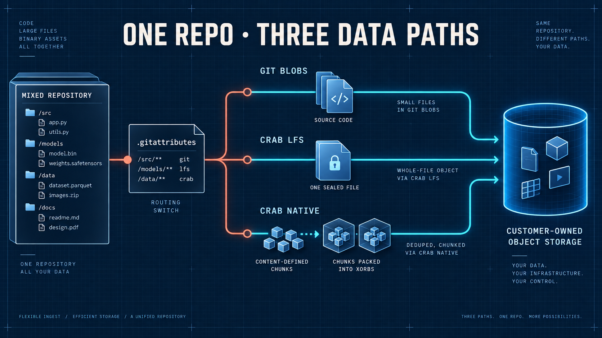

Alt text: A decision board routes small code files into Git packs, stable or
LFS-compatible binaries into whole-file objects, and versioned large files into
content-defined chunks and xorbs. All paths terminate in one customer-owned
object-storage bucket.

## Post 1 — A private Git remote for a code-only repository

Crab is often introduced as Git for large files, but the first useful case can
be much simpler: a code-only repository that you want to keep in your own S3,
GCS, Azure, or S3-compatible bucket.

In direct-storage mode, a `crab://` remote contains the Git repository itself.
Commits, trees, blobs, refs, and packfiles live under the repository prefix in
object storage. There is no Crab data server or database in the path.

That makes Crab useful for internal tools, infrastructure repositories, personal
projects, archival mirrors, and teams that need a durable Git remote but do not
need another hosted collaboration platform.

The workflow is still Git:

```text
crab configure s3://engineering-repos/terraform-modules
git add .
git commit -m "Add network module"
git push
```

Crab's remote helper translates the normal Git push/fetch conversation into an
object-storage-native layout. Conditional publication protects refs from lost
updates, while immutable packs make retries safe.

The important distinction is control. Your provider owns durability. Your IAM
policy owns access. Your bucket policy, encryption, replication, retention, and
audit controls remain the storage boundary.

Use a forge when you need its pull requests, issues, and ecosystem. Use Crab's
direct remote when what you need is a Git remote whose durable state stays in
infrastructure you already operate.

https://crab.build/docs/cli/getting-started/first-repository

### Visual

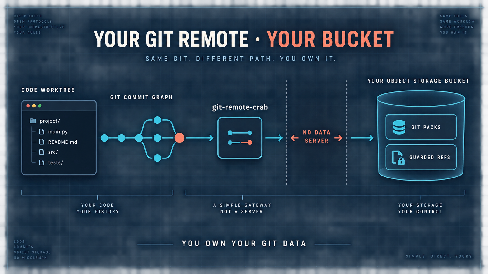

Alt text: A source-code worktree and Git graph flow through the Crab remote
helper directly into a bucket containing Git packs and guarded refs. The empty
space between the helper and bucket is labeled no data server.

## Post 2 — Keep every model checkpoint with the code that produced it

An ML experiment is not reproducible when the code is in Git but the model is
named `latest.safetensors` somewhere else.

With Crab, a commit can select the training code, configuration, metrics, and
exact checkpoint together. Git records a compact pointer for the checkpoint.
Crab stores its reconstruction recipe and content-addressed chunks in your
object store.

This is where the native chunked path earns its keep.

Fine-tuned checkpoints often retain large encoded regions from an earlier
version. Content-defined chunking can recognize those byte regions even when a
local edit shifts later offsets. On push, Crab reuses chunks that are already
durable and uploads the new ones.

Every checkpoint remains an independent, complete identity. There is no ordered
chain of binary patches that must all survive. Hydration resolves the selected
recipe, reads its xorb ranges, reconstructs the file, and verifies the complete
hash before materializing it.

The honest caveat: deduplication depends on encoded bytes. If a training/export
pipeline broadly recompresses, encrypts, or rewrites the file, logically similar
models may share little physical content. Measure a representative sequence
before projecting savings.

The result you want is not merely a smaller bucket. It is a Git ref that answers
one question without a spreadsheet or naming convention:

Which exact code, parameters, data snapshot, and model belonged to this run?

https://crab.build/docs/cli/workflow/experiments

### Visual

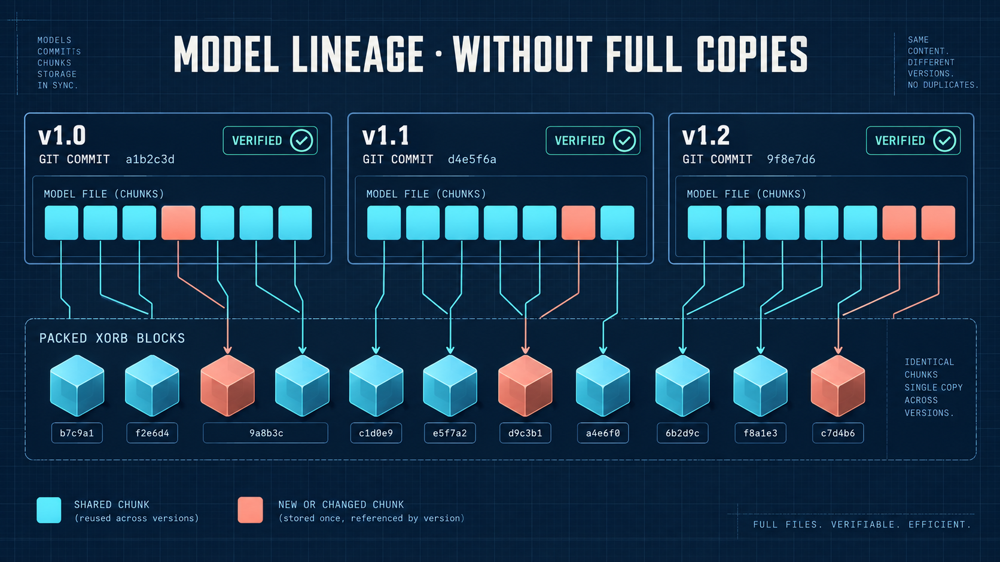

Alt text: Three checkpoint versions sit on a Git branch graph. Large shared
cyan chunk regions flow to the same xorb blocks, while a few coral chunks are
new in each version. Every version ends at its own full-file verification seal.

## Post 3 — Replace the LFS data plane for stable, high-entropy binaries

Not every large file benefits from content-defined deduplication.

Video exports, encrypted archives, firmware images, compressed deliverables,
and vendor binaries can have high-entropy bytes. A small logical change may
rewrite most of the encoded file. If versions are infrequent—or standard Git
LFS pointers are part of the tooling contract—whole-file storage is often the
cleaner path.

That is the Crab LFS use case.

Crab's direct-storage LFS mode keeps the standard SHA-256 pointer format in Git
and stores the complete object under the repository's LFS namespace in object
storage. The local Crab transfer agent handles upload, fetch, checkout, and
integrity verification without requiring a hosted Git LFS HTTP server.

Existing LFS-aware tools can keep seeing an LFS pointer. Teams can keep familiar
commands such as `git lfs pull`, or use the equivalent `crab lfs` commands when
Git LFS is not installed.

The key is to choose based on file behavior, not extension folklore:

- Use whole-file LFS when compatibility and simplicity dominate.
- Use Crab-native chunking when related versions actually retain byte-level
  reuse.
- Test representative files when compression or serialization makes the answer
  unclear.

Crab LFS is not "dedup but worse." It is a different contract: stable standard
pointers, whole-object identity, and direct ownership of the heavy bytes.

https://crab.build/docs/cli/getting-started/crab-lfs

### Visual

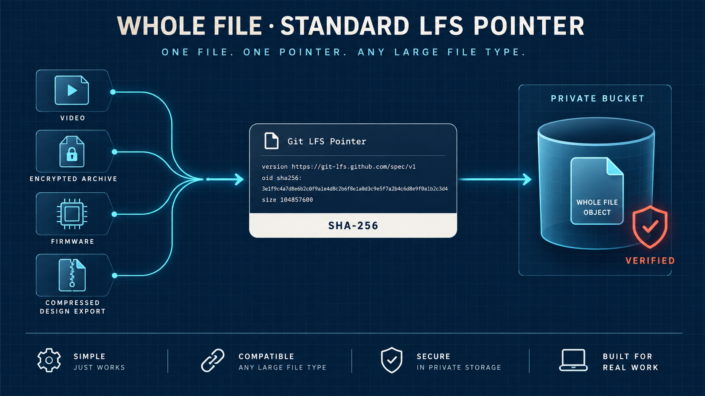

Alt text: A compact LFS pointer card with a SHA-256 identity connects to one
sealed whole-file object in a private bucket. Around it are simplified video,
archive, firmware, and design-export shapes.

## Post 4 — Route a mixed monorepo by file behavior

Real repositories do not contain one kind of file.

A robotics monorepo might contain Rust and Python source, a versioned perception
model, immutable calibration bundles, simulation recordings, and release ZIPs.
Routing every path through one large-file mechanism throws away useful tradeoffs.

Crab lets one commit use multiple representations:

```gitattributes
models/**       filter=crab diff=crab merge=crab -text
releases/**     filter=lfs  diff=lfs  merge=lfs  -text
```

Everything else stays ordinary Git unless another rule matches.

The model can use content-defined chunks because it evolves and may reuse byte
regions. A signed release archive can use LFS because it is immutable and its
whole-file SHA-256 is the compatibility identity. Source files remain normal Git
blobs, where line diffs and native merge behavior are most useful.

All three still meet at the commit. A branch or tag identifies one exact project
state; only the physical storage strategy changes by path.

This also makes adoption incremental. A team does not have to rewrite every
existing LFS path to start using native Crab for a new dataset. Nor does adding
Crab force small source files into a pointer format.

Treat `.gitattributes` as architecture. Review the patterns. Keep them narrow.
Choose the representation according to actual version behavior and integration
needs.

https://crab.build/library/crab-interpreted-one-history-two-data-paths

### Visual

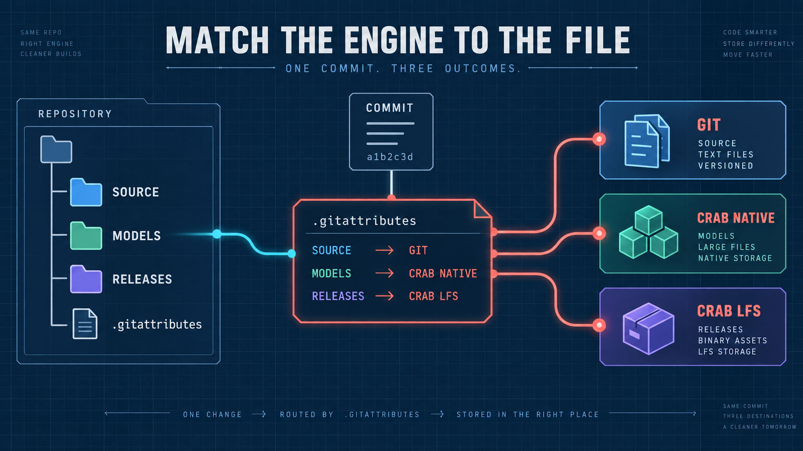

Alt text: A monorepo tree with source, models, and releases passes through a
visible .gitattributes routing board. Source becomes Git blobs, releases become
whole LFS objects, and models become reusable chunks, all under one commit.

## Post 5 — Open a 2 TB creative project without a 2 TB checkout

A game artist does not need every cinematic to change one texture. A video
editor does not need every historical render to open today's sequence. A CAD
engineer does not need the complete archive to inspect one assembly.

Crab separates repository history from workstation materialization.

A lazy clone fetches the Git graph and compact pointers first. The user can then
hydrate a path, a glob, a reviewed manifest, or a named profile:

```text
crab hydrate 'assets/characters/hero/**'
crab hydrate --profile=level-07
```

The selected files become ordinary bytes in the worktree, so existing tools do
not need to understand Crab. Unselected content stays as compact pointers.

When the task is finished, `crab dehydrate` can replace clean managed files with
their pointer form and reclaim disk. Dirty files are protected; dehydration must
not erase local edits.

For supported environments, a Crab mount can expose repository content on
demand without materializing the whole project up front.

The useful mental model is:

Git decides which version the branch names. Hydration decides which of those
bytes this machine needs today.

That changes onboarding from "make room for the repository" to "declare the
working set."

https://crab.build/docs/cli/virtual-filesystem

### Visual

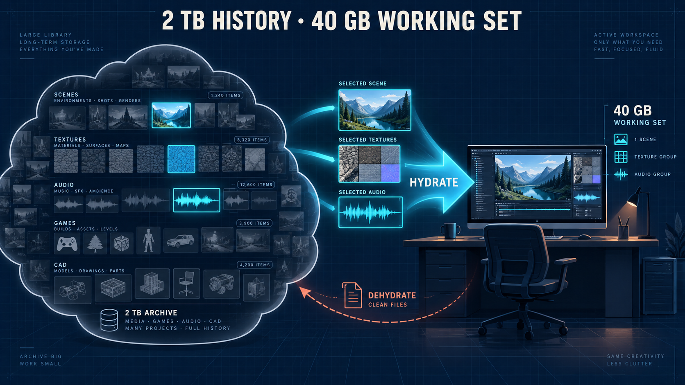

Alt text: A two-terabyte cloud archive contains many dimmed project blocks. A
bright selection path sends only one level, textures, and audio group into a
workstation with a much smaller disk meter. The remaining files stay pointers.

## Post 6 — Give every CI job the smallest verified working set

Ephemeral runners make waste easy to see. If every job downloads the complete
model and fixture archive, the same bytes cross the network again and again—even
when a shard needs only two files.

Crab lets the repository describe CI inputs explicitly.

A source-only job can keep every managed file as a pointer. A model-evaluation
job can hydrate one checkpoint and validation slice. A release job can use a
committed manifest that names the exact payloads it must materialize.

```text
crab hydrate --manifest .crab/manifests/integration-tests.txt
```

`crab fetch` can pre-warm the cache without changing the worktree. Structured
JSON and JSONL output gives automation stable progress and error records instead
of requiring log scraping.

Crab's workflow layer adds another useful boundary: one machine can publish a
stage-cache result and another can reuse it when the declared inputs and command
state match. Untrusted pull requests can run read-only or cache-only; trusted
mainline jobs can publish new results.

This is not just a bandwidth optimization. A reviewed working-set manifest is a
reproducibility artifact. It proves which large inputs a job was supposed to use,
and hydration verifies the bytes before the tool runs.

The CI question becomes precise: what is the minimum complete, verified state
required for this job?

https://crab.build/docs/cli/workflow/remote-cache-ci

### Visual

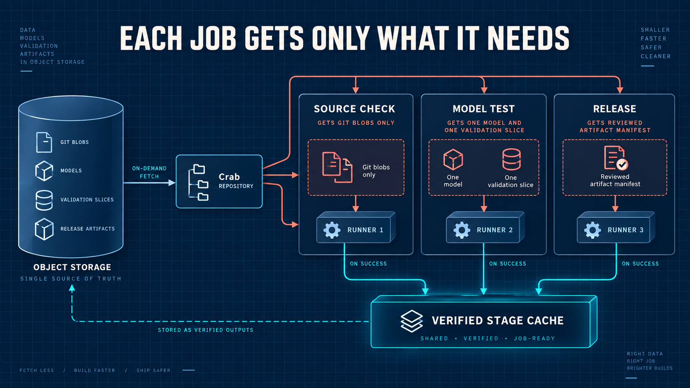

Alt text: Source checks receive only Git blobs, model tests receive one model
and one data slice, and release receives a reviewed artifact set. A shared cache
connects successful stages across runners without changing the authoritative
bucket.

## Post 7 — Browse an S3-backed repository without cloning it

Direct object storage is a strong data plane, but not every collaborator wants
to inspect a repository from the terminal.

The current Crab source tree includes a self-hosted server that adds a repository
UI without moving durable repository state out of the operator's bucket.

The browser can open repositories, branches, tags, commit history, trees, files,
diffs, and blame through bounded remote reads. It can render safe Markdown,
download an exact blob, and create a ZIP pinned to a selected commit. The server
does not need to clone the repository or maintain a local Git object database to
serve those views.

That is useful for teams that want a familiar web surface over private research,
firmware, media, or infrastructure repositories while keeping S3 or an
S3-compatible system as the authority.

The design keeps two boundaries explicit:

- Browser state is a view of an exact commit and repository generation.
- Runtime caches and indexes may accelerate the view, but they are disposable;
  the object store remains durable truth.

Pointer-backed large files are shown honestly in the current source:
blob downloads return the pointer, because browser hydration is not yet part of
the HTTP application.

This surface is not in the latest tagged release, and its production
qualification is incomplete. The use case is still clear: give people a
repository browser without turning a local clone or a separate database into the
source of truth.

Source: https://github.com/crabbuild/crab/tree/main/crates/crab-http-server

### Visual

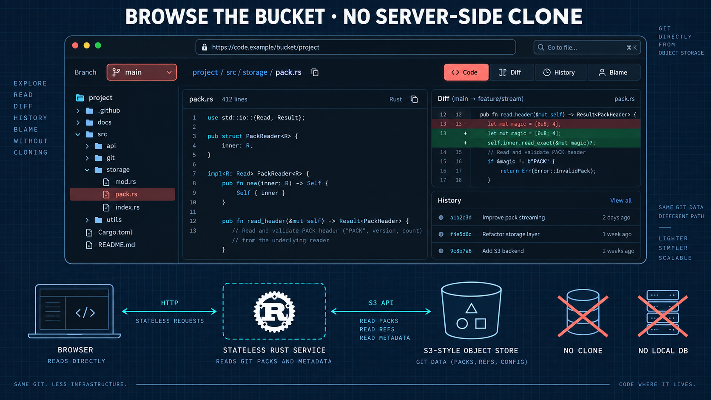

Alt text: A browser window with branch, tree, code, diff, and blame panels sits
above a stateless Rust service. The service reads Git packs and metadata from S3;
a crossed-out local clone and database emphasize that neither is authoritative.

## Post 8 — Keep pull requests and branch protection inside your trust boundary

Some teams want the collaboration model of a forge but cannot put source,
issues, reviews, or release metadata into a third-party control plane.

The self-hosted Crab UI in the current source tree targets that boundary.

Its current surface includes OIDC sign-in, repository-scoped read/write tokens,
branches and tags, protected branches, issues, comments, labels, assignees, pull
requests, reviews, commit statuses, required checks, and releases.

The important part is not the checklist. It is that writes converge on the same
repository publication rules as native Git.

A browser edit can create a proposal branch instead of writing to a protected
branch. A merge checks the expected base and head, required status, review state,
and branch policy before publishing. Concurrent edits return conflicts rather
than silently overwriting newer state.

Repository collaboration records also need durability and concurrency rules.
They live in versioned object-store namespaces rather than an undocumented local
database. Restarting the service must not erase a pull request, issue, release,
or policy decision.

This is not in the latest tagged release, and broad production qualification
remains. But it targets a real use case: a team-controlled collaboration plane
whose Git and application state stay within the same private storage and identity
boundary.

Source: https://github.com/crabbuild/crab/tree/main/crates/crab-http-server

### Visual

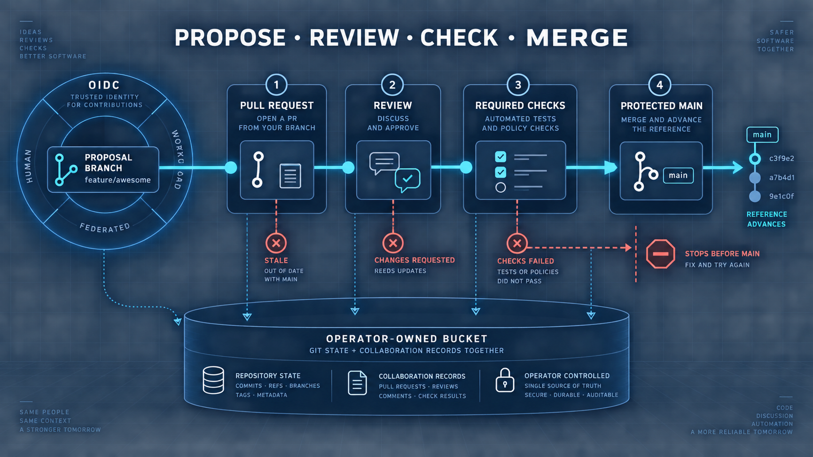

Alt text: A proposal branch flows through pull request, review, and required
check gates before a protected main ref advances. OIDC surrounds the workflow,
and both Git and collaboration records end in the team's bucket.

## Post 9 — Give existing S3 tools a live view of a Git branch

Many data pipelines already know how to read and write S3. Teaching every SDK,
training job, media tool, or migration utility a new filesystem protocol is often
the hardest part of adopting versioned storage.

The Crab S3 gateway in the current source tree presents configured Crab
repositories as logical S3 buckets. Existing clients keep their normal endpoint,
region, access-key, and secret-key configuration.

A key includes the selected Git state and repository path:

```text
s3://my-repository/main/data/model.bin
```

`main` selects a branch. A tag or full commit ID creates an immutable read-only
view. Reads pin one commit before opening content, so a long request does not mix
two repository states.

An S3 `PutObject`, `CopyObject`, `DeleteObject`, or completed multipart upload to
a branch publishes a Git commit immediately. Conditional writes recheck the
observed object and branch under the canonical publication lock, so a conflict is
visible and safe to retry.

Large payloads use Crab's verified LFS path. Files already stored as Crab-native
pointers retain Xet chunk reconstruction and deduplication, including bounded
range reads for partial S3 requests.

Gateway credentials are independent of the backing cloud credentials. An S3
client receives access to the logical repository, ref, path, and operation—not
the operator's storage account.

This is intentionally not every S3 feature. Bucket creation, AWS IAM, bucket
versioning, website hosting, and unsupported headers fail explicitly rather than
pretending to work.

The gateway is in the current source tree but not the latest tagged release. Its
accepted contract and supported operation matrix are public for evaluation.

Source: https://github.com/crabbuild/crab/tree/main/crates/crab-s3-gateway

### Visual

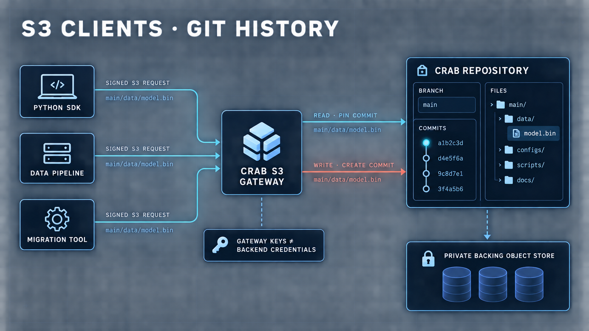

Alt text: Python, pipeline, and migration-tool S3 clients send signed requests to
the Crab S3 gateway. A main/data/model.bin key selects a branch and path. Reads
pin a commit; writes create one new Git commit; the backing object store remains
private.

## Post 10 — Build a private Git platform on storage you can replace

The broadest Crab use case is sovereignty without inventing a new developer
workflow.

Run the self-hosted repository application inside your network. Authenticate
people with your OIDC provider. Give data tools an S3 endpoint through the Crab
S3 gateway. Back both services with object storage you operate. Developers can
use normal Git over HTTPS, standard Git LFS where compatibility matters, and
Crab-native chunking where version reuse matters.

Multiple repositories can share a bucket while distinct prefixes isolate their
mutable refs, settings, Git packs, and collaboration state. Immutable content-
addressed data can use the shared namespace designed for reuse. The repository
application embeds its UI in one Rust binary; the optional S3 interface is a
separate Rust gateway. Neither requires a frontend fleet or hidden database
stack.

This architecture is useful for regulated teams, private research, sovereign
clouds, on-prem environments, and organizations that want an exit path from a
hosted forge.

It also makes failure ownership legible:

- Object storage owns durable bytes.
- OIDC owns human identity.
- Crab owns Git/LFS protocol, repository policy, and safe publication.
- Caches and temporary receive files are replaceable.

The HTTP application and S3 gateway are in the current source tree but not the
latest tagged release. The HTTP server is still under active qualification;
backup/restore, multi-instance admission, operational upgrades, and remaining
collaboration workflows must meet the release bar before the platform should be
described as production ready.

That is the end of this series, and the reason the pieces fit together: choose
the right data representation per file, then choose the right protocol for each
consumer—Crab, Git/LFS over HTTP, a browser, or S3.

https://github.com/crabbuild/crab

### Visual

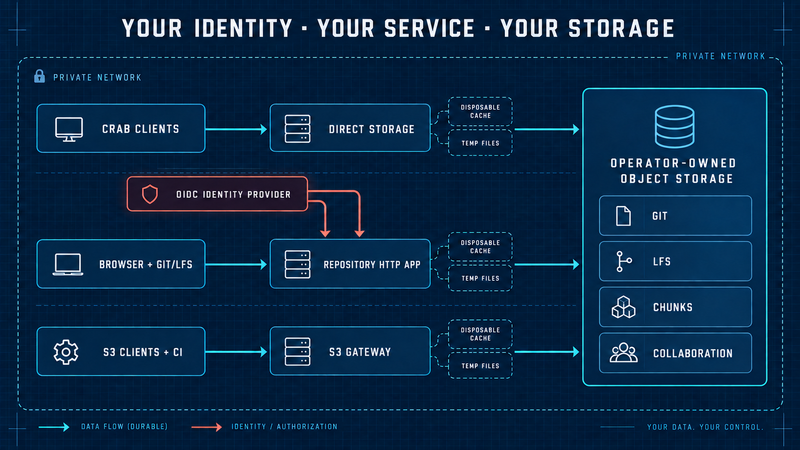

Alt text: Inside a private network, native Crab clients connect directly, browser
and Git/LFS clients use the repository HTTP service, and standard S3 tools use the
S3 gateway. OIDC supplies identity and an operator-owned object store holds Git,
LFS, chunked data, and collaboration records.
