# Crab open-source launch: long-form X post series

These posts are written to stand alone while forming a deliberate sequence when published in order. The headings are editorial notes; publish only the body of each post. Replace “Today” in Post 1 if it is not published on launch day.

## Post 1 — Introducing Crab

Today we’re open-sourcing Crab: serverless Git for large files.

Git is still one of the best interfaces we have for collaborative work. Add. Commit. Branch. Merge. Push. Clone. The problem is not the vocabulary—it is the weight behind it.

A modern repository may contain source code beside model checkpoints, datasets, videos, game assets, scientific outputs, or build artifacts. Put all of those bytes into ordinary Git blobs and repositories become expensive to clone, slow to move, and painful to maintain. Move them into a separate system and teams often lose the most useful property Git provides: one exact, branchable history of the project.

Crab takes a different approach.

Git stores compact pointer files. Crab divides the original content into content-defined chunks, deduplicates and packs those chunks, and writes them directly to object storage controlled by your organization. There is no Crab data server or separate data database in the direct-storage path.

The result is one repository with two purpose-built lanes:

Git owns commits, trees, branches, tags, names, and reviewable history.

Your object store owns the heavy, immutable bytes.

Crab connects them while preserving the workflow developers already know. You can clone lazily, hydrate only the files a person or job needs, dehydrate clean files to reclaim disk space, and keep using normal Git operations for the rest of the repository.

Crab is written in Rust and released under Apache 2.0. The repository includes the CLI, Git remote helper, filter integration, shared storage and metadata crates, architecture notes, operational guides, tests, and the website documentation.

This launch is an invitation to inspect the design, challenge the assumptions, run Crab against real workloads, and help shape what serverless version control for large files should become.

We are starting with a transparent foundation, not pretending every workload or provider is already solved.

Repository: https://github.com/crabbuild/crab-oss

Docs: https://crab.build/docs/cli

#opensource #git

### Images for Post 1

**Image 1 — Launch hero**

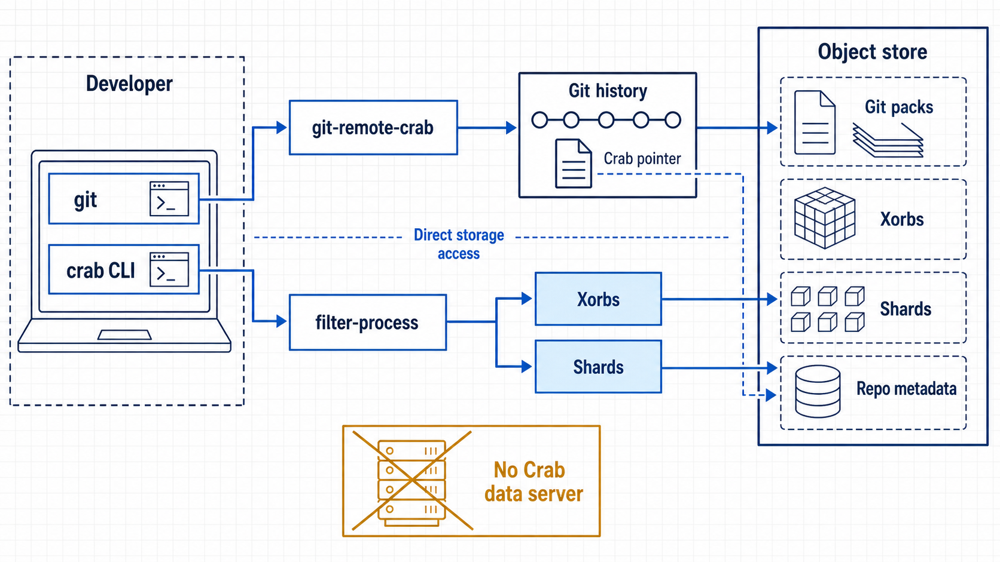

Alt text: Two coordinated technical lanes carry a compact Git graph and large immutable data blocks into cloud object storage, with no central server between them.

**Image 2 — Open architecture**

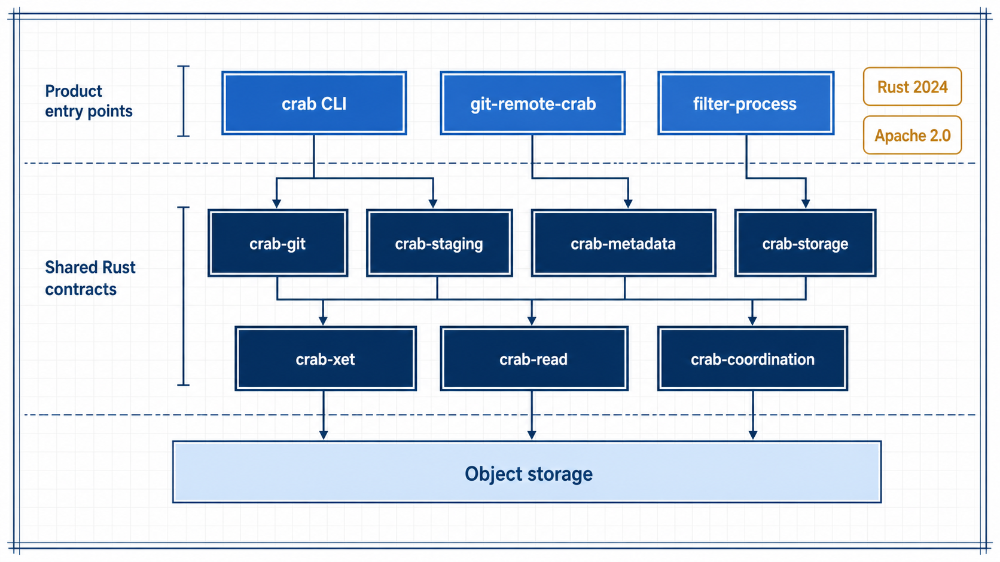

Alt text: An open, glass-sided technical system exposes connected modules for Git, chunking, metadata, storage, coordination, and inspection.

## Post 2 — One history, without putting every byte in Git

The phrase “large file” is increasingly misleading. In many projects, the large files are not incidental attachments. They are the work.

For an ML team, that may be checkpoints, embeddings, tokenized corpora, and evaluation sets. For a game studio, textures, audio, maps, and meshes. For data and scientific teams, Parquet files, arrays, databases, and simulation output. These files evolve alongside code, and the exact relationship between the two matters.

The easy answer is to put code in Git and data somewhere else. But that creates two histories, two permission models, two naming systems, and often a pile of conventions for answering a basic question: “Which exact data belongs to this commit?”

Crab starts from a simple belief: a Git commit should remain the coordination unit.

A commit can contain an ordinary Git blob for `src/train.rs` and a small Crab pointer for `models/encoder.safetensors`. That pointer records the identity and logical size of the complete file. The underlying recipe, reconstruction metadata, and packed content live in object storage.

This separation matters. Git can answer questions about names, branches, ancestry, and change history without carrying a 40 GB model through every operation. The data plane can stream, deduplicate, cache, and retrieve large content without pretending to be a code-review system.

It also preserves exactness. Hydration does not ask for “the latest model at this path.” It reconstructs the precise file identity selected by the commit. If the bytes cannot be verified, Crab returns an error instead of quietly materializing a partial or different file.

Crab is not trying to replace GitHub, GitLab, artifact registries, or domain-specific data catalogs. Those systems solve important problems. Crab focuses on the case where code and large, versioned files belong in the same branchable history—but should not share the same physical storage strategy.

One logical repository. Two data paths. One commit joining them.

That is the core idea behind Crab.

https://crab.build/blog/git-for-large-files-at-any-scale

### Images for Post 2

**Image 1 — One commit, two data paths**

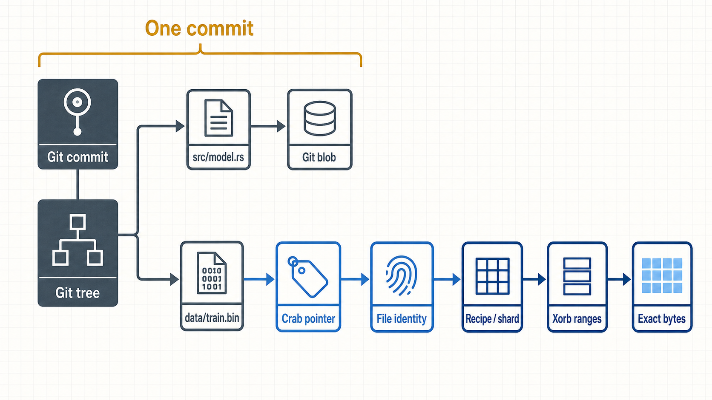

Alt text: One glowing commit node connects a branch of compact source-code objects with a branch of large model, media, and dataset blocks.

**Image 2 — Fragmented versus unified history**

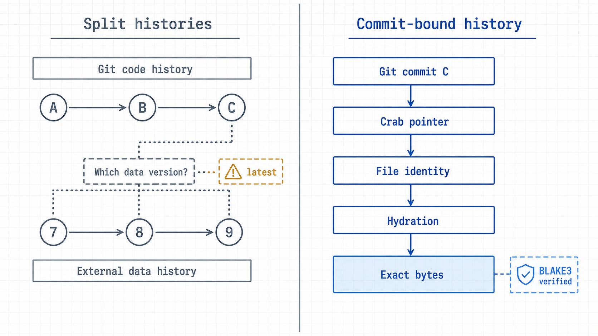

Alt text: A split comparison shows separate, wavering code and data timelines becoming one synchronized commit spine that joins each code state to its large data state.

## Post 3 — Why Crab integrates at two Git boundaries

One of the earliest design decisions in Crab was to extend Git, not imitate it.

Crab integrates through two mechanisms Git already provides: a filter driver and a remote helper.

The filter driver owns the boundary between a working-tree file and the blob Git records. When a path selected by `.gitattributes` is added, Crab streams the file, computes its identity, divides it into content-defined chunks, stages the required data locally, and gives Git a compact pointer blob. Paths that are not selected remain ordinary Git files.

The remote helper owns transfer. When Git sees a `crab://` remote, it invokes `git-remote-crab`. The helper moves Git packs, Crab metadata, and large-file content through the object store, then reports per-ref push or fetch results back through Git’s remote-helper protocol.

Everything between those boundaries should stay boring.

Commits are Git commits. Trees are Git trees. Branches and tags are Git refs. Normal history operations work on the Git graph and pointer blobs. Crab does not need to sit in the middle of every `git log`, branch creation, or merge.

This architecture also creates a useful ownership split:

The pointer answers: which exact file version does this commit name?

The recipe and shards answer: which ordered chunks reconstruct that version?

The xorbs answer: where do the immutable chunk bytes live?

The manifest and ref state answer: which complete repository generation is visible?

Keeping those concerns separate is more than aesthetic. It lets each layer scale according to its actual job. Git stays excellent at history. Object storage stays excellent at durable blobs. Crab handles the proof that connects a visible commit to complete, verifiable large-file content.

It also means adoption can be incremental. Teams choose tracked patterns explicitly. Existing Git workflows remain recognizable. And when a forge is still the collaboration plane, Crab’s mirror mode can keep pull requests, branch protection, CI, issues, and webhooks there while the large-file data lives in your bucket.

The goal is not a new vocabulary. It is to make the old one work at a different physical scale.

Architecture: https://crab.build/docs/cli/getting-started

### Images for Post 3

**Image 1 — Git’s two extension boundaries**

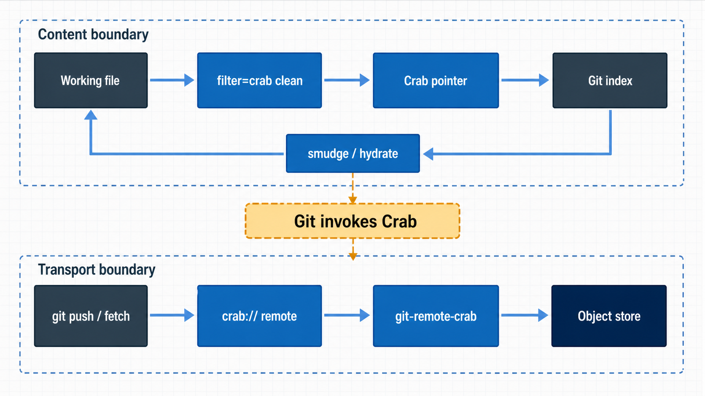

Alt text: A working file passes through a filter gate and becomes a compact pointer; an otherwise untouched Git graph passes through a separate remote-helper gate into object storage.

**Image 2 — Two-lane architecture**

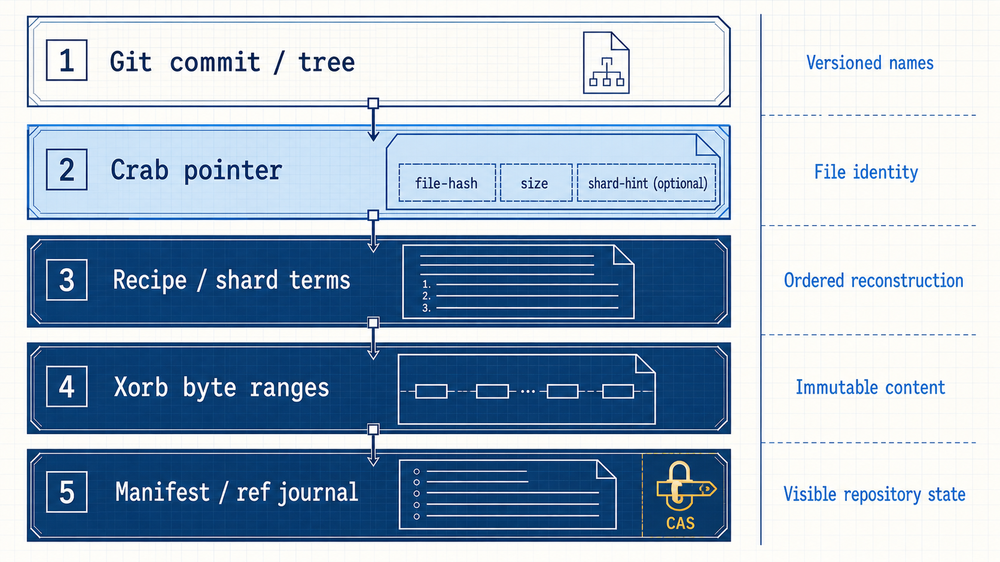

Alt text: A compact orange Git control lane runs above a cyan large-file data lane containing chunks, shards, and packed objects, joined only at precise identity checkpoints.

## Post 4 — Why content-defined chunking is necessary, but not sufficient

Suppose you have a 10 GB model file and insert a few bytes near the beginning.

Whole-file storage sees a new 10 GB object. Fixed-size chunking does better, but the insertion shifts every later boundary, so much of the file may still appear new. Content-defined chunking uses the content itself to choose boundaries, allowing the chunk stream to resynchronize after a local edit. Unchanged regions can retain the same identities.

Crab uses a streaming Gearhash-based content-defined chunker. The same input produces the same boundaries, memory stays bounded as files grow, and chunks can be emitted while the file is read. Each complete file and each chunk receives a content identity, so versions, branches, paths, and contributors can reuse bytes already proven durable.

But maximum deduplication is not the same as maximum performance.

If every matching chunk is reused wherever it happens to live, one file may be scattered across hundreds of packed objects. Storage usage looks great; hydration becomes a storm of range requests. If every version is packed contiguously, reads are simple; storage and upload reuse suffer.

Crab deliberately prefers continuity. It packs chunks into immutable aggregates called xorbs and weighs a deduplication win against the read fragmentation it would create. The objective is not to win a synthetic “most bytes deduplicated” contest. It is to reduce real transfer while keeping reconstruction practical.

That tradeoff is central to the design:

- Chunk identity creates the opportunity for reuse.
- Xorbs avoid one object-store object per small chunk.
- Shards record the ordered reconstruction terms.
- Continuity limits how scattered a file becomes.
- Full-file verification proves the final output, regardless of where its pieces came from.

Deduplication also has honest limits. Encrypted, compressed, or broadly re-encoded files may share few encoded byte regions even when they are logically related. Crab does not promise magic savings. It promises that when byte-level reuse exists, the storage model can recognize and exploit it without sacrificing exact reconstruction.

That is a more useful goal than “store less” in isolation: move fewer bytes, issue fewer requests, and still recover the exact file the commit named.

Technical overview: https://crab.build/blog/git-for-large-files-at-any-scale

### Images for Post 4

**Image 1 — Content-defined boundaries**

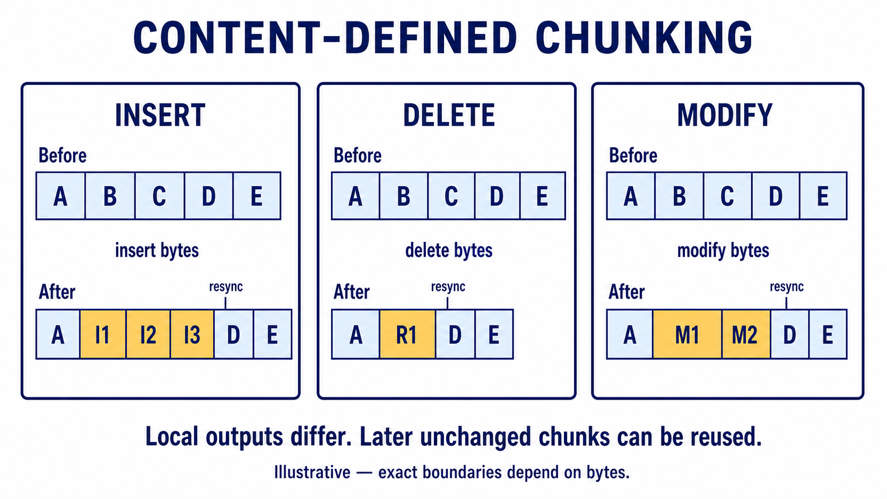

Alt text: Three equal cards share the original chunks A through E. Insertion produces local chunks I1 through I3 and a longer file; deletion produces R1 and a shorter file; modification produces M1 and M2 at the same total length. In all three examples, later chunks D and E retain their identities after resynchronization. Exact boundaries depend on the edited bytes.

**Image 2 — Deduplication versus continuity**

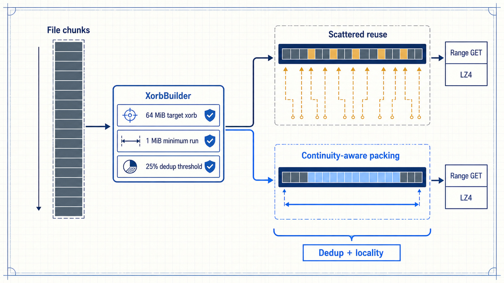

Alt text: Both panels contain file chunks C1 through C6 in the same order. The reuse-first assignment alternates among xorbs A through D, while the continuity-aware assignment groups the first three chunks in A and the next three in B.

## Post 5 — How a serverless push stays consistent

“No data server” sounds simple until two developers push at the same time—or a machine crashes halfway through an upload.

Object storage gives Crab durable blobs and conditional writes, but it does not provide a traditional database transaction across every object in a repository. So the push protocol is designed around a smaller rule:

Make immutable dependencies durable first. Move visibility last.

During a push, Crab prepares the required chunk payloads, xorbs, reconstruction metadata, Git packs, and dependency records before it attempts to advance visible repository state. The content objects are immutable and content-addressed, so equivalent uploads are naturally safe to retry.

Only a small set of objects is mutable: manifests, refs, coordination records, and locks. Crab updates those through compare-and-swap semantics. A writer can advance a ref only if the expected previous state still matches. If another writer wins, the losing push must fetch, reconcile, and form a new plan; it cannot silently overwrite history.

Per-ref leases serialize writers that target the same destination. Heartbeats keep a live lease from expiring during a long operation. Writers targeting different refs can prepare independently, while conditional manifest updates reconcile shared metadata.

The failure behavior follows directly from the ordering:

If a process stops before publication, readers continue to see the old complete tip. Some immutable objects may be left orphaned, but they are not referenced by a visible commit and can be collected later.

If publication succeeds but the client loses the response, the canonical remote state decides the outcome. The client reads before retrying instead of assuming failure.

If derived indexes fail after publication, the durable records remain authoritative and the indexes can be rebuilt.

This is the internal rationale for Crab’s “fail closed” posture. A fast push that exposes a pointer before its bytes are durable is not a successful push. It is delayed corruption.

Serverless architecture is not the absence of coordination. It is coordination reduced to a small, auditable surface: immutable objects, conditional updates, explicit ownership, and a visibility point that never outruns its dependencies.

That is how Crab can use an object store as the remote data plane without placing a Crab server in the middle.

### Images for Post 5

**Image 1 — Immutable before visible**

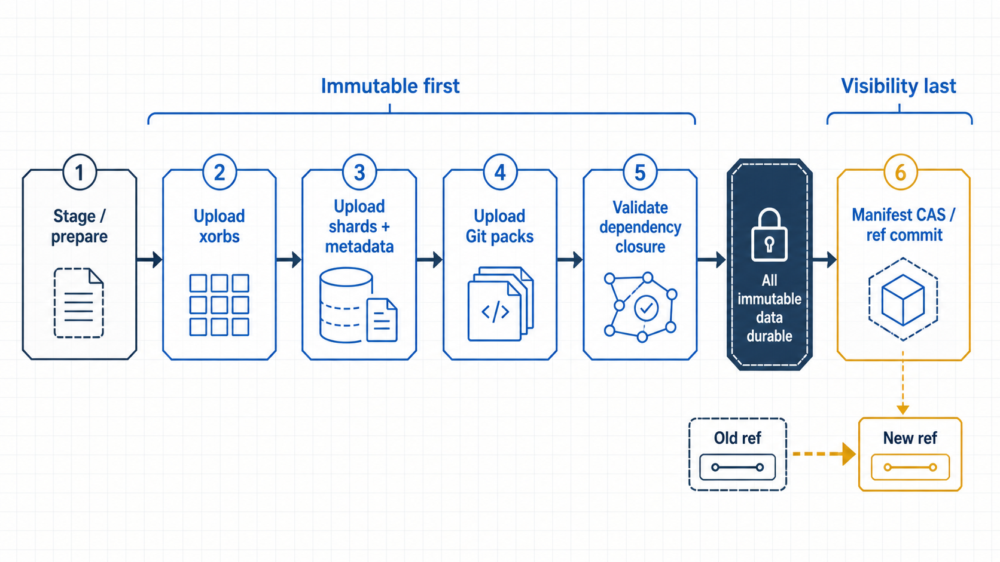

Alt text: Durable content blocks, reconstruction metadata, and Git pack stacks line up before a guarded gate; only after they are complete does one small glowing reference advance to visible state.

**Image 2 — Concurrent compare-and-swap**

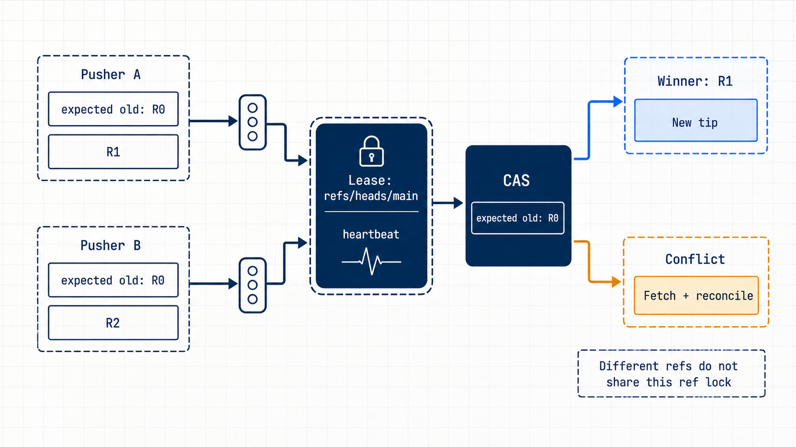

Alt text: Two symmetrical push streams prepare immutable data; the cyan stream wins a central lease and advances the ref, while the violet stream is stopped safely and follows a dashed reconciliation path.

## Post 6 — Clone history; hydrate only the working set

Traditional clone semantics assume the useful unit is the whole working tree. For large-file repositories, that is often the wrong unit.

A source-only CI job may need no model checkpoints. An evaluation job may need one checkpoint and one dataset partition. An artist may need the current map but not every cinematic. A developer inspecting history may need only pointer metadata.

Crab makes hydration an explicit worktree decision.

A lazy clone fetches the Git history and checks out compact Crab pointers without automatically transferring every large payload. The user or automation can then materialize exactly what the task requires:

`crab hydrate 'models/*.safetensors'`

`crab hydrate 'datasets/validation/**'`

`crab hydrate --profile=ci`

Named profiles and manifests make the choice reproducible for teams and jobs. `crab fetch` can warm the local cache without changing the working tree. When disk pressure matters, `crab dehydrate` replaces clean, verified files with their pointer form while leaving the remote content intact.

The word “clean” is important. Dehydration must not replace a locally modified file with an older pointer. Crab verifies state before reclaiming space.

Hydration is similarly proof-oriented. Crab resolves the ordered reconstruction recipe, reads the required xorb ranges from verified cache or canonical origin, reconstructs the chunks, verifies the complete output, and materializes the file only when verification succeeds. The contract is byte-identical output or an error—not “best effort.”

This separates two questions that are often accidentally coupled:

Which version does the commit select?

Which bytes does this machine need right now?

Git answers the first. Hydration policy answers the second.

That distinction changes the economics of large repositories. A large history no longer has to imply a large checkout. A 40 GB file no longer has to appear on every machine that needs to inspect the branch containing it. Cache misses affect latency, not correctness, because the object store remains authoritative.

The question Crab tries to make routine is not “Can this machine clone the repository?”

It is “What is the smallest verified working set for this operation?”

Hydration guide: https://crab.build/docs/cli/daily-workflow/hydrating-files

### Images for Post 6

**Image 1 — Selective hydration**

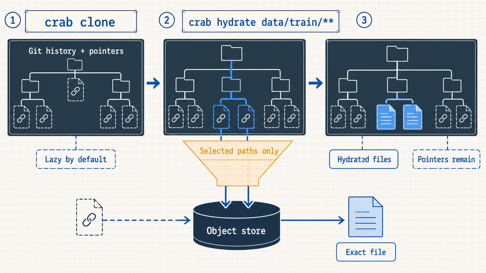

Alt text: A workstation receives a long history of compact pointer cards while only two highlighted large objects stream from cloud storage and materialize as full textured blocks.

**Image 2 — Verified cache and dehydration cycle**

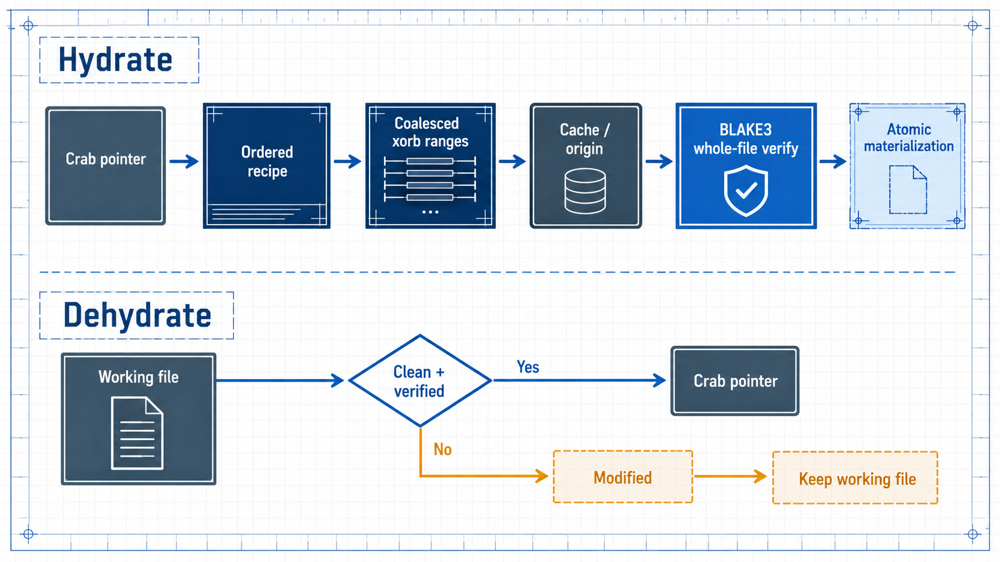

Alt text: A circular flow moves immutable remote content through a verified local cache into a full working file, then through another integrity check back to compact pointer form while the remote copy remains protected.

## Post 7 — Object storage is not a filesystem, and that shapes Crab

Crab stores large-file data directly in object storage, but it does not pretend a bucket is a POSIX filesystem.

That choice shapes nearly every internal format.

Small chunks are not written as millions of tiny standalone objects. Crab packs them into immutable xorbs to reduce request fan-out. Reconstruction metadata lives in content-addressed shards. Git objects are carried in standard packfiles. Repository manifests name the complete published generation. Content hashes determine immutable identities; object keys are an explicit, provider-neutral grammar rather than operating-system paths.

The mutability boundary is intentionally narrow. Xorbs, shards, historical manifests, metadata segments, and Git packs are immutable. Tiny coordination surfaces—such as the current manifest, ref state, and leases—change through conditional writes.

This layout is what makes safe retries possible. Uploading an immutable object twice is harmless when the identity and bytes agree. A conflict on a mutable pointer is visible and must be reconciled.

It also changes how garbage collection must work.

Deleting a file on the current branch does not prove its chunks are garbage. The same data may still be reachable from another branch, an older commit, another path, a workflow artifact, or a recovery root. Crab GC therefore follows reachability: start from retained roots, traverse the Git and file-data closure, compare that mark set with inventory, then apply a protection window.

An object is eligible only when it is both unreachable and old enough. The grace period protects concurrent and interrupted writers whose immutable uploads may not yet be visible. Repository scoping prevents one logical repository from casually collecting another repository’s data when prefixes share a bucket.

The operational consequence is deliberate: maintenance is explicit. `crab fsck` checks integrity. `crab doctor` checks setup. `crab gc`, `crab repack`, `crab compact`, and `crab optimize` have distinct responsibilities instead of hiding storage mutation behind routine reads.

Serverless does not mean structureless. It means the structure has to be encoded in immutable identities, narrow conditional updates, rebuildable indexes, and maintenance rules that can survive retries and crashes without a central database repairing everything afterward.

That is the less visible half of Crab—and one of the most important parts to get right.

### Images for Post 7

**Image 1 — Object-storage-native layout**

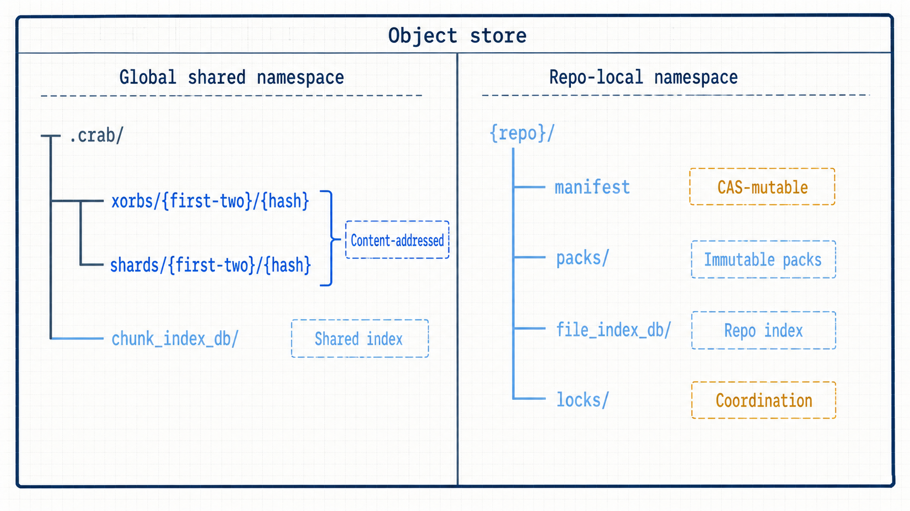

Alt text: An ordered stack of immutable packed chunks, reconstruction shards, Git packs, and historical records supports one very small violet mutable pointer at the top.

**Image 2 — Reachability-based garbage collection**

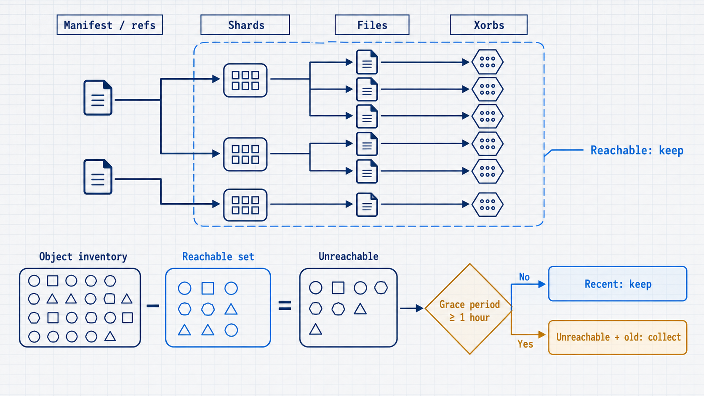

Alt text: A branching commit graph highlights protected cyan reachability paths into packed objects; old disconnected gray blocks outside the protection window are swept while reachable and recent objects remain untouched.

## Post 8 — Crab, Git LFS, and existing forge workflows

A common question is: “Is Crab a replacement for Git LFS?”

Sometimes. But compatibility and coexistence matter more than a forced rewrite.

Crab-native tracking stores content-defined chunks, which can reuse unchanged byte regions across related file versions. Standard Git LFS stores whole-file objects addressed by SHA-256. Whole-file storage is simple and widely supported; chunk-level reuse can be much more efficient when large versions share encoded regions.

Crab supports both paths.

New repositories can use `filter=crab` and Crab pointers. Existing repositories or tools that require standard LFS pointers can use Crab’s local LFS transfer agent, which reads and writes whole-file LFS objects directly through the configured object-store adapter. The two pointer types can coexist in one repository.

That means migration can be deliberate rather than theatrical. Teams can adopt the current working tree without rewriting old commits, keep LFS for selected paths, or use explicit import/export workflows when a coordinated history rewrite is justified. History rewriting changes commit identities and should always be previewed, backed up, and coordinated.

Crab also does not ask teams to abandon GitHub or GitLab.

In mirror mode, the forge remains the collaboration and policy plane: pull requests, reviews, branch protection, CI, issues, and webhooks. Crab stores the large-file data in object storage and ensures that content is published before pointer-bearing refs are sent to the forge. Because the forge and Crab are two remotes, this is not one distributed transaction; automation still needs divergence checks, and client-side hooks are not a substitute for server-side enforcement.

Those boundaries are intentional. Crab is not building a second issue tracker or code-review UI. It is building a Git-compatible transport and data plane for repositories whose heavy bytes need different economics.

Use ordinary Git when ordinary Git is enough. Use an artifact registry for released artifacts whose primary identity is a versioned product. Use a domain data platform when query and lineage are the main interface. Use Crab when the large files belong to the same exact branch history as the code—and your team wants direct control of their storage.

Migration guide: https://crab.build/docs/cli/guides/migrating-from-lfs

Mirror mode: https://crab.build/docs/cli/getting-started/mirror-mode

### Images for Post 8

**Image 1 — Whole-file and chunked coexistence**

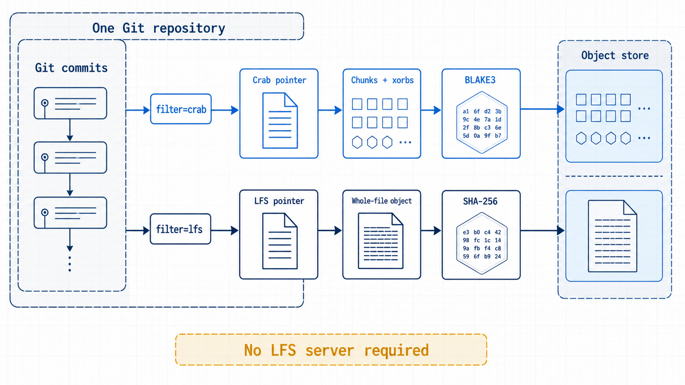

Alt text: One orange Git graph connects to two compatible large-file paths: a single whole-file object on the left and reusable chunks arranged into several packed objects on the right.

**Image 2 — Forge mirror mode**

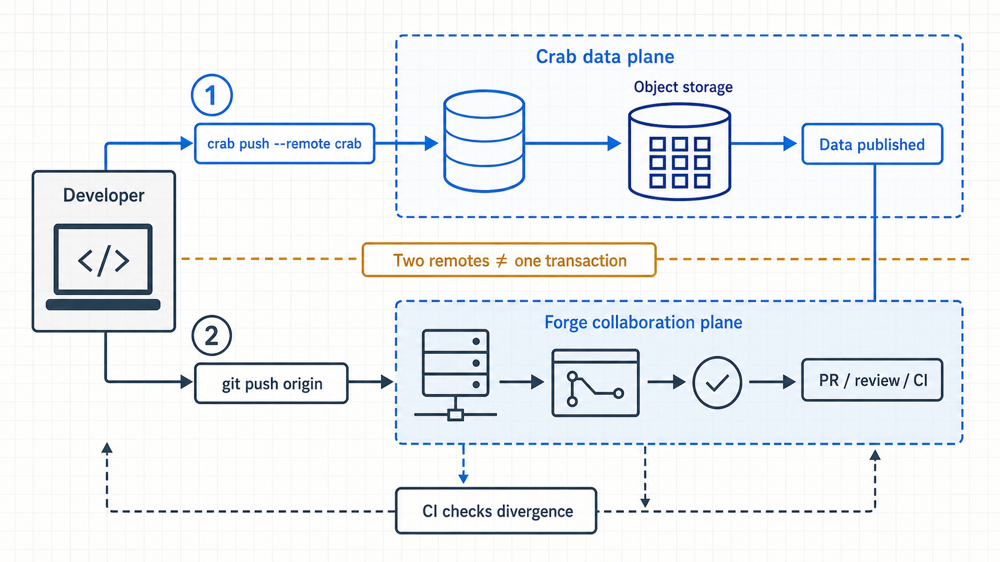

Alt text: A generic code-review portal remains the collaboration plane while a coordinated path publishes large media and data objects to a cloud bucket before compact pointer state reaches the portal.

## Post 9 — Reliability is a product feature, not an implementation detail

Large-file tooling usually looks fine on the happy path. The real design appears when credentials expire, a process is cancelled, a cache is corrupt, a branch moves concurrently, or a machine stops after uploading bytes but before reporting success.

Crab’s internal rules are built around making those failures legible.

Reconstruction is byte-identical or it returns an error.

Immutable data becomes durable before visible refs advance.

An acquired lock must be released or recover through its explicit lease protocol.

Garbage collection must never delete referenced content or content inside the grace period.

Local staging is not treated as a disposable cache when it may contain the only unpublished copy of a file’s chunks.

The Rust implementation helps enforce these boundaries. Streaming and bounded channels keep memory use tied to active work rather than total repository size. Structured error types preserve source failures. Cancellation is part of long-running command design. The CLI exposes machine-readable JSON and JSONL, stable error codes, progress events, and diagnostic commands so automation does not have to scrape optimistic prose.

Crab also separates durable truth from rebuildable acceleration. Local caches can make hydration faster. Metadata indexes can make lookup cheaper. Visibility proofs can make large Git fetches more selective. But a cache hit is not proof that the canonical origin has the bytes, and a derived index is not allowed to become an alternate source of truth. Missing or stale proof fails closed or triggers a rebuild path.

This is why the open-source release includes more than the binary. The architecture notes document object layout, consistency, Git integration, chunking, metadata, caching, virtual filesystems, and operational recovery. Tests cover unit behavior, integration wiring, and local S3-compatible end-to-end flows. Provider qualification is documented separately from adapter availability, because “we wrote the adapter” and “we retained production evidence for this release” are not the same claim.

That transparency is part of the product. Infrastructure earns trust when users can inspect not only what happens on success, but what remains true after interruption.

If you enjoy storage systems, Git internals, distributed coordination, or failure-oriented engineering, Crab has plenty to explore.

https://github.com/crabbuild/crab-oss

### Images for Post 9

**Image 1 — Fail closed**

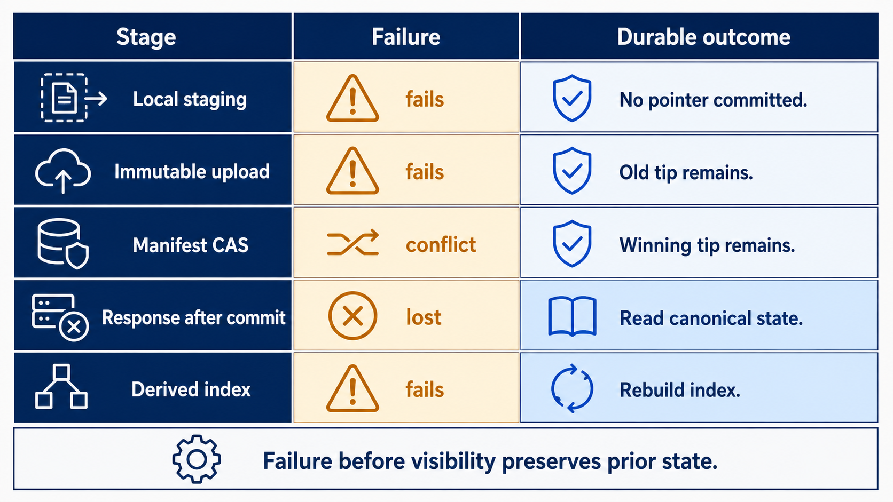

Alt text: A guarded integrity gate blocks a damaged red data stream, preserves the previous complete cyan state behind a shield, and routes recoverable pieces toward a visible repair path.

**Image 2 — Structured diagnostics**

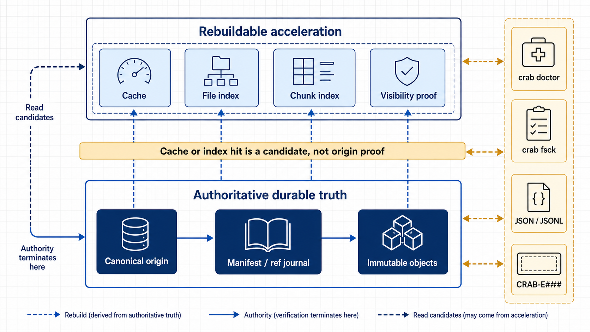

Alt text: A calm central repository pipeline is surrounded by structured event envelopes, progress pulses, an error tile, trace spans, health indicators, and integrity checks connected to their source.

## Post 10 — Why we are open-sourcing Crab, and where it goes next

We are open-sourcing Crab because the hardest questions in large-file version control should be inspectable.

How should a Git ref prove that every large-file dependency is durable?

When is chunk reuse worth the read fragmentation it creates?

How should garbage collection reason about branches, old commits, interrupted writers, and shared storage scopes?

What should happen when a cache says “present” but the canonical origin disagrees?

Where is the right boundary between a Git-compatible tool, an object store, a forge, and a domain-specific data platform?

These are not questions a polished landing page can settle. They need real repositories, adversarial review, reproducible benchmarks, failure injection, provider-specific evidence, and users with workloads we did not imagine.

Crab is available under the Apache 2.0 license. The monorepo contains the Rust CLI and remote helper, shared crates for storage, metadata, staging, Git, caching, coordination, LFS, reads, virtual filesystems, and workflows, plus the documentation site and architecture records.

The contribution bar is intentionally engineering-focused: a clear ownership boundary, regression coverage, documentation for changed contracts, and exact verification evidence. For changes that touch Git protocols or object storage, we especially want assumptions and failure modes made explicit.

There are many useful ways to participate:

- Try Crab on a representative model, dataset, media, or game repository.
- Measure first push, incremental push, lazy clone, and selective hydration.
- Test interrupted uploads, concurrent writers, and recovery procedures.
- Review the pointer, shard, manifest, and object-key contracts.
- Help qualify storage providers and operating systems with retained evidence.
- Improve docs, diagnostics, packaging, and first-run experience.
- Bring a use case that challenges the current architecture.

The premise is simple: Git should continue to answer which state we mean, while a purpose-built data plane answers which heavy bytes this operation actually needs.

Crab is an attempt to make that premise practical without requiring every team to operate another always-on data service.

If that problem is familiar, we would love your scrutiny—not just your stars.

Read the code: https://github.com/crabbuild/crab-oss

Start here: https://crab.build/docs/cli/getting-started

Tell us what breaks.

#rustlang #opensource

### Images for Post 10

**Image 1 — Open-source collaboration**

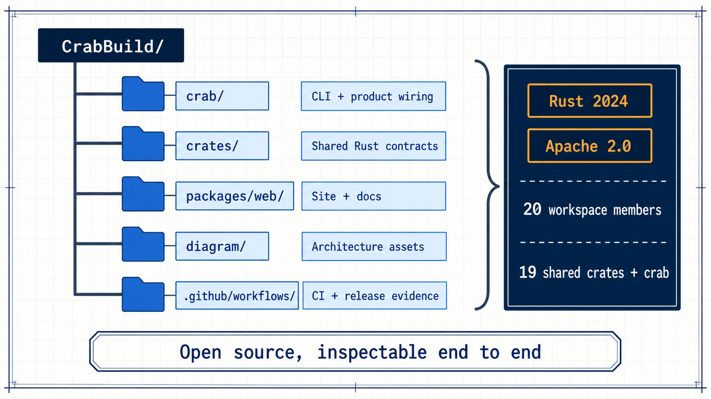

Alt text: Multiple independent engineering stations send patches, tests, benchmarks, reviews, and diagnostics into one transparent, layered repository architecture at the center.

**Image 2 — Evidence-backed roadmap**

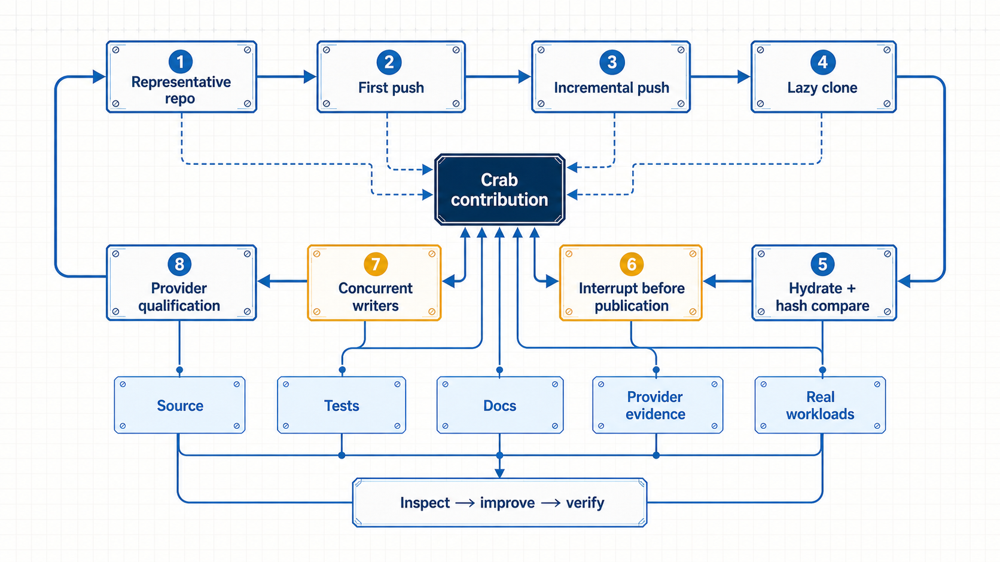

Alt text: A stable orange open core branches through cyan paths into six test stations for cloud providers, platform-neutral devices, failure testing, performance measurement, documentation, and new storage workloads; verified results return to the core.
