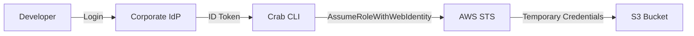

## How Crab Authenticates with AWS

Crab uses OIDC federation to bridge your corporate identity provider (Okta, Entra ID, Google Workspace, etc.) with AWS. Instead of distributing long-lived IAM access keys, developers authenticate once with their corporate login and receive short-lived STS credentials scoped to specific S3 buckets.

This means no secrets on developer machines, automatic credential rotation, and full CloudTrail attribution back to individual users.



## The Credential Flow

When you run `crab login`, the following happens:

1. Crab opens your browser to your corporate IdP (or displays a device code for headless environments).
2. After you authenticate, the IdP issues an OIDC ID token.
3. Crab exchanges that token with AWS STS via `AssumeRoleWithWebIdentity`.
4. STS returns temporary credentials (access key, secret key, session token) valid for 1 hour by default.
5. Crab caches these credentials locally and refreshes them automatically before expiry.

A 30-minute push won't fail because the token expired mid-operation — Crab handles refresh transparently.

## Developer Configuration

Point Crab at your IdP and the IAM role your platform team has set up:

```toml
# ~/.config/crab/config.toml
[auth]
provider = "aws-oidc"
issuer_url = "https://login.corp.example.com"
client_id = "crab-cli-prod"

[auth.aws]
role_arn = "arn:aws:iam::123456789012:role/crab-developer"
region = "us-west-2"
session_duration_secs = 3600
```

Or configure via the CLI:

```bash
crab config set auth.provider aws-oidc
crab config set auth.issuer_url https://login.corp.example.com
crab config set auth.client_id crab-cli-prod
crab config set auth.aws.role_arn arn:aws:iam::123456789012:role/crab-developer
crab config set auth.aws.region us-west-2
```

Then log in:

```bash
crab login
# Opens browser → authenticate → done
# Authenticated as alice@corp.example.com (aws-oidc)
```

## Region Resolution

Crab resolves the AWS region in this order:

1. `auth.aws.region` in your config
2. `AWS_REGION` environment variable
3. `us-east-1` (fallback default)

## Session Duration

The `session_duration_secs` value controls how long each STS session lasts:

| Constraint | Value |
|-----------|-------|
| Minimum | 900 seconds (15 minutes) |
| Maximum | 43,200 seconds (12 hours) |
| Also capped by | IAM role's `MaxSessionDuration` setting |

Longer sessions mean fewer refreshes. Shorter sessions reduce the blast radius if a token is compromised.

## Platform Admin Setup

These one-time steps create the trust relationship between your IdP and AWS.

### 1. Register the OIDC provider in IAM

```bash
aws iam create-open-id-connect-provider \
  --url https://login.corp.example.com \
  --client-id-list crab-cli-prod \
  --thumbprint-list <idp-thumbprint>
```

### 2. Create an IAM role with a trust policy

```json
{
  "Version": "2012-10-17",
  "Statement": [{
    "Effect": "Allow",
    "Principal": {
      "Federated": "arn:aws:iam::123456789012:oidc-provider/login.corp.example.com"
    },
    "Action": "sts:AssumeRoleWithWebIdentity",
    "Condition": {
      "StringEquals": {
        "login.corp.example.com:aud": "crab-cli-prod"
      }
    }
  }]
}
```

```bash
aws iam create-role \
  --role-name crab-developer \
  --assume-role-policy-document file://trust-policy.json \
  --max-session-duration 43200
```

### 3. Attach S3 permissions

```bash
aws iam put-role-policy \
  --role-name crab-developer \
  --policy-name crab-s3-access \
  --policy-document file://s3-policy.json
```

The policy should grant `s3:GetObject`, `s3:PutObject`, `s3:DeleteObject`, and `s3:ListBucket` on your Crab buckets.

### 4. Register the CLI app at your IdP

Register a public client application at your IdP with:
- Redirect URI: `http://127.0.0.1/callback`
- Grant types: Authorization Code (with PKCE), Device Code
- Scopes: `openid`, `email`, `profile`

## CloudTrail Attribution

STS sessions are named `crab-{sha256(email)[:12]}`, so CloudTrail events trace back to the authenticated user without leaking PII in session names.

## Troubleshooting

| Error | Cause | Fix |
|-------|-------|-----|
| `STS AccessDenied: Not authorized to perform sts:AssumeRoleWithWebIdentity` | Trust policy doesn't accept tokens from your IdP | Verify the OIDC provider ARN and `aud` condition match your config |
| `STS InvalidIdentityToken` | Token malformed or IdP signing key rotated | Run `crab logout` then `crab login` |
| `STS ExpiredTokenException` | ID token expired before STS call completed | Check IdP token lifetime (should be ≥5 minutes) |

## CLI Reference

For complete command syntax and all available flags, see the [crab login reference](/docs/cli/reference/crab-login).
