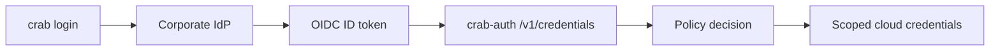

# Enterprise Authentication

Federated identity and multi-cloud credential management for crab.

## Overview

Crab supports six authentication modes for accessing cloud object storage. The
mode controls how the CLI obtains credentials; authorization can be handled by
cloud IAM or by the `crab-auth` auth service.

| Provider | Config Value | Use Case |
|----------|-------------|----------|
| Static (default) | `"static"` | Environment variables / cloud SDK credentials |
| AWS OIDC | `"aws-oidc"` | Corporate IdP → AWS STS temporary credentials |
| GCP Workload Identity | `"gcp-workload-identity"` | Corporate IdP → GCP federated access token |
| Azure Entra ID | `"azure-entra"` | Corporate IdP → Azure Blob Storage token |
| Crab Auth | `"crab-auth"` | Corporate IdP → custom authorization endpoint |
| None | `"none"` | No auth (local testing with MinIO) |

The default is `"static"` — identical to pre-auth behavior. Existing users
see zero change unless they opt in to a federated provider.

## Which Provider Should I Use?

| Situation | Recommended Provider |
|-----------|---------------------|
| Small team, AWS-only, basic role mapping | `aws-oidc` |
| Need per-repo access control (RBAC) | `crab-auth` with [self-hosted auth server](self-hosted-auth-server) |
| Multi-cloud (AWS + GCP or Azure) | `crab-auth` with [self-hosted auth server](self-hosted-auth-server) |
| GCP-only with Workload Identity | `gcp-workload-identity` |
| Azure-only with Entra ID | `azure-entra` |
| CI/CD with environment credentials | `static` |
| Local development with MinIO | `none` |

For most enterprise deployments with multiple teams and repos, we recommend
the **self-hosted auth server** (`crab-auth` provider). It gives you:

- Per-repository, per-operation access control through a declarative YAML policy
- Scoped credentials that restrict each user to authorized repos and operations
- A single auth layer that works across AWS, GCP, and Azure
- Full audit logging of every credential issuance
- No dependency on crab-hosted services

See [Enterprise Authorization](authorization) for the policy model and the
[Self-Hosted Auth Server](self-hosted-auth-server) guide for deployment.

## Authentication vs Authorization

Authentication identifies the user. Authorization decides what that user can do.



Direct providers such as `aws-oidc`, `gcp-workload-identity`, and
`azure-entra` rely mostly on cloud IAM for authorization. The
`crab-auth` provider lets your enterprise authorize every request by
identity, group, repository glob, operation, and cloud provider before issuing
short-lived credentials.

## Configure the provider

### Check current auth status

```bash
crab auth status
```

### Log in with your corporate IdP

```bash
crab login
```

In an interactive terminal, this opens your browser. Over SSH, use `--headless` for device code
flow:

```bash
crab login --headless
```

### Log out

```bash
crab logout
```

### Force a token refresh

```bash
crab auth refresh
```

## Configuration

Auth settings live in the `[auth]` section of your crab config. You can set
them per-user (`~/.config/crab/config.toml`) or per-repo
(`.crab/local.toml`). The 4-layer config precedence applies:
compiled defaults → user TOML → repo TOML → remote JSON.

### Common keys

| Key | Type | Default | Description |
|-----|------|---------|-------------|
| `auth.provider` | string | `"static"` | Authentication provider |
| `auth.storage_provider` | string | `"auto"` | Cloud backend: `s3`, `gcs`, `azure`, `auto` |
| `auth.issuer_url` | string | — | OIDC issuer URL (your corporate IdP) |
| `auth.client_id` | string | — | OAuth 2.0 client ID for the crab CLI app |
| `auth.auth_endpoint` | string | — | Crab Auth endpoint URL |
| `auth.scopes` | string | `"openid email profile"` | OAuth 2.0 scopes to request |
| `auth.token_cache_path` | string | `"~/.config/crab/tokens/"` | Token cache directory |

### Setting via CLI

```bash
crab config set auth.provider aws-oidc
crab config set auth.issuer_url https://login.corp.example.com
crab config set auth.client_id crab-cli-prod
```

### Setting via TOML

```toml
# ~/.config/crab/config.toml
[auth]
provider = "aws-oidc"
issuer_url = "https://login.corp.example.com"
client_id = "crab-cli-prod"
```

## Provider Setup Guides

Each provider has a dedicated step-by-step guide:

| Guide | Description |
|-------|-------------|
| [Static Credentials](static-credentials) | Default env-var and cloud SDK credentials for S3, GCS, Azure, and S3-compatible stores |
| [Enterprise Authorization](authorization) | Design per-repo and per-operation access policy |
| [Self-Hosted Auth Server](self-hosted-auth-server) | Deploy crab-auth for full RBAC control |
| [AWS OIDC](aws-credentials) | Corporate IdP → AWS STS AssumeRoleWithWebIdentity |
| [GCP Workload Identity](gcp-credentials) | Corporate IdP → GCP Workload Identity Federation |
| [Azure Entra ID](azure-credentials) | Corporate IdP → Azure Blob Storage via Entra ID |

For most enterprise deployments, we recommend the **Self-Hosted Auth Server**
(Crab Auth) approach. It gives you full control over authorization
policies without coupling your access rules to cloud IAM.

## Token Management

### Where tokens are stored

Tokens are cached at `~/.config/crab/tokens/` (configurable via
`auth.token_cache_path`). Each provider gets its own encrypted file:

```text
~/.config/crab/tokens/
├── aws-oidc.json.enc
├── gcp-workload-identity.json.enc
├── azure-entra.json.enc
└── crab-auth.json.enc
```

### Encryption

Tokens are encrypted at rest with ChaCha20-Poly1305. The encryption key is
stored in the macOS Keychain (via the `security` CLI) or falls back to
`~/.config/crab/.token-key` with `0600` permissions on Linux.

### Automatic refresh

When a cached access token is within 5 minutes of expiry, crab automatically
refreshes it using the stored refresh token before the next credential-backed
object store operation. Credential-managed stores also rebuild cloud clients
from fresh credentials before operations inside the refresh window and retry
once after stale authentication failures.

### Concurrent access

File-level locking (`flock` on Unix) prevents concurrent `crab login` /
`crab logout` from corrupting the token cache.

## Diagnostics

### crab doctor

The `crab doctor` command includes an auth health check:

```bash
crab doctor
```

```bash
crab doctor

  ✓ git                      git version 2.47.1
  ✓ crab binary            crab (on PATH)
  ✓ auth                     aws-oidc — alice@corp.example.com, expires 2026-04-24T18:30:00Z
  ✓ credentials              bucket 'ml-models' reachable
```

### crab auth status

Detailed auth state with `--json` for scripting:

```bash
crab auth status --json
```

```json
{
  "provider": "aws-oidc",
  "identity": "alice@corp.example.com",
  "token_expiry": "2026-04-24T18:30:00Z",
  "token_expired": false,
  "refresh": true,
  "provider_settings": [
    { "key": "AWS role", "value": "arn:aws:iam::123456789012:role/crab-developer" },
    { "key": "Region", "value": "us-west-2" }
  ]
}
```

## Troubleshooting

### "login is not needed for the 'static' provider"

You're using the default static provider. If you want federated auth, set
`auth.provider` first:

```bash
crab config set auth.provider aws-oidc
```

If you want to keep using environment variables, cloud SDK profiles, or
S3-compatible credentials, see [Static Credentials](static-credentials).

### "no cached tokens — run `crab login`"

Your tokens have been cleared or you haven't logged in yet:

```bash
crab login
```

### "token refresh returned HTTP 400"

Your refresh token has expired. Re-authenticate:

```bash
crab login
```

### "STS AccessDenied: Not authorized to perform sts:AssumeRoleWithWebIdentity"

The IAM role's trust policy doesn't accept tokens from your IdP. Ask your
platform admin to verify the OIDC provider is registered and the trust policy
includes your IdP's issuer URL.

### Device code flow over SSH

When working over SSH, crab can't open a browser. Use `--headless`:

```bash
crab login --headless
```

This displays a URL and code. Open the URL on any device, enter the code, and
complete authentication. The CLI polls until you're done (5-minute timeout).

## Related Commands

- [`crab config`](configuration) — read/write auth configuration
- [Static Credentials](static-credentials) — default env-var and cloud SDK credential discovery
- [`crab doctor`](/docs/cli/diagnostics/health-check) — health check including auth
- [`crab env`](environment-info) — print environment diagnostics

## Credential helper interop

Crab's primary auth path is cloud-native: explicit STS credentials from
environment variables, or the cloud SDK's default credential chain
(`AmazonS3Builder::from_env()` and equivalents). That path covers the vast
majority of deployments.

For deployments that front `crab://` through an HTTP gateway requiring
basic auth or a bearer token — for example, a signed-URL auth service
fronting an S3 bucket — crab integrates with standard git credential
helpers via [`gix-credentials`](https://docs.rs/gix-credentials).

### Precedence

Crab consults auth sources in this fixed order; the first source that
returns a usable credential wins.

1. **Explicit STS credentials** from environment or config
   (`AWS_ACCESS_KEY_ID`, `AWS_SESSION_TOKEN`, `auth.aws.*` config).
2. **Cloud SDK default credential chain** (`from_env()` on the
   object_store builder).
3. **Git credential helper cascade** (`credential.helper`,
   `credential.<url>.helper`), resolved through `gix-credentials`.
4. **Anonymous** (fall-through when no helper is configured).

Explicit cloud-SDK credentials always win; the credential helper is only
consulted for HTTP-style auth when no cloud-SDK path resolves.

### Configuration

Any `credential.helper` entry recognized by git works. Typical shapes:

```gitconfig
# Global helper — applies to every url
[credential]
    helper = osxkeychain

# URL-scoped helper — applies only to the matching prefix
[credential "crab://bucket/repo"]
    helper = !my-bearer-token-vendor --bucket bucket

# Clear an inherited helper for a specific url
[credential "crab://unsafe-bucket"]
    helper =
```

The `!command` shell-execution form is supported; crab delegates parsing
to `gix-credentials`, which knows about bare names (`osxkeychain`,
`libsecret`, `manager-core`), absolute paths with arguments, and shell
scripts.

### Erase on auth failure

A 401 or 403 from the gateway triggers an automatic `erase` on the helper
cascade, so helpers that cache locally (`osxkeychain`, `libsecret`) evict
the stale credential before crab falls through to anonymous. No user
action required.

### Prompting disabled

Crab never prompts interactively. The remote helper runs under `git
push` / `git fetch`, which owns stdin; an interactive prompt would hang
the parent git process. Helpers that would normally prompt fall through
to anonymous instead.
