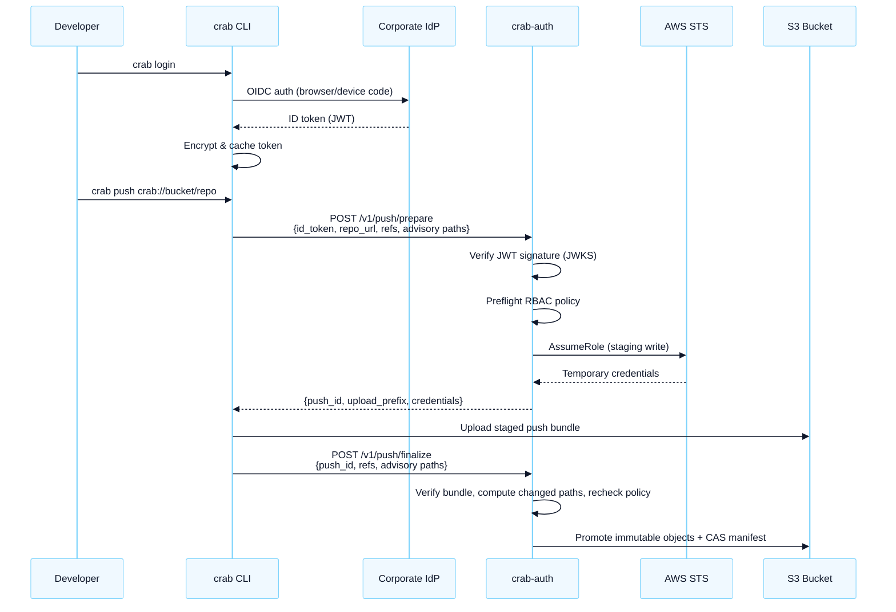

# Self-Hosted Auth Server

Deploy crab-auth in your infrastructure to get identity-based access control
for crab repositories. Your developers authenticate with your corporate IdP,
and crab-auth evaluates your RBAC policy to issue scoped cloud credentials.

This Python FastAPI service remains the authoritative production path for
existing direct repositories until the Rust compatibility routes pass the
published parity gates. Replacing the endpoint does not move repository data
or create a managed logical URL. Follow
[Migrate to the Managed Service](/docs/cli/managed-service/migration) before
changing production routing.

## Why Self-Host?

| Benefit | Description |
|---------|-------------|
| **Your policies, your rules** | Define who can push or fetch each repository through a declarative YAML policy |
| **Credentials never leave your network** | crab-auth runs in your VPC, calls your STS, returns creds to your developers |
| **No vendor dependency** | If crab (the company) disappears, your auth still works |
| **Multi-cloud** | Single auth layer across AWS, GCP, and Azure storage |
| **Audit everything** | Structured logs of every credential issuance for compliance |

## Request Flow



Protected push accepts branch ref updates only. The receive helper rejects
non-fast-forward updates server-side, so modified clients cannot force-push or
rewrite branch history unless a future explicit policy operation is added.
Path-scoped push rules require at least one advisory or verified changed path;
use a non-path-scoped push rule for intentional ref-only or metadata-only
updates.

## Start the authentication server

Test the full flow locally with Docker:

```bash
cd crab/deploy/auth-service

# API smoke: start mock IdP + crab-auth
docker compose up --build -d

# Run the API auth/RBAC smoke
./scripts/e2e-test.sh

# Clean up
docker compose down
```

That verifies JWT verification, RBAC policy evaluation, direct push credential
rejection, and protected-push staging credential generation.

For a stronger local E2E with a real S3-compatible object store and the Crab
CLI push/clone/hydrate flow, run this from the repository root:

```bash
crab/deploy/auth-service/scripts/e2e-rustfs-docker.sh
```

The RustFS wrapper builds the local binaries, starts RustFS in Docker, runs the
Crab Auth service and local JWKS server, creates a protected Crab repo, verifies
Alice's path-filtered clone/hydrate, verifies Bob's repo-wide view, accepts an
allowed protected push, rejects a denied protected push, and confirms the denied
mutation was not applied.

## Production Setup

For a complete step-by-step guide covering IdP registration, cloud role
creation, policy writing, deployment, verification, and team onboarding, start
with the [Enterprise Authorization](authorization) guide.

The short version:

### 1. Register crab at your IdP

Create a public OAuth2 client with Authorization Code + PKCE and Device Code
grants. Include `email` and `groups` claims in the ID token.

### 2. Create cloud credential roles

For AWS, the base role needs access to your Crab buckets. crab-auth uses inline
session policies to scope each request down to the requested repo prefix. For
Azure and GCP, follow the provider scoping notes below before enabling
production traffic.

### 3. Write your RBAC policy

```yaml
# config/policy.yaml
version: "1"
default_provider: aws

rules:
  - group: "platform-team"
    repos: ["*"]
    operations: ["*"]

  - group: "ml-engineers"
    repos: ["models/*", "datasets/*"]
    operations: ["push", "fetch", "clone", "hydrate", "pull"]

  - identity: "*"
    repos: ["shared/*"]
    operations: ["fetch", "clone"]
```

### 4. Deploy

Choose your deployment method:

| Method | Command |
|--------|---------|
| Docker | `docker run -p 8080:8080 -e CRAB_AUTH_JWKS_URL=... crab-auth` |
| AWS Lambda | `cd terraform && terraform apply` |
| AWS SAM | `cd sam && sam deploy --guided` |
| Cloud Run | `docker build -f cloudrun/Dockerfile -t gcr.io/PROJECT/crab-auth . && docker push gcr.io/PROJECT/crab-auth && gcloud run deploy crab-auth --image gcr.io/PROJECT/crab-auth` |

### 5. Configure developers

```toml
# ~/.config/crab/config.toml
[auth]
provider = "crab-auth"
issuer_url = "https://login.yourcompany.com"
client_id = "crab-cli-prod"
auth_endpoint = "https://crab-auth.internal.yourcompany.com/v1/credentials"
```

### 6. Developers log in and use crab

```bash
crab login
# Authenticated as alice@yourcompany.com (crab-auth)

crab clone crab://ml-bucket/models/gpt4
crab push
```

## RBAC Policy Reference

The policy file controls who can access which repositories and what operations
they can perform. Deny rules are checked before allow rules. Matching allow
rules for the same identity, repository, and operation are unioned, and
matching allow rules must resolve to a single storage provider.

### Rule structure

```yaml
rules:
  - identity: "alice@example.com"   # Match by email
    # OR
    group: "team-name"              # Match by IdP group claim
    repos:                          # Glob patterns
      - "models/*"
      - "datasets/public-*"
    operations:                     # Allowed operations
      - "push"
      - "fetch"
      - "clone"
    provider: aws                   # Optional: override default
```

### Operations

| Operation | Access | Description |
|-----------|--------|-------------|
| `push` | protected receive | Upload staged immutable data; crab-auth verifies changed paths and commits the manifest |
| `fetch` | read | Download objects from remote |
| `clone` | read | Initial repository clone |
| `hydrate` | read | Materialize pointer files |
| `pull` | read | Git pull + hydrate |
| `gc` | read+write | Garbage collection |
| `repack` | read+write | Consolidate remote Git pack files |
| `compact` | read+write | Merge small shards |
| `lock` | read+write | Advisory file locking |
| `lfs` | read+write | Git LFS compatibility operations |
| `metadb` | read+write | Metadata database writes |
| `optimize-xorbs` | read+write | Rewrite xorb layout |
| `tier` | read+write | Apply storage tier lifecycle actions |
| `workflow-push-cache` | read+write | Upload workflow cache entries |
| `fsck` | read | Integrity verification |
| `mount` | read | Virtual filesystem access |
| `du` | read | Disk usage queries |
| `doctor` | read | Health checks |
| `clone:shard-sync` | read | Clone-time shard synchronization |
| `diff` | read | Remote-aware diff operations |
| `smudge` | read | Git filter smudge hydration |
| `ship:manifest-check` | read | Manifest validation before ship |
| `prune` | read | Prune planning and checks |
| `workflow-cache-pull` | read | Download workflow cache entries |

Use `"*"` to match all operations in policy rules. The credential request
itself must always name a concrete operation; request operation `"*"` is
rejected.

### Deny rules

Deny rules are checked before allow rules and cannot be overridden:

```yaml
deny:
  - identity: "former-employee@example.com"
    repos: ["*"]
    operations: ["*"]
```

### Wildcards

- `"*"` in `repos` matches any repository path
- `"*"` in `identity` matches any authenticated user
- `"*"` in `operations` matches any operation
- Glob patterns (`models/*`) match path segments

## Environment Variables

| Variable | Required | Description |
|----------|----------|-------------|
| `CRAB_AUTH_JWKS_URL` | Yes | Your IdP's JWKS endpoint for token verification |
| `CRAB_AUTH_ISSUER` | Yes | Expected `iss` claim in ID tokens |
| `CRAB_AUTH_AUDIENCE` | Yes | Expected `aud` claim (your client_id) |
| `CRAB_AUTH_POLICY_PATH` | No | Path to policy YAML (default: `/etc/crab-auth/policy.yaml`) |
| `CRAB_AUTH_AWS_ROLE_ARN` | For AWS | IAM role to assume for credential generation |
| `CRAB_AUTH_AWS_EXTERNAL_ID` | If trust policy requires it | STS ExternalId sent when assuming `CRAB_AUTH_AWS_ROLE_ARN` |
| `CRAB_AUTH_AWS_REGION` | No | AWS region (default: `us-east-1`) |
| `CRAB_AUTH_GCP_PROJECT` | For GCP | GCP project ID |
| `CRAB_AUTH_GCP_SA_EMAIL` | For GCP | Service account to impersonate |
| `CRAB_AUTH_AZURE_TENANT_ID` | For Azure | Azure tenant ID |
| `CRAB_AUTH_AZURE_SUBSCRIPTION_ID` | For Azure | Azure subscription ID |
| `CRAB_AUTH_SESSION_DURATION` | No | Credential lifetime in seconds (default: `3600`) |
| `CRAB_AUTH_LOG_LEVEL` | No | `DEBUG`, `INFO`, `WARNING`, `ERROR` |
| `CRAB_AUTH_DRY_RUN` | No | `true` for testing without real cloud credentials |
| `CRAB_AUTH_RATE_LIMIT_PER_MINUTE` | No | Per-instance credential request refill rate (default: `120`) |
| `CRAB_AUTH_RATE_LIMIT_BURST` | No | Per-instance token bucket burst size (default: `30`) |
| `CRAB_AUTH_RATE_LIMIT_MAX_KEYS` | No | Maximum tracked client rate-limit keys per instance (default: `10000`) |
| `CRAB_AUTH_TRUST_PROXY_HEADERS` | No | Trust `X-Forwarded-For` or `X-Real-IP` for rate-limit keys (default: `false`) |

## How It Works

### Token verification

crab-auth fetches your IdP's public signing keys from the JWKS endpoint and
verifies every incoming JWT:

- **Signature**: RS256 or ES256 against the IdP's published keys
- **Issuer**: `iss` claim must match `CRAB_AUTH_ISSUER`
- **Audience**: `aud` claim must match `CRAB_AUTH_AUDIENCE`
- **Expiration**: `exp` must be in the future

Invalid tokens get a 401. The CLI automatically refreshes expired tokens
and retries once.

### Credential scoping

When an AWS read request is authorized, crab-auth calls AWS STS `AssumeRole`
with an inline session policy that restricts access to the specific S3 prefix:

```json
{
  "Version": "2012-10-17",
  "Statement": [
    {
      "Effect": "Allow",
      "Action": ["s3:GetObject"],
      "Resource": "arn:aws:s3:::ml-bucket/models/gpt4/*"
    }
  ]
}
```

For protected push, the inline session policy grants `s3:PutObject` only under
the server-generated staging prefix:

```json
{
  "Version": "2012-10-17",
  "Statement": [
    {
      "Effect": "Allow",
      "Action": ["s3:PutObject"],
      "Resource": "arn:aws:s3:::ml-bucket/models/gpt4/staging/0123456789abcdef0123456789abcdef/*"
    }
  ]
}
```

Even if the base IAM role has broad S3 access, each developer only gets
credentials for the specific repo and staging prefix they're accessing.

Azure uses directory-scoped SAS for non-root repo prefixes (`sr=d` with `sdd`).
Container-root repo URLs are rejected.

GCP uses Cloud Storage Credential Access Boundaries so issued credentials are
downscoped to canonical reads for read operations or protected-push staging
writes.

All repo URLs must include a non-empty repo prefix such as
`crab://bucket/team/repo`; bucket-root and container-root repo URLs are rejected
because they cannot be safely scoped as an enterprise repo boundary.
Protected-push staging IDs are server-generated 32-character lowercase hex
tokens.

### Credential caching

The CLI caches read and maintenance credentials until they're within 5 minutes
of expiry. Protected-push staging credentials are per push and scoped to one
server-generated `push_id`.

## Troubleshooting

### "Crab Auth endpoint returned 401"

Your ID token failed verification. Common causes:
- Token expired → `crab logout && crab login`
- Wrong `CRAB_AUTH_ISSUER` (trailing slash mismatch)
- Wrong `CRAB_AUTH_AUDIENCE` (must match your client_id exactly)

### "Crab Auth endpoint returned 403"

Your RBAC policy denied the request. Check:
- `crab auth status` to see your identity
- Your IdP's token debugger to verify group claims
- `policy.yaml` for a matching rule

### "Crab Auth request failed after retries"

crab-auth is unreachable or returning 5xx. The CLI retries 3 times with
exponential backoff (1s, 2s, 4s). Check liveness and readiness:

```bash
curl https://your-crab-auth-endpoint/health
curl https://your-crab-auth-endpoint/ready
```

### "NoCredentials"

No cached tokens found. Run `crab login`.

## Related

- [Enterprise Authentication Overview](enterprise-auth) — all auth providers
- [Enterprise Authorization](authorization) — policy design and rollout steps
- [AWS Credentials](aws-credentials) — direct AWS OIDC (no auth server needed)
- [GCP Credentials](gcp-credentials) — direct GCP Workload Identity Federation
- [Azure Credentials](azure-credentials) — direct Azure Entra ID
