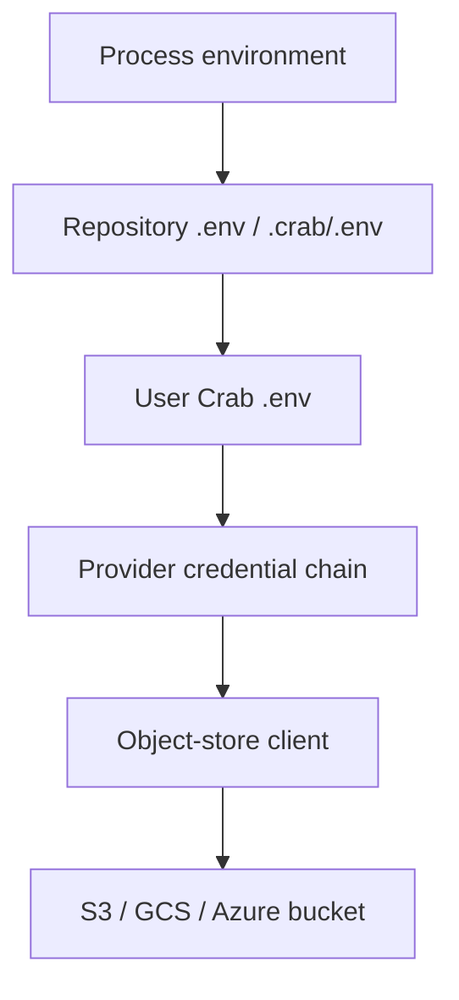

## Static Credential Mode

<Callout type="warning" title="Credentials do not qualify a provider">
  Successful credential discovery only proves access. Amazon S3, GCS, and
  Azure are currently unqualified for release use; RustFS is
  development-qualified. Check [Provider Qualification](/docs/cli/storage/provider-qualification)
  for the retained contract status.
</Callout>

`static` is Crab's default auth provider. In this mode, Crab does not run
`crab login` and does not store long-lived cloud access keys in Crab config.
It builds an object-store client from the credential sources supported by the
selected object-store provider.

Use static credentials for local development, CI, S3-compatible stores, and
small-team deployments where cloud IAM already controls bucket access.



## CLI Credential Order

When you run `crab` directly in a terminal or from Git, Crab resolves static
credentials in this order:

1. Existing process environment variables.
2. `.env` in the Git repository root.
3. `.env` or `.crab/.env` while walking up from the current directory.
4. `~/.config/crab/.env`.
5. Provider-native sources such as workload identity, instance/task identity,
   GCP Application Default Credentials, or Azure CLI when supported.

Earlier sources win. Crab only fills in missing variables from later `.env`
files, so an explicit shell export overrides project and user-global files.

## Amazon S3

For Amazon S3, the usual static setup is:

```bash
export AWS_ACCESS_KEY_ID=...
export AWS_SECRET_ACCESS_KEY=...
export AWS_REGION=us-west-2
```

For temporary credentials, also set:

```bash
export AWS_SESSION_TOKEN=...
```

For production and CI, prefer web identity or an attached ECS/EC2 role:

```bash
export AWS_WEB_IDENTITY_TOKEN_FILE=/var/run/secrets/oidc-token
export AWS_ROLE_ARN=arn:aws:iam::123456789012:role/crab-writer
```

The current S3 provider does not read `AWS_PROFILE`, `~/.aws/config`, or
`~/.aws/credentials`. If an SSO/profile workflow produces temporary
credentials, export `AWS_ACCESS_KEY_ID`, `AWS_SECRET_ACCESS_KEY`, and
`AWS_SESSION_TOKEN` into the Crab process.

## S3-Compatible Storage

Crab connects to MinIO, Cloudflare R2, RustFS, Ceph, and other S3-compatible
services through the `s3` provider. There is no separate provider value such
as `r2` or `minio`.

Set the access key, secret key, region expected by the service, and its S3 API
endpoint:

```bash
export AWS_ACCESS_KEY_ID=...
export AWS_SECRET_ACCESS_KEY=...
export AWS_REGION=us-east-1
export AWS_ENDPOINT_URL=https://s3.example.com
export AWS_VIRTUAL_HOSTED_STYLE_REQUEST=false
```

`AWS_ENDPOINT_URL` must be the service's S3 API endpoint, not a bucket's public
download URL or web dashboard URL. Path-style addressing is the default;
setting `AWS_VIRTUAL_HOSTED_STYLE_REQUEST=false` makes that choice explicit for
services whose TLS certificate does not cover bucket-prefixed hostnames.

Use `AWS_ALLOW_HTTP=true` only for a trusted development endpoint that uses
plain HTTP:

```bash
export AWS_ENDPOINT_URL=http://127.0.0.1:9000
export AWS_ALLOW_HTTP=true
```

Do not enable `AWS_ALLOW_HTTP` for HTTPS services such as Cloudflare R2.

### Cloudflare R2 example

Create an R2 API token with object read and write access to the target bucket,
then use the S3 credentials and endpoint shown by Cloudflare:

```bash
export AWS_ACCESS_KEY_ID=<R2_ACCESS_KEY_ID>
export AWS_SECRET_ACCESS_KEY=<R2_SECRET_ACCESS_KEY>
export AWS_REGION=auto
export AWS_ENDPOINT_URL=https://<ACCOUNT_ID>.r2.cloudflarestorage.com
export AWS_VIRTUAL_HOSTED_STYLE_REQUEST=false

mkdir my-project && cd my-project
crab configure crab://<BUCKET>/<REPOSITORY> --provider s3
crab doctor
```

For a jurisdiction-restricted bucket, use the endpoint Cloudflare provides,
such as `https://<ACCOUNT_ID>.eu.r2.cloudflarestorage.com`. If Cloudflare issues
temporary credentials, export their session token as `AWS_SESSION_TOKEN` too.

### MinIO or RustFS example

For a service running locally on port 9000:

```bash
export AWS_ACCESS_KEY_ID=<ACCESS_KEY_ID>
export AWS_SECRET_ACCESS_KEY=<SECRET_ACCESS_KEY>
export AWS_REGION=us-east-1
export AWS_ENDPOINT_URL=http://127.0.0.1:9000
export AWS_VIRTUAL_HOSTED_STYLE_REQUEST=false
export AWS_ALLOW_HTTP=true

crab configure crab://my-bucket/my-project --provider s3
crab doctor
```

Use the region, endpoint, and TLS policy configured by your deployment when
they differ from this local example.

## GCS and Azure Variables

For Google Cloud Storage, use Application Default Credentials or a service
account JSON file:

```bash
gcloud auth application-default login
export GOOGLE_APPLICATION_CREDENTIALS=/path/to/service-account.json
```

For Azure Blob Storage, use one of the supported Azure SDK environment shapes:

```bash
export AZURE_STORAGE_ACCOUNT_NAME=myaccount
export AZURE_STORAGE_ACCOUNT_KEY=...
```

For Azure workload identity:

```bash
export AZURE_STORAGE_ACCOUNT_NAME=myaccount
export AZURE_CLIENT_ID=...
export AZURE_TENANT_ID=...
export AZURE_FEDERATED_TOKEN_FILE=/var/run/secrets/azure/tokens/azure-identity-token
```

## Selecting the Storage Provider

`crab://` remotes default to S3-compatible storage. To force a provider, set
`auth.storage_provider` or `CRAB_STORAGE_PROVIDER`:

```bash
crab config set auth.storage_provider s3
crab config set auth.storage_provider gcs
crab config set auth.storage_provider azure
```

or:

```bash
export CRAB_STORAGE_PROVIDER=s3
```

Use `auto` when the same config should run in different environments and the
provider is supplied by environment. `CRAB_STORAGE_PROVIDER` itself must be
unset or name `s3`, `gcs`, or `azure`; Crab rejects invalid explicit values.

## What Crab Stores

Crab repository config stores the remote URL and auth mode, not secret values.
Do not put cloud access keys in `.crab/config.toml`, `.crab.toml`, Git config,
or committed docs.

For static mode, any long-lived secret storage is owned by your shell, `.env`
files, CI secret store, or OS credential store. Crab only reads resolved values
at runtime. Team deployments should avoid committed `.env` files and use
short-lived workload credentials wherever the provider supports them.

For federated providers such as `aws-oidc`, `gcp-workload-identity`,
`azure-entra`, and `crab-auth`, Crab stores encrypted login tokens under the
configured token cache path. Those tokens are separate from static cloud access
keys.

## Verifying Credential Resolution

Run:

```bash
crab doctor
```

For static mode, a healthy credential check looks like:

```text
✓ auth                     static (no crab-managed auth)
✓ credentials              bucket 'my-bucket' reachable
✓ credential discovery     AWS_ACCESS_KEY_ID=****
```

Use `crab env` to inspect which relevant environment variables are set in the
current shell. Avoid pasting raw `AWS_SECRET_ACCESS_KEY`,
`AWS_SESSION_TOKEN`, service account JSON, SAS tokens, or connection strings
into logs or bug reports.

## Troubleshooting

| Symptom | What to check |
|---------|---------------|
| `crab doctor` says no remote is configured | Run from a Crab repository or initialize one with `crab init` |
| `credentials` is skipped | The current directory has no `.crab/remote` or `.crab/config.toml` |
| Bucket is not reachable | Check bucket name, region, endpoint URL, and IAM permissions |
| Credentials work in one shell but not another | Compare exported variables and the `.env` files loaded from each working directory |

## Related

- [Environment Info](environment-info)
- [Enterprise Authentication](enterprise-auth)
- [AWS OIDC](aws-credentials)
- [Self-Hosted Auth Server](self-hosted-auth-server)
