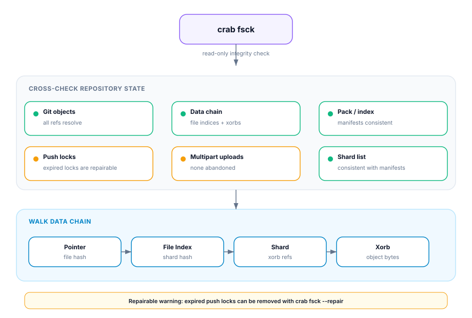

## Verifying Repository Integrity

`crab fsck` cross-checks Crab manifests, pack/index presence, the shard/xorb
data chain, and coordination state against the object store. It is not yet a
full reconstruction and Git-connectivity check of current head.

Think of it as `git fsck` extended to cover Crab's object store layer.



## Running an Integrity Check

```bash
crab fsck
```

```text
  ✓ Git objects          all refs resolve
  ✓ Data chain           all file indices and xorbs present
  ✓ Pack list            consistent
  ⚠ Push locks           1 expired lock (3 days old)
  ✓ Multipart uploads    none abandoned
  ✓ Shard list           consistent

1 issue found:
  ⚠ Expired push lock: refs/push-locks/abc123 (age: 3d 2h)
    Repairable: yes (run with --repair)
```

## Issue Categories

### Critical (data integrity)

| Issue | Description | Auto-repairable |
|-------|-------------|:---:|
| Missing file index | Pointer references a missing file index | ✗ |
| Missing xorb | File index references a non-existent xorb | ✗ |
| Pack list divergence | Manifest-selected pack or index is absent | ✗ |

### Warnings (operational)

| Issue | Description | Auto-repairable |
|-------|-------------|:---:|
| Expired push lock | Lock from a crashed process | ✓ |
| Orphan shard | Shard not referenced by any file index | ✗ |
| Shard list divergence | Shard list doesn't match actual shards | ✗ |

## Automatic Repair

```bash
crab fsck --repair
```

Repair is conservative:
- Expired locks are deleted
- Derivable historical Git visibility proofs can be rebuilt

Repair is limited to issues explicitly marked repairable. Missing content
requires history, replica, cache, or backup recovery. Provider-side incomplete
multipart uploads require a provider lifecycle rule because the generic
object-store API cannot enumerate them.

## Verify after repair

Run the read-only check again and test reconstruction from an isolated cache:

```bash
crab fsck --json > fsck-after.json
crab hydrate path/to/representative-file.bin
```

The second `fsck` result must no longer contain the repairable issue. Hydration
adds a byte-level reconstruction check for one important path; it does not turn
`fsck` into a complete hydration of the repository. For a release gate, select
representative files across the storage classes and data paths used by that
release.

## When to Run

| Scenario | Why |
|----------|-----|
| After a push failure or crash | Check for leftover locks |
| Before running `crab gc` | Ensure reference graph is consistent |
| Periodic maintenance (CI) | Catch drift early |
| When `crab doctor` reports remote issues | Deep investigation |

## Prerequisites

- Repository must be initialized (`crab init` or `crab clone`)
- Valid cloud credentials for the remote bucket
- `--repair` requires write permissions

## CLI Reference

For complete command syntax and all available flags, see the [crab fsck reference](/docs/cli/reference/crab-fsck).
