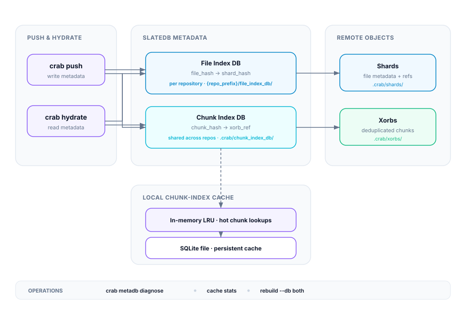

## The Metadata Subsystem

Crab maintains two SlateDB databases that map content to storage locations. These databases are what make deduplication and hydration fast — without them, every operation would need to scan all shards.



## Two Databases

| Database | Location | Maps | Purpose |
|----------|----------|------|---------|
| **File Index** | `{repo_prefix}/file_index_db/` | `file_hash → shard_hash` | Find which shard contains a file's metadata |
| **Chunk Index** | `.crab/chunk_index_db/` | `chunk_hash → xorb_ref` | Find which xorb contains a specific chunk (dedup) |

The file index is per-repository. The chunk index is shared globally across all repositories in a bucket, enabling cross-repo deduplication.

### Local Cache

A two-tier local cache sits in front of the remote chunk index:
- **In-memory LRU** — fastest lookups for hot chunks
- **SQLite file** — persistent on-disk cache at `~/.cache/crab/{bucket}/{repo-hash}/chunk-index.sqlite`

## Diagnosing Issues

### Check database health

```bash
crab metadb diagnose
```

Read-only health snapshot — reports open state, format version, epoch, and path for each database. Safe to run concurrently with pushes.

```bash
crab metadb diagnose --db chunk_index
crab metadb diagnose --db file_index --json
```

### Check local cache state

```bash
crab metadb cache stats
```

Shows the SQLite file path, on-disk size, entry count, installed shard count, and GC generation cursor.

### Run a durable Git index owner

For concurrent team pushes, keep one repository-scoped owner under a process
supervisor:

```bash
crab metadb owner --interval 30 --jsonl
```

It reuses one exclusive locator writer across generations and publishes
immutable read checkpoints before visibility repair. Push clients only pay an
owner-lease probe and do not each rebuild the shared locator. If the owner is
between generations or unavailable, complete-pack fetch remains available and
a client can resume the canonical repair path after the lease expires.

## Rebuilding from Shards

When a database is corrupted (unreadable manifest, damaged WAL, or accidental deletion), rebuild it from the source shards:

```bash
crab metadb rebuild --db chunk_index
crab metadb rebuild --db file_index
crab metadb rebuild --db both
```

Rebuild is idempotent — every write is content-addressed, so running it multiple times produces the same result. An interrupted run can be restarted without cleanup.

### When to rebuild

- `crab metadb diagnose` reports a manifest or WAL read failure
- `crab push` aborts with `MetaDbError::Open` due to corruption
- A database prefix was accidentally deleted from the bucket

### When NOT to rebuild

Rebuild is not a migration tool. Fresh repositories never need it — `Db::open` creates databases automatically on the first push.

## Clearing the Local Cache

```bash
crab metadb cache clear
```

Forces a cold re-warm on the next operation. Useful when the cache is suspected of drift or corruption, or for benchmarking. The remote state is untouched.

## Troubleshooting

| Symptom | Likely cause | Action |
|---------|--------------|--------|
| Push fails with `MetaDbError::Open` | SlateDB manifest unreadable or wrong credentials | Run `crab doctor --metadb`, check credentials, rebuild if corrupt |
| Hydrate reports `FileNotFoundInFileIndexDb` | File never pushed, or file_index_db missing entries | Verify file was pushed (check shards), rebuild file_index if needed |
| Push is slow, no dedup happening | Local cache empty or wiped | Run `crab pull` to warm cache, verify with `crab metadb cache stats` |
| Cache wiped unexpectedly | GC bumped remote generation beyond grace window | Expected after `crab gc` — cache refills on next pull/push |

## Configuration

```toml
# .crab/config.toml
[metadb.file_index]
compaction_threshold = 4
wal_flush_size = 4194304          # 4 MiB
bloom_bits_per_key = 10

[metadb.chunk_index]
compaction_threshold = 4
wal_flush_size = 4194304          # 4 MiB
bloom_bits_per_key = 10
in_memory_ceiling_bytes = 1073741824  # 1 GiB
cache_gc_grace = 3
```

All settings can be overridden with `CRAB_METADB_*` environment variables (e.g., `CRAB_METADB_CHUNK_INDEX_IN_MEMORY_CEILING_BYTES`).

## Command Help

For complete command syntax and flags, run `crab metadb --help` or
`crab metadb <subcommand> --help`.
