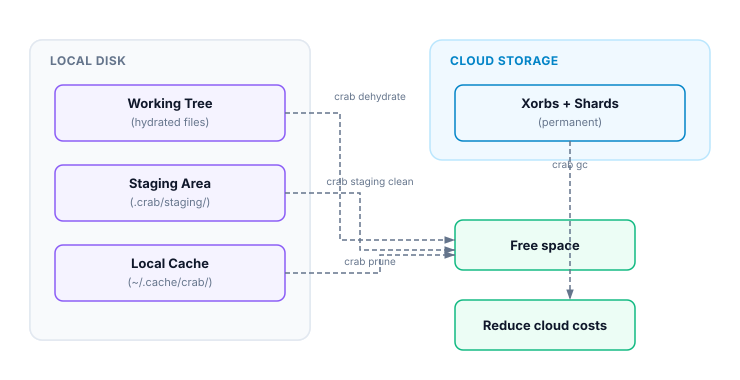

# Disk Usage

Crab stores data in several places: hydrated files in your working tree, chunks in the staging area, downloaded data in the local cache, and permanent storage in the cloud. Understanding this breakdown helps you decide when to dehydrate, prune, or clean.

## Storage Layers



## Checking Disk Usage

```bash
crab du
```

```text
Working tree:
  Tracked files:     42
  Hydrated:          12 files (3.2 GB)
  Pointers:          30 files (4.5 KB)

Staging:             45.2 MB

Local cache:         1.8 GB

Total local:         5.0 GB
```

### Include remote storage

```bash
crab du --remote
```

Adds the cloud storage size (requires network access):

```text
Remote:              8.4 GB (crab://my-bucket/my-repo)
```

## Understanding the Numbers

| Layer | What's stored | How to reduce |
|-------|--------------|---------------|
| **Working tree (hydrated)** | Full file content on disk | `crab dehydrate` |
| **Working tree (pointers)** | Tiny pointer stubs (~128 B each) | Nothing needed |
| **Staging** | Chunks waiting to be pushed | `crab staging clean` after push |
| **Local cache** | Previously downloaded chunks | `crab prune` or `crab cache clean` |
| **Remote** | All pushed xorbs and metadata | `crab gc` for unreachable objects |

## Reclaiming Space

### Reduce local usage

```bash
# Free the most space: dehydrate files you're not using
crab dehydrate --all

# Clean staging after a successful push
crab staging clean

# Remove unreferenced cache entries
crab prune
```

### Check what you'd save

```bash
# See how much hydrated content you have
crab du

# See what GC would reclaim remotely
crab gc --dry-run
```

## Verify the intended storage boundary

Run `crab du` again after local cleanup and compare the same scope. A normal
report can change because of working-tree, staging, or cache cleanup; remote
usage changes only after a remote maintenance operation. `crab dehydrate` and
`crab prune` are recoverable through later hydration or fetch, while `crab gc`
can delete unreachable remote objects after its safety rules are satisfied.

Do not compare a local-only report with a later `--remote` report as if the
difference were newly allocated data. Save JSON output and whether network
scope was enabled when tracking usage over time. Before clearing all staging
data, confirm the related pointer commits were pushed or reset.

## Choose the least destructive action

Start with working-tree dehydration when full local files are no longer needed.
Next, prune cache to its configured budget; those objects remain recoverable
from the authoritative remote. Clean staging only after verifying that pending
work was pushed or intentionally reset. Treat remote garbage collection as a
separate maintenance workflow with a dry run, grace period, and integrity
check. This order preserves the widest recovery path while addressing local
disk pressure first.

## CLI Reference

For complete command syntax and JSON output format, see the [crab du reference](/docs/cli/reference/crab-du).
