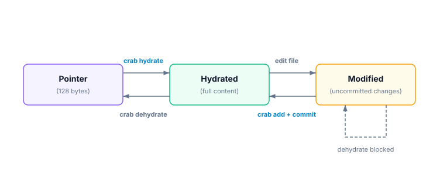

# File Status

Every Crab-tracked file in your working tree is in one of three states: **hydrated** (full content on disk), **pointer** (dehydrated, content in cloud), or **modified** (hydrated with uncommitted changes). Understanding these states is key to working effectively with Crab.

## File States



| State | Symbol | Meaning |
|-------|--------|---------|
| **Pointer** | `P` | File is a lightweight stub. Content is in cloud storage. |
| **Hydrated** | `H` | Full content is on disk, matching the committed version. |
| **Modified** | `M` | Full content on disk, but differs from the committed pointer. |

## Checking Status

```bash
crab status
```

```text
Tracked files (42 total):
  H  models/weights.bin       1.2 GB  (hydrated)
  H  models/embeddings.bin    800 MB  (hydrated)
  P  data/eval.safetensors    300 MB  (pointer)
  P  data/test.safetensors    150 MB  (pointer)
  M  config/vocab.bin         2.1 MB  (modified)
```

## Separate Crab state from Git state

Git stores a Crab pointer in the index and passes working-tree content through
the Crab clean filter when it computes status. A correctly configured filter
can map unchanged hydrated bytes back to their pointer, so hydration alone does
not imply an uncommitted Git change.

`crab status` reports a different question: whether the path is a pointer, has
full content with the committed size, or has full content with a different
size. Its `M` state is a size-based signal. A same-size content edit can still
require `git status`, `git diff`, or application-specific validation to detect.

| Observation | Meaning | Next check |
| --- | --- | --- |
| Crab `P` | Working tree contains a valid pointer | Hydrate before reading file bytes |
| Crab `H` | Full content has the committed size | Use Git or a checksum for change detection |
| Crab `M` | Full content size differs from the committed pointer | Review the edit before add or reset |
| Git reports modified after hydration | Clean-filter result differs or filter setup failed | Run `crab why <path>` and `crab doctor` |

Dehydrating can reduce checkout work before a branch change, but it should not
be used to hide a real edit:

```bash
crab dehydrate --all
git status
crab dehydrate --all
git pull origin main
crab hydrate --all
```

## Filtering by Pattern

```bash
# Check only model files
crab status '*.safetensors'

# Machine-readable output for scripting
crab status --porcelain
```

Porcelain output (one line per file):

```text
p models/weights.bin
h models/embeddings.bin
m data/train.safetensors
```

## Common Workflows

### "Which files can I work with right now?"

```bash
crab status | grep "hydrated"
```

### "What do I need to hydrate?"

```bash
crab status | grep "pointer"
```

### "Do I have uncommitted changes in tracked files?"

```bash
crab status | grep "modified"
```

Use `git status --short` as the final Git answer. Crab's state output explains
representation and expected size; it is not a byte-for-byte replacement for
Git change detection.

## CLI Reference

For complete command syntax, porcelain format, and JSON output, see the [crab status reference](/docs/cli/reference/crab-status).
