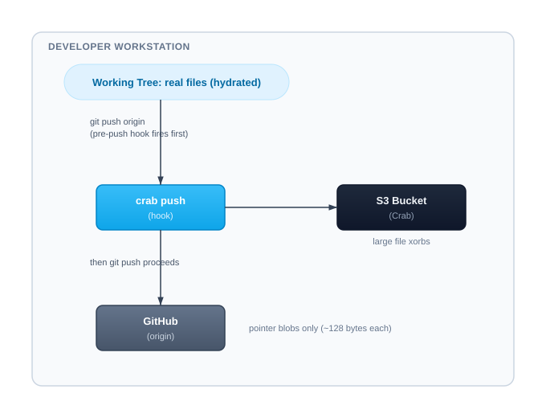

# Mirror Mode (GitHub + Crab)

Mirror mode keeps GitHub (or GitLab) as the collaboration control plane for pull requests, reviews, branch protection, CI, issues, and webhooks. Crab is a second Git remote backed by object storage and stores both the pushed Git graph and large-file data.

## Data Flow



When collaborators pull from GitHub, the `post-checkout` hook hydrates pointer files from the Crab remote automatically.

## Setup: Repository Owner

### Prerequisites

- A GitHub/GitLab repo with an `origin` remote already configured
- An S3/GCS/Azure bucket for Crab storage
- Cloud credentials configured (AWS CLI, gcloud, or az)

### Initialize

```bash
cd my-project
crab init --mirror=origin crab://my-bucket/my-repo
```

This command:
1. Validates that the `origin` remote exists
2. Adds a `crab` remote pointing to your bucket
3. Installs `pre-push`, `post-checkout`, and `post-merge` hooks
4. Generates `crab.toml` with a `[mirror]` section
5. Run `crab setup` to auto-track large file patterns in `.gitattributes`

### Push the configuration

```bash
crab setup
crab ship . -m "enable crab for large files"
```

Now `crab.toml` is on GitHub. Collaborators will inherit the mirror setup.

## Setup: Collaborator

After cloning from GitHub:

```bash
git clone git@github.com:team/project.git
cd project
crab init
```

Running `crab init` with no URL detects the `[mirror]` section in `crab.toml` and automatically:
- Adds the `crab` remote
- Installs mirror hooks
- Hydrates files per `[hydrate]` settings

If the collaborator previously ran `crab install --global`, the global filter
driver can activate from `crab.toml`, but still run `crab init` when the repo
needs the mirror remote and hooks installed locally.

## How Hooks Work

### `pre-push` — Before pushing to GitHub

```bash
#!/bin/sh
# Crab mirror: push published pointer recipes before refs go to origin
crab push --remote crab --quiet 2>/dev/null
```

Ensures large-file content reaches your bucket before pointer blobs reach GitHub. If the Crab push fails, the git push is aborted — preventing dangling pointers.

The two remote updates are not one distributed transaction. Crab can be ahead
if its push succeeds and GitHub later rejects the push. Server-side merges,
bots, and clients without the hook can also advance GitHub without advancing
Crab. Retry to converge and monitor ref divergence.

### `post-checkout` — After switching branches or cloning

```bash
#!/bin/sh
# Crab mirror: hydrate pointer files after checkout
crab hydrate . 2>/dev/null || true
```

Materializes pointer files so you see real content after branch switches. Non-fatal on failure.

### `post-merge` — After pulling or merging

```bash
#!/bin/sh
# Crab mirror: hydrate after merge/pull
crab hydrate . 2>/dev/null || true
```

Same behavior as post-checkout, triggered by `git pull` and `git merge`.

### Existing hooks preserved

Crab appends its lines to existing hooks — it never overwrites your custom hooks. Installation is idempotent.

## Checking Status

```bash
crab status
```

With mirror mode active, you'll see:

```text
Mirror: origin ↔ crab (crab://my-bucket/my-repo) | healthy
  Crab remote: reachable
  Pending push: 0 files
```

## Configuration

The `[mirror]` section in `crab.toml`:

```toml
[mirror]
origin_remote = "origin"    # GitHub/GitLab remote name
crab_remote = "crab"        # Crab storage remote name
```

## When to Use Mirror Mode

**Use mirror mode when:**
- Your team uses GitHub/GitLab for code review and CI
- You have large files (models, datasets, assets) that bloat git
- You want PRs to show pointer diffs, not binary blobs
- You need deduplication and lazy checkout for large files

**Use standard mode when:**
- Crab is your only remote (no GitHub/GitLab)
- You don't need code review on a separate platform
- You want the simplest possible setup

## Production Team Posture

- Keep GitHub/GitLab canonical for collaboration and policy. Crab does not
  provide pull requests, branch protection, merge queues, CI, issues, or
  webhooks.
- Keep Crab/object storage canonical for large data, using workload identity
  and least-privilege bucket policy instead of shared static keys.
- Install hooks on every developer and automation clone, then enforce pointer
  availability in CI because client hooks are bypassable.
- Use `crab mirror SOURCE DESTINATION` only as a scheduled one-way full-ref DR
  sync. It uses `git push --mirror`, which deletes destination-only refs; never
  schedule it in both directions.
- Before using Crab as the sole Git backbone, qualify multi-node storage
  failures and prove monitoring, backup restore, RPO, and RTO in your own
  environment.

## Troubleshooting

### Hooks not firing

Verify hooks are installed:
```bash
ls -la .git/hooks/pre-push
cat .git/hooks/pre-push | grep "Crab mirror"
```

Re-run `crab init` to reinstall if missing.

### Hydration fails after pull

Check credentials and remote connectivity:
```bash
crab doctor
git remote get-url crab
```

### Push rejected by GitHub (file too large)

This means the pre-push hook didn't fire. Check that:
1. The hook file exists and is executable
2. `crab` is on your PATH
3. Run `crab init` to reinstall hooks

## Related

- [Project Configuration](/docs/cli/getting-started/project-config) — `crab.toml` reference
- [`crab init`](/docs/cli/reference/crab-init) — the `--mirror` flag
- [`crab ship`](/docs/cli/reference/crab-ship) — one-command commit + push
