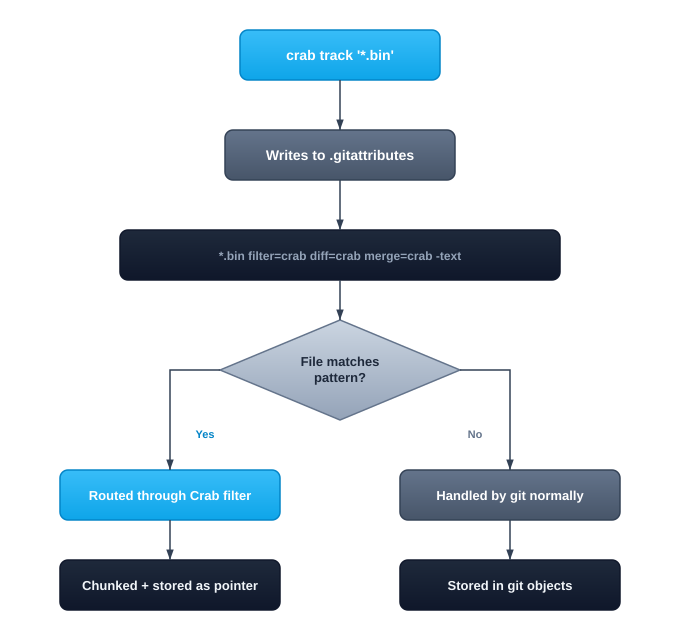

# Tracking Files

Tracking tells Crab which files to manage. When you track a pattern like `*.safetensors`, Crab registers it in `.gitattributes` so that git routes matching files through Crab's filter driver. From that point on, those files are chunked, deduplicated, and stored in cloud storage instead of bloating your git history.

## How Tracking Works



The `.gitattributes` entry tells git three things:
- **filter=crab** — Route through Crab's clean/smudge filter on commit/checkout
- **diff=crab** — Use Crab's chunk-level diff driver
- **-text** — Treat as binary (no line-ending conversion)

## Setting Up Tracking

### Automatic tracking (recommended)

In most cases, you don't need to manually configure tracking. `crab setup` and
`crab add` automatically detect large files and track their extensions:

```bash
crab init crab://my-bucket/my-project
crab setup
# Detected large files — tracking: *.safetensors, *.bin
```

If you add new file types later, `crab add` will detect untracked extensions and auto-track them.

### Manual tracking

For fine-grained control, track patterns explicitly:

```bash
crab track '*.safetensors'
crab track '*.bin'
crab track '*.onnx'
crab track '*.parquet'
```

### Track directories

```bash
crab track 'data/models/**'
crab track 'assets/textures/**'
```

### View current tracking patterns

```bash
crab track
```

Output:

```text
*.safetensors (filter=crab diff=crab merge=crab -text)
*.bin (filter=crab diff=crab merge=crab -text)
data/models/** (filter=crab diff=crab merge=crab -text)
```

### Stop tracking a pattern

```bash
crab untrack '*.onnx'
```

This removes the pattern from `.gitattributes`. Files already stored as pointers remain as pointers until you hydrate and re-add them outside Crab tracking.

## What Should You Track?

Track files that are:
- **Large** (> 1 MB) — Where git's storage becomes inefficient
- **Binary** — Where git can't diff or merge meaningfully
- **Frequently updated** — Where deduplication saves the most space

### Common patterns by domain

| Domain | Patterns |
|--------|----------|
| Machine Learning | `*.safetensors`, `*.bin`, `*.onnx`, `*.pkl`, `*.h5` |
| Game Development | `*.fbx`, `*.blend`, `*.psd`, `*.png`, `*.wav` |
| Data Engineering | `*.parquet`, `*.arrow`, `*.csv` (large), `*.db` |
| Media Production | `*.mov`, `*.mp4`, `*.exr`, `*.dpx` |
| Scientific Computing | `*.hdf5`, `*.nc`, `*.fits`, `*.npy` |

## Sharing Tracking Rules

`.gitattributes` is a regular git file — commit it to share tracking rules with your team:

```bash
crab track '*.bin'
crab track '*.safetensors'
git add .gitattributes
git commit -m "Track model files with Crab"
```

When collaborators clone or pull, they automatically get the same tracking configuration. No per-user setup needed.

## Tracking vs. Adding

Tracking and adding are conceptually separate, but Crab handles the common case automatically:

- **Auto-track flow** (most users): Run `crab setup` after `crab init`, or run `crab add .` when no patterns exist. Crab detects large files and tracks them automatically.
- **Manual flow** (fine-grained control): Register patterns first with `crab track`, then `crab add`.

```bash
# Automatic (recommended for most users):
crab add '*.bin'
# → Auto-tracks *.bin if not already in .gitattributes, then stages

# Manual (when you need precise control):
crab track '*.bin'
crab add '*.bin'
git commit -m "Update model"
git push

# One-shot (simplest possible):
crab ship '*.bin' -m "Update model"
```

## Pattern Syntax

Crab uses the same glob syntax as `.gitattributes`:

| Pattern | Matches |
|---------|---------|
| `*.bin` | Any `.bin` file in any directory |
| `models/**` | Everything under `models/` recursively |
| `data/*.parquet` | `.parquet` files directly in `data/` (not subdirectories) |
| `**/*.safetensors` | `.safetensors` files at any depth |

## Next Steps

- [Adding Files](/docs/cli/daily-workflow/adding-files) — Stage tracked files for push
- [Working with Files](/docs/cli/daily-workflow) — The complete add → commit → push cycle
- [Working with Files](/docs/cli/daily-workflow) — Understand hydration, dehydration, and the file lifecycle
