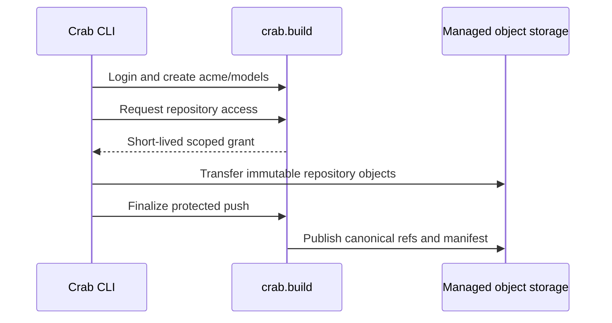

# Managed Service Quickstart

<Callout type="warning" title="Managed Service is coming soon">
  The managed service is not yet publicly available. This page previews the
  planned workflow and may change before launch.
</Callout>

Crab's managed service gives a repository a stable logical URL while Crab
operates its catalog, authorization, and storage placement:

```text
crab://crab.build/acme/models
```

The URL has exactly one authority and two lowercase path segments:
organization and repository. `crab://crab.build//acme/models` is invalid.
Bucket, region, physical prefix, and short-lived transfer credentials are
runtime routing details and are never written into the repository remote.



## 1. Sign in

Browser login is the default:

```bash
crab login https://crab.build
```

For SSH, CI setup, or another headless terminal, use the device flow:

```bash
crab login https://crab.build --headless
```

Login performs HTTPS discovery, validates the service authority and API
compatibility, authenticates through the advertised OIDC provider, stores the
tokens in Crab's encrypted token cache, and makes `crab.build` the active
managed profile.

For a self-hosted service, use its exact HTTPS origin. An enterprise CA can be
installed for that profile without weakening public TLS for other services:

```bash
crab login https://code.corp.example \
  --enterprise-ca /etc/company/ca.pem \
  --private-ca-only
```

## 2. Create an organization and repository

Create the organization first. The creating principal becomes its owner.

```bash
crab organization create acme
crab repo create acme/models
```

Repository provisioning is asynchronous. Inspect it until the service reports
the repository as active:

```bash
crab repo info acme/models --json | jq '.data | {canonical_url, state, revision}'
```

While provisioning is still in progress, repository access returns an
actionable non-active-state error. Do not initialize a different physical
location or replace the managed URL.

## 3. Clone the canonical URL

The full URL always identifies the hosted repository:

```bash
crab clone crab://crab.build/acme/models
cd models
```

With `crab.build` active, the CLI-only shorthand is equivalent:

```bash
crab clone acme/models
```

After clone, verify that the public identity was retained:

```bash
git remote get-url origin
cat .crab/remote
```

Both values remain `crab://crab.build/acme/models`. A default clone leaves
large files as pointer blobs. Use `--no-lazy` to hydrate everything during
clone or hydrate selected content later.

## 4. Commit and push

Stage large-file content, commit the pointer blobs, and push normally:

```bash
crab add models/weights.safetensors
git add models/weights.safetensors .gitattributes
git commit -m "Add model weights"
crab push
```

`git push` also works through `git-remote-crab`. For managed repositories both
commands use the protected service flow: prepare, immutable staging upload,
verification, and service-owned canonical publication. The client never
receives canonical-write credentials.

For automation that consumes one terminal result, use JSON:

```bash
crab push --json | jq -e '.schema == "push"'
```

Use `--jsonl` when a runner or UI needs streaming progress. See
[Structured Output](/docs/cli/reference/structured-output).

## 5. Fetch and hydrate updates

Update Git refs first, then optionally pre-warm Crab objects and materialize
the files you need:

```bash
git fetch origin
crab fetch --all
git switch main
crab hydrate 'models/*.safetensors'
```

`git fetch` negotiates Git refs and packs through the remote helper. `crab
fetch` does not replace it; `crab fetch` reads `.crab/remote` and downloads
Crab shards and xorbs into the local cache so later hydration is faster.

## 6. Log out

Remove only the hosted service tokens:

```bash
crab logout crab.build
```

Logout attempts OIDC revocation when the provider supports it, then removes
the local encrypted tokens even if the identity provider is unavailable. It
does not delete the installed service profile or tokens for other authorities.
Use `crab logout --all` only when you intend to remove all managed and direct
provider tokens on the machine.

## Target another installed service

Administration commands default to the active profile. To address a different
installed profile without changing repository identity, pass its exact
authority:

```bash
crab organization list --service code.corp.example
crab repo list acme --service code.corp.example
```

The `--service` value is an authority such as `code.corp.example`, not a
repository URL or physical storage endpoint.

## Next steps

- [Use the managed service API reference](/docs/cli/managed-service/api-reference)
- [Manage access](/docs/cli/managed-service/access-management)
- [Configure automation identities](/docs/cli/managed-service/automation)
- [Diagnose managed operations](/docs/cli/managed-service/diagnostics)
- [Plan a direct-storage or Python auth migration](/docs/cli/managed-service/migration)
- [Understand direct BYOC coexistence](/docs/cli/managed-service/direct-storage)
