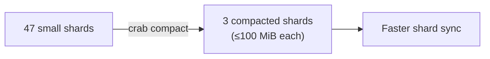

## Metadata Compaction

Every push creates new metadata shards that describe which chunks belong to which files. Over time, incremental pushes produce many small shards. Each fetch or hydrate must download and parse every shard individually — so shard count directly impacts sync performance.

Compaction merges many small shards into fewer large ones, reducing network round-trips and speeding up subsequent operations.



## How Compaction Works

1. Selects repository authority. Capsule v2 pins one authenticated root,
   per-ref frontier, checkpoint, capsule set, and pointer catalog; v1 reads the
   legacy shard list. Corrupt v2 authority fails closed.
2. Downloads the selected shards into a temporary workspace, verifying each
   content hash before parsing.
3. Merges the complete set with xet-core's shard merging algorithm, respecting
   the maximum shard size limit.
4. Removes file records outside the authenticated v2 catalog and Xorb metadata
   not referenced by a retained file, then proves every authenticated file
   occurs exactly once in the replacement.
5. Uploads immutable replacement shards, verifies every replacement shard and
   retained Xorb body against the new catalog, and registers the new GC roots.
6. For v2, consolidates the pinned Git packs and publishes the replacement
   pointer catalog as a checkpoint with an exact-root compare-and-swap. For v1,
   compare-and-swap updates the legacy shard list.

Source shards are left in place for garbage collection to clean up later.

## Usage

### Preview without making changes

```bash
crab compact --repo org/models --bucket my-crab-bucket --dry-run
```

Reports how many shards would be merged without downloading or uploading shard
bodies. Capsule-v2 dry-runs still read and authenticate the repository view.

### Compact with defaults (100 MiB max shard size)

```bash
crab compact --repo org/models --bucket my-crab-bucket
```

### Custom shard size limit

```bash
crab compact --repo org/models --bucket my-crab-bucket --max-shard-size 50MiB
```

Smaller compacted shards trade fewer total shards for lower per-shard download
latency—useful when shard sync latency matters more than minimizing shard count.
The supported range is 1 MiB through 512 MiB.

## When to Compact

| Signal | Action |
|--------|--------|
| Dozens of small shards accumulated | Compact to reduce sync overhead |
| `crab fetch` or `crab hydrate` feels slow | Fewer shards = fewer round-trips |
| After many incremental pushes | Periodic maintenance (e.g., weekly in CI) |

## Concurrency Safety

Compaction holds a renewable repository maintenance lease and the GC writer
fence, and it is safe to retry. Pushes may continue: immutable candidates are
safe before publication, v2's exact-root compare-and-swap prevents a stale
checkpoint from replacing root state, and per-ref updates that occur after the
captured view remain visible as a suffix. Registry union preserves concurrent
push roots. Cancellation is checked between bounded download, parse, and
publish units.

## Compaction vs. Repacking

| | `crab compact` | `crab repack` |
|---|---|---|
| **Operates on** | Metadata shards | Git pack files |
| **Goal** | Reduce shard count for faster sync | Reduce pack count for faster listing |
| **Impact** | Speeds up fetch/hydrate | Speeds up clone/fetch |

## CLI Reference

For complete command syntax and all available flags, see the [crab compact reference](/docs/cli/reference/crab-compact).
