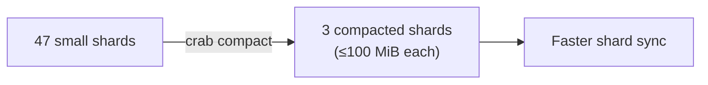

## Metadata Compaction

Every push creates new metadata shards that describe which chunks belong to which files. Over time, incremental pushes produce many small shards. Each fetch or hydrate must download and parse every shard individually — so shard count directly impacts sync performance.

Compaction merges many small shards into fewer large ones, reducing network round-trips and speeding up subsequent operations.



## How Compaction Works

1. Reads the repository's shard-list to discover all current shards.
2. Downloads all shards to a temporary directory.
3. Merges them using xet-core's shard merging algorithm, respecting the maximum shard size limit.
4. Strips unreferenced xorb-info entries — in global-dedup layouts, merged shards may carry metadata from other repositories.
5. Uploads compacted shards to the remote store.
6. Atomically updates the shard-list, then conservatively CAS-unions its
   committed roots into the partitioned ref-registry. Exact stale-root removal
   is reserved for exclusive registry repair so a concurrent push cannot lose
   its pre-registered roots.

Source shards are left in place for garbage collection to clean up later.

## Usage

### Preview without making changes

```bash
crab compact --repo org/models --bucket my-crab-bucket --dry-run
```

Reports how many shards would be merged without downloading or uploading anything.

### Compact with defaults (100 MiB max shard size)

```bash
crab compact --repo org/models --bucket my-crab-bucket
```

### Custom shard size limit

```bash
crab compact --repo org/models --bucket my-crab-bucket --max-shard-size 50MiB
```

Smaller compacted shards trade fewer total shards for lower per-shard download latency — useful when shard sync latency matters more than minimizing shard count.

## When to Compact

| Signal | Action |
|--------|--------|
| Dozens of small shards accumulated | Compact to reduce sync overhead |
| `crab fetch` or `crab hydrate` feels slow | Fewer shards = fewer round-trips |
| After many incremental pushes | Periodic maintenance (e.g., weekly in CI) |

## Concurrency Safety

Compaction is safe to run concurrently with pushes — the CAS update ensures atomicity. However, two concurrent compactions on the same repository may cause one to fail with a CAS conflict. Retrying is safe.

## Compaction vs. Repacking

| | `crab compact` | `crab repack` |
|---|---|---|
| **Operates on** | Metadata shards | Git pack files |
| **Goal** | Reduce shard count for faster sync | Reduce pack count for faster listing |
| **Impact** | Speeds up fetch/hydrate | Speeds up clone/fetch |

## CLI Reference

For complete command syntax and all available flags, see the [crab compact reference](/docs/cli/reference/crab-compact).
